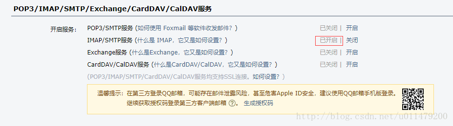
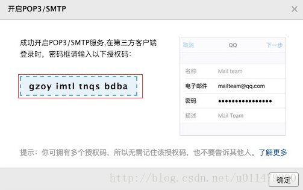
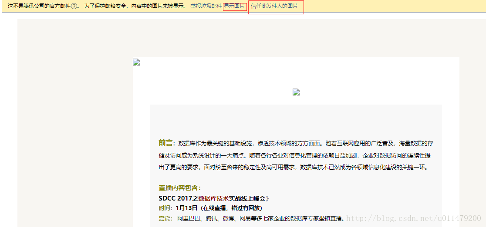

## SSL协议与IMAP、SMTP服务

### TLS和SSL协议介绍

#### SSL协议
SSL（Secure Socket Layer，安全套接字层），位于可靠的面向连接的网络层协议和应用层协议之间的一种协议层。SSL通过互相认证、使用数字签名确保完整性、使用加密确保私密性，以实现客户端和服务器之间的安全通讯。该协议由两层组成：SSL记录协议和SSL握手协议。

SSL协议提供的服务主要有：

* 认证用户和服务器，确保数据发送到正确的客户机和服务器；    
* 加密数据以防止数据中途被窃取；    
* 维护数据的完整性，确保数据在传输过程中不被改变。    

#### TLS协议
TLS(Transport Layer Security，传输层安全协议)，用于两个应用程序之间提供保密性和数据完整性。该协议由两层组成：TLS记录协议和TLS握手协议。

SSL是Netscape开发的专门用户保护Web通讯的，目前版本为3.0。最新版本的TLS 1.0是IETF(工程任务组)制定的一种新的协议，它建立在SSL 3.0协议规范之上，是SSL 3.0的后续版本。两者差别极小，可以理解为SSL 3.1，它是写入了RFC的。

#### SSL协议与TLS协议关系
最新版本的TLS（Transport Layer Security，传输层安全协议）是IETF（Internet Engineering Task Force，Internet工程任务组）制定的一种新的协议，它建立在SSL 3.0协议规范之上，是SSL 3.0的后续版本。在TLS与SSL3.0之间存在着显著的差别，主要是它们所支持的加密算法不同，所以TLS与SSL3.0不能互操作。

TLS与SSL的差异,简单的理解就是并列关系,其主要的差异体现在一下几个方面:

* 1）版本号：TLS记录格式与SSL记录格式相同，但版本号的值不同，TLS的版本1.0使用的版本号为SSLv3.1。    
* 2）报文鉴别码：SSLv3.0和TLS的MAC算法及MAC计算的范围不同。TLS使用了RFC-2104定义的HMAC算法。SSLv3.0使用了相似的算法，两者差别在于SSLv3.0中，填充字节与密钥之间采用的是连接运算，而HMAC算法采用的是异或运算。但是两者的安全程度是相同的。    
* 3）伪随机函数：TLS使用了称为PRF的伪随机函数来将密钥扩展成数据块，是更安全的方式。    
* 4）报警代码：TLS支持几乎所有的SSLv3.0报警代码，而且TLS还补充定义了很多报警代码，如解密失败（decryption_failed）、记录溢出（record_overflow）、未知CA（unknown_ca）、拒绝访问（access_denied）等。    
* 5）密文族和客户证书：SSLv3.0和TLS存在少量差别，即TLS不支持Fortezza密钥交换、加密算法和客户证书。    
* 6）certificate_verify和finished消息：SSLv3.0和TLS在用certificate_verify和finished消息计算MD5和SHA-1散列码时，计算的输入有少许差别，但安全性相当。    
* 7）加密计算：TLS与SSLv3.0在计算主密值（master secret）时采用的方式不同。    
* 8）填充：用户数据加密之前需要增加的填充字节。在SSL中，填充后的数据长度要达到密文块长度的最小整数倍。而在TLS中，填充后的数据长度可以是密文块长度的任意整数倍（但填充的最大长度为255字节），这种方式可以防止基于对报文长度进行分析的攻击。    

### 开启IMAP/SMTP服务
**邮箱授权码介绍**：

一些邮箱的服务商为了用户的使用安全推出了授权码,用于做为登录第三方客户端的专用密码。一般在邮箱账号的设置项中有开POP3/IMAP/SMTP/Exchange/CardDAV/CalDAV的服务。然后通过平台验证就会获取该邮箱账号的授权码。

这里以QQ邮箱获取授权码为例子介绍下,QQ邮箱的授权码基本操作如下:

#### QQ邮箱设置

**QQ邮箱设置账户**

我这里以开启IMAP/SMTP服务为例子

通过QQ的密密保验证后,我们可以看到下方的授权码

然后在我们的程序中将该授权码当做密码使用即可.

**邮件图片不显示**

一些邮箱服务商出于邮箱安全，将邮件内容中的图片未被显示。 出现这样的问题需要用户设置信任发件人,显示图片.

这里以QQ邮箱为例子:

### 公网邮箱安全参数
我们在客户端设置邮箱或者JavaMail编程的时候，我们都会去查找这些公网邮箱的 IMAP/SMTP/POP3 地址,这里总结了主流的邮件服务商关于IMAP/SMTP/POP3 地址和端口的参数设置。

#### Gmail的IMAP/SMTP/POP3 地址
| 服务器名称 | 服务器地址     | SSL协议端口 | 非SSL协议端口 |
| ---------- | -------------- | ----------- | ------------- |
| IMAP       | imap.gmail.com | 993         | /             |
| SMTP       | smtp.gmail.com | 465         | /             |
| POP3       | pop.gmail.com  | 995         | /             |

#### QQMail的IMAP/SMTP/POP3地址
| 服务器名称 | 服务器地址  | SSL协议端口 | 非SSL协议端口 |
| ---------- | ----------- | ----------- | ------------- |
| IMAP       | imap.qq.com | 993         | 143           |
| SMTP       | smtp.qq.com | 465或587    | 25            |
| POP3       | pop.qq.com  | 995         | 110           |

#### 163邮箱的IMAP/SMTP/POP3地址
| 服务器名称 | 服务器地址   | SSL协议端口 | 非SSL协议端口 |
| ---------- | ------------ | ----------- | ------------- |
| IMAP       | imap.163.com | 993         | 143           |
| SMTP       | smtp.163.com | 465或994    | 25            |
| POP3       | pop.163.com  | 995         | 110           |

#### 阿里云邮箱的IMAP/SMTP/POP3地址
| 服务器名称 | 服务器地址      | SSL协议端口 | 非SSL协议端口 |
| ---------- | --------------- | ----------- | ------------- |
| IMAP       | imap.aliyun.com | 993         | 143           |
| SMTP       | smtp.aliyun.com | 465         | 25            |
| POP3       | pop3.aliyun.com | 995         | 110           |

#### 微软outlook邮箱的IMAP/SMTP/POP3地址
| 服务器名称 | 服务器地址           | SSL协议端口 | 非SSL协议端口 |
| ---------- | -------------------- | ----------- | ------------- |
| IMAP       | pod51003.outlook.com | 993         | /             |
| SMTP       | pod51003.outlook.com | /           | 587(TLS)      |
| POP3       | pod51003.outlook.com | 995         | /             |

