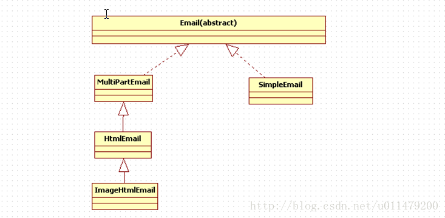
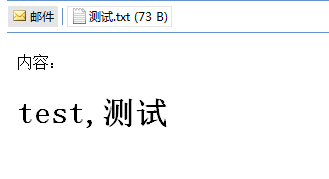

## Apache Commons Email使用
Commons Email是Apache的Commons子项目下的一个邮件客户端组件，它是基于JavaMail的，大大简化了邮件的收发操作。

### 引入依赖
```xml
<dependency>
    <groupId>org.apache.commons</groupId>
    <artifactId>commons-email</artifactId>
    <version>1.5</version>
</dependency>
```

### Email类图结构


### Apache Commons基本使用

#### 简单文本电子邮件
```java
public static void aliyun() throws EmailException {
    Email email = new SimpleEmail();
    email.setHostName("smtp.aliyun.com");
    email.setSmtpPort(465);
    email.setAuthenticator(new DefaultAuthenticator("yveshe@aliyun.com", "邮箱密码"));
    email.setSSLOnConnect(true);
    email.setCharset("UTF-8");
    email.setSubject("TestMail");
    email.setFrom("yveshe@aliyun.com");
    email.setMsg("你好,This is a test mail ... :-)");
    email.addTo("879838091@qq.com");
    email.send();
    System.out.println("Success!");
}
```
注意:

Email 实例对象的setHostName（”mail.myserver.com”）的显示调用设置将用于发送邮件的传出SMTP服务器的地址。如果没有设置，将从系统属性“mail.host”中获得.


#### 带附件的电子邮件
```java
public static void attachmentsEmail() throws EmailException {
    // Create the attachment
    EmailAttachment attachment = new EmailAttachment();
    attachment.setPath("resources/Yves.jpg");
    attachment.setDisposition(EmailAttachment.ATTACHMENT);
    attachment.setDescription("Picture of Yves"); // 附件描述,无实际意义
    attachment.setName("Yves.jpg"); // 设置附件名称
    // attachment.setURL(new URL("http://www.apache.org/images/asf_logo_wide.gif")); //附件可以是网络资源

    // Create the email message
    MultiPartEmail email = new MultiPartEmail();
    email.setHostName("smtp.aliyun.com");
    email.addTo("879838091@qq.com", " QQ_Yves");
    email.setFrom("yveshe@aliyun.com", " Aliyun_Yves");
    email.setSubject("The picture");
    email.setMsg("Here is the picture you wanted");

    // Authenticator
    email.setSSLOnConnect(true);
    email.setSmtpPort(465);
    email.setAuthenticator(new DefaultAuthenticator("yveshe@aliyun.com", "邮箱密码"));

    // add the attachment
    email.attach(attachment);

    email.send();

    System.out.println("Success!");
}
```

#### HTML格式的邮件
发送HTML格式的电子邮件是通过使用HtmlEmail类来完成的。该类的工作方式与MultiPartEmail类完全相同，其中包括用于设置html内容的方法，如果收件人不支持HTML电子邮件，则添加替代文本内容，并添加内嵌图像。
```java
public static void htmlEmail() throws EmailException, MalformedURLException {
    // Create the email message
    HtmlEmail email = new HtmlEmail();
    email.setHostName("smtp.aliyun.com");
    email.addTo("879838091@qq.com", "QQ_Yves");
    email.setFrom("yveshe@aliyun.com", "Aliyun_Yves");
    email.setSubject("Test email with inline image");
    email.setAuthenticator(new DefaultAuthenticator("yveshe@aliyun.com", "邮箱密码"));

    // embed the image and get the content id
    URL url = new URL("http://www.apache.org/images/asf_logo_wide.gif");
    String cid = email.embed(url, "Apache logo"); // 该字符串是随机生成的标识符，必须用于引用图像标签中的图像。
    System.out.println(cid);

    // set the html message
    email.setHtmlMsg("<html>The apache logo - </html>");

    // set the alternative message
    email.setTextMsg("Your email client does not support HTML messages");// 注意:setHtmlMsg或者setTextMsg
                                                                         // 而不是setMsg方法

    // send the email
    email.send();

    System.out.println("Success!");
}
```

如果在我们的电子邮箱中,使用的内嵌图数量很少时,可以使用上面的方式,但是如果是大量的内嵌在线图片时,我们可以通过使用ImageHtmlEmail来解决每次输入全路径的URL问题.
```java
public static void htmlEmailEmbeddedImg() throws EmailException, MalformedURLException {
    // load your HTML email template
    String htmlEmailTemplate = "....  ...."; // 配置了URL可以写成images/feather.gif

    // define you base URL to resolve relative resource locations
    URL url = new URL("http://www.apache.org");

    // create the email message
    ImageHtmlEmail email = new ImageHtmlEmail();
    email.setDataSourceResolver(new DataSourceUrlResolver(url));
    email.setHostName("smtp.aliyun.com");
    email.addTo("879838091@qq.com", "QQ_Yves");
    email.setFrom("yveshe@aliyun.com", "Aliyun_Yves");
    email.setSubject("Test email with inline image");

    // Authenticator
    email.setSSLOnConnect(true);
    email.setSmtpPort(465);
    email.setAuthenticator(new DefaultAuthenticator("yveshe@aliyun.com", "邮箱密码"));

    // set the html message
    email.setHtmlMsg(htmlEmailTemplate);

    // set the alternative message
    email.setTextMsg("Your email client does not support HTML messages");

    // send the email
    email.send();

    System.out.println("Success!");
}
```

说明:我们创建一个引用一些图像的HTML电子邮件模板。所有引用的图像都通过指定的DataSourceResolver自动转换为内嵌图像。

### 我的测试
```java
import org.apache.commons.mail.*;
import org.junit.Test;

import java.net.MalformedURLException;
import java.net.URL;

public class CommonsEmailTest {

    @Test
    public void testSimpleEmail() throws EmailException {
        Email email = new SimpleEmail();
        email.setHostName("smtp.163.com");
        //email.setSmtpPort(465);//似乎设不设置都能发送
        email.setAuthentication("18638489474@163.com", "l123456");//163这里填的是授权码
        email.setSSLOnConnect(true);
        email.setFrom("18638489474@163.com");
        email.setSubject("测试邮件");
        email.setMsg("测试邮件发送。。。。");
        email.addTo("904319017@qq.com");
        email.send();
    }

    @Test
    public void testMultiPartEmail() throws EmailException {
        // Create the attachment
        EmailAttachment attachment = new EmailAttachment();
        attachment.setPath("D:\\img_tmp\\background.jpg");
        attachment.setDisposition(EmailAttachment.ATTACHMENT);
        attachment.setDescription("my background");// 附件描述,无实际意义
        attachment.setName("background.jpg");// 设置附件名称，附件中文件的名称

        // Create the email message
        MultiPartEmail email = new MultiPartEmail();
        email.setHostName("smtp.163.com");
        email.addTo("904319017@qq.com", "John Doe");
        email.setFrom("18638489474@163.com", "Me");
        email.setSubject("The background picture");
        email.setMsg("Here is the picture you wanted");

        // Authenticator
        email.setSSLOnConnect(true);
        email.setSmtpPort(465);
        email.setAuthenticator(new DefaultAuthenticator("18638489474@163.com", "l123456"));

        // add the attachment
        email.attach(attachment);

        // send the email
        email.send();
    }

    @Test
    public void testMultiPartEmailUseURL() throws EmailException, MalformedURLException {
        // Create the attachment
        EmailAttachment attachment = new EmailAttachment();
        attachment.setURL(new URL("http://pic1.win4000.com/wallpaper/c/59b8e3a60eb36.jpg"));
        attachment.setDisposition(EmailAttachment.ATTACHMENT);
        attachment.setDescription("my background");// 附件描述,无实际意义
        attachment.setName("background.jpg");// 设置附件名称，附件中文件的名称

        // Create the email message
        MultiPartEmail email = new MultiPartEmail();
        email.setHostName("smtp.163.com");
        email.addTo("904319017@qq.com", "John Doe");
        email.setFrom("18638489474@163.com", "Me");
        email.setSubject("The background picture");
        email.setMsg("Here is the picture you wanted");

        // Authenticator
        email.setSSLOnConnect(true);
        email.setSmtpPort(465);
        email.setAuthenticator(new DefaultAuthenticator("18638489474@163.com", "l123456"));

        // add the attachment
        email.attach(attachment);

        // send the email
        email.send();
    }

    @Test
    public void testHtmlEmail() throws EmailException, MalformedURLException {
        // HtmlEmail extends MultiPartEmail 所以HtmlEmail也可以添加附件
        HtmlEmail email = new HtmlEmail();
        email.setHostName("smtp.163.com");
        //email.setSmtpPort(465);//似乎设不设置都能发送
        email.setAuthentication("18638489474@163.com", "l123456");//163这里填的是授权码
        email.setSSLOnConnect(true);
        email.setFrom("18638489474@163.com");
        email.addTo("904319017@qq.com");
        email.setSubject("测试邮件");

        // embed the image and get the content id
        URL url = new URL("http://pic1.win4000.com/wallpaper/c/59b8e3a60eb36.jpg");
        String cid = email.embed(url, "Apache logo");

        //使用本地文件系统的图片
        url = new URL("file:///D:/img_tmp/background.jpg");
        String cid1 = email.embed(url, "background");

        // set the html message/
        email.setHtmlMsg("<html><h2>111</h2><h4>2222</h4><div>333</div>" +
                "<table><tr><td>title1</td><td>title2</td></tr><tr><td>aaaaa</td><td>bbbb</td></tr></table>" +
                "  </html>");

        // set the alternative message
        email.setTextMsg("Your email client does not support HTML messages");

        // send the email
        email.send();
    }

}
```

### 封装commons-email发送邮件
摘抄自网络`https://www.cnblogs.com/haha12/p/4730274.html`

#### MailInfo.java：邮件实体类
MailInfo.java：邮件实体类
```java
package com.test.mail;

import java.util.List;

import org.apache.commons.mail.EmailAttachment;

/**
 * 邮件相关信息
 * 
 */
public class MailInfo {
    
    // 收件人
    private List<String> toAddress = null;
    // 抄送人地址
    private List<String> ccAddress = null;
    // 密送人
    private List<String> bccAddress = null;
    // 附件信息
    private List<EmailAttachment> attachments = null;
    // 邮件主题
    private String subject;
    // 邮件的文本内容
    private String content;
}
```

#### MailUtil.java：发送邮件工具类
MailUtil.java：发送邮件工具类
```java
package com.test.mail;

import java.util.List;

import org.apache.commons.mail.EmailAttachment;
import org.apache.commons.mail.EmailException;
import org.apache.commons.mail.HtmlEmail;

/**
 * 发送邮件Util
 */
public class MailUtil {
    
    //邮箱
    private static String mailServerHost = "smtp.163.com";
    private static String mailSenderAddress = "test@163.com";
    private static String mailSenderNick = "test";
    private static String mailSenderUsername = "test@163.com";
    private static String mailSenderPassword = "xxx";
    
    /**
     * 发送 邮件方法 (Html格式，支持附件)
     * 
     * @return void
     */
    public static void sendEmail(MailInfo mailInfo) {
         
        try {
            HtmlEmail email = new HtmlEmail();
            // 配置信息
            email.setHostName(mailServerHost);
            email.setFrom(mailSenderAddress,mailSenderNick);
            email.setAuthentication(mailSenderUsername,mailSenderPassword);
            email.setCharset("UTF-8");
            email.setSubject(mailInfo.getSubject());
            email.setHtmlMsg(mailInfo.getContent());

            // 添加附件
            List<EmailAttachment> attachments = mailInfo.getAttachments();
            if (null != attachments && attachments.size() > 0) {
                for (int i = 0; i < attachments.size(); i++) {
                    email.attach(attachments.get(i));
                }
            }
            
            // 收件人
            List<String> toAddress = mailInfo.getToAddress();
            if (null != toAddress && toAddress.size() > 0) {
                for (int i = 0; i < toAddress.size(); i++) {
                        email.addTo(toAddress.get(i));
                }
            }
            // 抄送人
            List<String> ccAddress = mailInfo.getCcAddress();
            if (null != ccAddress && ccAddress.size() > 0) {
                for (int i = 0; i < ccAddress.size(); i++) {
                        email.addCc(ccAddress.get(i));
                }
            }
            //邮件模板 密送人
            List<String> bccAddress = mailInfo.getBccAddress();
            if (null != bccAddress && bccAddress.size() > 0) {
                for (int i = 0; i < bccAddress.size(); i++) {
                    email.addBcc(ccAddress.get(i));
                }
            }
            email.send();
            System.out.println("邮件发送成功！");
        } catch (EmailException e) {
            e.printStackTrace();
        } 

    }
}
```

#### TestMail.java：发送邮件测试类
TestMail.java：发送邮件测试类
```java
package com.test.mail;

import java.util.ArrayList;
import java.util.List;

import org.apache.commons.mail.EmailAttachment;

public class TestMail {

    /**
     * @return void
     */
    public static void main(String[] args) {
        MailInfo mailInfo = new MailInfo();
        List<String> toList = new ArrayList<String>();
        toList.add("my@163.com");
        
        List<String> ccList = new ArrayList<String>();
        ccList.add("my@163.com");
        
        List<String> bccList = new ArrayList<String>();
        bccList.add("my@163.com");
        
        //添加附件
        EmailAttachment att = new EmailAttachment();
        att.setPath("g:\\测试.txt");
        att.setName("测试.txt");
        List<EmailAttachment> atts = new ArrayList<EmailAttachment>();
        atts.add(att);
        mailInfo.setAttachments(atts);
        
        mailInfo.setToAddress(toList);//收件人
        mailInfo.setCcAddress(ccList);//抄送人
        mailInfo.setBccAddress(bccList);//密送人
        
        mailInfo.setSubject("测试主题");
        mailInfo.setContent("内容：<h1>test,测试</h1>");
         
        MailUtil.sendEmail(mailInfo);

    }
}
```
代码执行后收到邮件的截图：



```java

```
