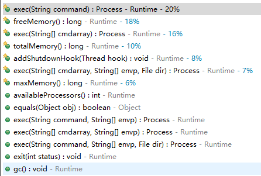
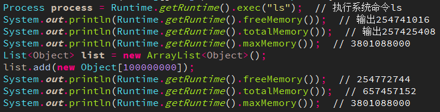
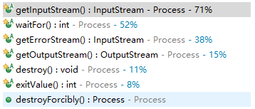
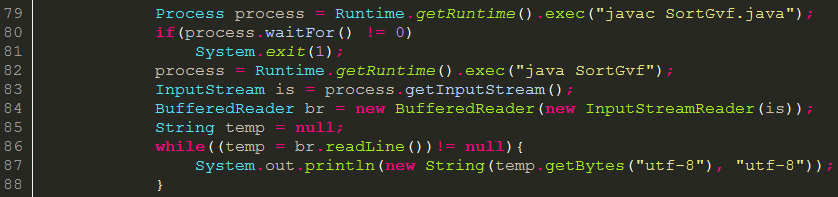
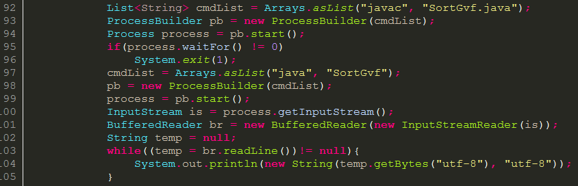
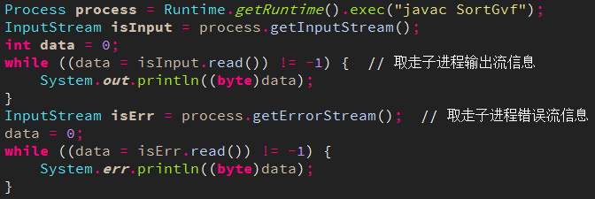

## Java进程Runtime、Process、ProcessBuilder调用外部程序
`https://blog.csdn.net/c315838651/article/details/72085739`

通过Java执行系统命令，与cmd中或者终端上一样执行shell命令，最典型的用法就是使用Runtime.getRuntime().exec(command)或者new ProcessBuilder(cmdArray).start()。让我们看看Runtime、ProcessBuilder的详细解析和详细用法。

### Runtime
Runtime类是Java程序的运行时环境。不能new出一个Runtime对象，只能通过getRuntime()方法获取当前Runtime运行时对象的引用。然后可以调用Runtime的方法查看和修改Java虚拟机的状态。

Runtime和ProcessBuilder的不同点就是，启动子进程时的命令形式不同，Runtime.getRuntime.exec()可以把命令和参数写在一个String中，用空格分开，ProcessBuilder则是构造函数的参数中，传递一个由命令和参数组成的list或数组。

Runtime类主要的方法如下，


* exec方法接收一个命令然后执行，通过该方法可以执行和cmd中用法一样命令。比如，Runtime.getRuntime().exec(“ls”)，就和cmd中执行ls效果一样了。    
* freeMemory()可以查看当前虚拟机内存中空闲内存还有多少。    
* totalMemory()可以查看当前虚拟机使用的总内存大小。    
* maxMemory()可以查看JVM的最终可以使用的最大内存是多少。    
* availableProcessors()可以查看本机有多少处理器，即本机处理器是多少核。    
* exit(int)方法可以退出当前Java程序的运行，System.exit(int)方法就是调用了Runtime.exit(int)方法来退出运行的。  


示例，


### Process
Process是一个抽象类，主要方法如下：


* waitFor()是让当前主进程等待这个process指向的子进程执行完成。    
* exitValue()可以查看process指向的子进程执行完的退出值，0代表是正常运行结束。    
* destroy()和destroyForcibly()可以终止process子进程的运行，后者是强制终止，前者与平台终止进程的具体实现有关。   


通过Runtime.getRuntime().exe(string)可以创建一个本地进程执行传入的命令，这个方法返回Process的一个实例。如，


process指向一个本地进程，相对于main进程来说，process指向的称为子进程。其中的is是为了获取子进程的输出信息。

明明是获取输出信息，为什么是InputStream呢？因为相对于main进程来说，子进程的输出就是main进程的输入，所以是InputStream。vice verse，如果要向子进程传递参数或者输入信息，则应该用OutputStream。但是不推荐用java 1.0引入的Process，而是用java 5.0的ProcessBuilder替代。

### ProcessBuilder
ProcessBuilder是java 5.0引入的，start()方法返回Process的一个实例，如，


创建ProcessBuilder不需要通过Runtime，而Runtime.getRimtime().exec(string)正是调用了ProcessBuilder的构造方法来创建子进程并执行的。

ProcessBuilder的构造方法接收一个命令参数的数组形式，其中，第一个元素代表要执行的系统命令，后面的元素代表要传给该命令的参数。

调用.start()方法运行之后，就可以获得该子进程的Process引用了，然后就可以调用Process的方法进行处理。


### 注意
在用Runtime.getRuntime().exec()或ProcessBuilder(array).start()创建子进程Process之后，一定要及时取走子进程的输出信息和错误信息，否则输出信息流和错误信息流很可能因为信息太多导致被填满，最终导致子进程阻塞住，然后执行不下去。

典型用法应该为，



```java

```


