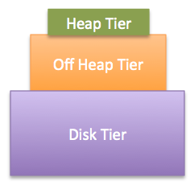

## EhCache3

### 依赖
```xml
<dependency>
    <groupId>org.ehcache</groupId>
    <artifactId>ehcache</artifactId>
    <version>3.8.1</version>
</dependency>
```

### 官方的入门案例
#### Programmatic configuration(编码配置)
```java
CacheManager cacheManager = CacheManagerBuilder.newCacheManagerBuilder() 
    .withCache("preConfigured",
        CacheConfigurationBuilder.newCacheConfigurationBuilder(Long.class, String.class, ResourcePoolsBuilder.heap(10))) 
    .build(); 
cacheManager.init(); 

Cache<Long, String> preConfigured =
    cacheManager.getCache("preConfigured", Long.class, String.class); 

Cache<Long, String> myCache = cacheManager.createCache("myCache", 
    CacheConfigurationBuilder.newCacheConfigurationBuilder(Long.class, String.class, ResourcePoolsBuilder.heap(10)));

myCache.put(1L, "da one!"); 
String value = myCache.get(1L); 

cacheManager.removeCache("preConfigured"); 

cacheManager.close(); 
```

#### XML configuration(XML配置)
```xml
<config
    xmlns:xsi='http://www.w3.org/2001/XMLSchema-instance'
    xmlns='http://www.ehcache.org/v3'
    xsi:schemaLocation="http://www.ehcache.org/v3 http://www.ehcache.org/schema/ehcache-core.xsd">

  <cache alias="foo"> 
    <key-type>java.lang.String</key-type> 
    <value-type>java.lang.String</value-type> 
    <resources>
      <heap unit="entries">20</heap> 
      <offheap unit="MB">10</offheap> 
    </resources>
  </cache>

  <cache-template name="myDefaults"> 
    <key-type>java.lang.Long</key-type>
    <value-type>java.lang.String</value-type>
    <heap unit="entries">200</heap>
  </cache-template>

  <cache alias="bar" uses-template="myDefaults"> 
    <key-type>java.lang.Number</key-type>
  </cache>

  <cache alias="simpleCache" uses-template="myDefaults" /> 

</config>
```

```java
URL myUrl = getClass().getResource("/my-config.xml"); 
Configuration xmlConfig = new XmlConfiguration(myUrl); 
CacheManager myCacheManager = CacheManagerBuilder.newCacheManager(xmlConfig);
```

### 最简单的例子
```xml
<dependency>
            <groupId>org.ehcache</groupId>
            <artifactId>ehcache</artifactId>
            <version>3.8.1</version>
        </dependency>

        <dependency>
            <groupId>org.slf4j</groupId>
            <artifactId>slf4j-log4j12</artifactId>
            <version>1.7.25</version>
        </dependency>
        <dependency>
            <groupId>log4j</groupId>
            <artifactId>log4j</artifactId>
            <version>1.2.17</version>
            <scope>runtime</scope>
        </dependency>
```
log4j.xml
```xml
<?xml version="1.0" encoding="UTF-8"?>
<!DOCTYPE log4j:configuration SYSTEM "log4j.dtd">

<log4j:configuration>
    <appender name="console" class="org.apache.log4j.ConsoleAppender">
        <param name="Target" value="System.out"/>
        <layout class="org.apache.log4j.PatternLayout">
            <param name="ConversionPattern" value="%d [%t] %p %c - %m%n"/>
        </layout>
    </appender>
    <root>
        <level value="INFO"/>
        <appender-ref ref="console"/>
    </root>
</log4j:configuration>
```

#### Programmatic configuration(编码配置)
```java
import org.ehcache.Cache;
import org.ehcache.CacheManager;
import org.slf4j.Logger;

import static org.ehcache.config.builders.CacheConfigurationBuilder.newCacheConfigurationBuilder;
import static org.ehcache.config.builders.CacheManagerBuilder.newCacheManagerBuilder;
import static org.ehcache.config.builders.ResourcePoolsBuilder.heap;
import static org.ehcache.config.units.MemoryUnit.MB;
import static org.slf4j.LoggerFactory.getLogger;

public class BasicProgrammatic {
    private static final Logger LOGGER = getLogger(BasicProgrammatic.class);

    public static void main(String[] args) {
        LOGGER.info("Creating cache manager programmatically");
        CacheManager cacheManager = null;
        try {
            cacheManager = newCacheManagerBuilder()
                    .withCache("basicCache",
                            newCacheConfigurationBuilder(Long.class, String.class, heap(100).offheap(1, MB)))
                    .build(true);
            Cache<Long, String> basicCache = cacheManager.getCache("basicCache", Long.class, String.class);

            LOGGER.info("Putting to cache");
            basicCache.put(1L, "da one!");
            String value = basicCache.get(1L);
            LOGGER.info("Retrieved '{}'", value);

            LOGGER.info("Closing cache manager");
        }finally {
            if(cacheManager != null){
                cacheManager.close();
            }
        }

        LOGGER.info("Exiting");
    }
}
```

#### XML configuration(XML配置)
```xml
<?xml version="1.0" encoding="UTF-8"?>

<ehcache:config
        xmlns:xsi='http://www.w3.org/2001/XMLSchema-instance'
        xmlns:ehcache='http://www.ehcache.org/v3'
        xsi:schemaLocation="http://www.ehcache.org/v3 http://www.ehcache.org/schema/ehcache-core-3.1.xsd">

    <ehcache:cache alias="basicCache">
        <ehcache:key-type>java.lang.Long</ehcache:key-type>
        <ehcache:value-type>java.lang.String</ehcache:value-type>
        <ehcache:resources>
            <ehcache:heap unit="entries">100</ehcache:heap>
            <ehcache:offheap unit="MB">1</ehcache:offheap>
        </ehcache:resources>
    </ehcache:cache>
</ehcache:config>
```

```java
import org.ehcache.Cache;
import org.ehcache.CacheManager;
import org.ehcache.config.Configuration;
import org.ehcache.xml.XmlConfiguration;
import org.slf4j.Logger;

import static org.ehcache.config.builders.CacheManagerBuilder.newCacheManager;
import static org.slf4j.LoggerFactory.getLogger;

public class BasicXML {
    private static final Logger LOGGER = getLogger(BasicXML.class);

    public static void main(String[] args) {
        LOGGER.info("Creating cache manager via XML resource");
        Configuration xmlConfig = new XmlConfiguration(BasicXML.class.getResource("/ehcache.xml"));
        CacheManager cacheManager = null;
        try{
            cacheManager = newCacheManager(xmlConfig);
            cacheManager.init();

            Cache<Long, String> basicCache = cacheManager.getCache("basicCache", Long.class, String.class);

            LOGGER.info("Putting to cache");
            basicCache.put(1L, "da one!");
            String value = basicCache.get(1L);
            LOGGER.info("Retrieved '{}'", value);

            LOGGER.info("Closing cache manager");
        }finally {
            if(cacheManager != null){
                cacheManager.close();
            }
        }

        LOGGER.info("Exiting");
    }
}
```

### 存储层
Ehcache3.x提供了一种分层模型。ehcache 的缓存储存主要分为以下3层：

* heap：JVM byted-size 堆缓存，速度最快；    
* off-heap：JVM 堆外内存，速度低于 heap，但是高于 disk；    
* disk：磁盘储存，速度最低，相对于 heap ，off-heap可以分配大量资源空间；  

```java
PersistentCacheManager persistentCacheManager = CacheManagerBuilder.newCacheManagerBuilder()
    .with(CacheManagerBuilder.persistence(getStoragePath() + File.separator + "myData")) 
    .withCache("persistent-cache", CacheConfigurationBuilder.newCacheConfigurationBuilder(Long.class, String.class,
        ResourcePoolsBuilder.newResourcePoolsBuilder()
            .heap(10, EntryUnit.ENTRIES)
            .disk(10, MemoryUnit.MB, true)) 
        )
    .build(true);

persistentCacheManager.close();
```
上面的例子分配了非常少量的堆外。请记住，堆外存储的数据必须被序列化和反序列化 - 因此比堆慢。因此，您应该支持大量数据的堆外堆，其中堆上会对垃圾收集产生太严重的影响。不要忘记-XX:MaxDirectMemorySize根据您打算使用的堆外大小在java选项中定义该选项。

### 磁盘持久性
```java
PersistentCacheManager persistentCacheManager = CacheManagerBuilder.newCacheManagerBuilder()
    .with(CacheManagerBuilder.persistence(getStoragePath() + File.separator + "myData")) 
    .withCache("persistent-cache", CacheConfigurationBuilder.newCacheConfigurationBuilder(Long.class, String.class,
        ResourcePoolsBuilder.newResourcePoolsBuilder()
            .heap(10, EntryUnit.ENTRIES)
            .disk(10, MemoryUnit.MB, true)) 
        )
    .build(true);

persistentCacheManager.close();
```

如果您希望使用磁盘存储（例如对于持久Cache实例），则必须提供将数据存储在磁盘上的CacheManagerBuilder.persistence(String)静态方法的位置。

定义磁盘的资源池。第三个参数是一个布尔值，用于设置磁盘池是否持久。设置为true时，池是持久的，当设置为false时，池不是持久的。如果在没有第三个布尔参数的情况下使用此方法，则池不是持久的。

### 分层的选项
Ehcache支持分层缓存的概念。

当想缓存堆内存以外的空间时，会发生下面的事情：

* 1.将数据添加到缓存意味着必须序列化key和value。    
* 2.从缓存中读取数据意味着可能必须反序列化key和value。  

#### 单层设置
所有的单层选项都可以单独使用。例如，您可以将缓存包含仅在offheap中的数据。

以下可能性是有效配置：

* 堆    
* offheap    
* 磁盘 

 
```java
CacheConfigurationBuilder.newCacheConfigurationBuilder(Long.class, String.class, 
ResourcePoolsBuilder.newResourcePoolsBuilder().offheap(2, MemoryUnit.GB)).build(); 
```
首先在配置构建器中定义键和值类型。然后指定要使用的资源（层）。这里我们只使用off-heap。

#### 堆层
每个缓存的起点也越快，因为不需要序列化。按值传递键和值，默认值为by-reference。堆层可以通过条目或大小来确定大小。

```java
ResourcePoolsBuilder.newResourcePoolsBuilder().heap(10, EntryUnit.ENTRIES); 
// or
ResourcePoolsBuilder.newResourcePoolsBuilder().heap(10); 
// or
ResourcePoolsBuilder.newResourcePoolsBuilder().heap(10, MemoryUnit.MB); 

1.堆上只允许10个条目。
2.指定10个条目的数据。
3.只允许10 MB。
```

#### 堆外层
如果希望使用堆外，则必须定义资源池，并提供要分配的内存大小。
```java
ResourcePoolsBuilder.newResourcePoolsBuilder().offheap(10, MemoryUnit.MB);
```
请记住，堆外存储的数据必须被序列化和反序列化 - 因此比堆慢。因此，您应该支持大量数据的堆外堆，其中堆上会对垃圾收集产生太严重的影响。

#### 磁盘层
对于磁盘层，数据存储在磁盘上。磁盘越快，越专用，访问数据的速度就越快。
```java
PersistentCacheManager persistentCacheManager = CacheManagerBuilder.newCacheManagerBuilder() 
  .with(CacheManagerBuilder.persistence(new File(getStoragePath(), "myData"))) 
  .withCache("persistent-cache", CacheConfigurationBuilder.newCacheConfigurationBuilder(Long.class, String.class,
    ResourcePoolsBuilder.newResourcePoolsBuilder().disk(10, MemoryUnit.MB, true)) 
  )
  .build(true);
```
1.获得一个PersistentCacheManager
2.提供应存储数据的位置。
3.定义将由缓存使用的磁盘的资源池。第三个参数是一个布尔值，用于设置磁盘池是否持久。设置为true时，池是持久的。使用具有2个参数的版本时disk(long, MemoryUnit)，池不是持久的。

持久性意味着缓存将在JVM重启后继续存在。重新启动JVM并CacheManager在同一位置创建磁盘持久性后，缓存中的所有内容仍然存在。无法在缓存管理器之间共享磁盘层。持久性目录当时专用于一个缓存管理器。

存储在磁盘上的数据必须被序列化/反序列化并写入磁盘/从磁盘读取 - 因此比堆和远程更慢。

#### 多层设置

Ehcache要求堆层的大小小于offheap层的大小，并且offheap层的大小要小于磁盘层的大小。虽然Ehcache无法在配置时验证堆的基于计数的大小调整是否小于另一层的基于字节的大小调整，但您应该确保在测试期间就是这种情况。

考虑到上述因素，以下可能性是有效的配置：
```
堆+ offheap
堆+ offheap +磁盘
堆+ offheap +集群
堆+磁盘
堆+聚集
```

A classical example would be using 3 tiers with a persistent disk storage.：
```java
PersistentCacheManager persistentCacheManager = CacheManagerBuilder.newCacheManagerBuilder()
    .with(CacheManagerBuilder.persistence(new File(getStoragePath(), "myData"))) 
    .withCache("threeTieredCache",
        CacheConfigurationBuilder.newCacheConfigurationBuilder(Long.class, String.class,
            ResourcePoolsBuilder.newResourcePoolsBuilder()
                .heap(10, EntryUnit.ENTRIES) 
                .offheap(1, MemoryUnit.MB) 
                .disk(20, MemoryUnit.MB, true) 
            )
    ).build(true);

Cache<Long, String> threeTieredCache = persistentCacheManager.getCache("threeTieredCache", Long.class, String.class);
threeTieredCache.put(1L, "stillAvailableAfterRestart"); 

persistentCacheManager.close();
```
这是一个使用3层(堆、堆外、磁盘)的缓存。它们是使用ResourcePoolsBuilder创建和链接的。声明顺序无关紧要(例如可以在堆前声明offheap)，因为每一层都有一个高度。层的高度越高，层就越接近客户端。


```java

```