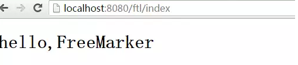

## FreeMarker简介
什么是Freemarker?它是干什么用的?为什么要使用网页静态化技术?

freemarker是一个用Java开发的模板引擎.
　
### 1.什么是Freemarker
FreeMarker 是一个用 Java 语言编写的模板引擎，它基于模板来生成文本输出。FreeMarker不是一个Web应用框架，而适合作为Web应用框架一个组件。FreeMarker 与 Web 容器无关，即在 Web 运行时，它并不知道 Servlet 或 HTTP。它不仅可以用作表现层的实现技术，而且还可以用于生成 XML， JSP 或 Java 等。 

模板编写为FreeMarker Template Language (FTL)。


常用的java模板引擎还有哪些？ Jsp、Freemarker、Thymeleaf 、Velocity 等。

### 2.为什么要使用Freemarker?他的使用场景是什么?　　　　　　
网页静态化解决方案在实际开发中运用比较多，例如新闻网站，门户网站中的新闻频道或者是文章类的频道。也比如说一些电商的商品详情页面，虽然每个商品的详情内容是不一样的，但是它整体的布局是一致了，比如每个商品都有标题，价格，图片，商品介绍等等，我们使用Freemarker将固定不变的内容定义层模板,然后将不动态的内容去从数据库中查询出来,再绑定到模板一个一个对应位置，就可以生成，每个商品自己的详情页了。

那么我们为什么要使用网页静态化呢，像我们以前那样，直接定义好页面，用户访问的时候，再将页面的动态内容查询填充展示不行吗？很显然，使用了网页静态化技术，用户访问的是生成好的静态页面，不用再直接去数据库中取查询数据。网页静态化技术和缓存技术的共同点都是为了减轻数据库的访问压力，但是具体的应用场景不同，缓存比较适合小规模的数据，而网页静态化比较适合大规模且相对变化不太频繁的数据。

另外网页静态化还有利于 SEO。 另外我们如果将网页以纯静态化的形式展现，就可以使用 Nginx 这样的高性能的 web服务器来部署。 Nginx 可以承载 5 万的并发，而 Tomcat 只有几百。关于 Nginx 我在后续的博客中会详细讲解

### 3.模板+数据模型=输出 
freemarker并不关心数据的来源，只是根据模板的内容，将数据模型在模板中显示并输出文件（通常为html，也 可以生成其它格式的文本文件） 

1、数据模型 

数据模型在java中可以是基本类型也可以List、Map、Pojo等复杂类型。 

2、来自官方的例子：（https://freemarker.apache.org/docs/dgui_quickstart_basics.html） 数据模型：

数据模型：

模板：

输出：


### 4.引入Freemarker
#### 一般java工程
pom.xml中导入freemarker的依赖
```xml
<dependency>
    <groupId>org.freemarker</groupId>
    <artifactId>freemarker</artifactId>
    <version>2.3.23</version>
</dependency>
```
在项目目录下建立模板目录：templates

在templates目录下，建立a.ftl模板文件，内容如下：
```html
你好啊，${user}，今天你的精神不错！
```

然后建立Test1.java文件，内容如下：
```java
package com.sxt.test.freemarker;

import java.io.File;
import java.io.OutputStreamWriter;
import java.io.Writer;
import java.util.HashMap;
import java.util.Map;

import freemarker.template.Configuration;
import freemarker.template.DefaultObjectWrapper;
import freemarker.template.Template;

public class Test1 {
	public static void main(String[] args) throws Exception {
		//创建Freemarker配置实例
		Configuration cfg = new Configuration();
		
		cfg.setDirectoryForTemplateLoading(new File("templates")); 
		
		//创建数据模型
		Map root = new HashMap();
		root.put("user", "老高");
		
		//加载模板文件
		Template t1 = cfg.getTemplate("a.ftl");
		
		//显示生成的数据,//将合并后的数据打印到控制台
		Writer out = new OutputStreamWriter(System.out); 
		t1.process(root, out);
		out.flush();
    }
}
```
编译和运行Test1.java文件，控制台打印：


#### FreeMarker和springboot整合
首先，pom.xml中导入freemarker的依赖
```xml
<dependency>
    <groupId>org.springframework.boot</groupId>
    <artifactId>spring-boot-starter-freemarker</artifactId>
</dependency>
```
在application.properties(或yml)配置文件中加入freemarker相关配置：
```properties
#    freemarker静态资源配置
#       设定ftl文件路径
spring.freemarker.tempalte-loader-path=classpath:/templates
#        关闭缓存，及时刷新，上线生产环境需要修改为true
spring.freemarker.cache=false
spring.freemarker.charset=UTF-8
spring.freemarker.check-template-location=true
spring.freemarker.content-type=text/html
spring.freemarker.expose-request-attributes=true
spring.freemarker.expose-session-attributes=true
spring.freemarker.request-context-attribute=request
spring.freemarker.suffix=.ftl
```

```yml
server:
  port: 8088 #服务端口

spring:
  application:
    name: test-freemarker #指定服务名
  freemarker:
    cache: false  #关闭模板缓存，方便测试
    settings:
      template_update_delay: 0 #检查模板更新延迟时间，设置为0表示立即检查，如果时间大于0会有缓存不方便进行模板测试

```
在 src/main/resources下创建templates，此目录为freemarker的默认模板存放目录。 很多属性都是默认的yml文件就没设置那么多属性。

这里指定了freemarker文件的路径是classpath/templates，在resources文件夹下的templates新建freemarker文件夹，并且在其中新建index.ftl（上面配置文件中已经指定了freemarker模板的文件后缀为ftl）：
```html
<!DOCTYPE html>
<html>
<head lang="en">
    <meta charset="UTF-8"/>
    <title></title>
</head>
<body>
<h1>hello,${var}</h1>
</body>
</html>
```
新建Controller包，新建FreeMarkerController类：
```java
package com.example.springboot.Controller;

import org.springframework.stereotype.Controller;
import org.springframework.ui.ModelMap;
import org.springframework.web.bind.annotation.RequestMapping;

@Controller
@RequestMapping("/ftl")
public class FreeMarkerController {

    @RequestMapping("/index")
    public String index(ModelMap modelMap){
        modelMap.addAttribute("var","FreeMarker");
        return "freemarker/index";
    }

}
```
这里的ModelMap就相当于SpringMVC中的ModelAndView，其中的很多方法也很类似，我们这里返回的字符串就是freemarker模板的路径，不用写后缀，因为配置文件中已经指定了后缀为.ftl
浏览器发起请求，得到结果：



