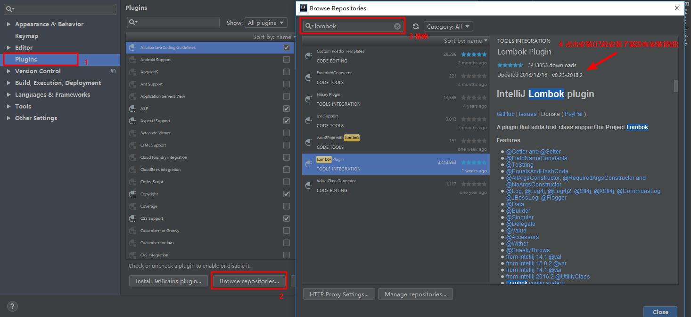
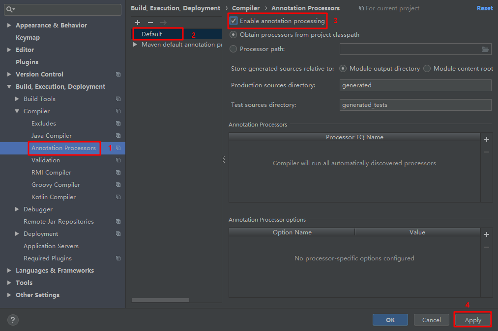

## Lombok

### Lombok简介
Lombok是一个Java库，能自动插入编辑器并构建工具，简化Java开发。通过添加注解的方式，不需要为类编写getter或eques方法，同时可以自动化日志变量。

简而言之：Lombok能以简单的注解形式来简化java代码，提高开发人员的开发效率。

### Lombok环境
使用Lombok需要的开发环境Java+Maven+IntelliJ IDEA或者Eclipse(安装Lombok Plugin)
#### 添加maven依赖
```xml
<dependency>
    <groupId>org.projectlombok</groupId>
    <artifactId>lombok</artifactId>
    <version>1.18.8</version>
    <scope>provided</scope>
</dependency>
```

#### 安装插件
使用Lombok还需要插件的配合，我使用开发工具为idea，这里只讲解idea中安装lombok插件。

打开idea的设置，点击Plugins，点击Browse repositories，在弹出的窗口中搜索lombok，然后安装即可。


#### 解决编译时出错问题
编译时出错，可能是没有enable注解处理器。Annotation Processors > Enable annotation processing。设置完成之后程序正常运行。


### 常用注解
下面介绍一下常用的几个注解：

* @Setter 注解在类或字段，注解在类时为所有字段生成setter方法，注解在字段上时只为该字段生成setter方法。    
* @Getter 使用方法同上，区别在于生成的是getter方法。    
* @ToString 注解在类，添加toString方法。    
* @EqualsAndHashCode 注解在类，生成hashCode和equals方法。    
* @NoArgsConstructor 注解在类，生成无参的构造方法。    
* @RequiredArgsConstructor 注解在类，为类中需要特殊处理的字段生成构造方法，比如final和被@NonNull注解的字段。    
* @AllArgsConstructor 注解在类，生成包含类中所有字段的构造方法。    
* @Data 注解在类，生成setter/getter、equals、canEqual、hashCode、toString方法，如为final属性，则不会为该属性生成setter方法。    
* @Slf4j 注解在类，生成log变量，严格意义来说是常量。private static final Logger log = LoggerFactory.getLogger(UserController.class);  


