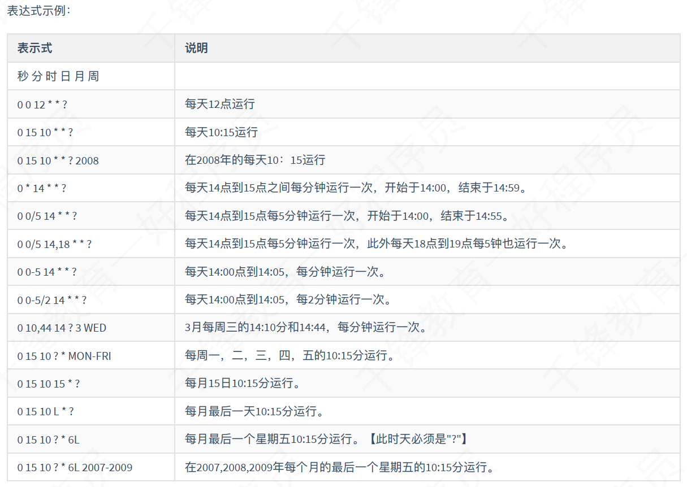

# Quartz快速入门

## ⼀、 Quartz简介
### 简介
Quartz是⼀个任务调度框架。⽐如你遇到这样的问题
```
想每⽉29号，信⽤卡⾃动还款
想每年4⽉1⽇⾃⼰给当年暗恋⼥神发⼀封匿名贺卡
想每隔1⼩时，备份⼀下⾃⼰的学习笔记
```

这些问题总结起来就是：在某⼀个有规律的时间点⼲某件事。并且时间的触发的条件可以⾮常复杂（⽐如每⽉最后⼀个⼯作⽇的  17:50），复杂到需要⼀个专⻔的框架来⼲这个事。 Quartz就是来⼲这样的事，你给它⼀个触发条件的定义，它负责到了时间点，触发相应的  Job起来⼲活如果应⽤程序需要在给定时间执⾏任务，或者如果系统有连续维护作业，那么 Quartz是理想的解决⽅案。

### 特点
#### 作业调度
作业被安排在⼀个给定的触发时运⾏。触发器可以使⽤以下指令的组合来创建：
```
在⼀天中的某个时间（到毫秒）
在⼀周的某⼏天
在每⽉的某⼀天
在⼀年中的某些⽇期
不在注册的⽇历中列出的特定⽇期（如商业节假⽇除外）
重复特定次数
重复进⾏，直到⼀个特定的时间/⽇期
⽆限重复
重复的延迟时间间隔
```

#### 作业持久性
Quartz的设计包括⼀个作业存储接⼝，有多种实现。

* 通过使⽤包含的JDBCJobStore，所有的作业和触发器配置为“⾮挥发性”都存储在通过JDBC关系数据库。   
* 通过使⽤包含的RAMJobStore，所有的作业和触发器存储在RAM，因此不计划执⾏仍然存在  -  但这是⽆需使⽤外部数据库的优势。   

## ⼆、 Quartz使⽤
### 导⼊依赖
```xml
<dependency>
    <groupId>org.quartz-scheduler</groupId>
    <artifactId>quartz</artifactId>
    <version>2.3.0</version>
</dependency>

<!--这个似乎不是必须的-->
<!--<dependency>
    <groupId>org.quartz-scheduler</groupId>
    <artifactId>quartz-jobs</artifactId>
    <version>2.3.0</version>
</dependency>-->
```

### 定义Job
```java
public class MyJob implements Job{
    @Override
    public void execute(JobExecutionContext context) throws JobExecutionException {
        //创建工作详情
        JobDetail jobDetail=context.getJobDetail();
        //获取工作的名称
        String name = jobDetail.getKey().getName();//任务名
        String group = jobDetail.getKey().getGroup();//任务group
        //String job=jobDetail.getJobDataMap().getString("data04");//任务中的数据
        System.out.println("job执行，job名："+name+" group:"+group+new Date());
    }
}
```

### API测试
```java
public static void main(String[] args) {
    try {
        //创建scheduler，调度器
        Scheduler scheduler = StdSchedulerFactory.getDefaultScheduler();
        //定义⼀个Trigger,触发条件类
        TriggerBuilder triggerBuilder = TriggerBuilder.newTrigger();
        triggerBuilder.withIdentity("trigger1", "group1") //定义name/group
                .startNow()//⼀旦加⼊scheduler，⽴即⽣效，即开始时间
                .withSchedule(SimpleScheduleBuilder.simpleSchedule()
                        .withIntervalInSeconds(1) //每隔⼀秒执⾏⼀次
                        .repeatForever()) //⼀直执⾏，直到结束时间
                //可以设置结束时间,如果不设置，则⼀直执⾏
                .endAt(new GregorianCalendar(2019, 7, 15, 16, 7, 0).getTime());
        Trigger trigger = triggerBuilder.build();
        //定义⼀个JobDetail
        //定义Job类为HelloQuartz类，这是真正的执⾏逻辑所在
        JobDetail job = JobBuilder.newJob(MyJob.class)
                .withIdentity("测试任务1", "test") //定义name/group
                .usingJobData("data04", "jobData_zhj")  //定义属性，存储数据
                .build();
        //调度器 中加⼊ 任务和触发器
        scheduler.scheduleJob(job, trigger);
        //启动任务调度
        scheduler.start();
    } catch (Exception ex) {
        ex.printStackTrace();
    }
}
```

### 配置
在Quartz JAR文件的org.quartz包下就包含一个quartz.properties属性配置文件并提供了默认属性。如果需要调整默认配置，可以在类路径下建立一个新的quartz.properties，它将自动被Quartz加载并覆盖默认的设置。

需要注意的是：配置文件一般为quartz.properties文件，但是如果使用yml文件格式的配置，则quartz.properties里面的配置会失效；

一般不需要定义这个文件使用默认的就行，下面的配置基本都是默认的：
```properties
# 名为：quartz.properties，放置在classpath下，如果没有此配置则按默认配置启动
#  指定调度器名称，⾮实现类
org.quartz.scheduler.instanceName  =  DefaultQuartzScheduler04
#  指定线程池实现类
org.quartz.threadPool.class =  org.quartz.simpl.SimpleThreadPool
#  线程池线程数量
org.quartz.threadPool.threadCount  =  10
# 优先级，默认5
org.quartz.threadPool.threadPriority  =  5
# ⾮持久化job
org.quartz.jobStore.class =  org.quartz.simpl.RAMJobStore
```

### 核⼼类说明
```
Scheduler：调度器。所有的调度都是由它控制
    Scheduler就是Quartz的⼤脑，所有任务都是由它来设施
    Schduelr包含⼀个两个重要组件: JobStore和ThreadPool
        JobStore是会来存储运⾏时信息的，包括Trigger,Schduler,JobDetail，业务锁等
        ThreadPool就是线程池，Quartz有⾃⼰的线程池实现。所有任务的都会由线程池执⾏
```

```
SchdulerFactory，顾名思义就是来⽤创建Schduler了，有两个实现：DirectSchedulerFactory和  StdSchdulerFactory。前者可以⽤来在代码⾥定制你⾃⼰的Schduler参数。后者是直接读取classpath下的quartz.properties（不存在就都使⽤默认值）配置来实例化
Schduler。通常来讲，我们使⽤StdSchdulerFactory也就⾜够了。
SchdulerFactory本身是⽀持创建RMI stub的，可以⽤来管理远程的Scheduler，功能与本地⼀样
```

## 三、 Trigger （重点）
### SimpleTrigger
```
指定从某⼀个时间开始，以⼀定的时间间隔（单位是毫秒）执⾏的任务。
它适合的任务类似于：9:00 开始，每隔1⼩时，执⾏⼀次。
它的属性有：
    repeatInterval  重复间隔
    repeatCount 重复次数。实际执⾏次数是  repeatCount+1。在startTime的时候会执⾏⼀次。
```
示例：
```java
SimpleScheduleBuilder.simpleSchedule().
                    withIntervalInSeconds(10).//每隔10秒执⾏⼀次
                    repeatForever().//永远执⾏
                    build();
```

```java
SimpleScheduleBuilder.simpleSchedule().
                    withIntervalInMinutes(3).//每隔3分钟执⾏⼀次
                    withRepeatCount(3).//执⾏3次
                    build();
```

### CalendarIntervalTrigger
类似于SimpleTrigger，指定从某⼀个时间开始，以⼀定的时间间隔执⾏的任务。  但是不同的是SimpleTrigger指定的时间间隔为毫秒，没办法指定每隔⼀个⽉执⾏⼀次（每⽉的时间间隔不是固定值），⽽ CalendarIntervalTrigger⽀持的间隔单位有秒，分钟，⼩时，天，⽉，年，星期。

示例：
```java
CalendarIntervalScheduleBuilder.calendarIntervalSchedule()
                            .withIntervalInDays(2) //每2天执⾏⼀次
                            .build();
```
```java
CalendarIntervalScheduleBuilder.calendarIntervalSchedule()
                            .withIntervalInWeeks(1) //每周执⾏⼀次
                            .build();
```

### DailyTimeIntervalTrigger
指定每天的某个时间段内，以⼀定的时间间隔执⾏任务。并且它可以⽀持指定星期。

它适合的任务类似于：指定每天9:00 ⾄ 18:00  ，每隔70秒执⾏⼀次，并且只要周⼀⾄周五执⾏。

它的属性有:
```
startTimeOfDay  每天开始时间
endTimeOfDay  每天结束时间
daysOfWeek  需要执⾏的星期
interval  执⾏间隔
intervalUnit  执⾏间隔的单位（秒，分钟，⼩时，天，⽉，年，星期）
repeatCount  重复次数
```
示例：
```java
DailyTimeIntervalScheduleBuilder.dailyTimeIntervalSchedule()
                                .startingDailyAt(TimeOfDay.hourAndMinuteOfDay(9,  0)) //每天9：00开始
                                .endingDailyAt(TimeOfDay.hourAndMinuteOfDay(18,  0)) //18：00  结束
                                .onDaysOfTheWeek(MONDAY,TUESDAY,WEDNESDAY,THURSDAY,FRIDAY)  //周⼀⾄周五执⾏
                                .withIntervalInHours(1) //每间隔1⼩时执⾏⼀次
                                .withRepeatCount(100) //最多重复100次（实际执⾏100+1次）
                                .build();
```
```java
DailyTimeIntervalScheduleBuilder.dailyTimeIntervalSchedule()
                                .startingDailyAt(TimeOfDay.hourAndMinuteOfDay(10,  0)) //每天10：00开始
                                .endingDailyAfterCount(10) //每天执⾏10次，这个⽅法实际上根据   startTimeOfDay+interval*count算出  endTimeOfDay
                                .onDaysOfTheWeek(MONDAY,TUESDAY,WEDNESDAY,THURSDAY,FRIDAY)  //周⼀⾄周五执⾏
                                .withIntervalInHours(1) //每间隔1⼩时执⾏⼀次
                                .build();
```

### CronTrigger （重点）
适合于更复杂的任务，它⽀持类型于Linux Cron的语法（并且更强⼤）。基本上它覆盖了以上三个 Trigger的绝⼤部分能⼒（但不是全部）——当然，也更难理解。它适合的任务类似于：每天0:00,9:00,18:00各执⾏⼀次。

它的属性只有:Cron表达式。但这个表示式本身就够复杂了

示例：
```java
CronScheduleBuilder.cronSchedule("0  0/2 10-12 * * ?") // 每天10:00-12:00，每隔2分钟执⾏⼀次
.build();

cronSchedule("0 30 9 ? * MON") //  每周⼀，9:30执⾏⼀次
.build();

CronScheduleBuilder.weeklyOnDayAndHourAndMinute(MONDAY,9,  30) //等同于 0 30 9 ? * MON
.build();
```

#### Cron表达式
Quartz Cron 表达式支持到七个域


| 名称 | 是否必须 | 允许值          | 特殊字符        |
| ---- | -------- | --------------- | --------------- |
| 秒   | 是       | 0-59            | , - * /         |
| 分   | 是       | 0-59            | , - * /         |
| 时   | 是       | 0-23            | , - * /         |
| 日   | 是       | 1-31            | , - * ? / L W C |
| 月   | 是       | 1-12 或 JAN-DEC | , - * /         |
| 周   | 是       | 1-7 或 SUN-SAT  | , - * ? / L C # |
| 年   | 否       | 空 或 1970-2099 | , - * /         |


* 星号(*)：可⽤在所有字段中，表示对应时间域的每⼀个时刻，例如，  在分钟字段时，表示“每分钟”；    
* 问号（?）：该字符只在⽇期和星期字段中使⽤，它通常指定为 “不确定值”    
* 减号(-)：表达⼀个范围，如在⼩时字段中使⽤“10-12”，则表示从10到12点，即10,11,12；    
* 逗号(,)：表达⼀个列表值，如在星期字段中使⽤“MON,WED,FRI”，则表示星期⼀，星期三和星期五；    
* 斜杠(/)：x/y表达⼀个等步⻓序列，x为起始值，y为增量步⻓值。如在分钟字段中使⽤0/15，则表示为0,15,30和45秒，⽽5/15在分钟字段中表示5,20,35,50，你也可以使⽤*/y，它等同于0/y；    
* L：该字符只在⽇期和星期字段中使⽤，代表“Last”的意思，但它在两个字段中意思不同。L在⽇期字段中，表示这个⽉份的最后⼀天，如⼀⽉的31号，⾮闰年⼆⽉的28号；如果L⽤在星期中，则表示星期六，等同于7。但是，如果L出现在星期字段⾥，⽽且在前⾯有⼀个数值X，则表示“这个⽉的最后⼀个周x”，例如，6L表示该⽉的最后星期五；    
* W：该字符只能出现在⽇期字段⾥，是对前导⽇期的修饰，表示离该⽇期最近的⼯作⽇。例如 15W表示离该⽉15号最近的⼯作⽇，如果该⽉15号是星期六，则匹配14号星期五；如果15⽇是星期⽇，则匹配16号星期⼀；如果15号是星期⼆，那结果就是15号星期⼆。但必须注意关联的匹配⽇期不能够跨⽉，如你指定1W，如果1号是星期六，结果匹配的是3号星期⼀，⽽⾮上个⽉最后的那天。W字符串只能指定单⼀⽇期，⽽不能指定⽇期范围；    
* LW组合：在⽇期字段可以组合使⽤LW，它的意思是当⽉的最后⼀个⼯作⽇；  



```
Calendar不是jdk的java.util.Calendar，不是为了计算⽇期的。它的作⽤是在于补充Trigger的时间。可以排除或加⼊某⼀些特定的时间点。
以”每⽉29⽇零点⾃动还信⽤卡“为例，我们想排除掉每年的2⽉29号零点这个时间点（因为平年和润年2⽉不⼀样）。这个时
间，就可以⽤Calendar来实现
```

```
Quartz提供以下⼏种Calendar，注意，所有的Calendar既可以是排除，也可以是包含，取决于：
HolidayCalendar。指定特定的⽇期，⽐如20140613。精度到天。
DailyCalendar。指定每天的时间段（rangeStartingTime, rangeEndingTime)，格式是HH:MM[:SS[:mmm]]。也就是最⼤精度可以到毫秒。
WeeklyCalendar。指定每星期的星期⼏，可选值⽐如为java.util.Calendar.SUNDAY。精度是天。
MonthlyCalendar。指定每⽉的⼏号。可选值为1-31。精度是天
AnnualCalendar。指定每年的哪⼀天。使⽤⽅式如上例。精度是天。
CronCalendar。指定Cron表达式。精度取决于Cron表达式，也就是最⼤精度可以到秒。
```

```
当scheduler⽐较繁忙的时候，可能在同⼀个时刻，有多个Trigger被触发了，但资源不⾜（⽐如线程池不⾜）。那么这个时候⽐剪⼑⽯头布更好的⽅式，就是设置优先级。优先级⾼的先执⾏。
需要注意的是，优先级只有在同⼀时刻执⾏的Trigger之间才会起作⽤，如果⼀个Trigger是9:00，另⼀个Trigger是9:30。那么⽆论后⼀个优先级多⾼，前⼀个都是先执⾏。
优先级的值默认是5，当为负数时使⽤默认值。最⼤值似乎没有指定，但建议遵循Java的标准，使⽤1-10，不然⻤才知道看到【优先级为10】是时，上头还有没有更⼤的值。
```

## 四、 Job并发（重点）
job是有可能并发执⾏的，⽐如⼀个任务要执⾏10秒中，⽽调度算法是每秒中触发1次，那么就有可能多个任务被并发执⾏。

有时候我们并不想任务并发执⾏，⽐如这个任务要去 ”获得数据库中所有未发送邮件的名单“，如果是并发执⾏，就需要⼀个数据库锁去避免⼀个数据被多次处理。这个时候⼀个@DisallowConcurrentExecution解决这个问题
```java
@DisallowConcurrentExecution
public class DoNothingJob implements  Job  {
    public void execute(JobExecutionContext  context) throws JobExecutionException  {
        System.out.println("操作");
    }
}
```

注意，@DisallowConcurrentExecution是对JobDetail实例⽣效，也就是如果你定义两个JobDetail，引⽤同⼀个Job类，是可以并发执⾏的


代码示例：
```java
@DisallowConcurrentExecution //会不允许并发执⾏，（如果每1s触发⼀次，但每个job要执⾏3秒）
public class MyJob implements  Job{
    @Override
    public void execute(JobExecutionContext  context) throws JobExecutionException  {
        try  {
            Thread.sleep(3000);
        } catch (InterruptedException e)   {
            e.printStackTrace();
        }
        System.out.println("任务调度：组："+group+",⼯作名："+name+"  "+data+new  Date());
    }
}
```

## 五、 Spring整合Quartz （重点）

### 依赖
```xml
<dependency>
    <groupId>org.quartz-scheduler</groupId>
    <artifactId>quartz</artifactId>
    <version>2.3.0</version>
</dependency>

<!--这个似乎不是必须的-->
<!--<dependency>
    <groupId>org.quartz-scheduler</groupId>
    <artifactId>quartz-jobs</artifactId>
    <version>2.3.0</version>
</dependency>-->

<dependency>
    <groupId>org.springframework</groupId>
    <artifactId>spring-context</artifactId>
    <version>${spring.version}</version>
</dependency>

<!--包含支持缓存Cache（ehcache）、JCA、JMX、 邮件服务（Java Mail、COS Mail）、任务计划Scheduling（Timer、Quartz）方面的类。-->
<dependency>
    <groupId>org.springframework</groupId>
    <artifactId>spring-context-support</artifactId>
    <version>${spring.version}</version>
</dependency>

<!--整合quartz还需要这个包org.springframework.transaction.TransactionException-->
<dependency>
    <groupId>org.springframework</groupId>
    <artifactId>spring-tx</artifactId>
    <version>${spring.version}</version>
</dependency>
```

### 配置
```xml
<?xml version="1.0" encoding="UTF-8"?>
<beans xmlns="http://www.springframework.org/schema/beans"
       xmlns:xsi="http://www.w3.org/2001/XMLSchema-instance"
       xsi:schemaLocation="http://www.springframework.org/schema/beans
       http://www.springframework.org/schema/beans/spring-beans.xsd">

    <!--
        Spring整合Quartz进行配置遵循下面的步骤：
        1：定义工作任务的Job
        2：定义触发器Trigger，并将触发器与工作任务绑定
        3：定义调度器，并将Trigger注册到Scheduler
     -->

    <!-- 1：定义任务的bean ，这里使用JobDetailFactoryBean,也可以使用MethodInvokingJobDetailFactoryBean ，配置类似-->
    <bean name="lxJob" class="org.springframework.scheduling.quartz.JobDetailFactoryBean">
        <!-- 指定job的名称 -->
        <property name="name" value="job1"/>
        <!-- 指定job的分组 -->
        <property name="group" value="group1"/>
        <!-- 指定具体的job类 -->
        <property name="jobClass" value="com.qianfeng.job.MyJob"/>
        <!-- 如果为false，当没有活动的触发器与之关联时会在调度器中会删除该任务 (可选) -->
        <property name="durability" value="true"/>
        <!-- （可选）
             指定spring容器的key，如果不设定在job中的jobmap中是获取不到spring容器的
             其实现了ApplicationContextWare,则其中的setApplicationContext方法会得到
             当前的工厂对象，且将工厂对象存在了类中的一个属性“applicationContext”中，源码如下

             getJobDataMap().put(this.applicationContextJobDataKey, this.applicationContext);
             则在Job的jobmap中可以获得工厂对象，如果需要可以使用
			 (ApplicationContext) jobDataMap.get("applicationContext04");
			 jobDataMap.get("data04");

			 .usingJobData("data04", "hello world~~")
			 .usingJobData("applicationContext04",spring工厂对象)
        -->
        <!--<property name="applicationContextJobDataKey" value="applicationContext04"/>-->
    </bean>


    <!-- 2.2：定义触发器的bean，定义一个Cron的Trigger，一个触发器只能和一个任务进行绑定 -->
    <bean id="cronTrigger" class="org.springframework.scheduling.quartz.CronTriggerFactoryBean">
        <!-- 指定Trigger的名称 -->
        <property name="name" value="hw_trigger"/>
        <!-- 指定Trigger的名称 -->
        <property name="group" value="hw_trigger_group"/>
        <!-- 指定Tirgger绑定的Job -->
        <property name="jobDetail" ref="lxJob"/>
        <!-- 指定Cron 的表达式 ，当前是每隔5s运行一次 -->
        <property name="cronExpression" value="* * * * * ?" />
    </bean>

    <!-- 3.定义调度器，并将Trigger注册到调度器中 -->
    <bean id="scheduler" class="org.springframework.scheduling.quartz.SchedulerFactoryBean">
        <property name="triggers">
            <list>
                <ref bean="cronTrigger"/>
            </list>
        </property>
        <!-- 添加 quartz 配置，如下两种方式均可 -->
        <!--<property name="configLocation" value="classpath:quartz.properties"></property>-->
        <property name="quartzProperties">
            <value>
                # 指定调度器名称，实际类型为：QuartzScheduler
                org.quartz.scheduler.instanceName = MyScheduler
                # 指定连接池
                org.quartz.threadPool.class = org.quartz.simpl.SimpleThreadPool
                # 连接池线程数量
                org.quartz.threadPool.threadCount = 11
                # 优先级
                org.quartz.threadPool.threadPriority = 5
                # 不持久化job
                org.quartz.jobStore.class = org.quartz.simpl.RAMJobStore
            </value>
        </property>
    </bean>
</beans>
```

### 代码
```java
@RunWith(SpringJUnit4ClassRunner.class)
@ContextConfiguration("classpath:applicationContext_quartz.xml")
public class TestQuartzSpring {

    @Autowired
    private StdScheduler scheduler;

    @Test
    public void test1() throws InterruptedException, SchedulerException {
        System.out.println("hello");
        Thread.sleep(5000);

        // 删除 job
        /*scheduler.pauseTrigger(TriggerKey.triggerKey("hw_trigger","hw_trigger_group"));//暂停触发器的计时
        scheduler.unscheduleJob(TriggerKey.triggerKey("hw_trigger", "hw_trigger_group"));// 移除触发器中的任务
        scheduler.deleteJob(JobKey.jobKey("job1","group1"));//移除trigger后，删除工作*/

        // job 暂停 和 恢复
       /* scheduler.pauseJob(JobKey.jobKey("job1","group1"));
        Thread.sleep(30000);
        scheduler.resumeJob(JobKey.jobKey("job1","group1"));*/

        GroupMatcher<JobKey> groups = GroupMatcher.groupEquals("group1");//名字等于group1
        scheduler.pauseJobs(groups);// 暂停组内所有的job
        Thread.sleep(5000);
        scheduler.resumeJobs(groups);
        Thread.sleep(5000);
    }
}
```

## 六、持久化

### 建表
quartz官⽅提供了完整的持久化job的⽀持，并给出了⼀套库表，我们不需要了解各个表的定义

Quartz的2.*版本数据库建表语句
```sql
DROP TABLE  QRTZ_FIRED_TRIGGERS;
DROP TABLE QRTZ_PAUSED_TRIGGER_GRPS;
DROP TABLE QRTZ_SCHEDULER_STATE;
DROP TABLE QRTZ_LOCKS;
DROP TABLE QRTZ_SIMPLE_TRIGGERS;
DROP TABLE QRTZ_SIMPROP_TRIGGERS;
DROP TABLE QRTZ_CRON_TRIGGERS;
DROP TABLE QRTZ_BLOB_TRIGGERS;
DROP TABLE QRTZ_TRIGGERS;
DROP TABLE QRTZ_JOB_DETAILS;
DROP TABLE QRTZ_CALENDARS;

CREATE TABLE `qrtz_job_details` (
  `SCHED_NAME` varchar(120) COLLATE utf8_bin NOT NULL,
  `JOB_NAME` varchar(200) COLLATE utf8_bin NOT NULL,
  `JOB_GROUP` varchar(200) COLLATE utf8_bin NOT NULL,
  `DESCRIPTION` varchar(250) COLLATE utf8_bin DEFAULT NULL,
  `JOB_CLASS_NAME` varchar(250) COLLATE utf8_bin NOT NULL,
  `IS_DURABLE` varchar(1) COLLATE utf8_bin NOT NULL,
  `IS_NONCONCURRENT` varchar(1) COLLATE utf8_bin NOT NULL,
  `IS_UPDATE_DATA` varchar(1) COLLATE utf8_bin NOT NULL,
  `REQUESTS_RECOVERY` varchar(1) COLLATE utf8_bin NOT NULL,
  `JOB_DATA` blob,
  PRIMARY KEY (`SCHED_NAME`,`JOB_NAME`,`JOB_GROUP`)
) ENGINE = InnoDB DEFAULT CHARSET=utf8 COLLATE =utf8_bin;


CREATE TABLE `qrtz_calendars` (
  `SCHED_NAME` varchar(120) COLLATE utf8_bin NOT NULL,
  `CALENDAR_NAME` varchar(200) COLLATE utf8_bin NOT NULL,
  `CALENDAR` blob NOT NULL,
  PRIMARY KEY (`SCHED_NAME`,`CALENDAR_NAME`)
) ENGINE=InnoDB DEFAULT CHARSET=utf8 COLLATE=utf8_bin;

CREATE TABLE `qrtz_triggers` (
  `SCHED_NAME` varchar(120) COLLATE utf8_bin NOT NULL,
  `TRIGGER_NAME` varchar(200) COLLATE utf8_bin NOT NULL,
  `TRIGGER_GROUP` varchar(200) COLLATE utf8_bin NOT NULL,
  `JOB_NAME` varchar(200) COLLATE utf8_bin NOT NULL,
  `JOB_GROUP` varchar(200) COLLATE utf8_bin NOT NULL,
  `DESCRIPTION` varchar(250) COLLATE utf8_bin DEFAULT NULL,
  `NEXT_FIRE_TIME` bigint(13) DEFAULT NULL,
  `PREV_FIRE_TIME` bigint(13) DEFAULT NULL,
  `PRIORITY` int(11) DEFAULT NULL,
  `TRIGGER_STATE` varchar(16) COLLATE utf8_bin NOT NULL,
  `TRIGGER_TYPE` varchar(8) COLLATE utf8_bin NOT NULL,
  `START_TIME` bigint(13) NOT NULL,
  `END_TIME` bigint(13) DEFAULT NULL,
  `CALENDAR_NAME` varchar(200) COLLATE utf8_bin DEFAULT NULL,
  `MISFIRE_INSTR` smallint(2) DEFAULT NULL,
  `JOB_DATA` blob,
  PRIMARY KEY (`SCHED_NAME`,`TRIGGER_NAME`,`TRIGGER_GROUP`),
  KEY `SCHED_NAME` (`SCHED_NAME`,`JOB_NAME`,`JOB_GROUP`),
  CONSTRAINT `qrtz_triggers_ibfk_1` FOREIGN KEY (`SCHED_NAME`, `JOB_NAME`, `JOB_GROUP`) REFERENCES `qrtz_job_details` (`SCHED_NAME`, `JOB_NAME`, `JOB_GROUP`)
) ENGINE=InnoDB DEFAULT CHARSET=utf8 COLLATE=utf8_bin;


CREATE TABLE `qrtz_blob_triggers` (
  `SCHED_NAME` varchar(120) COLLATE utf8_bin NOT NULL,
  `TRIGGER_NAME` varchar(200) COLLATE utf8_bin NOT NULL,
  `TRIGGER_GROUP` varchar(200) COLLATE utf8_bin NOT NULL,
  `BLOB_DATA` blob,
  PRIMARY KEY (`SCHED_NAME`,`TRIGGER_NAME`,`TRIGGER_GROUP`),
  CONSTRAINT `qrtz_blob_triggers_ibfk_1` FOREIGN KEY (`SCHED_NAME`, `TRIGGER_NAME`, `TRIGGER_GROUP`) REFERENCES `qrtz_triggers` (`SCHED_NAME`, `TRIGGER_NAME`, `TRIGGER_GROUP`)
) ENGINE=InnoDB DEFAULT CHARSET=utf8 COLLATE=utf8_bin;


CREATE TABLE `qrtz_cron_triggers` (
  `SCHED_NAME` varchar(120) COLLATE utf8_bin NOT NULL,
  `TRIGGER_NAME` varchar(200) COLLATE utf8_bin NOT NULL,
  `TRIGGER_GROUP` varchar(200) COLLATE utf8_bin NOT NULL,
  `CRON_EXPRESSION` varchar(200) COLLATE utf8_bin NOT NULL,
  `TIME_ZONE_ID` varchar(80) COLLATE utf8_bin DEFAULT NULL,
  PRIMARY KEY (`SCHED_NAME`,`TRIGGER_NAME`,`TRIGGER_GROUP`),
  CONSTRAINT `qrtz_cron_triggers_ibfk_1` FOREIGN KEY (`SCHED_NAME`, `TRIGGER_NAME`, `TRIGGER_GROUP`) REFERENCES `qrtz_triggers` (`SCHED_NAME`, `TRIGGER_NAME`, `TRIGGER_GROUP`)
) ENGINE=InnoDB DEFAULT CHARSET=utf8 COLLATE=utf8_bin;


CREATE TABLE `qrtz_fired_triggers` (
  `SCHED_NAME` varchar(120) COLLATE utf8_bin NOT NULL,
  `ENTRY_ID` varchar(95) COLLATE utf8_bin NOT NULL,
  `TRIGGER_NAME` varchar(200) COLLATE utf8_bin NOT NULL,
  `TRIGGER_GROUP` varchar(200) COLLATE utf8_bin NOT NULL,
  `INSTANCE_NAME` varchar(200) COLLATE utf8_bin NOT NULL,
  `FIRED_TIME` bigint(13) NOT NULL,
  `SCHED_TIME` bigint(13) NOT NULL,
  `PRIORITY` int(11) NOT NULL,
  `STATE` varchar(16) COLLATE utf8_bin NOT NULL,
  `JOB_NAME` varchar(200) COLLATE utf8_bin DEFAULT NULL,
  `JOB_GROUP` varchar(200) COLLATE utf8_bin DEFAULT NULL,
  `IS_NONCONCURRENT` varchar(1) COLLATE utf8_bin DEFAULT NULL,
  `REQUESTS_RECOVERY` varchar(1) COLLATE utf8_bin DEFAULT NULL,
  PRIMARY KEY (`SCHED_NAME`,`ENTRY_ID`)
) ENGINE=InnoDB DEFAULT CHARSET=utf8 COLLATE=utf8_bin;


CREATE TABLE `qrtz_locks` (
  `SCHED_NAME` varchar(120) COLLATE utf8_bin NOT NULL,
  `LOCK_NAME` varchar(40) COLLATE utf8_bin NOT NULL,
  PRIMARY KEY (`SCHED_NAME`,`LOCK_NAME`)
) ENGINE=InnoDB DEFAULT CHARSET=utf8 COLLATE=utf8_bin;


CREATE TABLE `qrtz_paused_trigger_grps` (
  `SCHED_NAME` varchar(120) COLLATE utf8_bin NOT NULL,
  `TRIGGER_GROUP` varchar(200) COLLATE utf8_bin NOT NULL,
  PRIMARY KEY (`SCHED_NAME`,`TRIGGER_GROUP`)
) ENGINE=InnoDB DEFAULT CHARSET=utf8 COLLATE=utf8_bin;

CREATE TABLE `qrtz_scheduler_state` (
  `SCHED_NAME` varchar(120) COLLATE utf8_bin NOT NULL,
  `INSTANCE_NAME` varchar(200) COLLATE utf8_bin NOT NULL,
  `LAST_CHECKIN_TIME` bigint(13) NOT NULL,
  `CHECKIN_INTERVAL` bigint(13) NOT NULL,
  PRIMARY KEY (`SCHED_NAME`,`INSTANCE_NAME`)
) ENGINE=InnoDB DEFAULT CHARSET=utf8 COLLATE=utf8_bin;

CREATE TABLE `qrtz_simple_triggers` (
  `SCHED_NAME` varchar(120) COLLATE utf8_bin NOT NULL,
  `TRIGGER_NAME` varchar(200) COLLATE utf8_bin NOT NULL,
  `TRIGGER_GROUP` varchar(200) COLLATE utf8_bin NOT NULL,
  `REPEAT_COUNT` bigint(7) NOT NULL,
  `REPEAT_INTERVAL` bigint(12) NOT NULL,
  `TIMES_TRIGGERED` bigint(10) NOT NULL,
  PRIMARY KEY (`SCHED_NAME`,`TRIGGER_NAME`,`TRIGGER_GROUP`),
  CONSTRAINT `qrtz_simple_triggers_ibfk_1` FOREIGN KEY (`SCHED_NAME`, `TRIGGER_NAME`, `TRIGGER_GROUP`) REFERENCES `qrtz_triggers` (`SCHED_NAME`, `TRIGGER_NAME`, `TRIGGER_GROUP`)
) ENGINE=InnoDB DEFAULT CHARSET=utf8 COLLATE=utf8_bin;

CREATE TABLE `qrtz_simprop_triggers` (
  `SCHED_NAME` varchar(120) COLLATE utf8_bin NOT NULL,
  `TRIGGER_NAME` varchar(200) COLLATE utf8_bin NOT NULL,
  `TRIGGER_GROUP` varchar(200) COLLATE utf8_bin NOT NULL,
  `STR_PROP_1` varchar(512) COLLATE utf8_bin DEFAULT NULL,
  `STR_PROP_2` varchar(512) COLLATE utf8_bin DEFAULT NULL,
  `STR_PROP_3` varchar(512) COLLATE utf8_bin DEFAULT NULL,
  `INT_PROP_1` int(11) DEFAULT NULL,
  `INT_PROP_2` int(11) DEFAULT NULL,
  `LONG_PROP_1` bigint(20) DEFAULT NULL,
  `LONG_PROP_2` bigint(20) DEFAULT NULL,
  `DEC_PROP_1` decimal(13,4) DEFAULT NULL,
  `DEC_PROP_2` decimal(13,4) DEFAULT NULL,
  `BOOL_PROP_1` varchar(1) COLLATE utf8_bin DEFAULT NULL,
  `BOOL_PROP_2` varchar(1) COLLATE utf8_bin DEFAULT NULL,
  PRIMARY KEY (`SCHED_NAME`,`TRIGGER_NAME`,`TRIGGER_GROUP`),
  CONSTRAINT `qrtz_simprop_triggers_ibfk_1` FOREIGN KEY (`SCHED_NAME`, `TRIGGER_NAME`, `TRIGGER_GROUP`) REFERENCES `qrtz_triggers` (`SCHED_NAME`, `TRIGGER_NAME`, `TRIGGER_GROUP`)
) ENGINE=InnoDB DEFAULT CHARSET=utf8 COLLATE=utf8_bin;

create index idx_qrtz_j_req_recovery on qrtz_job_details(SCHED_NAME,REQUESTS_RECOVERY);
create index idx_qrtz_j_grp on qrtz_job_details(SCHED_NAME,JOB_GROUP);

create index idx_qrtz_t_j on qrtz_triggers(SCHED_NAME,JOB_NAME,JOB_GROUP);
create index idx_qrtz_t_jg on qrtz_triggers(SCHED_NAME,JOB_GROUP);
create index idx_qrtz_t_c on qrtz_triggers(SCHED_NAME,CALENDAR_NAME);
create index idx_qrtz_t_g on qrtz_triggers(SCHED_NAME,TRIGGER_GROUP);
create index idx_qrtz_t_state on qrtz_triggers(SCHED_NAME,TRIGGER_STATE);
create index idx_qrtz_t_n_state on qrtz_triggers(SCHED_NAME,TRIGGER_NAME,TRIGGER_GROUP,TRIGGER_STATE);
create index idx_qrtz_t_n_g_state on qrtz_triggers(SCHED_NAME,TRIGGER_GROUP,TRIGGER_STATE);
create index idx_qrtz_t_next_fire_time on qrtz_triggers(SCHED_NAME,NEXT_FIRE_TIME);
create index idx_qrtz_t_nft_st on qrtz_triggers(SCHED_NAME,TRIGGER_STATE,NEXT_FIRE_TIME);
create index idx_qrtz_t_nft_misfire on qrtz_triggers(SCHED_NAME,MISFIRE_INSTR,NEXT_FIRE_TIME);
create index idx_qrtz_t_nft_st_misfire on qrtz_triggers(SCHED_NAME,MISFIRE_INSTR,NEXT_FIRE_TIME,TRIGGER_STATE);
create index idx_qrtz_t_nft_st_misfire_grp on qrtz_triggers(SCHED_NAME,MISFIRE_INSTR,NEXT_FIRE_TIME,TRIGGER_GROUP,TRIGGER_STATE);

create index idx_qrtz_ft_trig_inst_name on qrtz_fired_triggers(SCHED_NAME,INSTANCE_NAME);
create index idx_qrtz_ft_inst_job_req_rcvry on qrtz_fired_triggers(SCHED_NAME,INSTANCE_NAME,REQUESTS_RECOVERY);
create index idx_qrtz_ft_j_g on qrtz_fired_triggers(SCHED_NAME,JOB_NAME,JOB_GROUP);
create index idx_qrtz_ft_jg on qrtz_fired_triggers(SCHED_NAME,JOB_GROUP);
create index idx_qrtz_ft_t_g on qrtz_fired_triggers(SCHED_NAME,TRIGGER_NAME,TRIGGER_GROUP);

create index idx_qrtz_ft_tg on qrtz_fired_triggers(SCHED_NAME,TRIGGER_GROUP);
```

### 配置
```xml
<?xml version="1.0" encoding="UTF-8"?>
<beans xmlns="http://www.springframework.org/schema/beans"
       xmlns:context="http://www.springframework.org/schema/context"
       xmlns:xsi="http://www.w3.org/2001/XMLSchema-instance"
       xsi:schemaLocation="http://www.springframework.org/schema/beans
       http://www.springframework.org/schema/beans/spring-beans.xsd
       http://www.springframework.org/schema/context
       http://www.springframework.org/schema/context/spring-context.xsd">

    <!-- 定义调度器，并将Trigger注册到调度器中 -->
    <bean id="scheduler" class="org.springframework.scheduling.quartz.SchedulerFactoryBean">
        <!-- 添加 quartz 配置，如下两种方式均可 -->
        <!--<property name="configLocation" value="classpath:quartz.properties"></property>-->
        <property name="quartzProperties">
            <value>
                # 指定调度器名称，实际类型为：QuartzScheduler
                org.quartz.scheduler.instanceName = MyScheduler
                # 指定连接池
                org.quartz.threadPool.class = org.quartz.simpl.SimpleThreadPool
                # 连接池线程数量
                org.quartz.threadPool.threadCount = 11
                # 优先级
                org.quartz.threadPool.threadPriority = 5
                # 不持久化job
                # org.quartz.jobStore.class = org.quartz.simpl.RAMJobStore
                #持久化
                org.quartz.jobStore.class = org.quartz.impl.jdbcjobstore.JobStoreTX
                #quartz表的前缀
                org.quartz.jobStore.tablePrefix = QRTZ_
            </value>
        </property>
        <property name="dataSource" ref="druid"/>
    </bean>

    <!-- 导入外部参数文件 -->
    <context:property-placeholder location="classpath:jdbc.properties"/>
    <!-- 连接池：druid -->
    <bean id="druid" class="com.alibaba.druid.pool.DruidDataSource" init-method="init"
          destroy-method="close">
        <!-- 基本属性 url、user、password -->
        <property name="url" value="${jdbc.url}"/>
        <property name="username" value="${jdbc.user}"/>
        <property name="password" value="${jdbc.password}"/>

        <!-- 配置初始化大小、最小、最大 -->
        <property name="initialSize" value="1"/>
        <property name="minIdle" value="1"/>
        <property name="maxActive" value="${jdbc.maxPoolSize}"/>

        <!-- 配置获取连接等待超时的时间 -->
        <property name="maxWait" value="3000"/>

        <!-- 配置间隔多久才进行一次检测，检测需要关闭的空闲连接，单位是毫秒 -->
        <property name="timeBetweenEvictionRunsMillis" value="60000"/>

        <!-- 配置一个连接在池中最小空闲的时间，单位是毫秒 -->
        <property name="minEvictableIdleTimeMillis" value="300000"/>

        <property name="validationQuery" value="SELECT 'x'"/>
        <property name="testWhileIdle" value="true"/>
        <property name="testOnBorrow" value="false"/>
        <property name="testOnReturn" value="false"/>
    </bean>
</beans>
```
jdbc.properties:
```properties
jdbc.user=root
jdbc.password=111111
jdbc.url=jdbc:mysql://localhost:3306/db04?useUnicode=true&characterEncoding=utf8
jdbc.driver=com.mysql.jdbc.Driver
jdbc.maxPoolSize=3
```

### 动态增加任务
定义⼀个springMVC的  Handler
```java
@Controller
@RequestMapping("/quartz")
public class QuartzController {

    @Autowired //注入了工厂中 调度器
    private Scheduler scheduler;

    @RequestMapping("/add")
    public String addJob(JobAndTrigger jt) throws ClassNotFoundException, SchedulerException {
        // 创建JobDetail
        JobDetail jobDetail=null;
        jobDetail = JobBuilder.newJob((Class<? extends Job>)Class.forName(jt.getJobClassName()))
                .withIdentity(jt.getJobName(), jt.getJobGroup()).storeDurably(true).build();
        CronTrigger cronTrigger = null;
        cronTrigger = TriggerBuilder.newTrigger().withIdentity(jt.getJobName(),jt.getJobGroup())
                .withSchedule(CronScheduleBuilder.cronSchedule(jt.getCronExpression()))
                .build();
        scheduler.scheduleJob(jobDetail,cronTrigger);
        return "index";
    }
}
```

pojo：
```java
@Data
public class JobAndTrigger {
    private String jobName;
    private String jobGroup;
    private String jobClassName;
    private String triggerName;
    private String triggerGroup;
    private BigInteger repeatInterval;
    private BigInteger timesTriggered;
    private String cronExpression;
    private String timeZoneId;
}
```

## 我的测试代码
### job
```java
public class MyJob implements Job {
    @Override
    public void execute(JobExecutionContext context) throws JobExecutionException {
        //创建⼯作详情
        JobDetail jobDetail = context.getJobDetail();
        //获取⼯作的名称
        String name = jobDetail.getKey().getName();//任务名
        String group = jobDetail.getKey().getGroup();//任务group
        String job = jobDetail.getJobDataMap().getString("data04");// 任务中的数据
        System.out.println("job执⾏，job名：" + name + "  group:" + group + " data:" + job + " time:" + new Date());

    }
}
```

```java
@DisallowConcurrentExecution
public class MyJobSleep implements Job {
    @Override
    public void execute(JobExecutionContext context){
        System.out.println("job执⾏， time:" + new Date());
        try {
            Thread.sleep(60000);
        } catch (InterruptedException e) {
            e.printStackTrace();
        }
    }
}
```

### 基本功能测试
```xml
<dependency>
    <groupId>org.quartz-scheduler</groupId>
    <artifactId>quartz</artifactId>
    <version>2.3.0</version>
</dependency>
```

#### Trigger测试
```java
public class QuartzTest {
    public static void main(String[] args) throws Exception{
        //testSimpleTrigger();
        //testSimpleTrigger2();
        testDailyTimeTrigger();
        testCronTrigger();
    }

    public static void testCronTrigger() throws SchedulerException, InterruptedException {
        // 1. 创建scheduler，调度器  核心组件
        Scheduler scheduler = StdSchedulerFactory.getDefaultScheduler();
        // 2. 定义一个Trigger,创建触发器：Trigger
        Trigger trigger = TriggerBuilder.newTrigger()
                .withIdentity("trigger1", "group1") //定义name/group
                .withSchedule(CronScheduleBuilder.cronSchedule("*/2 * * * * ?"))
                .build();
        // 3. 创建JobDetail，JobBuilder
        JobDetail jobDetail = JobBuilder.newJob(MyJob.class)
                .withIdentity("job04", "group04")
                .usingJobData("data04", "hello world~~")
                .build();
        // 4. 注册 JobDetail 和 Trigger
        scheduler.scheduleJob(jobDetail, trigger);
        // 5. 启动调度器, 内部注册的所有触发器开始计时
        scheduler.start();

        // 6.关闭调度器
        Thread.sleep(100000);
        scheduler.shutdown();
    }

    public static void testDailyTimeTrigger() throws SchedulerException, InterruptedException {
        // 1. 创建scheduler，调度器  核心组件
        Scheduler scheduler = StdSchedulerFactory.getDefaultScheduler();
        // 2. 定义一个Trigger,创建触发器：Trigger
        Trigger trigger = TriggerBuilder.newTrigger()
                .withIdentity("trigger1", "group1") //定义name/group
                .startNow()//一旦加入scheduler，立即生效，即开始时间
                .withSchedule(DailyTimeIntervalScheduleBuilder.dailyTimeIntervalSchedule()
                        .startingDailyAt(TimeOfDay.hourAndMinuteOfDay(9, 0))
                        .endingDailyAt(TimeOfDay.hourAndMinuteOfDay(23, 30))
                        .onDaysOfTheWeek(6)//values 1-7 SUNDAY-SATURDAY，6是星期五
                        .withIntervalInSeconds(2))
                //.withRepeatCount(10))
                .build();
        // 3. 创建JobDetail，JobBuilder
        JobDetail jobDetail = JobBuilder.newJob(MyJob.class)
                .withIdentity("job04", "group04")
                .usingJobData("data04", "hello world~~")
                .build();
        // 4. 注册 JobDetail 和 Trigger
        scheduler.scheduleJob(jobDetail, trigger);
        // 5. 启动调度器, 内部注册的所有触发器开始计时
        scheduler.start();

        // 6.关闭调度器
        Thread.sleep(100000);
        scheduler.shutdown();
    }

    public static void testCalendarTrigger() throws SchedulerException, InterruptedException {
        // 1. 创建scheduler，调度器  核心组件
        Scheduler scheduler = StdSchedulerFactory.getDefaultScheduler();
        // 2. 定义一个Trigger,创建触发器：Trigger
        Trigger trigger = TriggerBuilder.newTrigger()
                .withIdentity("trigger1", "group1") //定义name/group
                .startNow()//一旦加入scheduler，立即生效，即开始时间
//                .withSchedule(CalendarIntervalScheduleBuilder.calendarIntervalSchedule().withIntervalInYears(1)) //每年
//                .withSchedule(CalendarIntervalScheduleBuilder.calendarIntervalSchedule().withIntervalInMonths(2)) //每2个月
//                .withSchedule(CalendarIntervalScheduleBuilder.calendarIntervalSchedule().withIntervalInDays(3)) //每3天
                .withSchedule(CalendarIntervalScheduleBuilder.calendarIntervalSchedule().withIntervalInSeconds(1))
                .build();
        // 3. 创建JobDetail，JobBuilder
        JobDetail jobDetail = JobBuilder.newJob(MyJob.class)
                .withIdentity("job04", "group04")
                .usingJobData("data04", "hello world~~")
                .build();
        // 4. 注册 JobDetail 和 Trigger
        scheduler.scheduleJob(jobDetail, trigger);
        // 5. 启动调度器, 内部注册的所有触发器开始计时
        scheduler.start();

        // 6.关闭调度器
        Thread.sleep(10000);
        scheduler.shutdown();
    }

    public static void testSimpleTrigger() throws SchedulerException, InterruptedException {
        // 1. 创建scheduler，调度器  核心组件
        Scheduler scheduler = StdSchedulerFactory.getDefaultScheduler();
        // 2. 定义一个Trigger,创建触发器：Trigger
        Trigger trigger = TriggerBuilder.newTrigger()
                .withIdentity("trigger1", "group1") //定义trigger的name/group
                .startNow()//一旦加入scheduler，立即生效，即开始时间,其实默认就是立即生效
                .withSchedule(SimpleScheduleBuilder.simpleSchedule()
                        .withIntervalInSeconds(2).repeatForever())
                //.endAt(new GregorianCalendar(2019,9,19,9,59,10).getTime())
                .build();

        // 3. 创建JobDetail，JobBuilder
        JobDetail jobDetail = JobBuilder.newJob(MyJob.class)
                .withIdentity("job04", "group04")//定义job的name/group
                .usingJobData("data04", "hello world~~")
                .build();

        // 4. 注册 JobDetail 和 Trigger
        scheduler.scheduleJob(jobDetail, trigger);
        // 5. 启动调度器, 内部注册的所有触发器开始计时
        scheduler.start();
        System.out.println("scheduler.start ..." + new Date());

        // 6.关闭调度器
        Thread.sleep(1000 * 60);
        scheduler.shutdown();
    }

    public static void testSimpleTrigger2() throws SchedulerException, InterruptedException {
        // 1. 创建scheduler，调度器  核心组件
        Scheduler scheduler = StdSchedulerFactory.getDefaultScheduler();
        // 2. 定义一个Trigger,创建触发器：Trigger
        Trigger trigger = TriggerBuilder.newTrigger()
                .withIdentity("trigger1", "group1") //定义name/group
                .startAt(new Date(System.currentTimeMillis() + 2000))//一旦加入scheduler，立即生效，即开始时间
                .withSchedule(SimpleScheduleBuilder.simpleSchedule()
                        .withIntervalInSeconds(2).withRepeatCount(2))//触发器触发次数，任务实际调用+1
                .build();

        // 3. 创建JobDetail，JobBuilder
        JobDetail jobDetail = JobBuilder.newJob(MyJob.class)
                .withIdentity("job04", "group04")//定义job的name/group
                .usingJobData("data04", "hello world~~")
                .build();

        // 4. 注册 JobDetail 和 Trigger
        scheduler.scheduleJob(jobDetail, trigger);
        // 5. 启动调度器, 内部注册的所有触发器开始计时
        scheduler.start();
        System.out.println("scheduler.start ..." + new Date());

        // 6.关闭调度器
        Thread.sleep(1000 * 10);
        scheduler.shutdown();
    }

}
```

#### 并发测试
和上面代码一样，只是job中sleep。
```java
public class QuartzJobSleepTest {
    public static void main(String[] args) throws Exception{
        /**
         * 经测试全是每隔一段时间执行任务(不是任务执行完隔一段时间)，任务时间长有可能并发执行
         * Job类加上@DisallowConcurrentExecution注解就不会并发执行了
         */
        //testSimpleTrigger();
        //testCalendarTrigger();
        //testDailyTimeTrigger();
        testCronTrigger();
    }

    public static void testCronTrigger()  throws SchedulerException, InterruptedException{
        // 1. 创建scheduler，调度器  核心组件
        Scheduler scheduler = StdSchedulerFactory.getDefaultScheduler();
        // 2. 定义一个Trigger,创建触发器：Trigger
        Trigger trigger = TriggerBuilder.newTrigger()
                .withIdentity("trigger1", "group1") //定义name/group
                .withSchedule(CronScheduleBuilder.cronSchedule("*/2 * * * * ?"))
                .build();
        // 3. 创建JobDetail，JobBuilder
        JobDetail jobDetail = JobBuilder.newJob(MyJobSleep.class)
                .withIdentity("job04", "group04")
                .usingJobData("data04", "hello world~~")
                .build();
        // 4. 注册 JobDetail 和 Trigger
        scheduler.scheduleJob(jobDetail,trigger);
        // 5. 启动调度器, 内部注册的所有触发器开始计时
        scheduler.start();

        // 6.关闭调度器
        Thread.sleep(100000);
        scheduler.shutdown();
    }

    public static void testDailyTimeTrigger() throws SchedulerException, InterruptedException{
        // 1. 创建scheduler，调度器  核心组件
        Scheduler scheduler = StdSchedulerFactory.getDefaultScheduler();
        // 2. 定义一个Trigger,创建触发器：Trigger
        Trigger trigger = TriggerBuilder.newTrigger()
                .withIdentity("trigger1", "group1") //定义name/group
                .startNow()//一旦加入scheduler，立即生效，即开始时间
                .withSchedule(DailyTimeIntervalScheduleBuilder.dailyTimeIntervalSchedule()
                        .startingDailyAt(TimeOfDay.hourAndMinuteOfDay(9, 0))
                        .endingDailyAt(TimeOfDay.hourAndMinuteOfDay(23, 59))
                        .onDaysOfTheWeek(6)//values 1-7 SUNDAY-SATURDAY，6是星期五
                        .withIntervalInSeconds(2))
                //.withRepeatCount(10))
                .build();
        // 3. 创建JobDetail，JobBuilder
        JobDetail jobDetail = JobBuilder.newJob(MyJobSleep.class)
                .withIdentity("job04", "group04")
                .usingJobData("data04", "hello world~~")
                .build();
        // 4. 注册 JobDetail 和 Trigger
        scheduler.scheduleJob(jobDetail,trigger);
        // 5. 启动调度器, 内部注册的所有触发器开始计时
        scheduler.start();

        // 6.关闭调度器
        Thread.sleep(100000);
        scheduler.shutdown();
    }

    public static void testCalendarTrigger() throws SchedulerException, InterruptedException {
        // 1. 创建scheduler，调度器  核心组件
        Scheduler scheduler = StdSchedulerFactory.getDefaultScheduler();
        // 2. 定义一个Trigger,创建触发器：Trigger
        Trigger trigger = TriggerBuilder.newTrigger()
                .withIdentity("trigger1", "group1") //定义name/group
                .startNow()//一旦加入scheduler，立即生效，即开始时间
                .withSchedule(CalendarIntervalScheduleBuilder.calendarIntervalSchedule().withIntervalInSeconds(2))
                .build();
        // 3. 创建JobDetail，JobBuilder
        JobDetail jobDetail = JobBuilder.newJob(MyJobSleep.class)
                .withIdentity("job04", "group04")
                .usingJobData("data04", "hello world~~")
                .build();
        // 4. 注册 JobDetail 和 Trigger
        scheduler.scheduleJob(jobDetail,trigger);
        // 5. 启动调度器, 内部注册的所有触发器开始计时
        scheduler.start();

        // 6.关闭调度器
        Thread.sleep(10000);
        scheduler.shutdown();
    }

    public static void testSimpleTrigger() throws SchedulerException, InterruptedException {
        // 1. 创建scheduler，调度器  核心组件
        Scheduler scheduler = StdSchedulerFactory.getDefaultScheduler();
        // 2. 定义一个Trigger,创建触发器：Trigger
        Trigger trigger = TriggerBuilder.newTrigger()
                .withIdentity("trigger1", "group1") //定义trigger的name/group
                .startNow()//一旦加入scheduler，立即生效，即开始时间,其实默认就是立即生效
                .withSchedule(SimpleScheduleBuilder.simpleSchedule()
                        .withIntervalInSeconds(2).repeatForever())
                //.endAt(new GregorianCalendar(2019,9,19,9,59,10).getTime())
                .build();

        // 3. 创建JobDetail，JobBuilder
        JobDetail jobDetail = JobBuilder.newJob(MyJobSleep.class)
                .withIdentity("job04", "group04")//定义job的name/group
                .usingJobData("data04", "hello world~~")
                .build();

        // 4. 注册 JobDetail 和 Trigger
        scheduler.scheduleJob(jobDetail,trigger);
        // 5. 启动调度器, 内部注册的所有触发器开始计时
        scheduler.start();
        System.out.println("scheduler.start ..." + new Date());

        // 6.关闭调度器
        Thread.sleep(1000 * 60);
        scheduler.shutdown();
    }
}
```


### 整合spring测试
```xml
<dependency>
    <groupId>org.quartz-scheduler</groupId>
    <artifactId>quartz</artifactId>
    <version>2.3.0</version>
</dependency>

<!--这个似乎不是必须的-->
<!--<dependency>
    <groupId>org.quartz-scheduler</groupId>
    <artifactId>quartz-jobs</artifactId>
    <version>2.3.0</version>
</dependency>-->


<dependency>
    <groupId>org.springframework</groupId>
    <artifactId>spring-context</artifactId>
    <version>${spring.version}</version>
</dependency>

<!--包含支持缓存Cache（ehcache）、JCA、JMX、 邮件服务（Java Mail、COS Mail）、任务计划Scheduling（Timer、Quartz）方面的类。-->
<dependency>
    <groupId>org.springframework</groupId>
    <artifactId>spring-context-support</artifactId>
    <version>${spring.version}</version>
</dependency>

<!--整合quartz还需要这个包org.springframework.transaction.TransactionException-->
<dependency>
    <groupId>org.springframework</groupId>
    <artifactId>spring-tx</artifactId>
    <version>${spring.version}</version>
</dependency>
```

#### 配置
spring_quartz.xml：
```xml
<?xml version="1.0" encoding="UTF-8"?>
<beans xmlns="http://www.springframework.org/schema/beans"
       xmlns:xsi="http://www.w3.org/2001/XMLSchema-instance"
       xmlns:context="http://www.springframework.org/schema/context"
       xsi:schemaLocation="http://www.springframework.org/schema/beans
        http://www.springframework.org/schema/beans/spring-beans.xsd
        http://www.springframework.org/schema/context
        http://www.springframework.org/schema/context/spring-context.xsd">

    <!-- 告知spring在创建容器时要扫描的包 -->
    <context:component-scan base-package="com"></context:component-scan>

    <!--
        Spring整合Quartz进行配置遵循下面的步骤：
        1：定义工作任务的Job
        2：定义触发器Trigger，并将触发器与工作任务绑定
        3：定义调度器，并将Trigger注册到Scheduler
     -->

    <!--需要引入spring-context-support-->
    <!-- 1：定义任务的bean ，这里使用JobDetailFactoryBean,也可以使用MethodInvokingJobDetailFactoryBean ，配置类似-->
    <bean name="myJob" class="org.springframework.scheduling.quartz.JobDetailFactoryBean">
        <!-- 指定job的名称 -->
        <property name="name" value="job1"/>
        <!-- 指定job的分组 -->
        <property name="group" value="group1"/>
        <!-- 指定具体的job类 -->
        <property name="jobClass" value="com.quartz.job.MyJob"/>
        <!-- 如果为false，当没有活动的触发器与之关联时会在调度器中会删除该任务 (可选) -->
        <property name="durability" value="true"/>
        <!-- （可选）
             指定spring容器的key，如果不设定在job中的jobmap中是获取不到spring容器的
             其实现了ApplicationContextWare,则其中的setApplicationContext方法会得到
             当前的工厂对象，且将工厂对象存在了类中的一个属性“applicationContext”中，源码如下

             getJobDataMap().put(this.applicationContextJobDataKey, this.applicationContext);
             则在Job的jobmap中可以获得工厂对象，如果需要可以使用
			 (ApplicationContext) jobDataMap.get("applicationContext04");
			 jobDataMap.get("data04");

			 .usingJobData("data04", "hello world~~")
			 .usingJobData("applicationContext04",spring工厂对象)
        -->
        <!--<property name="applicationContextJobDataKey" value="applicationContext04"/>-->
    </bean>

    <bean name="myJobSleep" class="org.springframework.scheduling.quartz.JobDetailFactoryBean">
        <!-- 指定job的名称 -->
        <property name="name" value="job2"/>
        <!-- 指定job的分组 -->
        <property name="group" value="group1"/>
        <!-- 指定具体的job类 -->
        <property name="jobClass" value="com.quartz.job.MyJobSleep"/>
        <!-- 如果为false，当没有活动的触发器与之关联时会在调度器中会删除该任务 (可选) -->
        <property name="durability" value="true"/>
    </bean>


    <!-- 2.2：定义触发器的bean，定义一个Cron的Trigger，一个触发器只能和一个任务进行绑定 -->
    <bean id="cronTrigger" class="org.springframework.scheduling.quartz.CronTriggerFactoryBean">
        <!-- 指定Trigger的名称 -->
        <property name="name" value="hw_trigger"/>
        <!-- 指定Trigger的名称 -->
        <property name="group" value="hw_trigger_group"/>
        <!-- 指定Tirgger绑定的Job -->
        <property name="jobDetail" ref="myJob"/>
        <!-- 指定Cron 的表达式 ，当前是每隔5s运行一次 -->
        <property name="cronExpression" value="0/5 * * * * ?" />
    </bean>

    <bean name="simpleTrigger" class="org.springframework.scheduling.quartz.SimpleTriggerFactoryBean">
        <!--指定Trigger的名称-->
        <property name="name" value="hw_trigger2"/>
        <!--指定Trigger的名称-->
        <property name="group" value="hw_trigger_group"/>
        <!--指定Tirgger绑定的Job-->
        <property name="jobDetail" ref="myJobSleep"/>
        <!--指定Trigger的延迟时间 1s后运行-->
        <property name="startDelay" value="1000"/>
        <!--指定Trigger的重复间隔  5s-->
        <property name="repeatInterval" value="5000"/>
        <!--指定Trigger的重复次数-->
        <property name="repeatCount" value="5"/>
    </bean>


    <!-- 3.定义调度器，并将Trigger注册到调度器中 -->
    <bean id="scheduler" class="org.springframework.scheduling.quartz.SchedulerFactoryBean">
        <property name="triggers">
            <list>
                <ref bean="cronTrigger"/>
                <ref bean="simpleTrigger"/>
            </list>
        </property>
        <!-- 添加 quartz 配置，如下两种方式均可 -->
        <!--<property name="configLocation" value="classpath:quartz.properties"></property>-->
        <property name="quartzProperties">
            <value>
                # 指定调度器名称，实际类型为：QuartzScheduler
                org.quartz.scheduler.instanceName = MyScheduler
                # 指定连接池
                org.quartz.threadPool.class = org.quartz.simpl.SimpleThreadPool
                # 连接池线程数量
                org.quartz.threadPool.threadCount = 10
                # 优先级
                org.quartz.threadPool.threadPriority = 5
                # 不持久化job
                org.quartz.jobStore.class = org.quartz.simpl.RAMJobStore
            </value>
        </property>
    </bean>

</beans>
```

#### 测试代码
容器已加载任务就开始调度了。
```java
import org.springframework.context.ApplicationContext;
import org.springframework.context.support.ClassPathXmlApplicationContext;

import java.util.Date;

public class QuartzSpringTest {
    public static void main(String[] args) throws InterruptedException {
        ApplicationContext ac = new ClassPathXmlApplicationContext("spring_quartz.xml");
        System.out.println(new Date());

        Thread.sleep(1000 * 60 * 5);
    }
}
```


