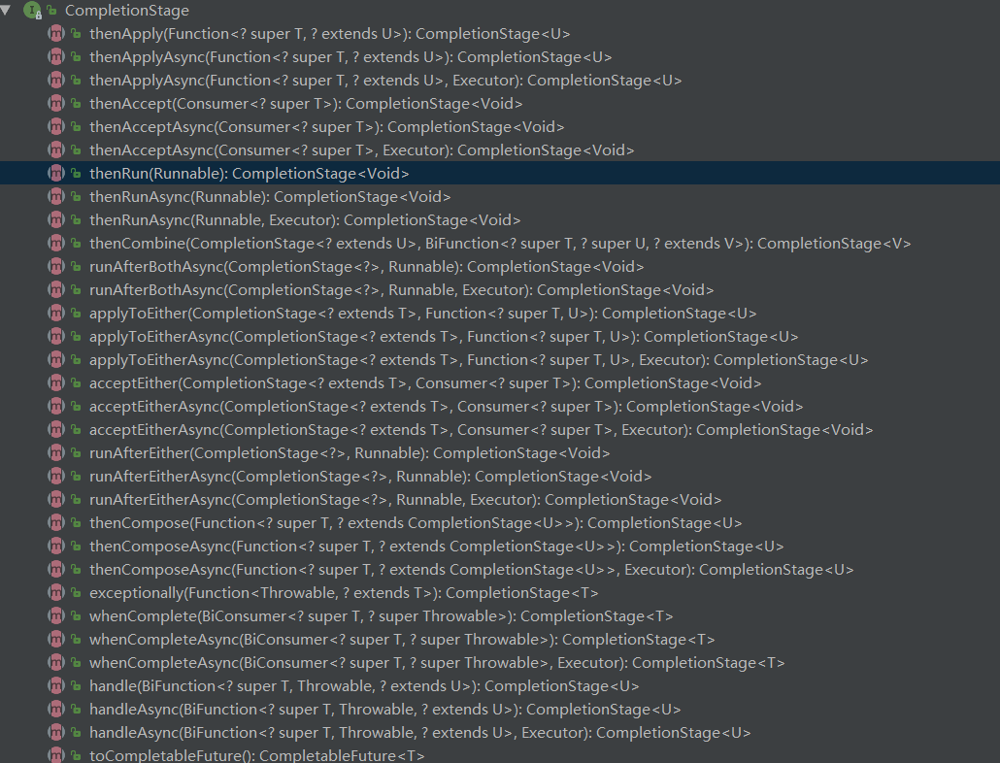

## Java8 CompletableFuture异步编程
### Future的局限性
Futrue在Java里面，通常用来表示一个异步任务的引用，比如我们将任务提交到线程池里面，然后我们会得到一个Futrue，在Future里面有isDone方法来 判断任务是否处理结束，还有get方法可以一直阻塞直到任务结束然后获取结果，但整体来说这种方式，还是同步的，因为需要客户端不断阻塞等待或者不断轮询才能知道任务是否完成。

Future的主要缺点如下：

（1）不支持手动完成

这个意思指的是，我提交了一个任务，但是执行太慢了，我通过其他路径已经获取到了任务结果，现在没法把这个任务结果，通知到正在执行的线程，所以必须主动取消或者一直等待它执行完成。

（2）不支持进一步的非阻塞调用

这个指的是我们通过Future的get方法会一直阻塞到任务完成，但是我还想在获取任务之后，执行额外的任务，因为Future不支持回调函数，所以无法实现这个功能。

（3）不支持链式调用

这个指的是对于Future的执行结果，我们想继续传到下一个Future处理使用，从而形成一个链式的pipline调用，这在Future中是没法实现的。

（4）不支持多个Future合并

比如我们有10个Future并行执行，我们想在所有的Future运行完毕之后，执行某些函数，是没法通过Future实现的。

（5）不支持异常处理

Future的API没有任何的异常处理的api，所以在异步运行时，如果出了问题是不好定位的。

### 什么是CompletableFuture？
Java 8 中, 新增加了一个包含 50 个方法左右的类 CompletableFuture，它提供了非常强大的 Future 的扩展功能，可以帮助我们简化异步编程的复杂性，并且提供了函数式编程的能力，可以通过回调的方式处理计算结果，也提供了转换和组合 CompletableFuture 的方法。

CompletableFuture在Java里面被用于异步编程，异步通常意味着非阻塞，可以使得我们的任务单独运行在与主线程分离的其他线程中，并且通过 回调可以在主线程中得到异步任务的执行状态，是否完成，和是否异常等信息。CompletableFuture实现了Future, CompletionStage接口，实现了Future接口就可以兼容现在有线程池框架，而CompletionStage接口才是异步编程的接口抽象，里面定义多种异步方法，通过这两者集合，从而打造出了强大的CompletableFuture类。

```java
public class CompletableFuture<T> implements Future<T>, CompletionStage<T> {
}
```

对于阻塞或者轮询方式，依然可以通过 CompletableFuture 类的 CompletionStage 和 Future 接口方式支持。

CompletableFuture 类声明了 CompletionStage 接口，CompletionStage 接口实际上提供了同步或异步运行计算的舞台，所以我们可以通过实现多个 CompletionStage 命令，并且将这些命令串联在一起的方式实现多个命令之间的触发。

我们可以通过 CompletableFuture.supplyAsync(this::sendMsg); 这么一行代码创建一个简单的异步计算。在这行代码中，supplyAsync 支持异步地执行我们指定的方法，这个例子中的异步执行方法是 sendMsg。当然，我们也可以使用 Executor 执行异步程序，默认是 ForkJoinPool.commonPool()。

我们也可以在异步计算结束之后指定回调函数，例如 CompletableFuture.supplyAsync(this::sendMsg) .thenAccept(this::notify); 这行代码中的 thenAccept 被用于增加回调函数，在我们的示例中 notify 就成了异步计算的消费者，它会处理计算结果。

#### CompletionStage 接口
```
A stage of a possibly asynchronous computation, that performs an action or computes a value when another CompletionStage completes.
A stage completes upon termination of its computation, but this may in turn trigger other dependent stages.
一个可能执行的异步计算的某个阶段，在另一个CompletionStage完成时执行一个操作或计算一个值。
一个阶段完成后，其计算结束。但是，该计算阶段可能会触发下一个计算阶段。
```



#### Future 接口
```java
public interface Future<V> {
    
    boolean cancel(boolean mayInterruptIfRunning);

    boolean isCancelled();

    boolean isDone();

    V get() throws InterruptedException, ExecutionException;

    V get(long timeout, TimeUnit unit)
        throws InterruptedException, ExecutionException, TimeoutException;
}
```

### 创建CompletableFuture
#### 最简单的例子
CompletableFuture 实际上也实现了 Future 接口，所以我们也可以利用 CompletableFuture 来实现基本的 Future 功能，例如：
```java
public static void main(String[] args) throws Exception {
    CompletableFuture future = new CompletableFuture();

    // 在 Java8 中，推荐使用 Lambda 来替代匿名 Runnable 实现类
    new Thread(
            () -> {
                try {
                    // 模拟一段耗时的操作
                    Thread.sleep(2000);
                    
                    future.complete("I have completed");
                } catch (Exception e) {
                }
            }
    ).start();

    System.out.println(future.get());
}
```

此时此刻主线程 future.get() 将得到字符串的结果 I have completed，同时完成回调以后将会立即生效。注意 complete() 方法只能调用一次，后续调用将被忽略。

注意：get() 方法可能会抛出异常 InterruptedException 和 ExecutionException。

如果我们已经知道了异步任务的结果，我们也可以直接创建一个已完成的 future，如下：
```java
public static void main(String[] args) throws Exception {
    // Returns a new CompletableFuture that is already completed with the given value.
    CompletableFuture future = CompletableFuture.completedFuture("I have completed");

    System.out.println(future.get());
}
```

如果在异步执行过程中，我们觉得执行会超时或者会出现问题，我们也可以通过 cancle() 方法取消，此时调用 get() 方法时会产生异常 java.util.concurrent.CancellationException，代码如下：
```java
public static void main(String[] args) throws Exception {
    CompletableFuture future = new CompletableFuture();

    // 在 Java8 中，推荐使用 Lambda 来替代匿名 Runnable 实现类
    new Thread(
            () -> {
                try {
                    // 模拟一段耗时的操作
                    Thread.sleep(2000);

                    future.cancel(false);
                } catch (Exception e) {
                }
            }
    ).start();

    System.out.println(future.get());
}
```

#### 使用工厂方法创建CompletableFuture(supplyAsync)
在上述的代码中，我们手动地创建 CompletableFuture，并且手动的创建一个线程（或者利用线程池）来启动异步任务，这样似乎有些复杂。

其实我们可以利用 CompletableFuture 的工厂方法，传入 Supplier 或者 Runnable 的实现类，直接得到一个 CompletableFuture 的实例：
```java
public static <U> CompletableFuture<U> supplyAsync(Supplier<U> supplier)
public static <U> CompletableFuture<U> supplyAsync(Supplier<U> supplier, Executor executor)
public static CompletableFuture<Void> runAsync(Runnable runnable)
public static CompletableFuture<Void> runAsync(Runnable runnable, Executor executor)
```
第一个和第三个方法，没有 Executor 参数，将会使用 ForkJoinPool.commonPool() (全局的，在 JDK8 中介绍的通用池），这适用于 CompletableFuture 类中的大多数的方法。

* Runnable 接口方法 public abstract void run(); 没有返回值    
* Supplier 接口方法 T get(); 有返回值。如果你需要处理异步操作并返回结果，使用前两种  `Supplier<U>` 方法  

一个示例代码如下：
```java
public static void main(String[] args) throws Exception {

    // 在 Java8 中，推荐使用 Lambda 来替代匿名 Supplier 实现类
    CompletableFuture<String> future = CompletableFuture.supplyAsync(() -> {
        try {
            Thread.sleep(2000);
        } catch (Exception e) {
        }

        return "I have completed";
    });

    System.out.println(future.get());
}
```

有一点需要注意：

ForkJoinPool所有的工作线程都是守护模式的，也就是说如果主线程退出，那么整个处理任务都会结束，而不管你当前的任务是否执行完。如果需要主线程等待结束，可采用ExecutorsThreadPool，如下：
```java
ExecutorService pool = Executors.newFixedThreadPool(5);
final CompletableFuture<String> future = CompletableFuture.supplyAsync(() -> {
                ... }, pool);
```

### get和join的区别
join方法和get方法类似，仅仅在于在Future不能正常完成的时候抛出一个unchecked的exception，这可以确保它用在Stream的map方法中，直接使用get是没法在map里面运行的。

join使用：
```java
@Test
public void test(){
    List<String> fruits = Arrays.asList("apple", "banana", "watermelon", "orange", "pear");

    long start = System.currentTimeMillis();
    List<Double> prices = fruits.stream().map(e -> getPrice(e)).collect(Collectors.toList());
    long duration = System.currentTimeMillis() - start;
    System.out.println("duration: " + duration);
    System.out.println(prices);

    start = System.currentTimeMillis();
    //使用并行流
    prices = fruits.parallelStream().map(e -> getPrice(e)).collect(Collectors.toList());
    duration = System.currentTimeMillis() - start;
    System.out.println("duration: " + duration);
    System.out.println(prices);

    start = System.currentTimeMillis();
    //使用 CompletableFuture 发起异步请求
    //任务是串行执行的，因为stream和spark类似使用的pipline模式，如果在scala中这样执行异步任务就是并行的。
    prices = fruits.stream()
            .map(e -> CompletableFuture.supplyAsync(() -> getPrice(e)))
            .map(future -> future.join())// join和get类似，只是未声明异常，可以直接用在map中
            .collect(Collectors.toList());
    duration = System.currentTimeMillis() - start;
    System.out.println("duration: " + duration);
    System.out.println(prices);

    start = System.currentTimeMillis();
    //把异步任务的创建和阻塞分在两个stream中就并行了
    //这里使用并行流和CompletableFutures时间差不多，但是涉及等待I/O推荐使用CompletableFuture，更多的灵活性，你可以调整线程池的大小
    List<CompletableFuture<Double>> futureList = fruits.stream()
            .map(e -> CompletableFuture.supplyAsync(() -> getPrice(e)))
            .collect(Collectors.toList());
    prices = futureList.stream().map(CompletableFuture::join).collect(Collectors.toList());
    duration = System.currentTimeMillis() - start;
    System.out.println("duration: " + duration);
    System.out.println(prices);
}

public static double getPrice(String fruit){
    Random random = new Random();
    try {
        Thread.sleep(1000L);
    } catch (InterruptedException e) {
        throw new RuntimeException(e);
    }
    return random.nextDouble() * fruit.charAt(0) + fruit.charAt(1);
}
```
输出：
```
duration: 5058
[134.700005116932, 138.03836257836505, 133.98744598212838, 173.79593217044751, 139.64313733246655]
duration: 1003
[120.822163300276, 186.20438591483267, 159.1403613590299, 128.3665167757209, 117.62147034293653]
duration: 5004
[146.8085682429015, 102.87054860816995, 186.41366258174156, 131.1411463687007, 161.80526078085384]
duration: 1000
[144.80175073143795, 120.02547114098591, 104.50954374894489, 210.06132460260625, 112.66750719118915]
```

### thenApply 转换和作用于异步任务的结果 
我们可以叠加功能，把多个 future 组合在一起等
```java
//该方法的作用是在该计算阶段正常完成后，将该计算阶段的结果作为参数传递给参数 fn 值的函数Function，并会返回一个新的 CompletableFuture
public <U> CompletableFuture<U> thenApply(Function<? super T,? extends U> fn)
//该方法和上面的方法 thenApply 功能类似，不同的是对该计算阶段的结果进行计算的函数 fn 的执行时异步的。
public <U> CompletableFuture<U> thenApplyAsync(Function<? super T,? extends U> fn)
//该方法和上面的方法 thenApplyAsync 功能类似，不同的是对该计算阶段的结果进行计算的函数 fn 的执行时异步的， 并且是在调用者提供的线程池中执行的。
public <U> CompletableFuture<U> thenApplyAsync(Function<? super T,? extends U> fn, Executor executor)
```

CompletableFuture很多方法提供了一个以Async后缀结尾的版本。通常而言，名称中不带Async的方法和它的前一个任务一样，在同一个线程中运行；而名称以Async结尾的方法会将后续的任务提交到一个线程池，所以每个任务是由不同的线程处理的。通常而言，我们选择thenCompose方法的原因是因为它更高效一些，因为少了很多线程切换的开销。

一个示例代码如下：
```java
public static void main(String[] args) throws Exception {
    // 在 Java8 中，推荐使用 Lambda 来替代匿名 Supplier 实现类
    CompletableFuture<String> future = CompletableFuture.supplyAsync(() -> {
        try {
            Thread.sleep(2000);
        } catch (Exception e) {
        }

        return "I have completed";
    });

    CompletableFuture<String> upperfuture = future.thenApply(String::toUpperCase);

    System.out.println(upperfuture.get());
}
```

这个方法，其实用过函数式编程的人非常容易理解，类似于scala和spark的map算子，通过这个方法可以进行多次链式转化并返回最终的加工结果。

看下面一个例子：
```java
public static void asyncCallback() throws ExecutionException, InterruptedException {

    CompletableFuture<String> task=CompletableFuture.supplyAsync(new Supplier<String>() {
        @Override
        public String get() {
            System.out.println(getThreadName()+"supplyAsync");
            return "123";
        }
    });

    CompletableFuture<Integer> result1 = task.thenApply(number->{
        System.out.println(getThreadName()+"thenApply1");
        return Integer.parseInt(number);
    });

    CompletableFuture<Integer> result2 = result1.thenApply(number->{
        System.out.println(getThreadName()+"thenApply2");
        return number*2;
    });

    System.out.println(getThreadName()+" => "+result2.get());

}
```
输出：
```
ForkJoinPool.commonPool-worker-1线程=> supplyAsync
main线程=> thenApply1
main线程=> thenApply2
main线程=>  => 246
```

### thenAccept/thenRun 运行异步任务的结果
在 future 的管道里有两种典型的“最终”阶段方法。

thenAccept方法，接受Futrue的一个返回值，但是本身不在返回任何值，适合用于多个callback函数的最后一步操作使用。

henRun方法与thenAccept方法类似，一般也用于回调函数最后的执行，但这个方法不接受回调函数的返回值，纯粹就代表执行任务的最后一个步骤。

```java
public CompletableFuture<Void> thenAccept(Consumer<? super T> action)
public CompletableFuture<Void> thenAcceptAsync(Consumer<? super T> action)
public CompletableFuture<Void> thenAcceptAsync(Consumer<? super T> action, Executor executor)
public CompletableFuture<Void> thenRun(Runnable action)
public CompletableFuture<Void> thenRunAsync(Runnable action)
public CompletableFuture<Void> thenRunAsync(Runnable action, Executor executor)
```

一个示例代码如下：
```java
public static void main(String[] args) throws Exception {
    // 在 Java8 中，推荐使用 Lambda 来替代匿名 Supplier 实现类
    CompletableFuture<String> future = CompletableFuture.supplyAsync(() -> {
        try {
            Thread.sleep(2000);
        } catch (Exception e) {
        }

        return "I have completed";
    });

    future.thenAccept(s -> {
        System.out.println(s);
    });

    // Waits if necessary for this future to complete, and then returns its result.
    future.get();
}
```

### thenCompose 任务依赖于一个任务
thenCompose合并两个有依赖关系的CompletableFuture，两个同时完成才算完成。这两个任务顺序执行。
```java
//传入前一个 CompletableFuture 的返回值，返回另外一个 CompletableFuture 实例
public <U> CompletableFuture<U> thenCompose(Function<? super T, ? extends CompletionStage<U>> fn)
public <U> CompletableFuture<U> thenComposeAsync(Function<? super T, ? extends CompletionStage<U>> fn)
public <U> CompletableFuture<U> thenComposeAsync(Function<? super T, ? extends CompletionStage<U>> fn, Executor executor)
```

一个示例代码如下：
```java
public static void main(String[] args) throws Exception {
    CompletableFuture<String> future
            = CompletableFuture.supplyAsync(() -> {
        try {
            Thread.sleep(1000);
        } catch (Exception e) {
        }

        return "Hello ";
    }).thenCompose(s -> CompletableFuture.supplyAsync(() -> {
        try {
            Thread.sleep(2000);
        } catch (Exception e) {
        }

        return s + "World";
    }));

    System.out.println(future.get()); // Hello World
}
```

### thenCombine、thenAcceptBoth 并发执行两个没有依赖关系的任务 
thenCombine合并两个没有依赖关系的CompletableFuture，两个一个完成就算完成。这两个任务并发执行。

thenAcceptBoth和thenCombine类似，合并两个没有依赖关系的CompletableFutures，不过回调函数要求无返回值。通常用于最后一步。
```java
public <U,V> CompletableFuture<V> thenCombine(CompletionStage<? extends U> other, BiFunction<? super T,? super U,? extends V> fn)
public <U,V> CompletableFuture<V> thenCombineAsync(CompletionStage<? extends U> other, BiFunction<? super T,? super U,? extends V> fn)
public <U,V> CompletableFuture<V> thenCombineAsync(CompletionStage<? extends U> other, BiFunction<? super T,? super U,? extends V> fn, Executor executor)

public <U> CompletableFuture<Void> thenAcceptBoth(CompletionStage<? extends U> other, BiConsumer<? super T, ? super U> action)
public <U> CompletableFuture<Void> thenAcceptBothAsync(CompletionStage<? extends U> other, BiConsumer<? super T, ? super U> action)
public <U> CompletableFuture<Void> thenAcceptBothAsync(CompletionStage<? extends U> other, BiConsumer<? super T, ? super U> action, Executor executor) 
```

上述thenCompose功能也可以通过 thenCombine() 方法实现，传入一个 BiFunction 接口的实例（以 Lambda 形式），不过这两个是并行执行的， 例如：
```java
public static void main(String[] args) throws Exception {
    CompletableFuture<String> future
            = CompletableFuture.supplyAsync(() -> {
        try {
            Thread.sleep(1000);
        } catch (Exception e) {
        }

        return "Hello ";
    }).thenCombine(CompletableFuture.supplyAsync(() -> {
        try {
            Thread.sleep(2000);
        } catch (Exception e) {
        }

        return "World";
    }), (s1, s2) -> s1 + s2);

    System.out.println(future.get());
}
```

### applyToEither/acceptEither/runAfterEither 并发执行两个没有依赖关系的相同作用的任务
两个CompletionStage，谁计算的快，就用那个CompletionStage的结果进行下一步的处理。两种渠道完成同一个事情，就可以调用这个方法，找一个最快的结果进行处理，最终有返回值。

```java
public <U> CompletableFuture<U> applyToEither(CompletionStage<? extends T> other, Function<? super T, U> fn)
public <U> CompletableFuture<U> applyToEitherAsync(CompletionStage<? extends T> other, Function<? super T, U> fn)
public <U> CompletableFuture<U> applyToEitherAsync(CompletionStage<? extends T> other, Function<? super T, U> fn, Executor executor) 
```

可以看出方法基本都有个Async的版本，同时不少方法也有apply、accept和run版本，例如：thenApply、thenAccept、thenRun。
这里applyToEither/acceptEither/runAfterEither也是一样，区别就是回调函数函数类型
```scala
//apply: Function<? super T, U>
T => U
//accept: Consumer<? super T>
T => Unit
//run: Runnable
()) => Unit
```

例子：
```java
@Test
public void testApplyToEither() throws Exception {
    CompletableFuture<String> future = CompletableFuture.supplyAsync(() -> {
        try {
            Thread.sleep(1000);
        } catch (Exception e) {
        }
        return Thread.currentThread().getName();
    });

    //和thenCombine不同的是applyToEither只要一个future完成就算完成
    //thenCombine和applyToEither类似于allOf和anyOf
    future = future.applyToEither(CompletableFuture.supplyAsync(() -> {
        try {
            Thread.sleep(100);
        } catch (Exception e) {
        }
        return Thread.currentThread().getName();
    }), r -> r);

    long start = System.currentTimeMillis();
    System.out.println(future.get());
    long duration = System.currentTimeMillis() - start;
    System.out.println("duration: " + duration);// duration: 100
}
```

### allOf/anyOf 并行执行多个异步任务
上面说了两个任务的合并，那么多个任务需要使用allOf或者anyOf方法。

有时候我们可能需要等待所有的异步任务都执行完毕，然后组合他们的结果。我们可以使用 allOf() 方法：
```java
public static CompletableFuture<Void> allOf(CompletableFuture<?>... cfs)
```
有时候我们可能不需要等待所有的异步任务都执行完毕，只要任何一个任务完成就返回结果。我们可以使用 anyOf() 方法：
```java
public static CompletableFuture<Object> anyOf(CompletableFuture<?>... cfs)
```

例子：
```java
@Test
public void testAllOf() throws Exception {
    CompletableFuture<String> future1
            = CompletableFuture.supplyAsync(() -> "Hello");
    CompletableFuture<String> future2
            = CompletableFuture.supplyAsync(() -> "Beautiful");
    CompletableFuture<String> future3
            = CompletableFuture.supplyAsync(() -> "World");

    //有时候我们可能需要等待所有的异步任务都执行完毕，然后组合他们的结果。我们可以使用 allOf() 方法：这个方法的参数是变参
    CompletableFuture<Void> combinedFuture
            = CompletableFuture.allOf(future1, future2, future3);

    combinedFuture.get();

    Assert.assertTrue(future1.isDone());
    Assert.assertTrue(future2.isDone());
    Assert.assertTrue(future3.isDone());


    //这种方式也可以等待所有的异步任务都执行完毕
    String combined = Stream.of(future1, future2, future3)
            .map(CompletableFuture::join)
            .collect(Collectors.joining(" "));

    Assert.assertEquals("Hello Beautiful World", combined);
}

@Test
public void testAnyOf() throws Exception {
    CompletableFuture<String> future1
            = CompletableFuture.supplyAsync(() -> "Hello");
    CompletableFuture<String> future2
            = CompletableFuture.supplyAsync(() -> "Beautiful");
    CompletableFuture<String> future3
            = CompletableFuture.supplyAsync(() -> "World");

    //有时候我们可能不需要等待所有的异步任务都执行完毕，只要任何一个任务完成就返回结果。我们可以使用 anyOf() 方法：这个方法的参数是变参
    //由于Anyof返回的是其中任意一个Future所以这里没有明确的返回类型，统一使用Object接受，留给使用端处理。
    CompletableFuture<Object> combinedFuture
            = CompletableFuture.anyOf(future1, future2, future3);

    System.out.println(combinedFuture.get());
}
```
注意其中的join方法和get方法类似，仅仅在于在Future不能正常完成的时候抛出一个unchecked的exception，这可以确保它用在Stream的map方法中，直接使用get是没法在map里面运行的。

### whenComplete/handle/exceptionally添加异常处理
whenComplete/handle好像一样，类似js中的完成状态的回调函数。exceptionally类似js中的异常回调。thenAccept类似js中的成功回调。
```java
// 和handle不一样的是结果不变: (T,Throwable) => Unit
public CompletableFuture<T> whenComplete(BiConsumer<? super T, ? super Throwable> action)
// 和whenComplete不一样的是可以对结果进一步转换: (T,Throwable) => U
public <U> CompletableFuture<U> handle(BiFunction<? super T, Throwable, ? extends U> fn)
// 这个异常处理函数竟然也有返回值而且限制为T，怪不得有些人称之为异常补偿: Throwable => T
public CompletableFuture<T> exceptionally(Function<Throwable, ? extends T> fn)
// 类似js中的成功回调: T => Unit
public CompletableFuture<Void> thenAccept(Consumer<? super T> action)
```

测试：
```java
@Test
public void testComplete() {
    //CompletableFuture<T> implements Future<T>, CompletionStage<T>
    CompletableFuture<String> future = new CompletableFuture();

    new Thread(() -> {
        try {
            Thread.sleep(2000);
        } catch (InterruptedException e) {
        }

        //complete() 方法只能调用一次，后续调用将被忽略
        future.complete(Thread.currentThread().getName());
    }).start();

    //注册回调函数
    future.whenComplete((r, e) -> {
        System.out.println("result: " + r);
        System.out.println("exception: " + e);
    });

    //回调函数可以注册多次
    future.whenComplete((r, e) -> {
        System.out.println("result: " + r);
        System.out.println("exception: " + e);
    });

    //handle似乎和whenComplete一样，不过需要一个返回值
    future.handle((r, e) -> {
        System.out.println("handle result: " + r);
        System.out.println("handle exception: " + e);
        return r;
    });

    //正常回调
    future.thenAccept(r -> System.out.println("thenAccept result: " + r));
    //异常回调
    future.exceptionally(e -> {
        System.out.println("exceptionally exception: " + e);
        return "";
    });

    try {
        String result = future.get();//主线程阻塞，等待完成
        System.out.println(result);
    } catch (Exception e) {
        e.printStackTrace();
    }
}

@Test
public void testCompleteExceptionally() {
    CompletableFuture<String> future = new CompletableFuture();

    new Thread(() -> {
        try {
            Thread.sleep(1000);
        } catch (InterruptedException e) {
        }
        future.completeExceptionally(new Exception("执行出错"));
    }).start();

    future.whenComplete((r, e) -> {
        System.out.println("result: " + r);
        System.out.println("exception: " + e);//捕获future.completeExceptionally(e)的异常
    });

    //正常回调
    future.thenAccept(r -> System.out.println("thenAccept result: " + r));
    //异常回调
    future.exceptionally(e -> {
        System.out.println("exceptionally exception: " + e);
        return "";
    });

    try {
        System.out.println(future.get());//捕获future.completeExceptionally(e)的异常
    } catch (Exception e) {
        System.out.println(e.getMessage());
    }
}
```

### JDK9 CompletableFuture 类增强的主要内容
（1）支持对异步方法的超时调用
```java
orTimeout()
completeOnTimeout()
```

（2）支持延迟调用
```java
Executor delayedExecutor(long delay, TimeUnit unit, Executor executor)
Executor delayedExecutor(long delay, TimeUnit unit)
```

详细内容，可以参考Oracle官网文档，这里不再过多介绍。

### CompletableFuture测试
#### 我的测试代码 
CompletableFutureTest：
```java
import org.junit.Assert;
import org.junit.Test;

import java.util.concurrent.CompletableFuture;
import java.util.stream.Collectors;
import java.util.stream.Stream;

public class CompletableFutureTest {

    @Test
    public void testComplete() {
        //CompletableFuture<T> implements Future<T>, CompletionStage<T>
        CompletableFuture<String> future = new CompletableFuture();

        new Thread(() -> {
            try {
                Thread.sleep(2000);
            } catch (InterruptedException e) {
            }

            //complete() 方法只能调用一次，后续调用将被忽略
            future.complete(Thread.currentThread().getName());
        }).start();

        //注册回调函数
        future.whenComplete((r, e) -> {
            System.out.println("result: " + r);
            System.out.println("exception: " + e);
        });

        //回调函数可以注册多次
        future.whenComplete((r, e) -> {
            System.out.println("result: " + r);
            System.out.println("exception: " + e);
        });

        //handle似乎和whenComplete一样，不过需要一个返回值
        future.handle((r, e) -> {
            System.out.println("handle result: " + r);
            System.out.println("handle exception: " + e);
            return r;
        });

        //正常回调
        future.thenAccept(r -> System.out.println("thenAccept result: " + r));
        //异常回调
        future.exceptionally(e -> {
            System.out.println("exceptionally exception: " + e);
            return "";
        });

        try {
            String result = future.get();//主线程阻塞，等待完成
            System.out.println(result);
        } catch (Exception e) {
            e.printStackTrace();
        }
    }

    @Test
    public void testCompleteExceptionally() {
        CompletableFuture<String> future = new CompletableFuture();

        new Thread(() -> {
            try {
                Thread.sleep(1000);
            } catch (InterruptedException e) {
            }
            future.completeExceptionally(new Exception("执行出错"));
        }).start();

        future.whenComplete((r, e) -> {
            System.out.println("result: " + r);
            System.out.println("exception: " + e);//捕获future.completeExceptionally(e)的异常
        });

        //正常回调
        future.thenAccept(r -> System.out.println("thenAccept result: " + r));
        //异常回调
        future.exceptionally(e -> {
            System.out.println("exceptionally exception: " + e);
            return "";
        });

        try {
            System.out.println(future.get());//捕获future.completeExceptionally(e)的异常
        } catch (Exception e) {
            System.out.println(e.getMessage());
        }
    }

    @Test
    public void testSupplyAsync() throws Exception {
        CompletableFuture<String> future = CompletableFuture.supplyAsync(() -> {
            try {
                Thread.sleep(1000);
            } catch (Exception e) {
            }
            return Thread.currentThread().getName();
        });

        future.whenComplete((r, e) -> {
            System.out.println("result: " + r);
            System.out.println("exception: " + e);
        });

        //cpu核的数目
        int processors = Runtime.getRuntime().availableProcessors();
        System.out.println("processors: " + processors);
        System.out.println(future.get());
    }

    @Test
    public void testSupplyAsyncException() {
        CompletableFuture<String> future = CompletableFuture.supplyAsync(() -> {
            try {
                Thread.sleep(1000);
            } catch (Exception e) {
            }
            int i = 1 / 0;
            return Thread.currentThread().getName();
        });

        //即使任务抛出异常也能够捕获到
        future.whenComplete((r, e) -> {
            System.out.println("result: " + r);
            System.out.println("exception: " + e);
        });

        try {
            future.get();//junit：阻塞主线程
        } catch (Exception e) {
        }
    }

    @Test
    public void testThenApply() throws Exception{
        CompletableFuture<String> future = CompletableFuture.supplyAsync(() -> {
            try {
                Thread.sleep(1000);
            } catch (Exception e) {
            }
            return Thread.currentThread().getName();
        });

        //类似于scala和spark的map算子，通过这个方法可以进行多次链式转化并返回最终的加工结果
        future = future.thenApply(r -> "thenApply1 " + r)
                .thenApply(r -> "thenApply2 " + r);

        System.out.println(future.get());
    }

    @Test
    public void testThenAccept() {
        CompletableFuture<String> future = CompletableFuture.supplyAsync(() -> {
            try {
                Thread.sleep(1000);
            } catch (Exception e) {
            }
            //int i = 1 / 0;
            return Thread.currentThread().getName();
        });

        //正常回调，从泛型就能看出只处理正常返回
        //本身不在返回任何值，适合用于多个callback函数的最后一步操作使用
        future.thenAccept(r -> System.out.println(r));
        //正常回调,不依赖返回值
        future.thenRun(() -> System.out.println("运行完了"));

        try {
            future.get();//junit：阻塞主线程
        } catch (Exception e) {
        }
    }

    @Test
    public void testThenCompose() throws Exception {
        CompletableFuture<String> future = CompletableFuture.supplyAsync(() -> {
            try {
                Thread.sleep(1000);
            } catch (Exception e) {
            }
            return Thread.currentThread().getName();
        });

        //thenCompose合并两个有依赖关系的CompletableFutures的执行结果
        future = future.thenCompose(r -> CompletableFuture.supplyAsync(() -> {
            try {
                Thread.sleep(1000);
            } catch (Exception e) {
            }
            return r + ", " + Thread.currentThread().getName();
        }));

        long start = System.currentTimeMillis();
        System.out.println(future.get());
        long duration = System.currentTimeMillis() - start;
        System.out.println("duration: " + duration);
    }

    @Test
    public void testThenCombine() throws Exception {
        CompletableFuture<String> future = CompletableFuture.supplyAsync(() -> {
            try {
                Thread.sleep(1000);
            } catch (Exception e) {
            }
            return Thread.currentThread().getName();
        });

        //thenCombine合并两个没有依赖关系的CompletableFutures任务
        //这两个任务是并行执行的
        future = future.thenCombine(CompletableFuture.supplyAsync(() -> {
            try {
                Thread.sleep(1000);
            } catch (Exception e) {
            }
            return Thread.currentThread().getName();
        }), (r1, r2) -> r1 + r2);

        long start = System.currentTimeMillis();
        System.out.println(future.get());
        long duration = System.currentTimeMillis() - start;
        System.out.println("duration: " + duration);
    }

    @Test
    public void testThenAcceptBoth() throws Exception {
        CompletableFuture<String> future = CompletableFuture.supplyAsync(() -> {
            try {
                Thread.sleep(1000);
            } catch (Exception e) {
            }
            return Thread.currentThread().getName();
        });

        //thenAcceptBoth和thenCombine类似，合并两个没有依赖关系的CompletableFutures，不过回调函数要求无返回值
        CompletableFuture<Void> acceptBothFuture = future.thenAcceptBoth(CompletableFuture.supplyAsync(() -> {
            try {
                Thread.sleep(1000);
            } catch (Exception e) {
            }
            return Thread.currentThread().getName();
        }), (r1, r2) -> System.out.println(r1 + ", " + r2));

        long start = System.currentTimeMillis();
        System.out.println(acceptBothFuture.get());
        long duration = System.currentTimeMillis() - start;
        System.out.println("duration: " + duration);
    }

    @Test
    public void testApplyToEither() throws Exception {
        CompletableFuture<String> future = CompletableFuture.supplyAsync(() -> {
            try {
                Thread.sleep(1000);
            } catch (Exception e) {
            }
            return Thread.currentThread().getName();
        });

        //和thenCombine不同的是applyToEither只要一个future完成就算完成
        //thenCombine和applyToEither类似于allOf和anyOf
        future = future.applyToEither(CompletableFuture.supplyAsync(() -> {
            try {
                Thread.sleep(100);
            } catch (Exception e) {
            }
            return Thread.currentThread().getName();
        }), r -> r);

        long start = System.currentTimeMillis();
        System.out.println(future.get());
        long duration = System.currentTimeMillis() - start;
        System.out.println("duration: " + duration);
    }

    @Test
    public void testAllOf() throws Exception {
        CompletableFuture<String> future1
                = CompletableFuture.supplyAsync(() -> "Hello");
        CompletableFuture<String> future2
                = CompletableFuture.supplyAsync(() -> "Beautiful");
        CompletableFuture<String> future3
                = CompletableFuture.supplyAsync(() -> "World");

        //有时候我们可能需要等待所有的异步任务都执行完毕，然后组合他们的结果。我们可以使用 allOf() 方法：这个方法的参数是变参
        CompletableFuture<Void> combinedFuture
                = CompletableFuture.allOf(future1, future2, future3);

        combinedFuture.get();

        Assert.assertTrue(future1.isDone());
        Assert.assertTrue(future2.isDone());
        Assert.assertTrue(future3.isDone());


        //这种方式也可以等待所有的异步任务都执行完毕
        String combined = Stream.of(future1, future2, future3)
                .map(CompletableFuture::join)
                .collect(Collectors.joining(" "));

        Assert.assertEquals("Hello Beautiful World", combined);
    }

    @Test
    public void testAnyOf() throws Exception {
        CompletableFuture<String> future1
                = CompletableFuture.supplyAsync(() -> "Hello");
        CompletableFuture<String> future2
                = CompletableFuture.supplyAsync(() -> "Beautiful");
        CompletableFuture<String> future3
                = CompletableFuture.supplyAsync(() -> "World");

        //有时候我们可能不需要等待所有的异步任务都执行完毕，只要任何一个任务完成就返回结果。我们可以使用 anyOf() 方法：这个方法的参数是变参
        //由于Anyof返回的是其中任意一个Future所以这里没有明确的返回类型，统一使用Object接受，留给使用端处理。
        CompletableFuture<Object> combinedFuture
                = CompletableFuture.anyOf(future1, future2, future3);

        System.out.println(combinedFuture.get());
    }

}
```

CompletableFutureTest1：
```java
import org.junit.Test;

import java.util.Arrays;
import java.util.List;
import java.util.Random;
import java.util.concurrent.CompletableFuture;
import java.util.stream.Collectors;

public class CompletableFutureTest1 {

    @Test
    public void test(){
        List<String> fruits = Arrays.asList("apple", "banana", "watermelon", "orange", "pear");

        long start = System.currentTimeMillis();
        List<Double> prices = fruits.stream().map(e -> getPrice(e)).collect(Collectors.toList());
        long duration = System.currentTimeMillis() - start;
        System.out.println("duration: " + duration);
        System.out.println(prices);

        start = System.currentTimeMillis();
        //使用并行流
        prices = fruits.parallelStream().map(e -> getPrice(e)).collect(Collectors.toList());
        duration = System.currentTimeMillis() - start;
        System.out.println("duration: " + duration);
        System.out.println(prices);

        start = System.currentTimeMillis();
        //使用 CompletableFuture 发起异步请求
        //任务是串行执行的，因为stream和spark类似使用的pipline模式，如果在scala中这样执行异步任务就是并行的。
        prices = fruits.stream()
                .map(e -> CompletableFuture.supplyAsync(() -> getPrice(e)))
                .map(future -> future.join())// join和get类似，只是未声明异常，可以直接用在map中
                .collect(Collectors.toList());
        duration = System.currentTimeMillis() - start;
        System.out.println("duration: " + duration);
        System.out.println(prices);

        start = System.currentTimeMillis();
        //把异步任务的创建和阻塞分在两个stream中就并行了
        //这里使用并行流和CompletableFutures时间差不多，但是涉及等待I/O推荐使用CompletableFuture，更多的灵活性，你可以调整线程池的大小
        List<CompletableFuture<Double>> futureList = fruits.stream()
                .map(e -> CompletableFuture.supplyAsync(() -> getPrice(e)))
                .collect(Collectors.toList());
        prices = futureList.stream().map(CompletableFuture::join).collect(Collectors.toList());
        duration = System.currentTimeMillis() - start;
        System.out.println("duration: " + duration);
        System.out.println(prices);
    }

    @Test
    public void testThenCompose(){
        List<String> fruits = Arrays.asList("apple", "banana", "watermelon", "orange", "pear");

        long start = System.currentTimeMillis();
        //第二个任务依赖第一个任务
        List<CompletableFuture<String>> futureList = fruits.stream()
                //启动第一个异步任务
                .map(e -> CompletableFuture.supplyAsync(() -> getPrice(e)))
                //对结果进行转换、格式化
                .map(future -> future.thenApply(price -> price * 10))
                //启动第二个异步任务，其依赖于第一个任务
                .map(future -> future.thenCompose(price -> CompletableFuture.supplyAsync(() -> formatPrice(price))))
                .collect(Collectors.toList());
        //等待流中的所有Future执行完毕，并提取各自的返回值
        List<String> prices = futureList.stream().map(CompletableFuture::join).collect(Collectors.toList());
        long duration = System.currentTimeMillis() - start;
        System.out.println("duration: " + duration);
        System.out.println(prices);
    }

    @Test
    public void testThenCombine(){
        List<String> fruits = Arrays.asList("apple", "banana", "watermelon", "orange", "pear");

        long start = System.currentTimeMillis();
        //第二个任务依赖第一个任务
        List<CompletableFuture<String>> futureList = fruits.stream()
                //启动第一个异步任务
                .map(e -> CompletableFuture.supplyAsync(() -> getPrice(e)))
                //对结果进行转换、格式化
                .map(future -> future.thenApply(price -> price * 10))
                //启动第二个异步任务，不依赖于第一个任务，两个任务并行执行，不过回调函数却依赖这两个任务
                .map(future -> future.thenCombine(CompletableFuture.supplyAsync(() -> getformat()), (price, format) -> String.format(format,price)))
                .collect(Collectors.toList());
        //等待流中的所有Future执行完毕，并提取各自的返回值getformat()
        List<String> prices = futureList.stream().map(CompletableFuture::join).collect(Collectors.toList());
        long duration = System.currentTimeMillis() - start;
        System.out.println("duration: " + duration);
        System.out.println(prices);
    }

    public static double getPrice(String fruit){
        Random random = new Random();
        try {
            Thread.sleep(1000L);
        } catch (InterruptedException e) {
            throw new RuntimeException(e);
        }
        return random.nextDouble() * fruit.charAt(0) + fruit.charAt(1);
    }

    public static String formatPrice(double price){
        try {
            Thread.sleep(1000L);
        } catch (InterruptedException e) {
            throw new RuntimeException(e);
        }
        return String.format("price is $%.2f", price);
    }

    public static String getformat(){
        try {
            Thread.sleep(1000L);
        } catch (InterruptedException e) {
            throw new RuntimeException(e);
        }
        return "price is $%.2f";
    }

}
```


#### github上找的测试代码 
基于jdk9：
```java
package com.example.completablefuture;

import static org.junit.Assert.assertEquals;
import static org.junit.Assert.assertFalse;
import static org.junit.Assert.assertNull;
import static org.junit.Assert.assertTrue;
import static org.junit.Assert.fail;

import java.util.Arrays;
import java.util.List;
import java.util.Random;
import java.util.concurrent.CompletableFuture;
import java.util.concurrent.CompletionException;
import java.util.concurrent.ExecutorService;
import java.util.concurrent.Executors;
import java.util.concurrent.ThreadFactory;
import java.util.concurrent.TimeUnit;
import java.util.stream.Collectors;

public class CompletableFutureExamples {

    static ExecutorService executor = Executors.newFixedThreadPool(3, new ThreadFactory() {
        int count = 1;

        @Override
        public Thread newThread(Runnable runnable) {
            return new Thread(runnable, "custom-executor-" + count++);
        }
    });

    static Random random = new Random();

    public static void main(String[] args) {
        try {
//            allOfAsyncExample();
        } finally {
            executor.shutdown();
        }
    }

    static void completedFutureExample() {
        CompletableFuture<String> cf = CompletableFuture.completedFuture("message");
        assertTrue(cf.isDone());
        assertEquals("message", cf.getNow(null));
    }

    static void completeExceptionallyExample() {
        CompletableFuture<String> cf = CompletableFuture.completedFuture("message").thenApplyAsync(String::toUpperCase,
                CompletableFuture.delayedExecutor(1, TimeUnit.SECONDS));
        CompletableFuture<String> exceptionHandler = cf.handle((s, th) -> { return (th != null) ? "message upon cancel" : ""; });
        cf.completeExceptionally(new RuntimeException("completed exceptionally"));
        assertTrue("Was not completed exceptionally", cf.isCompletedExceptionally());
        try {
            cf.join();
            fail("Should have thrown an exception");
        } catch (CompletionException ex) { // just for testing
            assertEquals("completed exceptionally", ex.getCause().getMessage());
        }

        assertEquals("message upon cancel", exceptionHandler.join());
    }

    static void runAsyncExample() {
        CompletableFuture<Void> cf = CompletableFuture.runAsync(() -> {
            assertTrue(Thread.currentThread().isDaemon());
            randomSleep();
        });
        assertFalse(cf.isDone());
        sleepEnough();
        assertTrue(cf.isDone());
    }

    static void thenApplyExample() {
        CompletableFuture<String> cf = CompletableFuture.completedFuture("message").thenApply(s -> {
            assertFalse(Thread.currentThread().isDaemon());
            return s.toUpperCase();
        });
        assertEquals("MESSAGE", cf.getNow(null));
    }

    static void thenApplyAsyncExample() {
        CompletableFuture<String> cf = CompletableFuture.completedFuture("message").thenApplyAsync(s -> {
            assertTrue(Thread.currentThread().isDaemon());
            randomSleep();
            return s.toUpperCase();
        });
        assertNull(cf.getNow(null));
        assertEquals("MESSAGE", cf.join());
    }

    static void thenApplyAsyncWithExecutorExample() {
        CompletableFuture<String> cf = CompletableFuture.completedFuture("message").thenApplyAsync(s -> {
            assertTrue(Thread.currentThread().getName().startsWith("custom-executor-"));
            assertFalse(Thread.currentThread().isDaemon());
            randomSleep();
            return s.toUpperCase();
        }, executor);

        assertNull(cf.getNow(null));
        assertEquals("MESSAGE", cf.join());
    }

    static void thenAcceptExample() {
        StringBuilder result = new StringBuilder();
        CompletableFuture.completedFuture("thenAccept message")
                .thenAccept(s -> result.append(s));
        assertTrue("Result was empty", result.length() > 0);
    }

    static void thenAcceptAsyncExample() {
        StringBuilder result = new StringBuilder();
        CompletableFuture<Void> cf = CompletableFuture.completedFuture("thenAcceptAsync message")
                .thenAcceptAsync(s -> result.append(s));
        cf.join();
        assertTrue("Result was empty", result.length() > 0);
    }

    static void cancelExample() {
        CompletableFuture<String> cf = CompletableFuture.completedFuture("message").thenApplyAsync(String::toUpperCase,
                CompletableFuture.delayedExecutor(1, TimeUnit.SECONDS));
        CompletableFuture<String> cf2 = cf.exceptionally(throwable -> "canceled message");
        assertTrue("Was not canceled", cf.cancel(true));
        assertTrue("Was not completed exceptionally", cf.isCompletedExceptionally());
        assertEquals("canceled message", cf2.join());
    }

    static void applyToEitherExample() {
        String original = "Message";
        CompletableFuture<String> cf1 = CompletableFuture.completedFuture(original)
                .thenApplyAsync(s -> delayedUpperCase(s));
        CompletableFuture<String> cf2 = cf1.applyToEither(
                CompletableFuture.completedFuture(original).thenApplyAsync(s -> delayedLowerCase(s)),
                s -> s + " from applyToEither");
        assertTrue(cf2.join().endsWith(" from applyToEither"));
    }

    static void acceptEitherExample() {
        String original = "Message";
        StringBuilder result = new StringBuilder();
        CompletableFuture<Void> cf = CompletableFuture.completedFuture(original)
                .thenApplyAsync(s -> delayedUpperCase(s))
                .acceptEither(CompletableFuture.completedFuture(original).thenApplyAsync(s -> delayedLowerCase(s)),
                        s -> result.append(s).append("acceptEither"));
        cf.join();
        assertTrue("Result was empty", result.toString().endsWith("acceptEither"));
    }

    static void runAfterBothExample() {
        String original = "Message";
        StringBuilder result = new StringBuilder();
        CompletableFuture.completedFuture(original).thenApply(String::toUpperCase).runAfterBoth(
                CompletableFuture.completedFuture(original).thenApply(String::toLowerCase),
                () -> result.append("done"));
        assertTrue("Result was empty", result.length() > 0);
    }

    static void thenAcceptBothExample() {
        String original = "Message";
        StringBuilder result = new StringBuilder();
        CompletableFuture.completedFuture(original).thenApply(String::toUpperCase).thenAcceptBoth(
                CompletableFuture.completedFuture(original).thenApply(String::toLowerCase),
                (s1, s2) -> result.append(s1 + s2));
        assertEquals("MESSAGEmessage", result.toString());
    }

    static void thenCombineExample() {
        String original = "Message";
        CompletableFuture<String> cf = CompletableFuture.completedFuture(original).thenApply(s -> delayedUpperCase(s))
                .thenCombine(CompletableFuture.completedFuture(original).thenApply(s -> delayedLowerCase(s)),
                        (s1, s2) -> s1 + s2);
        assertEquals("MESSAGEmessage", cf.getNow(null));
    }

    static void thenCombineAsyncExample() {
        String original = "Message";
        CompletableFuture<String> cf = CompletableFuture.completedFuture(original)
                .thenApplyAsync(s -> delayedUpperCase(s))
                .thenCombine(CompletableFuture.completedFuture(original).thenApplyAsync(s -> delayedLowerCase(s)),
                        (s1, s2) -> s1 + s2);
        assertEquals("MESSAGEmessage", cf.join());
    }

    static void thenComposeExample() {
        String original = "Message";
        CompletableFuture<String> cf = CompletableFuture.completedFuture(original).thenApply(s -> delayedUpperCase(s))
                .thenCompose(upper -> CompletableFuture.completedFuture(original).thenApply(s -> delayedLowerCase(s))
                        .thenApply(s -> upper + s));
        assertEquals("MESSAGEmessage", cf.join());
    }

    static void anyOfExample() {
        StringBuilder result = new StringBuilder();
        List<String> messages = Arrays.asList("a", "b", "c");
        List<CompletableFuture<String>> futures = messages.stream()
                .map(msg -> CompletableFuture.completedFuture(msg).thenApply(s -> delayedUpperCase(s)))
                .collect(Collectors.toList());
        CompletableFuture.anyOf(futures.toArray(new CompletableFuture[futures.size()])).whenComplete((res, th) -> {
            if(th == null) {
                assertTrue(isUpperCase((String) res));
                result.append(res);
            }
        });
        assertTrue("Result was empty", result.length() > 0);
    }

    static void allOfExample() {
        StringBuilder result = new StringBuilder();
        List<String> messages = Arrays.asList("a", "b", "c");
        List<CompletableFuture<String>> futures = messages.stream()
                .map(msg -> CompletableFuture.completedFuture(msg).thenApply(s -> delayedUpperCase(s)))
                .collect(Collectors.toList());
        CompletableFuture.allOf(futures.toArray(new CompletableFuture[futures.size()])).whenComplete((v, th) -> {
            futures.forEach(cf -> assertTrue(isUpperCase(cf.getNow(null))));
            result.append("done");
        });
        assertTrue("Result was empty", result.length() > 0);
    }

    static void allOfAsyncExample() {
        StringBuilder result = new StringBuilder();
        List<String> messages = Arrays.asList("a", "b", "c");
        List<CompletableFuture<String>> futures = messages.stream()
                .map(msg -> CompletableFuture.completedFuture(msg).thenApplyAsync(s -> delayedUpperCase(s)))
                .collect(Collectors.toList());
        CompletableFuture<Void> allOf = CompletableFuture.allOf(futures.toArray(new CompletableFuture[futures.size()]))
                .whenComplete((v, th) -> {
                    futures.forEach(cf -> assertTrue(isUpperCase(cf.getNow(null))));
                    result.append("done");
                });
        allOf.join();
        assertTrue("Result was empty", result.length() > 0);
    }

    private static boolean isUpperCase(String s) {
        for (int i = 0; i < s.length(); i++) {
            if (Character.isLowerCase(s.charAt(i))) {
                return false;
            }
        }
        return true;
    }

    private static String delayedUpperCase(String s) {
        randomSleep();
        return s.toUpperCase();
    }

    private static String delayedLowerCase(String s) {
        randomSleep();
        return s.toLowerCase();
    }

    private static void randomSleep() {
        try {
            Thread.sleep(random.nextInt(1000));
        } catch (InterruptedException e) {
            // ...
        }
    }

    private static void sleepEnough() {
        try {
            Thread.sleep(2000);
        } catch (InterruptedException e) {
            // ...
        }
    }

}
```

