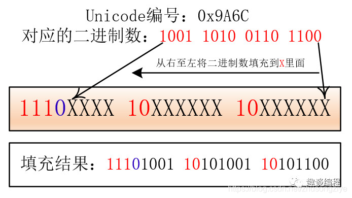

# UTF-8编码的原理
https://blog.csdn.net/whahu1989/article/details/118314154

UTF-8是目前使用最广泛的Unicode字符编码，本文顺着历史顺序讲解，来引出UTF8编码的来由和工作原理。

## 1. ASCII码

最开始是ASCII码，每个码位（code point）占1个字节，使用128个码位定义128个字符，每个字节的最高位是0


如果是英文环境，这个编码很理想，但是如果是其它语系环境，ASCII码就不行了，所以推出了Unicode编码。

## 2. UTF-32

UTF是Unicode Transformation Formats的缩写，32意思是每个字符使用32位来表示，即4个字节，这样就能表示很多的字符了。

但是缺点也很明显，如果是英文环境，那么每个英文字符都要占用4个字节，这样就会造成大量的浪费。
假设要编码字符A，如下，


可以看出有3/4的存储空间是浪费的。于是又推出UTF-16编码。

## 3. UTF-16

UTF16不是每个字符使用2个字节（16位）表示，而是一个字符根据其对应的码位（code point）大小，可以使用2个字节表示或者4个字节表示，


这样就具有了一定灵活性，但是还存在一定的浪费，只是浪费比UTF-32小了不少。而UTF-8则把这种浪费进一步减少了。

## 4. UTF-8

UTF-8是变长的，根据字符对应的码位（code point）大小，可以是1个字节，2个字节，3个字节或4个字节。


在解码时，如何知道这个字符占用几个字节呢？通过解析第一个字节获取信息。

### 1个字节

如果第一个字节的最高位是0，那么表示占一个字节，如下，


可以看出UTF-8是完全兼容ASCII码的，因为ASCII码的最高位也是0

### 2个字节

如果第一个字节（leading byte）的最高三位是110，那么表示这个字符占2个字节，第二个字节的最高2位是10


蓝色部分的数字组合在一起，就是实际的码位值。

假如要表示的字符，其码位值是413，那么就表示如下，


### 3个字节

如果第一个字节（leading byte）的最高三位是1110，那么表示这个字符占3个字节，第2和第3个字节的最高2位是10


### 4个字节

原理同上，只是第一个字节（leading byte）的最高三位是11110


### 扩展

UTF-8还可以扩展到6字节，这样就能表示更多的码位，


不同字节对应的码位范围如下图，左侧Bits栏表示用于表示码位的bit数，如4个字节，其中有21位用于表示码位，即上图中的蓝色部分，


## 总结

可以看出UTF-8的产生是循序渐进的，其拥有很高的灵活性，而且可以进行扩展，能够表示的字符范围很大。

# Unicode、UTF-8编码详解
https://blog.csdn.net/lixiangchibang/article/details/130190098


计算机起源于美国，上个世纪，他们对英语字符与二进制位之间的关系做了统一规定，并制定了一套字符编码规则，这套编码规则被称为ASCII编码


ASCII 编码一共定义了128个字符的编码规则，用七位二进制表示 ( 0x00 - 0x7F ), 这些字符组成的集合就叫做 ASCII 字符集


随着计算机的普及，在不同的地区和国家又出现了很多字符编码，比如: 大陆的GB2312、港台的 BIG5, 日本的 Shift JIS等等


由于字符编码不同，计算机在不同国家之间的交流变得很困难，经常会出现乱码的问题，比如：对于同一个二进制数据，不同的编码会解析出不同的字符


当互联网迅猛发展，地域限制打破之后，人们迫切的希望有一种统一的规则, 对所有国家和地区的字符进行编码，于是 Unicode 就出现了

## Unicode 简介

Unicode 是国际标准字符集，它将世界各种语言的每个字符定义一个唯一的编码，以满足跨语言、跨平台的文本信息转换

Unicode 字符集的编码范围是**0x0000 - 0x10FFFF**, 可以容纳一百多万个字符， 每个字符都有一个独一无二的编码，也即每个字符都有一个二进制数值和它对应，这里的二进制数值也叫**码点**, 比如：汉字**"中"**的 码点是**0x4E2D**, 大写字母**A**的码点是**0x41**, 具体字符对应的 Unicode 编码可以查询[Unicode字符编码表](https://link.zhihu.com/?target=https%3A//home.unicode.org/ "Unicode字符编码表")

## 字符集和字符编码

字符集是很多个字符的集合，例如 GB2312 是简体中文的字符集，它收录了六千多个常用的简体汉字及一些符号，数字，拼音等字符

字符编码是 字符集的一种实现方式，把字符集中的字符映射为特定的字节或字节序列，它是一种规则

比如：Unicode 只是字符集，UTF-8、UTF-16、UTF-32 才是真正的字符编码规则

**我这里在我转载的这篇文章额外补充一点：字符集Unicode的出现，单纯就是世界各地字符越来越多了，所以需要不但扩充，并且最好兼容原来的，所以Unicode出现了；他要做的就是用一个固定数值表示一个具体的字符，至于用多少字节，怎么存储，这就是字符编码规则需要考虑的；字符编码规则utf-8之所以脱颖而出，因为它定义了一个好的规则，文章会具体说明；**

## Unicode 字符存储

Unicode 是一个符号集， 它只规定了每个符号的二进制值，但是符号具体如何存储它并没有规定

前面提到, Unicode 字符集的编码范围是**0x0000 - 0x10FFFF**，因此需要 1 到 3 个字节来表示

那么，对于三个字节的 Unicode字符，计算机怎么知道它表示的是一个字符而不是三个字符呢 ？

如果所有字符都用三个字节表示，那么对于那些一个字节就能表示的字符来说，有两个字节是无意义的，对于存储来说，这是极大的浪费，假如 , 一个普通的文本, 大部分字符都只需一个字节就能表示，现在如果需要三个字节才能表示，文本的大小会大出三倍左右

因此，Unicode 出现了多种存储方式，常见的有 UTF-8、UTF-16、UTF-32，它们分别用不同的二进制格式来表示 Unicode 字符

UTF-8、UTF-16、UTF-32 中的 "UTF" 是 "Unicode Transformation Format" 的缩写，意思是"Unicode 转换格式"，后面的数 字表明至少使用多少个比特位来存储字符, 比如：UTF-8 最少需要8个比特位也就是一个字节来存储，对应的， UTF-16 和 UTF-32 分别需要最少 2 个字节 和 4 个字节来存储

## UTF-8 编码

UTF-8: 是一种变长字符编码，被定义为将码点编码为 1 至 4 个字节，具体取决于码点数值中有效二进制位的数量

UTF-8 的编码规则:


* 对于单字节的符号，字节的第一位设为**0**，后面 7 位为这个符号的 Unicode 码。因此对于英语字母，UTF-8 编码和 ASCII 码是相同的, 所以 UTF-8 能兼容 ASCII 编码，这也是互联网普遍采用 UTF-8 的原因之一    
* 对于**n**字节的符号（**n > 1**），第一个字节的前**n**位都设为**1**，第**n + 1**位设为**0**，后面字节的前两位一律设为**10**。剩下的没有提及的二进制位，全部为这个符号的 Unicode 码


下表是Unicode编码对应UTF-8需要的字节数量以及编码格式

| Unicode编码范围(16进制) | UTF-8编码方式(二进制) |
| -- | -- |


表格中第一列是Unicode编码的范围，第二列是对应UTF-8编码方式，其中红色的二进制**"1"**和**"0"**是固定的前缀, 字母**x**表示可用编码的二进制位


根据上面表格，要解析 UTF-8 编码就很简单了，如果一个字节第一位是**0**，则这个字节就是一个单独的字符，如果第一位是**1**，则连续有多少个**1**，就表示当前字符占用多少个字节


下面以**"中"**字 为例来说明 UTF-8 的编码，具体的步骤如下图， 为了便于说明，图中左边加了`1，2，3，4`的步骤编号


首先查询**"中"**字的 Unicode 码**0x4E2D**, 转成二进制, 总共有 16 个二进制位， 具体如上图 步骤1 所示


通过前面的 Unicode 编码和 UTF-8 编码的表格知道，Unicode 码**0x4E2D**对应**000800 - 00FFFF**的范围，所以,**"中"**字的 UTF-8 编码 需要**3**个字节，即格式是**1110**xxxx**10**xxxxxx**10**xxxxxx


然后从**"中"**字的最后一个二进制位开始，按照从后向前的顺序依次填入格式中的**x**字符，多出的二进制补为**0**， 具体如上图 步骤2、步骤3 所示


于是，就得到了**"中"**的 UTF-8 编码是**11100100****10111000****10101101**, 转换成十六进制就是**0xE4B8AD**， 具体如上图 步骤4 所示


## UTF-16 编码

UTF-16 也是一种变长字符编码, 这种编码方式比较特殊, 它将字符编码成 2 字节 或者 4 字节

具体的编码规则如下:

* 对于 Unicode 码小于**0x10000**的字符， 使用**2**个字节存储，并且是直接存储 Unicode 码，不用进行编码转换    
* 对于 Unicode 码在**0x10000**和**0x10FFFF**之间的字符，使用**4**个字节存储，这**4**个字节分成前后两部分，每个部分各两个字节，其中，前面两个字节的前**6**位二进制固定为**110110**，后面两个字节的前 6 位二进制固定为**110111**, 前后部分各剩余 10 位二进制表示符号的 Unicode 码 减去**0x10000**的结果    
* 大于**0x10FFFF**的 Unicode 码无法用 UTF-16 编码

下表是Unicode编码对应UTF-16编码格式


| Unicode编码范围(16进制) | 具体Unicode码(二进制) | UTF-16编码方式(二进制) | 字节 |
| -- | -- | -- | -- |


表格中第一列是Unicode编码的范围，第二列是 具体Unicode码的二进制 ( 第二行的第二列表示的是 Unicode 码 减去**0x10000**后的二进制 ) , 第三列是对应UTF-16编码方式，其中红色的二进制**"1"**和**"0"**是固定的前缀, 字母**x**和**y**表示可用编码的二进制位， 第四列表示 编码占用的字节数

前面提到过，**"中"**字的 Unicode 码是**4E2D**, 它小于**0x10000**，根据表格可知，它的 UTF-16 编码占两个字节，并且和 Unicode 码相同，所以**"中"**字的 UTF-16 编码为**4E2D**


我从[Unicode字符表网站](https://link.zhihu.com/?target=https%3A//unicode-table.com/cn/ "Unicode字符表网站")找了一个老的南阿拉伯字母, 它的 Unicode 码是:**0x10A6F**, 可以访问[https://unicode-table.com/cn/10A6F/](https://link.zhihu.com/?target=https%3A//unicode-table.com/cn/10A6F/ "https://unicode-table.com/cn/10A6F/")查看字符的说明, Unicode 码对应的字符如下图所示


下面以这个 老的南阿拉伯字母的 Unicode 码**0x10A6F**为例来说明 UTF-16**4**字节的编码，具体步骤如下，为了便于说明，图中左边加了`1，2，3，4 、5`的步骤编号


首先把 Unicode 码**0x10A6F**转成二进制, 对应上图的 步骤 1


然后把 Unicode 码**0x10A6F**减去**0x10000**, 结果为**0xA6F**并把这个值转成二进制**00 00000010****10 01101111**，对应上图的 步骤 2


然后 从二进制**00 00000010****10 01101111**的最后一个二进制为开始，按照从后向前的顺序依次填入格式中的**x**和**y**字符，多出的二进制补为**0**， 对应上图的 步骤 3、 步骤 4


于是，就计算出了 Unicode 码**0x10A6F**的 UTF-16 编码是**11011000 00000010****11011110 01101111**, 转换成十六进制就是**0xD802DE6F**， 对应上图的 步骤 5


## UTF-32 编码


UTF-32 是固定长度的编码，始终占用 4 个字节，足以容纳所有的 Unicode 字符，所以直接存储 Unicode 码即可，不需要任何编码转换。虽然浪费了空间，但提高了效率。


## UTF-8、UTF-16、UTF-32 之间如何转换


前面介绍过，UTF-8、UTF-16、UTF-32 是 Unicode 码表示成不同的二进制格式的编码规则，同样，通过这三种编码的二进制表示，也能获得对应的 Unicode 码，有了字符的 Unicode 码，按照上面介绍的 UTF-8、UTF-16、UTF-32 的编码方法 就能转换成任一种编码了


## UTF 字节序


最小编码单元是多字节才会有字节序的问题存在，UTF-8 最小编码单元是一字节，所以 它是没有字节序的问题，UTF-16 最小编码单元是 2 个字节，在解析一个 UTF-16 字符之前，需要知道每个编码单元的字节序


比如：前面提到过，**"中"**字的 Unicode 码是**4E2D**,**"ⵎ"**字符的 Unicode 码是**2D4E**， 当我们收到一个 UTF-16 字节流**4E2D**时，计算机如何识别它表示的是字符**"中"**还是 字符**"ⵎ"**呢 ?


所以，对于多字节的编码单元，需要有一个标记显式的告诉计算机，按照什么样的顺序解析字符，也就是字节序，字节序分为 大端字节序 和 小端字节序


小端字节序简写为 LE( Little-Endian ), 表示 低位字节在前，高位字节在后, 高位字节保存在内存的高地址端，而低位字节保存在内存的低地址端


大端字节序简写为 BE( Big-Endian ), 表示 高位字节在前，低位字节在后，高位字节保存在内存的低地址端，低位字节保存在在内存的高地址端


下面以**0x4E2D**为例来说明大端和小端，具体参见下图:


数据是从高位字节到低位字节显示的，这也更符合人们阅读数据的习惯，而内存地址是从低地址向高地址增加


所以，字符**0x4E2D**数据的高位字节是**4E**，低位字节是**2D**

按照大端字节序的高位字节保存内存低地址端的规则，**4E**保存到低内存地址**0x10001**上，**2D**则保存到高内存地址**0x10002**上


对于小端字节序，则正好相反，数据的高位字节保存到内存的高地址端，低位字节保存到内存低地址端的，所以**4E**保存到高内存地址**0x10002**上，**2D**则保存到低内存地址**0x10001**上


## BOM

BOM 是 byte-order mark 的缩写，是 "字节序标记" 的意思, 它常被用来当做标识文件是以 UTF-8、UTF-16 或 UTF-32 编码的标记


在 Unicode 编码中有一个叫做 "零宽度非换行空格" 的字符 ( ZERO WIDTH NO-BREAK SPACE ), 用字符**FEFF**来表示


对于 UTF-16 ，如果接收到以**FEFF**开头的字节流， 就表明是大端字节序，如果接收到**FFFE**， 就表明字节流 是小端字节序


UTF-8 没有字节序问题，上述字符只是用来标识它是 UTF-8 文件，而不是用来说明字节顺序的。"零宽度非换行空格" 字符 的 UTF-8 编码是**EF BB BF**, 所以如果接收到以**EF BB BF**开头的字节流，就知道这是UTF-8 文件


下面的表格列出了不同 UTF 格式的固定文件头


| UTF编码 | 固定文件头 |
| -- | -- |


根据上面的 固定文件头，下面列出了**"中"**字在文件中的存储 ( 包含文件头 )


| 编码 | 固定文件头 |
| -- | -- |


## 常见的字符编码的问题


* **Redis 中文key的显示**


有时候我们需要向redis中写入含有中文的数据，然后在查看数据，但是会看到一些其他的字符，而不是我们写入的中文


上图中，我们向redis 写入了一个 "中" 字，通过 get 命令查看的时候无法显示我们写入的 "中" 字

这时候加一个 --raw 参数，重新启动 redis-cli 即可，也即 执行 redis-cli --raw 命令启动redis客户端，具体的如下图所示


* **MySQL 中的 utf8 和 utf8mb4**

MySQL 中的 "utf8" 实际上不是真正的 UTF-8， "utf8" 只支持每个字符最多 3 个字节, 对于超过 3 个字节的字符就会出错, 而真正的 UTF-8 至少要支持 4 个字节


MySQL 中的 "utf8mb4" 才是真正的 UTF-8


下面以 test 表为例来说明, 表结构如下:

```sql
mysql> show create table test\G
*************************** 1. row ***************************
       Table: test
Create Table: CREATE TABLE `test` (
  `name` char(32) NOT NULL
) ENGINE=InnoDB DEFAULT CHARSET=utf8
1 row in set (0.00 sec)
```

向`test`表分别插入**"中"**字 和 Unicode 码为**0x10A6F**的字符，这个字符需要从[https://unicode-table.com/cn/10A6F/](https://link.zhihu.com/?target=https%3A//unicode-table.com/cn/10A6F/ "https://unicode-table.com/cn/10A6F/")直接复制到 MySQL 控制台上，手工输入会无效，具体的执行结果如下图:


从上图可以看出，插入**"中"**字 成功，插入**0x10A6F**字符失败，错误提示无效的字符串，**\xF0\X90\XA9\xAF**正是**0x10A6F**字符的 UTF-8 编码，占用**4**个字节, 因为 MySQL 的 utf8 编码最多只支持**3**个字节，所以插入会失败


把`test`表的字符集改成`utf8mb4`, 排序规则 改成`utf8bm4_unicode_ci`, 具体如下图所示：


字符集和排序方式修改之后，再次插入**0x10A6F**字符， 结果是成功的，具体执行结果如下图所示


上图中，`set names utf8mb4`是为了测试方便，临时修改当前会话的字符集，以便保持和 服务器一致，实际解决这个问题需要修改`my.cnf`配置中 服务器和客户端的字符集


## 小结

本文从字符编码的历史介绍了 Unicode 出现的原因，接着介绍了 Unicode 字符集中 三种不同的编码方式： UTF-8、UTF-16、UTF-32 以及它们的的编码方法，紧接着介绍了 字节序、BOM ，最后讲到了字符集在 MySQL 和 Redis 应用中常见的问题以及解决方案 ，更多关于 Unicode 的介绍请参考 Unicode 的 RFC 文档

# 你真的懂 Unicode 和 UTF-8 是什么关系吗？来看看这个就彻底懂了！
https://blog.csdn.net/zhusongziye/article/details/84261211


想必做过爬虫的同学肯定被编码问题困扰过，有 UTF-8、GBK、Unicode等等编码方式，但你真的了解其中的原理吗？下面我们就来了解一下 Unicode 和 UTF-8 编码到底有什么关系。


要弄清 Unicode 与 UTF-8 的关系，我们还得从他们的来源说起，下来我们从刚开始的编码说起，直到 Unicode 的出现，我们就会感觉到他们之间的关系


**ASCII码**


我们都知道，在计算机的世界里，信息的表示方式只有 0 和 1,但是我们人类信息表示的方式却与之大不相同，很多时候是用语言文字、图像、声音等传递信息的。


那么我们怎样将其转化为二进制存储到计算机中，这个过程我们称之为编码。更广义地讲就是把信息从一种形式转化为另一种形式的过程。


我们知道一个二进制有两种状态：”0” 状态 和 “1”状态，那么它就可以代表两种不同的东西，我们想赋予它什么含义，就赋予什么含义，比如说我规定，“0” 代表 “吃过了”, “1”代表 “还没吃”。


这样，我们就相当于把现实生活中的信息编码成二进制数字了，并且这个例子中是一位二进制数字，那么 2 位二进制数可以代表多少种情况能？对，是四种，2^2,分别是 00、01、10、11，那 7 种呢？答案是 2^7=128。


我们知道，在计算机中每八个二进制位组成了一个字节（Byte），计算机存储的最小单位就是字节，字节如下图所示：


所以早期人们用 8 位二进制来编码英文字母(最前面的一位是 0)，也就是说，将英文字母和一些常用的字符和这 128 中二进制 0、1 串一一对应起来，比如说 大写字母“A”所对应的二进制位“01000001”，转换为十六进制为 41。


在美国，这 128 是够了，但是其他国家不答应啊，他们的字符和英文是有出入的，比如在法语中在字母上有注音符号，如é,这个怎么表示成二进制？


所以各个国家就决定把字节中最前面未使用的那一个位拿来使用，原来的 128 种状态就变成了 256 种状态，比如 é 就被编码成 130（二进制的10000010）。


为了保持与 ASCII 码的兼容性，一般最高为为 0 时和原来的 ASCII 码相同，最高位为 1 的时候，各个国家自己给后面的位 (1xxx xxxx) 赋予他们国家的字符意义。


但是这样一来又有问题出现了，不同国家对新增的 128 个数字赋予了不同的含义，比如说 130 在法语中代表了 é,但是在希伯来语中却代表了字母 Gimel（这不是希伯来字母，只是读音翻译成英文的形式）具体的希伯来字母 Gimel 看下图


所以这就成了不同国家有不同国家的编码方式，所以如果给你一串二进制数，你想要解码，就必须知道它的编码方式，不然就会出现我们有时候看到的乱码。

**Unicode的出现**


Unicode为世界上所有字符都分配了一个唯一的数字编号，这个编号范围从0x000000 到 0x10FFFF(十六进制)，有 110 多万，每个字符都有一个唯一的 Unicode 编号，这个编号一般写成 16 进制，在前面加上 U+。例如：“马”的 Unicode 是U+9A6C。


Unicode 就相当于一张表，建立了字符与编号之间的联系


它是一种规定，Unicode 本身只规定了每个字符的数字编号是多少，并没有规定这个编号如何存储。


有的人会说了，那我可以直接把 Unicode 编号直接转换成二进制进行存储，是的，你可以，但是这个就需要人为的规定了，而 Unicode 并没有说这样弄，因为除了你这种直接转换成二进制的方案外，还有其他方案，接下来我们会逐一看到。


编号怎么对应到二进制表示呢？有多种方案：主要有 UTF-8，UTF-16，UTF-32。


**1、UTF-32**


先来看简单的 UTF-32


这个就是字符所对应编号的整数二进制形式，四个字节。这个就是直接转换。 比如马的 Unicode 为：U+9A6C，那么直接转化为二进制，它的表示就为：1001 1010 0110 1100。


这里需要说明的是，转换成二进制后计算机存储的问题，我们知道，计算机在存储器中排列字节有两种方式：大端法和小端法，大端法就是将高位字节放到底地址处，比如 0x1234, 计算机用两个字节存储，一个是高位字节 0x12,一个是低位字节 0x34，它的存储方式为下：


UTF-32 用四个字节表示，处理单元为四个字节（一次拿到四个字节进行处理），如果不分大小端的话，那么就会出现解读错误，比如我们一次要处理四个字节 12 34 56 78，这四个字节是表示 0x12 34 56 78 还是表示 0x78 56 34 12？不同的解释最终表示的值不一样。


我们可以根据他们高低字节的存储位置来判断他们所代表的含义，所以在编码方式中有 UTF-32BE 和 UTF-32LE，分别对应大端和小端，来正确地解释多个字节（这里是四个字节）的含义。


**2、UTF-16**


UTF-16 使用变长字节表示


① 对于编号在U+0000到U+FFFF的字符（常用字符集），直接用两个字节表示。
② 编号在U+10000到U+10FFFF之间的字符，需要用四个字节表示。


同样，UTF-16 也有字节的顺序问题（大小端），所以就有 UTF-16BE 表示大端，UTF-16LE 表示小端。


**3、UTF-8**


UTF-8 就是使用变长字节表示,顾名思义，就是使用的字节数可变，这个变化是根据 Unicode 编号的大小有关，编号小的使用的字节就少，编号大的使用的字节就多。使用的字节个数从 1 到 4 个不等。


UTF-8 的编码规则是：


**①**对于单字节的符号，字节的第一位设为 0，后面的7位为这个符号的 Unicode 码，因此对于英文字母，UTF-8 编码和 ASCII 码是相同的。


**②**对于n字节的符号（n>1）,第一个字节的前 n 位都设为 1，第 n+1 位设为 0，后面字节的前两位一律设为 10，剩下的没有提及的二进制位，全部为这个符号的 Unicode 码 。


举个例子：比如说一个字符的 Unicode 编码是 130，显然按照 UTF-8 的规则一个字节是表示不了它（因为如果是一个字节的话前面的一位必须是 0），所以需要两个字节(n = 2)。


根据规则，第一个字节的前 2 位都设为 1，第 3(2+1) 位设为 0，则第一个字节为：110X XXXX，后面字节的前两位一律设为 10，后面只剩下一个字节，所以后面的字节为：10XX XXXX。


所以它的格式为110XXXXX10XXXXXX 。


下面我们来具体看看具体的Unicode 编号范围与对应的 UTF-8 二进制格式


那么对于一个具体的 Unicode 编号，具体怎么进行 UTF-8 的编码呢？


首先找到该 Unicode 编号所在的编号范围，进而可以找到与之对应的二进制格式，然后将该 Unicode 编号转化为二进制数（去掉高位的 0），最后将该二进制数从右向左依次填入二进制格式的 X 中，如果还有 X 未填，则设为 0 。


比如：“马”的 Unicode 编号是：0x9A6C，整数编号是 39532，对应第三个范围（2048 - 65535），其格式为：1110XXXX 10XXXXXX 10XXXXXX，39532对应的二进制是1001 1010 0110 1100，将二进制填入进入就为：

111010011010100110101100。





由于 UTF-8 的处理单元为一个字节（也就是一次处理一个字节），所以处理器在处理的时候就不需要考虑这一个字节的存储是在高位还是在低位，直接拿到这个字节进行处理就行了，因为大小端是针对大于一个字节的数的存储问题而言的。


综上所述，UTF-8、UTF-16、UTF-32 都是 Unicode 的一种实现。

