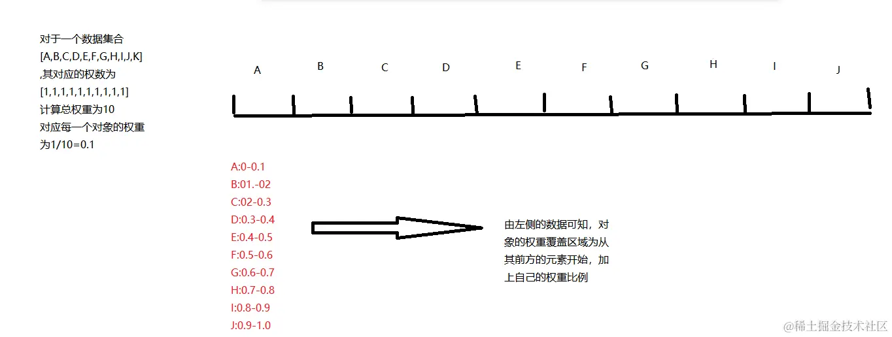
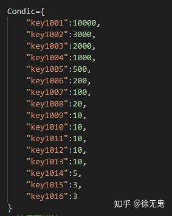
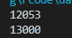

# Java实现带有权重随机算法的示例详解
https://www.jb51.net/program/30029009d.htm

## 1.什么是权重比例

权重比例计算即将各数值乘以相应的权数，然后加总求和得到总体值，再除以总的单位数。

**如何计算**

有一个对象集合为[A,B,C,D,E,F,G,H,I,J]，其对象的全红

总权重为10

每一个对象的权重为1/10=0.1

## 2.什么是权重覆盖区域

权重覆盖区域是对象在整体权重范围中的锁分配到的区域




因此在计算权重时将对应的权重比例放入到数组中，便于后期计算权重覆盖区域

## 3.如何随机的获取对应的区域

使用java数据工具列Arrays的binarySearch()
```java
int binarySearch(double[] a, double key) 
```

这个方法会根据key找到 -插入点索引-1

对应的插入点为 -结果-1

当获取到指定的权重覆盖区域，对其对应的对象的权重按照指定比例进行修改，并保存数据

## 4.IO读取和保存数据

可使用的类很多，但是建议使用字符流的高级流--缓冲流，可以在简化操作步骤

字符缓冲输入流：使用readLine()获取一行的数据

字符换种输出流：使用newLine()进行换行，相较于添加写入 \r\n要简便

## 5.算法实现

1.建立的JavaBean类

```java
package com.prettyspiderList.train;
/**
 * @author prettyspider
 * @ClassName Student
 * @description: TODO
 * @date 2023/8/4 17:28
 * @Version V1.0
 */
public class Student {
    private String name;
    private int age;
    public Student() {
    }
    public Student(String name, int age) {
        this.name = name;
        this.age = age;
    }
    /**
     * 获取
     * @return name
     */
    public String getName() {
        return name;
    }
    /**
     * 设置
     * @param name
     */
    public void setName(String name) {
        this.name = name;
    }
    /**
     * 获取
     * @return age
     */
    public int getAge() {
        return age;
    }
    /**
     * 设置
     * @param age
     */
    public void setAge(int age) {
        this.age = age;
    }
    public String toString() {
        return "Student{name = " + name + ", age = " + age + "}";
    }
}
```

2.算法实现

```java
package com.prettyspiderList.Map.train;
import java.io.*;
import java.util.ArrayList;
import java.util.Arrays;
import java.util.Random;
/**
 * @author prettyspider
 * @ClassName test04
 * @description: TODO
 * @date 2023/9/7 21:35
 * @Version V1.0
 */
public class test04 {
    /**
     * txt文件中事先准备号一些学生信息，每个学生的信息独占一行
     * 要求1：
     *      每次被点到的学生，再次被点到的概率再原先的基础上降低一半
     *      举例： 80个学生，点名2次，每次都点到a，概率变化
     *      1： 1.25&
     *      2.a 0.625% 其他人1.2579%
     */
    public static void main(String[] args) throws IOException {
        /**
         * 带权重的随机算法：
         *      根据总权重，获取每个对象的占比
         *
         */
        //创建student集合
        ArrayList<Student> list = new ArrayList<>();
        // 创建输入流
        BufferedReader reader = new BufferedReader(new FileReader(".\\com\\prettyspiderList\\Map\\train\\stu.txt"));
        String line;
        while ((line = reader.readLine()) != null) {
            String[] arr = line.split("-");
            list.add(new Student(arr[0], arr[1], Integer.parseInt(arr[2]), Double.valueOf(arr[3])));
        }
        // 关流
        reader.close();
        //计算权重
        // 1.获取总权重
        double weight = 0.0;
        for (Student stu : list) {
            weight += stu.getWeight();
        }
        // 2.获取单个权重
        double[] wightArr = new double[list.size()];
        for (int i = 0; i < list.size(); i++) {
            wightArr[i] = list.get(i).getWeight() / weight;
        }
        System.out.println(Arrays.toString(wightArr));
        // 每个的权重占比，其前面一个的权重加自己的权重, 表示的是在这个范围内是对应的对象
        for (int i = 1; i < wightArr.length; i++) {
            wightArr[i] = wightArr[i] + wightArr[i - 1];
        }
        System.out.println(Arrays.toString(wightArr));
        // 随机生成一个0-1之间的随机数
        Random random = new Random();
        double key = random.nextDouble(1);
        System.out.println(key);
        // 二分查找法：方法返回： 结果=-插入点-1
        // 则插入点=-结果-1
        int index = -Arrays.binarySearch(wightArr, key) -1;
        // 对获取到的对象的权重减半
        double num = list.get(index).getWeight() / 2;
        list.get(index).setWeight(num);
        System.out.println(list.get(index));
        // 将数据协会到文件中
        BufferedWriter writer = new BufferedWriter(new FileWriter(".\\com\\prettyspiderList\\Map\\train\\stu.txt"));
        for (Student student : list) {
            writer.write(student.toString());
            writer.newLine();
        }
        // 关闭流
        writer.close();
    }
}
```

到此这篇关于Java实现带有权重随机算法的示例详解的文章就介绍到这了,更多相关Java随机算法内容请搜索脚本之家以前的文章或继续浏览下面的相关文章希望大家以后多多支持脚本之家！

# 权重随机(Weight random)算法详解
https://www.jianshu.com/p/a8ebbb8078d5

## 应用场景

* 客户端负载均衡，例如 Nacos 提供的客户端负载均衡就是使用了该算法    
* 游戏抽奖（普通道具的权重很高，稀有道具的权重很低）

## 本文目标

Java 实现权重随机算法

## 算法详解

比如我们现在有三台 Server，权重分别为1，3，2。现在想对三台 Server 做负载均衡

```java
Server1     Server2     Server3

 weight      weight      weight
   1           3          2

```

### 权重比例

* 我们算出每台 Server 的权重比例，`权重比例 = 自己的权重 / 总权重`

```
server1     server2     server3

 weight      weight      weight
   1           3          2

 radio       radio       radio
  1/6         3/6         2/6

```


* 根据权重比例计算覆盖区域


```
      server1               server2                  server3
         ^                     ^                        ^
    |---------||---------|---------|---------||---------|---------||
    0         1/6                            4/6                  6/6
               ^                              ^                    ^
          0.16666667                      0.66666667              1.0

```


* 根据权重负载均衡
如步骤2所示，每个 server 都有自己的范围，把每一个格子作为单位来看的话

server1 (0,1]
server2 (1,4]
server3 (4,6]

使用随机数函数，取 (0,6] 之间的随机数，根据随机数落在哪个范围决定如何选择。例如随机数为 2，处于 (1,4] 范围，那么就选择 server2。
思路大概就是这样，落实到代码上，用一个数组 `[0.16666667, 0.66666667, 1]` 来表示这三个 server 的覆盖范围，使用 ThreadLocalRandom 或者 Random 获取 [0,1) 内的随机数。然后使用**二分查找法**快速定位**随机数**处于哪个区间


## Java 实现

代码基本上与`com.alibaba.nacos.client.naming.utils.Chooser`一致，在可读性方面做了下优化。


```java
import java.util.*;
import java.util.concurrent.ThreadLocalRandom;
import java.util.concurrent.atomic.AtomicInteger;

public class WeightRandom<T> {

    private final List<T> items = new ArrayList<>();
    private double[] weights;

    public WeightRandom(List<ItemWithWeight<T>> itemsWithWeight) {
        this.calWeights(itemsWithWeight);
    }

    /**
     * 计算权重，初始化或者重新定义权重时使用
     * 
     */
    public void calWeights(List<ItemWithWeight<T>> itemsWithWeight) {
        items.clear();

        // 计算权重总和
        double originWeightSum = 0;
        for (ItemWithWeight<T> itemWithWeight : itemsWithWeight) {
            double weight = itemWithWeight.getWeight();
            if (weight <= 0) {
                continue;
            }

            items.add(itemWithWeight.getItem());
            if (Double.isInfinite(weight)) {
                weight = 10000.0D;
            }
            if (Double.isNaN(weight)) {
                weight = 1.0D;
            }
            originWeightSum += weight;
        }

        // 计算每个item的实际权重比例
        double[] actualWeightRatios = new double[items.size()];
        int index = 0;
        for (ItemWithWeight<T> itemWithWeight : itemsWithWeight) {
            double weight = itemWithWeight.getWeight();
            if (weight <= 0) {
                continue;
            }
            actualWeightRatios[index++] = weight / originWeightSum;
        }

        // 计算每个item的权重范围
        // 权重范围起始位置
        weights = new double[items.size()];
        double weightRangeStartPos = 0;
        for (int i = 0; i < index; i++) {
            weights[i] = weightRangeStartPos + actualWeightRatios[i];
            weightRangeStartPos += actualWeightRatios[i];
        }
    }

    /**
     * 基于权重随机算法选择
     * 
     */
    public T choose() {
        double random = ThreadLocalRandom.current().nextDouble();
        int index = Arrays.binarySearch(weights, random);
        if (index < 0) {
            index = -index - 1;
        } else {
            return items.get(index);
        }

        if (index < weights.length && random < weights[index]) {
            return items.get(index);
        }

        // 通常不会走到这里，为了保证能得到正确的返回，这里随便返回一个
        return items.get(0);
    }

    public static class ItemWithWeight<T> {
        T item;
        double weight;

        public ItemWithWeight() {
        }

        public ItemWithWeight(T item, double weight) {
            this.item = item;
            this.weight = weight;
        }

        public T getItem() {
            return item;
        }

        public void setItem(T item) {
            this.item = item;
        }

        public double getWeight() {
            return weight;
        }

        public void setWeight(double weight) {
            this.weight = weight;
        }
    }

    public static void main(String[] args) {
        // for test
        int sampleCount = 1_000_000;

        ItemWithWeight<String> server1 = new ItemWithWeight<>("server1", 1.0);
        ItemWithWeight<String> server2 = new ItemWithWeight<>("server2", 3.0);
        ItemWithWeight<String> server3 = new ItemWithWeight<>("server3", 2.0);

        WeightRandom<String> weightRandom = new WeightRandom<>(Arrays.asList(server1, server2, server3));

        // 统计 (这里用 AtomicInteger 仅仅是因为写起来比较方便，这是一个单线程测试)
        Map<String, AtomicInteger> statistics = new HashMap<>();

        for (int i = 0; i < sampleCount; i++) {
            statistics
                    .computeIfAbsent(weightRandom.choose(), (k) -> new AtomicInteger())
                    .incrementAndGet();
        }

        statistics.forEach((k, v) -> {
            double hit = (double) v.get() / sampleCount;
            System.out.println(k + ", hit:" + hit);
        });
    }
}

```


这里重点说一下`Arrays.binarySearch(weights, random)`，这个 API 我之前没有用过导致我在读 Nacos 源码时，对这块的操作十分费解


来看一下 java API 文档对该方法返回值的解释


> 
Returns:

index of the search key, if it is contained in the array; otherwise, (-(insertion point) - 1). The insertion point is defined as the point at which the key would be inserted into the array: the index of the first element greater than the key, or a.length if all elements in the array are less than the specified key. Note that this guarantees that the return value will be >= 0 if and only if the key is found.


解释下，首先该方法的作用是通过指定的 key 搜索数组。（前提条件是要保证数组的顺序是从小到大排序过的）


* 如果数组中包含该 key，则返回对应的索引    
* 如果不包含该 key，则返回该 key 的 `(-(insertion point)-1)`


insertion point（插入点）：该 key 应该在数组的哪个位置。举个例子，数组`[1,3,5]`，我的搜索 key 为 2，按照顺序排的话 2 应该在数组的 index = 1 的位置，所以此时 insertion point = 1。


（这里 jdk 将能查到 key 和 查不到 key 两种情况做了区分。为了将未找到的情况全部返回负数，所以做了`(-(insertion point)-1)`这样的操作）


看到这，我们就懂了，insertion point 就是我们需要的，现在我们用小学数学来推导一下如何计算 insertion point


```java
// 小学数学推导一下 insertion point 如何计算
returnValue = (- (insertionPoint) - 1)
insertionPoint = (- (returnValue + 1) )

// 所以就有了上边代码中的
if (index < 0) {
    index = -index - 1;
}

```

## 参考

[https://github.com/alibaba/nacos/blob/develop/client/src/main/java/com/alibaba/nacos/client/naming/utils/Chooser.java](https://links.jianshu.com/go?to=https%3A%2F%2Fgithub.com%2Falibaba%2Fnacos%2Fblob%2Fdevelop%2Fclient%2Fsrc%2Fmain%2Fjava%2Fcom%2Falibaba%2Fnacos%2Fclient%2Fnaming%2Futils%2FChooser.java "https://github.com/alibaba/nacos/blob/develop/client/src/main/java/com/alibaba/nacos/client/naming/utils/Chooser.java")

# 权重随机生成
https://zhuanlan.zhihu.com/p/267099125


因为现实控制中，例如种种游戏后台中，对于产生结果控制常常不是用概率，或者小数百分之多少，0.03这种数据如果严格计算又特别容易出现整数浮点数的问题

所以常常使用权重的方式



这样可以通过产生随机整数，来判定产生结果。因此实际数据模型中也可以按照这样的思路设计模拟脚本

使用python中的random.randrange(start, stop[, step]) 取值范围为前闭后开


```python
import random
def sum_dict_value(data): #对所有键值对进行求和
    sum_0=0
    for ke in data.keys():
        sum_0=data[ke]+sum_0
        pass
    return(sum_0)


Condic={
    "key1001":10000,
    "key1002":3000,
    "key1003":2000,
    "key1004":1000,
    "key1005":500,
    "key1006":200,
    "key1007":100,
    "key1008":20,
    "key1009":10,
    "key1010":10, 
    "key1011":10, 
    "key1012":10,
    "key1013":10,
    "key1014":5,
    "key1015":3,
    "key1016":3
}

max_nu=sum_dict_value(Condic)+1 #所需总长，因为是后开区间，所以需要加1
out_nu=random.randrange(1, max_nu)
print(out_nu)

def result_dic(data):#定义各个区间
    new_dic={}
    sum_0=0
    for ke in data.keys():
        sum_0=data[ke]+sum_0
        new_dic[sum_0]=ke
        pass
    return(new_dic)

new_dic=result_dic(Condic)

for key in new_dic.keys():
    if out_nu==key:
        break
    elif out_nu>key:
        pass
    elif out_nu<key:
        break
        #print(key) 这里注释掉一个print，可以用于理解break的实际意义
    pass
print(key)
```

运行结果为



产生数字为12053，对应的是13000对应的物品id

# 我的代码实现测试

```java
public static void testWeightRandom(){
    Random r = new Random();
    int[] items = new int[]{3, 1, 2, 6};
    int[] weights = new int[items.length];
    weights[0] = items[0];
    for (int i = 1; i < weights.length; i++) {
        weights[i] = items[i] + weights[i - 1];
    }
    int weightMax = weights[weights.length - 1];
    System.out.println(Arrays.toString(items));
    System.out.println(Arrays.toString(weights));
    System.out.println("weightMax:" + weightMax);

    Map<Integer, Integer> itemCounts = new HashMap<>();
    for (int i = 0; i < 1000000; i++) {
        int key = r.nextInt(weightMax) + 1;
        int index = Arrays.binarySearch(weights, key);
        if (index < 0) {
            index = -index - 1;
        }
        itemCounts.put(items[index], itemCounts.getOrDefault(items[index], 0) + 1);
    }

    System.out.println(itemCounts);
}
```


