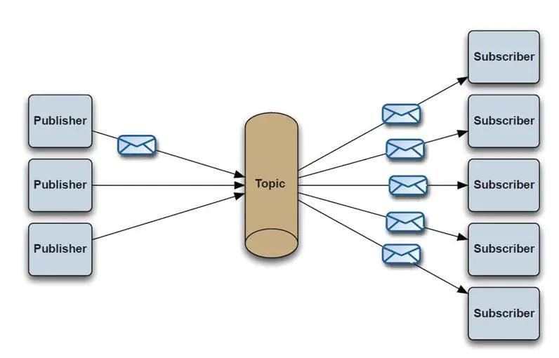

# ActiveMQ理论

## ActiveMQ处理模式

### PTP处理模式（Queue）
消息生产者生产消息发送到queue中，然后消息消费者从queue中取出并且消费消息。

消息被消费以后，queue中不再有存储，所以消息消费者不可能消费到已经被消费的消息。

Queue支持存在多个消费者，但是对一个消息而言，只会有一个消费者可以消费、其它的则不能消费此消息了。

当消费者不存在时，消息会一直保存，直到有消费消费


### Publish/Subscribe处理模式（Topic）
消息生产者（发布）将消息发布到topic中，同时有多个消息消费者（订阅）消费该消息。

和点对点方式不同，发布到topic的消息会被所有订阅者消费。

当生产者发布消息，不管是否有消费者。都不会保存消息

一定要先有消息的消费者，后有消息的生产者。



### PTP和PUB/SUB简单对比

|                  | Topic                                                                                                                      | Queue                                                                                                                                                     |
| ---------------- | -------------------------------------------------------------------------------------------------------------------------- | --------------------------------------------------------------------------------------------------------------------------------------------------------- |
| 概要             | Publish   Subscribe messaging 发布订阅消息                                                                                 | Point-to-Point点对点                                                                                                                                      |
| 有无状态         | topic数据默认不落地，是无状态的。                                                                                          | Queue数据默认会在mq服务器上以文件形式保存，比如Active MQ一般保存在$AMQ_HOME\data\kahadb下面。也可以配置成DB存储。                                         |
| 完整性保障       | 并不保证publisher发布的每条数据，Subscriber都能接受到。                                                                    | Queue保证每条数据都能被receiver接收。消息不超时。                                                                                                         |
| 消息是否会丢失   | 一般来说publisher发布消息到某一个topic时，只有正在监听该topic地址的sub能够接收到消息；如果没有sub在监听，该topic就丢失了。 | Sender发送消息到目标Queue，receiver可以异步接收这个Queue上的消息。Queue上的消息如果暂时没有receiver来取，也不会丢失。前提是消息不超时。                   |
| 消息发布接收策略 | 一对多的消息发布接收策略，监听同一个topic地址的多个sub都能收到publisher发送的消息。Sub接收完通知mq服务器                   | 一对一的消息发布接收策略，一个sender发送的消息，只能有一个receiver接收。receiver接收完后，通知mq服务器已接收，mq服务器对queue里的消息采取删除或其他操作。 |

## ActiveMQ安全认证
ActiveMQ安全认证
ActiveMQ也提供了安全认证。就是用户名密码登录规则。ActiveMQ如果需要使用安全认证的话，必须在activemq的核心配置文件中开启安全配置。配置文件就是conf/activemq.xml

在conf/activemq.xml配置文件的broker标签中增加下述内容。

<jaasAuthenticationPlugin configuration="activemq" />指定了使用JAAS插件管理权限，至于configuration="activemq"是在login.conf文件里定义的

<authorizationEntry topic="名字" read="用户组名" write="用户组名" admin="用户组名" />指定了具体的Topic/Queue与用户组的授权关系

<authorizationEntry topic="ActiveMQ.Advisory.>" read="admins" write="admins" admin="admins"/>这个是必须的配置，不能少

```xml
<plugins>
            <!--  use JAAS to authenticate using the login.config file on the classpath to configure JAAS -->
<!--  添加jaas认证插件activemq在login.config里面定义,详细见login.config-->

            <jaasAuthenticationPlugin configuration="activemq" />
            <!--  lets configure a destination based authorization mechanism -->
            <authorizationPlugin>
                <map>
                    <authorizationMap>
                        <authorizationEntries>
                            <authorizationEntry topic=">" read="admins" write="admins" admin="admins" />
                            <authorizationEntry queue=">" read="admins" write="admins" admin="admins" />
                            <authorizationEntry topic="ActiveMQ.Advisory.>" read="admins" write="admins" admin="admins"/>
                            <authorizationEntry queue="ActiveMQ.Advisory.>" read="admins" write="admins" admin="admins"/>
                        </authorizationEntries>
                    </authorizationMap>
                </map>
            </authorizationPlugin>
</plugins> 
```

开启认证后，认证使用的用户信息由其他配置文件提供。

conf/login.config
```xml
activemq {
    org.apache.activemq.jaas.PropertiesLoginModule required
        org.apache.activemq.jaas.properties.user="users.properties"
        org.apache.activemq.jaas.properties.group="groups.properties";
};
```

user代表用户信息配置文件，group代表用户组信息配置文件。寻址路径为相对当前配置文件所在位置开始寻址。

conf/users.properties 
```
#用户名=密码 
admin=admin
```

conf/groups.properties 
```
#用户组名=用户名，用户名 
admins=admin
```

## ActiveMQ的持久化
ActiveMQ中，持久化是指对消息数据的持久化。在ActiveMQ中，默认的消息是保存在内存中的。当内存容量不足的时候，或ActiveMQ正常关闭的时候，会将内存中的未处理的消息持久化到磁盘中。具体的持久化策略由配置文件中的具体配置决定。

ActiveMQ的默认存储策略是kahadb。如果使用JDBC作为持久化策略，则会将所有的需要持久化的消息保存到数据库中。

所有的持久化配置都在conf/activemq.xml中配置，配置信息都在broker标签内部定义。

### 1 kahadb方式
是ActiveMQ默认的持久化策略。kahadb是一个文件型数据库。是使用内存+文件保证数据的持久化的。kahadb可以限制每个数据文件的大小。不代表总计数据容量。

```xml
<persistenceAdapter>
 <!-- directory:保存数据的目录; journalMaxFileLength:保存消息的文件大小 -->
 <kahaDB directory="${activemq.data}/kahadb" journalMaxFileLength="16mb"/>
</persistenceAdapter>
```

特性是：1、日志形式存储消息；2、消息索引以B-Tree结构存储，可以快速更新；3、完全支持JMS事务；4、支持多种恢复机制；


### AMQ方式
只适用于5.3版本之前。

AMQ也是一个文件型数据库，消息信息最终是存储在文件中。内存中也会有缓存数据。
```xml
<persistenceAdapter>
   <!-- directory:保存数据的目录 ; maxFileLength:保存消息的文件大小 -->
   <amqPersistenceAdapter directory="${activemq.data}/amq" maxFileLength="32mb"/>
</persistenceAdapter>
```

性能高于JDBC，写入消息时，会将消息写入日志文件，由于是顺序追加写，性能很高。为了提升性能，创建消息主键索引，并且提供缓存机制，进一步提升性能。每个日志文件的大小都是有限制的（默认32m，可自行配置）。

当超过这个大小，系统会重新建立一个文件。当所有的消息都消费完成，系统会删除这个文件或者归档。

主要的缺点是AMQ Message会为每一个Destination创建一个索引，如果使用了大量的Queue，索引文件的大小会占用很多磁盘空间。

而且由于索引巨大，一旦Broker（ActiveMQ应用实例）崩溃，重建索引的速度会非常慢。

虽然AMQ性能略高于Kaha DB方式，但是由于其重建索引时间过长，而且索引文件占用磁盘空间过大，所以已经不推荐使用。


### 3 JDBC持久化方式
ActiveMQ将数据持久化到数据库中。 不指定具体的数据库。 可以使用任意的数据库中。 本环节中使用MySQL数据库。

下述文件为activemq.xml配置文件部分内容。不要完全复制。

首先定义一个mysql-ds的MySQL数据源，然后在persistenceAdapter节点中配置jdbcPersistenceAdapter并且引用刚才定义的数据源。

dataSource指定持久化数据库的bean，**createTablesOnStartup是否在启动的时候创建数据表，默认值是true，这样每次启动都会去创建数据表了，一般是第一次启动的时候设置为true，之后改成false。**

```xml
<broker brokerName="test-broker" persistent="true" 
xmlns="http://activemq.apache.org/schema/core">
<persistenceAdapter>
<jdbcPersistenceAdapter dataSource="#mysql-ds" 
createTablesOnStartup="false"/>
</persistenceAdapter>
</broker>
<bean id="mysql-ds" class="org.apache.commons.dbcp.BasicDataSource" 
destroy-method="close">
<property name="driverClassName" value="com.mysql.jdbc.Driver"/>
<property name="url" 
value="jdbc:mysql://localhost/activemq?relaxAutoCommit=true"/>
<property name="username" value="activemq"/>
<property name="password" value="activemq"/>
<property name="maxActive" value="200"/>
<property name="poolPreparedStatements" value="true"/>
</bean>
```

配置成功后，需要在数据库中创建对应的database，否则无法访问。表格ActiveMQ可以自动创建。

activemq_msgs用于存储消息，Queue和Topic都存储在这个表中：

ID：自增的数据库主键

CONTAINER：消息的Destination

MSGID_PROD：消息发送者客户端的主键

MSG_SEQ：是发送消息的顺序，MSGID_PROD+MSG_SEQ可以组成JMS的MessageID

EXPIRATION：消息的过期时间，存储的是从1970-01-01到现在的毫秒数

MSG：消息本体的Java序列化对象的二进制数据

PRIORITY：优先级，从0-9，数值越大优先级越高


activemq_acks用于存储订阅关系。如果是持久化Topic，订阅者和服务器的订阅关系在这个表保存：

主要的数据库字段如下：

CONTAINER：消息的Destination

SUB_DEST：如果是使用Static集群，这个字段会有集群其他系统的信息

CLIENT_ID：每个订阅者都必须有一个唯一的客户端ID用以区分

SUB_NAME：订阅者名称

SELECTOR：选择器，可以选择只消费满足条件的消息。条件可以用自定义属性实现，可支持多属性AND和OR操作

LAST_ACKED_ID：记录消费过的消息的ID。

表activemq_lock在集群环境中才有用，只有一个Broker可以获得消息，称为Master Broker，

其他的只能作为备份等待Master Broker不可用，才可能成为下一个Master Broker。
这个表用于记录哪个Broker是当前的Master Broker。

只有在消息必须保证有效，且绝对不能丢失的时候。使用JDBC存储策略。

如果消息可以容忍丢失，或使用集群/主备模式保证数据安全的时候，建议使用levelDB或Kahadb。


## API简介
### Producer API简介

#### 发送消息
MessageProducer.
```java
send(Message message);发送消息到默认目的地，就是创建Producer时指定的目的地。

send(Destination destination, Message message); 发送消息到指定目的地，Producer不建议绑定目的地。也就是创建Producer的时候，不绑定目的地。session.createProducer(null)。

send(Message message, int deliveryMode, int priority, long timeToLive);发送消息到默认目的地，且设置相关参数。deliveryMode-持久化方式（DeliveryMode.PERSISTENT| DeliveryMode.NON_PERSISTENT）。priority-优先级。timeToLive-消息有效期（单位毫秒）。

send(Destination destination, Message message, int deliveryMode, int priority, long timeToLive); 发送消息到指定目的地，且设置相关参数。
```

#### 消息有效期
消息过期后，默认会将失效消息保存到“死信队列（ActiveMQ.DLQ）”。

不持久化的消息，在超时后直接丢弃，不会保存到死信队列中。

死信队列名称可配置，死信队列中的消息不能恢复。

死信队列是在activemq.xml中配置的。

#### 消息优先级
不需特殊关注。了解一下。

我们可以在发送消息时，指定消息的权重，broker可以建议权重较高的消息将会优先发送给Consumer。在某些场景下，我们通常希望权重较高的消息优先传送；不过因为各种原因，priority并不能决定消息传送的严格顺序(order)。

JMS标准中约定priority可以为09的整数数值，值越大表示权重越高，默认值为4。不过activeMQ中各个存储器对priority的支持并非完全一样。比如JDBC存储器可以支持09，因为JDBC存储器可以基于priority对消息进行排序和索引化；但是对于kahadb/levelDB等这种基于日志文件的存储器而言，priority支持相对较弱，只能识别三种优先级(LOW: < 4,NORMAL: =4,HIGH: > 4)。

##### 开启
在broker端，默认是不存储priority信息的，我们需要手动开启，修改activemq.xml配置文件，在broker标签的子标签policyEntries中增加下述配置：
```xml
<policyEntry queue=">" prioritizedMessages="true"/>  
```

不过对于“非持久化”类型的消息(如果没有被swap到临时文件)，它们被保存在内存中，它们不存在从文件Paged in到内存的过程，因为可以保证优先级较高的消息，总是在prefetch的时候被优先获取，这也是“非持久化”消息可以担保消息发送顺序的优点。

Broker在收到Producer的消息之后，将会把消息cache到内存，如果消息需要持久化，那么同时也会把消息写入文件；如果通道中Consumer的消费速度足够快(即积压的消息很少，尚未超过内存限制，我们通过上文能够知道，每个通道都可以有一定的内存用来cache消息)，那么消息几乎不需要从存储文件中Paged In，直接就能从内存的cache中获取即可，这种情况下，priority可以担保“全局顺序”；不过，如果消费者滞后太多，cache已满，就会触发新接收的消息直接保存在磁盘中，那么此时，priority就没有那么有效了。

在Queue中，prefetch的消息列表默认将会采用“轮询”的方式(roundRobin，注意并不是roundRobinDispatch)[备注：因为Queue不支持任何DispatchPolicy]，依次添加到每个consumer的pending buffer中，比如有m1-m2-m3-m4四条消息，有C1-C2两个消费者，那么: m1->C1,m2->C2,m3->C1,m4->C2。这种轮序方式，会对基于权重的消息发送有些额外的影响，假如四条消息的权重都不同，但是(m1,m3)->C1，事实上m2的权重>m3,对于C1而言，它似乎丢失了“顺序性”。


#####  强顺序
```xml
<policyEntry queue=">" strictOrderDispatch="true"/>
```
strictOrderDispatch“严格顺序转发”，这是区别于“轮询”的一种消息转发手段；不过不要误解它为“全局严格顺序”，它只不过是将prefetch的消息依次填满每个consumer的pending buffer。比如上述例子中，如果C1-C2两个消费者的buffer尺寸为3，那么(m1,m2,m3)->C1,(m4)->C2;当C1填充完毕之后，才会填充C2。由此这种策略可以保证buffer中所有的消息都是“权重临近的”、有序的。(需要注意：strictOrderDispatch并非是解决priority消息顺序的问题而生，只是在使用priority时需要关注它)。

#####  严格顺序
```xml
policyEntry queue=">" prioritizedMessages="true" useCache="false" expireMessagesPeriod="0" queuePrefetch="1"/>
```
useCache=false来关闭内存，强制将所有的消息都立即写入文件(索引化，但是会降低消息的转发效率)；queuePrefetch=1来约束每个consumer任何时刻只有一个消息正在处理，那些消息消费之后，将会从文件中重新获取，这大大增加了消息文件操作的次数，不过每次读取肯定都是priority最高的消息。


### Consumer API简介

#### 消息的确认
Consumer拉取消息后，如果没有做确认acknowledge，此消息不会从MQ中删除。

消息的如果拉去到consumer后，未确认，那么消息被锁定。如果consumer关闭的时候仍旧没有确认消息，则释放消息锁定信息。消息将发送给其他的consumer处理。

**消息一旦处理，应该必须确认**。类似数据库中的事务管理机制。

#### 消息的过滤
对消息消费者处理的消息数据进行过滤。这种处理可以明确消费者的角色，细分消费者的功能。

设置过滤：
```java
Session.createConsumer(Destination destination, String messageSelector);
```

过滤信息为字符串，语法类似SQL92中的where子句条件信息。可以使用诸如AND、OR、IN、NOT IN等关键字。详细内容可以查看javax.jms.Message的帮助文档。

注意：消息的生产者在发送消息的的时候，必须设置可过滤的属性信息，所有的属性信息设置方法格式为:setXxxxProperty(String name, T value)。 其中方法名中的Xxxx是类型，如setObjectProperty/setStringProperty等。


## Spring&ActiveMQ
详见代码

ActiveMQ的开发，和Spring的整合是非常方便的。且Spring有对JMS提供的Template机制。所以Spring管理ActiveMQ访问操作是非常方便的。


```

```


