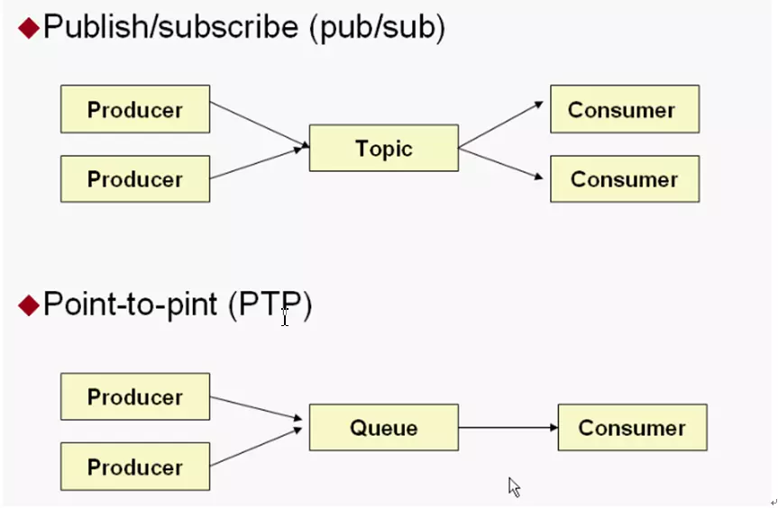

# 消息中间件ActiveMQ详解以及使用Spring整合ActiveMQ
`https://www.jianshu.com/p/860de4a75450`
`https://www.cnblogs.com/yanfei1819/p/10615605.html`

## 消息中间件的介绍

### 介绍
**​消息队列** 是指利用 **高效可靠** 的 **消息传递机制** 进行与平台无关的 **数据交流**，并基于 **数据通信** 来进行分布式系统的集成。

### 特点(作用)
```
应用解耦
异步通信
流量削峰
(海量)日志处理
消息通讯
...
```

### 应用场景
根据消息队列的特点，可以衍生出很多场景，或者说很多场景都能用到。下面举几个例子：

1）异步通信

​ 注册时的短信、邮件通知，减少响应时间；

2）应用解耦

​ 信息发送者和消息接受者无需耦合，比如调用第三方；

3）流量削峰

​ 例如秒杀系统；


## ActiveMQ的安装
第一步把ActiveMQ 的压缩包上传到Linux系统并解压。

第二步将ActiveMQ的目录移动到合适的目录并进入到bin目录启动ActiveMQ


**ActiveMQ启动等命令** 

启动ActiveMQ
```
[root@cehae bin]# ./activemq start
```
查看ActiveMQ状态
```
[root@cehae bin]# ./activemq status
```
关闭ActiveMQ
```
[root@cehae bin]# ./activemq stop
```

第三步进入管理后台

在windows浏览器中输入http://192.168.25.200:8161/admin
输入账户和密码 admin后看到管理后台代表成功。

## ActiveMQ页面介绍
待ActiveMQ安装启动好，访问http://ip:8161/admin，登录名和密码都是admin(在配置文件中可修改)，进入ActiveMQ的主页：


下面来介绍每个菜单的功能：

### Queue消息队列页面


Name：消息队列的名称。

Number Of Pending Messages：未被消费的消息数目。

Number Of Consumers：消费者的数量。

Messages Enqueued：进入队列的消息 ；进入队列的总消息数目，包括已经被消费的和未被消费的。 这个数量只增不减。

Messages Dequeued：出了队列的消息，可以理解为是被消费掉的消息数量。在Queues里它和进入队列的总数量相等(因为一个消息只会被成功消费一次),如果暂时不等是因为消费者还没来得及消费。

### Topic主题页面


Name：主题名称。

Number Of Pending Messages：未被消费的消息数目。

Number Of Consumers：消费者的数量。

Messages Enqueued：进入队列的消息 ；进入队列的总消息数目，包括已经被消费的和未被消费的。 这个数量只增不减。

Messages Dequeued：出了队列的消息，可以理解为是被消费掉的消息数量。在Topics里，因为多消费者从而导致数量会比入队列数高。

### Subscribers查看订阅者页面


查看订阅者信息，只在Topics消息类型中这个页面才会有数据。

### Connections查看连接数页面


## ActiveMQ处理模式

### PTP处理模式（Queue）
消息生产者生产消息发送到queue中，然后消息消费者从queue中取出并且消费消息。

消息被消费以后，queue中不再有存储，所以消息消费者不可能消费到已经被消费的消息。

Queue支持存在多个消费者，但是对一个消息而言，只会有一个消费者可以消费、其它的则不能消费此消息了。

当消费者不存在时，消息会一直保存，直到有消费消费


### Publish/Subscribe处理模式（Topic）
消息生产者（发布）将消息发布到topic中，同时有多个消息消费者（订阅）消费该消息。

和点对点方式不同，发布到topic的消息会被所有订阅者消费。

当生产者发布消息，不管是否有消费者。都不会保存消息

一定要先有消息的消费者，后有消息的生产者。


### PTP和PUB/SUB简单对比

|                  | Topic                                                                                                                      | Queue                                                                                                                                                     |
| ---------------- | -------------------------------------------------------------------------------------------------------------------------- | --------------------------------------------------------------------------------------------------------------------------------------------------------- |
| 概要             | Publish   Subscribe messaging 发布订阅消息                                                                                 | Point-to-Point点对点                                                                                                                                      |
| 有无状态         | topic数据默认不落地，是无状态的。                                                                                          | Queue数据默认会在mq服务器上以文件形式保存，比如Active MQ一般保存在$AMQ_HOME\data\kahadb下面。也可以配置成DB存储。                                         |
| 完整性保障       | 并不保证publisher发布的每条数据，Subscriber都能接受到。                                                                    | Queue保证每条数据都能被receiver接收。消息不超时。                                                                                                         |
| 消息是否会丢失   | 一般来说publisher发布消息到某一个topic时，只有正在监听该topic地址的sub能够接收到消息；如果没有sub在监听，该topic就丢失了。 | Sender发送消息到目标Queue，receiver可以异步接收这个Queue上的消息。Queue上的消息如果暂时没有receiver来取，也不会丢失。前提是消息不超时。                   |
| 消息发布接收策略 | 一对多的消息发布接收策略，监听同一个topic地址的多个sub都能收到publisher发送的消息。Sub接收完通知mq服务器                   | 一对一的消息发布接收策略，一个sender发送的消息，只能有一个receiver接收。receiver接收完后，通知mq服务器已接收，mq服务器对queue里的消息采取删除或其他操作。 |


## ActiveMQ的使用
ActiveMQ两种消息形式结构图



### Queue消息
创建maven工程，把jar包添加到工程中。使用5.11.2版本的jar包。

注意：如果ActiveMQ整合spring使用不要使用activemq-all-5.12.0.jar包。建议使用5.11.2。因为5.11.2版本的ActiveMQ会有Spring的源码，会有冲突。

#### 使用生产者发布Queue消息
```java
@Test
public void testQueueProducer() throws Exception {
// 1创建一个连接工厂，需要指定如果服务的ip和端口
    ConnectionFactory factory = new ActiveMQConnectionFactory("tcp://192.168.25.200:61616");

    // 2使用工厂创建一个Connection对象，
    Connection connection = factory.createConnection();

    // 3开启连接，调用Connection对象的start方法
    connection.start();

    // 4创建一个Session对象
    // 参数1：是否开启事务，一般不开启事务。如果开启事务自定忽略第二个参数。
    // 参数2：应答模式。自动应答和手动应答，一般使用自动应答。
    Session session = connection.createSession(false, Session.AUTO_ACKNOWLEDGE);

    // 5使用Session对象创建一个Destination(接口)对象， 两种形式Queue和Topic，现在应该使用queue.
    Queue queue = session.createQueue("test-Queue");

    // 6使用Session对象创建一个Producer对象
    MessageProducer producer = session.createProducer(queue);

    // 7创建一个Messaeg对象，可以使用TextMessage。
    TextMessage textMessage = session.createTextMessage("hello,ActiveMQ-Queue");
    // 8发送消息
    producer.send(textMessage);

    // 9关闭资源
    producer.close();
    session.close();
    connection.close();
}
```

#### 使用消费者接收Queue消息
```java
    @Test
    public void testQueueConsumer() throws Exception {

        // 1创建一个连接工厂连接MQ服务器。
        ConnectionFactory factory = new ActiveMQConnectionFactory("tcp://192.168.25.200:61616");

        // 2创建一个连接
        Connection connection = factory.createConnection();

        // 3开启连接
        connection.start();

        // 4使用Connection创建一个Session对象
        // 参数1：是否开启事务，一般不开启事务。如果开启事务自定忽略第二个参数。
        // 参数2：应答模式。自动应答和手动应答，一般使用自动应答。
        Session session = connection.createSession(false, Session.AUTO_ACKNOWLEDGE);

        // 5使用Session对象创建一个Destination(接口)对象， 两种形式Queue和Topic，现在应该使用queue.
        Queue queue = session.createQueue("test-Queue"); // 注意要和发布消息的在同一个队列

        // 6使用Session对象创建一个Consumer对象
        MessageConsumer consumer = session.createConsumer(queue);

        // 7使用consumer接收消息
        consumer.setMessageListener(new MessageListener() {

            @Override
            public void onMessage(Message message) {

                TextMessage txMessage = (TextMessage) message;
                String text = "";
                try {
                    text = txMessage.getText();
                } catch (JMSException e) {
                    // TODO Auto-generated catch block
                    e.printStackTrace();
                }
                System.out.println("message = " + text);
            }
        });

        // 8等待接收消息 ,目的是阻塞当前线程，等待接收消息
        System.in.read();

        // 9关闭资源
        consumer.close();
        session.close();
        connection.close();
    }
```


### Topic消息

#### 使用生产者发布Topic消息
```java
    @Test
    public void testTopicProducer() throws Exception {

        // 1创建一个连接工厂，需要指定如果服务的ip和端口
        ConnectionFactory factory = new ActiveMQConnectionFactory("tcp://192.168.25.200:61616");

        // 2使用工厂创建一个Connection对象，
        Connection connection = factory.createConnection();

        // 3开启连接，调用Connection对象的start方法
        connection.start();

        // 4创建一个Session对象
        // 参数1：是否开启事务，一般不开启事务。如果开启事务自定忽略第二个参数。
        // 参数2：应答模式。自动应答和手动应答，一般使用自动应答。
        Session session = connection.createSession(false, Session.AUTO_ACKNOWLEDGE);

        // 5使用Session对象创建一个Destination(接口)对象， 两种形式Queue和Topic，现在应该使用Topic.
        Topic topic = session.createTopic("test-Topic");

        // 6使用Session对象创建一个Producer对象
        MessageProducer producer = session.createProducer(topic);

        // 7创建一个Messaeg对象，可以使用TextMessage。
        TextMessage textMessage = session.createTextMessage("hello,ActiveMQ-Topic");
        // 8发送消息
        producer.send(textMessage);

        // 9关闭资源
        producer.close();
        session.close();
        connection.close();
    }
```


#### 使用消费者接收Topic消息 
```java
@Test
public void testTopicConsumer() throws Exception {

    // 1创建一个连接工厂连接MQ服务器。
    ConnectionFactory factory = new ActiveMQConnectionFactory("tcp://192.168.25.200:61616");

    // 2创建一个连接
    Connection connection = factory.createConnection();

    // 3开启连接
    connection.start();

    // 4使用Connection创建一个Session对象
    // 参数1：是否开启事务，一般不开启事务。如果开启事务自定忽略第二个参数。
    // 参数2：应答模式。自动应答和手动应答，一般使用自动应答。
    Session session = connection.createSession(false, Session.AUTO_ACKNOWLEDGE);

    // 5使用Session对象创建一个Destination(接口)对象， 两种形式Queue和Topic，现在应该使用Topic.
    Topic topic = session.createTopic("test-Topic");

    // 6使用Session对象创建一个Consumer对象
    MessageConsumer consumer = session.createConsumer(topic);

    // 7使用consumer接收消息
    consumer.setMessageListener(new MessageListener() {

        @Override
        public void onMessage(Message message) {

            TextMessage txMessage = (TextMessage) message;
            String text = "";
            try {
                text = txMessage.getText();
            } catch (JMSException e) {
                // TODO Auto-generated catch block
                e.printStackTrace();
            }
            System.out.println("message = " + text);
        }
    });

    // 8等待接收消息 ,目的是阻塞当前线程
    System.in.read();

    // 9关闭资源
    consumer.close();
    session.close();
    connection.close();
}
```

## Spring整合ActiveMQ

### Queue模式
#### 创建消息生产者工程springjms_producer
引入依赖
```xml
<project xmlns="http://maven.apache.org/POM/4.0.0" xmlns:xsi="http://www.w3.org/2001/XMLSchema-instance"
    xsi:schemaLocation="http://maven.apache.org/POM/4.0.0 http://maven.apache.org/xsd/maven-4.0.0.xsd">
    <modelVersion>4.0.0</modelVersion>
    <groupId>com.cehae.demo</groupId>
    <artifactId>springjms_producer</artifactId>
    <version>0.0.1-SNAPSHOT</version>

    <properties>
        <spring.version>4.2.4.RELEASE</spring.version>
    </properties>

    <dependencies>
        <dependency>
            <groupId>org.springframework</groupId>
            <artifactId>spring-jms</artifactId>
            <version>${spring.version}</version>
        </dependency>
        <dependency>
            <groupId>org.springframework</groupId>
            <artifactId>spring-test</artifactId>
            <version>${spring.version}</version>
        </dependency>
        <dependency>
            <groupId>junit</groupId>
            <artifactId>junit</artifactId>
            <version>4.9</version>
        </dependency>
        <dependency>
            <groupId>org.apache.activemq</groupId>
            <artifactId>activemq-client</artifactId>
            <version>5.13.4</version>
        </dependency>
    </dependencies>
</project>
```

添加配置文件applicationContext-jms-producer_queue.xml

```xml
<?xml version="1.0" encoding="UTF-8"?>
<beans xmlns="http://www.springframework.org/schema/beans"
    xmlns:context="http://www.springframework.org/schema/context"
    xmlns:xsi="http://www.w3.org/2001/XMLSchema-instance" xmlns:amq="http://activemq.apache.org/schema/core"
    xmlns:jms="http://www.springframework.org/schema/jms"
    xsi:schemaLocation="http://www.springframework.org/schema/beans   
        http://www.springframework.org/schema/beans/spring-beans.xsd
        http://www.springframework.org/schema/context   
        http://www.springframework.org/schema/context/spring-context.xsd">


    <context:component-scan base-package="com.cehae.demo.queen"></context:component-scan>


    <!-- 真正可以产生Connection的ConnectionFactory，由对应的 JMS服务厂商提供 -->
    <bean id="targetConnectionFactory" class="org.apache.activemq.ActiveMQConnectionFactory">
        <property name="brokerURL" value="tcp://192.168.25.200:61616" />
    </bean>

    <!-- Spring用于管理真正的ConnectionFactory的ConnectionFactory -->
    <bean id="connectionFactory"
        class="org.springframework.jms.connection.SingleConnectionFactory">
        <!-- 目标ConnectionFactory对应真实的可以产生JMS Connection的ConnectionFactory -->
        <property name="targetConnectionFactory" ref="targetConnectionFactory" />
    </bean>

    <!-- Spring提供的JMS工具类，它可以进行消息发送、接收等 -->
    <bean id="jmsTemplate" class="org.springframework.jms.core.JmsTemplate">
        <!-- 这个connectionFactory对应的是我们定义的Spring提供的那个ConnectionFactory对象 -->
        <property name="connectionFactory" ref="connectionFactory" />
    </bean>
    
    <!--这个是队列目的地，点对点的 文本信息 -->
    <bean id="queueTextDestination" class="org.apache.activemq.command.ActiveMQQueue">
        <constructor-arg value="queue_text" />
    </bean>

</beans>
```

编写消息生产者QueueProducer
```java
package com.cehae.demo.queen;

import javax.jms.Destination;
import javax.jms.JMSException;
import javax.jms.Message;
import javax.jms.Session;

import org.springframework.beans.factory.annotation.Autowired;
import org.springframework.jms.core.JmsTemplate;
import org.springframework.jms.core.MessageCreator;
import org.springframework.stereotype.Component;

@Component
public class QueueProducer {

    @Autowired
    private JmsTemplate jmsTemplate;

    @Autowired
    private Destination queueTextDestination;

    /**
     * 发送文本消息
     * 
     * @param text
     */
    public void sendTextMessage(final String text) {

        jmsTemplate.send(queueTextDestination, new MessageCreator() {

            @Override
            public Message createMessage(Session session) throws JMSException {

                return session.createTextMessage(text);
            }
        });
    }
}
```

编写测试类TestQueue.java
```java
package com.cehae.test.queue;

import org.junit.Test;
import org.junit.runner.RunWith;
import org.springframework.beans.factory.annotation.Autowired;
import org.springframework.test.context.ContextConfiguration;
import org.springframework.test.context.junit4.SpringJUnit4ClassRunner;

import com.cehae.demo.queen.QueueProducer;

@RunWith(SpringJUnit4ClassRunner.class)
@ContextConfiguration(locations = "classpath:spring/applicationContext-jms-producer_queue.xml")
public class TestQueue {

    @Autowired
    private QueueProducer queueProducer;

    @Test
    public void testSend() {
        queueProducer.sendTextMessage("SpringJms-queue");
    }
}
```

#### 创建消息消费者工程springjms_consumer
引入依赖
```xml
<project xmlns="http://maven.apache.org/POM/4.0.0" xmlns:xsi="http://www.w3.org/2001/XMLSchema-instance"
    xsi:schemaLocation="http://maven.apache.org/POM/4.0.0 http://maven.apache.org/xsd/maven-4.0.0.xsd">
    <modelVersion>4.0.0</modelVersion>
    <groupId>com.cehae.demo</groupId>
    <artifactId>springjms_consumer</artifactId>
    <version>0.0.1-SNAPSHOT</version>

    <properties>
        <spring.version>4.2.4.RELEASE</spring.version>
    </properties>

    <dependencies>
        <dependency>
            <groupId>org.springframework</groupId>
            <artifactId>spring-jms</artifactId>
            <version>${spring.version}</version>
        </dependency>
        <dependency>
            <groupId>org.springframework</groupId>
            <artifactId>spring-test</artifactId>
            <version>${spring.version}</version>
        </dependency>
        <dependency>
            <groupId>junit</groupId>
            <artifactId>junit</artifactId>
            <version>4.9</version>
        </dependency>
        <dependency>
            <groupId>org.apache.activemq</groupId>
            <artifactId>activemq-client</artifactId>
            <version>5.13.4</version>
        </dependency>
    </dependencies>
</project>
```

编写queue消息监听者MyQueueMessageListener.java
```java
package com.cehae.demo.queue;

import javax.jms.JMSException;
import javax.jms.Message;
import javax.jms.MessageListener;
import javax.jms.TextMessage;

public class MyQueueMessageListener implements MessageListener {
    public void onMessage(Message message) {
        TextMessage textMessage = (TextMessage) message;
        try {
            System.out.println("接收到消息：" + textMessage.getText());
        } catch (JMSException e) {
            e.printStackTrace();
        }
    }
}
```

编写测试类TestQueue.java
```java
package com.cehae.test.queue;

import java.io.IOException;

import org.junit.Test;
import org.junit.runner.RunWith;
import org.springframework.test.context.ContextConfiguration;
import org.springframework.test.context.junit4.SpringJUnit4ClassRunner;

@RunWith(SpringJUnit4ClassRunner.class)
@ContextConfiguration(locations = "classpath:spring/applicationContext-jms-consumer-queue.xml")
public class TestQueue {
    @Test
    public void testQueue() {
        try {
            System.in.read();
        } catch (IOException e) {
            e.printStackTrace();
        }
    }
}
```

### Topic模式
#### springjms_producer工程
在springjms_producer工程添加配置文件applicationContext-jms-producer_topic.xml

```xml
<?xml version="1.0" encoding="UTF-8"?>
<beans xmlns="http://www.springframework.org/schema/beans"
    xmlns:context="http://www.springframework.org/schema/context"
    xmlns:xsi="http://www.w3.org/2001/XMLSchema-instance" xmlns:amq="http://activemq.apache.org/schema/core"
    xmlns:jms="http://www.springframework.org/schema/jms"
    xsi:schemaLocation="http://www.springframework.org/schema/beans   
        http://www.springframework.org/schema/beans/spring-beans.xsd
        http://www.springframework.org/schema/context   
        http://www.springframework.org/schema/context/spring-context.xsd">


    <context:component-scan base-package="com.cehae.demo.topic"></context:component-scan>


    <!-- 真正可以产生Connection的ConnectionFactory，由对应的 JMS服务厂商提供 -->
    <bean id="targetConnectionFactory" class="org.apache.activemq.ActiveMQConnectionFactory">
        <property name="brokerURL" value="tcp://192.168.25.200:61616" />
    </bean>

    <!-- Spring用于管理真正的ConnectionFactory的ConnectionFactory -->
    <bean id="connectionFactory"
        class="org.springframework.jms.connection.SingleConnectionFactory">
        <!-- 目标ConnectionFactory对应真实的可以产生JMS Connection的ConnectionFactory -->
        <property name="targetConnectionFactory" ref="targetConnectionFactory" />
    </bean>

    <!-- Spring提供的JMS工具类，它可以进行消息发送、接收等 -->
    <bean id="jmsTemplate" class="org.springframework.jms.core.JmsTemplate">
        <!-- 这个connectionFactory对应的是我们定义的Spring提供的那个ConnectionFactory对象 -->
        <property name="connectionFactory" ref="connectionFactory" />
    </bean>


    <!--这个是订阅模式 文本信息 -->
    <bean id="topicTextDestination" class="org.apache.activemq.command.ActiveMQTopic">
        <constructor-arg value="topic_text" />
    </bean>

</beans>
```
编写topic消息生成者TopicProducer.java
```java
package com.cehae.demo.topic;

import javax.jms.Destination;
import javax.jms.JMSException;
import javax.jms.Message;
import javax.jms.Session;

import org.springframework.beans.factory.annotation.Autowired;
import org.springframework.jms.core.JmsTemplate;
import org.springframework.jms.core.MessageCreator;
import org.springframework.stereotype.Component;

@Component
public class TopicProducer {
    @Autowired
    private JmsTemplate jmsTemplate;

    @Autowired
    private Destination topicTextDestination;

    /**
     * 发送文本消息
     * 
     * @param text
     */
    public void sendTextMessage(final String text) {
        jmsTemplate.send(topicTextDestination, new MessageCreator() {
            public Message createMessage(Session session) throws JMSException {
                return session.createTextMessage(text);
            }
        });
    }
}
```
编写测试类TestTopic.java
```java
package com.cehae.test.topic;

import org.junit.Test;
import org.junit.runner.RunWith;
import org.springframework.beans.factory.annotation.Autowired;
import org.springframework.test.context.ContextConfiguration;
import org.springframework.test.context.junit4.SpringJUnit4ClassRunner;

import com.cehae.demo.topic.TopicProducer;

@RunWith(SpringJUnit4ClassRunner.class)
@ContextConfiguration(locations = "classpath:spring/applicationContext-jms-producer_topic.xml")
public class TestTopic {
    @Autowired
    private TopicProducer topicProducer;

    @Test
    public void sendTextQueue() {
        topicProducer.sendTextMessage("SpringJms-topic");
    }
}
```


#### springjms_consumer工程
在springjms_consumer工程添加配置文件applicationContext-jms-consumer-topic.xml

```xml
<?xml version="1.0" encoding="UTF-8"?>
<beans xmlns="http://www.springframework.org/schema/beans"
    xmlns:context="http://www.springframework.org/schema/context"
    xmlns:xsi="http://www.w3.org/2001/XMLSchema-instance" xmlns:amq="http://activemq.apache.org/schema/core"
    xmlns:jms="http://www.springframework.org/schema/jms"
    xsi:schemaLocation="http://www.springframework.org/schema/beans   
        http://www.springframework.org/schema/beans/spring-beans.xsd
        http://www.springframework.org/schema/context   
        http://www.springframework.org/schema/context/spring-context.xsd">

    <!-- 真正可以产生Connection的ConnectionFactory，由对应的 JMS服务厂商提供 -->
    <bean id="targetConnectionFactory" class="org.apache.activemq.ActiveMQConnectionFactory">
        <property name="brokerURL" value="tcp://192.168.25.200:61616" />
    </bean>

    <!-- Spring用于管理真正的ConnectionFactory的ConnectionFactory -->
    <bean id="connectionFactory"
        class="org.springframework.jms.connection.SingleConnectionFactory">
        <!-- 目标ConnectionFactory对应真实的可以产生JMS Connection的ConnectionFactory -->
        <property name="targetConnectionFactory" ref="targetConnectionFactory" />
    </bean>

    <!--这个是队列目的地，点对点的 文本信息 -->
    <bean id="topicTextDestination" class="org.apache.activemq.command.ActiveMQTopic">
        <constructor-arg value="topic_text" />
    </bean>

    <!-- 我的监听类 -->
    <bean id="myTopicMessageListener" class="com.cehae.demo.topic.MyTopicMessageListener"></bean>
    <!-- 消息监听容器 -->

    <bean
        class="org.springframework.jms.listener.DefaultMessageListenerContainer">
        <property name="connectionFactory" ref="connectionFactory" />
        <property name="destination" ref="topicTextDestination" />
        <property name="messageListener" ref="myTopicMessageListener" />
    </bean>

</beans>
```

编写topic消息消费者MyTopicMessageListener.java
```java
package com.cehae.demo.topic;

import javax.jms.JMSException;
import javax.jms.Message;
import javax.jms.MessageListener;
import javax.jms.TextMessage;

public class MyTopicMessageListener implements MessageListener {
    public void onMessage(Message message) {
        TextMessage textMessage = (TextMessage) message;
        try {
            System.out.println("接收到消息：" + textMessage.getText());
        } catch (JMSException e) {
            e.printStackTrace();
        }
    }
}
```

编写测试类TestTopic.java
```java
package com.cehae.test.topic;

import java.io.IOException;

import org.junit.Test;
import org.junit.runner.RunWith;
import org.springframework.test.context.ContextConfiguration;
import org.springframework.test.context.junit4.SpringJUnit4ClassRunner;

@RunWith(SpringJUnit4ClassRunner.class)
@ContextConfiguration(locations = "classpath:spring/applicationContext-jms-consumer-topic.xml")
public class TestTopic {
    @Test
    public void testQueue() {
        try {
            System.in.read();
        } catch (IOException e) {
            e.printStackTrace();
        }
    }
}
```


```java

```


