# Mybatis base

## JDBC 编程的分析

### JDBC基础代码回顾
JDBCTest.java
```java
import java.sql.Connection;
import java.sql.DriverManager;
import java.sql.PreparedStatement;
import java.sql.ResultSet;

/**
 * @author Evan
 */
public class JDBCTest {
    public static void main(String[] args) throws Exception {
        Connection connection = null;
        PreparedStatement prepareStatement = null;
        ResultSet rs = null;

        try {
            // 加载驱动
            Class.forName("com.mysql.jdbc.Driver");
            // 获取连接
            String url = "jdbc:mysql://127.0.0.1:3306/ssmdemo";
            String user = "root";
            String password = "123456";
            connection = DriverManager.getConnection(url, user, password);
            // 获取statement，preparedStatement
            String sql = "select * from tb_user where id=?";
            prepareStatement = connection.prepareStatement(sql);
            // 设置参数
            prepareStatement.setLong(1, 1l);
            // 执行查询
            rs = prepareStatement.executeQuery();
            // 处理结果集
            while (rs.next()) {
                System.out.println(rs.getString("userName"));
                System.out.println(rs.getString("name"));
                System.out.println(rs.getInt("age"));
                System.out.println(rs.getDate("birthday"));
            }
        } finally {
            // 关闭连接，释放资源
            if (rs != null) {
                rs.close();
            }
            if (prepareStatement != null) {
                prepareStatement.close();
            }
            if (connection != null) {
                connection.close();
            }
        }
    }
}
```

### JDBC缺点分析
* 1、数据库链接创建、释放频繁造成系统资源浪费从而影响系统性能,如果使用数据库链接池可解决此问题。    
* 2、Sql 语句在代码中硬编码,造成代码不易维护,实际应用 sql 变化的可能较大,sql 变动需要改变 java    
* 代码。    
* 3、使用 preparedStatement 向占有位符号传参数存在硬编码,因为 sql 语句的 where 条件不一定,可能    
* 多也可能少,修改 sql 还要修改代码,系统不易维护。    
* 4、对结果集解析存在硬编码(查询列名),sql 变化导致解析代码变化,系统不易维护,如果能将数据库记    
* 录封装成 pojo 对象解析比较方便。   

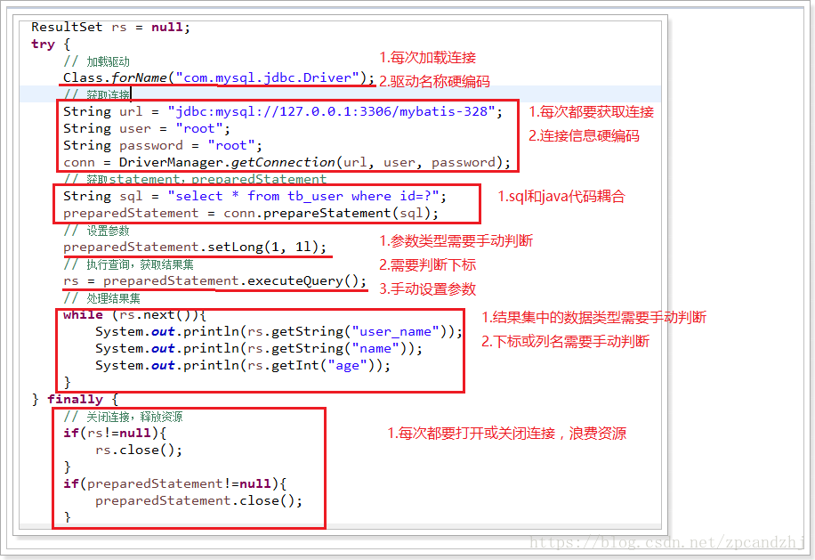

## MyBatis 简介
MyBatis 本是apache的一个开源项目iBatis, 2010年这个项目由apache software foundation 迁移到了google code，并且改名为MyBatis 。2013年11月迁移到Github。

iBATIS一词来源于“internet”和“abatis”的组合，是一个基于Java的持久层框架。iBATIS提供的持久层框架包括SQL Maps和Data Access Objects（DAOs）

mybatis 是一个优秀的基于 java 的持久层框架,它内部封装了 jdbc,使开发者只需要关注 sql 语句本身,而不需要花费精力去处理加载驱动、创建连接、创建 statement 等繁杂的过程。

mybatis 通过 xml 或注解的方式将要执行的各种 statement 配置起来,并通过 java 对象和 statement 中 sql 的动态参数进行映射生成最终执行的 sql 语句,最后由 mybatis 框架执行 sql 并将结果映射为 java 对象并返回。

采用 ORM 思想解决了实体和数据库映射的问题,对 jdbc 进行了封装,屏蔽了 jdbc api 底层访问细节,使我们不用与 jdbc api 打交道,就可以完成对数据库的持久化操作。

作为持久层的框架,还有一个封装程度更高的框架就是 Hibernate,但这个框架因为各种原因目前在国内的流行程度下降太多,现在公司开发也越来越少使用。目前使用 Spring Data 来实现数据持久化也是一种趋势。

## Mybaits整体架构
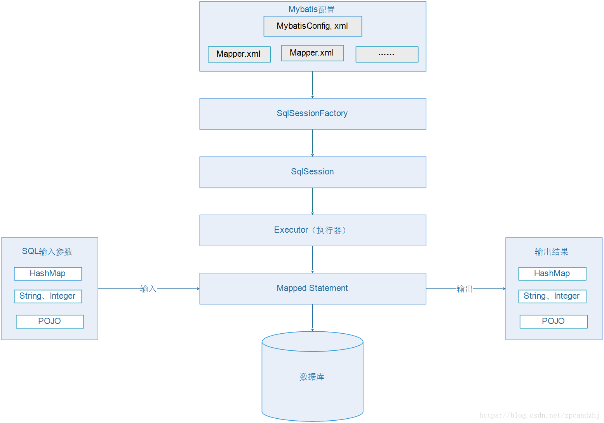

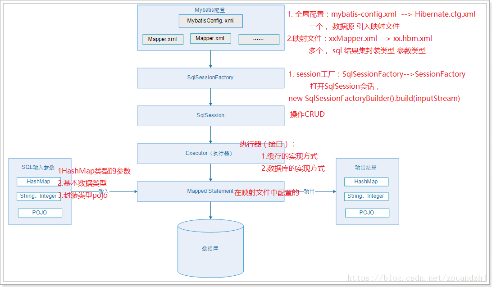

## 快速入门（quick start）

### 准备数据库
创建数据库：
```sql
CREATE DATABASE ssmdemo;
```

创建表：
```sql
DROP TABLE IF EXISTS tb_user;
CREATE TABLE tb_user (
    id char(32) NOT NULL,
    user_name varchar(32) DEFAULT NULL,
    password varchar(32) DEFAULT NULL,
    name varchar(32) DEFAULT NULL,
    age int(10) DEFAULT NULL,
    sex int(2) DEFAULT NULL,
    birthday date DEFAULT NULL,
    created datetime DEFAULT NULL,
    updated datetime DEFAULT NULL,
    PRIMARY KEY (id)
) ENGINE=InnoDB DEFAULT CHARSET=utf8;
```

插入数据：
```sql
INSERT INTO ssmdemo.tb_user ( userName, password, name, age, sex, birthday, created, updated) VALUES ( ‘zpc’, ‘123456’, ‘鹏程’, ‘22’, ‘1’, ‘1990-09-02’, sysdate(), sysdate());
INSERT INTO ssmdemo.tb_user ( userName, password, name, age, sex, birthday, created, updated) VALUES ( ‘hj’, ‘123456’, ‘静静’, ‘22’, ‘1’, ‘1993-09-05’, sysdate(), sysdate());
```

### 引入依赖（pom.xml）
```xml
<dependencies>
        <dependency>
            <groupId>org.mybatis</groupId>
            <artifactId>mybatis</artifactId>
            <version>3.4.5</version>
        </dependency>
        <dependency>
            <groupId>mysql</groupId>
            <artifactId>mysql-connector-java</artifactId>
            <version>5.1.47</version>
        </dependency>
        <dependency>
            <groupId>log4j</groupId>
            <artifactId>log4j</artifactId>
            <version>1.2.17</version>
        </dependency>
        <dependency>
            <groupId>junit</groupId>
            <artifactId>junit</artifactId>
            <version>4.12</version>
        </dependency>
</dependencies>
```

### 全局配置文件（mybatis-config.xml）
```xml
<?xml version="1.0" encoding="UTF-8" ?>
<!DOCTYPE configuration
  PUBLIC "-//mybatis.org//DTD Config 3.0//EN"
  "http://mybatis.org/dtd/mybatis-3-config.dtd">
<!-- 根标签 -->
<configuration>
<properties>
	<property name="driver" value="com.mysql.jdbc.Driver"/>
	<property name="url" value="jdbc:mysql://127.0.0.1:3306/mybatis-110?useUnicode=true&amp;characterEncoding=utf-8&amp;allowMultiQueries=true"/>
	<property name="username" value="root"/>
    	<property name="password" value="123456"/>
   </properties>

   <!-- 环境，可以配置多个，default：指定采用哪个环境 -->
   <environments default="test">
      <!-- id：唯一标识 -->
      <environment id="test">
         <!-- 事务管理器，JDBC类型的事务管理器 -->
         <transactionManager type="JDBC" />
         <!-- 数据源，池类型的数据源 -->
         <dataSource type="POOLED">
            <property name="driver" value="com.mysql.jdbc.Driver" />
            <property name="url" value="jdbc:mysql://127.0.0.1:3306/mybatis-110" />
            <property name="username" value="root" />
            <property name="password" value="123456" />
         </dataSource>
      </environment>
      <environment id="development">
         <!-- 事务管理器，JDBC类型的事务管理器 -->
         <transactionManager type="JDBC" />
         <!-- 数据源，池类型的数据源 -->
         <dataSource type="POOLED">
            <property name="driver" value="${driver}" /> <!-- 配置了properties，所以可以直接引用 -->
            <property name="url" value="${url}" />
            <property name="username" value="${username}" />
            <property name="password" value="${password}" />
         </dataSource>
      </environment>
   </environments>
</configuration>
```

### 配置Map.xml（MyMapper.xml）
```xml
<?xml version="1.0" encoding="UTF-8" ?>
<!DOCTYPE mapper
  PUBLIC "-//mybatis.org//DTD Mapper 3.0//EN"
  "http://mybatis.org/dtd/mybatis-3-mapper.dtd">
<!-- mapper:根标签，namespace：命名空间，随便写，一般保证命名空间唯一 -->
<mapper namespace="MyMapper">
   <!-- statement，内容：sql语句。id：唯一标识，随便写，在同一个命名空间下保持唯一
      resultType：sql语句查询结果集的封装类型,tb_user即为数据库中的表
    -->
   <select id="selectUser" resultType="com.zpc.mybatis.User">
      select * from tb_user where id = #{id}
   </select>
</mapper>
```

### 修改全局配置文件（mybatis-config.xml）
配上MyMapper.xml
```xml
<?xml version="1.0" encoding="UTF-8" ?>
<!DOCTYPE configuration
  PUBLIC "-//mybatis.org//DTD Config 3.0//EN"
  "http://mybatis.org/dtd/mybatis-3-config.dtd">
<!-- 根标签 -->
<configuration>
   <!-- 环境，可以配置多个，default：指定采用哪个环境 -->
   <environments default="test">
      <!-- id：唯一标识 -->
      <environment id="test">
         <!-- 事务管理器，JDBC类型的事务管理器 -->
         <transactionManager type="JDBC" />
         <!-- 数据源，池类型的数据源 -->
         <dataSource type="POOLED">
            <property name="driver" value="com.mysql.jdbc.Driver" />
            <property name="url" value="jdbc:mysql://127.0.0.1:3306/ssmdemo" />
            <property name="username" value="root" />
            <property name="password" value="123456" />
         </dataSource>
      </environment>
   </environments>
   <mappers>
     <mapper resource="mappers/MyMapper.xml" />
   </mappers>
</configuration>
```

### 构建sqlSessionFactory（MybatisTest.java）
```java
// 指定全局配置文件
String resource = "mybatis-config.xml";
// 读取配置文件
InputStream inputStream = Resources.getResourceAsStream(resource);
// 构建sqlSessionFactory
SqlSessionFactory sqlSessionFactory = new SqlSessionFactoryBuilder().build(inputStream);
```

### 打开sqlSession会话，并执行sql（MybatisTest.java）
```java
// 获取sqlSession
SqlSession sqlSession = sqlSessionFactory.openSession();
// 操作CRUD，第一个参数：指定statement，规则：命名空间+“.”+statementId
// 第二个参数：指定传入sql的参数：这里是用户id
User user = sqlSession.selectOne("MyMapper.selectUser", 1);
System.out.println(user);
```

### 完整代码
MybatisTest.java
```java
mport com.zpc.test.pojo.User;
import org.apache.ibatis.io.Resources;
import org.apache.ibatis.session.SqlSession;
import org.apache.ibatis.session.SqlSessionFactory;
import org.apache.ibatis.session.SqlSessionFactoryBuilder;

import java.io.InputStream;

public class MybatisTest {
   public static void main(String[] args) throws Exception {
      // 指定全局配置文件
      String resource = "mybatis-config.xml";
      // 读取配置文件
      InputStream inputStream = Resources.getResourceAsStream(resource);
      // 构建sqlSessionFactory
      SqlSessionFactory sqlSessionFactory = new SqlSessionFactoryBuilder().build(inputStream);
      // 获取sqlSession
      SqlSession sqlSession = sqlSessionFactory.openSession();
      try {
         // 操作CRUD，第一个参数：指定statement，规则：命名空间+“.”+statementId
         // 第二个参数：指定传入sql的参数：这里是用户id
         User user = sqlSession.selectOne("MyMapper.selectUser", 1);
         System.out.println(user);
      } finally {
         sqlSession.close();
      }
   }
}
```

User.java
```java
import java.text.SimpleDateFormat;
import java.util.Date;

public class User {
    private String id;
    private String userName;
    private String password;
    private String name;
    private Integer age;
    private Integer sex;
    private Date birthday;
    private String created;
    private String updated;

    public String getId() {
        return id;
    }

    public void setId(String id) {
        this.id = id;
    }

    public String getUserName() {
        return userName;
    }

    public void setUserName(String userName) {
        this.userName = userName;
    }

    public String getPassword() {
        return password;
    }

    public void setPassword(String password) {
        this.password = password;
    }

    public String getName() {
        return name;
    }

    public void setName(String name) {
        this.name = name;
    }

    public Integer getAge() {
        return age;
    }

    public void setAge(Integer age) {
        this.age = age;
    }

    public Integer getSex() {
        return sex;
    }

    public void setSex(Integer sex) {
        this.sex = sex;
    }

    public Date getBirthday() {
        return birthday;
    }

    public void setBirthday(Date birthday) {
        this.birthday = birthday;
    }

    public String getCreated() {
        return created;
    }

    public void setCreated(String created) {
        this.created = created;
    }

    public String getUpdated() {
        return updated;
    }

    public void setUpdated(String updated) {
        this.updated = updated;
    }

    @Override
    public String toString() {
        return "User{" +
                "id='" + id + '\'' +
                ", userName='" + userName + '\'' +
                ", password='" + password + '\'' +
                ", name='" + name + '\'' +
                ", age=" + age +
                ", sex=" + sex +
                ", birthday='" + new SimpleDateFormat("yyyy-MM-dd").format(birthday) + '\'' +
                ", created='" + created + '\'' +
                ", updated='" + updated + '\'' +
                '}';
    }
}
```

### 目录结构
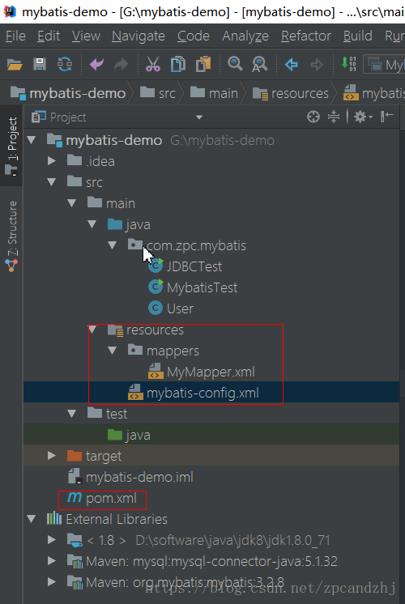

### 打印日志
添加log4j.properties
```properties
log4j.rootLogger=DEBUG,A1
log4j.logger.org.apache=DEBUG
log4j.appender.A1=org.apache.log4j.ConsoleAppender
log4j.appender.A1.layout=org.apache.log4j.PatternLayout
log4j.appender.A1.layout.ConversionPattern=%-d{yyyy-MM-dd HH:mm:ss,SSS} [%t] [%c]-[%p] %m%n
```

再次运行程序会打印日志：
```java
2018-06-30 19:53:37,554 [main] [org.apache.ibatis.transaction.jdbc.JdbcTransaction]-[DEBUG] Opening JDBC Connection
2018-06-30 19:53:37,818 [main] [org.apache.ibatis.datasource.pooled.PooledDataSource]-[DEBUG] Created connection 2094411587.
2018-06-30 19:53:37,818 [main] [org.apache.ibatis.transaction.jdbc.JdbcTransaction]-[DEBUG] Setting autocommit to false on JDBC Connection [com.mysql.jdbc.JDBC4Connection@7cd62f43]
2018-06-30 19:53:37,863 [main] [MyMapper.selectUser]-[DEBUG] ==>  Preparing: select * from tb_user where id = ? 
2018-06-30 19:53:37,931 [main] [MyMapper.selectUser]-[DEBUG] ==> Parameters: 1(Integer)
2018-06-30 19:53:37,953 [main] [MyMapper.selectUser]-[DEBUG] <==      Total: 1
User{id='1', userName='zpc', password='123456', name='鹏程', age=25, sex=1, birthday='1990-09-02', created='2018-06-30 18:20:18.0', updated='2018-06-30 18:20:18.0'}
2018-06-30 19:53:37,954 [main] [org.apache.ibatis.transaction.jdbc.JdbcTransaction]-[DEBUG] Resetting autocommit to true on JDBC Connection [com.mysql.jdbc.JDBC4Connection@7cd62f43]
2018-06-30 19:53:37,954 [main] [org.apache.ibatis.transaction.jdbc.JdbcTransaction]-[DEBUG] Closing JDBC Connection [com.mysql.jdbc.JDBC4Connection@7cd62f43]
2018-06-30 19:53:37,955 [main] [org.apache.ibatis.datasource.pooled.PooledDataSource]-[DEBUG] Returned connection 2094411587 to pool.
```

### MyBatis使用步骤总结
* 1)配置mybatis-config.xml 全局的配置文件 (1、数据源，2、外部的mapper)    
* 2)创建SqlSessionFactory    
* 3)通过SqlSessionFactory创建SqlSession对象    
* 4)通过SqlSession操作数据库 CRUD    
* 5)调用session.commit()提交事务    
* 6)调用session.close()关闭会话   

## 完整的CRUD操作
### 创建UserDao接口
```java
import com.zpc.mybatis.pojo.User;
import java.util.List;

public interface UserDao {

    /**
     * 根据id查询用户信息
     *
     * @param id
     * @return
     */
    public User queryUserById(String id);

    /**
     * 查询所有用户信息
     *
     * @return
     */
    public List<User> queryUserAll();

    /**
     * 新增用户
     *
     * @param user
     */
    public void insertUser(User user);

    /**
     * 更新用户信息
     *
     * @param user
     */
    public void updateUser(User user);

    /**
     * 根据id删除用户信息
     *
     * @param id
     */
    public void deleteUser(String id);
}
```

### 创建UserDaoImpl
```java
import com.zpc.mybatis.dao.UserDao;
import com.zpc.mybatis.pojo.User;
import org.apache.ibatis.session.SqlSession;
import java.util.List;

public class UserDaoImpl implements UserDao {
    public SqlSession sqlSession;

    public UserDaoImpl(SqlSession sqlSession) {
        this.sqlSession = sqlSession;
    }

    @Override
    public User queryUserById(String id) {
        return this.sqlSession.selectOne("UserDao.queryUserById", id);
    }

    @Override
    public List<User> queryUserAll() {
        return this.sqlSession.selectList("UserDao.queryUserAll");
    }

    @Override
    public void insertUser(User user) {
        this.sqlSession.insert("UserDao.insertUser", user);
    }

    @Override
    public void updateUser(User user) {
        this.sqlSession.update("UserDao.updateUser", user);
    }

    @Override
    public void deleteUser(String id) {
        this.sqlSession.delete("UserDao.deleteUser", id);
    }

}
```

### 编写UserDao对应的UserDaoMapper.xml
```xml
<?xml version="1.0" encoding="UTF-8" ?>
<!DOCTYPE mapper
        PUBLIC "-//mybatis.org//DTD Mapper 3.0//EN"
        "http://mybatis.org/dtd/mybatis-3-mapper.dtd">
<!-- mapper:根标签，namespace：命名空间，随便写，一般保证命名空间唯一 -->
<mapper namespace="UserDao">
    <!-- statement，内容：sql语句。id：唯一标识，随便写，在同一个命名空间下保持唯一
       resultType：sql语句查询结果集的封装类型,tb_user即为数据库中的表
     -->
    <!--<select id="queryUserById" resultType="com.zpc.mybatis.pojo.User">-->
    <!--select * from tb_user where id = #{id}-->
    <!--</select>-->

    <!--使用别名-->
    <select id="queryUserById" resultType="com.zpc.mybatis.pojo.User">
      select
       tuser.id as id,
       tuser.user_name as userName,
       tuser.password as password,
       tuser.name as name,
       tuser.age as age,
       tuser.birthday as birthday,
       tuser.sex as sex,
       tuser.created as created,
       tuser.updated as updated
       from
       tb_user tuser
       where tuser.id = #{id};
   </select>

    <select id="queryUserAll" resultType="com.zpc.mybatis.pojo.User">
        select * from tb_user;
    </select>

    <!--插入数据-->
    <insert id="insertUser" parameterType="com.zpc.mybatis.pojo.User">
        INSERT INTO tb_user (
        user_name,
        password,
        name,
        age,
        sex,
        birthday,
        created,
        updated
        )
        VALUES
        (
        #{userName},
        #{password},
        #{name},
        #{age},
        #{sex},
        #{birthday},
        now(),
        now()
        );
    </insert>

    <update id="updateUser" parameterType="com.zpc.mybatis.pojo.User">
        UPDATE tb_user
        <trim prefix="set" suffixOverrides=",">
            <if test="userName!=null">user_name = #{userName},</if>
            <if test="password!=null">password = #{password},</if>
            <if test="name!=null">name = #{name},</if>
            <if test="age!=null">age = #{age},</if>
            <if test="sex!=null">sex = #{sex},</if>
            <if test="birthday!=null">birthday = #{birthday},</if>
            updated = now(),
        </trim>
        WHERE
        (id = #{id});
    </update>

    <delete id="deleteUser">
        delete from tb_user where id=#{id}
    </delete>
</mapper>
```

在mybatis-config.xml中添加配置：
```xml
<mappers>
    <mapper resource="mappers/MyMapper.xml"/>
    <mapper resource="mappers/UserDaoMapper.xml"/>
</mappers>
```

### 添加UserDao的测试用例
按住Alt+Enter,选择create test
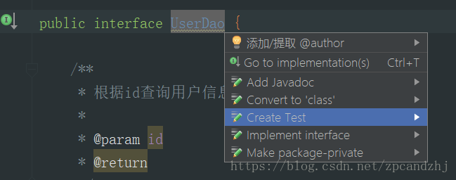

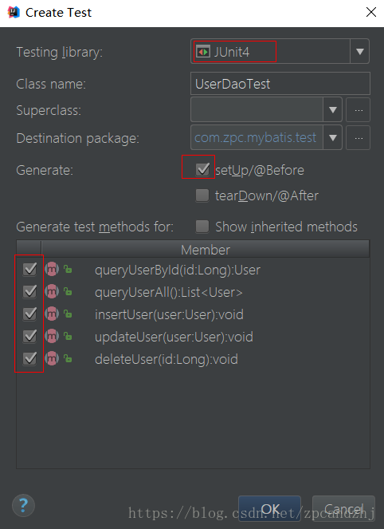

### 编写UserDao的测试用例
```java
import com.zpc.mybatis.dao.UserDao;
import com.zpc.mybatis.dao.impl.UserDaoImpl;
import com.zpc.mybatis.pojo.User;
import org.apache.ibatis.io.Resources;
import org.apache.ibatis.session.SqlSession;
import org.apache.ibatis.session.SqlSessionFactory;
import org.apache.ibatis.session.SqlSessionFactoryBuilder;
import org.junit.Before;
import org.junit.Test;
import java.io.InputStream;
import java.util.Date;
import java.util.List;

public class UserDaoTest {

    public UserDao userDao;
    public SqlSession sqlSession;

    @Before
    public void setUp() throws Exception {
        // mybatis-config.xml
        String resource = "mybatis-config.xml";
        // 读取配置文件
        InputStream is = Resources.getResourceAsStream(resource);
        // 构建SqlSessionFactory
        SqlSessionFactory sqlSessionFactory = new SqlSessionFactoryBuilder().build(is);
        // 获取sqlSession
        sqlSession = sqlSessionFactory.openSession();
        this.userDao = new UserDaoImpl(sqlSession);
    }

    @Test
    public void queryUserById() throws Exception {
        System.out.println(this.userDao.queryUserById("1"));
    }

    @Test
    public void queryUserAll() throws Exception {
        List<User> userList = this.userDao.queryUserAll();
        for (User user : userList) {
            System.out.println(user);
        }
    }

    @Test
    public void insertUser() throws Exception {
        User user = new User();
        user.setAge(16);
        user.setBirthday(new Date("1990/09/02"));
        user.setName("大鹏");
        user.setPassword("123456");
        user.setSex(1);
        user.setUserName("evan");
        this.userDao.insertUser(user);
        this.sqlSession.commit();
    }

    @Test
    public void updateUser() throws Exception {
        User user = new User();
        user.setBirthday(new Date());
        user.setName("静鹏");
        user.setPassword("654321");
        user.setSex(1);
        user.setUserName("evanjin");
        user.setId("1");
        this.userDao.updateUser(user);
        this.sqlSession.commit();
    }

    @Test
    public void deleteUser() throws Exception {
        this.userDao.deleteUser("4");
        this.sqlSession.commit();
    }

}
```

### 目录结构
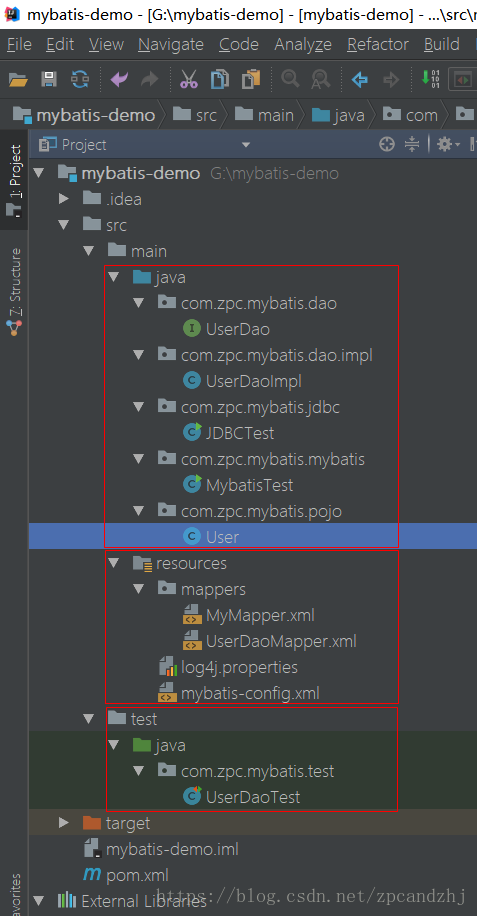

### 解决数据库字段名和实体类属性名不一致的问题
查询数据的时候，发现查不到userName的信息，
User{id=‘2’, userName=‘null’, password=‘123456’, name=‘静静’, age=22, sex=0, birthday=‘1993-09-05’, created=‘2018-06-30 18:22:28.0’, updated=‘2018-06-30 18:22:28.0’}

原因：数据库的字段名是user_name，POJO中的属性名字是userName
两端不一致，造成mybatis无法填充对应的字段信息。

修改方法：在sql语句中使用别名。

* 解决方案1：在sql语句中使用别名    
* 解决方案2： 参考后面的resultMap –mapper具体的配置的时候    
* 解决方案3：参考驼峰匹配 — mybatis-config.xml 的时候   

## 动态代理方式

### 思考上述CRUD中的问题
```
1、接口->实现类->mapper.xml
2、实现类中，使用mybatis的方式非常类似
3、xml中的sql statement 硬编码到java代码中。
```

思考：能否只写接口，不写实现类。只编写接口和Mapper.xml即可？

因为在dao（mapper）的实现类中对sqlsession的使用方式很类似。因此mybatis提供了接口的动态代理。

### 使用动态代理改造CRUD
修改测试用例的setUp方法
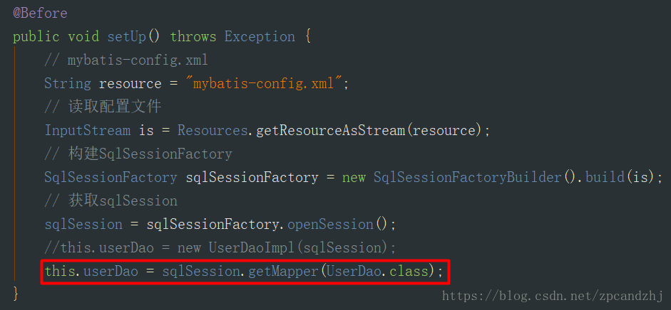

执行queryUserAll()方法
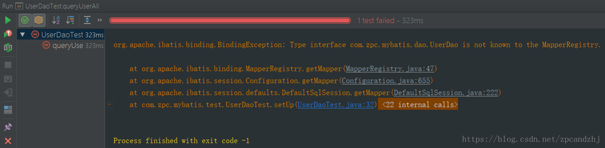
```
org.apache.ibatis.binding.BindingException: Type interface com.zpc.mybatis.dao.UserDao is not known to the MapperRegistry.
	at org.apache.ibatis.binding.MapperRegistry.getMapper(MapperRegistry.java:47)
	at org.apache.ibatis.session.Configuration.getMapper(Configuration.java:655)
	at org.apache.ibatis.session.defaults.DefaultSqlSession.getMapper(DefaultSqlSession.java:222)
at com.zpc.mybatis.test.UserDaoTest.setUp(UserDaoTest.java:32)
```

分析原因，在UserMapper.xml中配置接口的全路径

如果希望使用mybatis通过的动态代理的接口，就需要namespace中的值，和需要对应的Mapper(dao)接口的全路径一致。Mapper中Namespace的定义本身是没有限制的，只要不重复即可，但如果使用Mybatis的DAO接口动态代理，则namespace必须为DAO接口的全路径，例如：com.zpc.mybatis.dao.UserDao
```xml
<mapper namespace="com.zpc.mybatis.dao.UserDao">
```

### 完整的例子
#### UserMapper接口
创建UserMapper接口（对应原UserDao）
```java
public interface UserMapper {
   
   /**
    * 登录（直接使用注解指定传入参数名称）
    * @param userName
    * @param password
    * @return
    */
   public User login(@Param("userName") String userName, @Param("password") String password);
   
   /**
    * 根据表名查询用户信息（直接使用注解指定传入参数名称）
    * @param tableName
    * @return
    */
   public List<User> queryUserByTableName(@Param("tableName") String tableName);
   
   /**
    * 根据Id查询用户信息
    * @param id
    * @return
    */
   public User queryUserById(Long id);
   
   /**
    * 查询所有用户信息
    * @return
    */
   public List<User> queryUserAll();
   
   /**
    * 新增用户信息
    * @param user
    */
   public void insertUser(User user);
   
   /**
    * 根据id更新用户信息
    * @param user
    */
   public void updateUser(User user);
   
   /**
    * 根据id删除用户信息
    * @param id
    */
   public void deleteUserById(Long id);
}
```

#### UserMapper.xml
创建UserMapper.xml
```xml
<?xml version="1.0" encoding="UTF-8" ?>
<!DOCTYPE mapper
        PUBLIC "-//mybatis.org//DTD Mapper 3.0//EN"
        "http://mybatis.org/dtd/mybatis-3-mapper.dtd">
<!-- mapper:根标签，namespace：命名空间，随便写，一般保证命名空间唯一 ，为了使用接口动态代理，这里必须是接口的全路径名-->
<mapper namespace="com.zpc.mybatis.dao.UserMapper">
    <!--
       1.#{},预编译的方式preparedstatement，使用占位符替换，防止sql注入，一个参数的时候，任意参数名可以接收
       2.${},普通的Statement，字符串直接拼接，不可以防止sql注入，一个参数的时候，必须使用${value}接收参数
     -->
    <select id="queryUserByTableName" resultType="com.zpc.mybatis.pojo.User">
        select * from ${tableName}
    </select>

    <select id="login" resultType="com.zpc.mybatis.pojo.User">
        select * from tb_user where user_name = #{userName} and password = #{password}
    </select>

    <!-- statement，内容：sql语句。
       id：唯一标识，随便写，在同一个命名空间下保持唯一，使用动态代理之后要求和方法名保持一致
       resultType：sql语句查询结果集的封装类型，使用动态代理之后和方法的返回类型一致；resultMap：二选一
       parameterType：参数的类型，使用动态代理之后和方法的参数类型一致
     -->
    <select id="queryUserById" resultType="com.zpc.mybatis.pojo.User">
        select * from tb_user where id = #{id}
    </select>
    <select id="queryUserAll" resultType="com.zpc.mybatis.pojo.User">
        select * from tb_user
    </select>
    <!-- 新增的Statement
       id：唯一标识，随便写，在同一个命名空间下保持唯一，使用动态代理之后要求和方法名保持一致
       parameterType：参数的类型，使用动态代理之后和方法的参数类型一致
       useGeneratedKeys:开启主键回写
       keyColumn：指定数据库的主键
       keyProperty：主键对应的pojo属性名
     -->
    <insert id="insertUser" useGeneratedKeys="true" keyColumn="id" keyProperty="id"
            parameterType="com.zpc.mybatis.pojo.User">
        INSERT INTO tb_user (
        id,
        user_name,
        password,
        name,
        age,
        sex,
        birthday,
        created,
        updated
        )
        VALUES
        (
        null,
        #{userName},
        #{password},
        #{name},
        #{age},
        #{sex},
        #{birthday},
        NOW(),
        NOW()
        );
    </insert>
    <!-- 
       更新的statement
       id：唯一标识，随便写，在同一个命名空间下保持唯一，使用动态代理之后要求和方法名保持一致
       parameterType：参数的类型，使用动态代理之后和方法的参数类型一致
     -->
    <update id="updateUser" parameterType="com.zpc.mybatis.pojo.User">
        UPDATE tb_user
        <trim prefix="set" suffixOverrides=",">
            <if test="userName!=null">user_name = #{userName},</if>
            <if test="password!=null">password = #{password},</if>
            <if test="name!=null">name = #{name},</if>
            <if test="age!=null">age = #{age},</if>
            <if test="sex!=null">sex = #{sex},</if>
            <if test="birthday!=null">birthday = #{birthday},</if>
            updated = now(),
        </trim>
        WHERE
        (id = #{id});
    </update>
    <!-- 
       删除的statement
       id：唯一标识，随便写，在同一个命名空间下保持唯一，使用动态代理之后要求和方法名保持一致
       parameterType：参数的类型，使用动态代理之后和方法的参数类型一致
     -->
    <delete id="deleteUserById" parameterType="java.lang.String">
        delete from tb_user where id=#{id}
    </delete>
</mapper>
```

#### 引入UserMapper.xml
全局配置文件mybatis-config.xml引入UserMapper.xml
```xml
<mappers>
    <mapper resource="mappers/MyMapper.xml"/>
    <mapper resource="mappers/UserDaoMapper.xml"/>
    <mapper resource="mappers/UserMapper.xml"/>
</mappers>
```

#### 测试
创建UserMapper测试用例
```java
import com.zpc.mybatis.dao.UserMapper;
import com.zpc.mybatis.pojo.User;
import org.apache.ibatis.io.Resources;
import org.apache.ibatis.session.SqlSession;
import org.apache.ibatis.session.SqlSessionFactory;
import org.apache.ibatis.session.SqlSessionFactoryBuilder;
import org.junit.Before;
import org.junit.Test;

import java.io.InputStream;
import java.util.Date;
import java.util.List;

public class UserMapperTest {

    public UserMapper userMapper;

    @Before
    public void setUp() throws Exception {
        // 指定配置文件
        String resource = "mybatis-config.xml";
        // 读取配置文件
        InputStream inputStream = Resources.getResourceAsStream(resource);
        // 构建sqlSessionFactory
        SqlSessionFactory sqlSessionFactory = new SqlSessionFactoryBuilder().build(inputStream);
        // 获取sqlSession
        SqlSession sqlSession = sqlSessionFactory.openSession(true);

        // 1. 映射文件的命名空间（namespace）必须是mapper接口的全路径
        // 2. 映射文件的statement的id必须和mapper接口的方法名保持一致
        // 3. Statement的resultType必须和mapper接口方法的返回类型一致
        // 4. statement的parameterType必须和mapper接口方法的参数类型一致（不一定）
        this.userMapper = sqlSession.getMapper(UserMapper.class);
    }

    @Test
    public void testQueryUserByTableName() {
        List<User> userList = this.userMapper.queryUserByTableName("tb_user");
        for (User user : userList) {
            System.out.println(user);
        }
    }

    @Test
    public void testLogin() {
        System.out.println(this.userMapper.login("hj", "123456"));
    }

    @Test
    public void testQueryUserById() {
        System.out.println(this.userMapper.queryUserById("1"));
    }

    @Test
    public void testQueryUserAll() {
        List<User> userList = this.userMapper.queryUserAll();
        for (User user : userList) {
            System.out.println(user);
        }
    }

    @Test
    public void testInsertUser() {
        User user = new User();
        user.setAge(20);
        user.setBirthday(new Date());
        user.setName("大神");
        user.setPassword("123456");
        user.setSex(2);
        user.setUserName("bigGod222");
        this.userMapper.insertUser(user);
        System.out.println(user.getId());
    }

    @Test
    public void testUpdateUser() {
        User user = new User();
        user.setBirthday(new Date());
        user.setName("静静");
        user.setPassword("123456");
        user.setSex(0);
        user.setUserName("Jinjin");
        user.setId("1");
        this.userMapper.updateUser(user);
    }

    @Test
    public void testDeleteUserById() {
        this.userMapper.deleteUserById("1");
    }
}
```

### 目录结构
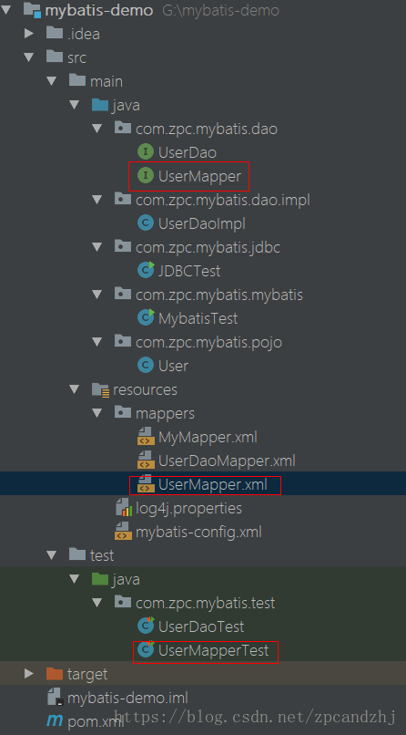


### 动态代理方式总结
```
namespace 必须和接口全限定路径(包名+类名)一致
id 值必须和接口中方法名相同
如果接口中方法为多个参数,可以省略parameterType
```
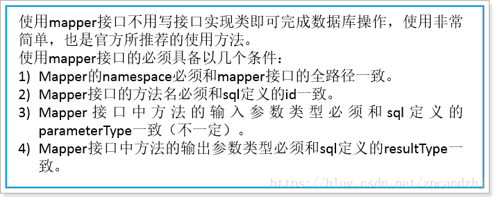


```xml

```

```java

```


