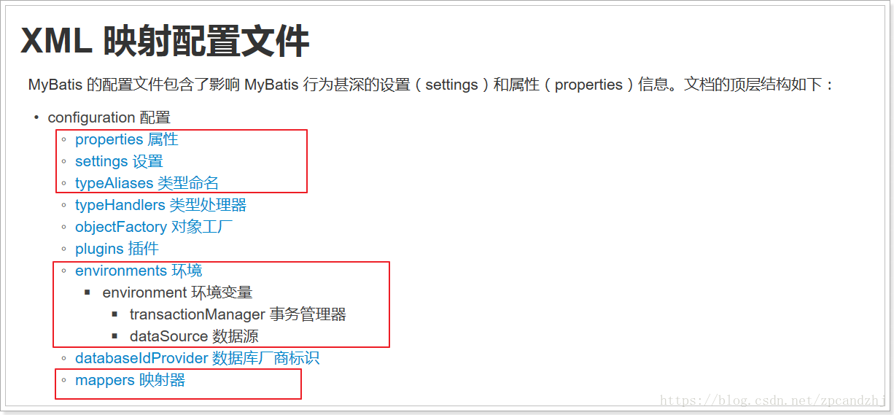
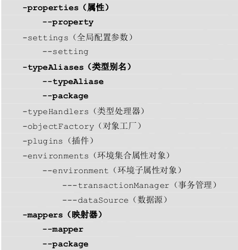
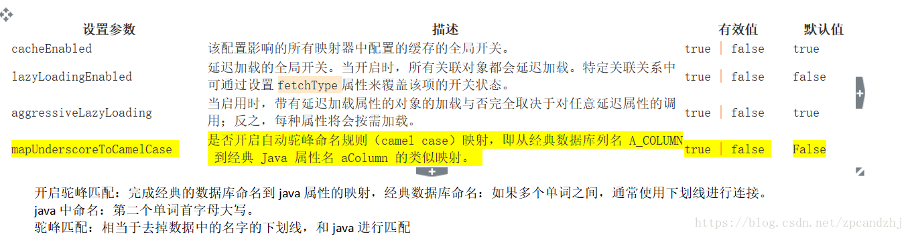
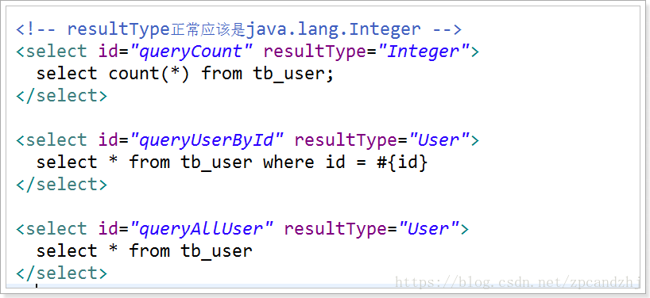
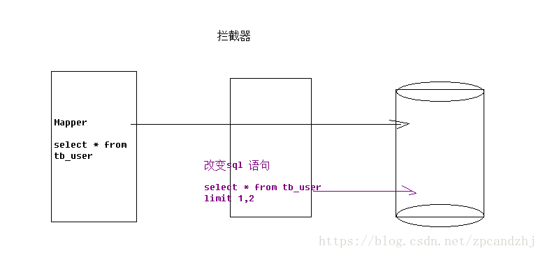

# Mybatis配置文件详解
配置文件就命名为mybatis-config.xml，文件名是随意的。

mybatis-config.xml讲究严格的顺序，具体顺序遵循文档的顺序


## 配置的内容和顺序


```
-properties(属性)
    --property
-settings(全局配置参数)
    --setting
-typeAliases(类型别名)
    --typeAliase
    --package
-typeHandlers(类型处理器)
-objectFactory(对象工厂)
-plugins(插件)
-environments(环境集合属性对象)
    --environment(环境子属性对象)
        ---transactionManager(事务管理)
        ---dataSource(数据源)
-mappers(映射器)
    --mapper
    --package
```

## properties属性读取外部资源
properties配置的属性都是可外部配置且可动态替换的，既可以在典型的 Java 属性文件中配置，亦可通过 properties 元素的子元素来传递。例如：
```xml
<properties resource="org/mybatis/example/config.properties">
  <property name="username" value="dev_user"/>
  <property name="password" value="F2Fa3!33TYyg"/>
</properties>
```

然后其中的属性就可以在整个配置文件中被用来替换需要动态配置的属性值。比如:
```xml
<dataSource type="POOLED">
  <property name="driver" value="${driver}"/>
  <property name="url" value="${url}"/>
  <property name="username" value="${username}"/>
  <property name="password" value="${password}"/>
</dataSource>
```
这个例子中的 username 和 password 将会由 properties 元素中设置的相应值来替换。 driver 和 url 属性将会由 config.properties 文件中对应的值来替换。这样就为配置提供了诸多灵活选择。

属性也可以被传递到 SqlSessionFactoryBuilder.build()方法中。例如：
```java
SqlSessionFactory factory = new SqlSessionFactoryBuilder().build(reader, props);
// ... or ...
SqlSessionFactory factory = new SqlSessionFactoryBuilder().build(reader, environment, props);
```

如果属性在不只一个地方进行了配置，那么 MyBatis 将按照下面的顺序来加载：

* 1）在 properties 元素体内指定的属性首先被读取。    
* 2）然后根据 properties 元素中的 resource 属性读取类路径下属性文件或根据 url 属性指定的路径读取属性文件，并覆盖已读取的同名属性。    
* 3）最后读取作为方法参数传递的属性，并覆盖已读取的同名属性。    

   
因此，通过方法参数传递的属性具有最高优先级，resource/url 属性中指定的配置文件次之，最低优先级的是 properties 属性中指定的属性。

## settings设置


```xml
<settings>
    <setting name="mapUnderscoreToCamelCase" value="true"/>
</settings>
```

测试：

没有开启驼峰匹配：
```
2018-07-01 13:57:56,486 [main] [com.zpc.mybatis.dao.UserMapper.queryUserById]-[DEBUG] ==>  Preparing: select * from tb_user where id = ? 
2018-07-01 13:57:56,524 [main] [com.zpc.mybatis.dao.UserMapper.queryUserById]-[DEBUG] ==> Parameters: 1(String)
2018-07-01 13:57:56,568 [main] [com.zpc.mybatis.dao.UserMapper.queryUserById]-[DEBUG] <==      Total: 1
User{id='1', userName='null', password='123456', name='大神', age=20, sex=2, birthday='2018-07-01', created='2018-07-01 13:36:09.0', updated='2018-07-01 13:36:09.0'}
```
开启驼峰匹配：
```
2018-07-01 13:58:40,599 [main] [com.zpc.mybatis.dao.UserMapper.queryUserById]-[DEBUG] ==>  Preparing: select * from tb_user where id = ? 
2018-07-01 13:58:40,642 [main] [com.zpc.mybatis.dao.UserMapper.queryUserById]-[DEBUG] ==> Parameters: 1(String)
2018-07-01 13:58:40,661 [main] [com.zpc.mybatis.dao.UserMapper.queryUserById]-[DEBUG] <==      Total: 1
User{id='1', userName='bigGod222', password='123456', name='大神', age=20, sex=2, birthday='2018-07-01', created='2018-07-01 13:36:09.0', updated='2018-07-01 13:36:09.0'}
```

## typeAliases
类型别名是为 Java 类型命名的一个短的名字。它只和 XML 配置有关，存在的意义仅在于用来减少类完全限定名的冗余。
```xml
<typeAliases>
    <typeAlias type="com.zpc.mybatis.pojo.User" alias="User"/>
</typeAliases>
```

缺点：每个pojo类都要去配置。

**解决方案：使用扫描包，扫描指定包下的所有类，扫描之后的别名就是类名（不区分大小写），建议使用的时候和类名一致。**
```xml
<typeAliases>
    <!--type:实体类的全路径。alias:别名，通常首字母大写-->
    <!--<typeAlias type="com.zpc.mybatis.pojo.User" alias="User"/>-->
    <package name="com.zpc.mybatis.pojo"/>
</typeAliases>
```

**Mybatis已经为普通的 Java 类型内建了许多相应的类型别名。它们都是大小写不敏感的.**



```xml
<typeAliases>
    <!-- 单个别名定义 -->
    <typeAlias alias="user" type="com.itheima.domain.User"/>
    <!-- 批量别名定义,扫描整个包下的类,别名为类名(首字母大写或小写都可以) -->
    <package name="com.itheima.domain"/>
    <package name=" 其它包 "/>
</typeAliases>
```

## typeHandlers（类型处理器）
无论是 MyBatis 在预处理语句（PreparedStatement）中设置一个参数时，还是从结果集中取出一个值时， 都会用类型处理器将获取的值以合适的方式转换成 Java 类型。可以重写类型处理器或创建你自己的类型处理器来处理不支持的或非标准的类型。

## plugins（插件）拦截器
MyBatis 允许你在已映射语句执行过程中的某一点进行拦截调用。默认情况下，MyBatis 允许使用插件来拦截的方法调用包括：
```
Executor (update, query, flushStatements, commit, rollback, getTransaction, close, isClosed)
ParameterHandler (getParameterObject, setParameters)
ResultSetHandler (handleResultSets, handleOutputParameters)
StatementHandler (prepare, parameterize, batch, update, query)
```
现在一些MyBatis 插件比如PageHelper都是基于这个原理，有时为了监控sql执行效率，也可以使用插件机制

原理：


自定义拦截器：
```java
// ExamplePlugin.java
@Intercepts({@Signature(
  type= Executor.class,
  method = "update",
  args = {MappedStatement.class,Object.class})})
public class ExamplePlugin implements Interceptor {
  public Object intercept(Invocation invocation) throws Throwable {
    return invocation.proceed();
  }
  public Object plugin(Object target) {
    return Plugin.wrap(target, this);
  }
  public void setProperties(Properties properties) {
  }
}
```

配置：
```xml
<!-- mybatis-config.xml -->
<plugins>
  <plugin interceptor="org.mybatis.example.ExamplePlugin">
    <property name="someProperty" value="100"/>
  </plugin>
</plugins>
```
上面的插件将会拦截在 Executor 实例中所有的 “update” 方法调用， 这里的 Executor 是负责执行低层映射语句的内部对象。

## environments(环境)
MyBatis 可以配置成适应多种环境，例如，开发、测试和生产环境需要有不同的配置；

尽管可以配置多个环境，每个 SqlSessionFactory 实例只能选择其一。

虽然，这种方式也可以做到很方便的分离多个环境，但是实际使用场景下，我们更多的是选择使用spring来管理数据源，来做到环境的分离。

## mappers
需要告诉 MyBatis 到哪里去找到 SQL 映射语句。即告诉 MyBatis 到哪里去找映射文件。

第一种：
```
使用相对于类路径的资源
如:<mapper resource="com/itheima/dao/IUserDao.xml" />
```

第二种：
```
使用 mapper 接口类路径
如:<mapper class="com.itheima.dao.UserDao"/>
注意:此种方法要求 mapper 接口名称和 mapper 映射文件名称相同,且放在同一个目录中。
```

第三种：
```
注册指定包下的所有 mapper 接口
如:<package name="cn.itcast.mybatis.mapper"/>
注意:此种方法要求 mapper 接口名称和 mapper 映射文件名称相同,且放在同一个目录中。
```

缺点：
```
1、如果包的路径有很多？
2、mapper.xml和mapper.java没有分离。
spring整合的时候解决。
```


```xml

```

```java

```