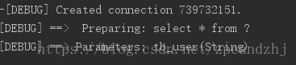
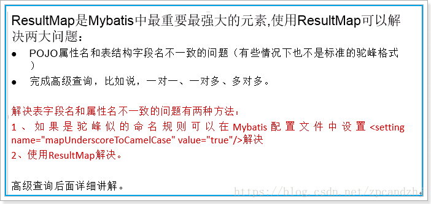
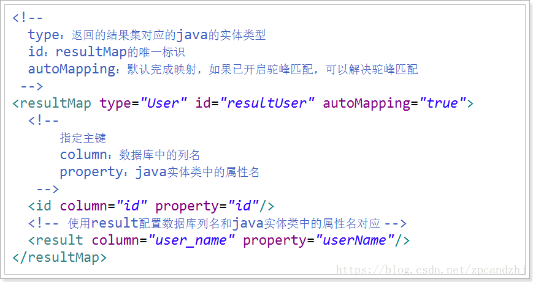
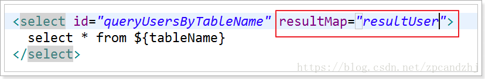
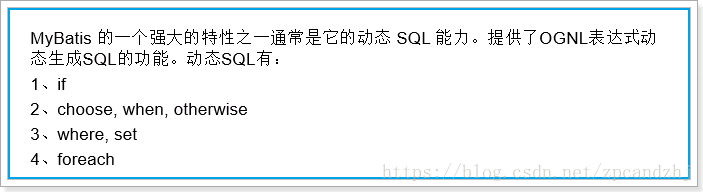
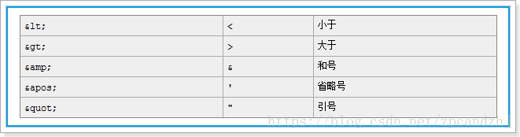

# Mapper文件详解

## CRUD标签

### select
select – 书写查询sql语句

select中的几个属性说明：

* id属性：当前名称空间下的statement的唯一标识。必须。要求id和mapper接口中的方法的名字一致。    
* resultType：将结果集映射为java的对象类型。必须（和 resultMap 二选一）    
* parameterType：传入参数类型。可以省略   

### insert
insert 的几个属性说明：

* id：唯一标识，随便写，在同一个命名空间下保持唯一，使用动态代理之后要求和方法名保持一致    
* parameterType：参数的类型，使用动态代理之后和方法的参数类型一致    
* useGeneratedKeys:开启主键回写    
* keyColumn：指定数据库的主键    
* keyProperty：主键对应的pojo属性名   


### update

* id属性：当前名称空间下的statement的唯一标识(必须属性)；    
* parameterType：传入的参数类型，可以省略。   


### delete
delete 的几个属性说明：

* id属性：当前名称空间下的statement的唯一标识(必须属性)；    
* parameterType：传入的参数类型，可以省略。  

## `#{}`和`${}`
`#{}` 只是替换，相当于PreparedStatement使用占位符去替换参数，可以防止sql注入。

`${}` 是进行字符串拼接，相当于sql语句中的Statement，使用字符串去拼接sql；$可以是sql中的任一部分传入到Statement中，不能防止sql注入。

使用`${}` 去取出参数值信息，需要使用`${value}`

`#{}` 只是表示占位，与参数的名字无关，如果只有一个参数，会自动对应。


**总结**：
```
通常在方法的参数列表上加上一个注释@Param(“xxxx”) 显式指定参数的名字，然后通过${“xxxx”}或#{“xxxx”}
sql语句动态生成的时候，使用${};
sql语句中某个参数进行占位的时候#{}
```


场景：数据库有两个一模一样的表。历史表，当前表

查询表中的信息，有时候从历史表中去查询数据，有时候需要去新的表去查询数据。

希望使用1个方法来完成操作。
```
<select id="queryUserByTableName" resultType="com.zpc.mybatis.pojo.User">
    select * from #{tableName}
</select>

/**
 * 根据表名查询用户信息（直接使用注解指定传入参数名称）
 *
 * @param tableName
 * @return
 */
public List<User> queryUserByTableName(String tableName);
```
测试输出：

有问题,报语法错误：相当于执行了这样一条sql:
select * from “tb_user”;
显然表名多了引号。

改正：
```xml
<select id="queryUserByTableName" resultType="com.zpc.mybatis.pojo.User">
    select * from ${tableName}
</select>
```

注意：

* `#{}` 只是替换？，相当于PreparedStatement使用占位符去替换参数，可以防止sql注入。    
* `${}` 是进行字符串拼接，相当于sql语句中的Statement，使用字符串去拼接sql；$可以是sql中的任一部分传入到Statement中，不能防止sql注入。    
* 使用`${}` 去取出参数值信息，需要使用`${value}`    
* `#{}` 只是表示占位，与参数的名字无关，如果只有一个参数，会自动对应。

推荐：
```xml
/**
 * 根据表名查询用户信息（直接使用注解指定传入参数名称）
 *
 * @param tableName
 * @return
 */
public List<User> queryUserByTableName(@Param("tableName") String tableName);

<select id="queryUserByTableName" resultType="com.zpc.mybatis.pojo.User">
    select * from ${tableName}
</select>
```

`#{}`多个参数时：
```xml
/**
 * 登录（直接使用注解指定传入参数名称）
 *
 * @param userName
 * @param password
 * @return
 */
public User login( String userName, String password);

<select id="login" resultType="com.zpc.mybatis.pojo.User">
    select * from tb_user where user_name = #{userName} and password = #{password}
</select>
```
报错：
```xml
org.apache.ibatis.exceptions.PersistenceException: 
### Error querying database.  Cause: org.apache.ibatis.binding.BindingException: Parameter 'userName' not found. Available parameters are [0, 1, param1, param2]
### Cause: org.apache.ibatis.binding.BindingException: Parameter 'userName' not found. Available parameters are [0, 1, param1, param2]
```

解决方案一：
```xml
<select id="login" resultType="com.zpc.mybatis.pojo.User">
    select * from tb_user where user_name = #{0} and password = #{1}
</select>
```

解决方案二：
```xml
<select id="login" resultType="com.zpc.mybatis.pojo.User">
    select * from tb_user where user_name = #{param1} and password = #{param2}
</select>
```

最终解决方案：
```xml
/**
 * 登录（直接使用注解指定传入参数名称）
 *
 * @param userName
 * @param password
 * @return
 */
public User login(@Param("userName") String userName, @Param("password") String password);

<select id="login" resultType="com.zpc.mybatis.pojo.User">
    select * from tb_user where user_name = #{userName} and password = #{password}
</select>
```

总结：
```
通常在方法的参数列表上加上一个注释@Param(“xxxx”) 显式指定参数的名字，然后通过${“xxxx”}或#{“xxxx”}
sql语句动态生成的时候，使用${};
sql语句中某个参数进行占位的时候#{}
```

## 面试题（#、$区别）
```xml
/**
 * #号
 * @param username1
 * @return
 */
queryUserListByName1("%王%")
User queryUserListByName1(@Param("username1") String username1);

/**
 * $号
 * @param username2
 * @return
 */
queryUserListByName1("王")
User queryUserListByName2(@Param("username2") String username2);

<select id="queryUserListByName1" resultType="com.zpc.mybatis.pojo.User">
    select * from tb_user WHERE user_name like #{username1}
</select>

<select id="queryUserListByName2" resultType="com.zpc.mybatis.pojo.User">
    select * from tb_user WHERE user_name like '%${username2}%'//手动加了引号
</select>
```

## resultMap



使用：


## sql片段
```xml
<sql id=””></sql>
<include refId=”” />
```

例如在UserMapper.xml中定义如下片段：
```xml
<sql id="commonSql">
		id,
			user_name,
			password,
			name,
			age,
			sex,
			birthday,
			created,
			updated	
</sql> 
```
则可以在UserMapper.xml中使用它：
```xml
<select id="queryUserById" resultMap="userResultMap">
	select <include refid="commonSql"></include> from tb_user where id = #{id}
</select>

<select id="queryUsersLikeUserName" resultType="User">
	select <include refid="commonSql"></include> from tb_user where user_name like "%"#{userName}"%"
</select>
```

Sql片段也可以定义在单独的.xml文件中如：
定义CommonSQL.xml：
```xml
<?xml version="1.0" encoding="UTF-8" ?>
<!DOCTYPE mapper
  PUBLIC "-//mybatis.org//DTD Mapper 3.0//EN"
  "http://mybatis.org/dtd/mybatis-3-mapper.dtd">
<mapper namespace="CommonSQL">
	<sql id="commonSql">
		id,
			user_name,
			password,
			name,
			age,
			sex,
			birthday,
			created,
			updated	
	</sql>
</mapper>
```
使用：
```xml
<select id="queryUserById" resultMap="userResultMap">
    select <include refid="CommonSQL.commonSql"></include> from tb_user where id = #{id}
</select>

<select id="queryUsersLikeUserName" resultType="User">
    select <include refid="CommonSQL.commonSql"></include> from tb_user where user_name like "%"#{userName}"%"
</select>
```
当然要完成这个功能还需要在全局配置文件mybatis-config.xml中引入该外部配置文件：
```xml
<mappers>
		<mapper resource="CommonSQL.xml"/>
		<!-- 开启mapper接口的包扫描，基于class的配置方式 -->
		<package name="com.zpc.mybatis.mapper"/>
</mappers>
```

## 动态sql
场景：查询男性用户，如果输入了姓名，按姓名模糊查询


### if
我们根据实体类的不同取值,使用不同的 SQL 语句来进行查询。比如在 id 如果不为空时可以根据 id 查询,如果 username 不同空时还要加入用户名作为条件。这种情况在我们的多条件组合查询中经常会碰到。

```xml
<select id="findUserByCondition" resultMap="userMap" parameterType="user">
    select * from user where 1=1
    <if test="userName != null">
      and username = #{userName}
    </if>
    <if test="userSex != null">
        and sex = #{userSex}
    </if>
</select>
```
注意:<if>标签的 test 属性中写的是对象的属性名,如果是包装类的对象要使用 OGNL 表达式的写法。
另外要注意 where 1=1 的作用~!

### where
为了简化上面 where 1=1 的条件拼装,我们可以采用`<where>`标签来简化开发。

```
当编写where 标签时,如果内容中第一个是and 去掉第一个and
如果<where>中有内容会生成where 关键字,如果没有内容不生成where 关键
比直接使用<if>少写where 1=1
```


```xml
<select id="findUserByCondition" resultMap="userMap" parameterType="user">
    select * from user
    <where>
        <if test="userName != null">
            and username = #{userName}
        </if>
        <if test="userSex != null">
            and sex = #{userSex}
        </if>
    </where>
</select>
```

### foreach
传入多个 id 查询用户信息,用下边两个 sql 实现:
```
SELECT * FROM USERS WHERE username LIKE '%张%' AND (id =10 OR id =89 OR id=16)
SELECT * FROM USERS WHERE username LIKE '%张%' AND id IN (10,89,16)
```
这样我们在进行范围查询时,就要将一个集合中的值,作为参数动态添加进来。

```xml
<!-- 根据queryvo中的Id集合实现查询用户列表 -->
<select id="findUserInIds" resultMap="userMap" parameterType="queryvo">
    select * from user
    <where>
        <if test="ids != null and ids.size()>0">
            <foreach collection="ids" open="and id in (" close=")" item="uid" separator=",">
                #{uid}
            </foreach>
        </if>
    </where>
</select>
```

**mybatis中foreach效率较低。**

### choose when otherwise
只有有一个成立,其他都不执行.

场景：查询男性用户，如果输入了姓名则按照姓名模糊查找，否则如果输入了年龄则按照年龄查找，否则查找姓名为“鹏程”的用户。
```xml
<select id="queryUserListByNameOrAge" resultType="com.zpc.mybatis.pojo.User">
    select * from tb_user WHERE sex=1
    <!--
    1.一旦有条件成立的when，后续的when则不会执行
    2.当所有的when都不执行时,才会执行otherwise
    -->
    <choose>
        <when test="name!=null and name.trim()!=''">
            and name like '%${name}%'
        </when>
        <when test="age!=null">
            and age = #{age}
        </when>
        <otherwise>
            and name='鹏程'
        </otherwise>
    </choose>
</select>
```

### set
`<set>`用在修改SQL 中set 从句
```
去掉最后一个逗号
如果<set>里面有内容生成set 关键字,没有就不生成
```
示例:
`id=#{id}` 目的防止`<set>`中没有内容,mybatis 不生成set 关键字,如果修改中没有set 从句SQL 语法错误.
```xml
<update id="upd" parameterType="log" >
    update log
    <set>
        id=#{id},
        <if test="accIn!=null and accIn!=''">
            accin=#{accIn},
        </if>
        <if test="accOut!=null and accOut!=''">
            accout=#{accOut},
        </if>
    </set>
    where id=#{id}
</update>
```

### Trim
```
prefix 在前面添加内容
prefixOverrides 去掉前面内容
suffix 在后面添加内容
suffixOverrieds 去掉后面内容
```

修改用户信息，如果参数user中的某个属性为null，则不修改。
```xml
<update id="updateUser" parameterType="com.zpc.mybatis.pojo.User">
    UPDATE tb_user
    <trim prefix="set" suffixOverrides=",">
        <if test="userName!=null">user_name = #{userName},</if>
        <if test="password!=null">password = #{password},</if>
        <if test="name!=null">name = #{name},</if>
        <if test="age!=null">age = #{age},</if>
        <if test="sex!=null">sex = #{sex},</if>
        <if test="birthday!=null">birthday = #{birthday},</if>
        updated = now(),
    </trim>
    WHERE
    (id = #{id});
</update>
```

### sql 和include
某些SQL 片段如果希望复用,可以使用`<sql>`定义这个片段

```xml
<!-- 抽取重复的语句代码片段 -->
<sql id="defaultSql">
    select * from user
</sql>

<!-- 配置查询所有操作 -->
<select id="findAll" resultType="user">
    <include refid="defaultSql"></include>
</select>

<!-- 根据 id 查询 -->
<select id="findById" resultType="UsEr" parameterType="int">
    <include refid="defaultSql"></include>
    where id = #{uid}
</select>
```

## sql语句中出现’<’的解决方案

### 1、使用xml中的字符实体


因为业务，需要在mybatis中，使用到大于号，小于号，所以就在SQL中直接使用了。
```
SELECT * FROM test WHERE 1 = 1 AND start_date <= CURRENT_DATE AND end_date >= CURRENT_DATE
```
可是，在执行时，总报错误：
```Error creating document instance. Cause: org.xml.sax.SAXParseException; lineNumber: 74; columnNumber: 17; 
```
元素内容必须由格式正确的字符数据或标记组成。
把`AND start_date >= CURRENT_DATE AND end_date <= CURRENT_DATE`去掉，就没有问题，所以确定是因为大于号，小于号引起的问题。

于是就想到了特殊符号，于是用了转义字符把>和<替换掉，然后就没有问题了。
```
SELECT * FROM test WHERE 1 = 1 AND start_date &lt;= CURRENT_DATE AND end_date &gt;= CURRENT_DATE
```

案例：
```xml
1.<if test="startDateTime!=null"> and mm.ttime &gt; to_date(#{startDateTime},'yyyy-mm-dd hh24:mi:ss')</if>  
2.<if test="endDateTime!=null"> and mm.ttime &lt;= to_date(#{endDateTime},'yyyy-mm-dd hh24:mi:ss')</if>  
```

### 2、使用`<![CDATA[ < ]]>`
案例1：
```xml
<![CDATA[ 
       and mm.ttime > to_date(#{startDateTime},'yyyy-mm-dd hh24:mi:ss') 
       and mm.ttime <= to_date(#{endDateTime},'yyyy-mm-dd hh24:mi:ss') 
]]>  
```

案例2：
mapper文件示例代码 ：
```xml
and (t1.status <![CDATA[ >= ]]> 1  and  t1.status <![CDATA[ <= ]]> 2)
上述代码其实对应的sql：
and (t1.status > =1 andt1.status <= 2)
```

注意：
```xml
使用<![CDATA[ ]]>标记的sql语句中的<where> <if>等标签不会被解析。
```


```xml

```

```java

```