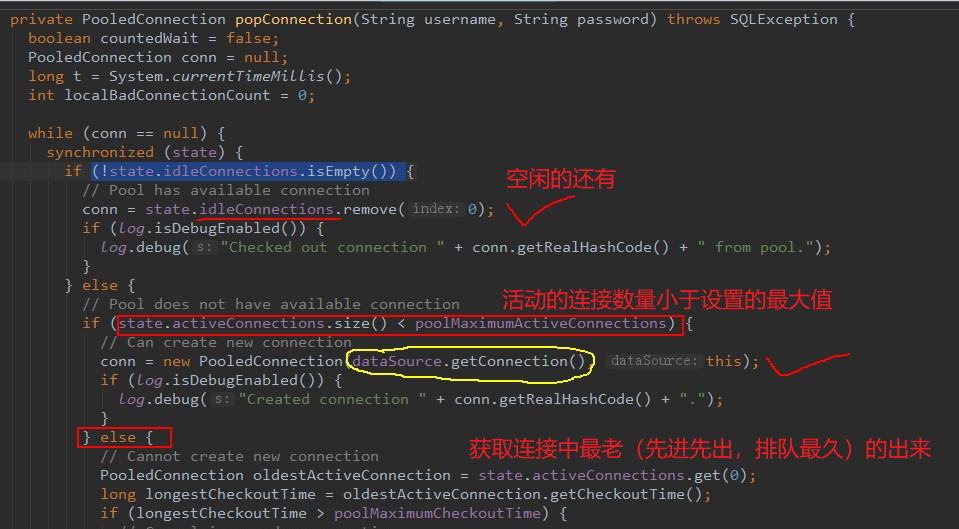

# Mybatis 连接池与事务
```
Mybatis 的连接池技术

    Mybatis 将它自己的数据源分为三类：
        UNPOOLED 不使用连接池的数据源
        POOLED 使用连接池的数据源
        JNDI 使用 JNDI 实现的数据源

    Mybatis 中数据源的配置

    MyBatis 在初始化时，根据的 type 属性来创建相应类型的的数据源 DataSource，即：
        type=”POOLED”：MyBatis 会创建 PooledDataSource 实例
        type=”UNPOOLED” ： MyBatis 会创建 UnpooledDataSource 实例
        type=”JNDI”：MyBatis 会从 JNDI 服务上查找 DataSource 实例，然后返回使用

Mybatis 的事务控制

    自动提交事务设置
        factory.openSession(true);
        本质上就是调用 JDBC 的 setAutoCommit()来实现事务控制
```

## Mybatis的连接池技术
连接池

* 1.连接池是一个用来存储连接的容器    
* 2.连接池是一个集合对象，该集合必须是线程安全的，不能两个线程拿到同一个连接    
* 3.该集合实现队列的特征：先进先出（在mybatis中实际上是ArrayList）  

我们在前面的 WEB 课程中也学习过类似的连接池技术,而在 Mybatis 中也有连接池技术,但是它采用的是自己的连接池技术。在 Mybatis 的 SqlMapConfig.xml 配置文件中,通过`<dataSource type=”pooled”>`来实现 Mybatis 中连接池的配置。


### Mybatis连接池的分类
在 Mybatis 中我们将它的数据源 dataSource 分为以下几类:


可以看出 Mybatis 将它自己的数据源分为三类:

* UNPOOLED 不使用连接池的数据源    
* POOLED 使用连接池的数据源    
* JNDI 使用 JNDI 实现的数据源

具体结构如下:


相应地,MyBatis 内部分别定义了实现了 java.sql.DataSource 接口的 UnpooledDataSource,PooledDataSource 类来表示 UNPOOLED、POOLED 类型的数据源。

在这三种数据源中,我们一般**采用的是 POOLED 数据源**(很多时候我们所说的数据源就是为了更好的管理数据库连接,也就是我们所说的连接池技术)。

### Mybatis 中数据源的配置
我们的数据源配置就是在 SqlMapConfig.xml 文件中,具体配置如下:
```xml
<!-- 配置数据源(连接池)信息 -->
<dataSource type="POOLED">
    <property name="driver" value="${jdbc.driver}"/>
    <property name="url" value="${jdbc.url}"/>
    <property name="username" value="${jdbc.username}"/>
    <property name="password" value="${jdbc.password}"/>
</dataSource>
```

MyBatis 在初始化时,根据`<dataSource>`的 type 属性来创建相应类型的的数据源 DataSource,即:
```
type=”POOLED”:MyBatis 会创建 PooledDataSource 实例
type=”UNPOOLED” : MyBatis 会创建 UnpooledDataSource 实例
type=”JNDI”:MyBatis 会从 JNDI 服务上查找 DataSource 实例,然后返回使用
```

### Mybatis中连接的获取过程分析
当我们需要创建 SqlSession 对象并需要执行 SQL 语句时,这时候 MyBatis 才会去调用 dataSource 对象来创建 java.sql.Connection 对象。也就是说,java.sql.Connection 对象的创建一直延迟到执行 SQL 语句的时候。
```java
@Test
public void testSql() throws Exception {
    InputStream in = Resources.getResourceAsStream("SqlMapConfig.xml");
    SqlSessionFactory factory = new SqlSessionFactoryBuilder().build(in);
    SqlSession sqlSession = factory.openSession();
    List<User> list = sqlSession.selectList("findUserById",41);
    System.out.println(list.size());
}
```
只有当第 4 句 sqlSession.selectList("findUserById"),才会触发 MyBatis 在底层执行下面这个方法来创建 java.sql.Connection 对象。

主要讲一下：pooled与unpooled


追踪unpooled

在idea中通过【ctrl + N】搜索【unpooleddatasource】，找到如下


贴一下jdbc中的执行步骤
```java
    //1.加载数据库驱动
    //Class.forName是把这个类加载到JVM中，加载的时候，就会执行其中的静态初始化块，完成驱动的初始化的相关工作。
    Class.forName("com.mysql.jdbc.Driver");
    //2.通过驱动管理类获得数据库连接a
    connection = DriverManager.getConnection
            ("jdbc:mysql://localhost:3306/cong","root","123456");
    //3.定义sql语句
    String sql = "select * from account where id = ?";
    //4.获得预处理statement
    preparedStatement = connection.prepareStatement(sql);
    //5.设置参数,第一个参数为 sql 语句中参数的序号（从 1 开始），第二个参数为设置的参数值
    preparedStatement.setString(1, "1");
    //6.执行操作
    resultSet = preparedStatement.executeQuery();
    //7.处理结果
    while (resultSet.next()){
        System.out.println("Account:"+resultSet.getInt("id") + "," + resultSet.getString("name")+ ","+resultSet.getFloat("money"));
    }
```

追踪pooled

在idea中通过【ctrl + N】搜索【pooleddatasource】，找到如下



分析源代码，得出 PooledDataSource 工作原理如下： 


下面是获取连接的源码
```java
  @Override
  public Connection getConnection() throws SQLException {
    return popConnection(dataSource.getUsername(), dataSource.getPassword()).getProxyConnection();
  }

  @Override
  public Connection getConnection(String username, String password) throws SQLException {
    return popConnection(username, password).getProxyConnection();
  }
```
最后我们可以发现,真正连接打开的时间点,只是在我们执行 SQL 语句时,才会进行。其实这样做我们也可以进一步发现,数据库连接是我们最为宝贵的资源,只有在要用到的时候,才去获取并打开连接,当我们用完了就再立即将数据库连接归还到连接池中。

## Mybatis的事务控制

### JDBC 中事务的回顾
在 JDBC 中我们可以通过手动方式将事务的提交改为手动方式,通过 setAutoCommit()方法就可以调整。

### Mybatis 中事务提交方式
Mybatis 中事务的提交方式,本质上就是调用 JDBC 的 setAutoCommit()来实现事务控制。

mybatis中的事务是通过sqlsession对象的commit方法和rollback方法实现事务的提交和回滚

找到JdbcTransaction.java和SqlSessionFactory.java中的源码，可以发现


### Mybatis 中设置自动提交

为什么之前的 CUD 过程中必须使用 sqlSession.commit()提交事务?主要原因就是在连接池中取出的连接,都会将调用 connection.setAutoCommit(false)方法,这样我们就必须使用 sqlSession.commit()方法,相当于使用了 JDBC 中的 connection.commit()方法实现事务提交。

于是，在我们的测试类中，可以这样修改

当然，这个只能用于每次都仅仅执行一个对数据库的crud操作的时候才可以用

像之前的转账操作，相当于在一个测试方法里面多次跟数据库进行交互，

如果让每个连接都处于独立的自动提交，那这个事务肯定是控制不住的

```java
    @Before//在测试方法执行之前执行
    public void init() throws Exception {
        //1.读取配置文件，生成字节输入流
        inputStream = Resources.getResourceAsStream("SqlMapConfig.xml");
        //2.获取SqlSessionFactoryBuilder
        SqlSessionFactory factory = new SqlSessionFactoryBuilder().build(inputStream);
        //3.生成sqlSession
        sqlSession = factory.openSession(true);//参数true表示自动提交
        //4.获取mapper的代理对象
        mapper = sqlSession.getMapper(AccountMapper.class);
    }

    @After//在测试方法执行之后执行
    public void close() throws Exception {
        //提交事务,增删改需要提交事务，数据库才会发生改变
        //sqlSession.commit();
        //释放资源
        sqlSession.close();
        inputStream.close();
    }
```

我们发现，此时事务就设置为自动提交了，同样可以实现CUD操作时记录的保存。**虽然这也是一种方式，但就编程而言，设置为自动提交方式为 false 再根据情况决定是否进行提交，这种方式更常用。因为我们可以根据业务情况来决定提交是否进行提交。** 


```xml

```

```java

```


