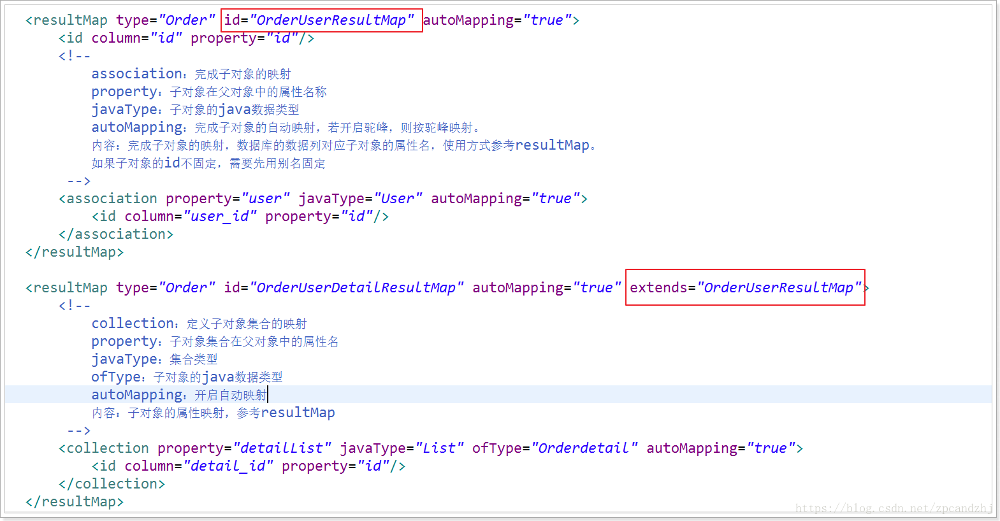

# Mybatis 多表查询
一对多包含了一对一，所以只说明一对多和多对多的情况。实际上多对多和一对多也是一样的。

## 总结
**其实就是需要使用resultMap标签，一对一使用association标签，一对多使用collection标签。**

一对一：
```xml
<!--<resultMap id="accountMap" type="com.pojo.Account">
    <id property="id" column="aid"></id>
    <result property="uid" column="uid"></result>
    <result property="money" column="money"></result>
    <association property="user" javaType="com.pojo.User">
        <id property="id" column="id"></id>
        <result property="username" column="username"></result>
        <result property="birthday" column="birthday"></result>
        <result property="sex" column="sex"></result>
        <result property="address" column="address"></result>
    </association>
</resultMap>-->

<!--使用autoMapping属性，不使用的话就必须每个属性都配置。association标签也要单独设置autoMapping-->
<resultMap id="accountMap" type="com.pojo.Account" autoMapping="true">
    <id property="id" column="aid"></id>
    <!--association:完成子对象的映射-->
    <!--property:子对象在父对象中的属性名-->
    <!--javaType:子对象的java类型-->
    <!--autoMapping:完成子对象的自动映射，若开启驼峰，则按驼峰匹配-->
    <association property="user" javaType="com.pojo.User" autoMapping="true">
        <id property="id" column="id"></id>
    </association>
</resultMap>

<select id="findAll" resultMap="accountMap">
    select a.id aid,a.uid,a.money,b.*  from account a left join user b on a.uid = b.id
</select>
```

一对多：
```xml
<resultMap id="userMap" type="com.pojo.User" autoMapping="true">
    <id property="id" column="id"></id>
    <!-- collection 是用于建立一对多中集合属性的对应关系
        ofType 用于指定集合元素的数据类型
    -->
    <collection property="accounts"  ofType="com.pojo.Account" autoMapping="true">
        <id property="id" column="aid"></id>
    </collection>
</resultMap>

<select id="findAll" resultMap="userMap">
    select a.*,b.id aid,b.uid,b.money from user a left join account b on a.id = b.uid
</select>
```

## 一对多
本次案例主要以最为简单的用户和账户的模型来分析 Mybatis 多表关系。用户为 User 表,账户为 Account表。一个用户(User)可以有多个账户(Account)。
```sql
CREATE TABLE `user` (
  `id` int(11) NOT NULL AUTO_INCREMENT,
  `username` varchar(32) NOT NULL COMMENT '用户名称',
  `birthday` datetime DEFAULT NULL COMMENT '生日',
  `sex` char(1) DEFAULT NULL COMMENT '性别',
  `address` varchar(256) DEFAULT NULL COMMENT '地址',
  PRIMARY KEY (`id`)
) ENGINE=MyISAM AUTO_INCREMENT=52 DEFAULT CHARSET=utf8;

CREATE TABLE `account` (
  `ID` int(11) NOT NULL COMMENT '编号',
  `UID` int(11) DEFAULT NULL COMMENT '用户编号',
  `MONEY` double DEFAULT NULL COMMENT '金额',
  PRIMARY KEY (`ID`),
  KEY `FK_Reference_8` (`UID`)
) ENGINE=MyISAM DEFAULT CHARSET=utf8;
```

### 一对一查询(多对一)
```
需求
    查询所有账户信息,关联查询下单用户信息。
注意:
    因为一个账户信息只能供某个用户使用,所以从查询账户信息出发关联查询用户信息为一对一查询。如果从用户信息出发查询用户下的账户信息则为一对多查询,因为一个用户可以有多个账户。
```

#### 方法一
核心思想扩展Account对象，来完成映射

pojo：
```java
public class Account {
	private Integer id;
	private Integer uid;
	private Double money;
}

public class AccountUser extends Account {
	private String username;
	private String address;
}
```

mapper文件：
```xml
<select id="findAllAccount" resultType="com.pojo.AccountUser">
    select a.*,b.username,b.address from account a left join user b on a.uid = b.id
</select>
```

#### 方法二
面向对象的思想，在Account对象中添加User对象。

使用 resultMap,定义专门的 resultMap 用于映射一对一查询结果。

通过面向对象的(has a)关系可以得知,我们可以在 Account 类中加入一个 User 类的对象来代表这个账户是哪个用户的。

pojo：
```java
public class User {
	private int id;
	private String username;
	private Date birthday;
	private String sex;
	private String address;
}
public class Account {
	private Integer id;
	private Integer uid;
	private Double money;

	//从表实体应该包含一个主表实体的对象引用
	private User user;
}
```

mapper文件：
```xml
<!--<resultMap id="accountMap" type="com.pojo.Account">
    <id property="id" column="aid"></id>
    <result property="uid" column="uid"></result>
    <result property="money" column="money"></result>
    <association property="user" javaType="com.pojo.User">
        <id property="id" column="id"></id>
        <result property="username" column="username"></result>
        <result property="birthday" column="birthday"></result>
        <result property="sex" column="sex"></result>
        <result property="address" column="address"></result>
    </association>
</resultMap>-->

<!--使用autoMapping属性，不使用的话就必须每个属性都配置。association标签也要单独设置autoMapping-->
<resultMap id="accountMap" type="com.pojo.Account" autoMapping="true">
    <id property="id" column="aid"></id>
    <!--association:完成子对象的映射-->
    <!--property:子对象在父对象中的属性名-->
    <!--javaType:子对象的java类型-->
    <!--autoMapping:完成子对象的自动映射，若开启驼峰，则按驼峰匹配-->
    <association property="user" javaType="com.pojo.User" autoMapping="true">
        <id property="id" column="id"></id>
    </association>
</resultMap>

<select id="findAll" resultMap="accountMap">
    select a.id aid,a.uid,a.money,b.*  from account a left join user b on a.uid = b.id
</select>
```

### 一对多查询
```
需求:
    查询所有用户信息及用户关联的账户信息。
分析:
    用户信息和他的账户信息为一对多关系,并且查询过程中如果用户没有账户信息,此时也要将用户信息查询出来,我们想到了左外连接查询比较合适。
```

通过id属性来区分是否是同一条数据。

pojo：
```java
public class User {
	private int id;
	private String username;
	private Date birthday;
	private String sex;
	private String address;
    
    //一对多关系映射：主表实体应该包含从表实体的集合引用
	private List<Account> accounts;    
}
public class Account {
	private Integer id;
	private Integer uid;
	private Double money;
}
```

mapper文件：
```xml
<!--<resultMap id="userMap" type="com.pojo.User">
    <id property="id" column="id"></id>
    <result property="username" column="username"></result>
    <result property="birthday" column="birthday"></result>
    <result property="sex" column="sex"></result>
    <result property="address" column="address"></result>
    <collection property="accounts"  javaType="List" ofType="com.pojo.Account">
        <id property="id" column="aid"></id>
        <result property="uid" column="uid"></result>
        <result property="money" column="money"></result>
    </collection>
</resultMap>-->

<resultMap id="userMap" type="com.pojo.User" autoMapping="true">
    <id property="id" column="id"></id>
    <!-- collection 是用于建立一对多中集合属性的对应关系
        ofType 用于指定集合元素的数据类型
    -->
    <collection property="accounts"  ofType="com.pojo.Account" autoMapping="true">
        <id property="id" column="aid"></id>
    </collection>
</resultMap>

<select id="findAll" resultMap="userMap">
    select a.*,b.id aid,b.uid,b.money from user a left join account b on a.id = b.uid
</select>

<select id="findById" parameterType="int" resultMap="userMap">
    select a.*,b.id aid,b.uid,b.money from user a left join account b on a.id = b.uid where a.id = #{id}
</select>
```

## 多对多
使用用户和角色案例。以查询角色带用户信息为例，查询用户带角色信息同理是一样的。

实际上多对多和一对多是一样的。

sql：
```sql
CREATE TABLE `user` (
  `id` int(11) NOT NULL AUTO_INCREMENT,
  `username` varchar(32) NOT NULL COMMENT '用户名称',
  `birthday` datetime DEFAULT NULL COMMENT '生日',
  `sex` char(1) DEFAULT NULL COMMENT '性别',
  `address` varchar(256) DEFAULT NULL COMMENT '地址',
  PRIMARY KEY (`id`)
) ENGINE=MyISAM AUTO_INCREMENT=52 DEFAULT CHARSET=utf8;

CREATE TABLE `role` (
  `ID` int(11) NOT NULL COMMENT '编号',
  `ROLE_NAME` varchar(30) DEFAULT NULL COMMENT '角色名称',
  `ROLE_DESC` varchar(60) DEFAULT NULL COMMENT '角色描述',
  PRIMARY KEY (`ID`)
) ENGINE=MyISAM DEFAULT CHARSET=utf8;

CREATE TABLE `user_role` (
  `UID` int(11) NOT NULL COMMENT '用户编号',
  `RID` int(11) NOT NULL COMMENT '角色编号',
  PRIMARY KEY (`UID`,`RID`)
) ENGINE=MyISAM DEFAULT CHARSET=utf8;
```

pojo：
```java
public class User {
	private int id;
	private String username;
	private Date birthday;
	private String sex;
	private String address;   
}

public class Role {
	private Integer id;
	private String roleName;
	private String roleDesc;

	//多对多的关系映射：一个角色可以赋予多个用户
	private List<User> users;
}
```

mapper文件：
```xml
<resultMap id="roleMap" type="com.pojo.Role">
    <id property="id" column="rid"></id>
    <result property="roleName" column="role_name"></result>
    <result property="roleDesc" column="role_desc"></result>
    <collection property="users" ofType="com.pojo.User" autoMapping="true">
        <id property="id" column="id"></id>
    </collection>
</resultMap>

<select id="findAll" resultMap="roleMap">
    select r.id rid,r.role_name,r.role_desc,u.*  from role r left join user_role ur on r.id = ur.rid left join user u on ur.uid = u.id
</select>
```

## resultMap的继承
```java
/**
 * 根据订单号查询订单用户的信息及订单详情及订单详情对应的商品信息
 */
Order queryOrderWithUserAndDetailItemByOrderNumber(@Param("number") String number);
```

```xml
<resultMap id="OrderUserDetailItemResultMap" type="com.zpc.mybatis.pojo.Order" autoMapping="true">
    <id column="id" property="id"/>
    <association property="user" javaType="com.zpc.mybatis.pojo.User" autoMapping="true">
        <id column="user_id" property="id"/>
    </association>
    <collection property="detailList" javaType="List" ofType="com.zpc.mybatis.pojo.OrderDetail" autoMapping="true">
        <id column="detail_id" property="id"/>
        <association property="item" javaType="com.zpc.mybatis.pojo.Item" autoMapping="true">
            <id column="item_id" property="id"/>
        </association>
    </collection>
</resultMap>

 <select id="queryOrderWithUserAndDetailItemByOrderNumber" resultMap="OrderUserDetailItemResultMap">
   select * ,od.id as detail_id from tb_order o
   left join tb_user u on o.user_id=u.id
   left join tb_orderdetail od on o.id=od.order_id
   left join tb_item i on od.item_id=i.id
   where o.order_number = #{number}
</select>
```

可以使用继承：


# 延迟加载
通过前面的学习,我们已经掌握了 Mybatis 中一对一,一对多,多对多关系的配置及实现,可以实现对象的关联查询。实际开发过程中很多时候我们并不需要总是在加载用户信息时就一定要加载他的账户信息。此时就是我们所说的延迟加载。

首先我们先思考一个问题，假设：在一对多中，我们有一个用户，他有100个账户。

问题1：在查询用户的时候，要不要把关联的账户查出来？

问题2：在查询账户的时候，要不要把关联的用户查出来？

解答：在查询用户的时候，用户下的账户信息应该是我们什么时候使用，什么时候去查询。

在查询账户的时候，账户的所属用户信息应该是随着账户查询时一起查询出来。

搞清楚这两个简单的问题后，我们就可以引出延迟加载和立即加载的特性。

**延迟加载**：在真正使用数据的时候才发起查询，不用的时候不查询关联的数据，延迟加载又叫按需查询（懒加载）

**立即加载**：不管用不用，只要一调用方法，马上发起查询。

**使用场景**：在对应的四种表关系中，一对多、多对多通常情况下采用延迟加载，多对一、一对一通常情况下采用立即加载。

## 总结
**其实就是使用association标签和collection标签。通过设置column和select属性实现延时加载。**

```xml
<mapper namespace="com.dao.AccountLazyDao">

    <resultMap id="accountMap" type="com.pojo.Account" autoMapping="true">
        <id property="id" column="id"></id>
        <!--这个不写的话，查出来是null。money属性可以不写，可能是uid在association中配置的原因吧-->
        <result property="uid" column="uid"></result>
        <association property="user" javaType="com.pojo.User" column="uid" select="findUserById" >
        </association>
        <!--select属性也可以引用其他文件的select-->
        <!--<association property="user" javaType="com.pojo.User" column="uid" select="com.dao.UserDao.findById" >
        </association>-->
    </resultMap>

    <select id="findAll" resultMap="accountMap">
        select *  from account
    </select>


    <select id="findUserById" parameterType="int" resultType="com.pojo.User">
        select * from user u where u.id = #{id}
    </select>

</mapper>
```

```xml
<mapper namespace="com.dao.UserLazyDao">

    <!--<resultMap id="userMap" type="com.pojo.User">
        <id property="id" column="id"></id>
        <result property="username" column="username"></result>
        <result property="birthday" column="birthday"></result>
        <result property="sex" column="sex"></result>
        <result property="address" column="address"></result>
        <collection property="accounts"  javaType="List" ofType="com.pojo.Account">
            <id property="id" column="aid"></id>
            <result property="uid" column="uid"></result>
            <result property="money" column="money"></result>
        </collection>
    </resultMap>-->

    <resultMap id="userMap" type="com.pojo.User" autoMapping="true">
        <id property="id" column="id"></id>
        <collection property="accounts"  ofType="com.pojo.Account" column="id" select="findAccountsByUserId">
        </collection>
    </resultMap>

    <select id="findAll" resultMap="userMap">
        select * from user
    </select>

    <select id="findAccountsByUserId" resultType="com.pojo.Account">
        select * from account where uid = #{uid}
    </select>
</mapper>
```

## 延迟加载策略配置
理解了延迟加载的特性以后再看Mybatis中如何实现查询方法的延迟加载，在MyBatis 的配置文件中通过设置settings的lazyLoadingEnabled属性为true进行开启全局的延迟加载，通过aggressiveLazyLoading属性开启立即加载。看一下官网的介绍，然后通过一个实例来实现Mybatis的延迟加载，在例子中我们展现一对多表关系情况下，通过实现查询用户信息同时查询出该用户所拥有的账户信息的功能展示一下延迟加载的实现方式以及延迟加载和立即加载的结果的不同之处。

**aggressiveLazyLoading不要设为true(获取任意属性都会加载所有属性)**

| 属性                  | 说明                                                                                                                 | 可以取值          | 默认值                                       |
| --------------------- | -------------------------------------------------------------------------------------------------------------------- | ----------------- | -------------------------------------------- |
| lazyLoadingEnabled    | 延迟加载的全局开关。当开启时，所有关联对象都会延迟加载。 特定关联关系中可通过设置fetchType属性来覆盖该项的开关状态。 | true &#124; false | false                                        |
| aggressiveLazyLoading | 当开启时，任何方法的调用都会加载该对象的所有属性。 否则，每个属性会按需加载（参考lazyLoadTriggerMethods)。           | true &#124; false | false （在 3.4.1 及之前的版本默认值为 true） |

```xml
<!--配置参数-->
<settings>
    <!--开启Mybatis支持延迟加载-->
    <setting name="lazyLoadingEnabled" value="true"/>
    <!--使用延时加载aggressiveLazyLoading一定要配置成false，不然加载任意属性都会触发懒加载。-->
    <setting name="aggressiveLazyLoading" value="false"></setting>
</settings>
```

## 使用 assocation 实现延迟加载

### mapper配置文件
mapper文件：
```xml
<?xml version="1.0" encoding="UTF-8"?>
<!DOCTYPE mapper
        PUBLIC "-//mybatis.org//DTD Mapper 3.0//EN"
        "http://mybatis.org/dtd/mybatis-3-mapper.dtd">
<mapper namespace="com.dao.AccountLazyDao">

    <resultMap id="accountMap" type="com.pojo.Account" autoMapping="true">
        <id property="id" column="id"></id>
        <!--这个不写的话，查出来是null。money属性可以不写，可能是uid在association中配置的原因吧-->
        <result property="uid" column="uid"></result>
        <association property="user" javaType="com.pojo.User" column="uid" select="findUserById" >
        </association>
        <!--select属性也可以引用其他文件的select-->
        <!--<association property="user" javaType="com.pojo.User" column="uid" select="com.dao.UserDao.findById" >
        </association>-->
    </resultMap>

    <select id="findAll" resultMap="accountMap">
        select *  from account
    </select>


    <select id="findUserById" parameterType="int" resultType="com.pojo.User">
        select * from user u where u.id = #{id}
    </select>

</mapper>
```

### dao接口
mapper dao接口：
```java
/**
 * 延时加载测试
 */
public interface UserLazyDao {
	/**
	 * 查询所有用户，延时加载账户信息
	 * @return
	 */
	List<User> findAll();
}
```

### 测试
测试类：
```java
@Test
public void findAll() {
    List<Account> list = accountLazyDao.findAll();
    System.out.println("---------------------------");
    for (Account account : list) {
        System.out.println(account.getUid());
        System.out.println(account.getMoney());
    }
    System.out.println("---------------------------");
    for (Account account : list) {
        System.out.println(account.getUser().getUsername());
        System.out.println(account.getUser().hashCode());
    }
    //延时加载，同一个对象，不开启延时加载经过测试也是同一个对象
    System.out.println(list.get(0).getUser() == list.get(2).getUser());
}
```

通过输出可以看到确实实现了延时加载，而且id相同的User是同一个对象(关闭延时加载也是同一个对象)，应该是缓存的原因。

测试输出：
```
2020-02-27 17:39:59,816 140    [           main] DEBUG source.pooled.PooledDataSource  - PooledDataSource forcefully closed/removed all connections.
2020-02-27 17:39:59,816 140    [           main] DEBUG source.pooled.PooledDataSource  - PooledDataSource forcefully closed/removed all connections.
2020-02-27 17:39:59,816 140    [           main] DEBUG source.pooled.PooledDataSource  - PooledDataSource forcefully closed/removed all connections.
2020-02-27 17:39:59,816 140    [           main] DEBUG source.pooled.PooledDataSource  - PooledDataSource forcefully closed/removed all connections.
2020-02-27 17:39:59,988 312    [           main] DEBUG ansaction.jdbc.JdbcTransaction  - Opening JDBC Connection
2020-02-27 17:40:00,316 640    [           main] DEBUG source.pooled.PooledDataSource  - Created connection 1122805102.
2020-02-27 17:40:00,316 640    [           main] DEBUG ansaction.jdbc.JdbcTransaction  - Setting autocommit to false on JDBC Connection [com.mysql.jdbc.JDBC4Connection@42eca56e]
2020-02-27 17:40:00,316 640    [           main] DEBUG com.dao.AccountLazyDao.findAll  - ==>  Preparing: select * from account 
2020-02-27 17:40:00,362 686    [           main] DEBUG com.dao.AccountLazyDao.findAll  - ==> Parameters: 
2020-02-27 17:40:00,440 764    [           main] DEBUG com.dao.AccountLazyDao.findAll  - <==      Total: 3
---------------------------
46
1000.0
45
1000.0
46
2000.0
---------------------------
2020-02-27 17:40:00,440 764    [           main] DEBUG ao.AccountLazyDao.findUserById  - ==>  Preparing: select * from user u where u.id = ? 
2020-02-27 17:40:00,440 764    [           main] DEBUG ao.AccountLazyDao.findUserById  - ==> Parameters: 46(Integer)
2020-02-27 17:40:00,518 842    [           main] DEBUG ao.AccountLazyDao.findUserById  - <==      Total: 1
老王
1890187342
2020-02-27 17:40:00,518 842    [           main] DEBUG ao.AccountLazyDao.findUserById  - ==>  Preparing: select * from user u where u.id = ? 
2020-02-27 17:40:00,518 842    [           main] DEBUG ao.AccountLazyDao.findUserById  - ==> Parameters: 45(Integer)
2020-02-27 17:40:00,534 858    [           main] DEBUG ao.AccountLazyDao.findUserById  - <==      Total: 1
小二王
294184992
老王
1890187342
true
2020-02-27 17:40:00,534 858    [           main] DEBUG ansaction.jdbc.JdbcTransaction  - Resetting autocommit to true on JDBC Connection [com.mysql.jdbc.JDBC4Connection@42eca56e]
2020-02-27 17:40:00,581 905    [           main] DEBUG ansaction.jdbc.JdbcTransaction  - Closing JDBC Connection [com.mysql.jdbc.JDBC4Connection@42eca56e]
2020-02-27 17:40:00,581 905    [           main] DEBUG source.pooled.PooledDataSource  - Returned connection 1122805102 to pool.
```

### aggressiveLazyLoading测试
aggressiveLazyLoading设置为true，测试输出

可以看到访问非懒加载的属性也会触发查询所有属性，所以这个属性千万不要设置为true。
```
2020-02-27 17:45:35,945 141    [           main] DEBUG source.pooled.PooledDataSource  - PooledDataSource forcefully closed/removed all connections.
2020-02-27 17:45:35,945 141    [           main] DEBUG source.pooled.PooledDataSource  - PooledDataSource forcefully closed/removed all connections.
2020-02-27 17:45:35,945 141    [           main] DEBUG source.pooled.PooledDataSource  - PooledDataSource forcefully closed/removed all connections.
2020-02-27 17:45:35,945 141    [           main] DEBUG source.pooled.PooledDataSource  - PooledDataSource forcefully closed/removed all connections.
2020-02-27 17:45:36,179 375    [           main] DEBUG ansaction.jdbc.JdbcTransaction  - Opening JDBC Connection
2020-02-27 17:45:36,617 813    [           main] DEBUG source.pooled.PooledDataSource  - Created connection 1122805102.
2020-02-27 17:45:36,617 813    [           main] DEBUG ansaction.jdbc.JdbcTransaction  - Setting autocommit to false on JDBC Connection [com.mysql.jdbc.JDBC4Connection@42eca56e]
2020-02-27 17:45:36,617 813    [           main] DEBUG com.dao.AccountLazyDao.findAll  - ==>  Preparing: select * from account 
2020-02-27 17:45:36,679 875    [           main] DEBUG com.dao.AccountLazyDao.findAll  - ==> Parameters: 
2020-02-27 17:45:36,788 984    [           main] DEBUG com.dao.AccountLazyDao.findAll  - <==      Total: 3
---------------------------
2020-02-27 17:45:36,788 984    [           main] DEBUG ao.AccountLazyDao.findUserById  - ==>  Preparing: select * from user u where u.id = ? 
2020-02-27 17:45:36,788 984    [           main] DEBUG ao.AccountLazyDao.findUserById  - ==> Parameters: 46(Integer)
2020-02-27 17:45:36,788 984    [           main] DEBUG ao.AccountLazyDao.findUserById  - <==      Total: 1
46
1000.0
2020-02-27 17:45:36,788 984    [           main] DEBUG ao.AccountLazyDao.findUserById  - ==>  Preparing: select * from user u where u.id = ? 
2020-02-27 17:45:36,788 984    [           main] DEBUG ao.AccountLazyDao.findUserById  - ==> Parameters: 45(Integer)
2020-02-27 17:45:36,788 984    [           main] DEBUG ao.AccountLazyDao.findUserById  - <==      Total: 1
45
1000.0
46
2000.0
---------------------------
老王
19986569
小二王
294184992
老王
19986569
true
2020-02-27 17:45:36,788 984    [           main] DEBUG ansaction.jdbc.JdbcTransaction  - Resetting autocommit to true on JDBC Connection [com.mysql.jdbc.JDBC4Connection@42eca56e]
2020-02-27 17:45:36,788 984    [           main] DEBUG ansaction.jdbc.JdbcTransaction  - Closing JDBC Connection [com.mysql.jdbc.JDBC4Connection@42eca56e]
2020-02-27 17:45:36,788 984    [           main] DEBUG source.pooled.PooledDataSource  - Returned connection 1122805102 to pool.
```

### fetchType属性实现延时加载
延时加载全局开关lazyLoadingEnabled设为false，可以通过fetchType属性实现延时加载，测试可用。
```xml
<?xml version="1.0" encoding="UTF-8"?>
<!DOCTYPE mapper
        PUBLIC "-//mybatis.org//DTD Mapper 3.0//EN"
        "http://mybatis.org/dtd/mybatis-3-mapper.dtd">
<mapper namespace="com.dao.AccountLazyDao">

    <resultMap id="accountMap" type="com.pojo.Account" autoMapping="true">
        <id property="id" column="id"></id>
        <!--这个不写的话，查出来是null。money属性可以不写，可能是uid在association中配置的原因吧-->
        <result property="uid" column="uid"></result>
        <!--fetchType="lazy"可以覆写全局的配置实现延时加载-->
        <association property="user" javaType="com.pojo.User" column="uid" select="findUserById" fetchType="lazy">
        </association>
        <!--select属性也可以引用其他文件的select-->
        <!--<association property="user" javaType="com.pojo.User" column="uid" select="com.dao.UserDao.findById" >
        </association>-->
    </resultMap>

    <select id="findAll" resultMap="accountMap">
        select *  from account
    </select>


    <select id="findUserById" parameterType="int" resultType="com.pojo.User">
        select * from user u where u.id = #{id}
    </select>

</mapper>
```


## 使用 Collection 实现延迟加载
和assocation一样

### mapper配置文件
mapper文件：
```xml
<?xml version="1.0" encoding="UTF-8"?>
<!DOCTYPE mapper
        PUBLIC "-//mybatis.org//DTD Mapper 3.0//EN"
        "http://mybatis.org/dtd/mybatis-3-mapper.dtd">
<mapper namespace="com.dao.UserLazyDao">

    <!--<resultMap id="userMap" type="com.pojo.User">
        <id property="id" column="id"></id>
        <result property="username" column="username"></result>
        <result property="birthday" column="birthday"></result>
        <result property="sex" column="sex"></result>
        <result property="address" column="address"></result>
        <collection property="accounts"  javaType="List" ofType="com.pojo.Account">
            <id property="id" column="aid"></id>
            <result property="uid" column="uid"></result>
            <result property="money" column="money"></result>
        </collection>
    </resultMap>-->

    <resultMap id="userMap" type="com.pojo.User" autoMapping="true">
        <id property="id" column="id"></id>
        <collection property="accounts"  ofType="com.pojo.Account" column="id" select="findAccountsByUserId">
        </collection>
    </resultMap>

    <select id="findAll" resultMap="userMap">
        select * from user
    </select>

    <select id="findAccountsByUserId" resultType="com.pojo.Account">
        select * from account where uid = #{uid}
    </select>
</mapper>
```

### dao接口
mapper dao接口：
```java
/**
 * 延时加载测试
 */
public interface UserLazyDao {
	/**
	 * 查询所有用户，延时加载账户信息
	 * @return
	 */
	List<User> findAll();
}
```

### 测试
测试类：
```java
@Test
public void findAll() {
    List<User> users = userLazyDao.findAll();
    System.out.println("---------------------------");
    for (User user : users) {
        System.out.println(user.getId());
    }
    System.out.println("---------------------------");
    for (User user : users) {
        System.out.println(user.getId() + ":"+user.getAccounts().stream().map(a -> a.getId() + "").collect(Collectors.joining(", ")));
    }
}
```

通过输出看出实现了延时加载。

测试输出：
```
2020-02-27 18:06:46,808 187    [           main] DEBUG source.pooled.PooledDataSource  - PooledDataSource forcefully closed/removed all connections.
2020-02-27 18:06:46,808 187    [           main] DEBUG source.pooled.PooledDataSource  - PooledDataSource forcefully closed/removed all connections.
2020-02-27 18:06:46,808 187    [           main] DEBUG source.pooled.PooledDataSource  - PooledDataSource forcefully closed/removed all connections.
2020-02-27 18:06:46,808 187    [           main] DEBUG source.pooled.PooledDataSource  - PooledDataSource forcefully closed/removed all connections.
2020-02-27 18:06:47,042 421    [           main] DEBUG ansaction.jdbc.JdbcTransaction  - Opening JDBC Connection
2020-02-27 18:06:47,323 702    [           main] DEBUG source.pooled.PooledDataSource  - Created connection 1122805102.
2020-02-27 18:06:47,323 702    [           main] DEBUG ansaction.jdbc.JdbcTransaction  - Setting autocommit to false on JDBC Connection [com.mysql.jdbc.JDBC4Connection@42eca56e]
2020-02-27 18:06:47,323 702    [           main] DEBUG    com.dao.UserLazyDao.findAll  - ==>  Preparing: select * from user 
2020-02-27 18:06:47,369 748    [           main] DEBUG    com.dao.UserLazyDao.findAll  - ==> Parameters: 
2020-02-27 18:06:47,432 811    [           main] DEBUG    com.dao.UserLazyDao.findAll  - <==      Total: 7
---------------------------
41
42
45
46
51
49
50
---------------------------
2020-02-27 18:06:47,432 811    [           main] DEBUG erLazyDao.findAccountsByUserId  - ==>  Preparing: select * from account where uid = ? 
2020-02-27 18:06:47,432 811    [           main] DEBUG erLazyDao.findAccountsByUserId  - ==> Parameters: 41(Integer)
2020-02-27 18:06:47,432 811    [           main] DEBUG erLazyDao.findAccountsByUserId  - <==      Total: 0
41:
2020-02-27 18:06:47,525 904    [           main] DEBUG erLazyDao.findAccountsByUserId  - ==>  Preparing: select * from account where uid = ? 
2020-02-27 18:06:47,525 904    [           main] DEBUG erLazyDao.findAccountsByUserId  - ==> Parameters: 42(Integer)
2020-02-27 18:06:47,525 904    [           main] DEBUG erLazyDao.findAccountsByUserId  - <==      Total: 0
42:
2020-02-27 18:06:47,525 904    [           main] DEBUG erLazyDao.findAccountsByUserId  - ==>  Preparing: select * from account where uid = ? 
2020-02-27 18:06:47,541 920    [           main] DEBUG erLazyDao.findAccountsByUserId  - ==> Parameters: 45(Integer)
2020-02-27 18:06:47,541 920    [           main] DEBUG erLazyDao.findAccountsByUserId  - <==      Total: 1
45:2
2020-02-27 18:06:47,541 920    [           main] DEBUG erLazyDao.findAccountsByUserId  - ==>  Preparing: select * from account where uid = ? 
2020-02-27 18:06:47,541 920    [           main] DEBUG erLazyDao.findAccountsByUserId  - ==> Parameters: 46(Integer)
2020-02-27 18:06:47,541 920    [           main] DEBUG erLazyDao.findAccountsByUserId  - <==      Total: 2
46:1, 3
2020-02-27 18:06:47,541 920    [           main] DEBUG erLazyDao.findAccountsByUserId  - ==>  Preparing: select * from account where uid = ? 
2020-02-27 18:06:47,541 920    [           main] DEBUG erLazyDao.findAccountsByUserId  - ==> Parameters: 51(Integer)
2020-02-27 18:06:47,541 920    [           main] DEBUG erLazyDao.findAccountsByUserId  - <==      Total: 0
51:
2020-02-27 18:06:47,541 920    [           main] DEBUG erLazyDao.findAccountsByUserId  - ==>  Preparing: select * from account where uid = ? 
2020-02-27 18:06:47,557 936    [           main] DEBUG erLazyDao.findAccountsByUserId  - ==> Parameters: 49(Integer)
2020-02-27 18:06:47,557 936    [           main] DEBUG erLazyDao.findAccountsByUserId  - <==      Total: 0
49:
2020-02-27 18:06:47,557 936    [           main] DEBUG erLazyDao.findAccountsByUserId  - ==>  Preparing: select * from account where uid = ? 
2020-02-27 18:06:47,557 936    [           main] DEBUG erLazyDao.findAccountsByUserId  - ==> Parameters: 50(Integer)
2020-02-27 18:06:47,557 936    [           main] DEBUG erLazyDao.findAccountsByUserId  - <==      Total: 0
50:
2020-02-27 18:06:47,557 936    [           main] DEBUG ansaction.jdbc.JdbcTransaction  - Resetting autocommit to true on JDBC Connection [com.mysql.jdbc.JDBC4Connection@42eca56e]
2020-02-27 18:06:47,557 936    [           main] DEBUG ansaction.jdbc.JdbcTransaction  - Closing JDBC Connection [com.mysql.jdbc.JDBC4Connection@42eca56e]
2020-02-27 18:06:47,557 936    [           main] DEBUG source.pooled.PooledDataSource  - Returned connection 1122805102 to pool.
```


```xml

```

```java

```