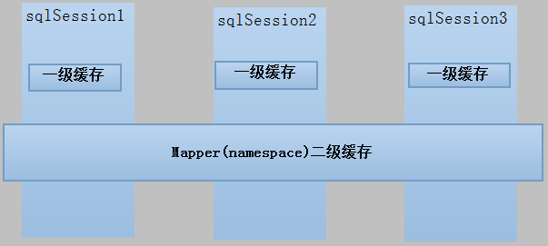

# Mybatis 缓存
`https://www.cnblogs.com/ye-feng-yu/p/11032253.html`
`https://blog.csdn.net/weixin_37139197/article/details/82908377#1__10`
`https://www.cnblogs.com/ye-feng-yu/p/11032253.html`

MyBatis 包含一个非常强大的查询缓存特性,它可以非常方便地配置和定制。缓存可以极大的提升查询效率。

查询缓存适合有大量相同查询的应用，不适合有大量数据更新的应用。

MyBatis系统中默认定义了两级缓存：一级缓存和二级缓存。

* 1、默认情况下，只有一级缓存（SqlSession级别的缓存，也称为本地缓存）开启。    
* 2、二级缓存需要手动开启和配置，他是基于namespace级别的缓存。    
* 3、为了提高扩展性。MyBatis定义了缓存接口Cache。我们可以通过实现Cache接口来自定义二级缓存  



## 一级缓存
一级缓存(local cache), 即本地缓存, 作用域默认为sqlSession。当Session flush或close 后,该Session中的所有Cache将被清空。 本地缓存不能被关闭, 但可以调用clearCache() 来清空本地缓存, 或者改变缓存的作用域。在mybatis3.1之后, 可以配置本地缓存的作用域，在mybatis.xml 中配置 。同一次会话期间只要查询过的数据都会保存在当前SqlSession的一个Map中，key:hashCode+查询的SqlId+编写的sql查询语句+参数

缓存使用方式：
```java
public static void main(String[] args)
    throws IOException
{
    InputStream resourceAsStream = Resources.getResourceAsStream("mybatis-config.xml");
    SqlSessionFactory sqlSessionFactory = new SqlSessionFactoryBuilder().build(resourceAsStream);
    SqlSession sqlSession = sqlSessionFactory.openSession();
    try
    {
        PersonMapper mapper = sqlSession.getMapper(PersonMapper.class);

        Person person1 = mapper.getPerson(1);
        System.out.println(person1);

        Person person2 = mapper.getPerson(1);
        System.out.println(person2);

        System.out.println(person1 == person2);
    }
    finally
    {
        sqlSession.close();
    }
}
```

### 一级缓存失效的情况 (未 close SqlSession情况下)
一级缓存满足条件：

* 1、同一个session中    
* 2、相同的SQL和参数   


一级缓存失效的四种情况 (未 close SqlSession情况下)

* 1、不同的SqlSession对应不同的一级缓存    
* 2、同一个SqlSession但是查询条件不同    
* 3、同一个SqlSession两次查询期间执行了任何一次增删改操作    
* 4、同一个SqlSession两次查询期间手动清空了缓存

1、不同的SqlSession对应不同的一级缓存
```java
public static void main(String[] args)
    throws IOException
{
    InputStream resourceAsStream = Resources.getResourceAsStream("mybatis-config.xml");
    SqlSessionFactory sqlSessionFactory = new SqlSessionFactoryBuilder().build(resourceAsStream);
    SqlSession sqlSession01 = sqlSessionFactory.openSession();
    SqlSession sqlSession02 = sqlSessionFactory.openSession();
    try
    {
        PersonMapper mapper = sqlSession01.getMapper(PersonMapper.class);
        Person person1 = mapper.getPerson(1);
        System.out.println(person1);

        mapper = sqlSession02.getMapper(PersonMapper.class);
        Person person2 = mapper.getPerson(1);
        System.out.println(person2);

        System.out.println(person1 == person2);//false
    }
    finally
    {
        sqlSession01.close();
        sqlSession02.close();
    }
}
```

2、同一个SqlSession但是查询条件不同
```java
public static void main(String[] args)
    throws IOException
{
    InputStream resourceAsStream = Resources.getResourceAsStream("mybatis-config.xml");
    SqlSessionFactory sqlSessionFactory = new SqlSessionFactoryBuilder().build(resourceAsStream);
    SqlSession sqlSession = sqlSessionFactory.openSession();
    try
    {
        PersonMapper mapper = sqlSession.getMapper(PersonMapper.class);

        Person person1 = mapper.getPerson(1);//查询id为1
        System.out.println(person1);

        Person person2 = mapper.getPerson(2);//查询id为2
        System.out.println(person2);

        System.out.println(person1 == person2);//false
    }
    finally
    {
        sqlSession.close();
    }
}
```

3、同一个SqlSession两次查询期间执行了任何一次增删改操作
```java
public static void main(String[] args)
    throws IOException
{
    InputStream resourceAsStream = Resources.getResourceAsStream("mybatis-config.xml");
    SqlSessionFactory sqlSessionFactory = new SqlSessionFactoryBuilder().build(resourceAsStream);
    SqlSession sqlSession = sqlSessionFactory.openSession();
    try
    {
        PersonMapper mapper = sqlSession.getMapper(PersonMapper.class);

        Person person1 = mapper.getPerson(1);
        System.out.println(person1);

        mapper.deletePerson(2);//删除一个数据

        Person person2 = mapper.getPerson(1);
        System.out.println(person2);

        System.out.println(person1 == person2);//false
    }
    finally
    {
        sqlSession.commit();
        sqlSession.close();
    }
}
```

4、同一个SqlSession两次查询期间手动清空了缓存
```java
public static void main(String[] args)
    throws IOException
{
    InputStream resourceAsStream = Resources.getResourceAsStream("mybatis-config.xml");
    SqlSessionFactory sqlSessionFactory = new SqlSessionFactoryBuilder().build(resourceAsStream);
    SqlSession sqlSession = sqlSessionFactory.openSession();
    try
    {
        PersonMapper mapper = sqlSession.getMapper(PersonMapper.class);

        Person person1 = mapper.getPerson(1);
        System.out.println(person1);

        sqlSession.clearCache();//手动清除了缓存

        Person person2 = mapper.getPerson(1);
        System.out.println(person2);

        System.out.println(person1 == person2);//false
    }
    finally
    {
        sqlSession.close();
    }
}
```


### 一级缓存应用
正式开发，假如项目是将mybatis和spring进行整合开发....，事务控制在service中。

一个service方法中包括 很多mapper方法调用。
```java
service{

　　　　//开始执行时，开启事务，创建SqlSession对象

　　　　//第一次调用mapper的方法getUserById(1)

　　　　　　//第二次调用mapper的方法getUserById(1)，从一级缓存中取数据

　　　　 //方法结束，sqlSession关闭

}
```
**如果是执行两次service调用查询相同 的用户信息，不走一级缓存，因为session方法结束，sqlSession就关闭，一级缓存就清空。**

## 二级缓存
二级缓存（全局缓存）：基于namespace级别的缓存，一个namespace对应一个二级缓存。

### 工作机制
工作机制：

1、一个会话，查询一条数据，这个数据就会被放在当前会话的一级缓存中；

2、**如果会话关闭，一级缓存中的数据会被保存到二级缓存中**，新的会话查询信息，就可以参照二级缓存中的内容；  

3、执行增删改都会刷新缓存，是刷新整个缓存，而不是修改哪个对象刷新哪个对象。

不同namespace查出的数据会放在自己对应的缓存中（map），查出的数据都会被默认先放在一级缓存中。只有会话提交或者关闭以后，一级缓存中的数据才会转移到二级缓存中。

### 使用方式
使用方式

* 1）、开启全局二级缓存配置，默认是开启的：`<setting name="cacheEnabled" value="true"/>`，全局总开关，这里关闭，mapper中开启了也没用  
```xml
     <!-- 全局参数的配置 -->
     <settings>
         <!-- 开启二级缓存,全局总开关，这里关闭，mapper中开启了也没用-->
             <setting name="cacheEnabled" value="true"/>
     </settings> 
```
* 2）、去mapper.xml中配置使用二级缓存，，默认不开启： 只有在哪个mapper下面配置下面的，才会用到二级缓存，否则即使开启二级全局缓存，二级缓存也不生效 `<cache></cache>`    
```xml
<mapper namespace="com.zpc.mybatis.dao.UserMapper">
    <cache/>
</mapper>
```
* 3）、POJO需要实现序列化接口  

cache标签可以配置的属性：
```
eviction:缓存的回收策略：
    LRU – 最近最少使用的：移除最长时间不被使用的对象。
    FIFO – 先进先出：按对象进入缓存的顺序来移除它们。
    SOFT – 软引用：移除基于垃圾回收器状态和软引用规则的对象。
    WEAK – 弱引用：更积极地移除基于垃圾收集器状态和弱引用规则的对象。
    默认的是 LRU。
flushInterval：缓存刷新间隔
    缓存多长时间清空一次，默认不清空，设置一个毫秒值
readOnly:是否只读：
    true：只读；mybatis认为所有从缓存中获取数据的操作都是只读操作，不会修改数据。
             mybatis为了加快获取速度，直接就会将数据在缓存中的引用交给用户。不安全，速度快
    false：非只读：mybatis觉得获取的数据可能会被修改。
            mybatis会利用序列化&反序列的技术克隆一份新的数据给你。安全，速度慢
size：缓存存放多少元素；
type=""：指定自定义缓存的全类名： <cache type="org.mybatis.caches.ehcache.EhcacheCache"></cache>
        实现Cache接口即可；
blocking: 若缓存中找不到对应的key，是否会一直blocking，直到有对应的数据进入缓存。
```

### 二级缓存代码示例
```
1）<setting name="cacheEnabled" value="true"/>
2）public class Person implements Serializable{...}
3）mapper映射文件加入<cache></cache>
```

下面是测试代码
```java
public static void main(String[] args)
    throws IOException
{
    InputStream resourceAsStream = Resources.getResourceAsStream("mybatis-config.xml");
    SqlSessionFactory sqlSessionFactory = new SqlSessionFactoryBuilder().build(resourceAsStream);
    SqlSession sqlSession1 = sqlSessionFactory.openSession();
    SqlSession sqlSession2 = sqlSessionFactory.openSession();
    try
    {
        PersonMapper mapper1 = sqlSession1.getMapper(PersonMapper.class);
        Person person1 = mapper1.getPerson(1);
        System.out.println(person1);

        sqlSession1.close();

        PersonMapper mapper2 = sqlSession2.getMapper(PersonMapper.class);
        Person person2 = mapper2.getPerson(1);
        System.out.println(person2);

    }
    finally
    {
        sqlSession2.close();
    }
}
```

解释：sqlSession1查询结果之后，关闭sqlSession1，会将结果写入二级缓存，然后sqlSession2查询会从二级缓存中查询，不从数据查询数据了。下面日志可以证明：
```
Logging initialized using 'class org.apache.ibatis.logging.stdout.StdOutImpl' adapter.
PooledDataSource forcefully closed/removed all connections.
PooledDataSource forcefully closed/removed all connections.
PooledDataSource forcefully closed/removed all connections.
PooledDataSource forcefully closed/removed all connections.
Cache Hit Ratio [com.yefengyu.mybatis.mapper.PersonMapper]: 0.0
Opening JDBC Connection
Sun Jun 16 17:16:22 CST 2019 WARN: Establishing SSL connection without server's identity verification is not recommended. According to MySQL 5.5.45+, 5.6.26+ and 5.7.6+ requirements SSL connection must be established by default if explicit option isn't set. For compliance with existing applications not using SSL the verifyServerCertificate property is set to 'false'. You need either to explicitly disable SSL by setting useSSL=false, or set useSSL=true and provide truststore for server certificate verification.
Created connection 327177752.
Setting autocommit to false on JDBC Connection [com.mysql.jdbc.JDBC4Connection@13805618]
==>  Preparing: select * from person where id = ? 
==> Parameters: 1(Integer)
<==    Columns: id, first_name, last_name, age, email, address
<==        Row: 1, tom, Carine, 25, null, beijing
<==      Total: 1
Person{id=1, firstName='tom', lastName='Carine', age=25, email='null', address='beijing'}
Resetting autocommit to true on JDBC Connection [com.mysql.jdbc.JDBC4Connection@13805618]
Closing JDBC Connection [com.mysql.jdbc.JDBC4Connection@13805618]
Returned connection 327177752 to pool.
Cache Hit Ratio [com.yefengyu.mybatis.mapper.PersonMapper]: 0.5
Person{id=1, firstName='tom', lastName='Carine', age=25, email='null', address='beijing'}
```

注意：**只有一级缓存关闭的情况下二级缓存才会生效**，下面演示中一级缓存没有关闭，二级缓存没有起作用，注意sqlSession1.close()的位置
```java
public static void main(String[] args)
    throws IOException
{
    InputStream resourceAsStream = Resources.getResourceAsStream("mybatis-config.xml");
    SqlSessionFactory sqlSessionFactory = new SqlSessionFactoryBuilder().build(resourceAsStream);
    SqlSession sqlSession1 = sqlSessionFactory.openSession();
    SqlSession sqlSession2 = sqlSessionFactory.openSession();
    try
    {
        PersonMapper mapper1 = sqlSession1.getMapper(PersonMapper.class);
        Person person1 = mapper1.getPerson(1);
        System.out.println(person1);
        
        PersonMapper mapper2 = sqlSession2.getMapper(PersonMapper.class);
        Person person2 = mapper2.getPerson(1);
        System.out.println(person2);

    }
    finally
    {
        sqlSession1.close();
        sqlSession2.close();
    }
}
```

结果则是没有命中二级缓存：
```
Cache Hit Ratio [com.yefengyu.mybatis.mapper.PersonMapper]: 0.0
Opening JDBC Connection
Sun Jun 16 17:22:38 CST 2019 WARN: Establishing SSL connection without server's identity verification is not recommended. According to MySQL 5.5.45+, 5.6.26+ and 5.7.6+ requirements SSL connection must be established by default if explicit option isn't set. For compliance with existing applications not using SSL the verifyServerCertificate property is set to 'false'. You need either to explicitly disable SSL by setting useSSL=false, or set useSSL=true and provide truststore for server certificate verification.
Created connection 327177752.
Setting autocommit to false on JDBC Connection [com.mysql.jdbc.JDBC4Connection@13805618]
==>  Preparing: select * from person where id = ? 
==> Parameters: 1(Integer)
<==    Columns: id, first_name, last_name, age, email, address
<==        Row: 1, tom, Carine, 25, null, beijing
<==      Total: 1
Person{id=1, firstName='tom', lastName='Carine', age=25, email='null', address='beijing'}
Cache Hit Ratio [com.yefengyu.mybatis.mapper.PersonMapper]: 

Opening JDBC Connection
Sun Jun 16 17:22:38 CST 2019 WARN: Establishing SSL connection without server's identity verification is not recommended. According to MySQL 5.5.45+, 5.6.26+ and 5.7.6+ requirements SSL connection must be established by default if explicit option isn't set. For compliance with existing applications not using SSL the verifyServerCertificate property is set to 'false'. You need either to explicitly disable SSL by setting useSSL=false, or set useSSL=true and provide truststore for server certificate verification.
Created connection 1589683045.
Setting autocommit to false on JDBC Connection [com.mysql.jdbc.JDBC4Connection@5ec0a365]
==>  Preparing: select * from person where id = ? 
==> Parameters: 1(Integer)
<==    Columns: id, first_name, last_name, age, email, address
<==        Row: 1, tom, Carine, 25, null, beijing
<==      Total: 1
Person{id=1, firstName='tom', lastName='Carine', age=25, email='null', address='beijing'}
Resetting autocommit to true on JDBC Connection [com.mysql.jdbc.JDBC4Connection@13805618]
Closing JDBC Connection [com.mysql.jdbc.JDBC4Connection@13805618]
Returned connection 327177752 to pool.
Resetting autocommit to true on JDBC Connection [com.mysql.jdbc.JDBC4Connection@5ec0a365]
Closing JDBC Connection [com.mysql.jdbc.JDBC4Connection@5ec0a365]
Returned connection 1589683045 to pool.
```

### select禁用二级缓存
在statement中设置useCache=false可以禁用当前select语句的二级缓存，即每次查询都会发出sql去查询，默认情况是true，即该sql使用二级缓存。
```xml
<select id="findOrderListResultMap" resultMap="ordersUserMap" useCache="false"> 
```

### 刷新缓存
在mapper的同一个namespace中，如果有其它insert、update、delete操作数据后需要刷新缓存，如果不执行刷新缓存会出现脏读。

设置statement配置中的flushCache="true" 属性，默认情况下为true即刷新缓存，如果改成false则不会刷新。使用缓存时如果手动修改数据库表中的查询数据会出现脏读。

```xml
<insert id="insertUser" parameterType="com.mybaits.entity.User" flushCache="true"> 
```

### 和缓存有关的设置/属性
```
 和缓存有关的设置/属性：

 1）、cacheEnabled=true：false：关闭缓存（二级缓存关闭）(一级缓存一直可用的)

 2）、每个select标签都有useCache="true"：

         false：不使用缓存（一级缓存依然使用，二级缓存不使用） ：在全局开启的情况下可以禁止部分查询使用二级缓存

 3）、【每个增删改标签的：flushCache="true"：（一级二级都会清除）】

         增删改执行完成后就会清除缓存；

         测试：flushCache="true"：一级缓存就清空了；二级也会被清除；

         查询标签：flushCache="false"：

             如果flushCache=true;每次查询之后都会清空缓存；缓存是没有被使用的；

 4）、sqlSession.clearCache();只是清除当前session的一级缓存；

 5）、localCacheScope：本地缓存作用域：（一级缓存SESSION）；当前会话的所有数据保存在会话缓存中；

                     STATEMENT：可以禁用一级缓存；
```

### 二级缓存应用场景、局限性
二级缓存应用场景
```
对于访问多的查询请求且用户对查询结果实时性要求不高，此时可采用mybatis二级缓存技术降低数据库访问量，
提高访问速度，业务场景比如：耗时较高的统计分析sql、电话账单查询sql等。

实现方法如下：通过设置刷新间隔时间，由mybatis每隔一段时间自动清空缓存，根据数据变化频率设置缓存刷新间
隔 flushInterval ，比如设置为30分钟、60分钟、24小时等，根据需求而定。
```

二级缓存的局限性
```
mybatis二级缓存对细粒度的数据级别的缓存实现不好，比如如下需求：对商品信息进行缓存，由于商品信息查询访问量大，
但是要求用户每次都能查询最新的商品信息，此时如果使用mybatis的二级缓存就无法实现当一个商品变化时只刷新该商品的缓存
信息而不刷新其它商品的信息，因为mybaits的二级缓存区域以mapper为单位划分，当一个商品信息变化会将所有商品信息的缓存数据
全部清空。解决此类问题需要在业务层根据需求对数据有针对性缓存
```

### 外部缓存
外部缓存可以使用第三方提供的缓存包，比如EhCache：

1、首先在类路径下面添加ehcache.xml
```xml
<?xml version="1.0" encoding="UTF-8"?>
<ehcache xmlns:xsi="http://www.w3.org/2001/XMLSchema-instance"
 xsi:noNamespaceSchemaLocation="../config/ehcache.xsd">
 <!-- 磁盘保存路径 -->
 <diskStore path="D:\ehcache" />

 <defaultCache
   maxElementsInMemory="10000"
   maxElementsOnDisk="10000000"
   eternal="false"
   overflowToDisk="true"
   timeToIdleSeconds="120"
   timeToLiveSeconds="120"
   diskExpiryThreadIntervalSeconds="120"
   memoryStoreEvictionPolicy="LRU">
 </defaultCache>
</ehcache>
```

属性说明：
```xml
diskStore：指定数据在磁盘中的存储位置。

defaultCache：当借助CacheManager.add("demoCache")创建Cache时，EhCache便会采用<defalutCache/>指定的的管理策略

以下属性是必须的：

maxElementsInMemory - 在内存中缓存的element的最大数目

maxElementsOnDisk - 在磁盘上缓存的element的最大数目，若是0表示无穷大

eternal - 设定缓存的elements是否永远不过期。如果为true，则缓存的数据始终有效，如果为false那么还要根据timeToIdleSeconds，timeToLiveSeconds判断

overflowToDisk - 设定当内存缓存溢出的时候是否将过期的element缓存到磁盘上

以下属性是可选的：

timeToIdleSeconds - 当缓存在EhCache中的数据前后两次访问的时间超过timeToIdleSeconds的属性取值时，这些数据便会删除，默认值是0,也就是可闲置时间无穷大

timeToLiveSeconds - 缓存element的有效生命期，默认是0.,也就是element存活时间无穷大

diskSpoolBufferSizeMB 这个参数设置DiskStore(磁盘缓存)的缓存区大小.默认是30MB.每个Cache都应该有自己的一个缓冲区.

diskPersistent - 在VM重启的时候是否启用磁盘保存EhCache中的数据，默认是false。

diskExpiryThreadIntervalSeconds - 磁盘缓存的清理线程运行间隔，默认是120秒。每个120s，相应的线程会进行一次EhCache中数据的清理工作

memoryStoreEvictionPolicy - 当内存缓存达到最大，有新的element加入的时候， 移除缓存中element的策略。默认是LRU（最近最少使用），可选的有LFU（最不常使用）和FIFO（先进先出）
```

2、在mapper文件下面使用下面的缓存
```xml
<cache type="org.mybatis.caches.ehcache.EhcacheCache"></cache>
```

3、注意依赖包，主要是缓存包，适配包


```xml

```

```java

```
