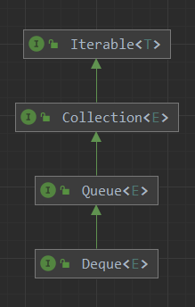
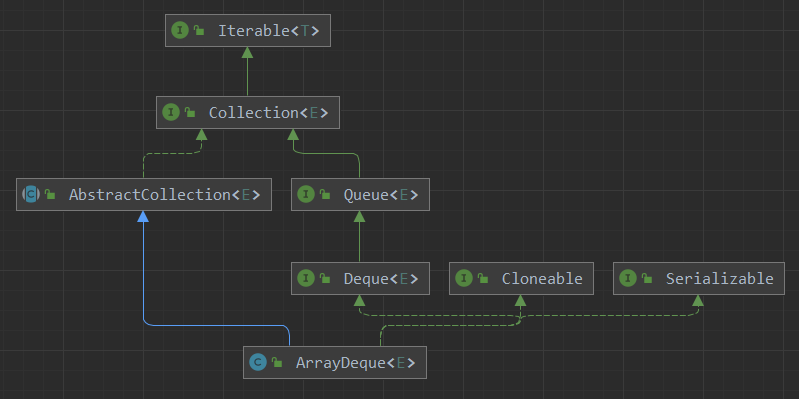
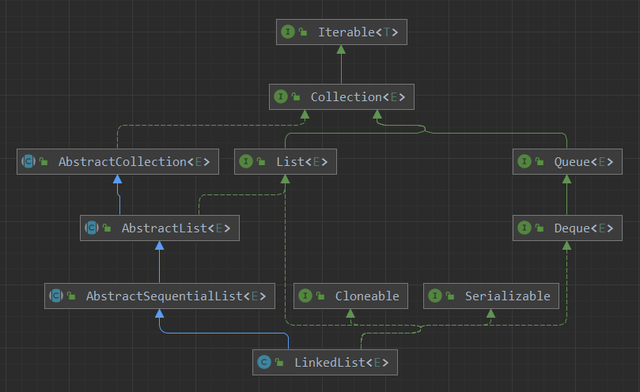
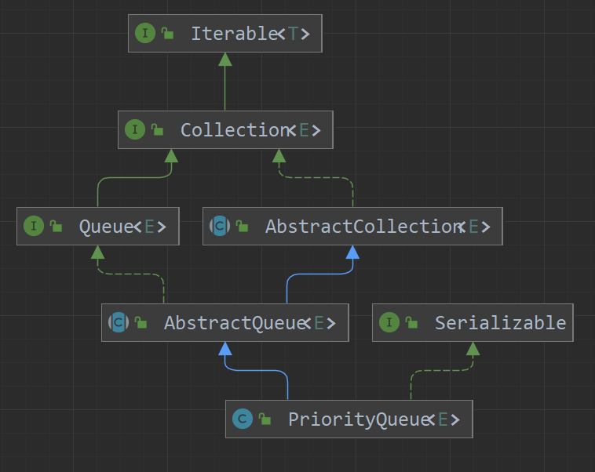
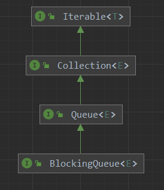
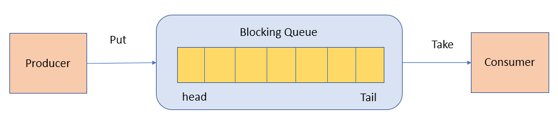

# Queue and Deque
参考：
https://www.cnblogs.com/JavaBuild/p/18024403
https://blog.csdn.net/xiaoxiao_guai/article/details/139932677
https://segmentfault.com/a/1190000016524796


Queue接口作为队列数据结构，java在实现的时候，直接定义了Deque接口（双端队列）来继承Queue接口，并且只实现Deque接口。这样java中的双端队列就囊括了队列、双端队列、堆栈（Deque接口又定义了Stack的操作方法）这3种角色的功能。

所以我们在使用的时候直接使用的是Deque接口的实现类，当然Deque接口继承自Queue接口。



## Queue接口

Queue 是单端队列，只能从一端插入元素，另一端删除元素，实现上一般遵循 先进先出（FIFO） 规则。

除了基本的 Collection 操作外，队列还提供其他的插入、提取和检查操作。每个方法都存在两种形式：一种抛出异常（操作失败时），另一种返回一个特殊值（ null 或 false ，具体取决于操作）。插入操作的后一种形式是用于专门为有容量限制的 Queue 实现设计的；在大多数实现中，插入操作不会失败。


| Queue 接口   | 抛出异常  | 返回特殊值 |
| ------------ | --------- | ---------- |
| 插入队尾     | add(E e)  | offer(E e) |
| 删除队首     | remove()  | poll()     |
| 查询队首元素 | element() | peek()     |


## Deque接口

Deque 是双端队列，在队列的两端均可以插入或删除元素。Deque接口所能代表的数据结构：队列，双端队列，堆栈。

名称 deque 是 “double ended queue （双端队列） ” 的缩写，通常读为 “deck” 。大多数 Deque 实现对于它们能够包含的元素数没有固定限制，但此接口既支持有容量限制的双端队列，也支持没有固定大小限制的双端队列此接口定义在双端队列两端访问元素的方法。提供插入、移除和检查元素的方法。

每种方法都存在两种形式：一种形式在操作失败时抛出异常，另一种形式返回一个特殊值（ null 或 false ，具体取决于操作）。插入操作的后一种形式是专为使用有容量限制的 Deque 实现设 计的；在大多数实现中，插入操作不能失败。


| Deque 接口   | 抛出异常      | 返回特殊值      |
| ------------ | ------------- | --------------- |
| 插入队首     | addFirst(E e) | offerFirst(E e) |
| 插入队尾     | addLast(E e)  | offerLast(E e)  |
| 删除队首     | removeFirst() | pollFirst()     |
| 删除队尾     | removeLast()  | pollLast()      |
| 查询队首元素 | getFirst()    | peekFirst()     |
| 查询队尾元素 | getLast()     | peekLast()      |


Deque接口扩展(继承)了 Queue 接口。在将双端队列用作队列时，将得到 FIFO（先进先出）行为。将元素添加到双端队列的末尾，从双端队列的开头移除元素。从 Queue 接口继承的方法完全等效于 Deque 方法，如下表所示：

| Queue方法 | 等效Deque方法 |
| --------- | ------------- |
| add(e)    | addLast(e)    |
| offer(e)  | offerLast(e)  |
| remove()  | removeFirst() |
| poll()    | pollFirst()   |
| element() | getFirst()    |
| peek()    | peekFirst()   |

双端队列也可用作 LIFO（后进先出）堆栈。应优先使用此接口而不是遗留 Stack 类。在将双端队列用作堆栈时，元素被推入双端队列的开头并从双端队列开头弹出。堆栈方法完全等效于 Deque 方法，如下表所示：


| 堆栈方法 | 等效Deque方法 |
| -------- | ------------- |
| push(e)  | addFirst(e)   |
| pop()    | removeFirst() |
| peek()   | peekFirst()   |

### ArrayDeque



内部使用Object[] elements数组来实现。拥有head/tail这2个头尾指针。最小初始化容量8。它还是一个循环队列。
```java
public class ArrayDeque<E> extends AbstractCollection<E>
                           implements Deque<E>, Cloneable, Serializable
{
    /**
     * The array in which the elements of the deque are stored.
     * All array cells not holding deque elements are always null.
     * The array always has at least one null slot (at tail).
     */
    transient Object[] elements;

    /**
     * The index of the element at the head of the deque (which is the
     * element that would be removed by remove() or pop()); or an
     * arbitrary number 0 <= head < elements.length equal to tail if
     * the deque is empty.
     */
    transient int head;

    /**
     * The index at which the next element would be added to the tail
     * of the deque (via addLast(E), add(E), or push(E));
     * elements[tail] is always null.
     */
    transient int tail;

    private static final int MAX_ARRAY_SIZE = Integer.MAX_VALUE - 8;
    
}
```

它作为堆栈、队列、双端队列的操作和LinkedList的操作是一致的，只是内部的实现不同。当然，它们也有区别。

ArrayDeque实现了双端队列，内部使用循环数组实现，这决定了它有如下特点：

* 在两端添加、删除元素的效率很高，动态扩展需要的内存分配以及数组拷贝开销可以被平摊，具体来说，添加N个元素的效率为O(N)。  
* 根据元素内容查找和删除的效率比较低，为O(N)。  
* 与ArrayList和LinkedList不同，没有索引位置的概念，不能根据索引位置进行操作（无法随机访问，这也符合队列的性质）。  

### LinkedList



从队列和双端队列的角度来看，LinkedList和ArrayDeque的方法声明都是一致的。只不过LinkedList较之于ArrayDeque多实现了List接口，还具有有序集合List的特性。


### ArrayDeque和LinkedList的比较

ArrayDeque和LinkedList都实现了Deque接口，应该用哪一个呢？**如果只需要Deque接口，从两端进行操作，一般而言，ArrayDeque效率更高一些，应该被优先使用**。不过，如果同时需要根据索引位置进行操作，或者经常需要在中间进行插入和删除，则应该选LinkedList（**注意，这里使用的是List特性，而不是Deque特性了**）。

### PriorityQueue

有一个直接实现了Queue接口的类，但是它**并不是真正意义上的队列**，而是一个**优先队列**！



PriorityQueue保存元素的顺序并不是按照加入的顺序，而是根据元素的大小（实现Comparable接口或提供Comparator类）来决定元素在Queue队列中的顺序。

元素出队顺序是与优先级相关，利用二叉堆的数据结构来实现的，底层使用可变长的数组来存储数据，默认是小顶堆，但可以接收一个 Comparator 作为构造参数，从而来自定义元素优先级的先后。

### BlockingQueue



BlockingQueue （阻塞队列）是一个接口，继承自 Queue。BlockingQueue阻塞的原因是其支持当队列没有元素时一直阻塞，直到有元素；还支持如果队列已满，一直等到队列可以放入新元素时再放入。

BlockingQueue的插入/移除/检查这些方法，对于不能立即满足但可能在将来某一时刻可以满足的操作，共有4种不同的处理方式：第一种是抛出一个异常，第二种是返回一个特殊值（null 或false，具体取决于操作），第三种是在操作可以成功前，无限期地阻塞当前线程，第四种是在放弃前只在给定的最大时间限制内阻塞。如下表格：

| 操作 | 抛出异常  | 特殊值   | 阻塞   | 超时                 |
| ---- | --------- | -------- | ------ | -------------------- |
| 插入 | add(e)    | offer(e) | put(e) | offer(e, time, unit) |
| 移除 | remove()  | poll()   | take() | poll(time, unit)     |
| 检查 | element() | peek()   | 不可用 | 不可用               |

注意**element、peek和poll、remove、take的区别**，element、peek不会删除元素。

**插入方法**：

* offer(e)：将指定元素添加到Queue中，如果可以容纳，返回true，否则返回false    
* add(e)：将指定元素添加到Queue中，如果可以容纳，返回true，否则抛出异常    
* put(e)：put操作 和offer操作基本一致，只不过在Queue满时进行等待，直到Queue有可用的空间    
* offer(e, time, unit)：将指定元素添加到Queue中，在到达指定的等待时间前等待可用的空间（如果有必要），超时还没空间返回false   

**移除方法**：

* poll()：获取并移除Queue的头，如果此队列为空，则返回 null。    
* remove()：取出Queue中首位元素，若为空则抛出异常    
* take()：取出Queue中首位元素，若为空则阻塞，直到有新对象被加入    
* poll(time, unit)：获取并移除此队列的头部，在指定的等待时间前等待可用的元素（如果有必要）。  

**检查方法**：

* element()：返回队列头部元素，如果队列为空，则抛出异常    
* peek()：返回队列头部元素，如果队列为空，则返回null  


应用场景：

生产者-消费者模型中，生产者线程会向队列中添加数据，而消费者线程会从队列中取出数据进行处理。




