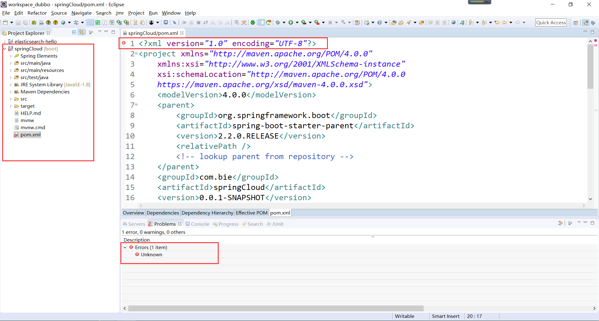
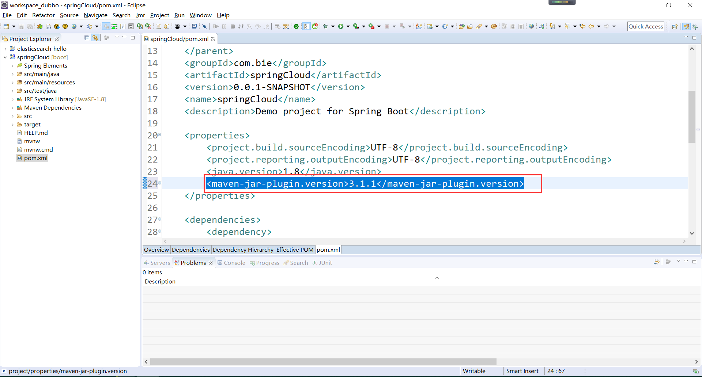
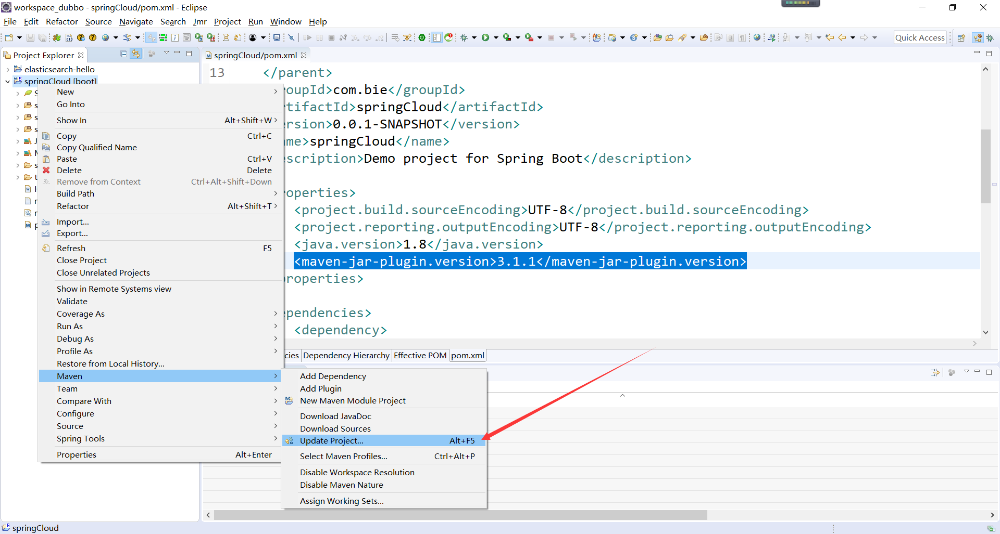

## Eclipse导入SpringBoot项目pom.xml第一行报错Unknown error
`https://www.cnblogs.com/biehongli/p/11748093.html`

网上搜的都说是将SpringBoot2.1.5版本降级到SpringBoot2.1.4版本，感觉这治标不治本啊，以后想升级不是玩完了。

错误如下所示：


参考：https://ask.csdn.net/questions/764470?sort=id

解决这个问题只需要，在pom.xml 文件中的 properties 加入maven jar 插件的版本号。

错误原因呢，报错是因为版本不兼容问题，将Maven的版本降到3.1.1就可以了，在pom的properties中添加
```
<maven-jar-plugin.version>3.1.1</maven-jar-plugin.version>
```

修改如下所示：


修改完毕以后，需要更新一下你的项目。

