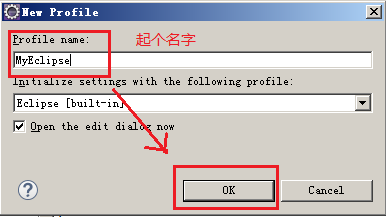

## 设置超级自动提示
### 一、设置超级自动提示
设置eclipse/myEclipse代码提示可以方便开发者，不用在记住拉杂的单词，只用打出首字母，就会出现提示菜单。如同dreamweaver一样方便。

1.菜单window->Preferences->Java->Editor->Content Assist-右边-auto-activaction栏下-Enable auto activation 选项要打上勾

2.Auto Activation triggers for java 后面 直接写入（新版eclipse可以直接写入长字符）“.abcdefghijklmnopqrstuvwxyzABCDEFGHIJKLMNOPQRSTUVWXYZ,([{”

3.设置反映时间，Auto activation delay 默认为200，一般设置为20~50 4.*此时设置完还没有达到超级提示，软件对类和接口还有很好的提示。

4.继续设置window->Preferences->Java->Editor->Content Assist展开->Advanced   上面的选项卡Select the proposal kinds contained in the 'default' content assist list: 中把7个选项全部勾上！此时设置结束，无论是语句，类，接口，关键字，还是方法，都能自动提示。

### 二.取消Myeclipse代码提示时按空格或“=”自动补全第一个提示词的功能
按照如上设置后会出现问题:比如我想输入Conn按空格后会按提示的第一个Connection。此时操作"空格键"还有"等号键"都会默认选中提示项的第一项.

方案一:每次出现你不想要填充的提示词时，可以按一下Esc，即可以取消提示词，之后再按空格或者“=”不会自动补全。

方案二:根据自己输入代码的速度,合理调整反映时间，Auto activation delay的值,可以避免上述情况.


## Eclipse设置代码大括号的格式
编写代码有很多中风格，常见的三种风格：

1、K & R风格：这种风格的代码比较紧凑，优点是在教科书或者打印成纸张的时候比较省地方；缺点是大括号匹配问题，代码量大的话，不好找到上一个括号位置，只能通过后期注释标记
```java
public class Test {
    public static void main(String args[])
    
    }
}
```

2、标准风格（BSD风格）：这种风格显示代码比较松散，优点是层次分明，写出的代码简单易读；缺点是：浪费空间，尤其是打印代码的时候
```java
public class Test
{
    public static void main(String args[])
    {
    
    }
}
```

3、GNU风格：这种风格起源于GNU，所有GNU软件基金会都采用了这个风格，优缺点与BSD风格相同，特点是括号前后各空两格。
```java
public class Test
  {
    public static void main(String args[])
      {
    
      }
  }
```

我个人更喜欢标准的BSD风格，因为这样写出的代码层次分明，简洁易读，Eclipse可以自定义代码风格，设置方法如下：

1、打开eclipse，window菜单，Preferences选项；


2、找到位于Java-->Code Style-->Formatter（Java-->代码样式-->格式）设置，New 一个格式。Eclipse默认的格式即使你Edit更改，也是不允许的。


3、因此我们要新建一个自己的格式。由上上个图可以看到我已经起了名MyBracesOption（因为我只更改了大括号的格式，所以起了这个名字）。这里为了演示，我重新新建了一个格式，重新起名MyEclipse；



4、Braces就是更改大括号的格式，下面一堆下拉菜单是代码不同位置的大括号格式，可以自己尝试。如果你和我一样喜欢标准样式，那么推荐你除了倒数第二个Array initializer选：Same line外，其余全部选择：Next line。这样之后，一直OK，设置就完成了。到编辑代码的时候可以看到格式已经改变。


## Eclipse配置错误 —— Syntax error, annotations are only available if source level is 1.5 or greater
### 一、问题描述
今天在写一个测试Demo，然后使用注解功能时报这个错误：Syntax error, annotations are only available if source level is 1.5 or greater ，提示我annotation是jdk1.5以上的版本才有的功能，如下图：


而我的jdk配置的是1.8的，按道理不会出现这样的问题，经过检查项目的配置发现了问题所在
 
### 二、问题原因
编译器遵循的编译等级过低，在项目创建时使用了默认的配置文件，没有按照配置的jdk版本进行更新
下面是配置文件的配置信息：


### 三、解决方法
1、点击项目使用快捷键alt+enter 或者右键项目选择最下面的properties 进入到项目配置页面


2、修改编译器的编译等级


3、改变配置


4、查看配置文件修改成功


ok,问题解决


