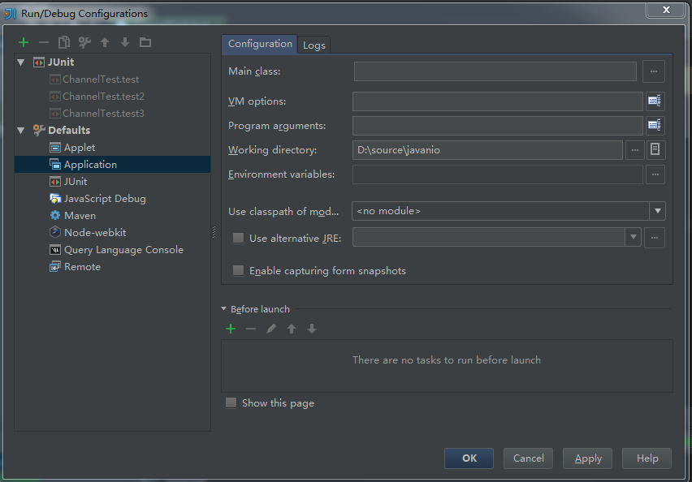

# IDEA自动编译不用每次make
`https://my.oschina.net/1987times/blog/330207`

最近使用IDEA来开发JAVA应用，对IDEA的界面很有爱，但是缺受不了它的运行速度。每次运行都要编译，所以就有了这边文章

总感觉IDEA的编译速度比eclipse慢，eclipse每次保存都自动编译，而且运行的时候如果代码没有改变根本不会重新编译，但是IDEA这方便却不是，每次都要编译。通过google和自己的测试解决了这个问题。

1：开启自动测试
File->setting->compiler

勾选上上面的，

2修改run/debug配置
Run->Edit Configurations

看图 在Before Launch下面的make去掉了。到了这里还要做一件事情，执行File->Invalidate Caches /Restart

到这里IDEA配置好了

