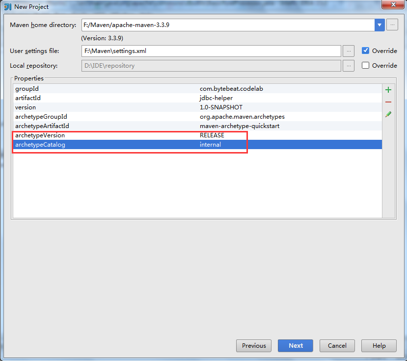
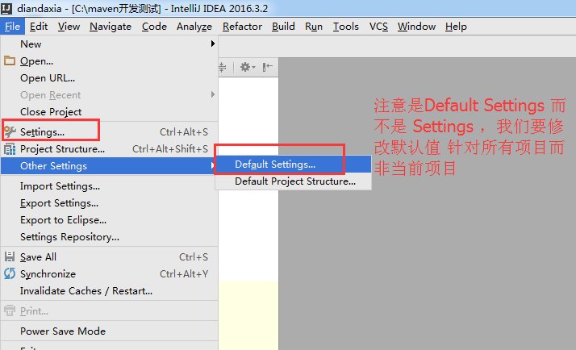
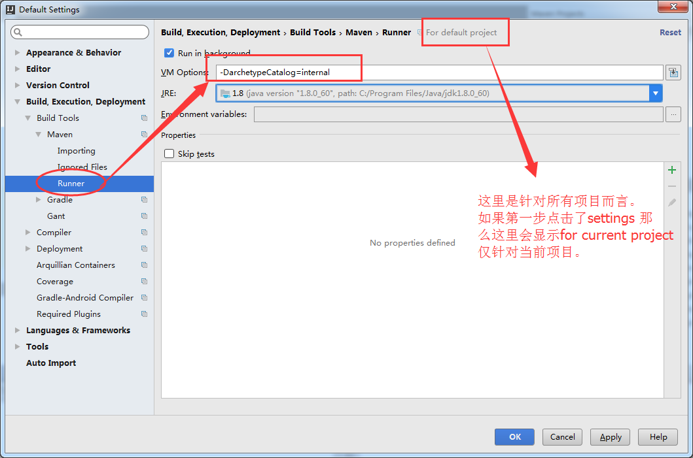
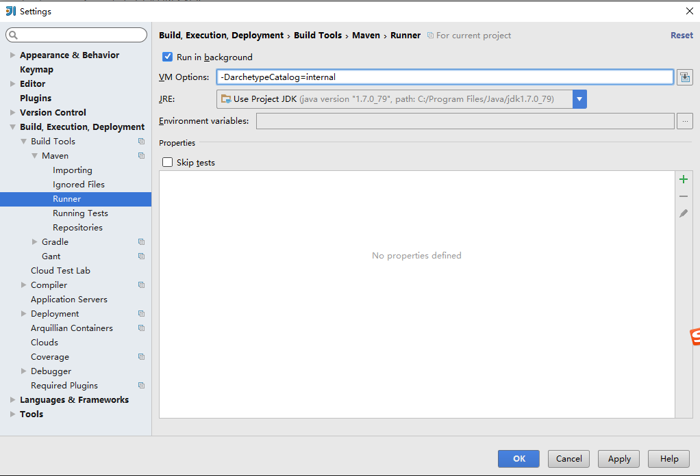
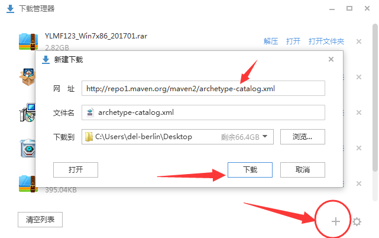
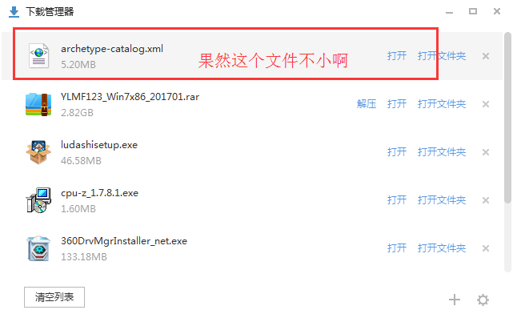
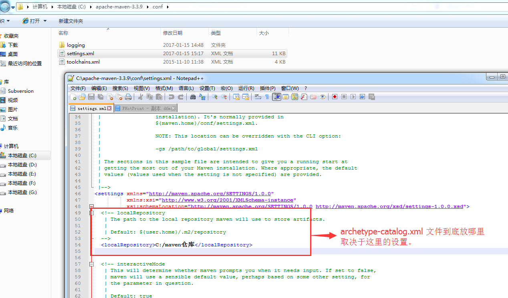
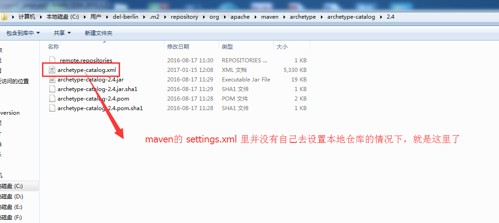
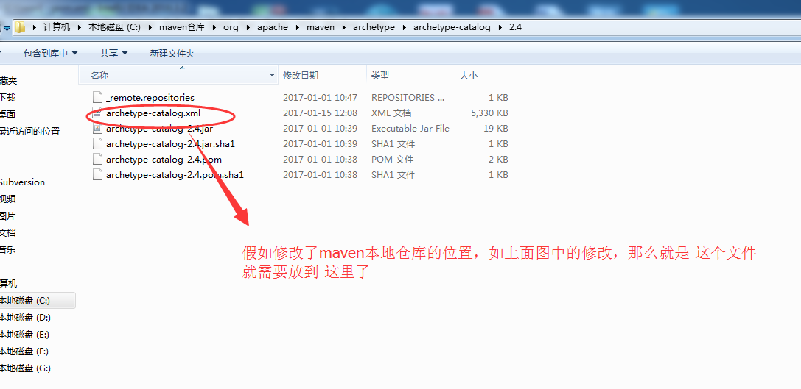
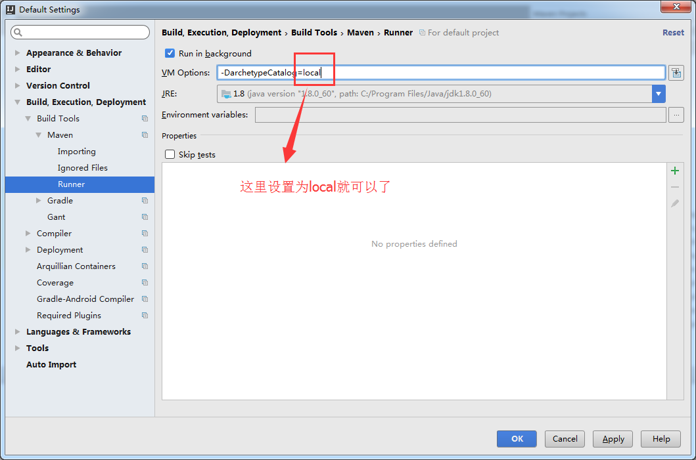

## IntelliJ IDEA解决创建maven web项目慢的问题
原因

IDEA根据maven archetype的本质，其实是执行mvn archetype:generate命令，该命令执行时，需要指定一个archetype-catalog.xml文件。

该命令的参数-DarchetypeCatalog，可选值为：remote，internal  ，local等，用来指定archetype-catalog.xml文件从哪里获取。

默认为remote，即从 http://repo1.maven.org/maven2/archetype-catalog.xml路径下载archetype-catalog.xml文件。

http://repo1.maven.org/maven2/archetype-catalog.xml 文件约为3-4M，下载速度很慢，导致创建过程卡住。

```
internal——内置的，即maven-archetype-plugin内置的archetypeCatalog文件
local——本地的，即本地~/.m2/下的archetypeCatalog文件
remote——远程的，即Maven中央仓库的archetypeCatalog文件
```

### 方法一
在创建Maven项目时加上 archetypeCatalog=internal 参数，如下： 


### 方法二
在maven的VM Options加上-DarchetypeCatalog=internal参数，如下： 




### 方法三: 用local （推荐这种方法 完美）
1.由于默认情况下，根据archetype创建maven项目会从网络下载catalog文件，导致创建maven项目缓慢
```
Searching for remote catalog: http://repo1.maven.org/maven2/archetype-catalog.xml
```
2.解决办法可以设置使用本地catalog文件，在IDEA中设置archetype的使用方式为local;
```
-DarchetypeCatalog=local
```
直接先把 文件用搜狗浏览器或其它下载工具下载下来。



下载后放到哪里呢，这里与本地仓库的位置有关，假如本地仓库是maven默认的，并没有修改 那么就需要放到 `C:\Users\del-berlin\.m2\repository\org\apache\maven\archetype\archetype-catalog\2.4\`下  ，本地仓库的默认位置：Default: `${user.home}/.m2/repository`






