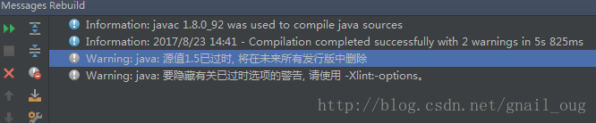
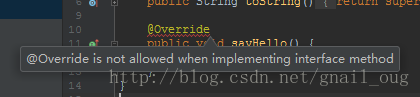
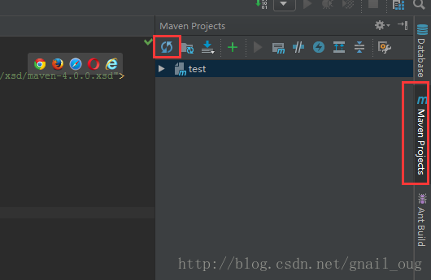
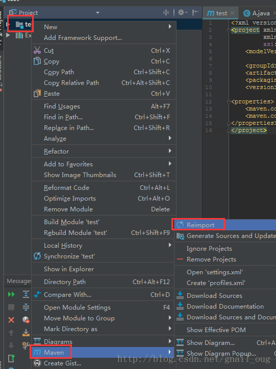
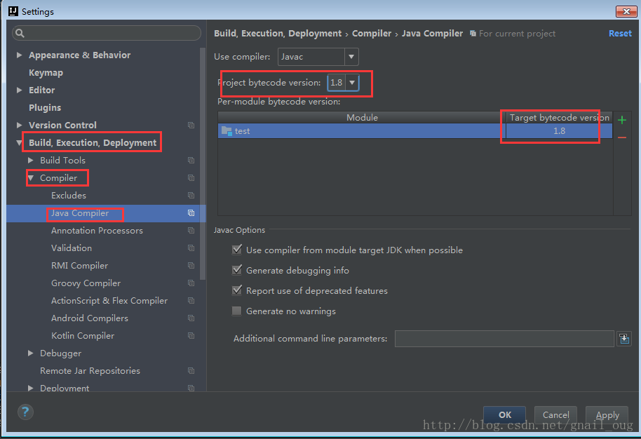
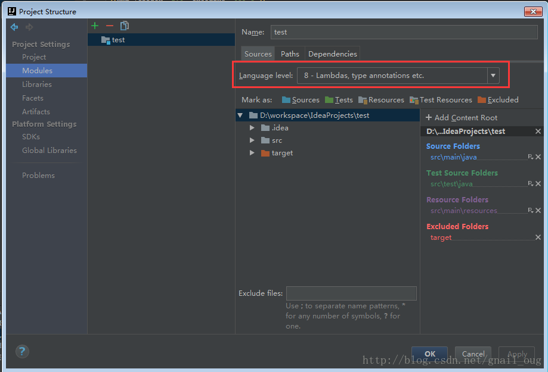
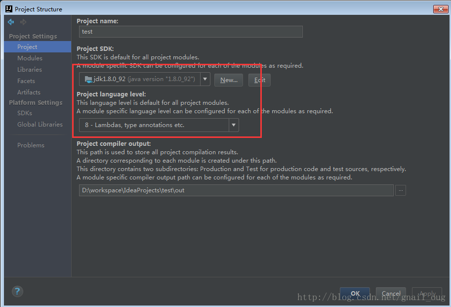

## IDEA里Maven默认情况下编译版本为JDK1.5
### 问题描述
IntelliJ IDEA里面Maven插件，如果pom.xml里面没有设置编译版本，便采用默认的1.5版本，即便安装的JDK是jdk1.7、jdk1.8也是采用1.5版本进行编译。 
这样，编译时idea就会报如下警告：
 
Warning:java: source value 1.5 is obsolete and will be removed in a future release 

或 

Warning:java: 源值1.5已过时, 将在未来所有发行版中删除 

如下图： 


如果源代码里有接口的实现类且实现的方法上面有@Override注解时，就会直接提示以下错误：
 
@Override is not allowed when implementing interface method 

如下图： 


### 解决方法
#### 在Maven里指定编译版本
由于是Maven没指定编译版本引起的，所以先在pom.xml指定编译版本，添加如下内容指定编译版本(一般情况下版本和所用jdk版本保持一致，如我这里是1.8)：
```xml
<build>
    <plugins>
        <plugin>
            <groupId>org.apache.maven.plugins</groupId>
            <artifactId>maven-compiler-plugin</artifactId>
            <version>3.1</version>
            <configuration>
                <source>1.8</source>
                <target>1.8</target>
            </configuration>
        </plugin>
    </plugins>
</build>
```
或者
```xml
<properties>
    <maven.compiler.source>1.8</maven.compiler.source>
    <maven.compiler.target>1.8</maven.compiler.target>
</properties>
```

#### 使Maven指定的编译版本生效
一般情况下，在pom.xml指定版本之后，Maven会自动更改之前设置编译版本。如果不自动更改，可通过重新导入Maven或者手动修改设置编译版本的地方。

重新导入Maven的方法

通过idea右侧的Maven projects，然后点击工具条上的Reimport All Maven Projects按钮，如下图 

或者在项目或pom.xml文件上右键，点击Maven–>reimport，如下图 


#### idea设置
1、点击File–>settings或者快捷键Ctrl+Alt+S打开settings设置面板，搜索java compiler或者依次点击Build…–>Compiler–>java compiler，把右侧里面的target bytecode version改为你需要的版本 

一般情况下，上面project bytecode version不对的话我也会顺便改掉。

2、点击File–>project structure或者Ctrl+Alt+Shift+S打开project structure面板，点击modules，将右侧的language level也设置为同样的版本。如下图： 


我也会顺便看一下project里的版本是否正确，不正确顺便改掉，如： 


###  防止idea每次都默认以1.5版本编译的maven设置
常常在maven项目中，每次reimport后，Target bytecode version都会恢复到1.5版本编译，以致每次都要通过---》Compiler----->选择Target bytecode version版本，

在项目中添加如下配置即可：
```xml
<properties>
    <project.build.sourceEncoding>UTF-8</project.build.sourceEncoding>
    <project.reporting.outputEncoding>UTF-8</project.reporting.outputEncoding>
    <java.version>1.7</java.version>
    <cdh.version>cdh5.5.2</cdh.version>
    <!--add  maven release-->
    <maven.compiler.source>1.7</maven.compiler.source>
    <maven.compiler.target>1.7</maven.compiler.target>
    <encoding>UTF-8</encoding>
    <scala.tools.version>2.10</scala.tools.version>
    <scala.version>2.10.4</scala.version>
</properties>
```

