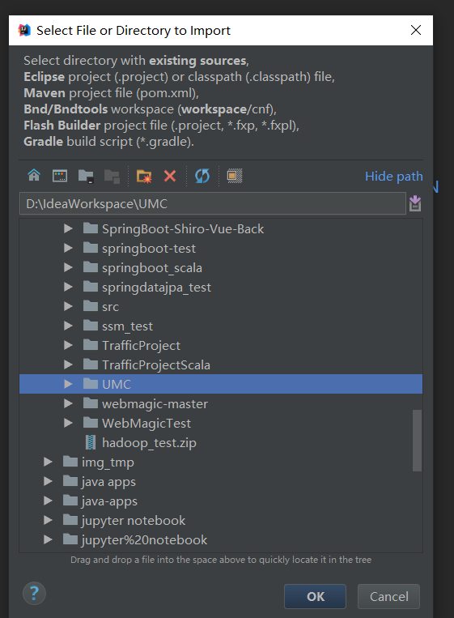
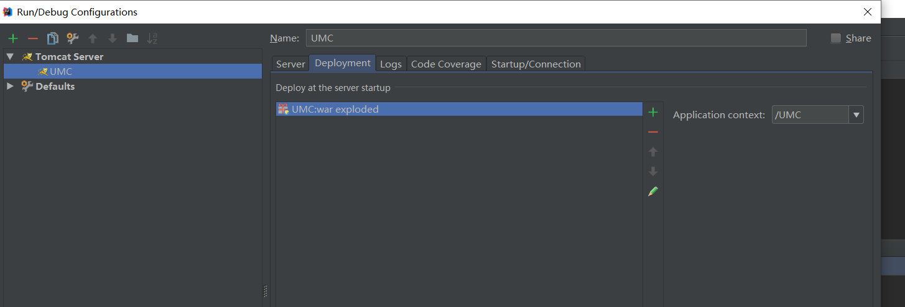

# 向idea中导入myeclipse中的web项目

## 导入

在Modules项的Sources标签页中配置项目结构：

在path中配置编译后文件输出路径，选择“Use module compile out path” -> 将Outputpath 和Test output path 都设置为classes文件夹：

编译快点：

->Artifacts->+号->WebApplication:Exploded->From Modules..

选择自己的项目

使用默认设置即可->Apply->ok

## 配置Tomcat容器
在菜单栏中Run -> Edit Configurations...

->+号->Tomcat Server->选择Local

在“Server”面板中，不勾选“After Launch”，设置“HTTP port”和“JMX port”（默认值即可），点击Apply -> OK，（左边列表中tomcat图标上小红叉是未部署项目的提示，部署项目后就会消失）。

## 需要运行

修改了再重新编译

