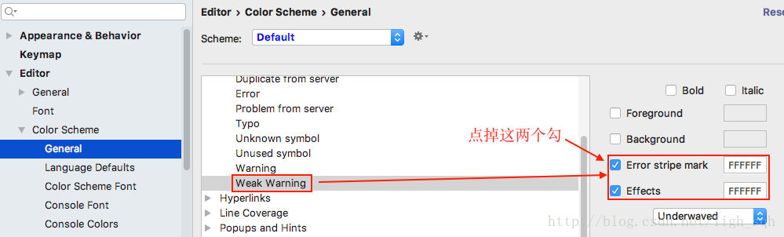
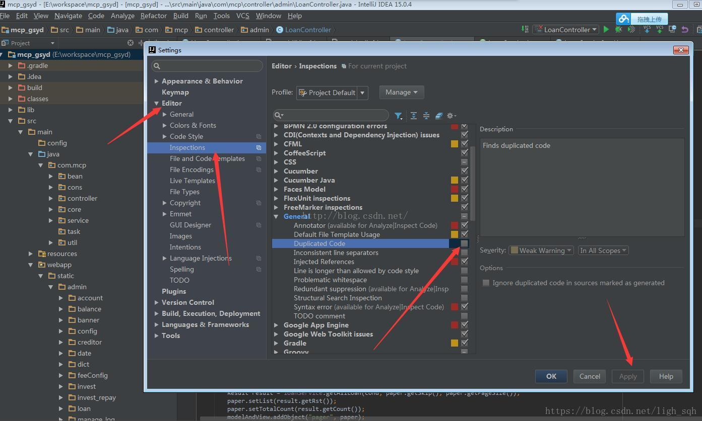

## 怎么去除idea中代码的波浪线(黄色警告线)
1.windows中安装的idea中找到Preferences然后执行以下操作: 

2.mac系统下的idea:为了减少一定量的重复代码，提醒开发人员注意，但是如果有时几行代码的重复没必要扔到一个统一的地方处理，这是总是提醒，干扰视线。这里根据个人习惯，还是关闭这个功能比较好。

在 setting 里面 搜索 inspections _ General _ Duplicated Code 取消勾选.提交之后就可以了.

