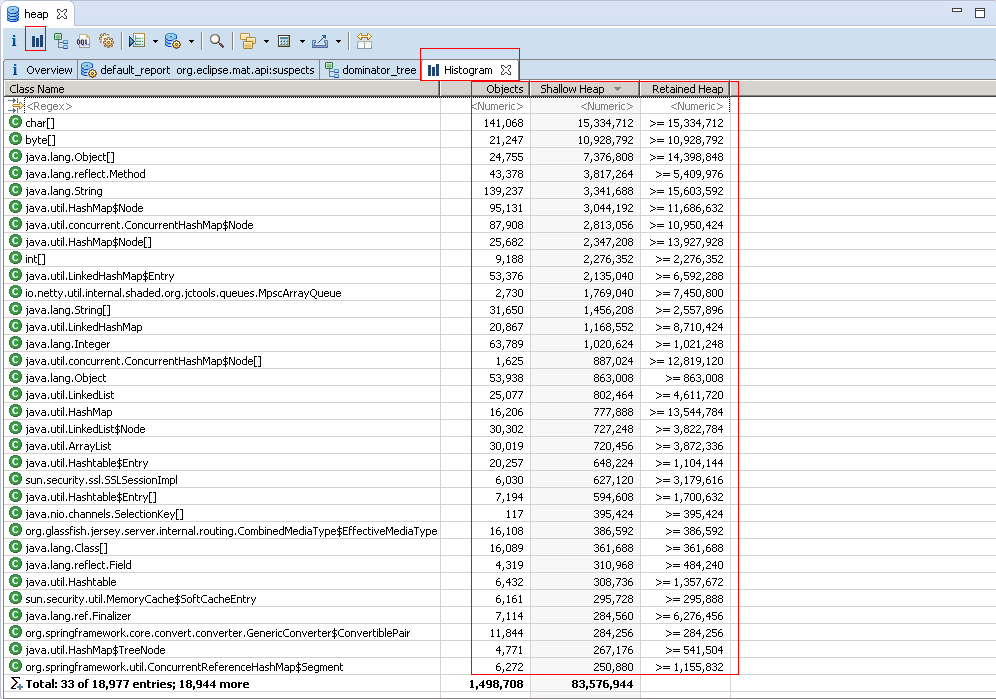
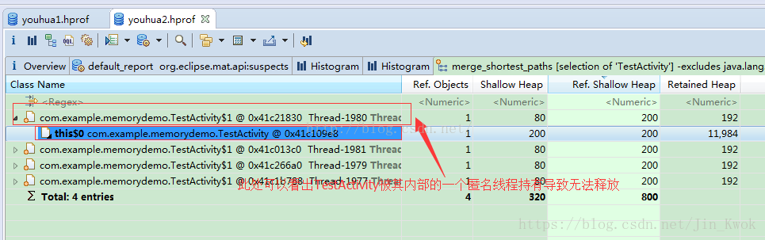

## jmap命令
jmap(Java Memory Map)命令可以获得运行中的jvm的堆的快照，从而可以离线分析堆，以检查内存泄漏与内存溢出(OutOfMemory，OOM)，检查一些严重影响性能的大对象的创建，检查系统中什么对象最多，各种对象所占内存的大小。

### 命令语法
```
jmap [option] <pid>
```
其中pid可以通过jps命令获取，option可选项如下： 

* -heap：打印jvm 内存整体使用情况    
* -histo[:live]：打印jvm heap的直方图。其输出信息包括类名，对象数量，对象占用大小。    
* **-dump**:<dump-options>：dump java内存到二进制文件中。    
dump-options:    
  * live       是否只dump当前存活的对象，如果不指定，将会dump所有的对象，包括待回收的对象。    
  * format=b    文件的格式    
  * file=<file>  指定文件的输出位置    
* -permstat：打印permanent generation heap情况    

上述命令中的-histo和-dumo都包含一个live选项，如果指定live，在统计前会进行full gc，因此不加live的堆大小要大于加live堆的大小。

在此大家需要注意，jmap工具有一部分命令仅限于Linux和Solaris平台，而Windows平台下能够使用的命令只有“`jmap -histo<pid>`”和“`jmap -dump:<dump-options><pid>`”。不过一般来说，使用命令“`jmap -dump:<dump-options><pid>`”生成dump文件应该是最常用的命令之一，由于生成dump文件时比较耗时的，因此大家需要耐心等待，尤其是大内存镜像生成dump文件则需要耗费更长的时间来完成。

**最常用的命令，导出内存dump文件到磁盘**：
```
jmap -dump:format=b,file=<dumpfile.hprof> <pid> 
```

### jmap命令使用示例
jmap -heap ： 打印Java内存使用统计信息

```
C:\Users\Administrator>jmap -heap 7364
Attaching to process ID 7364, please wait...
Debugger attached successfully.
Server compiler detected.
JVM version is 25.77-b03

using parallel threads in the new generation.
using thread-local object allocation.
Concurrent Mark-Sweep GC

Heap Configuration:
   MinHeapFreeRatio         = 40
   MaxHeapFreeRatio         = 70
   MaxHeapSize              = 4294967296 (4096.0MB
   NewSize                  = 1073741824 (1024.0MB
   MaxNewSize               = 1073741824 (1024.0MB
   OldSize                  = 1073741824 (1024.0MB
   NewRatio                 = 2
   SurvivorRatio            = 8
   MetaspaceSize            = 21807104 (20.796875M
   CompressedClassSpaceSize = 1073741824 (1024.0MB
   MaxMetaspaceSize         = 2147483648 (2048.0MB
   G1HeapRegionSize         = 0 (0.0MB)

Heap Usage:
New Generation (Eden + 1 Survivor Space): //---------------新生代
   capacity = 966393856 (921.625MB)
   used     = 360977320 (344.25479888916016MB)
   free     = 605416536 (577.3702011108398MB)
   37.35302307219966% used
Eden Space: //-----------------伊甸区
   capacity = 859045888 (819.25MB)
   used     = 360977320 (344.25479888916016MB)
   free     = 498068568 (474.99520111083984MB)
   42.02072613843883% used
From Space: //----------------第一幸存区
   capacity = 107347968 (102.375MB)
   used     = 0 (0.0MB)
   free     = 107347968 (102.375MB)
   0.0% used
To Space: //-----------------第二幸存区
   capacity = 107347968 (102.375MB)
   used     = 0 (0.0MB)
   free     = 107347968 (102.375MB)
   0.0% used
concurrent mark-sweep generation:
   capacity = 1073741824 (1024.0MB)
   used     = 590955568 (563.5791473388672MB)
   free     = 482786256 (460.4208526611328MB)
   55.03702610731125% used

156040 interned Strings occupying 14738896 bytes.
```

<span style="color:#CC6666;font-weight:bold"> jmap -dump ： dump内存信息到磁盘 </span>

```
jmap -dump:live,format=b,file=c:\users\Administrator\Desktop\test.hprof 7364
```
注意：导出来的文件可以使用Jprofiler或者MAT(Memory Analyzer Tool)进行分析了

## MAT(Memory Analyzer Tool)
MAT(Memory Analyzer Tool)工具是eclipse的一个插件(MAT也可以单独使用)，使用起来非常方便，尤其是在分析大内存的dump文件时，可以非常直观的看到各个对象在堆空间中所占用的内存大小、类实例数量、对象引用关系、利用OQL对象查询，以及可以很方便的找出对象GC Roots的相关信息，当然最吸引人的还是能够快速为开发人员生成内存泄露报表，方便定位问题和分析问题。

在工作中可能会遇到内存溢出这种灾难性的问题，那么程序肯定是存在问题，找出问题至关重要，上面讲了jmap命令的使用方法，当然用jmap导出的文件我们也看不懂啊，那就交给memory analyzer(mat)这个工具，让他帮助我们来观察程序的内存分布情况吧。

造成OutOfMemoryError原因一般有2种：

* 1、内存泄露，对象已经死了，无法通过垃圾收集器进行自动回收，通过找出泄露的代码位置和原因，才好确定解决方案；    
* 2、内存溢出，内存中的对象都还必须存活着，这说明Java堆分配空间不足，检查堆设置大小（-Xmx与-Xms），检查代码是否存在对象生命周期太长、持有状态时间过长的情况。

### 安装MAT
MAT是有两种安装方式的，这一点与其他eclipse插件略有不同。

一种安装方式是将MAT当做eclipse的插件进行安装：启动Eclipse --> Help --> Eclipse Marketplace，然后搜索Memory Analyzer，安装，重启eclipse即可。

另外一种安装方式是将MAT作为一个独立的软件进行安装：去官网http://www.eclipse.org/mat/downloads.php，根据操作系统版本下载最新的MAT。下载完成后，直接解压，运行其中的MemoryAnalyzer.exe文件即可启动MAT工具，只要确保机器上装有JDK并配置好相关的环境变量，MAT可正常启动。

#### 修改MAT jvm 内存配置
MAT 软件版本解压后目录内有个MemoryAnalyzer.ini文件，该文件里面有个Xmx参数，该参数表示最大内存占用量，默认为1024m，根据堆转储文件大小修改该参数即可。

1.MemoryAnalyzer.ini中的参数一般默认为-vmargs– Xmx1024m，这就够用了。假如你机器的内存不大，改大该参数的值，会导致MemoryAnalyzer启动时，报错:Failed to create the Java Virtual Machine。

2.当你导出的dump文件的大小大于你配置的1024m（说明1中，提到的配置：-vmargs– Xmx1024m），MAT输出分析报告的时候，会报错：An internal error occurred during: "Parsing heap dump from XXX”。适当调大说明1中的参数即可。

### 获取dump文件
获取dump文件有两种方法：

* 其一，通过上面介绍的 jmap工具生成，可以生成任意一个java进程的dump文件；    
* 其二，通过配置JVM参数生成，选项“-XX:+HeapDumpOnOutOfMemoryError ”和-“XX:HeapDumpPath”所代表的含义就是当程序出现OutofMemory时，将会在相应的目录下生成一份dump文件，而如果不指定选项“XX:HeapDumpPath”则在当前目录下生成dump文件。  

#### 用jmap生成堆信息
```
jmap -dump:format=b,file=D:\Java\dump.hprof <pid>  
jmap -dump:live,format=b,file=D:\Java\dump.hprof <pid> 
```

#### 内存溢出时，自动保存dump文件
前面是手工导出内存dump映射文件，如果应用已经在线上运行，为了能获取应用出现内存溢出时获得heap dump文件，以便在之后分析，可以在JVM启动时指定参数：-XX:+HeapDumpOnOutOfMemoryError，JVM会在遇到OutOfMemoryError时保存一个“堆转储快照”，并将其保存在一个文件中。 文件路径通过-XX:HeapDumpPath指定。

##### 案例：
```java
public class OomDemo {
    public static void main(String[] args) {
        Map<String,Long> map=new HashMap<String, Long>();
        for (long i = 0; i < Long.MAX_VALUE; i++) {
            map.put(i+"",i);
        }
    }
}
```
设置虚拟机参数为：`-Xmx40m -XX:+HeapDumpOnOutOfMemoryError -XX:HeapDumpPath=D:\Java\dump.hprof`

执行程序，很快会抛出异常

生成了文件之后，就可以通过MAT打开来进行分析

File->Open Heap Dump->选择文件

弹出如下界面：

选中第一个，点击finish，出现以下界面：


可以看到，提示在主线程(main)的一个本地变量中使用了98.77%的内存，而这个本地变量就是java.util.HashMap$Entry[]。

### 将堆信息导入到mat中
File->Open Heap Dump->选择文件
弹出如下界面：

点击finish

### Overview选项
当成功启动MAT后，通过菜单选项“File->Open heap dump...”打开指定的dump文件后，将会生成Overview选项，如下所示：


在Overview选项中，以饼状图的形式列举出了程序内存消耗的一些基本信息，其中每一种不同颜色的饼块都代表了不同比例的内存消耗情况。

### Histogram选项
Histogram列出了每个类的实例数量，点击Action下的Histogram，得到以下结果：

如果需要查询特性的某个类，我们可以在第一行输入类名或者关键词进行正则匹配查找，如查找“netty”：


### Dominator Tree选项
如果说需要定位内存泄露的代码点，我们可以通过Dominator Tree菜单选项来进行排查。Dominator Tree提供了一个列表。Dominator Tree：对象之间dominator关系树。如果从GC Root到达Y的的所有path都经过X，那么我们称X dominates Y，或者X是Y的Dominator 。Dominator Tree由系统中复杂的对象图计算而来。从MAT的dominator tree中可以看到占用内存最大的对象以及每个对象的dominator，如下所示：


点开“+”符号，可以进一步查看内层应用情况，同时还可以看到对应类对象的属性值，如下所示：


### Path to GC Roots 
查看一个对象到RC Roots的引用链 

通常在排查内存泄漏的时候，我们会选择exclude all phantom/weak/soft etc.references，意思是查看排除虚引用/弱引用/软引用等的引用链，因为被虚引用/弱引用/软引用的对象可以直接被GC给回收，我们要看的就是某个对象否还存在Strong 引用链（在导出HeapDump之前要手动出发GC来保证），如果有，则说明存在内存泄漏，然后再去排查具体引用。 


**其它重要选项：**

1. List objects ：
with incoming references 引用到该对象的对象 
with outcoming references 被该对象引用的对象

2. Show objects by class ： 
incoming references 引用到该对象的对象 
outcoming references 被该对象引用的对象 

### Shallow heap & Retained heap
所有包含Heap Profling功能的工具（MAT, Yourkit, JProfiler, TPTP等）都会使用到两个名词，一个是Shallow Size，另一个是 Retained Size. 
这是两个在平时不太常见的名词，本文会对这两个名词做一个详细的解释。

**Shallow Size**    
对象自身占用的内存大小，不包括它引用的对象。     
针对非数组类型的对象，它的大小就是对象与它所有的成员变量大小的总和。当然这里面还会包括一些java语言特性的数据存储单元。     
针对数组类型的对象，它的大小是数组元素对象的大小总和。     

**Retained Size**     
Retained Size=当前对象大小+当前对象可直接或间接引用到的对象的大小总和。(间接引用的含义：A->B->C, C就是间接引用)     
换句话说，Retained Size就是当前对象被GC后，从Heap上总共能释放掉的内存。     
不过，释放的时候还要排除被GC Roots直接或间接引用的对象。他们暂时不会被被当做Garbage。     

**看图理解Retained Size** 

上图中，GC Roots直接引用了A和B两个对象。 

A对象的Retained Size=A对象的Shallow Size   
B对象的Retained Size=B对象的Shallow Size + C对象的Shallow Size 

这里不包括D对象，因为D对象被GC Roots直接引用。 
如果GC Roots不引用D对象呢？ 

此时, B对象的Retained Size=B对象的Shallow Size + C对象的Shallow Size + D对象的Shallow Size

### 利用Histogram和Dominator Tree分析内存泄露
在分析内存泄露时，必须要掌握粒度，所谓粒度就是你此刻dump的hprof文件究竟是分析谁的泄露，如果你在开始前心中没有个目标，最后取出来的hprof也分析不出什么原因。粒度越小，对你分析问题也就越有利，当你把一个个小粒度问题解决后，整个App的泄露就迎刃而解了。也许这么说，大家心中有点迷糊。下面就举例来说吧：

假如现在有个项目包含Module几十个，每个Module包含的Activity数以百计，现在让你分析它是否内存泄露，如果你只是胡乱抓个hprof根本分析不出什么。假如你就针对某个Activity分析这样问题就简单多了。比如你现在分析ActivityA的内存泄露问题，你可以参考如下步骤：

Step1：进入ActivityA之前，你先dump个hprof文件HprofA；   
Step2：进入ActivityA操作一会，再退出ActivityA后dump个hprof文件HprofB；   
Step3：采用Histogram和Dominator Tree对比分析这两个Hprof文件，即可得出ActivityA是否泄露   

现在以分析TestActivity为例，按上述步骤实战分析，先抓取进入TestActivity前后的hprof文件，按如下步骤对比两个hprof的异同，如下图选择所需比较的hprof

比较两个hprof


正如图所示，易知在执行进出TestActivity后，多出了个TestActivity对象，按理论上来说在进入Activity后会创建个Activity，但是按Back键返回后这个Activity就会被销毁进而从Task栈上被移除，也就是说这个操作前后不应该会多出个Activity，因此可以断定TestActivity存在泄漏。

TestActivity存在泄漏，那我们应该怎么解决呢？因此我们就需要找到为何泄漏，为什么本该销毁的Activity却没有被销毁？如知真相如何，请看下图获取TestActivity的Reference chain


TestActivity的引用关系


从图易知TestActivity没有被释放就是因为GC Root(TestActivity$1)引用着TestActivity，到此原因也一目了然。找到了只是开始，解决才是关键。这时让我们查看下TestActivity代码：
```java
public class TestActivity extends Activity {   
    private static final Object mLock = new Object(); 
    @Override
    protected void onCreate(Bundle savedInstanceState) {        
        super.onCreate(savedInstanceState);
        DebugUtil.StrictModeDebug();
        setContentView(R.layout.test_main);   
        new Thread(){//匿名线程
            public void run() {
                synchronized (mLock) {
                    try {
                        mLock.wait();
                    } catch (InterruptedException e) {
                        // TODO Auto-generated catch block
                        e.printStackTrace();
                    }
                }
            }
        }.start();
    }
}
```
从代码上可以发现TestActivity里存在个匿名线程，且一直处于等待状态，直到退出TestActivity仍未被唤醒，进而导致该线程就一直没有结束，它所持有的TestActivity也就无法被释放了（可能大家听到此处会很疑惑，线程没有结束可以理解，但是它并没有持有TestActivity呀？我只能说是隐含this，如还不明白，请自行参阅java内部类相关内容），如要解决此泄露，只需在Activity的onDestory里将线程唤醒让其可以正常结束就OK了。

**优化建议**    
* 使用线程时，一定要确保线程在周期性对象（如Activity）销毁时能正常结束，如能正常结束，但是Activity销毁后还需执行一段时间，也可能造成泄露，此时可采用WeakReference方法来解决，另外在使用Handler的时候，如存在Delay操作，也可以采用WeakReference；    
* 使用Handler + HandlerThread时，记住在周期性对象销毁时调用looper.quit()方法；    
* 建议少使用匿名类或内部类，可考虑使用嵌套类（带static那种类），减少对周期性对象的隐性持有；   

### 记一次通过Memory Analyzer分析内存溢出的解决过程
摘抄自`https://blog.csdn.net/liu765023051/article/details/75127361`

状况描述：   
最近项目新打的版本，过不了多长时间，项目就会挂掉。状况就是处于一种假死的状态。索引查询都很慢，几乎进行不了任何操作，慢慢卡死。   
然后我们再发版时，只能基于之前打好的war包，替换或者增加class文件。  

情况对比及分析：   
由于之前代码做过一次大整顿，提交的代码比较多，所以通过回滚版本的方式解决，比较困难。一是因为整顿的成果不能白白抹杀；二是那么多文件，靠人工挨个对比查找，比较困难。

项目有问题的版本，Dump下来的日志，然后迅速回滚观察。单台机器的dump日志有5个G：

通过Memory Analyzer分析，在Leak Supects Report 视图中，有如下分析结果：


上图所示，共有三类问题a、b、c；还有一些其他的，类型为d。

先来看第一个问题（后来发现，前几个问题都是同一个问题）


先点开Details看一下：


上图显示了一个很明显的有问题的线程：地址是0x7c8ff3df0 ，名称为pool-16-thread-1。
通过《Accumulated Objects in Dominator Tree》视图可以看出，在该线程中，存在一个大的List对象，List对象内存放了大量的mysql的jdbc对象。

我们想看看JDBC对象里面对方了那些数据。接下来我们打开《open dominator tree for entire heap》这个视图：


找到名为0x7c8ff3df0 pool-16-thread-1的线程。如图也能发现，这个线程占用了大量的空间未释放。一层层打开里面的存放的对象：


这里的数据，是我们的一张用户表的数据。所以这就可以得出结论：一个线程内，一个list内存放了大量从数据库中获取的用户对象！
想到这里，我们又去看了b、c的问题描述，也是同样的问题。估计是在不同时间点，通过gc已经回收了部分。

然后，我刚才看了a问题的details信息，接下来我们看下a的stacktrace 堆栈信息。


如上图，问题就很明显了，在Service的112行中，调用的findByCustomerID方法中，有扫描全表的操作。经过分析，找到对应的位置，对应的代码为：
```java
customerID = StringUtils.isNotBlank(customerID)? customer.getCustomer().getCustomerID():null;
Customer oldCutsomer = customerService.findByCustomerID(customerID);
```
显而易见，流程走到这里时，customerID永远为空，那么customerService.findByCustomerID(customerID)方法，会执行扫描全表操作。由于该表数据量巨大，开发所认为的用户每次执行的索引查询，实际上都成了慢查询，而且需要返回全表数据。大量线程过来，占用大量数据库连接，导致数据库连接数不够；而每个线程处理时，需要大量时间，  导致项目处于一种假死的状态。


