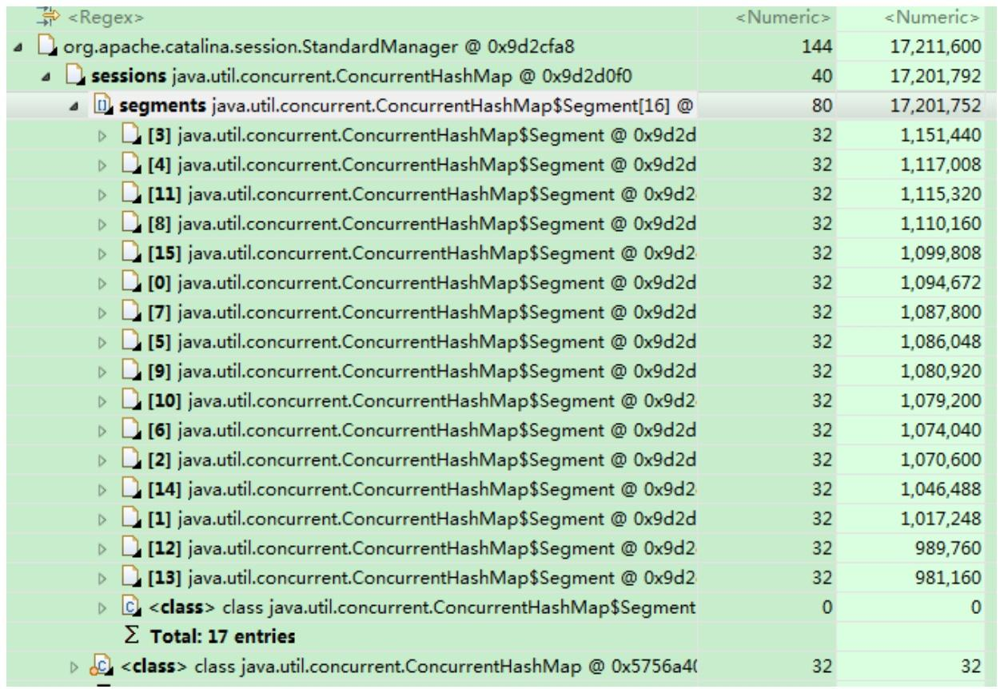
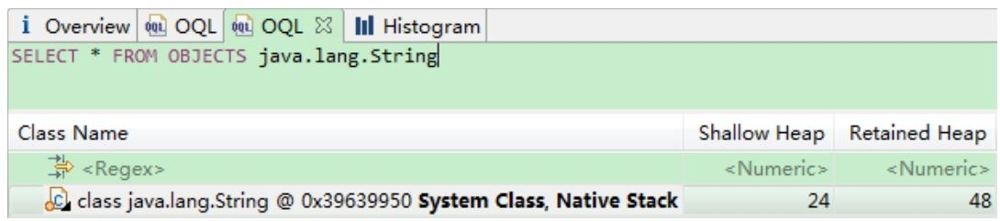
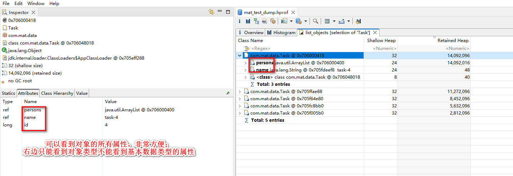
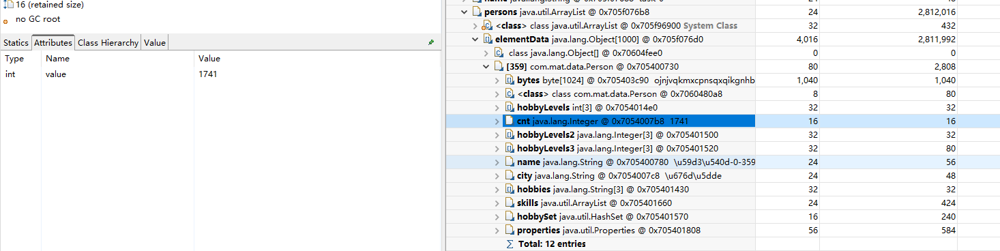
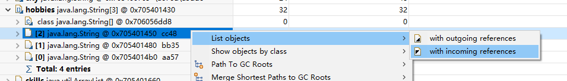

# 摘抄书籍

## 虚拟机也有内窥镜：使用MAT分析Java堆

MAT是Memory Analyzer的简称，它是一款功能强大的Java堆内存分析器。可以用于查找内存泄漏，以及查看内存消耗情况。MAT是基于Eclipse开发的，是一款免费的性能分析工具。读者可以在http://www.eclipse.org/mat/下载并使用MAT。

### 初识MAT

在分析堆快照前，首先需要导出应用程序的堆快照。在本书前文中提到的jmap、JConsole和Visual VM等工具都可用于获得Java应用程序的堆快照文件。MAT本身也具有这个功能。

如图7.4所示，单击“Accquire Heap Dump”菜单后，会弹出当前Java应用程序列表，选择要分析的应用程序即可，如图7.5所示。


图7.4 MAT获取堆快照


图7.5 导出指定程序堆快照

除了直接在MAT中导出正在运行的应用程序堆快照，也可以通过“Open Heap Dump”来打开一个已有的堆快照文件。

注意：**使用MAT既可以打开一个已有的堆快照，也可以通过MAT直接从活动Java程序中导出堆快照**。

如图7.6所示，显示了正常打开堆快照文件后MAT的界面。


图7.6 MAT运行界面

在右侧界面中，显示了堆快照文件的大小、类、实例和ClassLoader的总数。在饼图中，显示了当前堆快照中最大的对象。将鼠标悬停在饼图中，可以**在左侧的Inspector界面中，查看该对象的相应信息**。在饼图中单击某对象，可以对选中的对象进行更多操作。

如图7.7所示，在工具栏上单击柱状图，可以显示系统中所有类的内存使用情况。


图7.7 通过MAT工具栏查看内存使用情况

如图7.8所示，为系统内所有类的统计信息，包含类的实例数量和占用的空间。

另外一个实用的功能是，可以通过MAT查看系统中的Java线程，如图7.9所示。

当然，这里查看Java层面的应用线程，虚拟机的系统线程是无法显示的。通过线程的堆栈，还可以查看局部变量的信息。如图7.10所示，带有“<local>”标记的为当前帧栈的局部变量，这部分信息可能存在缺失。


图7.8 MAT查看类的统计信息


图7.9 通过MAT工具栏查看Java线程


图7.10 局部变量信息

MAT的另外一个常用功能，是在各个对象的引用列表中交叉查看。对于一个给定对象，通过MAT可以找到**引用当前对象的对象，即入引用(Incomming References)**，以及**当前对象引用的对象，即出引用(Outgoing References)**，如图7.11所示。


图7.11 显示对象引用信息

如图7.12所示，显示了由`HttpURLConnection$HttpInputStream`对象开始的outgoing引用链，可以看到，顺着该对象查找，可以依次找到HttpURLConnection对象和Java.net.URL对象，这说明在`HttpURLConnection$HttpInputStream`对象内部引用了HttpURLConnection对象，而在HttpURLConnection对象内部则引用了Java.net.URL对象。


图7.12 显示outgoing对象引用

### 浅堆和深堆

**浅堆（Shallow Heap）和深堆（Retained Heap）是两个非常重要的概念，它们分别表示一个对象结构所占用的内存大小和一个对象被GC回收后，可以真实释放的内存大小。**

浅堆（Shallow Heap）是指一个对象所消耗的内存。在32位系统中，一个对象引用会占据4字节，一个int类型变量会占据4字节，一个long类型变量会占据8字节，每个对象头需要占用8字节。

根据堆快照格式不同，对象的大小可能会向8字节对齐。以String对象为例，如图7.13所示，显示了String对象的几个属性（JDK 1.7，与JDK 1.6有差异）。


图7.13 JDK 1.7中String结构

2个int值共占8字节，对象引用占4字节，对象头占8字节，合计20字节，向8字节对齐，故合计占24字节。

这24字节为String对象的浅堆大小。它与String的value实际取值无关，无论字符串长度如何，浅堆大小始终是24字节。

深堆（Retained Heap）的概念略微复杂。要理解深堆，首先需要了解保留集（Retained Set）。对象A的保留集指当对象A被回收后，可以被释放的所有的对象集合（包括对象A本身），即对象A的保留集可以被认为是只能通过对象A被直接或间接访问到的所有对象的集合。通俗地说，就是指仅被对象A所持有的对象的集合。深堆是指对象的保留集中所有的对象的浅堆大小之和。

注意：浅堆指对象本身占用的内存，不包括其内部引用对象的大小。一个对象的深堆指只能通过该对象访问到的（直接或间接）所有对象的浅堆之和，即对象被回收后，可以释放的真实空间。

另外一个常用的概念是对象的实际大小。这里，对象的实际大小定义为一个对象所能触及的所有对象的浅堆大小之和，也就是通常意义上说的对象大小。与深堆相比，似乎这个在日常开发中更为直观和被人接受，但实际上，这个概念和垃圾回收无关。

如图7.14所示，显示了一个简单的对象引用关系图，对象A引用了对象C和D，对象B引用了对象C和E。那么对象A的浅堆大小只是A本身，不含对象C和D，而A的实际大小为对象A、C、D三者之和。而对象A的深堆大小为对象A与D之和，由于对象C还可以通过对象B访问到，因此不在对象A的深堆范围内。


图7.14 对象引用和深堆大小

### MAT堆分析案例解析

在了解了浅堆、深堆和MAT的基本使用方法后，本节将通过一个简单的案例，展示堆文件的分析方法。

【示例7-6】在本案例中，设想这样一个场景：有一个学生浏览网页的记录程序，它将记录每个学生访问过的网站地址。它由三部分组成，即Student、WebPage和TraceStudent这三个类。它们的实现如下（本书使用32位JDK演示，64位JDK的对象头大于32位JDK，数据上存在出入，望读者留意）。

Student类：


WebPage类：


TraceStudent类：


可以看到，在TraceStudent类中，首先创建了100个网址，为了阅读方便，这里的网址均以数字作为域名，分别为0~99。之后，程序创建了3名学生：billy、alice和taotao。他们分别浏览了能被3、5、7整除的网址。在程序运行后，3名学生的history中应该保存他们各自访问过的网址。现在，希望在程序退出前，得到系统的堆信息并加以分析，查看每个学生实际访问的网址。

使用如下参数运行程序：


使用MAT打开产生的stu.hrof文件。在线程视图中可以通过主线程找到3名学生的引用，如图7.15所示，为了读者阅读方便，这里已经标出了每个实例的学生名。除了对象名称，MAT还给出了浅堆大小和深堆大小。可以看到，所有Student类的浅堆统一为24字节，和它们持有的内容无关，而深堆大小各不相同，这和每名学生访问的网址有关。


图7.15 在堆中显示3名学生

为了获得taotao同学访问过的网址，可以在taotao的记录中通过“出引用”（Outgoing References）查找，可以找到由taotao可以触及的对象，也就是他访问过的网址，如图7.16所示。


图7.16 查找taotao访问过的网页

可以看到，堆中完整显示了所有taotao同学的history中的网址（都是可以被7整除的网址）。

如果现在希望查看哪些同学访问了“http://www.0.com”，则可以在对应的WebPage对象中通过“入引用”（Incoming References）查找。如图7.17所示，显然这个网址被3名学生都访问过了。


图7.17 通过入引用查找浏览过www.0.com的学生

下面通过这个实例再来理解一下深堆的概念。如图7.18所示，在taotao同学的访问历史中，一共有15条数据，每一条WebPage占用128字节的空间（深堆），而15条数据合计共占用1920字节。而history中的elementData数组实际深堆大小为1120字节。这是因为部分网址WebPage既被taotao访问，又被其他学生访问，所以taotao并不是唯一可以引用它们的对象，对于这些对象的大小，自然不应该算在taotao同学的深堆中。根据程序的规律，只要能被3或者5整除的网址，都不应该计算在内，满足条件的网址（能被3和7整除，或者能被5和7整除）有0、21、35、42、63、70、84等7个。它们合计大小为7×128=896字节，故taotao的history对象中的elementData数组的深堆大小为1920-896+96=1120字节。这里的96字节表示elementData数组的浅堆大小，由于elementData数组长度为20（第15~19项为null），每个引用4字节，合计4×20=80字节，数组对象头占8字节，数组长度占4字节，合计80+8+4=92字节，向8字节对齐后，为96字节。


图7.18 对象数据的深堆大小

### 支配树（Dominator Tree）

MAT提供了一个称为支配树（Dominator Tree）的对象图。支配树体现了对象实例间的支配关系。在对象引用图中，所有指向对象B的路径都经过对象A，则认为对象A支配对象B。如果对象A是离对象B最近的一个支配对象，则认为对象A为对象B的直接支配者。支配树是基于对象间的引用图所建立的，它有以下基本性质：

- 对象A的子树（所有被对象A支配的对象集合）表示对象A的保留集（Retained Set），即深堆。
- 如果对象A支配对象B，那么对象A的直接支配者也支配对象B。
- 支配树的边与对象引用图的边不直接对应。

如图7.19所示，左图表示对象引用图，右图表示左图所对应的支配树。对象A和对象B由根对象直接支配，由于在到对象C的路径中，可以经过对象A，也可以经过对象B，因此对象C的直接支配者也是根对象。对象F与对象D相互引用，因为到对象F的所有路径必然经过对象D，所以对象D是对象F的直接支配者。而到对象D的所有路径中，必然经过对象C，即使是从对象F到对象D的引用，从根节点出发，也是经过对象C的，所以对象D的直接支配者为对象C。


图7.19 引用关系与支配树

同理，对象E支配对象G。到达对象H可以通过对象D，也可以通过对象E，因此对象D和对象E都不能支配对象H，而经过对象C既可以到达D也可以到达E，因此对象C为对象H的直接支配者。

在MAT中，单击工具栏上的对象支配树按钮，可以打开对象支配树视图，如图7.20所示。


图7.20 从工具栏打开支配树视图

图7.21显示了对象支配树视图的一部分。该图显示部分billy对象的history队列的直接支配对象，即当billy对象被回收，也会一并回收的所有对象。显然能被5或者7整除的网址不会出现在该列表中，因为它们同时被另外两名学生对象引用。


图7.21 支配树视图

注意：在对象支配树中，某个对象的子树表示在该对象被回收后也将被回收的对象的集合。

### Tomcat堆溢出分析

Tomcat是最常用的Java Servlet容器之一，同时也可以当作单独的Web服务器使用。Tomcat本身使用Java实现，并运行于Java虚拟机上。在进行大规模请求时，Tomcat有可能因为无法承受压力而发生内存溢出。本节通过一个被压垮的Tomcat的堆快照文件，来分析Tomcat在崩溃时的内部情况。

图7.22显示了Tomcat溢出时的总体信息，可以看到堆的大小为29.7MB。从饼图中得知，当前深堆最大的对象为StandardManager，它持有大约16.4MB空间。


图7.22 Tomcat堆溢出总体信息

一般来说，我们总会对占用空间最大的对象特别感兴趣，如果可以查看StandardManager内部究竟引用了哪些对象，对于分析问题可能会有很大的帮助。因此，在饼图中单击StandardManager所在区域，在弹出菜单中选择“with outgoing references”命令，如图7.23所示。这样将会列出被StandardManager引用的所有对象。


图7.23 显示StandardManager的引用对象

图7.24显示了被StandardManager引用的对象，其中特别显眼的就是sessions对象，它占用了约17MB空间。


图7.24 被StandardManager引用的对象

继续查找，打开sessions对象，查看被它引用的对象，如图7.25所示。可以看到sessions对象为ConcurrentHashMap，其内部分为16个Segment。从深堆大小看，Segment的大小比较平均，每个大约为1MB，合计17MB。

继续打开Segment，查看存储在sessions中的真实对象。如图7.26所示，可以找到内部存放的为StandardSession对象。


图7.25 sessions对象的内部引用


图7.26 通过MAT找到StandardSession对象

通过OQL命令，查找所有的StardardSession，如图7.27所示（有关OQL的内容，请参阅7.4节）。可以看到当前堆中含有9941个session，并且每个session的深堆为1592字节，合计约15MB，达到当前堆大小的50%。由此可以知道，当前Tomcat发生内存溢出的原因，极可能是在短期内接收大量不同客户端的请求而创建大量session导致的。


图7.27 通过OQL查找所有的session对象

为了获得更精确的信息，可以查看每一个session的内部数据，如图7.28所示，在左侧的对象属性表中，可以看到所选中的session的最后访问时间和创建时间。


图7.28 session的内部数据

通过OQL命令和MAT的排序功能，如图7.29所示，可以找到当前系统中最早创建的session和最晚创建的session。再根据当前的session总数，可以计算每秒的平均压力为：9941/(1403324677648-1403324645728)×1000=311次/秒。


图7.29 查找最早和最晚创建的session

由此推断，在Tomcat发生堆溢出时，在连续30秒内平均每秒接收了约311次不同客户端的请求，创建了合计9941个session。

## 筛选堆对象：MAT对OQL的支持

MAT支持一种类似于SQL的查询语言OQL（Object Query Language）。OQL使用类SQL语法，可以在堆中进行对象的查找和筛选。本节将主要介绍OQL的基本使用方法，帮助读者尽快掌握这种堆文件的查看方式。

### Select子句

在MAT中，Select子句的格式与SQL基本一致，用于指定要显示的列。Select子句中可以使用“*”，查看结果对象的引用实例（相当于outgoing references）。


以上查询的返回结果如图7.30所示，结果集中的每条记录都可以展开，查看各自的引用对象。

OQL还可以指定对象的属性进行输出，下例输出所有Vector对象的内部数组，如图7.31所示。使用“OBJECTS”关键字，可以将返回结果集中的项以对象的形式显示。


图7.30 Select查询返回结果


图7.31 指定查询属性

下例显示String对象的char数组（用于JDK 1.7的堆）：


在Select子句中，使用“AS RETAINED SET”关键字可以得到所得对象的保留集。下例得到geym.zbase.ch7.heap.Student对象的保留集，如图7.32所示。


图7.32 查询对象保留集

“DISTINCT”关键字用于在结果集中去除重复对象，如图7.33所示，输出结果中只有一条“class java.lang.String”记录。如果没有“DISTINCT”，那么查询将为每个String实例输出对应的Class信息。


图7.33 “DISTINCT”关键字的使用

### From子句

From子句用于指定查询范围，它可以指定类名、正则表达式或者对象地址。

下例使用From子句指定类名进行搜索，并输出所有的java.lang.String实例。


下例使用正则表达式限定搜索范围，输出所有geym.zbase包下所有类的实例，如图7.34所示。


图7.34 正则表达式查询

也可以直接使用类的地址进行搜索。使用类的地址的好处是可以区分被不同ClassLoader加载的同一种类型。下例中“0x37a014d8”为类的地址。


有多种方法可以获得类的地址，在MAT中有一种最简单的方法，如图7.35所示。


图7.35 复制对象地址

在From子句中，还可以使用“INSTANCEOF”关键字，返回指定类的所有子类实例。下例的查询返回了当前堆快照中所有的抽象集合实例，包括java.util.Vector、java.util.ArrayList和java.util.HashSet等。


在From子句中，还可以使用“OBJECTS”关键字。使用“OBJECTS”关键字后，原本应该返回类的实例的查询，将返回类的信息。


如图7.36所示，它仅返回一条记录，表示java.lang.String的类的信息。如果不使用“OBJECTS”关键字，这个查询将返回所有的java.lang.String实例。



图7.36 “OBJECTS”关键字用于From子句

“OBJECTS”关键字也支持与正则表达式一起使用。下面的查询返回了所有满足给定正则表达式的类，如图7.37所示。


图7.37 “OBJECTS”关键字与正则表达式结合

注意：在From子句中使用“OBJECTS”关键字，将返回符合条件的类信息，而非实例信息。这与Select子句中的“OBJECTS”关键字是完全不同的。

### Where子句

Where子句用于指定OQL的查询条件。OQL查询将只返回满足Where子句指定条件的对象。Where子句的格式与传统SQL极为相似。

下例返回长度大于10的char数组。


下例返回包含“java”子字符串的所有字符串，“LIKE”操作符的操作参数为正则表达式。


下例返回所有value域不为null的字符串，使用“=”操作符。


Where子句支持多个条件的AND、OR运算。下例返回数组长度大于15并且深堆大于1000字节的所有Vector对象。


### 内置对象与方法

OQL中可以访问堆内对象的属性，也可以访问堆内代理对象的属性。访问堆内对象的属性时，格式如下：


其中alias为对象名称。

下例访问java.io.File对象的path属性，并进一步访问path的value属性。


以上查询得到的结果如图7.38所示。


图7.38 查询结果这些堆内对象的属性与Java对象一致，所以查询时拥有与Java对象相同的结果。

MAT为了快捷地获取堆内对象的额外属性（比如对象占用的堆大小、对象地址等），为每种元类型的堆内对象建立了相应的代理对象，以增强原有的对象功能。访问代理对象的属性时，使用如下格式：


其中，alias为对象名称，attribute为属性名称。

下例显示了String对象的内容、对象ID和对象地址。


下例显示了File对象的对象ID、对象地址、代理对象的类型、类的类型、对象的浅堆大小及对象的显示名称。


下例显示了java.util.Vector内部数组的长度。


表7.1整理了MAT代理对象的基本属性。

表7.1 MAT代理对象的基本属性


除了使用代理对象的属性，OQL中还可以使用代理对象的方法，使用格式如下：


下例显示int数组中索引下标为2的数据内容：


下例显示对象数组中索引下标为2的对象：


下例显示当前堆中所有的类型：


下例显示所有的java.util.Vector对象及其子类型，输出结果如图7.39所示。


下例显示当前对象是否是数组：


MAT代理对象的方法如表7.2所示。


图7.39 输出结果

表7.2 MAT代理对象的方法


MAT的OQL中还内置了一些有用的函数，如表7.3所示。

表7.3 OQL中的内置函数


下例显示所有长度为15的字符串内容（JDK 1.7导出的堆）：


下例显示所有geym.zbase.ch7.heap.Student对象的直接支配对象，即给定对象回收后将释放的对象集合：


如图7.40所示，以上查询的输出显示Student对象支配3个字符串和3个Vector对象。


图7.40 dominators（）函数输出

函数dominatorof()与dominators()的功能相反，它获取直接支配当前对象的对象：


如图7.41所示，以上查询的输出显示所有的Student对象直接被主线程支配。


图7.41 dominatorof（）函数输出

注意：函数dominatorof()与dominators()的功能正好相反，dominatorof()用于获得直接支配当前对象的对象，而dominators()用于获取直接支配对象。

下例取得引用WebPage的对象：


下例取得堆快照中所有在geym.zbase包中存在对象实例的类型，如图7.42所示。


图7.42 classof（）函数输出

# 使用测试

## 下载安装
https://eclipse.dev/mat/

下载最新版本：MemoryAnalyzer-1.15.0.20231206-win32.win32.x86_64.zip

直接解压就行。

打开发现提示需要java17.

在解压运行 MAT 最新版本时提示要求更高的 JDK 版本，而我环境变量配置的是 JDK1.8，所以需要运行时指定 JDK 路径

以下是官方文档说明：

Memory Analyzer 1.14 and later needs a Java 17 VM or later VM to run. Memory Analyzer 1.12 and later needs a Java 11 VM or later VM to run. The Memory Analyzer 1.8 to 1.11 needs a Java 1.8 VM or later VM to run (of course, heap dumps from JDK 1.4.2_12 on are supported). If in doubt, provide the runtime VM on the command line:
```
MemoryAnalyzer.exe -vm path/to/java17/bin
```

翻译：

Memory Analyzer 1.14 及更高版本需要 Java 17 VM 或更高版本的虚拟机才能运行。Memory Analyzer 1.12 及更高版本需要 Java 11 VM 或更高版本的 VM 才能运行。Memory Analyzer 1.8 至 1.11 需要 Java 1.8 VM 或更高版本的 VM 才能运行（当然，也支持 JDK 1.4.2_12 开始的堆转储）。如有疑问，请在命令行中提供运行时虚拟机：
```
MemoryAnalyzer.exe -vm path/to/java17/bin
```

或者，编辑 MemoryAnalyzer.ini，在任何 -vmargs 行之前加入（两行）

配置MemoryAnalyzer.ini
```
-vm
D:/Program Files/Java/jdk17.0.9/bin/java.exe
```

## 构造导出hprof文件

### 构造java对象

data对象：

```java
package com.mat.data;

public class Skill {
    private String name;
    private int grade;
    
    // 省略get set方法
}
```

```java
package com.mat.data;

public class Person {
    private long id;
    private String name;
    private int age;
    private Integer cnt;
    private double score;
    private String city;
    private String[] hobbies;
    private int[] hobbyLevels;
    private Integer[] hobbyLevels2;
    private Integer[] hobbyLevels3;
    private Set<String> hobbySet;
    private List<Skill> skills;
    private Properties properties;
    private byte[] bytes;
    
    // 省略get set方法
}
```

```java
package com.mat.data;

public class Task {
    private long id;
    private String name;
    private List<Person> persons;
    
    // 省略get set方法
}
```

### main方法
```java
package com.mat.app;

import com.mat.data.Person;
import com.mat.data.Skill;
import com.mat.data.Task;

import java.nio.charset.StandardCharsets;
import java.util.*;
import java.util.concurrent.ThreadLocalRandom;

public class TaskTest {

    public static void main(String[] args) throws Exception {

        Thread[] threads = new Thread[5];

        for (int i = 0; i < threads.length; i++) {
            final String threadNane = "taskTread-" + (i + 1) + "/" + threads.length;
            final int taskId = i;
            threads[i] = new Thread(() -> {
                Task task = geneTask(taskId);

                System.out.println(threadNane + " inited");

                for (int j = 0; j < 10000; j++) {
                    try {
                        Thread.sleep(3000);
                    } catch (InterruptedException e) {
                        throw new RuntimeException(e);
                    }
                }
            }, threadNane);
            threads[i].start();
        }

        Thread.sleep(3000000);

    }

    private static Task geneTask(final int taskId){
        String[] names = new String[]{"扬州", "杭州", "广州", "成都", "苏州"};
        ThreadLocalRandom random = ThreadLocalRandom.current();
        Task task = new Task();
        task.setId(taskId);
        task.setName("task-" + taskId);

        int size = (taskId + 1) * 1000;
        List<Person> persons = new ArrayList<>(size);
        for (int j = 0; j < size; j++) {
            Person person = new Person();
            person.setId(j);
            person.setName("姓名-" + taskId + "-" + j);
            person.setAge(random.nextInt(16, 30));
            person.setCnt(random.nextInt(1000, 2000));
            person.setScore(random.nextDouble(60, 100));
            person.setCity(new String(names[random.nextInt(names.length)].getBytes(StandardCharsets.UTF_8), StandardCharsets.UTF_8));
            person.setHobbies(new String[]{"aa" + random.nextInt(100), "bb" + random.nextInt(100), "cc" + random.nextInt(100)});
            person.setHobbyLevels(new int[]{ random.nextInt(100) + 1, random.nextInt(100) + 1, random.nextInt(100) + 1});
            person.setHobbyLevels2(new Integer[]{ random.nextInt(100) + 1, random.nextInt(100) + 1, random.nextInt(100) + 1});
            person.setHobbyLevels3(new Integer[]{ random.nextInt(1000, 2000) + 1, random.nextInt(1000, 2000) + 1, random.nextInt(1000, 2000) + 1});
            person.setHobbySet(new HashSet<>(Arrays.asList(person.getHobbies())));
            Properties properties = new Properties();
            for (int i = 0; i < 3; i++) {
                properties.setProperty("key" + i, "value" + i);
            }
            person.setProperties(properties);
            byte[] bytes = new byte[1024];
            for (int i = 0; i < bytes.length; i++) {
                bytes[i] = (byte) random.nextInt('a', 'z');
            }
            person.setBytes(bytes);
            List<Skill> skills = new ArrayList<>(3);
            for (int k = 0; k < 5; k++) {
                Skill skill = new Skill("技能" + random.nextInt(1, 11), random.nextInt(10) + 1);
                skills.add(skill);
            }
            person.setSkills(skills);
            persons.add(person);
        }

        task.setPersons(persons);

        return task;
    }

}

```

### 运行程序导出hprof

使用jps找到进程id，然后使用jmap导出hprof文件：
```
D:\doc\dump>jps -l
24336 org.jetbrains.idea.maven.server.RemoteMavenServer36
19668
20228
10216 D:\Software\mat\\plugins/org.eclipse.equinox.launcher_1.6.600.v20231106-1826.jar
14808 org.jetbrains.jps.cmdline.Launcher
26648 org.jetbrains.jps.cmdline.Launcher
11100 com.mat.app.TaskTest
6012 sun.tools.jps.Jps

D:\doc\dump>jmap -dump:format=b,file=mat_test_dump.hprof 11100
Dumping heap to D:\doc\dump\mat_test_dump.hprof ...
Heap dump file created

```

## 使用mat分析Heap Dump

通过 File -> Open Heap Dump 打开之前导出的堆快照文件:

### 首页

首页可以看个总体的内存分布：


### Histogram
点击Histogram，这个主要查看每个类的对象示例数、shallow heap size(浅堆大小)和 retained heap size(深堆大小)。

* shallow heap：类似c++中class的大小，基本数据类型属性大小就是本身的大小，object类型属性大小都是8(指针的大小)   
* retained heap：只被这个对象引用的所有对象的大小，也就是这个对象gc后能够释放的内存大小     


打开这个页面一般会按照retained heap排序，查看占用内存最多的类和对象。

一个常用功能，是在各个对象的引用列表中交叉查看。对于一个给定对象，通过MAT可以找到引用当前对象的对象，即入引用(Incomming References)，以及当前对象引用的对象，即出引用(Outgoing References)，查看当前对象引用的对象也就是出引用(Outgoing References)是相当常用的。比如查看Task类示例的属性值信息：




可以看到每个Task对象的shallow heap size都是32，这个是固定的，大小是：id(long 8字节) + name(ref 4/8字节) + persons(ref 4/8字节) + 对象头(8字节) = 24字节(正好是8的整数倍，不用额外对齐)。

看下字符串占用内存的情况：


还有一个操作比价有用，就是获取某个对象或者多个对象OQL查询语句：


看下Integer和int内存使用大小的比较：



* int大小固定为4字节   
* Integer大小固定为16字节：value(int 4字节) + 对象头(8字节) = 14字节 = 16字节(对齐)    

看下原生数据类型数组的大小：


* 可以看到原生类型数组的大小为：数组长度 * 原生类型大小 + 16(猜想是数组长度 + 头信息)   
* 原生类型数组的shallow heap size和retained heap size相等的，并不涉及引用类型   
* byte[1024]大小为：1024 * 1 + 16 = 1040    
* byte[16]大小为：16 * 1 + 16 = 32    
* int[3]大小为：4 * 3 + 16 = 12 + 16 = 16 + 16 = 32    

看下引用数据类型数组的大小：


* 引用类型数组的浅堆大小为：数组长度 * (4/8) + 16(猜想是数组长度 + 头信息)   
* Object[1000]大小为：1000 * 4 + 16 = 4016   
* Integer[3]大小为：3 * 4 + 16 = 12 + 16 = 16 + 16 = 32  
* String[3]大小为：3 * 4 + 16 = 12 + 16 = 16 + 16 = 32  
* hobbyLevels3的深堆大小比hobbyLevels2大，是因为hobbyLevels2中的值都是100以内，装箱时会优化使用Integer池，所有其深堆和浅堆一样。hobbyLevels3都是大于1000的值，相当于new。 
```java
person.setHobbyLevels2(new Integer[]{ random.nextInt(100) + 1, random.nextInt(100) + 1, random.nextInt(100) + 1});
person.setHobbyLevels3(new Integer[]{ random.nextInt(1000, 2000) + 1, random.nextInt(1000, 2000) + 1, random.nextInt(1000, 2000) + 1});
```
* hobbies的深堆和浅堆一样是因为其中的元素对象被hobbySet也引用了：
```java
person.setHobbies(new String[]{"aa" + random.nextInt(100), "bb" + random.nextInt(100), "cc" + random.nextInt(100)});
person.setHobbySet(new HashSet<>(Arrays.asList(person.getHobbies())));
```

查看hobbies中元素被谁引用，验证上面的代码：




### OQL
MAT支持一种类似于SQL的查询语言OQL(Object Query Language)。OQL使用类SQL语法，可以在堆中进行对象的查找和筛选。

OQL的语法：
```sql
SELECT *
FROM [ INSTANCEOF ] <class name="name">
[ WHERE <filter-expression> ]
</filter-expression></class>
```

按`F5`或者`ctrl + enter`运行sql

#### select

`select *` 查看结果对象的引用实例(相当于outgoing references)

```sql
select * from com.mat.data.Task
```


访问属性
```sql
select v.id, v.name, v.name.toString(), v.persons from com.mat.data.Task v
```


除了基本数据类型和string类型(调用toString函数)查看值，其它都没法直接查看值，而且这个没法直接查询引用对象，感觉还不如直接在左侧查看对象的属性，除非是需要一次列出所有的某个属性值(不用一个一个点开查看值)。

使用OBJECTS关键字，可以将返回结果集中的项以对象的形式显示，只能查询一列。
```sql
select objects v.persons from com.mat.data.Task v
```


```sql
select objects v.persons.elementData from com.mat.data.Task v
```


#### Property Accessors(内置对象与方法)
OQL中可以访问堆内对象的属性，也可以访问堆内代理对象的属性。访问堆内对象的属性时，格式如下：
```
[ <alias>. ] <field> . <field>. <field> 
```
其中alias为对象名称。 比如上面的查询：
```sql
select v.id, v.name, v.name.toString(), v.persons from com.mat.data.Task v
```

MAT为了能快捷地获取堆内对象的额外属性（比如对象占用的堆大小、对象地址等），为每种元类型的堆内对象建立了相对应的代理对象，以增强原有的对象功能。访问代理对象的属性时，使用如下格式：
```
[ <alias>. ] @<attribute> 
```

其中，alias为对象名称，attribute为属性名。

下例显示了String对象的内容、objectid和objectAddress。
```sql
select s.toString(), s.@objectId, s.@objectAddress from java.lang.String s 
```


下例显示了Task对象的对象ID、对象地址、代理对象的类型、类的类型、对象的浅堆大小以及对象的显示名称。
```sql
select v.@objectId, v.@objectAddress, v.@class, v.@clazz, v.@usedHeapSize, v.@displayName from com.mat.data.Task v
```


下例显示java.util.ArrayList内部数组的长度。
```sql
select v.id, v.name.toString(), v.persons.elementData.@length from com.mat.data.Task v
```


MAT代理对象的基本属性:

| 对象类型     | 接口            | 属性             | 功能          |
| ------------ | --------------- | ---------------- | ------------- |
| 基对象       | IObejct         | objectId         | 对象ID        |
|              |                 | objectAddress    | 对象地址      |
|              |                 | class            | 代理对象类型  |
|              |                 | clazz            | 对象类类型    |
|              |                 | usedHeapSize     | 浅堆大小      |
|              |                 | retainedHeapSize | 深堆大小      |
|              |                 | displayName      | 显示名称      |
| Class对象    | IClass          | classLoaderId    | ClassLoad的ID |
| 数组         | IArray          | length           | 数组长度      |
| 原生类型数组 | IPrimitiveArray | valueArray       | 数组内容      |
| 对象数组     | IObjectArray    | referenceArray   | 数组内容      |


MAT代理对象的方法:

| 对象说明             | 对象名          | 对象方法                                                 | 对象方法说明               |
| -------------------- | --------------- | -------------------------------------------------------- | -------------------------- |
| 全局快照             | ISnapshot       | getClasses()                                             | 所有实例的集合             |
|                      |                 | getClassesByName(String name, boolean includeSubClasses) | 根据名称选取符合条件的实例 |
| 类对象               | IClass          | hasSuperClass()                                          | 是否有超类                 |
|                      |                 | isArrayType()                                            | 是否是数组                 |
| 基对象               | IObject         | getObjectAddress()                                       | 取得对象地址               |
| 元类型数组           | IPrimitiveArray | getValueAt(int index)                                    | 取得数组中给定索引的数据   |
| 元类型数组，对象数组 | [] or List      | get(int index)                                           | 取得数组中给定索引的数据   |

MAT的OQL中还内置一些有用的函数:

| 函数                | 说明                     |
| ------------------- | ------------------------ |
| toHex(number)       | 转为16进制               |
| toString(object)    | 转为字符串               |
| dominators(object)  | 取得直接支配对象         |
| outbounds(object)   | 取得给定对象引用的对象   |
| inbounds(object)    | 取得引用给定对象的对象   |
| classof(object)     | 取得当前对象的类         |
| dominatorof(object) | 取得给定对象的直接支配者 |


显示int数组中第2个元素的数据内容(Person的hobbyLevels属性为int[])：
```sql
select v.id, v.name.toString(), v.hobbyLevels.getValueAt(1) from com.mat.data.Person v where (v.hobbyLevels.@length > 1) 
```


显示对象数组中第2个元素的对象
```sql
select objects v.persons.elementData.@referenceArray.get(2) from com.mat.data.Task v  where (v.persons.elementData.@length > 2)
```


#### from

指定类名进行查找：
```sql
select * from com.mat.data.Task
```

指定正则表达式匹配类名进行查找：
```sql
select * from "com\.mat\.data\..*"
```


也可以直接使用类的地址进行搜索。使用类的地址的好处是可以区分被不同ClassLoader加载的同一种类型。
```sql
select * from 0x37a014d8 
```

有多种方法可以获得类的地址，在MAT中，一种最为简单的方法是右键复制地址。

返回指定类的所有子类实例(INSTANCEOF关键字)：
```sql
select * from INSTANCEOF java.util.AbstractCollection 
```


在From子句中，还可以使用“OBJECTS”关键字。使用“OBJECTS”关键字后，那么原本应该返回类的实例的查询，将返回类的信息。
```sql
select * from objects  "com\.mat\.data\..*"
```


```sql
select * from objects com.mat.data.Task
```


#### where

**官方文档例子：**


**`>=, <=, >, <, [ NOT ] LIKE, [ NOT ] IN, IMPLEMENTS(relational operations)`**：

```sql
SELECT * FROM java.lang.String s WHERE s.count >= 100

SELECT * FROM java.lang.String s WHERE toString(s) LIKE ".*day"

SELECT * FROM java.lang.String s WHERE s.value NOT IN dominators(s)
```

**`=, != (equality operations)`**：
```sql
SELECT * FROM java.lang.String s WHERE toString(s) = "monday"
```

**`AND (conditional AND operation)`**：
```sql
SELECT * FROM java.lang.String s WHERE s.count > 100 AND s.@retainedHeapSize > s.@usedHeapSize
```

**`OR (conditional OR operation)`**：
```sql
SELECT * FROM java.lang.String s WHERE s.count > 1000 OR s.value.@length > 1000
```

**`Literal Expression`**：

Boolean, String, Integer, Long, Character, Float, Double and null literals:
```sql
SELECT * FROM java.lang.String s
         WHERE ( s.count > 1000 ) = true
           OR toString(s) = "monday"
           OR dominators(s).size() = 0
           OR s.@retainedHeapSize > 1024L
           OR s.value != null AND s.value.@valueArray.@length >= 1 AND s.value.@valueArray.get(0) = 'j'
```

```sql
SELECT * FROM instanceof java.lang.Number s
         WHERE s.value > -1 
           OR s.value > -1L
           OR s.value > 0.1
           OR s.value > -0.1E-2F
           OR s.value > 0.1D
           OR s.value > -0.1E-2D
           OR s.value > 0.1
           OR s.value > -0.1E-2F
           OR s.value > 0.1D
           OR s.value > -0.1E-2D
           
```

**我的测试：**

```sql
select * from com.mat.data.Person v where v.name.toString() like ".*-2-2.*" and v.age < 20
```


```sql
select v.id, v.name.toString(), v.age from com.mat.data.Person v where v.name.toString() like ".*-2-2.*" and v.age < 20
```


```java

```


