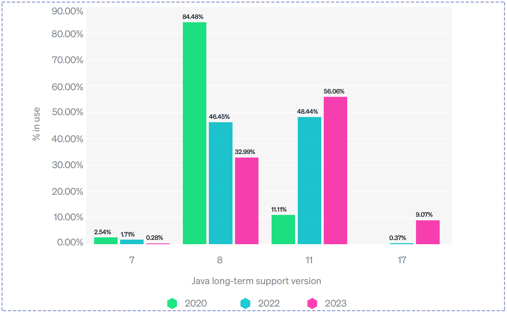
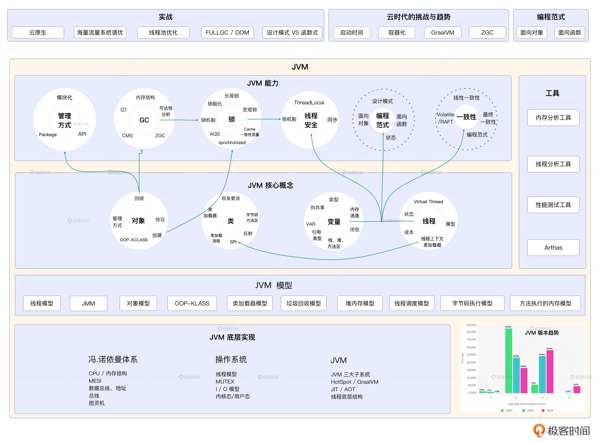
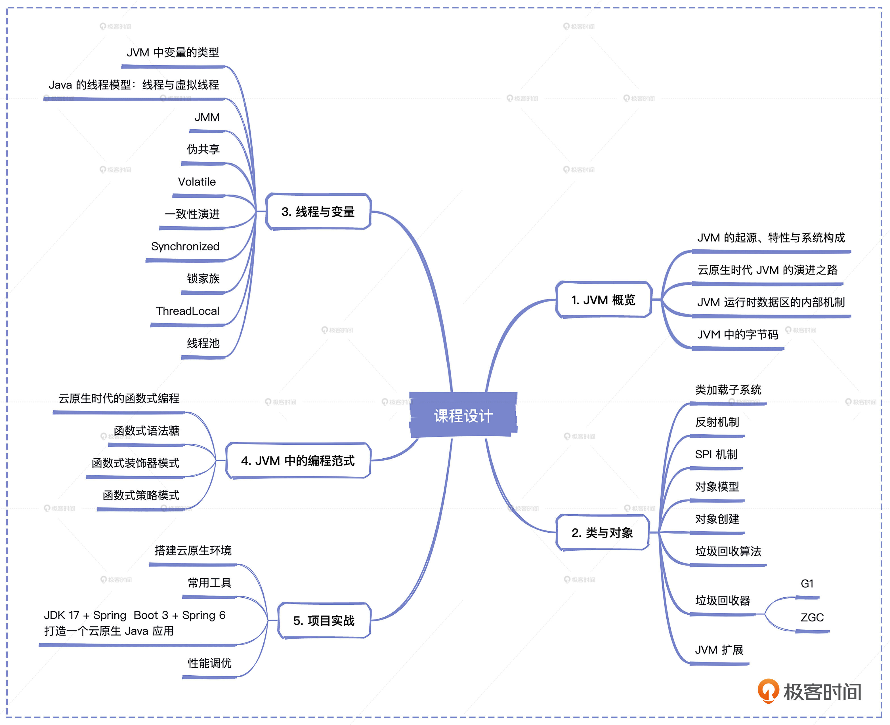
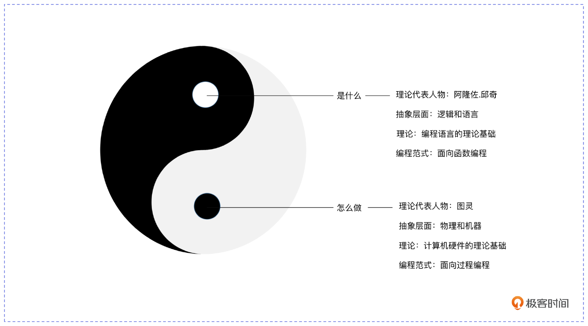

# 开篇词｜云时代来临，如何学好JVM应对未来的挑战？
你好，我是康杨，一个热衷于技术分享的架构师，很高兴在极客时间与你相遇。

我目前在京东支付负责架构升级、数字化转型还有大促备战相关的事情，同时这些年我也一直在关注前沿技术的发展与实践。作为京东集团的认证讲师，我也常常在公司内外进行技术分享，最近几年也在全球架构师峰会、全球技术创新大会等业内技术峰会针对数字化转型、云原生、海量流量的分布式系统设计进行交流和分享。

## 云时代 JVM 的应变之道

近两年我在参加各种技术峰会的时候发现了一个趋势，就是几乎场场都能看到云原生相关的主题。现在不光是一线的互联网大厂，就连传统的金融机构也都在积极地转型，拥抱云原生。这次变革的背后，不是单纯的技术升级，而是数字中国的国家战略。种种迹象表明 **云时代已经来临**。

然而，云时代的来临也给Java带来了不小的挑战，速度、内存、部署与管理的问题逐渐变成了Java的负累。不过它并没有坐以待毙，而是选择积极地适应新时代，引入更多新特性来应对这些挑战。

为了应对运行速度和内存占用问题，Java持续在JVM层面进行优化，比如引入GraalVM和OpenJ9等新的JVM实现，提高了运行速度，减少了内存占用。GC从CMS到G1再到ZGC的演进，内存空间利用率显著提升。并且，Java逐渐开始支持更多的云原生特性，比如制作更小的Docker镜像，支持Kubernetes原生应用和Serverless等。

而现在也正处于Java的历史拐点，各个公司已经完成或正在进行系统的云上迁移。虽然JDK 8仍然被广泛采用，但是根据New Relic 2023年最新的报告统计，过去一年JDK 17的使用量增长了430%，JDK 7即将退出历史舞台，而JDK 11已经成为了使用量最高的LTS 版本，占比达到了56.06%。从Graavlm到ZGC、从AOT到Truffle，JVM正以史无前例的更新速度和更新幅度，以自我颠覆性的方式准备迎接新时代的挑战。

Java 对待挑战的态度也决定了它将随时代的车轮滚动向前。 **在未来很长一段时间，它都会利用自身强大的生态、完善的抽象模型、丰富的开源库和工具，帮助开发者快速开发和维护应用。** 而它的跨平台特性也使Java应用可以在多种环境下运行，包括云环境。

## 为什么一定要学好 JVM?

变革的号角已经吹响，这个时候我们只有紧跟JVM变革的脚步，才能在这个历史的变革期，先人一步，抢占先机。学习JVM 能让我们更加深入地了解云时代Java技术的新特性。

不过我一路走来也清楚地知道JVM确实是一块难啃的硬骨头，但是我还是想以过来人的身份对你说一句，无论你处在哪个阶段，JVM底层技术都是绕不开的一环，而且越是进行上层的架构设计与规划，就越需要对底层的技术实现与原理有更深刻的理解和认知。

因为 **平时不被我们关注的底层技术细节，往往会在关键时刻给我们致命的打击**。比如在JDK 1.8.0\_131之前，JVM无法感知Docker的真实核数和内存大小，而是使用的宿主机核数和内存。这对于已经迁移上云的应用来说存在潜在的风险，如果你忽略这一点无疑会出大问题。

但是现在市面上还有网络上关于Java的资料太多了，存在严重碎片化的问题。作为一门已经发展了28年的语言，每半年就更新一次JDK的版本，越来越多的厂商投入到JDK的研发之中，永远都有读不完技术文章，我们似乎掉入到一场碎片化的浪潮中被裹挟前行。

可能你对每个具体的知识点都能如数家珍，但是对于知识点之间的关联以及在真实的生产环境中如何应用，却很难说清。但只有做到知其然并知其所以然，形成对知识的整体认知，才能 **真正把对技术的理解应用于实践，去解决真实生产中的问题**。

这也是我打造这门课程的初心。我希望这门课程不仅仅能为你深入解读JVM的各个知识点 ，还能帮你揭开这些知识点背后的潜在关联，建立自己的知识框架，把对JVM的理解应用到具体的实践中，更能看到JVM演进的趋势，提前掌握新的技能，做时代的先行者。

## 这门课是怎么设计的？

根据我十几年的Java实战经验，我总结出了使用JVM的三层境界。

1. 第一层境界，了解JVM的知识点，根据JVM提供的基础能力使用JVM。
2. 第二层境界，深度掌握JVM背后的原理并能熟练应用，写出高性能、易扩展、高可用的Java程序。
3. 第三层境界是架构师或者框架、中间件的开发者需要修炼的，能够基于JVM的能力打造出自己的框架。

我们将通过JVM的五大体系循序渐进地展开，提升你对JVM的认知和使用JVM的境界。

### 第一章 JVM 概览

我会为你介绍JVM的由来，它的系统构成，以及当前云时代JVM面临的挑战及应对之法。不仅是为了让你了解JVM是什么，更是为了让你看清它未来发展的趋势，提前做好准备。

### 第二章 类与对象

这部分我会帮你理清楚JVM是如何支持Java语言的面向对象编程的。你不仅能了解到JVM的对象模型，还能看到对象是如何从你写的Java代码编译成字节码的，JVM从类加载到空间分配以及最后回收的全流程，以及JVM那些为了应对云时代的挑战做出的优化。

理清对象创建与回收的潜在关联，了解JVM的反射机制能够帮助我们写出更加抽象，更易扩展的程序。我也会结合实际的代码和场景，把我对JVM体系化的认知和实际工作中的经验融合进去，让你今后设计系统时，更加得心应手，有章可循。

### 第三章 线程与变量

线程与变量就像汽车的发动机原理介绍，如果说面向对象是JVM为我们提供的语法糖，用来降低我们使用Java语言的门槛，那么线程与变量就像是汽车的发动机，是JVM真正运算的所在。作为一名普通的司机，你也许学完第二章的内容就可以开车上路了，但是作为顶级的赛车手，只有深刻了解发动机的原理，才能实现机械同感，达到人车合一的最佳状态。

通过这部分的学习，你不仅能掌握如何借助Volatile写出最优雅的单例模式 ，还能学习到Volatile底层的实现原理，了解putIntVolatile与putOrderedInt的区别，以及散落在JUC的各个源码中对这种优化方式的使用，感受JUC 之父 Doug Lea 对性能的极致要求。当然如何更优雅地使用线程池，如何写出更高效的分布式程序以及最新的虚拟线程技术，我也会为你一一介绍，让你了解JVM底层原理如何做到对上层应用的支持。

### 第四章 JVM中的编程范式

这部分我不仅会向你介绍 Decorator等设计模式的使用以及函数式编程的特点，还会回归对编程本质的思考，带你看清设计模式与函数式编程的理论源泉，也就是人类对系统复杂度的思考和探索。

JVM同时存在面向对象、面向函数两种编程范式，或者更准确地说是对面向过程和面向函数的支持。就像Ruby之父松本行弘在《代码的未来》一书中讲到的：“闭包跟面向对象是一棵树上的两个分支，实现的功能是等价的。”其实闭包才是和面向对象互为依赖的一对概念，而面向过程还是面向函数，才是标准的编程的两大流派，代表着图灵与阿隆佐·邱奇之争。一个代表着逻辑与语言，一个代表着物理与抽象。

而伴随着摩尔定律的失效以及云计算的崛起，传统物理机的概念逐步弱化，随着Serverless逐步走上历史的舞台，我们看到不管是DDD从领域对象到Event Sourcing的转型，还是FaaS的兴起，都在昭示着函数式时代的来临。而JVM以及使用JVM的你我，如何更好地迎接新时代的挑战，我也会在这一章为你一一讲述。

### 第五章 项目实战

这一章我将带你一起动手实践，打造你的第一个AOT编译的GraalVM应用，感受JVM的魅力。利用我们前面学到的知识点，体验如何全方位地提升系统的性能，如何直面生产中非常经典的FULLGC、OOM等问题，真正地解决这些生产中的问题。

## 寄语

我希望这个课程能像口袋书一样，当你日常遇到问题，需要设计一个高性能、高并发的系统时，能够给予你灵感，帮你找到更优的解决方案。更重要的是我希望这门课能在你的脑海中种下一颗思考的种子， **在提升你的系统设计能力和软件编程技巧的基础上，帮助你养成体系化的思维，早日搭建属于你自己的知识框架。**

你也可以把自己的知识框架分享出来，试想一下，当越来越多的人画出了他脑海中的知识框架，我们也汇聚了各行各业对于JVM的使用情况和知识体系，这对于在知识的海洋中漂流和迷茫的人，无疑是指路的灯塔。《论语》有云：“独学而无友，则孤陋寡闻”，也希望你能找到更多志同道合一起进步的伙伴。

当然这一切都离不开你的坚持，学习就像是一次逆人性的旅行，也像是一场修行，但是在这个知识爆炸，技术更新越来越快的时代，似乎除了终身学习，我们别无选择。不过我会一直陪你到最后一讲，期待与你更深入地交流。