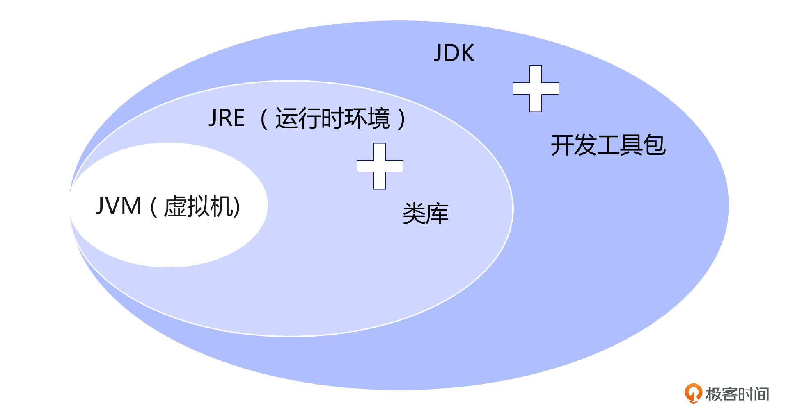
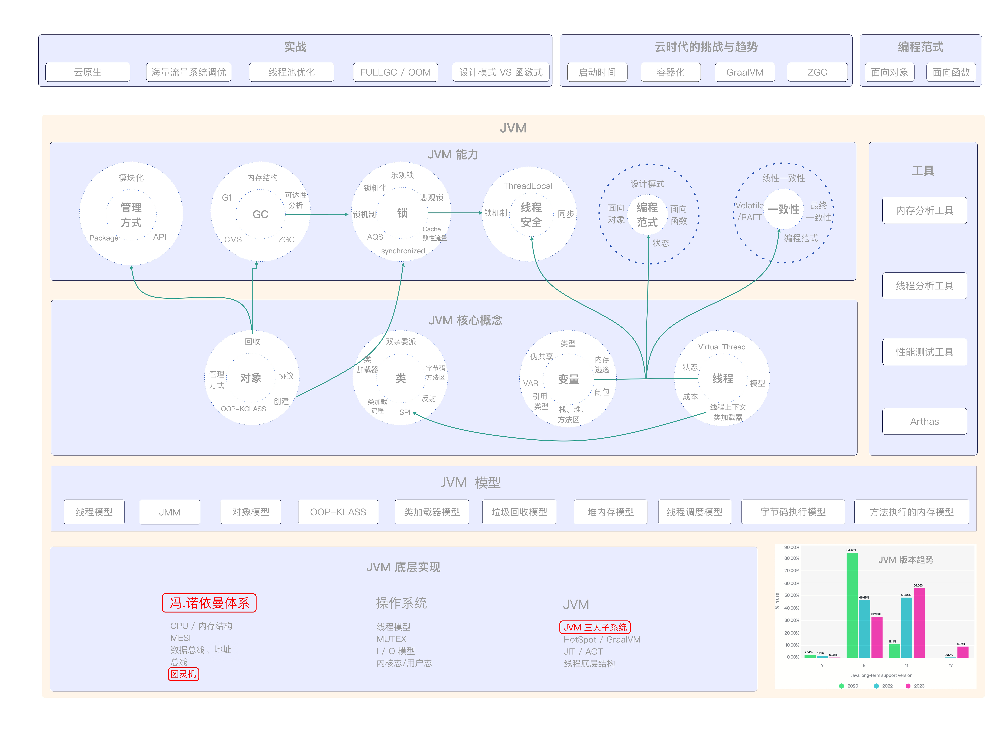

# 01｜重识JVM：JVM的起源、特性与系统构成
你好，我是康杨。欢迎你加入学习，和我一起开启JVM的探索之旅。

作为这门课程的第一讲，我希望通过我的介绍，能让你对JVM有一个整体的认知。我将从JVM的起源、它的基本特性、内部构成，以及它与我们常说的JDK、JRE的关系等多个维度展开，让你知其然并知其所以然。

## JVM的起源

区别于很多课程以“hello world” 开篇，我们今天从一个实际的需求开始。假设你是一家餐厅的老板，需要计算过去一周的营收总和，过去一周每天的营收分别是 102、230、320、431、130。假如你生活在公元前，这时候你可能就需要用结绳记事的方式来进行计算。

而如果你生活在19世纪50年代，那么恭喜你，你可以用计算机帮你计算了。幸亏有了计算机，不然，如果要算一年的营收，不知道要用掉多少根绳子，算多长时间呢。

当然，现在的你，显然会用更简单的方式得到结果，通过下面这段代码，JVM就会帮你完成运算，你甚至不用考虑是在Windows上运行，还是在苹果电脑上运行，因为JVM会帮你搞定。

```java
int[] arr = { 102，230，320，431，130};
int sum = 0;
for(int i: arr){
   sum += i;
}
System.out.println("Sum is: " + sum);

```

我们要解决的问题本身，其实从未发生变化，但是解决问题的工具从结绳记事，到计算机再到虚拟机一直在演进。


其实结绳记事也可以看作是最早的“计算机”，虽然它看上去与我们现在所使用的计算机大不相同，但其背后的原理，也就是信息的储存、处理与传递，却与我们现在所使用的计算机如出一辙。

人类的智慧从这里开始，也由此引领我们走向了计算机的时代。然后，人类发明了算盘、电子管计算机，再到晶体管计算机。在这个过程中，人们逐渐发现，用硬件实现不同的计算机系统既昂贵又低效。于是，软件的概念应运而生，随着时间的推移，软件的领域不断拓展和加深，计算机的能力也相应地提高了。 **整个计算机系统由层层抽象构建而成，硬件是基础，应用是表层，中间则是操作系统和各种各样的编程语言。**

### 计算机的机器本质

现代的计算机基本是以图灵机为理论基础的，采用了冯·诺依曼体系架构。


如图所示，冯·诺依曼体系是计算机体系结构的基本框架，它由存储器、运算器、控制器和I/O设备组成。存储器用来存放指令和数据，运算器负责执行算术和逻辑运算，控制器指导指令的执行流程，而I/O设备用于与外部世界进行数据交互。

0/1机器码是计算机能够直接执行的最底层的指令形式，它由0和1构成，对应着不同的操作和数据传输。计算机通过将0/1机器码加载到存储器中，并由控制器解析、执行这些指令，实现了复杂的计算和数据处理任务。

这种基于冯·诺依曼体系和0/1机器码的计算机运行方式不仅具有普适性和可编程性，还为计算机科学和技术的发展提供了强大的基石。深入理解和掌握这些机器本质的概念，能够更好地解析和控制计算机系统。而冯·诺依曼也可以看作是Java虚拟机（JVM）的本源和雏形。

### Java 虚拟机的本质

JVM是一种虚拟计算机，它接收字节码，并把它转化为机器可以读取和执行的代码。


这样Java程序就能在JVM中运行，不用考虑底层的硬件和操作系统，这就是 **JVM的平台无关性**。简单来说，JVM可以看作是一个抽象的计算机，它有自己的指令系统、内存、注册器等。编译器把源程序翻译成字节码，这些字节码随后在JVM中执行。


总的来说就是Java虚拟机在计算机硬件和Java程序之间建立了一个抽象层，使Java程序不必关心底层的硬件和操作系统的情况，从而实现了Java“ **一次编写，到处运行**”的效果。这也是Java语言相比其他语言的一大优势。

### **机器与语言**


通过刚刚的介绍，也许你会发现，其实问题本身从来没有变化过，只是随着每一个新的机器的诞生，我们使用机器的成本快速降低了。每种机器都提供了一种语言作为我们和它们交互的方式，在最早的计算机时代，我们是通过0/1来和计算机交互，而JVM采用字节码作为交互的语言。但是现在我们可以用更接近人类语言的Java或者Groovy语言和机器交互，让它们完成我们期望的目标。

这就像一个无限的递归，通过封装原有的机器，我们借助原有的机器的能力，打造一个新的机器，并提供一门新的更简化的语言。这也是云时代当机器的概念越来越弱化FaaS逐步成为主流的原因。所以深刻地理解JVM的本质，不光能帮我们写出优秀的Java代码，也能帮助我们看清楚技术演进的趋势。

## JVM基本特性

说了这么多，让我们一起来看看JVM有哪些特性。作为一种计算机抽象设备，JVM用于管理和优化执行Java程序。区别于CPU采用的寄存器架构，JVM是基于栈技术实现的。因为寄存器和硬件息息相关，程序如果采用寄存器就会失去移植性，而基于栈最主要的优点就是与机器无关。

这也使得JVM具备如下特性：

1. 平台独立性：Java代码可以在任何安装了JVM的机器上运行，不用为每种平台编写不同的版本。
2. 自动内存管理 ：JVM提供了垃圾收集机制，自动回收不再使用的内存，降低内存泄漏的风险。
3. 高效的即时编译：JVM运行时即时编译对热点代码进行优化，提升程序执行效率。
4. 强大的监控和调试工具：JVM为开发者提供了详细的性能数据和调试工具，帮助开发者提升程序性能，解决问题。

所以JVM不仅能降低开发成本，使开发者不用再去解决一套代码在多平台运行和维护的问题。同时也能通过即时编译和内存管理使Java应用可以运行得更快、更稳定。各种调试和监控工具也会帮助我们更快地发现和解决问题，从而提升开发效率。

JVM固然很强大，但是这并不意味着我们可以随心所欲地开发程序。只有深入地了解JVM，才能真正用好JVM。否则你会发现程序运行的结果和你设想的并不一样。比如不了解GC机制，随意创建对象，不考虑对象的大小和生命周期，不考虑GC和应用程序之间关系，从而导致FULL GC和OOM的问题。

比如下面这段代码，如果没有认识到一段代码从我们开发到真正执行可能经过的编译器重排、内存重排、指令重排等诸多过程，很可能导致代码的执行结果不稳定，甚至是出错。

```java
public class Demo {
    private int a = 0;
    private  boolean flag = false;
    public void writer() {
        a = 1;
        flag = true;
    }

    public void reader() {
        if (flag) {
            int i = a * a;
            System.out.println(i);
        }
    }
    public static void main(String[] args) throws InterruptedException {
        final   Demo example = new  Demo();
        Thread thread1 = new Thread(() -> example.writer());
        Thread thread2 = new Thread(() -> example.reader());
        thread1.start();
        thread2.start();
        thread1.join();
        thread2.join();
    }
 }

```

那怎么优化这段代码呢？你可以先自己尝试优化一下。

## JVM内部构成

了解了这么多JVM的特性，下面就让我们深入到JVM的内部一探究竟。如图所示，JVM由三大子系统构成，分别是类加载子系统、字节码执行引擎以及运行时数据区。


### 类加载子系统

类加载子系统（ Class Loader Subsystem）负责把字节码文件加载到内存里，并在运行时解析和验证类文件的正确性，以此实现Java的动态性和可扩展性。

### 字节码执行引擎

字节码执行引擎（Execution Engine）是JVM的核心，类似于冯.诺依曼机的中央处理器，负责执行字节码指令，把字节码翻译成机器代码，实现程序的实际运行以及跨平台性和高性能的特性。

JVM 同时支持 **解释执行和编译执行** 两种方式，JVM的优化重点放到了这个部分，它会自动监视代码的执行情况，对于一般的代码采用解释执行的方式，而对于经常调用的方法启动一个后台线程，把它们编译成本地代码并进行优化，这也是JVM能实现高性能一个非常重要的因素。

### 运行时数据区

运行时数据区（Runtime Data Area）用来存储程序执行期间的数据。提供程序运行时的内存空间，为程序的执行提供基础支持。

这个区域可以从线程的视角分成线程共享区域和线程独享区域。线程独享区域主要有程序计数器、虚拟机栈、本地方法栈三个部分，这三个部分与线程的生命周期相同，所以和线程同生灭，不用考虑垃圾回收的问题。线程共享区域包括堆和方法区，方法区用来存储类的结构信息、堆用来存储对象实例等。

## JVM、JDK与JRE

我们可以把JVM比作汽车的发动机，虽然它是整个汽车中非常核心的部件，但是显然我们不能只是把一台发动机交付给客户，用户不光关心发动机的性能、百公里加速的时间，也关注你的座椅是否是真皮的、是否有全景天窗等，所以接下来我们就来介绍一下JVM最终交付给用户的三个概念JDK、JRE、JVM。

JVM我们前面已经说过了，这里我们重点看一下JDK和JRE。



### JRE

JRE 是 Java Runtime Environment 的缩写， 从名字就能看出来，JRE 关注Java的运行时环境，它主要由三个部分构成，分别是核心类库、支持文件以及 JVM。JRE由Java API和JVM组成，JVM通过类加载器加载Java应用，并通过Java API来执行。

### JDK

JDK是 Java Development Kit（ Java开发工具套件 ）的缩写，看名字估计你就猜到了，它才是我们交付给用户的那台汽车。事实上JDK 是一个完整的软件开发环境，能够帮助用户更好地开发Java Applet 以及 Java 服务器端程序。

JDK 整体上包括JRE（Java 运行时环境）、Javac（编译器）、Javadoc（文档生成器）、各种工具等，提供了从加载代码到验证代码再到执行代码的全生命周期管理。

## 重点回顾

这节课我通过介绍支撑着Java语言的JVM为你揭示了Java编程背后的秘密。

我们从底层实现开始了解了JVM的起源，它其实就是一台冯.诺依曼机器，和所有的计算机一样能协助你完成计算的任务。但是相对于普通计算机基于寄存器的架构，JVM是基于栈的虚拟机，正是因为基于栈的特性，使JVM具备了平台无关性。和所有的语言一样，JVM提供了自己的语言字节码以及字节码的运行时环境。

虽然JVM是一台机器，但是它也是虚拟的，它的能力来源于底层真实的物理机，所以了解底层CPU和操作系统对你用好JVM大有裨益，因为它们是JVM的能力之源。当然面试的必考点JVM的内部构造我也着重介绍了下，这些都是需要你牢记于心的。

## 思考题

```
public class Demo {
    private int a = 0;
    private  boolean flag = false;
    public void writer() {
        a = 1;
        flag = true;
    }

    public void reader() {
        if (flag) {
            int i = a * a;
            System.out.println(i);
        }
    }
    public static void main(String[] args) throws InterruptedException {
        final   Demo example = new  Demo();
        Thread thread1 = new Thread(() -> example.writer());
        Thread thread2 = new Thread(() -> example.reader());
        thread1.start();
        thread2.start();
        thread1.join();
        thread2.join();
    }
 }

```

1. 对于我给出的这段代码，你会如何优化呢？请你把你优化后的代码分享到评论区。
2. JVM和普通计算机的关系是什么？请说一说你的理解。

欢迎你把你的答案分享到评论区，和我一起讨论，也欢迎你把这节课分享给需要的朋友，我们下节课再见！

## 💡点亮你的知识框架图

