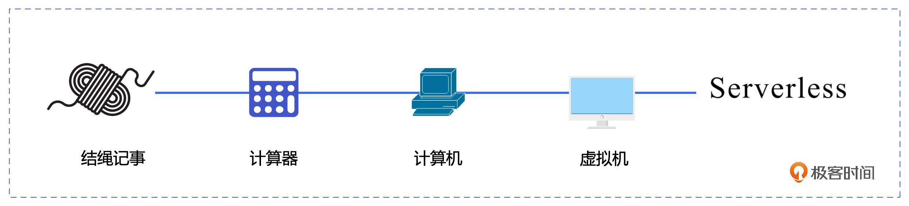
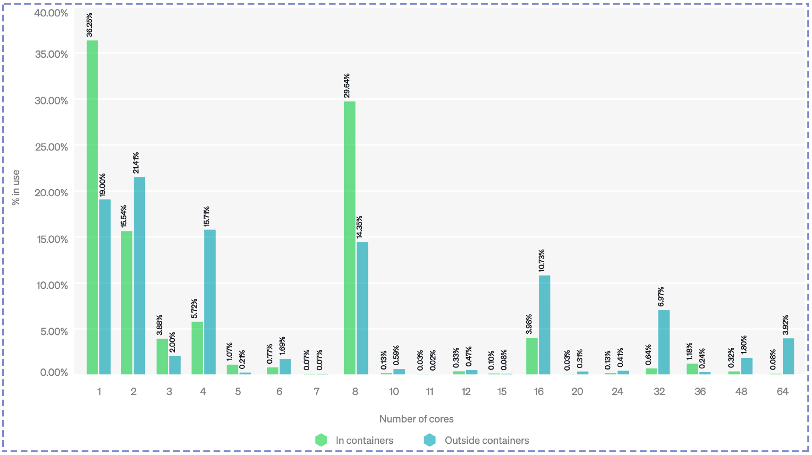
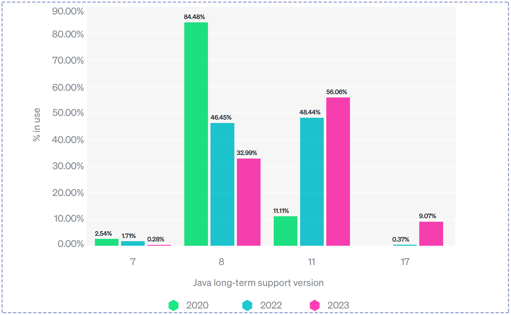
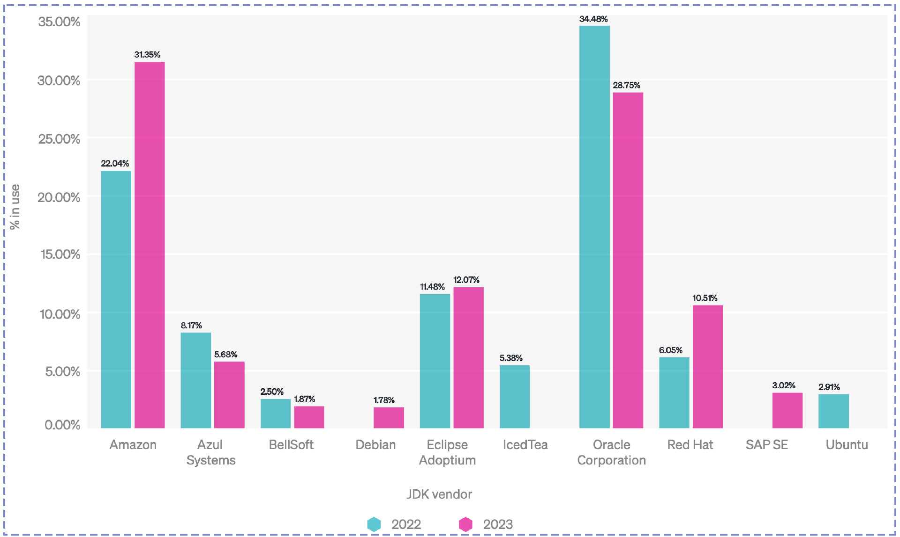
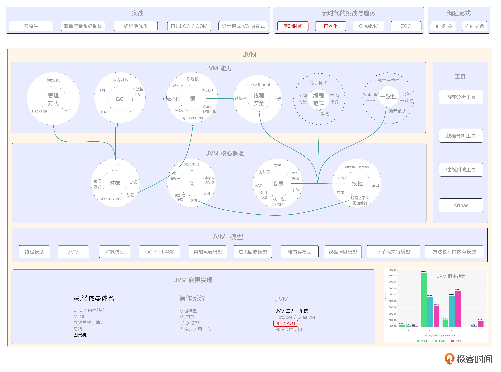

# 02｜挑战与趋势：云原生时代JVM的演进之路
你好，我是康杨。

今天我想和你聊聊关于趋势的事儿。我们一起来看看JVM在云时代面临的挑战，还有它是如何应对的，以此来推断出我们应该做哪些准备，来更从容地应对这个快速变化的时代。

## 趋势的力量

还记得2004年，我刚开始第一份编程工作的时候，那时候还是Win32的天下，我的老板是个台湾人，他是Delphi的拥趸，经常挂在嘴边的一句话就是“Delphi 永垂不朽”，但是现在听说过Delphi的人，想必寥寥无几。

2008年，Facebook刚刚兴起，social game火遍全球，国内做社交网站或者社交游戏的互联网公司如雨后春笋般涌现，做ActionScript 3的工程师，工资水涨船高，但现在基本都转型了。

其实不光是编程语言，NOKIA与柯达的故事，也都印证了那句话“其兴也勃焉，其亡也忽焉”，而这背后就是趋势的力量。所以在学习任何语言或技术之前，如果能对趋势有一定的预判，将很大程度上避免自身陷入窘境。

## 云原生时代

几年前“是否上云”还是社会上的热门话题，但当时间来到2023年，不管是互联网大厂还是传统的金融机构，都早已完成了基础设施的建设和应用上云的转化。

而这不过是印证了Berkeley在2009年发布的那篇论文 [《Above the Clouds : A Berkeley View of Cloud Computing 》](https://www2.eecs.berkeley.edu/Pubs/TechRpts/2009/EECS-2009-28.pdf)，这也让我们不得不认真审视 Berkeley 的另一篇论文 [《Cloud Programming Simplified : A Berkeley View on Serverless Computing 》](https://arxiv.org/pdf/1902.03383.pdf) ，这篇论文预言了云原生时代的到来。

### 云原生时代的开发趋势

云原生时代的开发趋势主要集中在无服务器（Serverless）、容器化、Kubernetes、分布式等几个方面。

#### 无服务器

云原生时代弱化了服务器的概念。我们可以这样理解，在云原生环境中，我们更侧重于解决问题本身，而不是关注解决问题的具体步骤或工具，也就是服务器。在这种情况下，解决问题的方法会变得越来越自然，不需要过多地关注具体的工具或步骤，就像是没有服务器存在一样。这就是所谓的Serverless的概念。

#### 容器化

区别于JVM实现的语言层虚拟化，容器采用的是操作系统层虚拟化解决方案，可以为每个容器分配资源，并允许在容器内运行各种应用程序和进程，而不仅仅是Java应用程序。这给了容器许多优势，比如环境一致性，无论容器在什么地方运行，它的内部环境都是一致的，容器与容器之间互相不影响。此外容器还有资源隔离、开发效率和运维效率的提高、可扩展性和可移植性等特性。

#### 基础设施：Kubernetes

Kubernetes作为云时代的基础设施已经得到了时代的认可，它在容器化部署和资源管理等方面展现的自动化、弹性伸缩和容错能力已经成为了现在架构的基础。

#### 分布式、弹性伸缩、微服务架构

云时代的系统开发需要支持大规模的分布式计算和存储，能有效应对海量数据处理和分析的需要。云计算平台提供了弹性的资源分配机制，应用可以根据业务需求自动伸缩计算资源。系统开发通常采用微服务架构，把系统分解成一组小型、独立的服务，每个服务都在自己的进程中运行，各自独立部署。

## 云时代JVM的挑战

首先让我们一起回顾下Java那些耳熟能详的特点： **everything  is object、平台无关性、垃圾回收机制、完善的生态体系。** 这些曾经让Java引以为傲的优势，当云原生时代来临的时候，正在成为牵绊它前行的阻力，云原生时代Java的各种缺陷逐渐凸显。

### 启动时间

首当其冲的就是启动时间，我们都知道JVM是个慢热型选手。它在启动时需要加载很多类文件，而如果你的应用需要在启动时候建立各种长链接，那启动时间基本上要以分钟来计算了。

### 启动性能

其次是启动性能，由于JVM需要在系统运行一段时间后才能逐步由解释执行转化为解释执行+编译执行，这也意味着JVM的系统需要经过一段时间的预热才能达到性能巅峰。这就像冬天的燃油车一样，必须先把发动机充分预热，才能真正上路。

### 内存占用

相较于在运行态只包含机器码和垃圾回收器的Go语言，JVM的运行态即使只进行简单的加减乘除运算，也需要包含一个完整的解释器、一个即时编译器、一个垃圾回收器，在这个以快著称的云时代，显得有点太重了。

### 面向对象

曾经Java语言就是面向对象的代名词，Java的那句Slogan：everything is object，即使没有使用过Java语言的人也都听说过。但是你是否思考过，面向对象是否是唯一的选择？everything is object 的成本是什么？

一个32位Integer对象在内存中的空间占用如下：

- 对象头部：Header，通常占据8个字节。用来存储对象的元数据信息，比如对象的类型指针、锁状态等。
- 实际存储的整数值：占据4个字节，用来存储32位整数的值。

因此，一个32位的Integer对象在运行时会占用12字节的内存空间。在实际情况中，JVM为了对齐内存访问会把结构体的大小向上取整到8的倍数，所以通常会占用16字节的内存空间。这还不包括内存分配、垃圾回收、并发调用等耗费的其他资源成本。

那面向对象是什么，是不是必需的呢？其实面向对象只是一种抽象客观世界的方式，随着“优先使用对象组合而非类继承”逐步被大家接受，面向对象的优势正在慢慢弱化。作为新一代编程语言的代表，Go 和 Rust 其实都摒弃了面向对象的概念，并快速地发展着。这也从侧面证明面向对象并不是必需的选择。所以如何在云时代平衡面向对象的优势和成本，也是Java要面临的挑战之一。

## JVM的发展趋势

在这个确定的云时代，我们似乎看到一个不确定的JVM的未来。但是作为一个发展了28年有着庞大生态支撑的王者，JVM显然不会坐以待毙，下面我们就来看看JVM的应对之道。

### 拥抱容器化

New Relic 的数据显示，目前已经有 70%的Java应用是运行在容器中的。为了更好地支持容器化，JVM逐步放弃了自己原本的平台无关的解决方案，转而拥抱容器化。

#### **容器亲和性**

在JDK 8u131版本之前，JVM不具备容器识别能力。这对于已经上云，但还在使用JDK 8的Java 应用来说，存在致命的风险。因为JVM会基于宿主机的物理内存来设置堆内存的最大值，而不是基于容器的内存限制，从而导致JVM试图使用超出容器限制内存的情况出现，进而被操作系统杀掉，CPU的使用也存在同样的问题。

在JDK 11、JDK 17中，JVM增加了对容器环境的识别能力。JVM会读取来自操作系统（Docker）和容器管理系统（Kubernetes）提供的信息，来了解它所在的容器的资源限制。JVM会把这些信息用于堆内存、JIT编译器的管理中，并且这些新增的功能是默认开启的，无需任何特殊的配置。

#### **AOT 原生镜像编译**

从 JDK 9 开始，JVM 支持 AOT（Ahead-Of-Time）编译技术，并在JDK 11、17版本中持续增强。AOT 指的是在JVM运行之前把代码编译成本地机器码的技术。通过提前将Java应用程序编译为即时启动的本地二进制文件，JVM在无需预热的情况下就可以提供峰值性能。

同时，即时编译会产生大量的中间编译代码和相关的数据结构，导致程序占用更多的内存，而AOT编译可以在编译时根据具体平台进行优化，减少了这些额外的开销，节省了内存空间。

### 函数式支持增强

JVM持续加强对函数式的支持，参照Go语言，通过逃逸分析、栈上分配等操作持续提升栈的利用效率。基于函数式编程风格更加强调不可变性和无副作用的特性，产生的垃圾更少。此外，JVM还引入了Epsilon垃圾收集器，这是一个不执行任何垃圾收集的收集器。当应用程序不需要自动内存管理或者为了测试和性能调整而需要关闭垃圾收集时使用。

JDK 11 对 Lambda 表达式进行了改进，Lambda参数可利用var关键字声明类型，使Lambda表达式的代码更加简洁。这些改进和新增特性都彰显出JVM在加强函数式编程方面做出的努力。

### **GraalVM**

GraalVM是Oracle Labs于2018年4月首次公开发布的高性能JDK发行版，它的目标是提升在JVM上运行的程序的性能，包括Java、Scala、Groovy、Kotlin等多种语言。GraalVM的主要亮点在于其全新的即时（Just-In-Time）编译器，该编译器采用最新的编译器技术和研究成果，对Java的程序性能进行了大幅提升。

最引人注目的一点是，GraalVM支持AOT编译，这意味着它可以将Java程序编译成本地可执行文件，极大地减少了启动时间和内存占用，更适应在云原生环境下运行。2019年5月，发布了GraalVM的第一个正式版本，也就是Release版本。

GraalVM为开发者提供了一种新的、高效的、可扩展的运行环境，使不同编程语言的运行性能有了大幅提升。

### 版本快速更迭

上面这张图是 New Reliic 最新发布的 [《2023 年 Java 生态系统现状》](http://newrelic.com/sites/default/files/2023-04/new-relic-2023-state-of-the-java-ecosystem-2023-04-20.pdf) 的数据，我们看到 Java 7 马上要退出历史的舞台，Java 8 的比例快速下降，Java 11 已经连续两年高居各版本之首。Java 17 的采用率在过去一年内更是实现了430%的增长。而作为Java生态支持云原生的风向标 Spring 6 和 Spring Boot 3 支持的JDK最低版本就是Java 17。这也意味着以JDK 17为基础的Java云原生生态即将来临。

### JVM 家族

以前当我们看到Java的时候，肯定会想到SUN或者今天的Oracle，安装JDK的时候也会去Oracle的官网下载。

可是在New Reliic的报告中，我们发现亚马逊才是现在最受欢迎的JDK供应商。因为Oracle JDK的商业收费政策、Open JDK的蓬勃发展，再加上现在越来越热的信息技术应用创新，很多一线大厂开始打造自己的JDK版本。其中就包括阿里巴巴在2019年3月开源的 **Dragonwell**，腾讯2019年11月开源的 **Kona**，以及华为在2020年9月发布的 **毕昇。** 今天当你开始在生产环境中使用Java的时候，选择哪个JDK供应商已经成为了一个需要考虑的选项。

## 重点回顾

JVM经历了过去辉煌的28年，但在已经来临的云时代，原有的优势面临着新的挑战，为了适应云时代高性能、高可扩展性、高可靠性和高安全性的要求，JVM也在努力地进行自我革新。

总的来说，JVM的发展方向主要包括3个方面。

1. 首先是性能优化，通过提高性能和资源利用率来适应云原生时代的需求。其中最主要的技术是AOT编译器和JIT编译器的结合，以及JVM的内存管理和垃圾回收机制的优化。
2. 其次是对容器化的支持，通过支持容器化和新的微服务架构以适应云原生时代的需求。其中最主要的技术是JVM的镜像化和容器化以及对容器化环境的适配。
3. 最后是安全性和可靠性的提升，通过持续提高安全性和可靠性来适应新时代的要求。

我们也看到JVM版本的快速迭代和不断出现的JVM提供商，了解整个JVM的生态，对我们日后学习以及在生产中推进JVM的持续迭代有重要的意义。

参考资料： [《2023年 Java 生态系统现状》](https://newrelic.com/sites/default/files/2023-04/new-relic-2023-state-of-the-java-ecosystem-2023-04-20.pdf)

## 思考题

云原生时代，JVM的挑战主要有哪些？它是如何应对的？

欢迎你把你对这节课的思考分享到评论区，和我一起讨论，也欢迎你把这节课分享给需要的朋友，我们下节课再见！

## 💡点亮你的知识框架图

