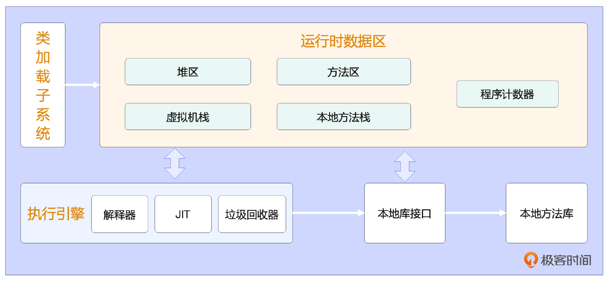
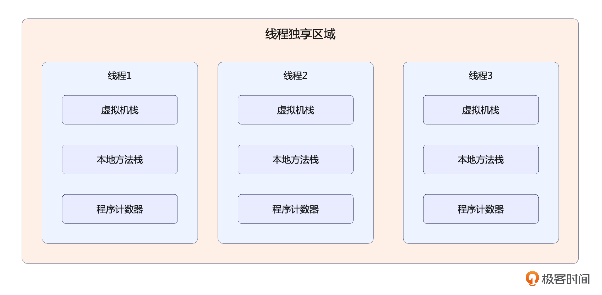
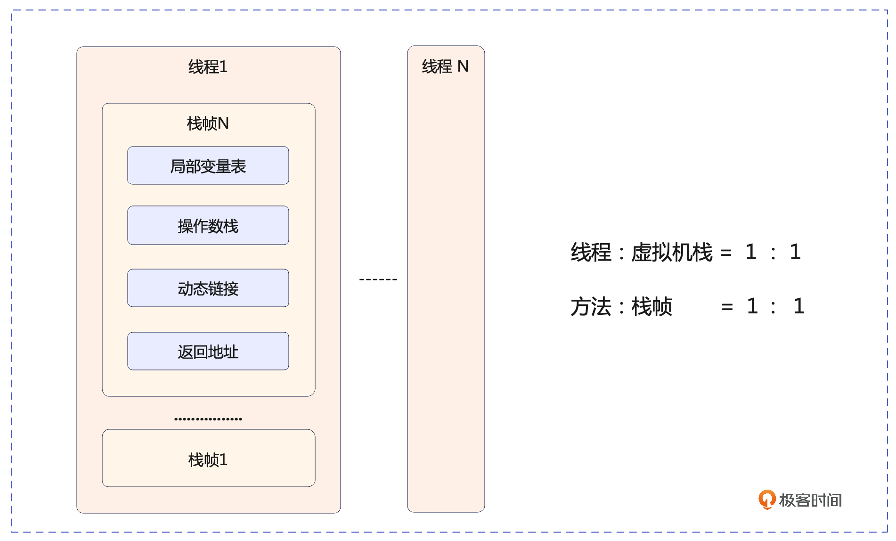
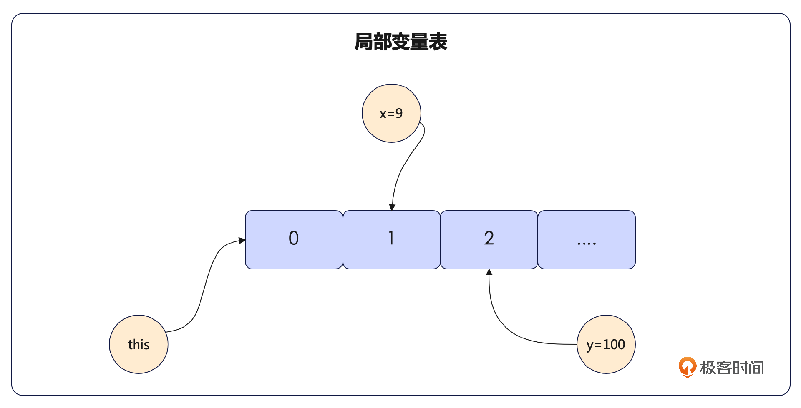

# 03｜工作台：JVM运行时数据区的内部机制是怎样的？
你好，我是康杨。今天这节课我们来聊聊JVM的运行时数据区。了解JVM的方法执行内存模型，掌握更多提升Java程序性能的技巧。



运行时数据区（Runtime Data Area）用于提供JVM运行时的内存空间的数据。以线程的视角出发，这个区域又分成线程共享区域和线程独享区域。

线程的独享区域由 **程序计数器、虚拟机栈（VM栈）和本地方法栈** 构成，它们的使用寿命与线程的运行时间相同，因此可以有效避免垃圾回收的麻烦，并且可以根据线程的不断发展进行相应的调整。



线程共享区域包括堆和方法区，方法区用于存储类的结构信息，堆用于存储对象实例等。这节课我们将聚焦在线程独享区域，方法区和堆的介绍我将在类加载器和GC的部分为你详细介绍。

## 程序计数器

程序计数器属于线程私有资源，每个线程都有一个唯一的属于自己的程序计数器，指定线程所执行的字节码指令的行号。执行Java方法时，这个地方记录的是线程正在执行的字节码的指令地址，如果执行本地方法，这个地方的值为空。

### 应用场景

程序计数器是字节码解释器的核心，它可以根据程序计数器的数值，为下一步的字节码操作提供准确的指引，从而使程序更加高效地完成任务。

在实际的流程控制中，循环、跳转、分支等基础功能的运作也依赖于程序计数器。在涉及多线程的环境下，程序计数器保存了当前线程运行的位置，这样在线程再次被调用时，可以了解到这个线程之前运行到了什么地方。

### 硬件本质

程序计数器是JVM对底层硬件中程序计数器和寄存器两个组件的模拟。

当操作系统决定将CPU的处理对象从一个线程转向另一个线程的时候，需要保留当前线程的状态并复原待执行线程的状态。这个状态就包括程序计数器的值，它存储了当前线程正执行到哪里；还有寄存器的值，存储了当前线程正在进行的计算信息。 **保存这些信息并在需要的时候恢复是实现线程切换的关键步骤。** 可以说，程序计数器和寄存器在线程切换过程中发挥着至关重要的作用。

JVM的程序计数器使原生平台和Java之间的线程切换都变得更加流畅了。有趣的是，正因为程序计数器中改变的只是行号，不会像Java的其他内存区域那样，因为程序运行的需要请求更大的空间，所以它是JVM规范中唯一一个没有规定任何 OutOfMemory Error 情况的区域。

## 虚拟机栈

我们通常所说的栈就是指的这个区域，它也是JVM中方法执行的内存模型，负责存储当前正在被处理的方法所需的数据、堆上的地址和指令。

### 方法执行内存模型

每个线程都有自己独立的栈空间。在触发方法的时候会创建一个 **栈帧** 结构，这个结构将保存所有与方法关联的信息，包括但不限于局部变量、操作数栈、动态链接以及返回地址。然而栈帧的深度是有限制的，一旦超过这个界限，就会出现 StackOverflowError 异常。每个方法从开始被调用都会有一个栈帧的压栈和出栈操作，这个过程可以一直追溯到VM栈的初始状态。



栈的生命周期和线程相同，所以它是线程私有的。也就是说，不同线程的栈是相互独立的，不会互相干扰。这种设计能有效地隔离各个线程的运行环境，并且在多线程编程中允许每个线程有它自己的局部变量表、操作数栈等资源，有利于提高程序的并发性能。

Java虚拟机栈在Java运行时内存里占据着重要的地位，主要用来支持Java程序的运行。在一个Java程序中，每一个线程的运行都对应着一个虚拟机栈。

下面我们就来详细介绍下它的内部构成。

### 局部变量表（Local Variables Table）

方法内部定义的局部变量主要放在局部变量表里储存，这些局部变量包括方法的形式参数和方法内部确定的局部变量。每个变量都有一个独立的存储空间，这个空间被称为变量槽（slot）。每个槽都有一个索引号，索引值的范围为0到max\_locals-1，其中max\_locals表示局部变量表的最大容量。

一个变量插槽能够储存32位或更少位数的数据类型，包括 boolean 和 char。对比之下，对于64位的数据型如 long 或 double，虚拟机会提供两个紧邻的变量插槽。



#### 存储内容

在局部变量表中，retureAddress指向字节码指令，reference则指向堆内存里的对象，8种基本数据类型包括boolean、byte、char、short、int、long、float和double，它们构成了一个完整的局部变量表，可以满足多种需求。

#### 两大特性

1. 容量确定性

在把Java程序编译为Class文件的过程中，局部变量表的大小已经被精确地设置好了，并且这个值被存储在方法Code属性的max\_locals字段里。因此每次调用一个方法，它对应的局部变量表的大小是确定的，并且在运行期间也不会调整。

1. 复用性

为了充分利用空间，局部变量表里的变量槽可以被多次重复使用。比如函数里一个循环内的局部变量，它的作用域只在当前循环中，这时候后面的变量可以占用这个变量的slot。

```java
public class LocalVariableTableExample {
 public static void main(String[] args) {
   int a = 10;
   int b = 20;
   int sum = add(a, b);
   System.out.println("Sum: " + sum);
 }
 public static int add(int x, int y) {
   int result = x + y;
   return result;
 }
}

```

上面代码的main方法中声明了三个局部变量 a、b、sum，还调用了 add 方法。add 方法中也有一个局部变量 result。这些局部变量在JVM的局部变量表里占据了槽位。你可以看一下对应的字节码。

```java
public class LocalVariableTableExample {
public static void main(java.lang.String[]);
descriptor: ([Ljava/lang/String;)V
flags: ACC_PUBLIC, ACC_STATIC
Code:
stack=2, locals=4, args_size=1
0: bipush 10
2: istore_1 // 将10存储到局部变量表槽1
3: bipush 20
5: istore_2 // 将20存储到局部变量表槽2
6: iload_1 // 将局部变量表槽1中的值加载到栈顶
7: iload_2 // 将局部变量表槽2中的值加载到栈顶
8: invokestatic #2 // 调用add方法
11: istore_3 // 将返回值存储到局部变量表槽3
12: getstatic #3 // 获取静态字段System.out
15: new #4 // 创建一个StringBuilder对象
18: dup
19: ldc #5 // 加载字符串 "Sum: "
21: invokespecial #6 // 调用StringBuilder的构造函数
24: iload_3 // 将局部变量表槽3中的值加载到栈顶
25: invokevirtual #7 // 调用StringBuilder的append方法
28: invokevirtual #8 // 调用StringBuilder的toString方法
31: invokevirtual #9 // 调用PrintStream的println方法
34: return
}

```

通过 istore\_x 和 iload\_x，可以把字节码里的值存储到局部变量表槽中，并把它加载到栈顶，其中 x 代表槽位的索引。

在main方法里，a和b分别存储在局部变量表槽位1和2中。这些变量在调用 add 方法之前是不需要的，因此在调用 add 方法之前，它们的值会被加载到栈顶。

add 方法中的 x 和 y 参数分别存储在局部变量表槽3和4中，而 result 变量存储在槽5中。在方法内部将 x 和 y 相加后，把结果存储在 result 里，并返回结果。

JVM使用局部变量表来存储方法中的局部变量以及方法参数，这些局部变量表槽位的替代性允许在不同阶段使用相同的槽位来存储不同的变量，从而提高内存的利用效率。在示例中，a 和 b 的槽位在调用 add 方法之前被重用，而 result 的槽位在add方法执行完毕后被重新用来存储 sum 的值。这就提醒我们，尽可能地减小每个变量的作用域，这样就为虚拟机提供了更多可能性去优化局部变量表，重用槽位，从而减少了内存占用。

#### 其他用途

局部变量表是 GC Root 的一部分，当slot里存放的数据类型是reference的时候，它关联的对象就是GC里的 “可达对象”。关于JVM定位可达对象的详细信息，在课程的第13讲我会详细介绍。

### 操作数栈

Java虚拟机的执行引擎采用的是“基于栈”的方式，这里所说的栈指的就是操作数栈。操作数栈按字长进行组织，通过压栈（push）和出栈等方式访问。一个命令可以将一个数值推入操作数栈，而另一个命令则可以把数值从里面取出来，从而实现对数据的快速访问。值得注意的是，当数据类型，比如byte、short和char，被写入操作数栈的时候，它们会被转换成int类型。

在了解了这些基础信息后，我们可以把操作数栈看作Java虚拟机的工作空间。因为大多数指令都从操作数栈弹出数据进行计算，然后把结果压回操作数栈。

```java
public class OperandStack{
    public static void main(String[] args) {
        int result = add(1, 2);
        System.out.println(result);
    }

    public static int add(int a, int b) {
        int c = a + b;
        return c;
    }
}

```

字节码使用 `javap -c OperandStack` 命令可以得到。

```java
public class OperandStack {
    public static void main(java.lang.String[]);
    Code:
       0: iconst_1
       1: iconst_2
       2: invokestatic  #2 // Method add:(II)I
       5: istore_1
       6: getstatic     #3 // Field java/lang/System.out:Ljava/io/PrintStream;
       9: iload_1
      10: invokevirtual #4 // Method java/io/PrintStream.println:(I)V
      13: return

    public static int add(int, int);
    Code:
       0: iload_0
       1: iload_1
       2: iadd
       3: istore_2
       4: iload_2
       5: ireturn
}

```

对于 add 方法，字节码的工作方式是这样的：

- iload\_0 和 iload\_1 把参数a、b分别压入操作数栈。
- iadd 指令弹出栈顶的两个元素，也就是参数a和b，执行加法操作，并把结果变量c压回栈顶。
- 将栈顶元素保存到局部变量表的第二个位置，也就是变量c所在的位置，是istore\_2的操作。
- iload\_2的工作是把局部变量表中第二个位置的元素，也就是变量c的值，重新放回栈顶。
- ireturn 是把栈顶元素（变量c的值）作为返回值返回。

通过这个过程我们可以观察到，JVM是如何利用操作数栈进行数据的传递和计算的。在使用JVM操作数栈的时候，一般无需进行额外的操作或优化，因为这些都已经由JVM自动管理了。但了解其中的工作原理，能帮助我们更好地理解Java程序运行的过程。

### 动态链接（Dynamic Linking）

动态链接会在程序运行时通过链接到运行时常量池的引用，来找到与每个栈帧相关的方法。这让我们在实现方法调用的时候能够进行动态链接。

在类文件的常量池里，含有大量的符号引用，这些都是方法调用指令的参数，这些参数在字节码中表现为指向方法的符号引用。无论是在类加载的阶段还是第一次使用的时候，一部分符号引用会被转换为直接引用，这种转换过程被我们叫做静态解析。另一部分符号引用则会在每次运行时都转化为直接引用，也就是所谓的动态链接。

```java
public class DynamicLinking {
    public void methodA(){
        System.out.println("---------start methodA-------------");
    }
}

```

执行指令：

```java
javap -verbose -p DynamicLinking

```

得到对应的字节码。

```java
public void methodA();

  descriptor: ()V
  flags: ACC_PUBLIC
  Code:
   stack=2, locals=1, args_size=1
   0: getstatic     #3    //使用动态链接，指向Field out:Ljava/io/PrintStream;
   3: ldc           #4    //使用动态链接，引用String "---------start methodA-------------"
   5: invokevirtual #5
  LineNumberTable:
   line 7: 0
   line 8: 8
  LocalVariableTable:
    Start  Length  Slot  Name   Signature
    0       9     0  this   Lcom/future/DynamicLinking;

```

#### 主要作用

1. 决定方法如何调用

在JVM里，调用指令主要分为两种，一种是执行已经确定的静态方法，而另一种是调用在运行过程中的方法。动态链接负责替换这些需要在运行时才能确定的方法的符号引用。

1. 提高性能

静态编译可能会生成大量的目标代码，而动态链接只在实际需要的时候才进行链接，能够大大减少链接的工作量，提高性能。

#### 最佳实践

在实际编程中，动态链接展现在Java的多态特性中，通常在面向对象的编程中，我们会利用虚函数或者接口来实现多态。这个过程实际上就是动态链接的应用。我们需要根据实际的运行状态来决定调用哪个方法，这种需要在运行时才能确定的链接过程就是动态链接。

### 返回地址

栈帧的返回地址用于方法执行结束后，返回到方法被调用的位置。

方法执行结束的方式有两种：正常结束和异常结束。正常结束是方法内部处理完成，异常结束则是方法内部无法处理异常而导致的退出。

对于正常结束，栈帧将保存程序计数器的数值作为返回地址。当方法正常退出后，这个数值可以指示程序继续处理的位置。另外，如果方法有返回值，那么这个值会被放到调动者的栈帧里。对于异常结束，返回地址需要通过异常处理器表来获取，因为异常退出的方法不会向调用者返回任何值，所以栈帧通常不会有这部分信息。

任何情况下，当方法退出后都要回到最初的方法调用位置，来恢复并继续程序的执行。针对每个栈帧，我们还需要提供一个引用，以此在运行时常量池内可以识别出对应的方法，且在方法被调用的过程中能实现动态链接。

无论是正常退出还是异常退出，方法的返回地址都很关键，可以帮助程序恢复并继续执行。对于正常退出，返回地址一般来自PC计数器；对于异常退出，则来自异常处理器表。

## 本地方法栈

本地方法栈与虚拟机栈在功能上有很多相似之处，但是它们之间还是有一些区别的。虚拟机栈主要用于执行Java方法，也就是字节码，而本地方法栈主要负责执行由非Java语言（如C、C++）编写的Native方法。

每个线程都拥有一个和它生命周期相同的私有本地方法栈。虚拟机没有对本地方法栈使用的编程语言、实现方式和数据结构做严格限制，这意味着不同的虚拟机可以根据自己的需求实现本地方法栈。例如，Sun HotSpot虚拟机就直接把本地方法栈和虚拟机栈合并为一个。

和虚拟机栈一样，本地方法栈也可能在栈深度超过虚拟机允许的范围时，抛出StackOverflowError，在虚拟机栈动态扩展无法申请到足够内存时，抛出OutOfMemoryError。本地方法栈不仅关系到Java与其他语言的互通，而且对程序性能也有很大影响。随着JDK不断发展，本地方法栈也在逐步优化。

## 重点回顾

这节课我们学习了JVM运行时数据区的内部构成和应用场景。其中，虚拟机栈是JVM方法执行内存模型的载体，程序计数器则是将JVM中的线程与底层硬件平台线程平滑切换的关键组件。局部变量表通过槽位共用的方式提高了内存效率，同时动态链接也是提高Java程序性能的重要手段。通过学习这些内容，我们更深入地理解了JVM运行时数据区的实现原理和优化策略。

所以我们要尽可能地减小每个变量的作用域，为虚拟机提供了更多的可能性去优化局部变量表，重用槽位，从而减少了内存占用。知己知彼，百战不殆，越熟悉每天陪伴我们的工具，越有利于我们写出更优雅的Java程序。希望你学完这节课的内容之后，再去检查下自己写的代码，看看还有哪些可优化的空间。

## 思考题

- JVM中方法执行的内存模型对应的是运行时数据区的那个区域？
- 这节课你学到了哪些提升程序性能的技巧？

欢迎你把思考后的结果分享到评论区，也欢迎你把这节课的内容分享给其他朋友，我们下节课再见！

## 💡 点亮你的知识框架图

