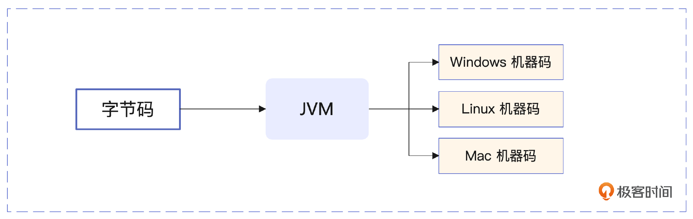
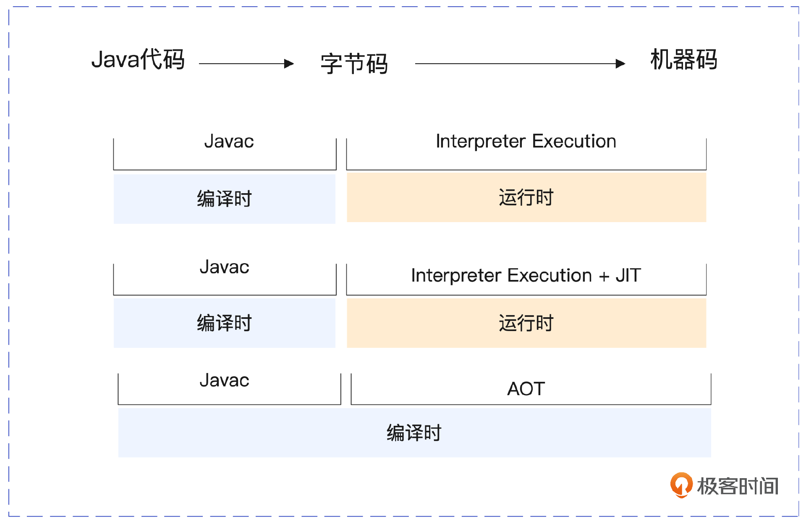
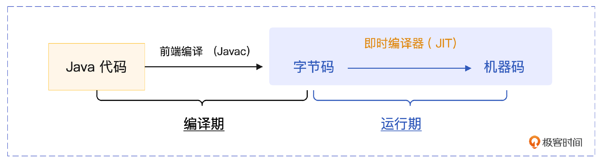
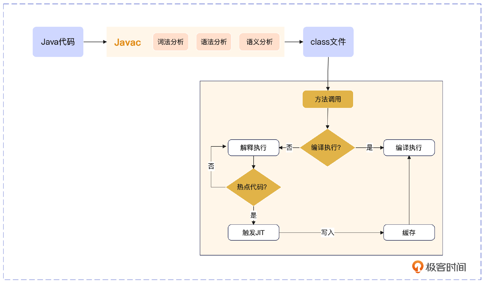
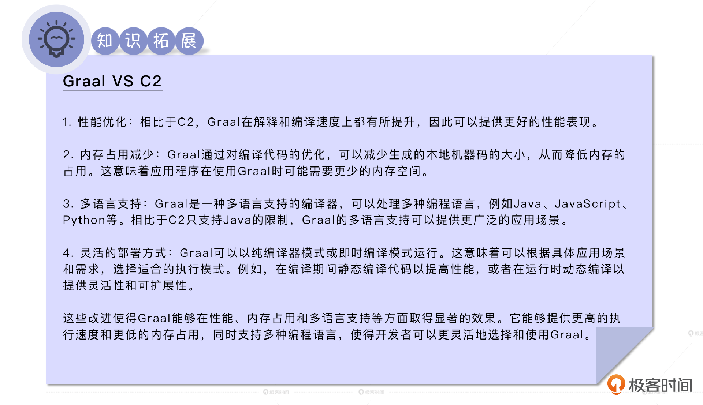
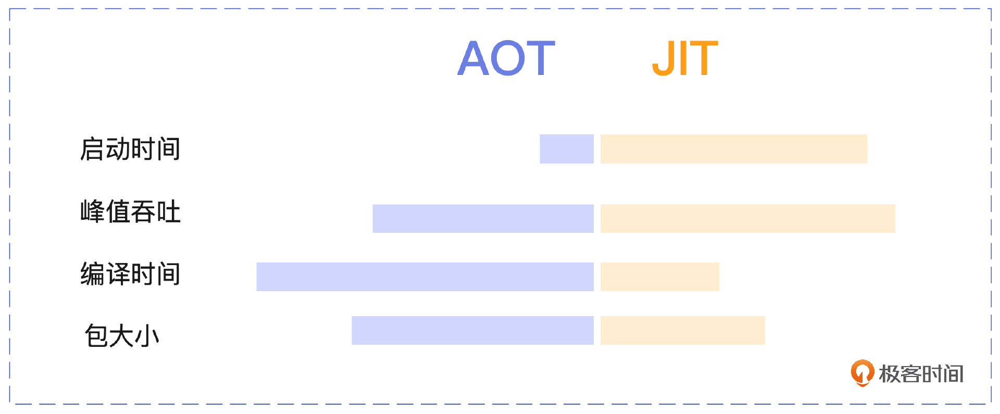

# 04｜从JIT到AOT：JVM编译器的云原生演进之路
你好，我是康杨。今天我们来聊一聊JVM的编译器。

JVM的一个重要职责就是把字节码拿到实际运行的物理机上去执行，其中重要的一环，就是根据不同的底层操作系统和CPU架构，把字节码转化为实际物理机能够识别的机器码。



## 字节码转化为机器码的发展历程

在JVM的演进历程中，字节码到机器码的转化环节共经历了三个发展阶段，分别是解释执行阶段、解释执行+编译执行阶段、提前编译阶段。



### 解释执行（Interpreter Execution)

解释执行就是将编译好的字节码一行一行地翻译成机器码执行。这种模式在JVM的早期版本中就已经存在了，它舍弃了编译时间，只在程序运行时把字节码实时翻译为机器代码。

在解释执行过程中，由于每次都需要重新解释字节码，相同的字节码会存在被反复多次翻译执行的情况，所以采用这种模式的程序运行性能一般比较低。为此，JVM在解释执行的基础上引入了即时编译执行技术。

### 即时编译（Just in Time Compilation）

即时编译也就是我们常说的JIT，以方法为单位，即时编译将字节码一次性翻译为机器码后再执行。JIT编译器从JDK 1.1 版本开始引入。通过这种技术，JVM 就可以发现某段字节码被反复执行，从而启动JIT编译器，把这段字节码编译成机器代码，提高运行速度。

这种方式虽然会根据运行时机器的实时状态，比如内存状态等，生成最优的机器代码，但是它也需要占用额外的内存空间，并与运行时的程序竞争CPU资源。并且需要在系统运行一段时间后才能达到运行时的性能巅峰。这就像你刚刚入职一家公司，需要有一个了解的过程，熟悉之后，才能达到最佳的工作状态。

但是这与云原生时代系统启动即性能巅峰的要求是有出入的。所以虽然主流的JVM依然是采用解释执行 + 编译执行的混合模式，但是更符合云原生要求的提前编译模式已经开始崭露头角。

### 提前编译（Ahead of Time Compilation）

提前编译也就是我们常说的AOT。AOT编译器是从JDK 1.9开始引入的 JEP 295规范。与JIT编译器不同，AOT是在程序运行前就把字节码编译成了机器码。

使用AOT编译器的优势在于你可以在部署应用程序前编译代码，而不是在运行时才编译，这可以减少应用程序启动时和运行时需要的 CPU资源，优化资源的使用方式，减少启动延迟时间，提高性能。这就像你在入职一家公司之前，就提前了解并达到了对应岗位的技能要求，这样你在入职的第一天就能达到最佳的工作状态。

从最初的解释执行，到即时编译技术，再到最新推出的提前编译技术，JVM在追求字节码执行性能提升的道路上，从依赖自身平台无关性的解决方案一步步转变到依赖云原生时代由容器提供平台无关性的解决方案上。下面我们就来详细聊一聊JVM中的JIT和AOT技术。

## 详解 JIT



在实际的生产实践中，一般是将解释执行与编译执行结合起来使用，以达到最佳的性能。这背后的逻辑和JVM将堆分成新生代和老年代一样，除了JVM中对象的生命周期存在二八定律，我们所运行的代码也同样存在二八定律，也就是说 80%的CPU时间是在处理20%的代码，这就是JIT可以通过深度优化热点代码来提升性能的原因。

### 混合模式下Java代码执行流程



你可以看一下混合模式（解释执行+编译执行）下 Java 代码的执行过程，主要分为 4 个阶段。

1. 前端编译：将Java源代码通过Javac编译器编译成字节码，就是我们常说的编译过程。
2. 加载：JVM中的类加载器（Classloader）读取字节码文件，并在JVM运行时空间中生成对应的内容。
3. 解释执行：JVM解释器开始工作，逐行读取字节码，并把字节码翻译为底层系统可以执行的机器码。
4. 即时编译：JVM在运行时将热点代码编译成机器码，并缓存起来，下次需要执行同样的字节码时，直接运行对应的机器码。

### JIT 触发时机

JVM通过分析代码的运行情况，如方法调用频率、循环代码等，决定是否将某段字节码编译成本机代码，以提高运行速率。

即时编译的触发机制具有一定的动态性，并不是所有的Java代码都会被编译为机器代码，只有在监视和分析后确认为热点代码的才会被转化为机器代码。具体的策略细节可能会因为JVM的版本、配置选项、运行环境等因素而有所改变。

```java
public class TestJIT {
    private static final int NUM = 15000;

    public static void main(String[] args) {
        testMethod();
        for (int i = 0; i < NUM; i++) {
            testMethod();
        }
    }
    public static void testMethod() {
        for (int i = 0; i < NUM; i++) {
            // do something...
        }
    }
}

```

对应的部分字节码：

```java
public class TestJIT
  public static final int NUM;
  public static void main(java.lang.String[]);
    Code:
       0: iconst_0
       1: istore_1
       2: goto          10
       5: invokestatic  #6                  // Method testMethod& #40;& #41;V
       8: iinc          1, 1
      11: iload_1
      12: getstatic     #2                  // Field NUM:I
      15: if_icmplt     5
      18: return
  public static void testMethod();
    Code:
       0: iconst_0
       1: istore_0
       2: iload_0
       3: getstatic     #2                  // Field NUM:I
       6: if_icmpge     14
       9: iinc          0, 1
      12: goto          2
      15: return
}

```

在main方法内，调用了testMethod方法（字节码第5行），并在一个循环中多次调用这个方法。字节码第2行的 `go to` 和15行的 `if_icmpit` 指令表示这个循环。

每次调用这个方法都会执行testMethod内部又一个循环。当程序执行时，这些频繁执行的热点代码就可能会被JVM的运行时编译器（JIT）注意到，并把这些代码编译优化为机器码。JVM 中默认编译阈值是 10000，这个值可能会因为JVM及版本的不同有所差异，当方法调用次数或方法中的循环次数超过这个阈值的时候，JIT 编译器就会尝试把这个方法的字节码编译成机器码，来达到优化的目的。

需要注意的是，这只是一个触发JIT可能性很高的示例，并不保证 JVM 一定会编译testMethod()方法。是否真正编译，取决于 JVM 的实际运行情况和具体实现策略，比如 JVM 的内存使用情况、CPU 负载情况，以及 JIT 编译器的具体实现等。也就是说，并不能通过一段固定的 Java 代码或字节码，确切地知道在哪部分会触发 JIT 编译。

### JIT 编译优化

编译优化是JIT编译器的一个关键功能。它在运行时收集代码的信息并进行优化。通过动态分析方法调用、循环结构等，JIT编译优化可以提高代码的执行效率。具体来说，JIT编译优化会在运行时对Java字节码进行优化，使用方法内联、循环展开及逃逸分析等技术来提高代码的性能。下面我们就来详细聊下JIT的逃逸分析技术。

#### 逃逸分析

逃逸分析是一个很重要的JIT优化技术。它的作用是判断对象是否会在方法外部被访问到，也就是逃出方法的作用域。逃逸分析是JIT编译器的一个步骤，通过JIT我们能够确定哪些对象可以被限制在方法内部使用，不会逃逸到外部，然后可以对它们进行优化，比如把它们分配在栈上而不是堆上，或者进行标量替换，把一个对象拆散成多个基本类型来存储。

通过这种方式，我们可以更加高效地分配内存并减少垃圾回收的压力。下面是一个简单的Java示例，演示逃逸分析的过程。

```java
public class EscapeAnalysis {
    public static void main(String[] args) {
        Food food = createFood();
        int x = food.getX();
        System.out.println("x: " + x);
    }
    private static Food createFood() {
        return new Food(10);
    }
    private static class Food {
        private int x;
        public Food(int x) {
            this.x = x;
        }
        public int getX() {
            return x;
        }
    }
}

```

createFood()方法中创建的Food对象经过逃逸分析后，可以在main()方法中直接进行变量赋值，避免了对象的动态分配。

你可以看一下使用逃逸分析技术优化过后的代码示例。

```java
public class EscapeAnalysis {
    public static void main(String[] args) {
        int x = 10;
        System.out.println("x: " + x);
    }
}

```

对象的创建被优化为直接在main()方法中分配并赋值给 `x` 变量，避免了对象的动态分配。

#### 适用场景

逃逸分析的优化主要针对局部变量，判断堆上分配的对象是否逃逸出方法的作用域。合理地设计代码结构和数据的使用方式能够更好地利用逃逸分析来优化程序的性能。我们还可以通过逃逸分析减少堆上分配对象的开销，提高内存利用率。

我整理了一些使用逃逸分析的最佳实践，你可以参考。

1. 对于临时对象或短期使用的对象，尽量使用局部变量来存储，以减少对象逃逸的可能性。
2. 避免在方法中返回对象引用，特别是如果对象只在方法内部使用。
3. 使用final关键字来限制对象的可变性，这样JIT编译器更容易进行逃逸分析和优化。
4. 对于复杂的数据结构，尽量使用基本类型、数组或集合类，以减少对象的分配和逃逸。

JIT编译优化对于提高Java应用程序的性能至关重要。通过深入理解JIT编译优化的原理与最佳实践，我们可以最大程度地利用JIT编译优化来提升代码的执行效率。

## **JIT编译器的演进：** 从C1、C2到Graal

最早JIT主要有两种编译器，C1和C2。C1的主要优点是编译速度快，但优化代码的能力较弱；而C2编译器虽然编译过程较慢，但能更有效地优化代码。在各种服务端程序和分层编译算法中，C1和C2都扮演着重要的角色。但是C2编译器已有近20年的历史，代码复杂并且设计中存在一些缺陷，使其维护工作变得困难。为了解决这一问题，JDK 10推出了一款全新的JIT编译器：Graal（JEP 317）。

Graal是C2的接班者，核心代码全是用Java编写的。Graal扬长避短，吸纳了C2的优势，并加入了新的架构设计。通过这些改进，Graal很快在性能方面超过了C2，并在某些特定场景下显示出了极佳的性能。



## 从 JIT 到 AOT

为了支持云原生和容器化环境，JVM在执行Java程序时也在逐步从JIT编译转向AOT编译。这种转变可以通过GraalVM等工具来实现。

在传统的JIT编译中，Java程序在运行时会将字节码逐行编译成机器代码。这种动态编译能够针对运行时的状态和调用频率进行优化，但也导致了性能延迟和启动速度较慢的问题。

为了解决这些问题并适应云原生环境，JVM引入了AOT编译。AOT编译是在程序运行之前将字节码直接编译成本地机器代码。这种方式可以提高程序的运行速度和启动速度，并减少运行时动态编译的开销。

为了从JIT过渡到AOT，JVM将字节码与AOT编译相结合。在JIT编译运行时，JVM会监视代码的执行情况并收集相关的运行时信息，然后将这些信息传递给AOT编译器。AOT编译器会利用这些信息对字节码进行优化，并生成可执行的本地机器代码。这样，当相同的代码再次执行时，就可以直接使用AOT编译得到的机器代码，而无需再次启动JIT编译。

这种JIT和AOT结合的方式可以在保持性能优化和动态适应性的同时，拥有更快的启动时间和更高的执行速度。这样Java程序就能更好地适应云原生和容器化的环境了，性能和可扩展性也更好。



我整理了JIT和AOT在启动速度、内存占用等方面的区别。通过对比，你会发现JIT和AOT有各自擅长的领域和应用场景。所以在生产环境中实际选择时，最好是结合应用的特点，充分权衡，选择最适合的解决方案。

## 重点回顾

我们都知道JVM的字节码需要转化为底层物理硬件识别的机器码才能真正运行起来。而在这个转化的过程中，我们需要用到编译器，最开始我们看到的是逐行编辑字节码的解释执行，随着时代的发展又衍生出了到基于热点代码识别，以方法为粒度将热点代码转化为机器码的即时编译技术。现在为了更好地适应对启动速度和性能的要求，JVM又通过AOT技术实现了提前编译，并结合容器的平台无关性，来打造JVM的云原生运行基础。

## 思考题

这节课我们学习了JVM的编译器，那你能说一说在编译器部分我们可以通过哪些方式提升程序的性能吗，此外这节课我们重点讨论了JIT的原理，你知道触发JIT的时机是什么吗？

欢迎你把你的答案分享到评论区，和我一起讨论，也欢迎你把这节课分享给需要的朋友，我们下节课再见！

## 💡点亮你的知识框架图

