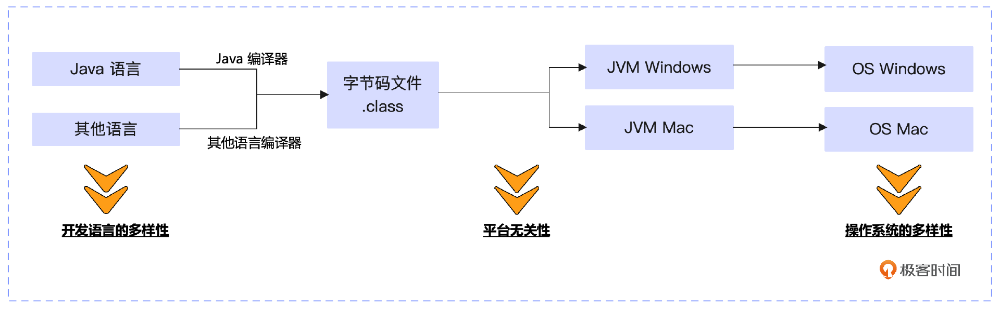
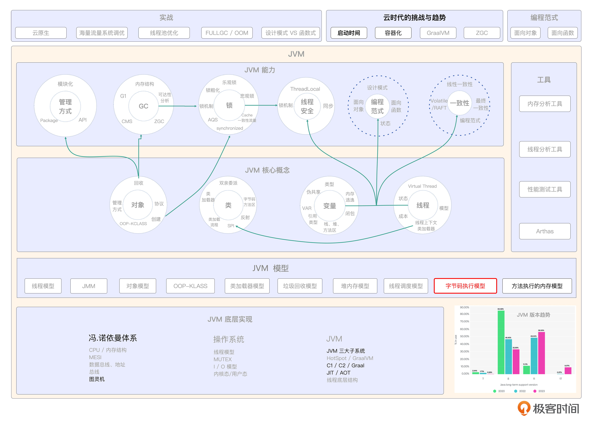

# 05｜机器与语言：JVM 中的字节码
你好，我是康杨。今天我们来聊聊JVM的语言——字节码。

在前面的介绍中，我们提到过Java语言的平台无关性，这也是Java能够快速崛起的原因之一。我们只需要用Java语言完成业务逻辑的开发，JVM就会帮助我们完成在物理服务器上的运行，而不用去关心底层硬件平台的差异性，能够达成这种效果的关键角色就是字节码。

借助字节码，JVM屏蔽了上层编程语言（Java、Scala ）和下层硬件平台的多样性。而JVM被认为是字节码的运行时。



## 字节码是什么?

Java源代码经过编译器编译后，就会生成JVM字节码，它是Java程序在JVM上执行的中间表示形式。JVM字节码是一种基于栈的指令集架构（Stack-based Instruction Set Architecture）。每个字节码指令都会在JVM上执行一系列的操作，如加载、存储、运算、跳转等。

它使用基于操作数栈和局部变量表的执行模型。具有以下特点：

- 独立于具体的硬件和操作系统，不同平台上的JVM可以解释和执行相同的字节码文件。
- 相对于机器码和源代码，JVM字节码是一种更高级别的抽象，并且比机器码更容易阅读和编写（理解）。
- JVM字节码通过运行时的即时编译器或解释器执行。

JVM字节码使Java语言具备了跨平台的能力，只需编写一次Java程序，然后在不同平台上安装相应的JVM，就能在这些平台上运行相同的字节码。这种特性为Java程序提供了很高的可移植性和兼容性。值得注意的是，其他编程语言也可以编译成JVM字节码，利用JVM的优势。这些编程语言叫做基于JVM的语言，例如Kotlin、Groovy等。

这些语言的代码编译后也会生成和Java程序相同的JVM字节码。

## 获取字节码

接下来，让我们看一下字节码到底长什么样。我们先编写一个简单的Java类作为示例，创建一个名为 `HelloWorld` 的Java文件，将以下代码添加到文件里。

```java
public class HelloWorld {
    public static void main(String[] args) {
        System.out.println("Hello, World!");
    }
}

```

接下来，编译Java源代码。使用Java编译器把Java源代码编译成字节码文件。在命令行中执行 `javac HelloWorld.java` 命令，会生成一个名叫 HelloWorld.class 的字节码文件。

## 查看字节码文件

我们使用Java反编译工具，如 `javap`，来查看字节码文件的内容。在命令行中执行 `javap -c HelloWorld` 命令，会显示 HelloWorld 类的字节码内容，包括方法和指令。

```java
public class HelloWorld {
  public HelloWorld();  // 构造函数
    Code:
       0: aload_0      // 将局部变量表中的this加载到操作数栈上
       1: invokespecial #1 // 调用java/lang/Object类的构造函数
       4: return        // 返回
  public static void main(java.lang.String[]);  // 主方法
    Code:
       0: getstatic     #2 // 获取java/lang/System.out的静态字段
       3: ldc           #3 // 加载字符串"Hello, World!"到操作数栈上
       5: invokevirtual #4 // 调用java/io/PrintStream类的println方法
       8: return        // 返回
}

```

在上述示例中，你可以看到 `HelloWorld` 类的构造函数和 `main` 方法的字节码。每个方法都以 `Code:` 开头，后面就是一系列的指令。

## 字节码指令集

这些字节码指令都会在JVM上执行一系列的操作，如加载、存储、运算、跳转等。下面我们就一一来看下这些指令。

### 栈操作指令

操作数栈是 JVM 中的一个临时数据存储区域，用来存储局部变量和中间计算结果。栈操作指令主要负责操作这个操作数栈，包括push、pop、swap、dup等。

不过为了提高代码的性能，我们应该尽量减少对栈的操作，因为每次压入或弹出栈帧都需要消耗一定的时间和空间。而且在编写字节码的时候，要确保操作数栈的深度没有超过类文件的最大栈深度，否则将会抛出StackOverflowError异常，这个异常表示操作数栈溢出。

### 加载和存储指令

加载和存储指令用来在操作数栈和局部变量表之间传递数据。加载指令把数据从局部变量表加载到操作数栈，而存储指令则将操作数栈顶的数据存储到局部变量表。

在操作局部变量的时候，尽量使用索引为0～3的变量，这样可以使用更紧凑的字节码指令，如 iload\_0、iload\_1 等。

### 数学指令

数学指令主要用于执行基本的算术运算，加、减、乘、除、模等，可以根据操作数的类型，比如int、long、float、double等，选择相应的数学指令，避免在循环中进行重复计算，尽量把计算结果缓存起来以提高性能。

### 类型转换指令

类型转换指令用来把一种数值类型转换成另一种类型。比如，使用 i2f 指令把 int 类型转换成 float 类型。只在确实需要的时候执行类型转换，并尽量减少不必要的类型转换操作，以避免性能损失。

### 对象和数组操作指令

对象和数组操作指令涉及对象和数组的创建、访问和更新。这些指令包括 new、getfield、putfield、getstatic、putstatic 等。 编写代码的时候要遵守封装原则，保护对象的状态和行为，避免直接访问对象的成员变量。使用数组时，确保数组索引在有效范围内，以避免数组访问异常。

### 控制转移指令

控制转移指令用于更改程序的执行顺序。根据不同的条件，可以选择相应的指令，例如 ifeq、ifgt、goto、tableswitch 等。 在条件分支较多的情况下，尽量使用 tableswitch 或 lookupswitch 指令。使用简洁的控制语句，减少嵌套的深度。

### 方法调用和返回指令

方法调用和返回指令处理方法的调用和返回过程。这些指令包括 invokevirtual、invokespecial、invokestatic、invokeinterface、invokedynamic、return等。减少没有意义的方法调用，例如不必要的 getter 和 setter。对于已知目标方法的调用，尽量使用 invokevirtual 和 invokestatic，而不是 invokeinterface。

### 异常处理指令

异常处理指令用来创建、抛出和处理异常。这些指令包括 athrow、catch等。 尽量减少异常抛出，通过合理的检查和处理避免异常出现。对于已知的异常情况，尽量使用正常的控制流程进行处理，而不是依赖异常。

## 字节码是如何执行的？

在Java开发中，理解JVM如何执行字节码对于性能优化、问题排查具有重要意义。下面我将通过一个包含乘法和除法运算的简单Java程序，深入解析JVM是如何执行字节码的，还有字节码运算的最佳实践、需要注意的点、可以优化的点，以及在现实环境中的应用实例。

示例代码如下：

```java
public class Calculator {
    public static void main(String[] args) {
        int a = 6;
        int b = 2;
        int multiply = a * b;
        int divide = a / b;

        System.out.println("The result of multiplication is: " + multiply);
        System.out.println("The result of division is: " + divide);
    }
}

```

在这段示例代码中，我定义了两个整型变量a和b，进行了一次乘法运算和一次除法运算，然后输出了结果。接下来我们详细了解一下JVM是怎么执行乘法和除法运算的字节码的。

首先，使用 `javap -c Calculator` 命令获取字节码。

```java
public static void main(java.lang.String[]);
    Code:
       0: bipush        6
       2: istore_1
       3: iconst_2
       4: istore_2
       5: iload_1
       6: iload_2
       7: imul
       8: istore_3
       9: iload_1
      10: iload_2
      11: idiv
      12: istore 4
      14: getstatic     #2
      17: new           #3
      20: dup
      21: invokespecial #4
      24: ldc           #5
      26: invokevirtual #6
      29: invokevirtual #7
      32: return

```

我们来解析一下这些字节码。

- 0、2： `bipush 6` 和 `iconst_2`，把常数6和2分别压入操作数栈， `istore_1` 和 `istore_2` 把这两个常数存储到本地变量表对应的索引位置1和2里，相当于执行代码 `int a = 6; int b = 2`。
- 5、6、7： `iload_1` 和 `iload_2` 将本地变量表中的变量a和b加载到操作数栈， `imul` 操作符执行栈顶两个元素的乘法， `istore_3` 将乘法结果存储到本地变量表索引3的位置，相当于执行代码 `int multiply = a * b`。
- 9、10、11：与乘法操作类似，执行除法后，用 `istore 4` 将结果存储到本地变量表索引4位置，相当于执行代码 `int divide = a / b`。
- 14-32：获取可打印输出的对象，输出乘除运算结果。

### 需要注意的点

写Java代码的时候要避免用大数做除法，比如Integer自动拆装箱导致的NPE问题，在进行除法运算时务必做除数为0的判断。

### 优化点

采用乘以反数的方式替代除法计算可以提高运算效率，例如 `a / 2` 可以优化为 `a * 0.5`。我们对于Java代码需要有深度的理解，更好地利用JVM字节码能够帮助我们快速排查问题，优化程序的性能。像Spring、MyBatis等框架底层也大量使用字节码生成技术来提高代码执行效率。

## 如何优化字节码？

假设我们需要操作一个大的字符串数组，可能会使用下面的模式。

```java
public class StringProcessor {
    public static void main(String[] args) {
        String[] words = {"big str" ,"big str "} ; //大字符串数组
        for (String word : words) {
            if (word != null && !word.isEmpty()) {
                System.out.println(word.toUpperCase());
            }
        }
    }
}

```

这种写法的问题在于当数组非常大，而且元素有很多为空或为空串的时候，可能会有性能问题。原因是它仍需要遍历每个单词，检查是否为空或空字符串，这是不必要的，我们可以通过JVM字节码动态生成一个新的字符串数组，把空的和空字符串剔除再进行操作。

```java
import java.lang.reflect.*;
import java.util.*;
import java.util.stream.Collectors;
import java.util.stream.Stream;
public class OptimizedStringProcessor {
    public static void main(String[] args) {
        List<String> words = Stream.of("big str").collect(Collectors.toList()); //
                List<String> filteredWords = (List<String>) Proxy.newProxyInstance(words.getClass().getClassLoader(), new Class[]{List.class}, (proxy, method, methodArgs) -> {
                    if (method.getName().equals("get")) {
                        String word = (String) method.invoke(words, methodArgs);
                        if (word == null || word.isEmpty()) {
                            return null;
                        } else {
                            return word.toUpperCase();
                        }
                    } else {
                        return method.invoke(words, methodArgs);
                    }
                });

        for (String word : filteredWords) {
            if (word != null) {
                System.out.println(word);
            }
        }
    }
}

```

使用这种方式，原始的字符串数组会先经过动态代理的处理，也就是利用动态代理生成类的字节码，重新定义获取元素的方法，剔除空元素，将非空元素转为大写，大大提升了性能，还能使代码更加整洁。在实际项目中，特别是大数据处理场景，了解并恰当应用字节码技术可以带来巨大的性能优势。

## 重点回顾

JVM字节码是JVM可直接执行的机器码形式，它是Java源码编译而来的，其实就是一个字节序列。因为它屏蔽了上层编程语言和下层硬件平台的差异性，所以Java语言借助它拥有了跨平台的能力。此外它使用操作数栈和局部变量表的执行模型，使Java具有了很高的可移植性和兼容性。除了Java，其他基于JVM的语言也可以编译为JVM字节码。

了解并恰当应用字节码技术可以优化性能，提升代码的简洁性。最佳实践包括减少栈操作、合理使用加载和存储指令、避免重复计算、减少类型转换、封装原则、控制转移的简洁性、减少不必要的方法调用和异常处理。在实际项目中，了解JVM如何执行字节码对于性能优化和问题排查具有重要意义。

## 思考题

如何利用字节码进行程序优化？请把你的想法分享到评论区，也欢迎你把这节课的内容分享给其他朋友，我们下节课再见！

## 💡 点亮你的知识框架图

