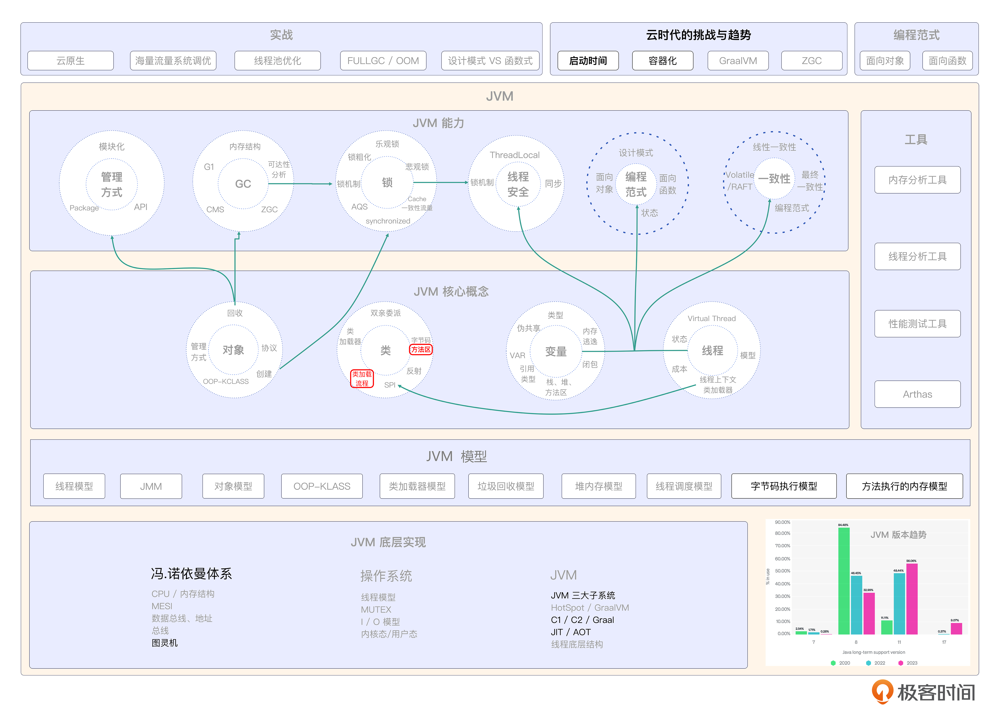

# 06｜类加载子系统 （上）：类加载的流程与机制
你好，我是康杨。今天这节课我们来聊聊JVM中的类加载流程和机制。

类加载子系统可以看作是JVM的搬运工。通过使用Javac编译器，我们将编写的代码转换为.class文件，这样类就可以被真正地加载到JVM中，从而实现高效地运行。借助类加载流程，我们将.class文件中的数据结构存储到了运行时的方法区中，作为后续Java程序运行的基础。


## 方法区

这里的方法区其实是一个逻辑空间的概念，并不是真实的物理空间。

因为在 JDK 7 之前，方法区也被称为永久代（PermGen），作为堆内存的一部分分配。由于在某些场景下可能导致永久代内存溢出，因此后续版本的 JVM 对其进行了优化。 到了JDK 8，方法区的概念经过改进，不再叫做永久代，而是改为元空间（Metaspace）。

方法区包含4类信息。

1. 类的元数据，包括类的结构信息、访问权限、字段和方法等。
2. 静态变量，类的静态变量，即在类级别共享的变量。
3. 类的方法信息、构造函数。
4. 最后是运行时常量池，它是一种存储编译时常量和引用的数据结构，主要包括字符串常量、数值常量、类引用、字段引用、方法引用等。运行时常量池在类被加载时自动创建，并在运行时被 JVM 使用。

因为方法区里存储了类的元数据和静态变量等，所以平时在开发的时候你需要关注方法区的内存使用，避免大量加载类以及定义过多的静态变量导致内存不足。最后还要避免类初始化的循环引用，创建类时，确保类之间的引用关系没有循环，否则可能导致类初始化阻塞。

你可以通过下面的Java 代码获取方法区的内存使用情况及元空间信息。

```java
public class MethodAreaExample {
    public static void main(String[] args) {
        MemoryMXBean memoryMXBean = ManagementFactory.getMemoryMXBean();
        MemoryUsage nonHeapMemoryUsage = memoryMXBean.getNonHeapMemoryUsage();
        MemoryPoolMXBean metaspaceMemoryPoolBean = null;

        for (MemoryPoolMXBean memoryPoolBean : ManagementFactory.getMemoryPoolMXBeans()) {
            if ("Metaspace".equals(memoryPoolBean.getName())) {
                metaspaceMemoryPoolBean = memoryPoolBean;
                break;
            }
        }

        System.out.println("方法区（元空间）信息：");
        System.out.println("方法区（元空间）初始大小: " + nonHeapMemoryUsage.getInit() / 1024 + "KB");
        System.out.println("方法区（元空间）最大大小: " + (nonHeapMemoryUsage.getMax() == -1 ? "无限制" : nonHeapMemoryUsage.getMax() / 1024 + "KB"));
        System.out.println("方法区（元空间）已用大小: " + nonHeapMemoryUsage.getUsed() / 1024 + "KB");

        if (metaspaceMemoryPoolBean != null) {
            System.out.println("\nMetaspace 信息：");
            MemoryUsage metaspaceMemoryUsage = metaspaceMemoryPoolBean.getUsage();
            System.out.println("Metaspace 初始大小: " + metaspaceMemoryUsage.getInit() / 1024 + "KB");
            System.out.println("Metaspace 最大大小: " + (metaspaceMemoryUsage.getMax() == -1 ? "无限制" : metaspaceMemoryUsage.getMax() / 1024 + "KB"));
            System.out.println("Metaspace 已用大小: " + metaspaceMemoryUsage.getUsed() / 1024 + "KB");
        }
    }
}

```

结果输出如下：

```java
方法区（元空间）信息：
方法区（元空间）初始大小: 2496KB
方法区（元空间）最大大小: 无限制
方法区（元空间）已用大小: 4606KB

Metaspace 信息：
Metaspace 初始大小: 0KB
Metaspace 最大大小: 无限制
Metaspace 已用大小: 3225KB

```

## 类加载时机

JVM类加载的时机主要基于 **首次主动使用** 的原则，“首次”涉及多种不同的情况，比如构造一个新的实例、查询一个新的变量、调用一个新的方法等。JVM规范允许类加载器预判到某个类可能马上会被使用，而选择提前加载。

这种设计主要是为了提升系统的性能和效率，因为在程序运行时，并不是所有的类都会被使用，如果提前加载所有的类，不仅会延长加载时间，也会浪费系统资源。通过延迟加载，可以有效节省系统资源，提高程序响应速度。同时，这种策略也避免了因程序错误而导致的系统崩溃，增强了系统的稳定性和健壮性。

## .class文件加载方式

JVM加载.class文件的方式非常灵活，可以根据应用程序的实际需要和运行环境进行选择。比如我们可以从本地系统里直接加载，这是最基本的加载方式，类加载器从本地系统直接读取需要加载的.class文件；也可以通过网络下载.class文件，在分布式系统中，类加载器可以从网络中获取.class文件。通过使用zip、jar等归档文件和专用的数据库，我们可以轻松获得.class文件，并且可以把Java源文件动态编译成类文件，以便在系统中快速访问和使用。

了解这些加载方式有助于我们更好地理解Java程序的运行机制，并在实践中做出合适的技术选型。

## 类加载全流程

类加载主要分为加载、连接、初始化三个步骤。


下面我们就来详细聊下具体的流程。

### 加载

在JVM中，类加载是指把类的二进制数据加载到内存里的过程。这个过程分为三个步骤：查找、转化和生成。

#### 查找

JVM在加载阶段的第一步就是通过一组预先定义的类加载器进行类的查找，它们可以是由系统提供的，也可以是用户自己创建的，它们能够帮助用户快速、准确地搜索到所需的二进制字节流，从而实现类的查找。

#### 转化

JVM在收集到类的二进制信息之后，必须把这些信息转换成一种可以在任何情况下执行的实体模型。在这个转化过程中，JVM将字节流所代表的静态存储结构转换成方法区里的运行时数据结构，也就是类的信息、静态变量、常量等数据，以便后续执行和访问。

#### 生成

JVM将一个特定的java.lang.Class映射到Java堆，以此来提供一个可以访问这个类的入口。在这个阶段，程序的可操作性达到了顶峰，你不仅能够利用已有的类加载器，还能够根据需要使用自己定义的类加载器完成加载。下一节课，我会带你打造一个自定义的类加载器。

### 连接阶段

连接阶段也分为3步，分别为验证阶段、准备阶段和解析阶段。

#### 验证阶段

验证是类加载过程中至关重要的一步，目的是确保被加载的类能够满足虚拟机的需求，并且不会对虚拟机的安全造成任何威胁。一般来说，为了确保类的准确性和完整性，验证过程包括以下几个步骤。

首先 **JVM会对字节流进行严格地文档检查**，确保它们遵循Class的标准。例如，字节流的起始位置必须是0xCAFEBABE，而且它们的版本序列必须和当前的VM相匹配。

在这个步骤中， **JVM会通过语义分析来确保字节码里的内容和Java语言的标准一致**。例如，它将检查一个类的父类是否正确，还有它是否具备Java语言的标准。

在 **字节码验证** 的步骤中，虚拟机将深入研究数据流和控制流，以便准确地识别出程序的正当性、可靠性以及可行性。这个阶段主要是对字节码进行静态分析，确保程序的处理逻辑是正确的。

在 **符号引用验证** 阶段，JVM将检查字节码中的符号名称，确保它们能够被正确地解析，从而确保类、方法和方法之间的调用关系是正确的，确保解析动作的准确性和可靠性。

在验证阶段，虽然可以确保被加载的类的准确性，但并不是必需的。为了更有效地完成类的加载，可以采取一些措施，比如使用 `-Xverifynone` 参数，这样可以有效地减少虚拟机的类加载时间。 **验证阶段对程序的运行期没有直接影响，但它对于虚拟机的安全性和稳定性具有重要意义。**

#### 准备阶段

这个阶段的任务是给类中的静态变量分配空间，并且设置一个初值。这个过程会在JVM的方法区中进行，其中有两点非常重要。

1. 静态变量，在这个阶段会进行内存的分配，意味着这个变量是属于整个类的，不依赖于任何对象实例。然而对于实例变量来说，它们是在创建对象的过程中在Java的堆内存中分配的。
2. 静态变量的初值通常会被设置成这个数据类型的默认值，例如整型的值，它会被初始化为0。而在Java代码中它可能被显式地赋予了一个不同的值。


#### 解析阶段

解析阶段是JVM把类文件中的符号引用改为直接引用的过程。符号引用就是编译阶段使用的一块指示符，用来定位引用的目标。而直接引用则是以指针、偏移量或者句柄的形式，直接指向目标。

在解析阶段，JVM会将类中的符号引用转换成直接引用。这样做的目的是在运行时，JVM就可以方便地访问到实际的对象或者方法。这个过程让JVM能够准确地找到类、字段和方法在内存中的位置，从而完成类的加载和连接流程。

特别值得注意的是， **符号引用和JVM的内存布局无关，而直接引用则是和内存布局相关的。** 同一个符号引用在不同的JVM实例中可能会对应着不同的直接引用。JVM在解析阶段把符号引用转换成实际的内存地址，使JVM能在运行阶段正确地访问和操作类的成员。

### 初始化阶段

在JVM中，当我们在特定情景下需要初始化类时，就会进入初始化阶段。在类的初始化阶段，JVM会执行类的初始化代码，并同步多个线程对同一个类的初始化。类的静态变量的初始化可以在声明时指定初始值，或者在静态代码块中进行。初始化过程会按顺序执行初始化语句，如果类或其父类还未加载和连接，则先进行加载和连接。

### 类加载中的锁机制

类在加载过程中，其实也是会加锁的，这也是一个日常很容易被忽视的问题。为了确保 Java 类的全局唯一性和线程安全，类加载器在加载类的时候使用了锁机制。当多个线程尝试同时加载同一个类时，只有一个线程可以获得类加载的锁，其他线程需要等待，直到那个线程完成类加载操作。

类加载的锁具有良好的性能和可重入性，因为它是基于 ConcurrentHashMap 来实现的。在 Java 7 之前，加载过程是在同一个阶段获取到锁，而在 Java 7 及之后的版本中，锁的粒度细化到了每个加载阶段，提高了性能。

## 重点回顾

JVM的类加载机制就像是将类文件搬进JVM运行时的搬运工，通过加载、连接和初始化等阶段，确保类可以被正常使用，并执行验证、准备和解析等操作，保证程序的正确性和安全性。

方法区存放了类的结构信息、常量池以及类、实例构造函数和接口方法的字节码文件信息。类加载时机是基于“首次主动使用”的原则，只有在需要的时候才会进行类的加载操作，避免性能浪费。类加载全流程包括加载、连接和初始化三个步骤，将类的二进制数据转化为可执行的实体，并生成相关的Class对象，而这个Class对象也是后面我们要学习的反射的基础。类加载中的锁机制确保了类的全局唯一性和线程安全性。

## 思考题

类加载的实际流程有哪些？在什么情况下会执行类的初始化动作？欢迎你把思考后的结果分享到评论区，也欢迎你把这节课的内容分享给其他朋友，我们下节课再见！

## 💡点亮你的知识框架图

