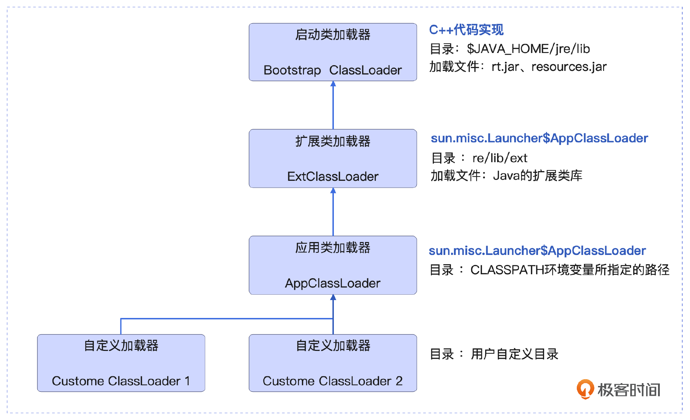
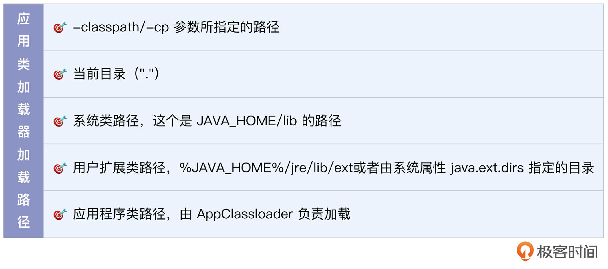
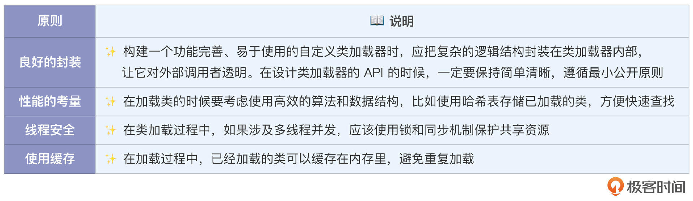
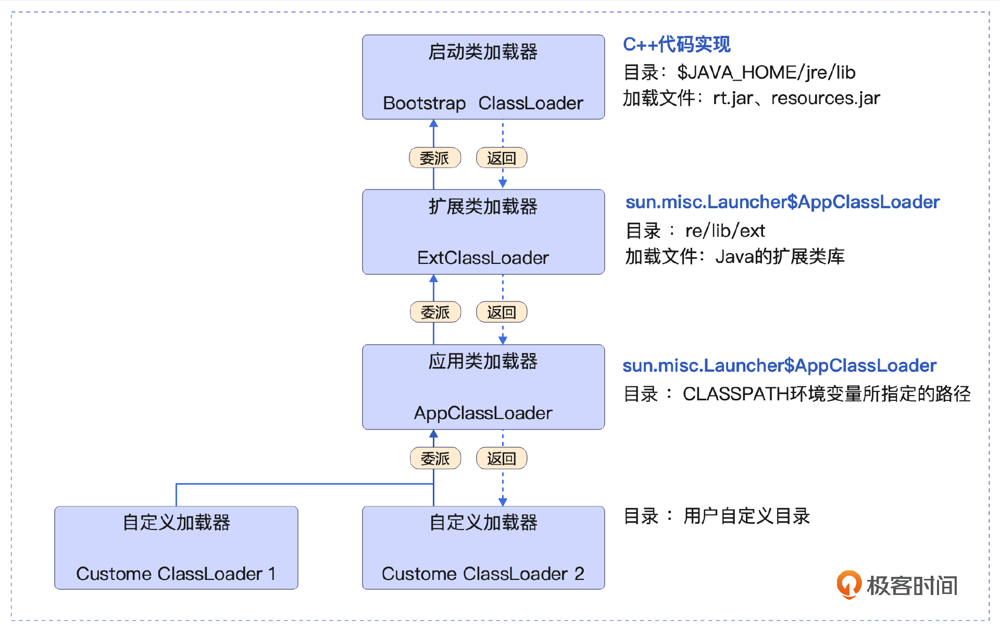
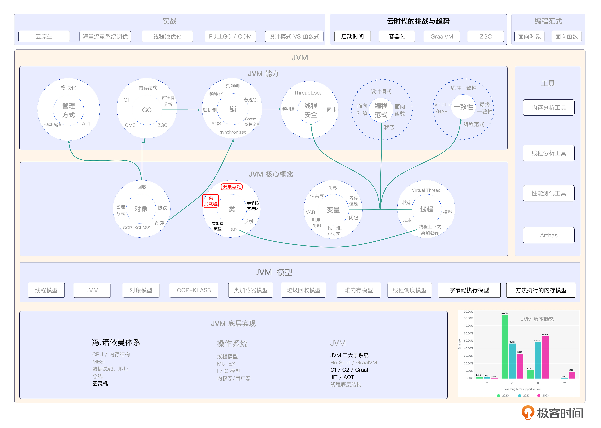

# 07｜类加载子系统（下）：如何打造一个属于你的类加载器？
你好，我是康杨。

上节课我们学习了JVM中的类加载流程和机制，接下来我们一起来执行这个流程的类加载器。在这个过程中，你将了解到JVM中的类加载器家族及其在最新的JVM版本中的演进。最后我还会带你打造一个专属于你自己的自定义类加载器，它可以帮助你更好地管理和使用Java应用程序，提高可靠性和安全性，并满足我们的特定需求。

## 类加载器家族



JVM中的类加载器家族有5个成员，下面我们就来一个个看。

### 启动类加载器（Bootstrap ClassLoader）

这是所有类加载器中唯一一个用C++代码实现的，没有对应的类，也是JVM 实现的一部分，主要负责加载Java 核心库。

### 扩展类加载器（Extension ClassLoader）

扩展类加载器负责加载的目录是 jre/lib/ext，这个目录下的具体文件和类库实际上会因 Java 版本和平台的不同而不同。例如，在 Windows 系统的 Oracle JDK 8 中，通常你可以找到access-bridge-64.jar、cldrdata.jar等文件。

这些文件里主要是Java的扩展类库，包括各种IO、网络协议、加密、字符集支持等等。然而在部分 Linux 发布版和 Docker 环境中，你可能发现 ext 目录是空的。

在Java 9及以后的版本中，由于引入了新的模块系统，这个机制发生了一些变化。JDK 9 之后的版本不再有 jre/lib/ext 这个路径，扩展类加载器也被平台类加载器（Platform ClassLoader）替代。

### 应用类加载器（Application ClassLoader）

应用类加载器应该是我们日常接触最多的类加载器，也是系统默认的类加载器，ClassLoader.getSystemClassLoader() 系统类加载器说的就是它，你可以直接使用。

应用类加载器主要从哪些路径加载呢？我整理在表格中了，你可以参考。



例如，如果我们编译一个名为 com.future.Food 的 Java 类，把它放在当前目录下名为 classes 的目录里，在命令行中，我们可以通过运行 `java -cp ./classes com.future.Food` 来加载和运行这个类。

当我们使用IDE（如Eclipse、IntelliJ IDEA等）开发Java应用程序的时候，IDE通常会自动设定CLASSPATH，这个 CLASSPATH 里有项目的bin或target（由构建工具如Maven、Gradle设定）目录以及所有的依赖库。

## 自定义类加载器

复杂的日常工作中会存在一些场景，没办法用上述的类加载器来完成类加载的工作，这时候我们可以根据业务需求来打造一个自定义类加载器，满足特定场景的定制化需求。

要想打造一个线上核心业务系统的自定义类加载器，需要遵循一些重要的设计原则。



除了这些需要遵守的原则，你还需要注意规避几个常见的错误。首先在重写 loadClass() 方法的时候，要 **确保优先委托给父类加载器，否则，可能会导致类的重复加载和类版本不一致等问题。还有在自定义类加载器的实现中，需要对异常情况进行良好的处理**，比如类未找到、读取文件错误等。这些异常一般需要抛出一个 java.lang.ClassNotFoundException，方便上层调用者进行相应的处理。

下面我实现了一个完整的实例，你可以参考下。

```java
import java.io.*;
import java.util.HashMap;
// 自定义ClassLoader类，继承自ClassLoader
public class CustomClassLoader extends ClassLoader {
    // 定义了类文件的根路径
    private String rootDir;
    // 缓存已经加载的类
    private HashMap<String, Class<?>> loadedClasses;

    /**
     * Constructor
     * @param rootDir 类文件的根目录路径
     */
    public CustomClassLoader(String rootDir) {
        this.rootDir = rootDir;
        // 初始化缓存Hashmap
        loadedClasses = new HashMap<>();
    }
    /**
     * 加载类文件并返回Class实例
     * @param className 类的全限定名
     * @return 加载的类的Class实例
     * @throws ClassNotFoundException 如果类未被找到或加载
     */
    @Override
    protected Class<?> findClass(String className) throws ClassNotFoundException {
        // 从已加载的类缓存中查找类
        Class<?> loadedClass = loadedClasses.get(className);
        // 如果类已经被加载，从缓存中返回
        if (loadedClass != null) {
            return loadedClass;
        }
        // 否则读取类文件的字节码
        byte[] classBytes = getClassBytes(className);
        if (classBytes == null) {
            throw new ClassNotFoundException();
        }
        // 在锁定的环境中，定义类并将类放入已加载的类缓存中
        synchronized (loadedClasses) {
            loadedClass = defineClass(className, classBytes, 0, classBytes.length);
            loadedClasses.put(className, loadedClass);
        }
        return loadedClass;
    }
    /**
     * 根据类名读取类文件的字节码
     * @param className 类的全名（包括包名）
     * @return 类文件的字节码
     */
    private byte[] getClassBytes(String className) {
        // 将全名转换为文件名
        String classPath = rootDir + '/' +
                className.replace('.', '/') + ".class";
        FileInputStream fis = null;
        ByteArrayOutputStream baos = null;
        try {
            fis = new FileInputStream(classPath);
            baos = new ByteArrayOutputStream();
            byte[] buffer = new byte[1024];
            int bytesRead;
            // 循环读取文件直到文件结束
            while ((bytesRead = fis.read(buffer)) != -1) {
                baos.write(buffer, 0, bytesRead);
            }
            // 返回字节流的字节数组
            return baos.toByteArray();
        } catch (IOException e) {
            e.printStackTrace();
        } finally {
            // 关闭资源
            try {
                if (fis != null) {
                    fis.close();
                }
                if (baos != null) {
                    baos.close();
                }
            } catch (IOException e2) {
                e2.printStackTrace();
            }
        }
        return null;
    }
    public static void main(String[] args) {
        // 创建新的CustomClassLoader实例
        CustomClassLoader customClassLoader = new CustomClassLoader("/path/to/classes");
        try {
            // 通过自定义的类加载器加载一个类，输出其类名
            Class<?> sampleClass = customClassLoader.loadClass("com.example.SampleClass");
            System.out.println("Class loaded successfully: " + sampleClass.getName());
        } catch (ClassNotFoundException e) {
            e.printStackTrace();
        }
    }
}

```

你可以动动手跟着我一起实现这个自定义的类加载器，欢迎你把你的代码分享到评论区。

## 双亲委派模型

双亲委派模型是JVM类加载器进行类加载时遵循的基本原则。当类加载器需要加载一个类时，它会先将加载请求委派给父类加载器，如果父类加载器能够加载成功，则直接返回加载的类。只有当父类加载器没办法加载的时候，才由当前类加载器尝试加载。

通过双亲委派模型，核心类库由启动类加载器加载，避免不可信的类对核心类库造成破坏。同时，通过这种有层次的类加载器结构，确保同一个类只会被加载一次，保证了类的一致性。

### 核心流程

1. 类加载请求：当 Class.forName() 或ClassLoader.loadClass() 方法被调用时，类加载器会根据类的全限定名来加载类。
2. 委派给父类加载器：类加载器首先将加载请求委派给父类加载器进行处理。
3. 父类加载器处理：父类加载器按照相同的委派机制，将加载请求继续委派给其父类加载器，直至达到顶层的启动类加载器。
4. 加载类：如果父类加载器无法加载类，当前类加载器会尝试自己加载类。如果加载成功，就返回加载的 Class 对象；如果加载失败，将会抛出 ClassNotFoundException 异常。



### 应用场景

双亲委派模型主要应用于哪些场景呢？

1. **类加载隔离：** 通过使用不同的类加载器加载不同的类，实现类加载的隔离性，避免类之间的互相影响和冲突。
2. **安全沙箱隔离** 通过自定义类加载器实现安全沙箱的机制，对不可信的类进行隔离加载和限制权限，提高系统的安全性。
3. **动态扩展和插件化** 通过自定义类加载器实现动态加载和卸载功能，实现系统的动态扩展和插件化，提升程序的灵活性和可扩展性。
4. **多版本隔离** 通过使用不同的类加载器加载不同版本的类，实现在同一个程序中使用不同版本的库文件，避免版本冲突。

### 限制

不过这个模型一旦决定了一个类被ClassLoader加载，那么它在运行期间就会一直保持被加载的状态，即使类的定义已经发生了变化也是如此，除非重新启动JVM。因此，这种模型限制了我们动态加载新类的能力。

这种限制的主要原因在于Java内存管理机制的设计。一旦类被加载，它的Class对象就会被ClassLoader持有并缓存起来，只有当ClassLoader、Class对象还有它所有的实例对象全部不可达的时候，GC才会回收这个类。

### Tomcat 为什么能够突破限制？

Tomcat 使用自定义类加载器的方式突破了双亲委派模型的限制。它使用了共同的父加载器（common ClassLoader），隔离了不同的Web模块，使每个Web模块都有自己的类加载器。这样不同Web模块的类可以相互访问，而和父加载器无关。除了Tomcat，SPI机制也是突破双亲委派模型的典型场景，后面我们还会详细介绍。

## 类加载器的演进

随着JVM的迭代，在不同的 JDK 版本中，类加载器也在发生着变化。

从JDK 9开始，JVM 引入了新的模块系统JPMS（Java Platform Module System），将 Java 核心库分成了一系列的模块，每个模块只包含相关的功能，使得代码更加清晰和可维护。原本的引导类加载器也被拆分成了两个不同的加载器，分别是平台类加载器（Platform ClassLoader）和系统类加载器（System ClassLoader）。

而到了JDK 11，为了提高性能，JVM 使用类数据共享（CDS）技术，允许不同的 Java 进程共享相同的 JVM 类元数据。到JDK 17的时候，JVM 则是直接移除了系统类加载器，所有的类加载操作由原本的应用类加载器接管。这个改动简化了 JVM 架构，也减小潜在的安全风险。

## 重点回顾

今天我们介绍了JVM中的类加载器家族，包括引导类加载器、扩展类加载器和应用类加载器。引导类加载器负责加载Java核心库，扩展类加载器负责加载Java扩展库，应用类加载器是系统默认的类加载器。

除了系统提供的类加载器，我们还可以自定义类加载器来满足特定的业务需求。此外我们还介绍了双亲委派模型的原则，就是当类加载器需要加载一个类的时候，会先委派给父类加载器，只有父类加载器没办法加载的时候，才由当前类加载器加载。这个模型保证了核心类库的安全性和类的一致性。同时，我们还了解了类加载器的演进，在不同的JDK版本中，类加载器也有所变化，比如引入模块系统和类数据共享等。

## 思考题

1. 为什么要使用双亲委派模型进行类加载？它的优势是什么？
2. 在JDK的演进过程中，类加载器发生了哪些变化？

欢迎你把答案分享到评论区，也欢迎你把这节课的内容分享给需要的朋友，邀请他们一起学习，我们下节课再见！

## 💡 点亮你的知识框架图

