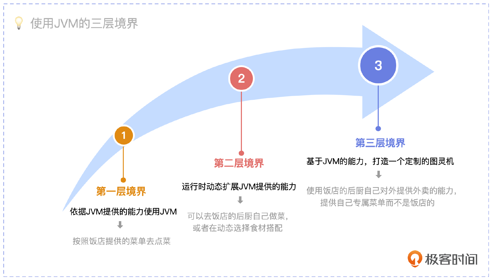
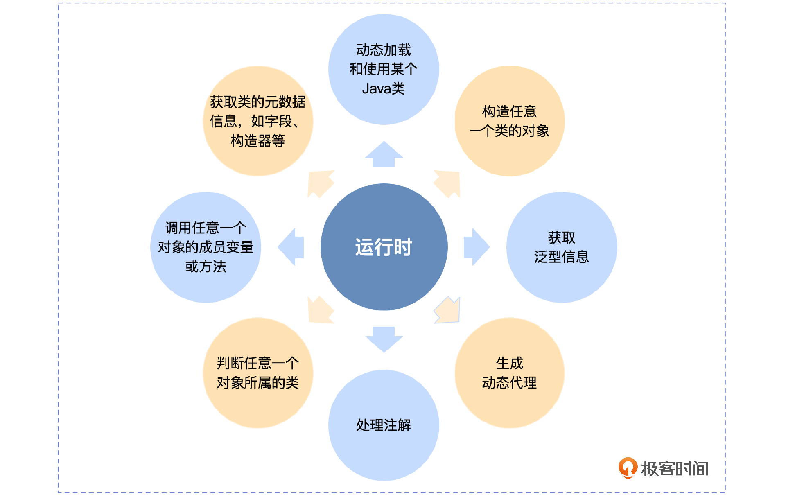
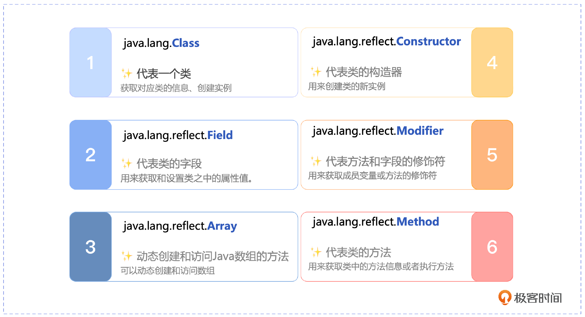
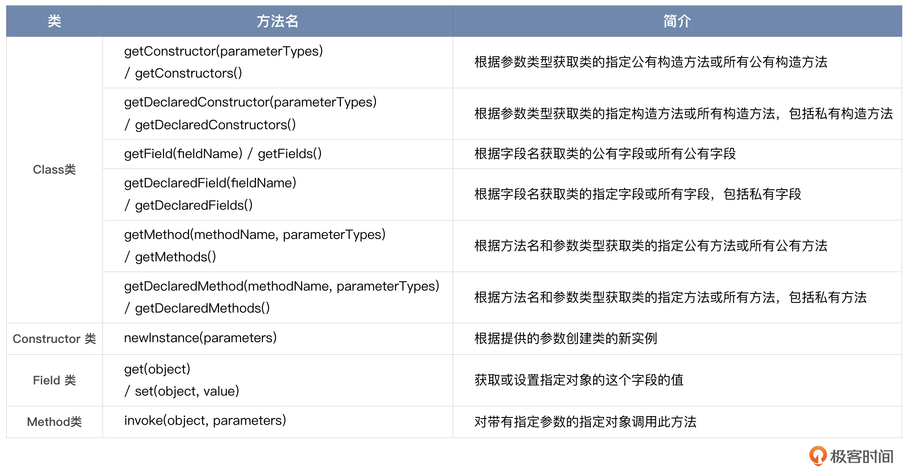
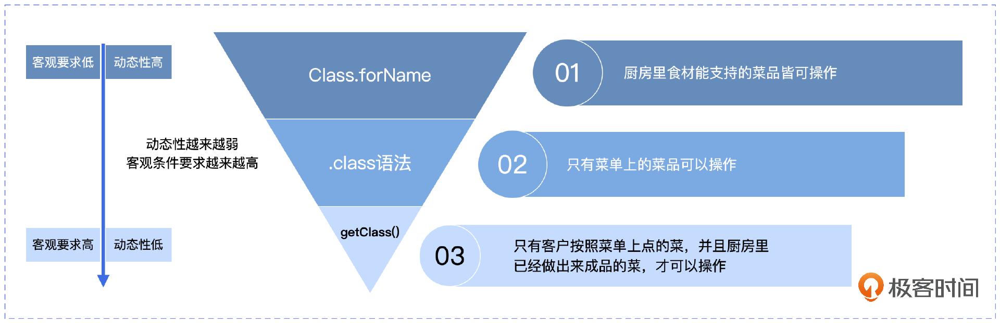

# 08｜反射机制：给你一把打开JVM后门的钥匙
你好，我是康杨，今天我们来聊聊JVM中的反射机制。

在有反射之前，JVM对我们来说就像是一个黑盒。我们与它的交互，仅仅是在编译期之前，我们遵照Java语法写了一段程序，之后JVM如何编译，运行期如何执行我们不得而知，也和我们无关。这就像我们进入一家饭店 ，服务员递给我们一份菜单，我们能做的就是照着菜单去点菜，对于普通的消费者，一份精美菜单已经足够了。

就像下面这段代码 ，我们不需要做任何事情，构造器不用传入任何参数，就能得到一份蘸酱小黄瓜。

```java
// 蘸酱小黄瓜
public class DippedSauceCucumbers {
    private String  mainIngredient = "黄瓜";
    private String  dippingSauce = "豆瓣酱";
    private String  menu ="";

    public DippedSauceCucumbers() {
        setMenu();
    }
    // 设置菜单
    private void  setMenu() {
        menu = "蘸酱小黄瓜{" +
                "mainIngredient='" + mainIngredient + '\'' +
                ", dippingSauce='" + dippingSauce + '\'' +
                '}';
    }
    // 打印菜单
    public void printMenu(){
         System.out.printf(menu);
    }
    public static void main(String[] args) throws  Exception {
        DippedSauceCucumbers dippedSauceCucumbers = new DippedSauceCucumbers();
        dippedSauceCucumbers.printMenu();
    }
}

```

运行上面的代码输出的结果如下：

```java
蘸酱小黄瓜{mainIngredient='黄瓜', dippingSauce='豆瓣酱’}

```

但如果你希望菜单中的蘸酱小黄瓜不是豆瓣酱，而是沙拉酱，通常情况下很难得到满足。就像上面的DippedSauceCucumbers类 ，其中的dippingSauce字段，也就是酱料的属性，没有提供给我们任何改变的入口。

但是，假如你获得了进入后厨的权利，情况就完全不一样了，你可以基于厨房已有的所有食材和设施按需定制。

而如果你进一步得到许可，能够基于厨房已有的能力，打造属于自己的菜单，并提供外卖的服务，那就相当于你拥有了一个属于自己的厨房，而且是在现有的厨房的设施和能力基础之上的。



其实这就是我们开篇词里说的使用JVM的三层境界。我们熟悉的 Spring 框架就是图中的第三层境界，它就是基于JVM这个机器的能力打造的一个全新的机器。而理论上你也可以继续基于Spring提供的能力，打造专注于某个特定领域的图灵机。

当然，在此之前你需要熟练掌握JVM的反射机制，因为不管是使用JVM的第二层境界还是第三层境界，都离不开今天的主角： 反射机制。

## 反射是什么？

反射（Reflection）是JVM提供的运行时机制 ，它允许程序在 **运行期** 借助 Reflection API 动态加载类或获取任何类的内部信息，动态创建对象并调用其属性，即使对象类型在编译期还是未知的。而我们通常写的程序，对象的类型是在编译期就确定下来的。就像上面说到的饭店的菜单，每道菜品是固定的，无法变更。

而反射赋予了我们动态创建菜品和调整菜品的能力。所以说，虽然Java是一种静态语言，但是 **反射机制的存在使Java也具有了动态性**，具备了运行时自我认知的能力。这样我们就可以在运行时观察甚至修改JVM的行为。就像进入饭店的后厨，可以观察甚至调整我们的菜品。

JVM的反射机制主要为我们提供了八种能力。



## 反射的实现原理

反射机制的实现依赖于我们前两节课讲过的类加载机制，我们知道类加载的结果，除了把类的.class 文件中的二进制数据读入内存，并放到运行时数据区的方法区，JVM还为我们在堆上创建了一个java.lang.Class 对象，用来封装类在方法区内的数据结构，并且向我们提供了访问方法区内的数据结构的接口。

这个Class对象就是反射机制的核心，它就像打开JVM这个厨房的钥匙，赋予了我们打造专属于自己的菜品的能力。是不是感觉很酷，那我们应该怎么更好地利用这种能力呢？

## 反射API

这种动态的能力是反射的API提供给我们的。除了java.lang.Class类，反射API主要集中在java.lang.reflect包中。





## **反射执行步骤**

有了上述API ，我们可以按下面的步骤完成反射机制的调用。

1. 我们需要先获取想要操作的类的 Class 对象。
2. 通过调用 Class 类中的方法，获得我们需要的Method、Field类对象。
3. 借助反射API，操作这些对象，完成定制。

现在，掌握了反射的力量，我们终于可以打造沙拉酱版的蘸酱小黄瓜。

```java
// 沙拉酱版本的蘸酱小黄瓜
public static  DippedSauceCucumbers  createCustomizedFood() throws Exception{

    //第一步：获取Class对象，就像拿到了进入饭店后厨的钥匙
    Class dippedSauceCucumbersClass = DippedSauceCucumbers.class;

    //第二步：用反射的方式生产一个DippedSauceCucumbers对象，就像我们去后厨自己做了一份蘸酱小黄瓜
    Object dippedSauceCucumbers = dippedSauceCucumbersClass.newInstance();

    //第三步：因为已经身在厨房，我们可以随意调换成我们喜欢的酱料，小小的菜单已经不能约束我们丰富的想象力了 ^_^
    Field dippingSauceField = dippedSauceCucumbersClass.getDeclaredField("dippingSauce");
    dippingSauceField.setAccessible(true);
    dippingSauceField.set(dippedSauceCucumbers,"沙拉酱");

    //第四步：基于我们调换的酱料，重新生成沙拉酱版本的蘸酱小黄瓜的菜单
    Method setMenuMethod = dippedSauceCucumbersClass.getDeclaredMethod("setMenu");
    setMenuMethod.setAccessible(true);
    setMenuMethod.invoke(dippedSauceCucumbers);

    return  (DippedSauceCucumbers)dippedSauceCucumbers;
}

public static void main(String[] args) throws  Exception {
    DippedSauceCucumbers dippedSauceCucumbers =  DippedSauceCucumbers.createCustomizedFood();
    dippedSauceCucumbers.printMenu();
}

```

运行结果：

```java
蘸酱小黄瓜{mainIngredient='黄瓜', dippingSauce='沙拉酱’}

```

借助反射，我们终于得到了我们想要的沙拉酱版本的蘸酱小黄瓜。既然反射这么强大，它还具备哪些能力呢？让我们一起深挖一下。

## 反射API详解

### Java.lang.Class

首先我们来了解下Java.lang.Class，作为反射机制的核心，它也是我们使用反射机制的入口，就像我们进入饭店后厨的那把钥匙。

#### 获取Class对象

获得这把钥匙的方式有3种。

1. Class.forName

使用 Class 类的静态方法 forName(String className)，这种方法需要传入类的全限定名，可以动态加载类，并触发静态代码块的执行，一般用于加载驱动和框架的底层操作。但是因为这个方法可能会抛出ClassNotFoundException异常，所以你需要处理这种可能性，看一下我给出的示例代码。

```java
try {
    Class clazz = Class.forName("com.restaurant.DippedSauceCucumbers");
    System.out.println("Full name of DippedSauceCucumbers class is: " + clazz.getName());
} catch(ClassNotFoundException e) {
    e.printStackTrace();
}

```

1. .class语法

对于任何类型的.class都可以获取对应的Class对象。这是最直接、最简单的方式，不需要处理异常，但弊端也很明显，就是必须在编译期就知道具体的类，类似于厨房里本可以提供100道菜，但是菜单上只是写了10道菜，而你只能操作这菜单上面的10道菜，动态性大打折扣。

```java
Class clazz = DippedSauceCucumbers.class;
System.out.println("Simple name of DippedSauceCucumbers class is: " + clazz.getSimpleName());

```

1. Object类的方法 getClass()

这个方法是被所有Obect子类继承的，通过getClass() 方法就可以获取Class对象，所有对象都继承了Object的这个方法。

```java
DippedSauceCucumbers  dippedSauceCucumbers= new DippedSauceCucumbers();
Class clazz = dippedSauceCucumbers.getClass();
System.out.println("Type of  object is: " + clazz.getSimpleName());

```

这种方法不需要类的完全限定名，只需要获取对象实例的类型。但是，你需要一个对象实例，所以在没有实例的情况下这种方法就没办法使用了。



### Constructor类

拥有了Class对象，我们就可以借此进一步获取一个类的Constructor、Method、Filed等信息，以构造器为例，我们可以通过4种方法获得。

1. 使用Class类的getConstructor方法，这个方法返回指定参数类型的public构造函数，安全性较高，但是无法获取到private和protected的构造函数。
2. 使用Class类的getConstructors方法，这个方法返回类中的所有public构造函数，使用起来简单便捷，但是无法获取到非public的构造函数。
3. 使用Class类的getDeclaredConstructor方法，这个方法返回指定参数类型的所有构造函数，不仅限于public构造函数。这种方式可以获取所有声明的构造函数，包括public、protected、default以及private。但是使用不当可能会访问到本不应该被访问到的构造函数，导致安全问题。
4. 使用Class类的getDeclaredConstructors方法，这个方法返回类中的所有构造函数，包括非public的。这种方式可以获取到所有声明的构造函数，包括public、protected、default以及private，是最全面的获取构造函数的方法。但是使用不当可能会访问到本不应该被访问到的构造函数，导致安全问题。

我写了一个简单的例子，你可以看一下。

```java
Class clazz = DippedSauceCucumbers.class;
// 获取public的、无参的构造函数
Constructor constructor1 = clazz.getConstructor();
// 获取所有的public构造函数
Constructor[] constructors1 = clazz.getConstructors();
// 获取所有的构造函数，包括非public的
Constructor[] constructors2 = clazz.getDeclaredConstructors();

```

Method、Filed 等方式的API使用和这个差不多，有兴趣的话你可以参照反射API尝试使用。

## 反射应用场景

反射机制有非常丰富的应用场景，按照我们在前面提到的使用JVM的三层境界，我们一起来看看反射机制是怎么助力我们在第二层和第三层境界上使用JVM的。

### 第二层境界：运行时动态扩展JVM的提供能力

#### 动态创建对象

当需要基于运行时的条件创建不同类型的对象时，反射机制是必需的。

创建对象有两种方法。

1. 使用 Class 对象的 newInstance()方法来创建该 Class 对象对应类的实例，但是这种方法要求该Class 对象对应的类有默认的空构造器。
2. 先使用 Class 对象获取指定的 Constructor 对象，再调用 Constructor 对象的 newInstance()方法来创建 Class 对象对应类的实例，通过这种方法可以选定构造方法创建实例。

```java
//获取 DippedSauceCucumbers 类的 Class 对象
Class clazz=Class.forName("com.restaurant.DippedSauceCucumbers");
//使用.newInstane 方法创建对象
DippedSauceCucumbers dippedSauceCucumbers_1=(DippedSauceCucumbers) clazz.newInstance();
//获取构造方法并创建对象
Constructor c=clazz.getDeclaredConstructor();
//创建对象并设置属性
DippedSauceCucumbers dippedSauceCucumbers_2=(DippedSauceCucumbers) c.newInstance();

```

#### 通过反射动态创建和访问数组

```java
Class<?>   DippedSauceCucumbersCls=Class.forName("com.restaurant.DippedSauceCucumbers");
Object array= Array.newInstance(DippedSauceCucumbersCls, 5);
Array.set(array, 4, new DippedSauceCucumbers());
System.out.println(Array.get(array, 4));

```

代码中Array.newInstance(DippedSauceCucumbersCls, 5);表示创建一个 **DippedSauceCucumbers** 类型大小为5的数组。

### 第三层境界：基于JVM提供的能力打造一个定制的图灵机

其实我们非常熟悉的Spring框架 ，正是借助反射机制，实现了我们说的使用JVM的第三层境界。Spring封装了JVM底层的能力，通过Bean对外提供服务，而不是使用Java的Object，这里的Bean就像我们封装了饭店后厨的能力打造的新菜单。

而这一切都离不开反射机制的支持，不管是依赖注入还是AOP编程，都使用到了反射机制。比如在依赖注入时，Spring会通过反射调用Bean的setter方法或者构造器来实现依赖关系的注入；在AOP编程中，Spring则是通过反射调用目标方法，并在调用之前或之后添加增强处理，从而实现面向切面编程。

为了方便你看清其中的本质，我把反射在Spring中的应用过程抽象成了3个步骤。

第一步：Spring通过反射的方式创建Bean实例。在Spring中，对于配置的Bean，其创建工作是由BeanFactory完成的。在AbstractBeanFactory类的doCreateBean方法中，调用createBeanInstance方法创建Bean实例，这个过程使用了反射技术。

```java
protected Object createBeanInstance(String beanName, RootBeanDefinition mbd, @Nullable Object[] args) {
// 确定构造器
Constructor<?> constructorToUse;
...
// 实例化bean
return getInstantiationStrategy().instantiate(mbd, beanName, this.beanFactory, constructorToUse, args);
}

```

第二步：Spring通过反射设置属性值。在BeanPostProcessor后置处理器中，Spring会读取属性配置，使用反射调用set方法为Bean的属性设置值。

```java
public class AutowiredAnnotationBeanPostProcessor extends InjectionMetadata.InjectedElement {
@Override
    protected void inject(Object bean, @Nullable String beanName, @Nullable PropertyValues pvs) throws Throwable {
        Field field = (Field) this.member;
        Object value;
         ...
        ReflectionUtils.makeAccessible(field);
        field.set(bean, value);
    }
}

```

第三步：Spring通过反射调用Bean的生命周期回调方法，如init-method和destroy-method。

下面是如何通过@Bean注解向Spring注册一个Bean示例，这也是另一个重要的使用反射的地方。

```java
@Configuration
public class AppConfig {
    @Bean
    public MyBean myBean() {
        MyBean myBean = new MyBean();
        myBean.setName("Test Bean");
        myBean.setAge(25);
        return myBean;
    }
}

```

以上@Bean注解的方法返回一个MyBean的实例，Spring会使用反射调用这个方法获取该实例，并且把这个实例注册到Spring IoC容器中。当其他地方需要使用这个Bean的时候，就可以通过@Autowired注解来进行注入。

在实际编程过程中，Spring框架的反射操作相当广泛和复杂，但是基本原理都是Java的反射机制，通过获取类的Class对象，然后创建实例，设置属性和调用方法。其实不仅仅是Spring，作为半自动ORM框架的代表，MyBatis也是通过反射来完成结果集的映射的，通过反射获取类的元信息，并根据元信息映射成对应的Java对象。

我们日常使用的大多数框架，背后都有反射的身影。所以学习好反射机制，对我们掌握这些框架，甚至打造自己的框架都大有裨益。

## 重点回顾

今天的这节课到这里就结束了，不知道你是否惊诧于反射机制的魅力，它就像JVM为我们打开的一个后门，不仅让我们能一窥究竟，还能得其门而入，一试身手。

但任何事有一利必有一弊，反射带来便利性的同时，会破坏类的封装性、损耗性能，过度使用还会使代码变得更加复杂，降低可维护性，这就注定了我们使用反射机制的时候要更加小心、严格限制。就像顾客们都能随意进入饭店后厨，自己动手，对外发布菜单，那么食品的安全、质量的保障必然会成为一个大问题。

但是无法否认，反射机制给Java这个静态语言带来了语言的动态性。借助反射API，程序可以在运行时取得任何一个已知名称的类的信息，包括它的构造方法、声明的字段和定义的方法等。

反射就像它的英文同义词reflection 一样，如同运行时中Java类在水中的倒影。通过了解运行时Java类的内部结构，赋予了我们与运行中的Java类进行交互的能力，使我们不仅能通过反射机制动态创建一个新的对象，还可以动态调用一个运行中的对象的方法等。这种与源码级调用等效的方式，极大地提升了Java程序在运行态的灵活性。

所以熟练掌握反射机制，去领悟JDK源码还有开源框架中反射机制的那些巧妙应用，一定会提升我们的编码能力，并帮助我们早日打造出属于自己的框架，实现对JVM使用的第三层境界。

## 思考题

学而不思则罔，学完这节课之后，我给你留两个问题。

1. 获取一个class对象不同方式的差异点在哪儿？
2. 如何通过反射机制获取某个类以及它继承的类的所有公有字段？

希望你认真思考，然后把思考后的结果分享到评论区，我们一起讨论，如果有收获的话，也欢迎你把这节课的内容分享给需要的朋友，我们下节课再见！

## 💡点亮你的知识框架图

