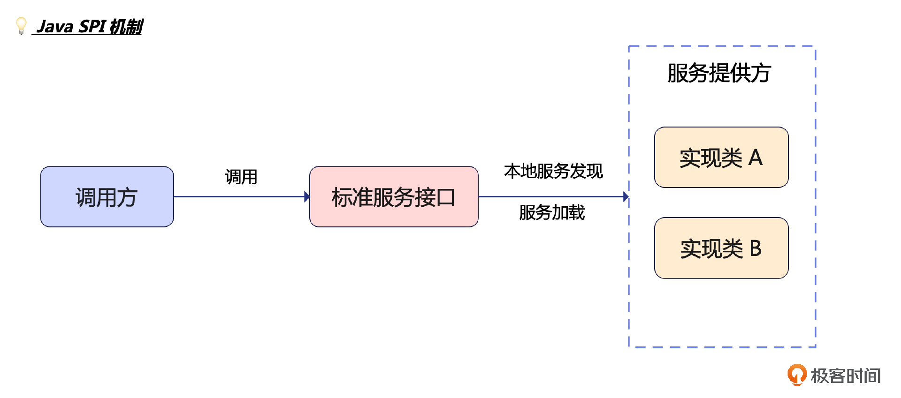
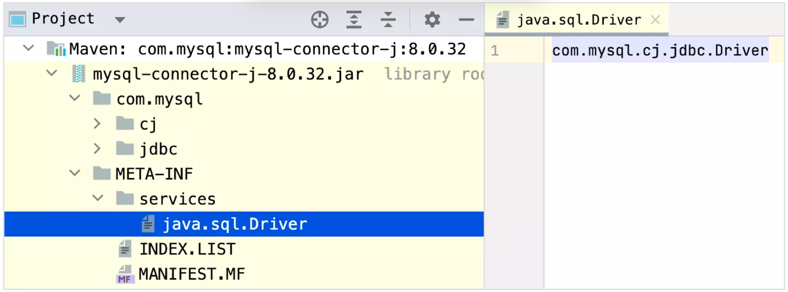
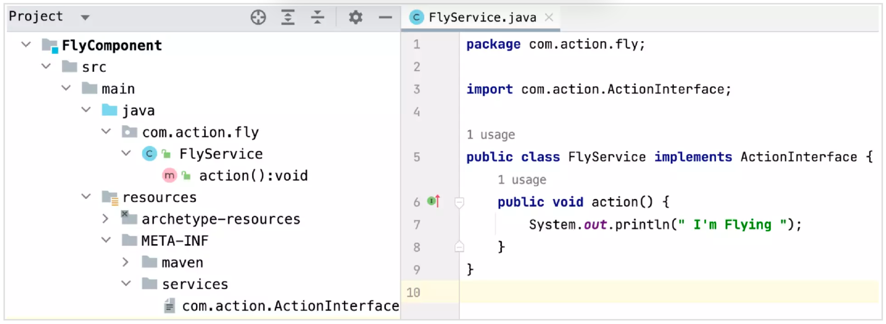
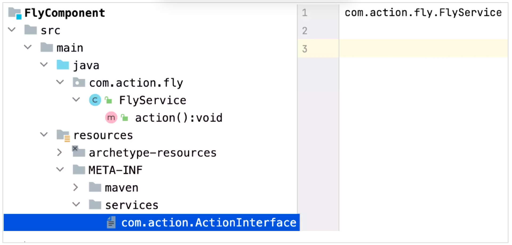
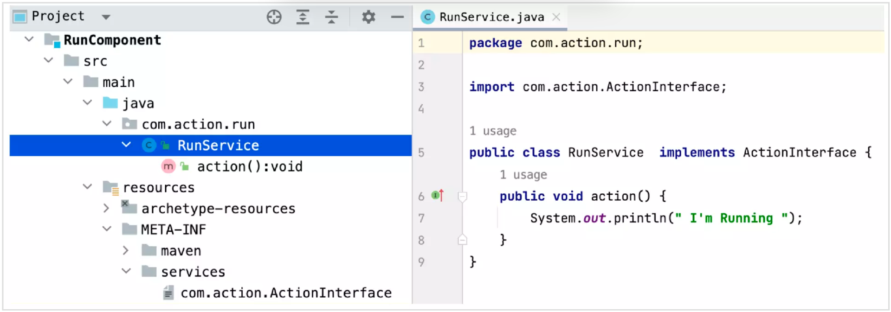
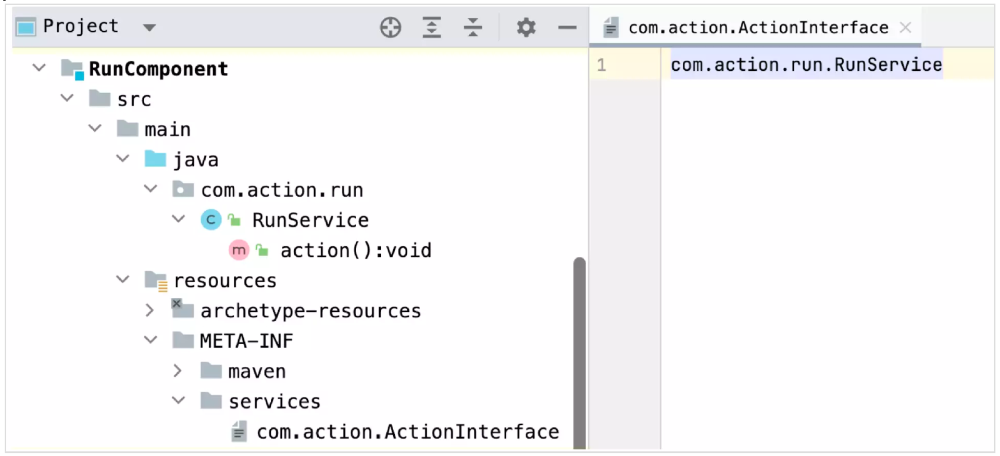
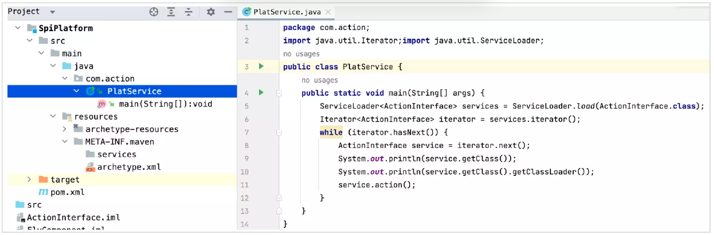
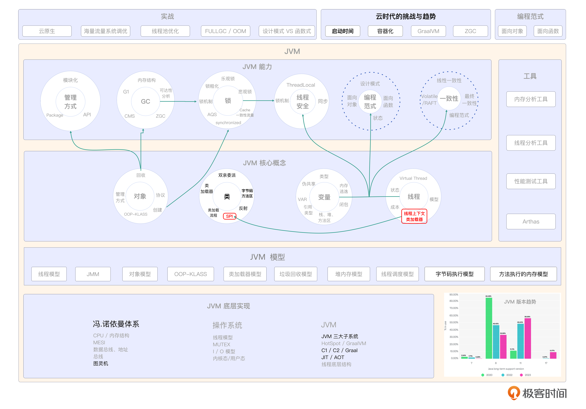

# 09｜SPI机制：如何打造一个属于你的SPI程序？
你好，我是康杨，今天我们来聊聊SPI。

SPI（Service Provider Interface）是一种服务发现机制，它允许应用程序在运行时动态地发现和加载实现某个接口的服务提供者。这里有两个关键词需要你特别关注，分别是“运行时”和“动态”。

作为一门面向对象语言，Java虽然也提供了类似多态这样的动态机制，但是那是在编译时就已经决定了具体的服务提供方的一种方式，虽然能满足我们大部分关于动态的需求，但是复杂的现实环境依然存在需要在运行时才能决定服务提供者的需求，而这正是SPI的价值所在。

## SPI 和 API 有什么不同？

SPI看上去和我们熟知的API很像，所以当很多人谈到SPI时，经常拿API来和它作对比，下面我们就比较下两者的异同。相信对比之后，你对SPI的价值会有更深刻的理解。

- SPI 是一种编程模式，用于定义和实现可插拔的服务提供者。它允许开发人员为特定的接口定义多个实现，并在运行时选择使用哪个实现。
- API 目的是为开发人员提供一种简化和标准化的方式来使用现有功能和服务，以便更轻松地构建应用程序。

如果还不太容易理解，我可以给你举例说明一下，API模式下你可以把自己想象成一个顾客，主厨就是开发者，他按照自己的喜好和经验为你提供了美食，这时候你只需要好好享用美食就可以了，当然这种模式下你享受的美食是在主厨的能力范围内的，比如这个主厨擅长西餐而你想吃一碗羊肉泡馍显然是不可以的，只能是主厨提供什么你就吃什么。而SPI模式，你的角色其实并不是开发者而是帮厨，或者说是美食的共建者，这种情况下主厨只是告诉你一份美食所应该遵守的规范，比如一份健康的料理所遵守的原则，而如何真正去打造出一款美食，就要靠你自己来实现了。

回到SPI和API，就是说，开发者在使用SPI时，需要实现特定接口，并把它注册到应用程序中。然后在运行时应用程序可以通过配置文件或其他机制选择使用哪个实现。而使用API时，开发人员只需要了解API的规则和约定，并使用它提供的方法和函数来调用所需的功能就可以了。所以 **SPI 常用于框架和库的设计中，以便开发者根据自己的需求扩展和定制功能**，而API常用于公共服务和第三方库的设计中，以便其他开发人员可以使用和集成这些功能。

那SPI是如何做到灵活扩展的呢？下面我们深入它的原理来解读一下。

## SPI 原理

基于“约定大于配置”的设计思想，SPI通过在类路径下预先定义好接口和服务提供者的实现类，使应用程序可以在运行时自动发现和使用这些服务，而无需手动配置。 它是如何实现的呢？我们一起来看看。

### 双亲委派模型失效

JVM的双亲委派模型，虽然在大多数场景下都能满足我们类加载的需求，但是某些场景，特别是在SPI的场景下，采用双亲委派模型会引发一些问题。

SPI是一种服务扩展机制，允许开发者在不修改接口的情况下，通过实现指定接口来扩展框架或库的功能。它的核心思想就是“约定大于配置”，在类路径下提供META-INF/services目录，并在该目录中定义接口的实现类来注册服务提供者。

但是，根据双亲委派模型的规定，当一个接口的实现类位于父类加载器加载的类路径下时，子类记载器无法加载到该实现类。

由于SPI 接口通常由 Java 核心库提供，而 SPI 的实现则由应用依赖的第三方 jar 引入。所以SPI 的接口是由 Bootstrap ClassLoader 加载的，而 SPI 的实现类一般是通过 Application ClassLoader 加载的。根据双亲委派模型，我们发现Bootstrap ClassLoader是无法反向找到 SPI 的实现类的，因为它只能加载 Java 核心库，而恰恰是因为双亲委派模型的单向限定，它不能反向委派给 Application ClassLoader 进行加载，导致双亲委派模型无法解决这个问题。

### 线程上下文类加载器

为此 Java 引入 **线程上下文类加载器（Thread Context ClassLoader）** 来解决这个问题。类 java.lang.Thread 中的 getContextClassLoader()和 setContextClassLoader(ClassLoader cl) 用来获取和设置线程的上下文类加载器。

Java 应用运行的初始线程的上下文类加载器是 Application ClassLoader。在线程中运行的代码可以通过这个类加载器来加载类和资源。如果没有通过 setContextClassLoader(ClassLoader cl)方法进行设置的话，线程将继承其父线程的上下文类加载器。通过线程上下文加载器，实现了可以通过父类加载器请求子类加载器去完成类加载器的动作，也就是 **打破了双亲委派模型的限制**。

## SPI 约定中的约定指的是什么？

前面我们介绍原理的时候，说过SPI秉承的是约定大于配置的设计理念，那你有没有想过这里提到的约定指的是什么？

1. SPI的实现类实现一个不带参数的构造函数。
2. 在jar包的META-INF/services目录里创建一个文件，文件以接口的全限定名进行命名，文件内容是实现类的全限定名，方便SPI自动查找和加载实现类。
3. 把包含这个接口实现类的jar包放到主程序的classpath里面。

通过这种“接口的编程＋策略模式＋配置文件”的方式，SPI打破了双亲委派模型，实现了另一种类动态加载机制，使我们可以在运行时动态决定由哪个服务方提供服务，整体流程如下图所示。



## SPI 背后设计思想

现在你知道SPI 究竟是怎么一回事了吧？那在了解SPI这一机制的过程中你有没有联想到什么？如果你对软件开发原则比较熟悉的话，应该能嗅到一丝味道。SPI 机制其实是对软件开发原则和IoC思想很好的应用。

### 开放封闭原则（Open-Closed Principle）

如何设计一个好的软件是大家一直在思考的问题，也沉淀了很多好的解决方案，比如设计模式等，设计模式的基础其实就是我们现在要聊的SOLID软件开发原则。

而SPI正是开放封闭原则很好的实践案例。开放封闭原则要求软件实体（类、模块、函数等）应该对扩展开放，对修改封闭。这意味着我们应该 **通过添加新的代码来扩展功能，而不是修改已有的代码。** 通过遵循这一原则，我们可以减少对已有代码的影响，提高代码的可维护性和可复用性。而SPI通过运行时动态的特性，在保障接口稳定的基础上，提供了更加灵活的扩展机制，所以在Netty、Duboo、Spring等各种平台类的应用上都能看到SPI的身影。

### 控制反转（Inversion of Control，简称IoC）

IoC也是一种软件设计原则，它将对象的创建、依赖关系的管理从应用程序代码中解耦出来，交给容器负责。从而实现对象之间的解耦。控制反转的核心思想是“反转”，就是把原本由开发人员控制的对象的创建和依赖关系的管理交给容器来控制。SPI正是IoC的思想的一个实践案例，通过提供灵活的接口实现服务定位机制，将应用的装配控制权外移到程序之外，实现了接口定义与实现的解耦，为平台化、模块化设计提供了很好的底层机制。

## MySQL 的实践

我们刚刚也提到了SPI机制的应用范围很广，比如MySQL就很好地应用了这一机制，提升了扩展性和灵活性。下面我们看下mysql-connector的具体实践，可以看到它遵循了SPI的规范，在META-INF/services目录下维护了一个以实现接口名命名的文件java.sql.Driver，表示它实现的是java.sql.Driver这个接口，具体的实现类的全限定名就是文件里的具体内容com.mysql.cj.jdbc.Driver。你可以通过下面我给出的代码体会一下。



```plain

package com.mysql.cj.jdbc;

import java.sql.DriverManager;
import java.sql.SQLException;

public class Driver extends NonRegisteringDriver implements java.sql.Driver {
    public Driver() throws SQLException {
    }

    static {
        try {
            DriverManager.registerDriver(new Driver());
        } catch (SQLException var1) {
            throw new RuntimeException("Can't register driver!");
        }
    }
}

```

## 如何打造一个SPI程序？

知道别人是怎么做的还远远不够，好记性不如烂笔头。下面我们就来动动手，打造一个SPI程序。

### 标准接口定义

首先我们新建一个 Maven 工程，并定义一个接口。

```plain
package com.action;

public interface ActionInterface {
    public void action();
}

```

当然pom.xml文件的创建也是必不可少的。

```plain
<project xmlns="http://maven.apache.org/POM/4.0.0" xmlns:xsi="http://www.w3.org/2001/XMLSchema-instance"
  xsi:schemaLocation="http://maven.apache.org/POM/4.0.0 http://maven.apache.org/maven-v4_0_0.xsd">
  <modelVersion>4.0.0</modelVersion>
  <groupId>com.action</groupId>
  <artifactId>ActionInterface</artifactId>
  <version>1.0-SNAPSHOT</version>
</project>

```

### SPI接口实现

#### 开发者 A 的接口实现

接下来，我们假定有一个开发者A，他准备提供 action() 的解决方案，他也创建一个Maven 工程 FlyComponent，然后实现了ActionInterface接口。



开发者A遵循了SPI约定，在实现这个接口后，把实现类打成 jar 包，同时在 jar 包中创建了一个文件夹，名字是 META-INF/services，里面有个文件，文件名字为待实现接口的全限定名com.action.ActionInterface，这个文件里只有一行内容，是 com.action.fly.FlyService，也就是实现类的全限定名。



pom.xml 文件：

```plain
<project xmlns="http://maven.apache.org/POM/4.0.0" xmlns:xsi="http://www.w3.org/2001/XMLSchema-instance"
  xsi:schemaLocation="http://maven.apache.org/POM/4.0.0 http://maven.apache.org/maven-v4_0_0.xsd">
  <modelVersion>4.0.0</modelVersion>
  <groupId>com.action</groupId>
  <artifactId>FlyComponent</artifactId>
  <version>1.0-SNAPSHOT</version>
  <dependencies>
    <dependency>
      <groupId>com.action</groupId>
      <artifactId>ActionInterface</artifactId>
      <version>1.0-SNAPSHOT</version>
    </dependency>
  </dependencies>
</project>

```

#### 开发者 B 的接口实现

开发者B和开发者A的做法一样，遵循SPI的约定，如法炮制，给出了另一种实现。





pom.xml 文件：

```plain
<project xmlns="http://maven.apache.org/POM/4.0.0" xmlns:xsi="http://www.w3.org/2001/XMLSchema-instance"
  xsi:schemaLocation="http://maven.apache.org/POM/4.0.0 http://maven.apache.org/maven-v4_0_0.xsd">
  <modelVersion>4.0.0</modelVersion>
  <groupId>com.action</groupId>
  <artifactId>RunComponent</artifactId>
  <version>1.0-SNAPSHOT</version>
  <dependencies>
    <dependency>
      <groupId>com.action</groupId>
      <artifactId>ActionInterface</artifactId>
      <version>1.0-SNAPSHOT</version>
    </dependency>
  </dependencies>
</project>

```

#### 在平台中使用

目前同一个接口已经有了两种实现方式，接下来就是在平台上注册和使用他们的时候了，你可以看一下平台层的代码。



添加的 maven 依赖：

```plain
<dependency>
  <groupId>com.action</groupId>
  <artifactId>FlyComponent</artifactId>
  <version>1.0-SNAPSHOT</version>
</dependency>
<dependency>
  <groupId>com.action</groupId>
  <artifactId>RunComponent</artifactId>
  <version>1.0-SNAPSHOT</version>
</dependency>

```

运行结果：

```plain
class com.action.fly.FlyService
sun.misc.Launcher$AppClassLoader@18b4aac2
 I'm Flying
class com.action.run.RunService
sun.misc.Launcher$AppClassLoader@18b4aac2
 I'm Running

```

通过输出结果可以知道，接口的实现类都是由 AppClassLoader 加载的，而接口 Runnable 肯定由根类加载器加载，那么接口和实现类由不同的类加载器加载是怎么做到的呢？答案在 ServiceLoader.load() 方法中，你可以看一下这个方法的源码。

```plain
 public static <S> ServiceLoader<S> load(Class<S> service) {
  ClassLoader cl = Thread.currentThread().getContextClassLoader();
  return ServiceLoader.load(service, cl);
 }

```

加载实现类的类加载器用的是当前线程上绑定的类加载器，如果你没有给当前线程设置自定义的类加载器，那么类加载器默认是 AppClassLoader，AppClassLoader 先委托它的上级，也就是 ExtClassLoader 来加载接口实现类，而ExtClassLoader 也会委托它的上级，也就是根类加载器来做这个事。无论是 ExtClassLoader 还是根类加载器都无法找到接口的实现类，所以最终接口的实现类由 AppClassLoader 加载。

## 重点回顾

今天我们学习了双亲委派模型在平台型应用的局限性，以及如何借助SPI机制，使我们突破这种局限性，实现了运行时动态扩展程序的能力。

SPI的核心思想在于解耦，同时它也是开发封闭原则和控制反转思想很好的践行者，了解这些内容能够帮助我们写出兼具灵活性和稳定性的程序，如果你正在参与开发或者使用一个平台，那么掌握这节课的内容，会对你的日常工作很有帮助。

## 思考题

请你动手打造你的第一个SPI程序，欢迎在评论区晒出你的代码。如果你觉得这节课对你有帮助，也欢迎你把这节课的内容分享给其他朋友，邀他们一起学习，我们下节课再见！

## 💡点亮你的知识框架图

