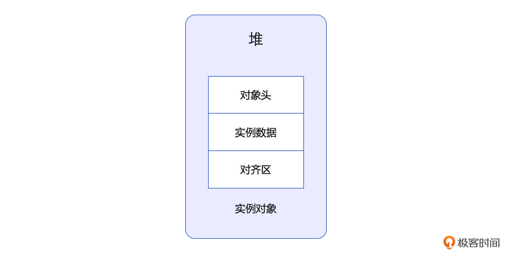

# 10｜对象模型：JVM对象的内部机制和存在方式是怎样的？
你好，我是康杨。

这节课，我们一起来分析下微观环境下的JVM“分子”——对象。我们会先从 Everything  is  object 中的 object讲起，通过协议、模型、应用三部曲带你重新认识JVM中的对象。

对象是我们使用Java的基础，是所有方法和数据的载体，也是我们和Java世界交互的媒介，区别于以往的C、C++语言，即使我们实现一个最简单的“Hello World” 程序，也需要先创建一个Java对象。那这个我们再熟悉不过的对象，在JVM中是以怎样的形态存在的？又是如何影响到我们的日常编码和调优的？带着这些问题，我们一起来开启JVM对象的探索之旅。

## JVM 对象基础协议

### Java 对象的大小

首先请你思考一个问题：一个Java对象有多大？你可能下意识地会觉得一个Java对象的大小没法评估，这取决于它管理了多少属性，而JVM并没有限制一个对象所管理的属性的数量和大小。但其实一个Java对象的大小在JVM中是有一个要求的，那就是 Java对象的大小必须是8字节的整数倍。

**JVM为什么这么要求？又是如何做到的呢？** 这就涉及到了Java对象的基础协议。Java对象协议是JVM对Java对象在JVM中如何存储的规定，协议中规定，在JVM中对象由三个部分构成，分别是对象头、实例数据、对齐区。



### 对象头

对象头也叫 Instance Header，是整个Java对象协议中最复杂的一部分，这部分的协议格式是通过C++定义的。对象头本身又由三部分构成，分别是存储运行时数据的Mark word、指向元数据指针的Klass 以及当对象是数组时，记录数组长度的length。在 32位系统中，对象头的大小是8字节，而在64位的系统中，对象头的大小是16个字节，当然也可以通过指针压缩的方式，压缩到12个字节。当你的JVM中存在大量的对象时，通过指针压缩减少对象的空间占用是一个非常重要的提升性能的手段。

#### 对象运行时数据

对象运行时数据也叫做 Mark word，它是整个对象头中最复杂的部分。首先Mark word是一个非固定的数据结构，以便在最小的空间里存储更多的信息。它的格式就像图中展示的这样。


对象HashCode是一个25位的对象标识码，通过 System.identifyHashCode() 生成，我们知道Object类也有一个生成HashCode的方法hashCode() ，它们之间的区别是无论对象是否重写了hashCode方法，identityHashCode都会返回对象的HashCode。

对象分代年龄这个部分需要关注的是这个值占用的空间大小是4位，这意味着它的最大值是15。那什么时候用它呢？在JVM采用分代收集的垃圾回收算法时，它会记录对象在Survivor区被复制的次数。在YGC中，伴随着每次GC，对象在Survivor区被复制一次，这个值也会加1。当对象被复制的次数超过一定的阈值时，它就会被复制到老年代，这个阈值是通过 `-XX:MaxTenuringThreshold` 来设置的 。默认情况下并行GC时的阈值是15。关于对象垃圾回收的更多信息，我后面介绍对象回收时也会再详细讲解，这里你留个印象就好。

偏向锁用来标识对象是否启用偏向锁标记，这个只占用 1 位二进制，0表示对象没有使用偏向锁，1 表示对象使用了偏向锁。

#### 元数据指针

JVM采用的是OOP-Klass对象模型，这个地方存储的就是指向Klass的指针，正是通过这个指针，JVM 知道当前这个对象是哪一个类的实例。

### 实例数据

实例数据也叫做 Instance Data，这个地方维护着我们在代码中创建的对象的实例字段。在JVM中对象字段主要分为 **基本数据类型** 和 **引用类型** 两种 **。**

表格里的都是基本数据类型。


引用类型是一个类似C++的地址指针，在32位的机器上占用4个字节，在64位的机器上占用8个字节，它指向的是JVM对象在运行时内存中实际的地址。虽然我们日常使用Java编程时，会遇到或者会自己创造各种各样的类型，但是最终在JVM里，只有这8个基本类型和引用类型。

为了简化编程，在Java层我们可以用对象等类型来编程，但是当JVM实际运行的时候在JVM层面的数据类型只有8个基本数据类型和引用类型，也就是说它会把Java层的对象转化成它这层能识别的类型来执行。

当然这不是终点，真正执行的硬件在执行的时候又会转换成硬件层能识别的数据类型来执行。正是因为这样的运行机制，JDK 8 通过引入对象的逃逸分析、标量替换以及栈上分配实现性能的优化，背后依赖的原理正是如此，我们下一讲会详细介绍这部分内容。


### 对象填充区域

为了讲清楚对象填充区域的来龙去脉，我们不得不从CPU开始讲起，就像 [第 1 讲](https://time.geekbang.org/column/article/688563) 我们聊的，JVM是一个虚拟机，它的能力来源于底层的CPU、操作系统，同时这些底层基础设施的特性又会反过来影响JVM中的特性。

首先我们要明确一点，CPU是以字为单位读取数据的，而缓存中的数据是以cacheline为单位从内存中同步到CPU缓存中的。所以内存里数据的存储和存取方式会对CPU的读取产生影响。


如果数据存储的时候未按照地址对齐，很可能出现一种情况，就是当CPU读取的数据存在于0x0002-0x0005的地址空间，而CPU要想读取该数据时，需要先要把地址空间是0x0000-0x0003的数据读取出来，再把地址空间是0x0004-0x0007的部分读取出来，把不需要的数据去掉才能读取到需要的数据，显然这种方式是非常低效的，所以为了提升CPU的效率，在虚拟机里一般会设置默认对齐位。

在HotSpot里这个值是8。HotSpot虚拟机要求所有的对象大小都是8字节的倍数，对象填充区域起到的就是 **补齐填充** 的作用，这也是一个很经典的以空间换时间思想的应用，关于这个思想的其他应用和案例，我也会在后面ThreadLocal部分进一步展开介绍。

刚刚我们了解了JVM中对象的协议，知道JVM中对象的数据是如何存储的，以及JVM对象运行时的信息，比如GC年龄、锁信息是如何被存储的。你也许发现了JVM对象协议和Java中的锁机制，尤其是synchronized的实现，和JVM的GC机制息息相关。

其实这里还隐含着另一个问题，在实例数据部分，数据如何存储和排列也和JVM的伪共享机制密切相关，伪共享的部分我会在第21讲深入讲解，这里你只需要仔细体会刚刚我们讲的这些内容，铭记于心，这样才能在日后遇到基于它的实现的时候豁然开朗。但是想要真正全面掌握JVM对象，我们还需要了解JVM的OOP-Klass模型。

## OOP-Klass模型

```plain
public class Book {
    private String  name ;
    public Book(){
    }
    public Book(String  bookName){
        name = bookName;
    }
    public String getName(){
        return  name;
    }
    public void print(){
        System.out.println("Common Book");
    }
    public static void main(String[] args) {
        int  bookCnt = 0;
        Book book1 = new Book("Java Programming Book ");
    }
}

```

我们先来看一下上面这段代码 ，通过代码的内容我们能够知道Book对象的运行时数据是如何存储的，但是Book对象的方法是如何存储的呢？JVM又是如何知道内存中的某一个对象具体是哪个类的呢？这就涉及到了JVM的OOP-Klass模型。这里的oop是ordinary object pointer的缩写，意思就是普通对象指针。相比于C++，JVM通过oop实现指针的对象化，并且使用直接指针，JVM定位到内存中对象的效率非常高。

Klass用来表示JVM层里某一个对象的具体类型，也就是我们在Java语言层面定义的对象的类型，也可以认为Klass是Java语言层面类型的VM层，表示.KLASS存储了类的元数据，包括类的继承关系、方法表、字段表等信息。

通过刚刚的介绍，相信这个时候你对JVM对象有了更全面的认知，总结一下就是JVM对象是按照如下方式存储的。

- 对象实例（oop）保存在堆上
- 对象元数据（Klass）保存在方法区上
- 对象的引用则保存在栈上

具体如下图所示：


对应到上面Book的例子。


## 应用

OOP-Klass和Java对象模型是很多实现的基础，其中一个很重要的应用就是多态。我们知道面向对象编程有三大特性，分别是封装、继承和多态。而OOP-Klass就是多态的底层实现原理。

Java中的多态有三种写法，分别是重写、接口实现、抽象方法实现。下面我就通过重写来介绍下JVM背后是如何通过OOP-Klass和Java对象模型来实现的。还是以上面的Book为例，我们来实现一个Book的子类。

```plain
public class ColorBook extends Book {
    public void print(){
        System.out.println("Color Book");
    }
    public static void main(String[] args) {
        Book book = new Book();
        Book colorBook = new ColorBook();
        book.print();
        colorBook.print();
    }
}

```

我们发现这个地方打印出来的分别是Common Book和Color Book。也就是说，我们虽然定义colorBook的类型是Book，但是它还是准确定位到了ColorBook这个类，那它是如何做到的呢？这就涉及到了Klass模型里的函数表功能。

函数表（Function Table）也叫做方法表（Method Table），是Klass的一部分。它是一个数组，存储了类的方法的地址指针。每个方法在函数表里都有一个条目，用来表示该方法的地址。通过函数表，Java虚拟机能够根据方法的索引或名称来查找并调用相应的方法。Klass里的函数表和Java类里的方法是一一对应的关系。函数表里的每个条目都对应着Java类里的一个方法，它存储了方法的地址，以便在运行时进行动态绑定和方法调用。

通过Klass里的函数表，Java虚拟机可以实现多态性。当通过父类的引用调用方法的时候，Java虚拟机会根据实际对象的类型，在函数表里查找对应的方法地址，然后进行方法调用。Java 采用的这种动态绑定机制，是实现多态特性的重要手段之一。


你可以结合图示来理解，ColorBook拷贝了一份Book函数表，使它的函数表指针指向新的函数表，因为ColorBook覆写了Book的函数print()，所以把函数表里覆写函数的函数指针替换成了ColorBook覆写的函数指针，而被调用函数在函数表里偏移量是固定的，这就是多态功能的原理。

## 重点回顾

好了，这就是今天的主要内容，JVM对象协议和OOP-Klass相关的知识确实比较繁杂，所以我总结了一些要点，来帮你梳理。

JVM通过OOP-Klass模型在虚拟机层面实现了Java中的类和对象，其中Klass是虚拟机层面的Java类，它通过函数表的功能实现了Java语言的多态，Java对象协议规定了虚拟机层面Java对象是如何存储的，熟练掌握Java对象协议对我们后面理解和掌握Java的GC机制、锁机制，尤其是synchronized的实现，有很大帮助。

同时我们也了解了JVM里的数据类型，知道在Java语言层面种目繁多的类型在虚拟机层面是如何收敛到8个基础类型以及引用的，同时我们也看到了以空间换时间的思想在JVM层面的应用，还有Java对象的大小设置成 8 字节的整数倍的原因。这些知识点都是我们后面实战环节性能优化部分的理论基础。

## 思考题

学完这节课的内容，你能说一说JVM的对象模型以及JVM层的数据类型有哪些吗？欢迎你把自己的所得所思分享到评论区，我们一起探讨，也欢迎你把这节课的内容分享给其他朋友，我们下节课再见！

💡点亮你的知识框架图

