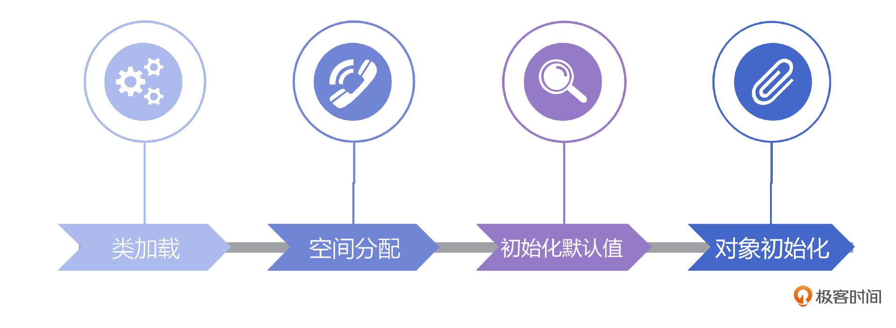
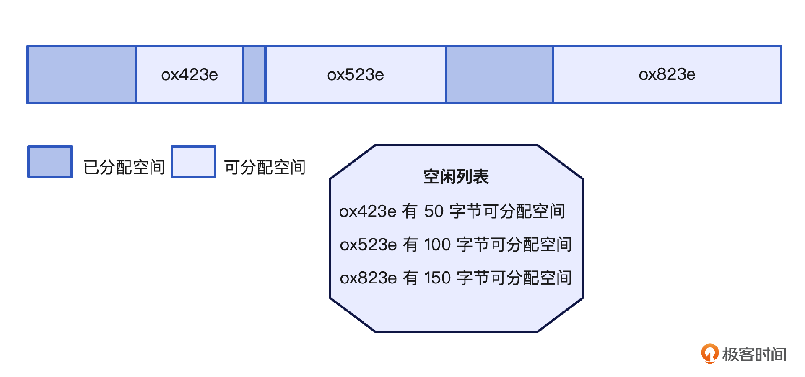
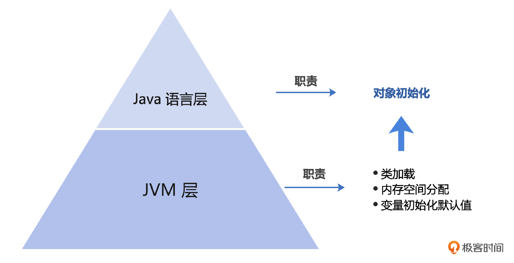
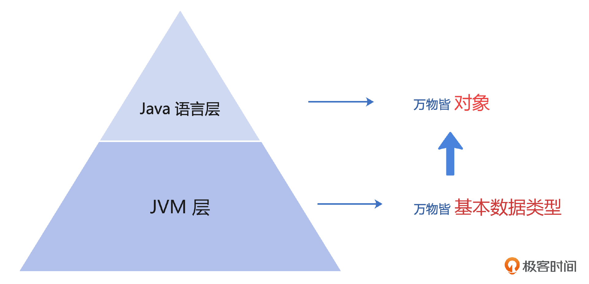
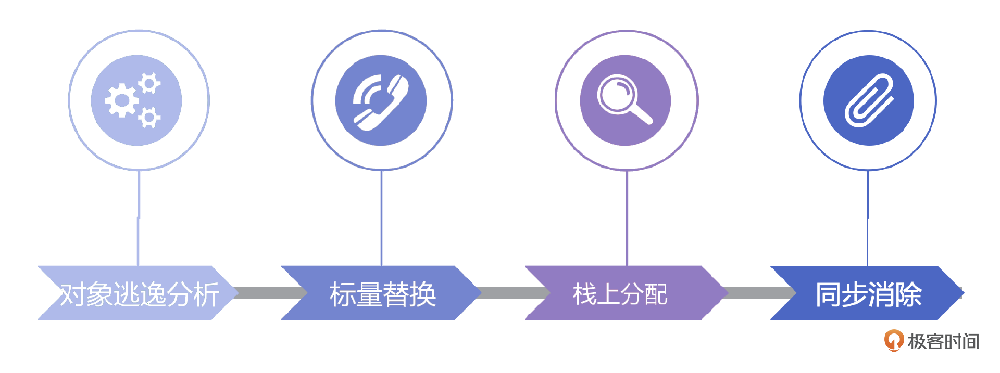
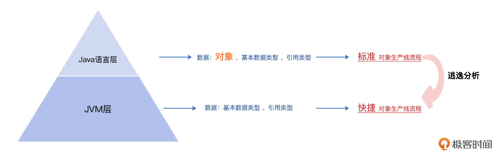
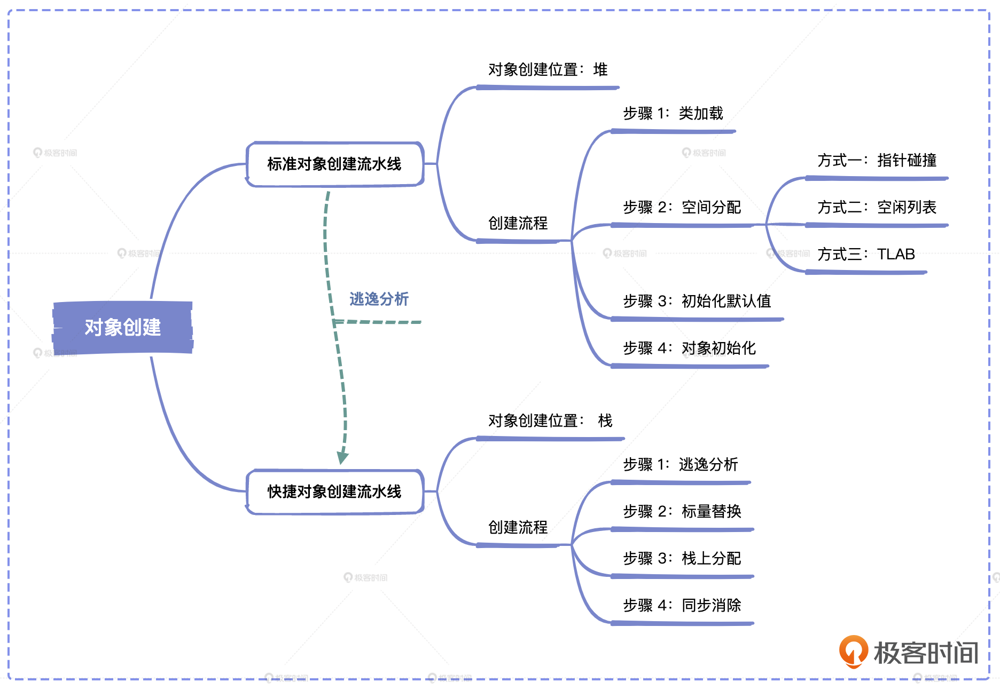
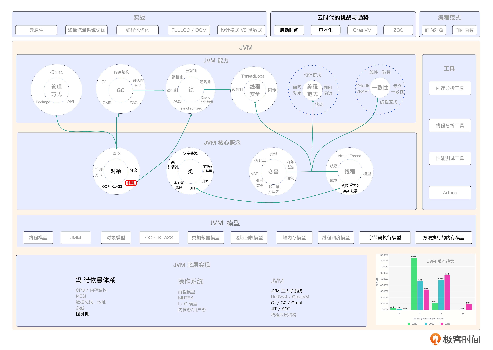

# 11｜对象创建 ：JVM中的对象是怎么生产出来的？
你好，我是康杨。

上节课我们聊了Java对象在JVM中是以怎样的形式存在的，这节课让我们来继续探讨，一个Java对象在JVM中是如何被生产出来的。通过这节课的内容你可以看到JVM在演进过程中是如何优化对象创建的，掌握这节课的内容，对你写出高性能的Java程序大有裨益。

## 对象创建的标准流水线



如果我们把JVM比作是创建对象的工厂，那么首先让我们来参观下JVM工厂中日常创建对象的标准流水线。之所以称之为标准，是因为这并不是JVM内部创建对象的唯一一条流水线，另一条流水线我会在后面为你介绍。现在让我们先把目光聚焦在这条标准的流水线上。

```plain
Book  book = new Book();

```

我们可以把上面这行代码看作是流水线收到的一笔订单。当JVM收到这笔订单时，它知道客户需要定制一个Book对象，这时候流水线开始启动。

### 类加载

流水线上的第一个节点就是类加载节点。如果以盖房举例，待生产的对象比作待修建的房子，而类正是盖房子需要用到的图纸。不管我们要盖的是别墅还是塔楼，首先我们需要拿到盖房用的图纸，所以第一步要做的就是准备好图纸。

类似的，当JVM 读到 new 指令，知道需要创建一个对象的时候，它首先需要明确这个对象的图纸也就是对相应的类，是否已经准备好，或者说类是否已经加载好。当它发现这个类还没加载好，或者这个类还没有经历完完整的加载、链接、初始化流程。那么它会先启动完整的类加载流程，或者继续执行之前未完成的类加载步骤。

就像我们在 [第 6 讲](https://time.geekbang.org/column/article/692897) 中提到的，类加载首先会读取 .class 里的数据，把里面的数据放到运行时的方法区中，并在运行时的堆上同步创建一个 java.lang.Class 对象，方便我们后续管理类。这里有一个点需要你关注，当多个线程同时需要加载某一个类时，同一时间只有一个线程能够加载成功，所以这里也会涉及到同步和锁。

经过类加载，对象创建需要的数据结构就有了，接下来就需要在运行空间中给它分配一个区域了。而这个区域的大小就像图纸中所预先设定的房子的大小，在你拿到图纸的那一刻就已经确定了下来。也就是说，类加载后，这个要创建的对象的大小已经确定下来了。好了，类有了，大小确定了，下一步就让我们给对象找个空间吧。

### 空间分配

我们都知道找地的难易程度取决于你想在哪儿找。如果你想盖一个100平米的房子，但是选址在北京的二环某胡同，也许这个胡同所有可利用的空闲空间加起来能超过100平米，但是你需要的是一个连续的空间，所以除非整个胡同重新规划和腾退，否则你依然盖不上房子。但是如果你选址在荒无人烟的荒漠，因为荒漠的空间是连续的，所以即使北京的二环某胡同和荒漠的总空闲空间一样，都是100平米，但荒漠的盖房成本远低于二环，并且能满足你对连续空间的需求。

类比到JVM中，这种情况依然存在，对象创建需要连续的堆空间，而决定JVM堆空间整体布局的正是JVM中的垃圾回收器，也就是说，JVM中内存回收的方式同样决定了内存的管理和使用方式，就像阴阳一样，对象的回收方式影响着对象的创建，同样对象的创建速度、对象大小也影响着对象的回收方式的选择，所以两者彼此依赖，既矛盾又统一。这也提醒我们在设计或者决定对象的创建和回收方式的时候，要从多个角度辩证地找出最优的，或者说是最平衡的方案，尽量避免从单一的视角去思考和做决定。

JVM中各种垃圾回收器对内存的使用和管理方式虽然不同，但是在确定的内存布局下，当JVM需要分配可用的内存空间给待创建的Java对象时，一般只有两种选择，指针碰撞或空闲列表。

#### 指针碰撞

当你选择了ParNew、Serial这种带有整理过程的垃圾回收器时，因为有整理的过程，所以堆通常是非常规整的，已经分配出去的堆空间和可分配的堆空间泾渭分明，所以你只需要通过指针碰撞的方式，在空闲空间分配一个区域即可，类似于在人烟稀少的荒漠分配空间，虽然是全局竞争分配的方式，但是分配的成本并不高。


#### 空闲列表

在实际生产环境中一般是采用CMS这样的垃圾回收器，这种情况面临的问题就是除非经过FULL GC，否则Java堆一般是不规整的。类似于想在北京的二环某胡同找个空闲的地盖房，除非是到住建委去查，否则靠自己是很难找到的。JVM采用的方式是维护一个全局的空闲列表，用来记录当前JVM堆的使用情况。



其实影响对象创建内存分配的，除了对象的回收方式，还有一个重要的因素就是线程。

我们还是以在北京二环某胡同找地方盖房子举例，虽然胡同的空间紧张，而且很零碎，但是具体到某一个四合院的时候，很有可能会是某一个企业的房产。也就是首先以企业为单位在胡同分配一块空间，然后这个企业的职工盖房的时候直接向企业去申请就好了。这里的企业类比的就是JVM中的Thread，这种先由企业分配一整块空间，然后再分配给企业中具体个人的方式，就是JVM中的TLAB机制。

#### TLAB

TLAB是Thread Local Allocation Buffer的缩写，也称为线程本地分配缓冲区。我们以垃圾回收器采用CMS为例，这种情况下，所有的对象都是在新生代 Eden 区分配的。因为Eden区也是全局共享的，当同一时间有多个线程同时向Eden区申请空间分配的时候，就必然会引发同步问题，从而导致内存分配效率降低。

为此JVM 引入了TLAB机制，也就是以线程为单位，为每个线程分配一块区域以减少同步竞争，从而提升对象分配的效率。这就像我们上面提到的企业福利房，土地的分配以企业为单位，而不再以个人为单位，这样就能大幅度降低个人申请的成本，同时提升整体分配的效率。

当然即使使用了TLAB，也不会无限地给一个线程分配空间，因为在实际的生产环境中堆空间是非常宝贵的资源，所以TLAB分配的空间一般不会很大。我们可以通过 **-XX:TLABWasteTargetPercent** 来设置TLAB占用的空间大小。因为TLAB 空间是有限的，所以很可能会出现分配的对象大小超过TLAB空间的情况。这种情况下有两种解决方案，第一种就是绕过TLAB，直接在堆上分配，第二种就是废弃掉当前的TLAB，创建一个新的TLAB来满足新分配的对象的空间要求。

为此JVM定义了一个叫Refill\_waste的参数，当请求的分配空间大于Refill\_waste时，采用直接在堆上分配的方式，而小于该值的时候，选择新建TLAB的方式。你也可以通过 **-XX:TLABRefillWasteFraction** 来调整该值，默认值是64，也就是使用约为 1/64的TLAB空间作为refill\_waste。默认情况下，JVM在运行时会对TLAB的refill\_waste进行动态调整，以使系统在运行时达到最优的状态。

JVM一个非常强大的功能就是运行时的动态调优，它会根据系统当前的运行情况对相应参数进行动态地调优，但是它同时也提供了手动干预的方式，通过 **-XX:-ResizeTLAB** 你可以禁用JVM自动调整TLAB大小的功能，你也可以通过 **-XX:TLABSize** 手工指定一个TLAB的大小，但是在实际的生产环境中，还是建议你更多地相信JVM，谨慎地调整这些参数，除非你经过了长时间的高仿真压测和反复地校对，否则相信JVM依然是最优的选择。

TLAB其实体现的是一种化整为零的思想，将连续的堆空间以线程为单位划分成更小的空间，以减少不同线程间在对象创建、内存分配过程中的竞争。G1垃圾回收器上也采用了同样的思想。

当垃圾回收器是G1时，堆空间不再是以连续的内存空间直接对外提供，而是以更小的Region满足空间使用的需要，通过算法的加持，来提供更加智能和高效的空间使用方案。

现在新创建的对象在堆上的空间已经有了，下一步就是对这个空间进行简单的默认值初始化。

### 对象初始化默认值

默认值初始化就是对内存空间中的各个数据按照类型初始化为零值。这一部分操作的主要是上一节课中提到的实例数据的区域。但是如果使用TLAB分配空间的话，会把初始化零值的操作提前到分配TLAB的时候。接下来虚拟机会操作对象头的部分，按照我们上节课介绍的对象头的格式，JVM会在此时在对象头中设置这个对象是哪个类的实例、这个对象的哈希值、对象的GC年龄，以及它的KLASS指针等。至此，虚拟机中的JVM对象就创建完成了。

### 对象创建的两段论

在课程中，我一直在向你强调的一个重要理念，就是 **Java的语言层和JVM层是两个层级**。认识到这一点会对你理解JVM以及日常优化系统起到非常大的帮助。在对象创建这里也是这样。

一个Java对象的创建是由JVM层和Java语言层共同协作完成的。JVM就像一个开发商一样负责拿到图纸申请空间，也就是类信息，然后照着Java对象协议来盖房，最后把变量初始化到默认值再给到你。这个时候创建对象在JVM层就已经完成了，这个Java对象已经有了运行时空间的地址，可以对它进行操作了。但是对于Java语言层来说，还是希望给它做一些定制化的装饰，比如把墙面刷成粉色再与大家见面，这就是下面的对象初始化阶段。



### 对象初始化

终于到了最后一个环节，对已创建的对象执行初始化，包括执行变量初始化、执行初始化语句块和构造器方法，你可以看一下我给出的示例代码。

```plain
public class Book {
    //方式一：声明时进行初始化
    private String  name = " book ";
    //方式二：构造器语句块
    public Book(String  bookName){
        name = bookName;
    }
    //方式三：初始化语句块
    {
        name = " Java Book" ;
    }
    public Book(){
    }
    public String getName(){
        return  name;
    }
    public void print(){
        System.out.println(name);
    }
    public static void main(String[] args) {
        Book book1 = new Book();
        book1.print();
    }
}

```

上面我们介绍的JVM创建对象的标准流水线，是我们创建对象的时候JVM所采用的标准流程，但是有些时候这并不是最优的选择，于是从JDK 1.8开始，JVM启动了另一条对象创建流水线。

## 对象创建快捷流水线

严格意义上来说，第二条流水线并没有生产出任何Java语言层意义上的对象，而是回归到创建对象要解决的问题本身去解决问题。这就像马斯克提到的第一性原理： **回归本质，然后重构**。之所以这样做，还是离不开时代的影响。

当Java刚刚崛起的时候，作为面向对象语言，Java的那句“everything is object”，就像标签一样深深烙印在每个人的心中，也烙印在Java的身上。但就是这句给Java带来无限荣耀的Slogan，如今却成为了Java低效的代名词。相比于其他新出世的编程语言，人们开始觉得如果解决任何问题都要先创建对象，而创建对象又要经历这么复杂的流程的话，成本似乎太高了。

本着与其被别人革命，不如自己先革自己命的原则，从JDK 1.8开始，JVM搭建起它的第二条对象创建的流水线，或者说从对象创建要解决的问题出发，绕过了之前的对象创建环节，直接在JVM层面去解决问题。



JVM 是如何做到的呢？我们来看一下。

这条全新的流水线主要由四个节点构成。



### 对象逃逸分析

第一个节点就是对象逃逸分析，它是以方法为边界的，如果一个对象的使用超出当前方法，就叫做对象逃逸，而我们优化的目标是防止对象逃逸。以下面的方法为例，在这种情况下新创建的这个对象就属于逃逸了，因为方法中创建的对象的使用范围超过了这个方法的范畴。

```plain
public Book EscapeExample() {
    return new Book("Java Book");
}

```

但是实际我们需要的可能只是Book这个对象的某一个属性，比如书名这个属性，所以我们完全可以把方法改成下面这种写法。

```plain
public String EscapeExample() {
    Book book = new Book("Java Book");
    return book.name
}

```

经过这种改造，Book这个对象的使用范畴不再超出EscapeExample()的范畴了。这就为后面的对象栈上分配打下了一个很好的基础。JVM中关于逃逸分析的相关参数主要有三个。

- 开启逃逸分析：-XX:+DoEscapeAnalysis
- 关闭逃逸分析：-XX:-DoEscapeAnalysis
- 显示分析结果：-XX:+PrintEscapeAnalysis



### 标量替换

经过上面的优化和逃逸分析，我们可以确认方法内的局部变量对象未发生逃逸，也就是说方法内的这个对象的使用没有超过该方法，同时也不会超出当前线程。这种情况下，JVM实际创建这个对象的时候，可以不在堆上，而是改为直接创建这个方法所使用的成员变量来直接替代。

还记得我们前面介绍的JVM里的数据类型吗？包括8种基本数据类型和引用，而标量就是Java中的基本类型。我们把一个对象拆散，将其成员变量恢复到基本类型来访问就称为标量替换。

```plain
public String EscapeExample() {
    Book book = new Book("Book");
    return book.name
}

```

比如上面的代码，经过编译后，就可能变成下面的代码。

```plain
public char[] EscapeExample() {
    char[] charArray = {'B', 'o', 'o','k'};
    return charArray
}

```

我们可以通过 **-XX:+EliminateAllocations** 启动标量替换，通过 **-XX:+PrintEliminateAllocations** 查看标量替换情况。

### 栈上分配

```plain
public String  getBookName(){
    Book book = new Book("Java Book");
    return  book.name;
}

```

栈上分配指方法中声明的变量和创建的对象，直接从当前线程所使用的栈上分配空间，而不在堆上创建对象。HotSpot的栈上分配实际指的就是上面提到的标量替换。栈上分配不仅更加快速而且避免了对创建对象的GC，一举多得。这也是JVM在标准对象生产流水线以外再创建这条快捷流水线的原因。

### 同步消除

当一个对象经过了逃逸分析、标量替换以及栈上分配后，说明这个对象不会逃逸出当前线程。因此针对这个对象的所有同步措施都可以被删除掉，避免了加锁、去锁等一系列耗时的操作。

```plain
public String  getBookName(){
    Book book = new Book("Book");
    synchronized (book){
        book.name = "Book1";
    }
    return  book.name;
}

```

比如上面的代码经过编译器优化后会变成这样。

```plain
public char[] EscapeExample() {
    char[] charArray = {'B', 'o', 'o','k'};
    charArray = {'B', 'o', 'o','k'，'1'};
    return charArray
}

```

## 对象创建标准流水线 VS 对象创建快捷流水线

上面我虽然介绍了对象创建快捷流水线的种种优势，但是快捷流水线并不是标准流水线的完全替代品，两者有各自的优势，也有各自的应用场景，快捷流水线适合生命周期短且不会跨线程访问的小对象，而对于生命周期长，需要跨线程访问等的对象，我们依然需要依赖标准流水线。只是相对以往单一的选择，JVM为我们提供了更丰富的功能，让我们在性能优化时更加得心应手。

## 重点回顾

今天我们介绍了JVM提供的创建对象的两条流水线，以及它们的应用场景和各自的详细流程以及优劣势。这节课承上启下，既是JVM对象协议的延伸，又是我们后面介绍JVM GC机制的前提。

通过这节课的学习，我们了解了JVM的GC机制是如何影响到Java对象的创建的，同时了解到如何通过代码优化，引导JVM采用第二条流水线进行Java对象的创建，从而避免了对象的内存分配、垃圾回收和同步竞争。从中我们也看到了JVM在演进过程中，对细分场景提供了更丰富的解决方案。这节课我们介绍了JVM对象创建的基本原理，但是怎么应用这些原理在实际编程中更高效地创建对象，是我们需要持续修炼的技能。



## 思考题

学完了这节课的内容，你可以看一下你创建程序的地方哪里是可以优化的，可以带来多少的性能提升。欢迎你把你的想法和心得分享到评论区，也欢迎你把这节课的内容分享给需要的朋友，我们下节课再见！

## 💡 点亮你的知识框架图

