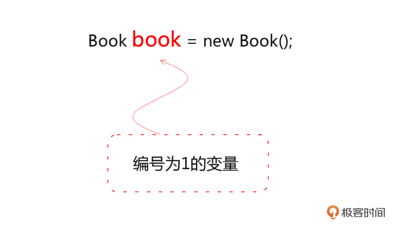
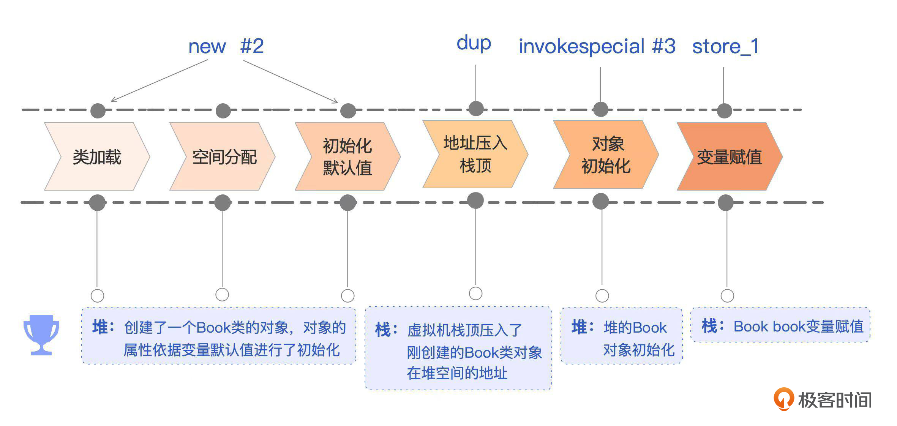
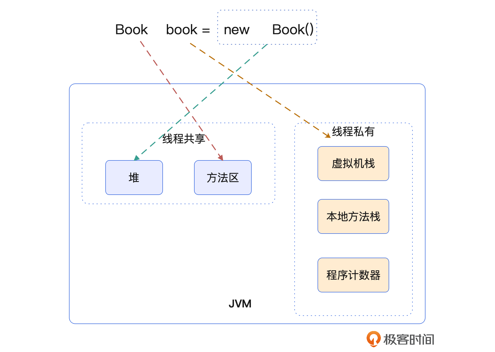
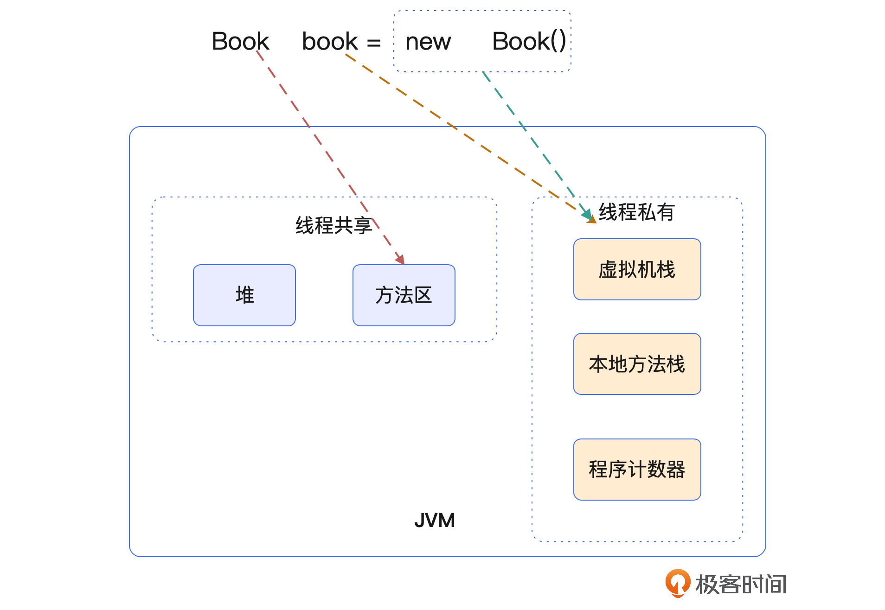
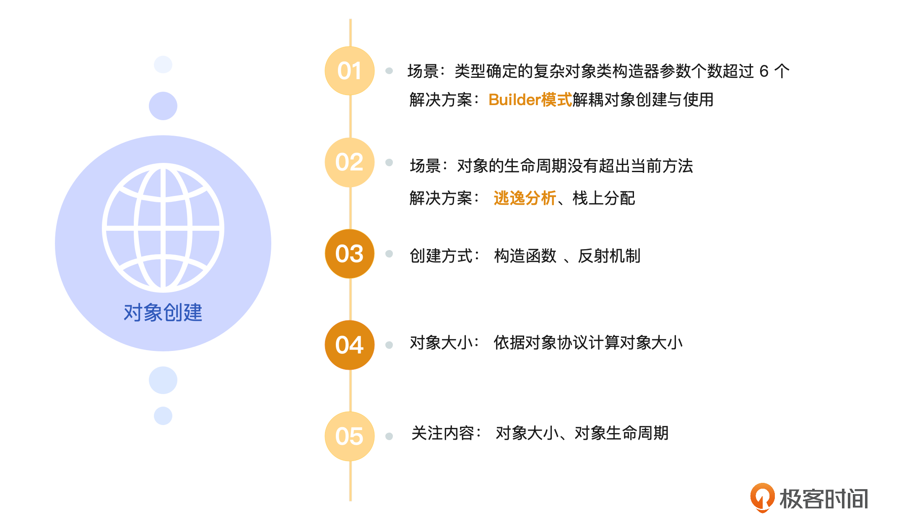

# 12｜对象创建全家桶：JVM中对象创建的模式及最佳实践
你好，我是康杨。

今天我们一起站在对象创建的视角，看看JVM为我们提供了哪些能力，还有怎么更好的应用这些能力。我们也会聊一下，创建对象需要考虑的因素以及对象创建对对象回收的影响。

首先我们从一个实际的场景开始，假设你是某一个在线阅读网站的程序员，老板安排了一个任务，需要统计在线图书被阅读的次数。你决定采用面向对象的思想来设计，所以第一步你先设计了一个Book对象，它有四个属性，分别是这本书的编号、书名、图书的简介以及这本书被阅读的次数。

```java
public class Book {
    private Long    no;  // 图书的编号
    private String  name = “ default Name ”; //书名
    private String  desc; //图书的简介
    private Long    readedCnt; // 这本书被读的次数
    public Book() {
    }
    public Book(Long no, String name, String desc, Long readedCnt) {
        this.no = no;
        this.name = name;
        this.desc = desc;
        this.readedCnt = readedCnt;
    }
    public Long getNo() {
        return no;
    }
    public String getName() {
        return name;
    }
    public String getDesc() {
        return desc;
    }
    public Long getReadedCnt() {
        return readedCnt;
    }
}

```

同时你创建了一个接口类和实现类，用来处理Book类相关的事宜。

```java
public interface BookService {
    public   void printBookInfo() ;
    public   void printLatestCnt() ;
}

public class BookServiceImpl implements BookService{
    public   void printBookInfo() {
        Book book = new Book();
    }
    public   void printLatestCnt() {
        Book book = new Book(1l,"bookName","bookDesc",100l);
        System.out.println(book.getReadedCnt());
    }
    public static void main(String[] args) {
        BookService bookService = new BookServiceImpl();
        bookService.printLatestCnt();
    }
}

```

## 对象创建的字节码

根据我们在 [第 5 讲](https://time.geekbang.org/column/article/691782) 学习到的内容，你可以用 javap  -c  BookService.class 查看 Book book = **new** Book() 所对应的字节码。

```java
  public void printBookInfo();
    Code:
       0: new           #2                        // class com/future/Book
       3: dup
       4: invokespecial #3                  // Method com/future/Book."<init>":()V
       7: astore_1
       8: return

```

### new \#2

当JVM读到这个指令，就会执行我们JVM阶段的对象创建。首先是类加载阶段，JVM会到方法区中的常量池去定位这个类的符号引用，这里就是com/future/Book。如果能定位到，再去看看这个符号引用对应的类有没有经历完类加载的三部曲：加载、链接、初始化，如果没有就继续完成。

如果不能定位到，就启动类加载流程。这一步的结果是Book.class中的二进制数据被读入到内存里，存到JVM的方法区里，同时在堆上创建了java.lang.Class对象，封装了方法区内Book类的数据结构，从而给我们提供了访问方法区内数据接口的入口。

然后JVM会在堆区中，给Book对象分配一块内存空间，并根据Book中的变量类型对内存进行初始化，初始化为变量类型的默认值，比如Long类型的变量noi就会被设置为0，此时Book对象已经完成了JVM层面的创建，并且有了一个内存中的地址。

### dup

dup 指令会返回这个新创建的Book对象的这个地址，并且压入虚拟机栈的栈顶，供后续操作。

### invokespecial   \#3

这个指令会执行变量初始化、初始化语句块、构造器方法等操作，完成语言层面的初始化，Book对象的书名属性这个时候会被设置成“default Name” 。

### astore\_1

这个指令就是弹出栈顶值，存储到编号为1的变量中，也就是图里的Book book变量。



到这里，一个完整的对象就创建完成了，并且这个对象的引用被赋值给本地变量。



## 对象在JVM中存在的形态

经过了上面的创建流程，Book对象在JVM运行时中的状态是怎样的呢？你可以看一下我给出的图示。



## 对象在内存中大小

按照我们之前讲到的JVM对象协议，Book类对象存储在JVM里，总共由3个部分组成，分别是对象头、实例数据和对齐填充。


### 对象头部分

通常情况下对象头包含两部分，一部分是mark word，默认为8字节，另一部分是类元数据指针Klass Pointer，4字节或8字节，这取决于JVM启动参数UseCompressedOops的设置，我们下面假设起始值为4字节，所以对象头部的大小默认是12字节。

### 实例数据部分

Book类有四个字段，分别为Long型的no、String型的name、String型的desc以及Long型的readedCnt。因为这四个字段的类型都是引用类型，占用的内存取决于平台，64位JVM下默认开启压缩指针压缩Oops的占4字节，未开启则占8字节。所以实例数据部分的大小是16字节或32字节。

$$4 \\times 4 = 16 字节（开启了压缩Oops）$$

$$4 \\times 8 = 32 （未开启压缩Oops）$$

### 对齐填充部分

由于JVM自动内存管理系统要求对象起始地址必须是8字节的整数倍，也就是说一个对象的总大小必须是8的倍数，所以可能存在对齐填充。在已经开启压缩Oops的情况下，对象头部占12字节，实例数据占16字节，共28字节。由于必须是8字节的整数倍，所以需要填充4个字节，变成32字节。而在未开启压缩Oops的情况下，对象头部12字节，实例数据32字节，一共44字节，需要填充4字节，变成48字节。

因此，Book类的对象在JVM里占用的大小是32字节或者48字节。对象的大小是我们平时很容易忽视的内容，但你设想一下百万级TPS的系统，如果每秒都需要创建百万级的Book大小，那么仅仅一个指针压缩都能给我们带来巨大的收益，不仅可以降低成本、提升性能，还能有效避免FULL GC，也许这就是我们需要了解JVM底层实现的意义。

## 栈上分配

观察下面的代码，你会发现Book book对象的使用范围并没有超出 `printBookInfo()` 方法的范围。

```java
 public void printBookInfo() {
        Book book = new Book();
 }

```

所以这种情况下，我们可以用上节课提到的JVM第二条流水线实现栈上分配，通过配置以下JVM参数。

```java
-XX:+DoEscapeAnalysis -XX:+EliminateAllocations  -XX:+EliminateLocks

```

Book对象在栈上就完成了使用和回收，节省了在堆上创建并回收的性能消耗。那这个时候JVM运行时的内存状况又是怎样的呢？你可以看一下示意图。



## TLAB

假设需要对图书信息进行初始化，我们决定写一个多线程程序来完成这个任务，每个线程负责一百万册图书，我们计划用10个线程来完成任务。

```java
public class BookRecorder implements Runnable {
    private int count;

    public BookRecorder(int count) {
        this.count = count;
    }
    @Override
    public void run() {
        for(int i = 0; i < count; i++) {
            Book book = new Book(Long.valueOf(i), "name" + i, "desc" + i, Long.valueOf(i));
            // do something with book...
        }
    }
    public static void main(String[] args) {
        int threadCount = 10; // the number of threads
        int bookCount = 1000000; // the number of books each thread will create
        for(int i = 0; i < threadCount; i++) {
            Thread thread = new Thread(new BookRecorder(bookCount));
            thread.start();
        }
    }
}

```

这个时候我们发现为了申请到本线程内Book对象的内存空间，CPU在频繁地竞争堆内存空间的分配。这个时候我们在 [第 11 讲](https://time.geekbang.org/column/article/700492) 学到的TLAB就排上用场了。

我们可以用-XX:+UseTLAB来启用TLAB，它在JDK8中是默认开启的。开启TLAB后，每个线程在创建对象时都会在自己的TLAB中进行，从而避免了不同线程间的内存分配竞争，提升了系统性能。反之，如果我们没有开启TLAB，那么这10个线程都将在共有的Eden区进行内存分配，会存在较大的竞争和同步开销，系统性能将大大降低。

## 反射创建对象

除了用上面的 Book book = **new** Book()方式来创建对象， 我们也可以用反射机制来动态创建对象。

```java
Class<?> clazz = Class.forName("com.future.Book");
Constructor<?> cons = clazz.getConstructor(Long.class, String.class, String.class, Long.class);
Book book = (Book) cons.newInstance(Long.valueOf(1), "Book1", "Desc1", Long.valueOf(1));

```

这种方式的优势在于它的动态性，在运行时通过判断对象所属的类，我们可以构造任意一个类的对象。但是反射的性能及权限问题，比如一些私有变量和方法没办法直接访问，也是在实际生产环境中需要考虑的。所以这种方式主要用在框架开发的场景，其他场景还是慎重使用。

## 创建型设计模式

### 建造者模式

刚刚我们演示了如何用反射机制和构造函数来创建对象，不知道你发现没有，Book类有四个属性，它的构造函数的参数也是四个，如果Book类有更多的参数呢，如果有的参数是必填，有些是选填，构造函数应该如何设计呢？

当参数超过10个或者更多的时候，按照之前的方式，显然构建的难度会越来越大，可维护性越来越差，参数传错以及排错的难度也会同步增加。好在业界的前辈们已经为我们想好了解决方案，针对这种复杂对象的构建我们可以使用建造者模式，这里我们还是以Book类为例，你可以看一下它的建造者模式的写法。

```java
public class Book {
    private Long    no;  // 图书的编号
    private String  name; //书名
    private String  desc; //图书的简介
    private Long    readedCnt; // 这本书被读的次数

    private Book(Builder builder) {
        this.no = builder.no;
        this.name = builder.name;
        this.desc = builder.desc;
        this.readedCnt = builder.readedCnt;
    }
    public static class Builder {
        private Long no;
        private String name;
        private String desc;
        private Long readedCnt;

        public Builder no(Long no) {
            this.no = no;
            return this;
        }
        public Builder name(String name) {
            this.name = name;
            return this;
        }
        public Builder desc(String desc) {
            this.desc = desc;
            return this;
        }
        public Builder readedCnt(Long readedCnt) {
            this.readedCnt = readedCnt;
            return this;
        }
        public Book build() {
            return new Book(this);
        }
    }
}

```

这个时候，我们可以通过下面的方式来创建Book对象。

```java
Book book = new Book.Builder().no(10l).name("Book Name").desc("Book Desc ").build();

```

根据维基百科的定义，建造者模式（Builder Pattern）又名生成器模式，它是一种对象构建模式，用于将复杂对象的建造过程抽象出来， 使这个抽象过程的不同实现方法可以构造出不同属性的对象。

## 重点回顾

今天我把我们在前面几节课学到的JVM相关的知识应用到了实际的生产实践中，就是为了让你学以致用。

我们通过分析对象的生命周期，避免了对象在堆上的分配。对于复杂对象，我们可以通过设计模式降低系统的实现和维护成本。我们还运用了前面学到的JVM对象协议，计算出了对象的大小，帮助你养成成本意识。

其实对象创建涉及的内容不只这些，如果我们需要创建一个全局唯一对象，应该如何处理？如果Book对象中readedCnt频繁变更，又该如何处理呢？这些内容我会分别在第21节，第22节展开介绍，期待一下吧！



## 思考题

对象创建有那些优化点？实际生产中你是如何优化对象创建的？如何把对象的创建过程和对象本身解耦?

欢迎你把思考后的结果分享到评论区，也欢迎你把这节课的内容分享给其他朋友，我们下节课再见！