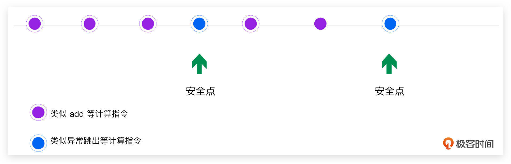
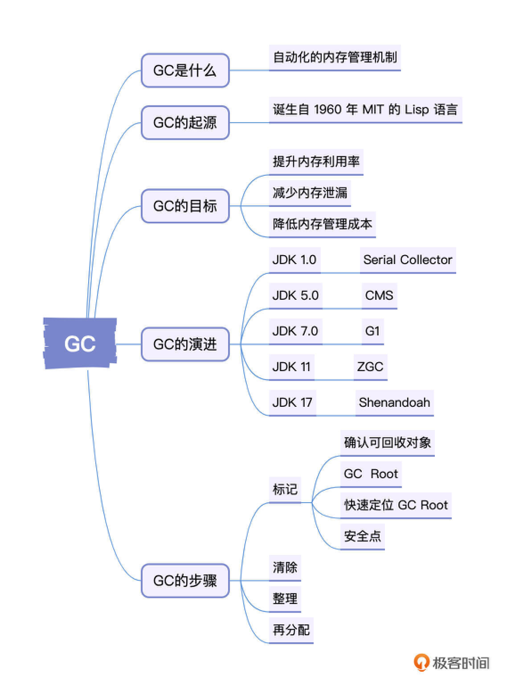
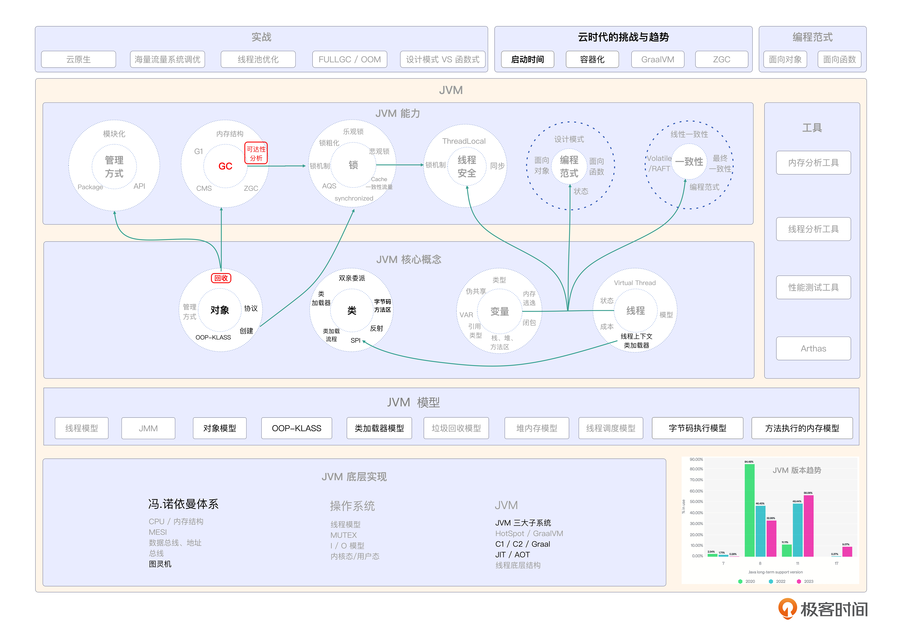

# 13｜对象回收（上）：如何定位待回收的对象？
你好，我是康杨。

在前面几节课中我们主要聊的是对象的创建，也提到了对象的创建与回收相辅相成，相互影响。从今天开始，我们就重点谈一谈对象的回收，也就是 GC。

所谓垃圾是指对象已经结束了它在运行态下的生命周期，但是依然占据着运行态下堆内存的空间。此时，就需要对该对象所占用的堆内存空间进行回收，以分配给新的待创建的对象。在Java中，垃圾内存的回收是由JVM自动完成的，但是深入掌握GC，依然是我们写出安全、可靠、高性能的Java程序的基础。这也是Java程序员必备的技能和面试中的必考点。

作为GC系列的开篇，本节课我们会一起聊聊GC的起源、GC的作用，以及JVM是如何快速定位待回收对象的。

## 什么是GC？

GC是Garbage Collection的缩写，中文叫做垃圾回收。它是一种自动化的内存管理机制，能够识别和回收不再使用的内存空间。在Java里，JVM负责GC。通过这种方式，Java程序员无需手动进行内存的分配和回收，从而降低了内存泄漏的风险，提高了开发效率。

## GC的起源

GC的概念并非来源于Java，而是诞生自1960年MIT的Lisp语言，那时候，计算机科学家很有远见地提出了利用自动化技术进行内存管理的可能性。经过几十年的发展，GC技术在计算机系统的各个领域都得到了广泛地应用。

JVM的垃圾回收技术始于1995年，SUN公司（现已被甲骨文公司收购）发布Java技术之时。和其他编程语言相比，Java的一大特点就是它的内存管理采用了垃圾回收技术。也就是从那个时候起，GC成为了JVM生态系统中的重要一环。在JVM实现里，虚拟机栈、本地方法栈、程序计数器和线程同生灭，伴随着线程的退出，同步进行着所占用内存的自动清理。所以 , JVM里的内存垃圾回收主要应用于堆区和方法区所对应的内存空间的管理，在程序的运行态下，这部分内存的分配、使用和回收都是动态的。

## GC用来做什么？

GC的主要目标是借助以下三种方式帮助我们提高程序的运行效率和开发效率。

1. 减少内存泄漏

注意，这里说的是减少而不是消除，内存泄漏是生产实践中经常会遇到的比较严重的问题，各种因素都可能会引发内存泄漏，但是JVM的自动识别和内存回收机制，能够帮助我们有效地降低内存泄漏的风险。

1. 提升内存利用率

我们都知道内存是非常稀缺的资源，如何提高有限的内存空间的使用率，始终是一个重要的话题。我们前面提到过，为了提升内存使用率，在对象创建阶段JVM通过逃逸分析和标量替换，采用对象栈上分配的方式减少堆内存的使用，这些都是提升内存使用率的尝试。GC通过不断回收不再使用的内存空间，同样实现了提高内存利用率的效果。

1. 降低内存管理成本

GC被发明之前，开发者是需要自己手动管理内存的分配和释放的，而随着GC的诞生，这一部分职责交由底层JVM负责，从而有效地减轻了开发者的负担，提升了开发效率。

## GC的主要步骤

虽然垃圾回收器种类繁多，但垃圾回收的过程基本一致，主要是 4 个阶段：分别是标记（Mark）、清除（Sweep）、整理（Compact）、再分配（Allocation）。

### **标记**

这个阶段的目标是确定哪些对象是“活动”的，或者说是正在被使用的，哪些对象是“垃圾”，也就是不再被使用了。垃圾回收器会遍历Java堆内存里所有的对象，通过引用关系来判断对象是否存活。

#### 确认可回收对象

确认一个对象是否可以被回收，通常有两种解决方案，分别是引用计数法和可达性算法。

1. 引用计数法

这种方法就是在一个对象被引用的时候，计数加1，引用断开的时候，计数减1。当一个对象的引用计数为0的时候，就说明这个对象可以被清除了。这个算法的问题是，如果一个对象引用另一个对象的同时，另一个对象也引用这个对象，就形成了循环引用。虽然这个时候双方的引用计数都不是 0，但如果仅仅被对方引用实际上却没有存在的价值，就应该被GC掉。引用计数法在这种情况下就失效了。

1. 可达性算法

引用计数法的缺陷让我们看到，仅仅从被引用一方去决定一个对象是否应该被回收太片面了。所以我们换一个方向，从一个存活对象引用到的所有对象视角去判断一个对象是否应该被回收。这就是可达性算法。而查找的起点就叫做 GC Root。

#### GC Root

GC Root（垃圾回收根节点）是垃圾回收器标记存活对象的起点。在执行垃圾回收时，垃圾回收器首先遍历GC Root，然后从这些起点通过引用关系层层遍历，并将访问到的对象也就是实际应用中正在使用的对象标记为存活。未被访问到的对象则被认为是垃圾，垃圾回收器会回收这些对象所占用的内存空间。在实际应用中，以下类型的对象可作为GC Root。

- 类加载器（Class Loaders）：已加载的类会包含引用它的类加载器。由于类加载器负责加载其他Java类，因此它是一个关键的GC Root。
- 方法区中的静态变量（Static Fields）：静态变量存放在方法区中，因为静态变量的生命周期和类相同，会一直存在于整个应用程序运行期间。所以它们可以作为GC Root对象。
- 方法区中的常量（Constant Fields）：方法区中的常量本质上与静态变量相似，它们存储在方法区，并且在应用程序运行期间一直存在。因此它们也可以作为GC Root对象。
- 虚拟机栈中的本地变量和参数（Local Variables and Method Arguments）：方法调用过程中，在栈帧里分配的本地变量和参数会被引用，这些栈帧会持续存在，直到方法执行完毕或被弹出栈。因此它们也可以被视为GC Root对象。
- 本地方法栈中引用的变量：本地方法栈中定义的全局引用变量会引用Java对象，通常在本地C/C++代码中定义。这些引用在垃圾回收过程中会被当作GC Root对象。

#### 如何快速定位GC ROOT？

以虚拟机栈为例，保守式垃圾收集会直接线性扫描栈，再判断每一串数字是不是引用，而HotSpot JVM采用的是准确式垃圾收集方式，所有对象都存放在 OopMap（对象指针映射表）里，当GC发生的时候，直接从这个map里寻找GC Root。将GC Root 存放到 OopMap有两个触发时间点，分别是类加载完成后和即时编译过程中。

类加载完成后，HotSpot就会把对象内什么偏移量上是什么类型的数据计算出来。而即时编译过程中，也会在特定的位置记录下栈里哪些位置是引用。

#### 安全点

更新OopMap需要消耗大量的时间，所以如果每个指令都同步更新一次OopMap的动作，显然是非常低效的。所以HotSpot虚拟机采用的是批量处理的方式，也就是只在特定位置才进行一次更新记录的操作，把原来的每个指令更新一次转化成N个指令更新一次，大大提升了更新的效率和性能，这个更新的时机点也叫做安全点。

安全点的选择是一个非常重要的考量，如果在程序正在运行的状态进行更新，显然会影响程序的吞吐和性能，那JVM以什么标准来选择呢？

就是让程序长时间执行的指令，这些指令执行的时候，就可以作为安全点。比如当程序正在进行方法调用、循环跳转、异常跳出等操作的时候，才会进行更新OopMap的动作，尽量让外界减少对它的感知，整体流程如下图所示。

这种感觉就像一位优秀的厨师在做油焖大虾的时候，他会在做这道菜的后期，也就是大虾需要在锅里焖制的那1、2分钟的时候，才顺便清理一下台面，而不是在刚开始煸炒大虾的时候同时清理台面，这个选择清理台面的时机对应的正是JVM中的安全点。

## 重点回顾

好了，这就是今天的主要内容，GC相关的知识比较繁杂，我总结了GC的一些要点来帮助你查漏补缺。

GC是一种自动化的内存管理机制，JVM借助GC机制帮我们降低内存管理成本，同时有效提高内存使用率，并减少内存泄漏。随着硬件的快速发展和大并发、低延时的要求，GC也在朝着管理更大内存、实现更低延时的方向努力。虽然已经出现了ZGC和更新的Shenandoah，但是JDK 11以上版本中 G1 还是当前的主流。

GC主要包括标记、清除、整理和再分配4个阶段。在标记阶段，JVM是通过GC root借用引用分析法来定位待回收对象的。下节课我们会继续讨论后面的三个阶段。

## 思考题

最后请你来思考 2 个问题。

1. JDK11以后的版本中使用最多的垃圾回收器是什么？
2. JVM是如何找到待回收对象的？

欢迎你把你思考后的结果分享到评论区，也欢迎你把这节课的知识分享给需要的朋友，我们下节课再见！

## 💡点亮你的知识框架图

