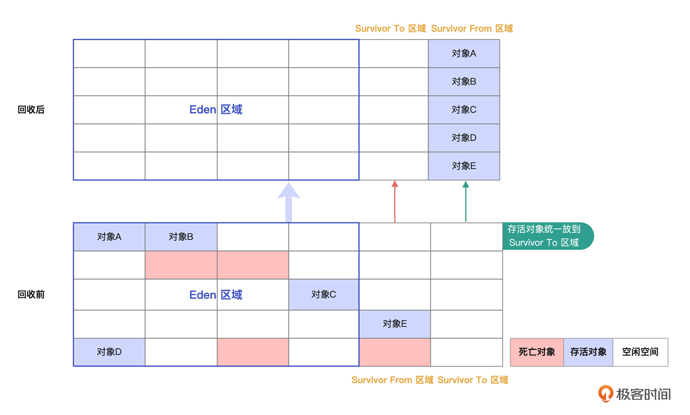
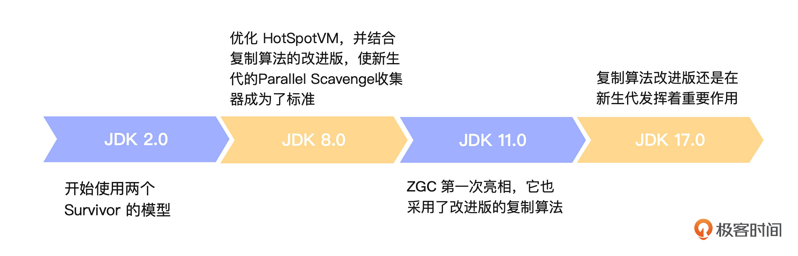
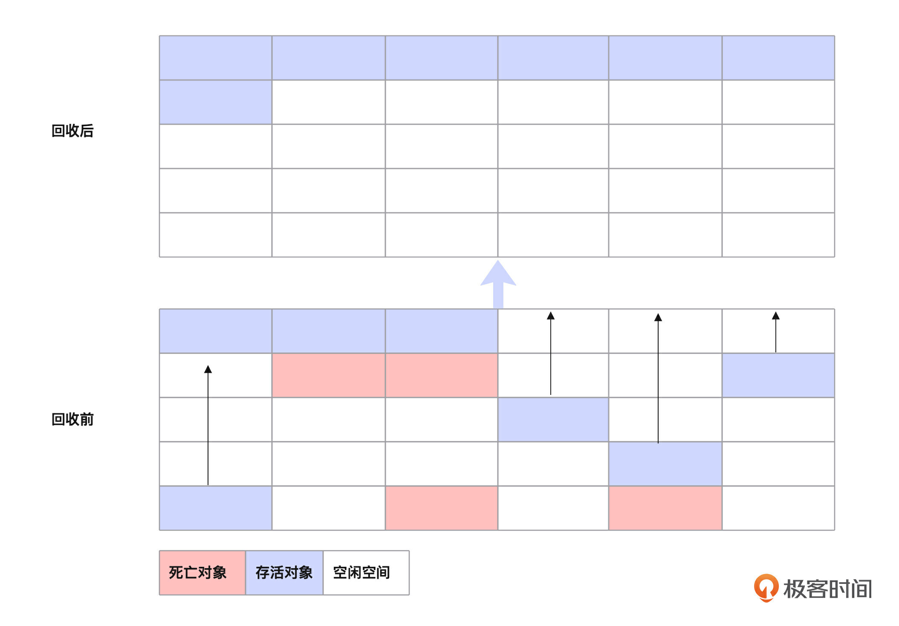
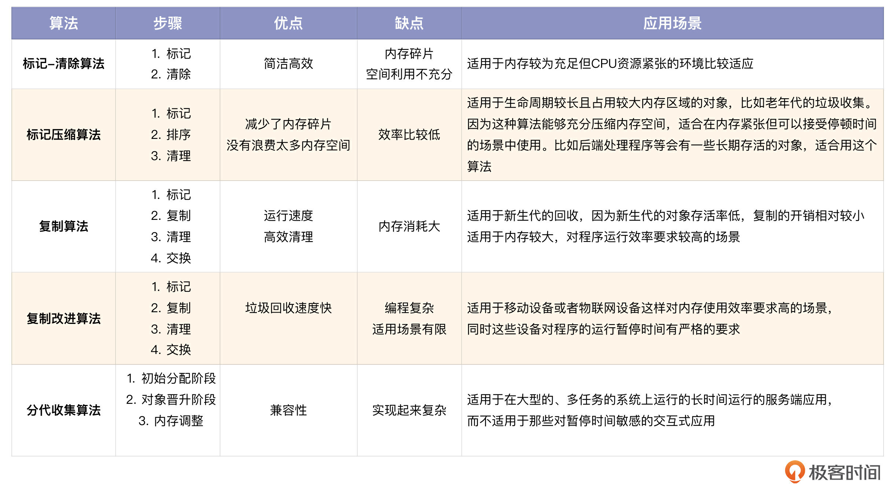
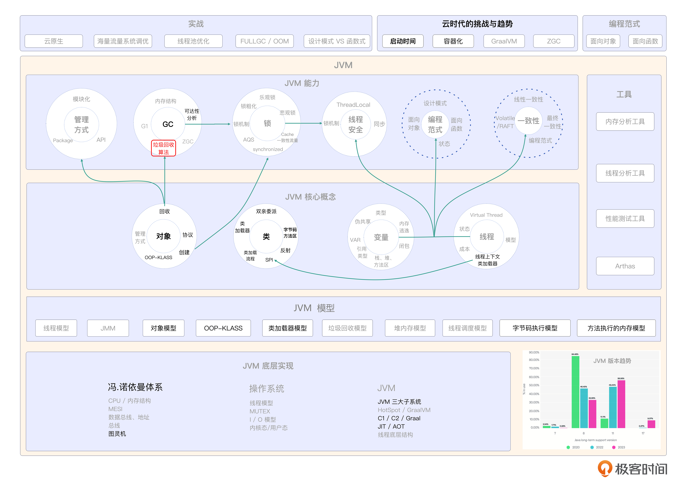

# 14｜垃圾回收（下）：揭秘垃圾回收中的算法
你好，我是康杨。

上节课我们聊了JVM是如何定位一个待回收的对象的，这节课我们继续看针对已经定位的垃圾对象JVM是如何进行回收的，也就是JVM中的垃圾回收算法。

垃圾回收算法种类很多，它是不断演进的各种垃圾回收器的理论基础。掌握垃圾回收算法，能帮助我们看清JVM中垃圾回收器的本质和演进趋势。今天让我们从最简单的标记-清除算法开始学起。

## 标记-清除算法（Mark-Sweep）

标记-清除算法是最早提出并实现的垃圾回收算法，虽然和现在越来越智能的垃圾回收算法相比，标记-清除算法显得非常简单，但是它却是后面这些垃圾回收算法的思想基础和发展之源。可以认为我们现在使用的各种垃圾回收算法都是基于标记-清除算法的思想不断改进、演化而来的，所以标记-清除算法是必须要掌握的。

### 详细步骤

在标记-清除算法中，我们把垃圾回收的过程划分成标记和清除两个阶段。

1. 标记阶段

基于我们在上节课中提到的可达性分析算法，从根对象开始遍历所有的可达对象并标记它们。

1. 清除阶段

清除所有未被标记的对象。这个地方需要注意的是清除对象的顺序并不影响算法的结果。最简单的清除算法就是逐一检查每个对象并释放未被标记的对象。

### 优劣势分析

标记-清除算法的一个重要挑战在于 **如何有效地处理空间碎片**，因为每次回收后内存中都会存在大量不连续的碎片，即使这些内存碎片的空间总和足够装下这个对象，也没办法有效地分配给大型对象，从而影响JVM的性能和可靠性。

标记-清除算法除了会引发碎片化问题，还存在执行效率的问题。因为标记对象和清理对象需要消耗一定的时间，如果遇到拥有大量对象的应用场景的话，可能会导致暂停时间过长。

我们在 [第 11 讲](https://time.geekbang.org/column/article/700492) 对象创建部分举过一个在二环盖房子的例子，那个案例所隐含的垃圾回收算法就是这里说的标记-清除算法。所以说，对象的创建与回收相辅相成，相互影响。你也可以复习下第11讲，把这两讲的内容结合在一起理解，相信你会有不小的收获。

## 复制算法（Copying）

复制算法最早是由 MIT 的 AI 实验室在 1960 年的 Lisp 机器中引入的，之后应用在了很多编程语言中，特别是在处理大量短生命周期的对象时，比如处理Web请求时的临时对象，复制算法简单高效。

在Java SE 1.2之后，HotSpot虚拟机在分代收集的基础上，针对新生代和老年代分别采用了不同的收集方式。在新生代人们更倾向于使用复制算法，而在老年代人们更倾向于使用标记-清理和标记-整理算法。

后来随着G1、ZGC、Shenandoah等新型垃圾收集器的出现，复制算法得到了更广泛的应用。这些垃圾收集器在设计的时候，都对复制算法进行了优化和改进，让这种算法能更高效地处理大规模、持久存活的对象。

### 详细步骤

和清除算法相比，复制算法效率更高，可以有效地处理大量的内存。在复制算法下，JVM把可用的堆内存分成两个相等的部分，只在其中一部分（From区）里分配对象。另一部分（To区）暂时不使用。所有新创建的对象都会被分配到From区。

复制算法分成标记、复制、清理、交换四个阶段。

1. 标记阶段

当From区快满的时候垃圾回收开始工作。这个时候采用的还是上一讲提到的可达性分析算法。

1. 复制阶段

这个阶段所有被标记的对象，也就是还在使用的对象，都会被复制到To区。在复制过程中可能会进行一些内存整理操作，让所有被复制到To区的对象都紧挨着排列，中间没有空隙。

1. 清理阶段

复制完之后，From区中没有被复制到To区的对象都可以看成是无用对象，JVM会清除From区里所有的内容。

1. 交换阶段

这个阶段JVM会交换From区和To区的角色。也就是说下次新对象分配会发生在To区，而这个时候的To区也就变成了新的From区，而原来的From区现在变成了新的To区，准备在未来的某个时刻，新的From区满了之后，用来接收从新的From区复制过来的对象。通过这种方式，复制算法做到了内存管理的高效和连续，减少了内存碎片化的问题。需要注意的是，因为需要保证有足够的内存空间进行对象复制和存储，所以这种算法对内存的使用率要求比较高。

### 优劣势分析

和标记-清除算法相比，复制算法可以有效地把内存空间划分成两部分，每部分都可以分配给不同的对象，这样就可以省去标记和清除的步骤，大大提高了执行效率。并且因为活动对象会被复制到新的内存区域，只要新的内存区域有足够的空间就不会产生碎片。垃圾收集的同时进行对象的移动和内存分配，没有了标记和清除的过程，应用运行不会被暂停太长时间，解决了垃圾收集的停顿问题。

虽然复制算法有很多优点，但是缺点也同样明显。最主要的就是内存利用率低的问题。复制算法需要把内存空间分为相等大小的两部分，但只使用一部分，这导致可用内存空间只有原来的一半。虽然可以省去标记和清理的步骤，但它还是会消耗大量的时间在对象的拷贝上，特别是在对象的生命周期比较长的时候，更加繁琐，会导致整个系统的运转速度变慢。

所以在实际的生产实践中，一般是以复制算法为基础，使用它的衍生版本。

## 复制算法改进版（Copying Advanced）

复制算法的问题在于它只能利用其中一半的内存空间，使其他的空间浪费掉了。这就促使改进版的复制算法出现了。在这个改进版中，它把内存空间分成一个比较大的Eden区和两个小一点的Survivor区，这个模型从 JDK 2.0 版本后开始使用。

就像搬家一样，我们会把 Eden区的东西分好类，该回收的回收，还存活的对象会搬到 Survivor To 区域，然后再把原来的Survivor From子区中还存活的对象也搬到Survivor To 区域，Survivor From子区清空。

每次垃圾回收周期结束后， Survivor To区就会成为Survivor From区，两者角色互换，开始新一轮的垃圾回收。

但是，如果Survivor空间不够用了，我们就需要老年代（更大的内存资源）来帮忙。

这个算法在JDK各版本中的演进如图所示：

总的来说，复制算法改进版解决了一般复制算法在内存利用上的问题，避免了将内存“一刀两断”的情况。分配对象内存更加简单和快捷，只需简单的指针判断和位移即可。但是，这个算法的垃圾回收过程需要暂停用户线程，所以如果 Survivor空间突然间不够用了，就可能会导致提前进行 Full GC，这也就意味着扩大了回收范围，影响性能。

这种模型适用于对象存活率比较低及多核 CPU 的环境。但是，我们需要留意 Survivor 区域的使用情况，避免这个区域空间不足引发不必要的 Full GC。我们可以通过参数设置来调整 Eden 和 Survivor区的大小来满足具体的需求。

## 标记-压缩算法（Mark-Compact）

标记-压缩算法就是把要留下的对象统一放到一边，然后一次性清除掉另一边所有的空间。这个算法是为解决标记-清除算法和复制算法带来的空间碎片化问题而出现的。

它的特别之处在于，它很好地利用了压缩手段，就像积木一样，把没用的方块移走，留下可利用的空间。这样就能有效地改进内存的使用，节省内存资源并提高使用效率。跟复制算法不一样的地方在于，这个算法不需要分割内存，所以它不会浪费内存。

在早期的Java版本中，比如JDK 1.0 至 2.0，垃圾回收的方式都是用的标记-压缩算法。但从JDK 3.0 开始，新生代开始用复制算法，而老年代就用标记-清除-压缩技术，这是为了提高编程效率和准确性。

这里的清除只是标记-压缩算法的一部分功能，这样在回收后，“压缩”这一步就留给了用户自己来决定，可以通过设置JVM参数 -XX:-UseCMSCompactAtFullCollection 来决定是否在Full GC后进行压缩整理。

### 详细步骤

这个算法有3个阶段。

1. 标记阶段

这个阶段采用的同样是可达性分析算法。从对象的引用根（Root）开始，追踪所有的引用路径，找到所有可达的对象，并对它们进行标记。这些对象就是目前程序中仍然有用的对象。这个过程也是需要暂停用户线程的，就是为了保证标记的准确性。

1. 排序阶段

这个阶段会遍历整个堆内存，把所有标记成存活的对象移动到一端，并调整这些对象的引用地址。这个过程也被称为压缩。

1. 清理阶段

移动完对象后，再清理存活对象端以外的内存空间。这个时候，剩下的空闲区域是连续的，不会存在内存碎片。这个阶段也是需要暂停用户线程的。值得注意的是，在进行压缩的过程中，需要更新所有引用移动对象的引用关系，保证它们的引用关系正确。因此，这个阶段是比较耗费时间的。

### 优劣势分析

这就是标记-压缩算法的基本步骤，它综合了标记清除和复制算法的优点，不仅减少了内存碎片，而且没有浪费太多内存空间，所以在许多 JVM 中都是 Full GC 的首选算法。

## 分代收集算法（Generational Collection）

最后，我们来聊下JVM中最经典的分代收集算法。在实际的生产环境中，每个Object都具备独特的生命周期，有的Object的生命周期很长，有的则很短。因此，在GC时考虑对象存活的年龄并进行相应地处理，有助于提高收集的效率。

基于这个原理，Java堆被划分成新生代和老年代两个区域。早期的JVM版本中，大都使用分代收集算法。JDK 8的新一代用户一般会选择Parallel Scavenge收集器，而老一代则会选择Parallel Old收集器。G1收集器是从JDK 7开始出现的，在后续版本中也做了一些优化和完善工作，它微调了分代的模式，采用了Region的概念来适应新生代和老年代的动态调整。到了JDK 17，分代思想在G1、ZGC和Shenandoah GC中仍发挥着核心作用。

### 详细步骤

分代收集算法主要分为3个阶段。

1. 初始分配阶段

这个阶段新创建的对象首先在新生代的Eden区分配。当Eden区域达到极限的时候，Minor GC会被激活，它会清除所有无用的对象，而那些能够持续存在的对象会被加入Survivor区域。一般这个阶段会采用复制算法进行。

1. 对象晋升阶段

经过多次Minor GC后，仍然活跃的对象会被晋升到老年代。这个阶段采用标记-复制算法进行。Major GC可以有效地处理Java堆里所有可能的变量。在这个过程中，我们可以通过标记-清除-整理的方式来实现对堆的有效管控。

1. 内存调整

经过Full GC后，如果还是没办法满足内存需求，就会抛出OutOfMemoryError。

### 优劣势分析

分代收集算法可以对新创建的临时对象进行高效的内存回收。对于存活周期长的对象，由于发生GC的频率比较低，所以整体上可以提高内存回收的效率。但是如果老年代频繁执行GC，应用的吞吐量会下降。在实际生产实践中，需要手动调整新生代和老年代的大小以及晋升阈值，才能达到理想的性能，但这也增加了使用复杂性。

## 重点回顾

这节课，我们介绍了JVM中的垃圾收集算法，包括标记清除、标记压缩、复制、复制改进和分代收集等算法。

- 标记-清除算法简洁高效，却留下内存碎片，使空间利用不充分。
- 为了解决这个问题，标记压缩算法通过移动活动对象以连续化空闲空间，但效率比较低。
- 复制算法则以高效地清理全部空间为代价，提高运行速度，但消耗内存过大。
- 复制改进算法在此基础上进行优化，提高垃圾回收速度，但编程复杂，适用场景有限。
- 分代收集算法则对于各类型应用场景都有更好的兼容性，但实现起来更复杂。

我们从JDK版本的演进中可以看到，这些垃圾回收算法不断优化更新的过程，现在我们的选择也越来越多了，在实际的生产实践中，我们需要根据具体应用场景的需求进行权衡决策，在执行效率和内存利用率之间找到平衡，选择合适的垃圾回收算法。

## 思考题

学完了这节课的内容，相信你对垃圾回收算法有了基本掌握，你可以回顾下你日常使用的各种垃圾回收器，它们背后采用了哪些垃圾回收算法？

欢迎你把你的想法和心得分享到评论区，也欢迎你把这节课的内容分享给需要的朋友，我们下节课再见！

## 💡 点亮你的知识框架图

