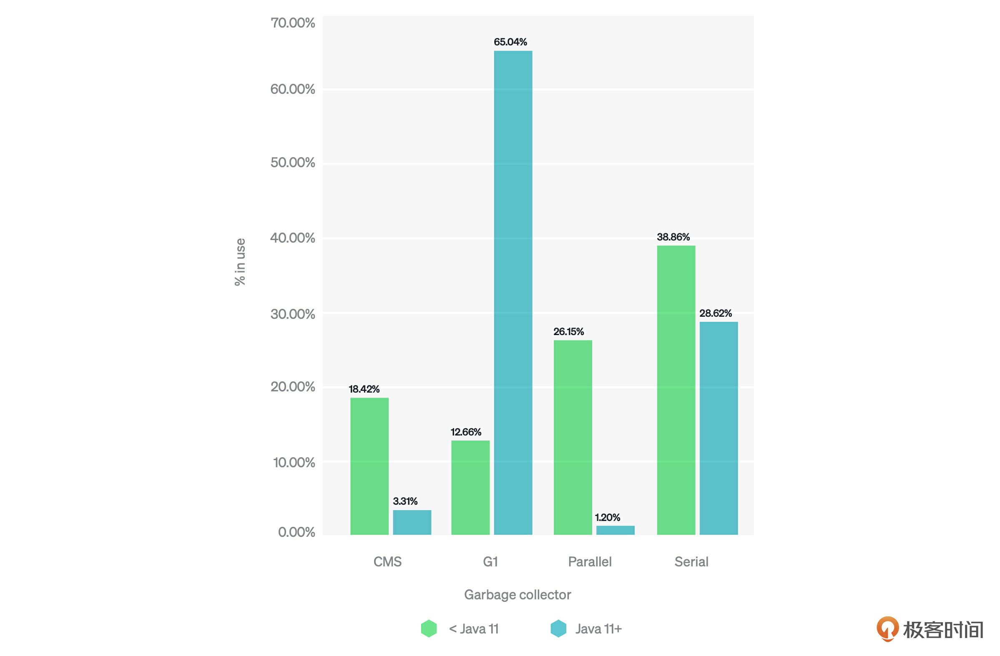
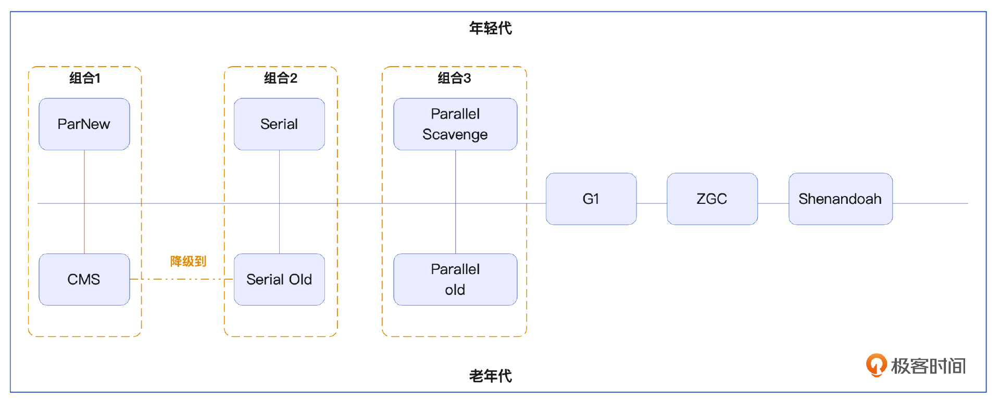
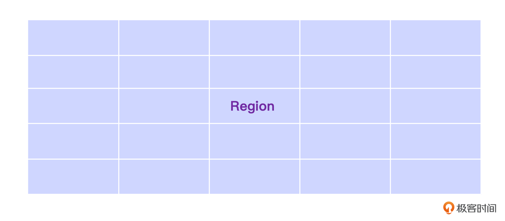
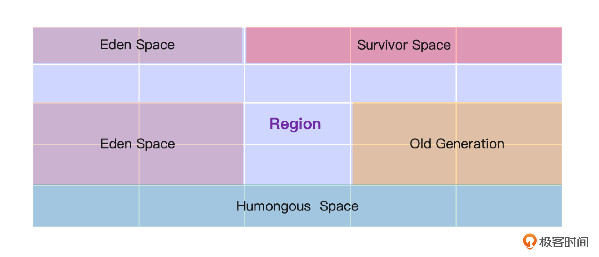
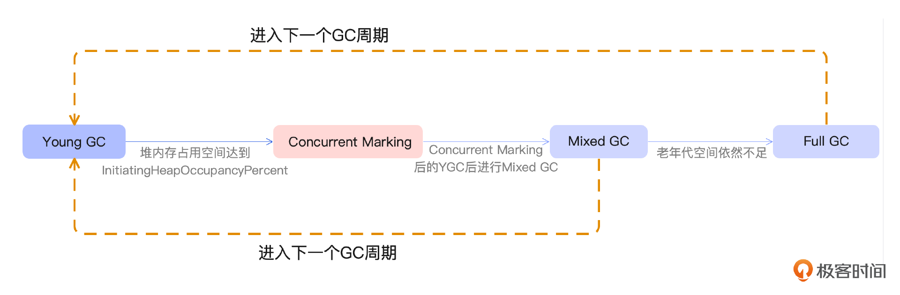
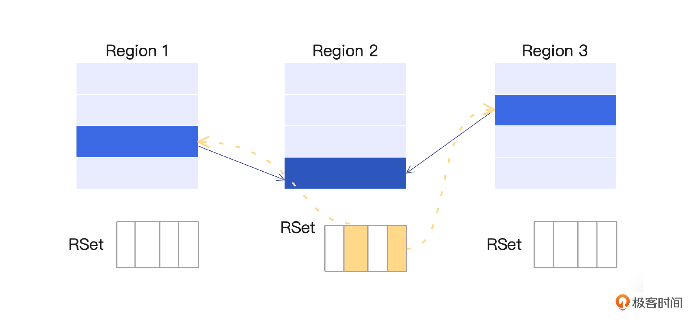
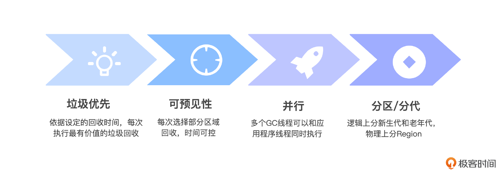
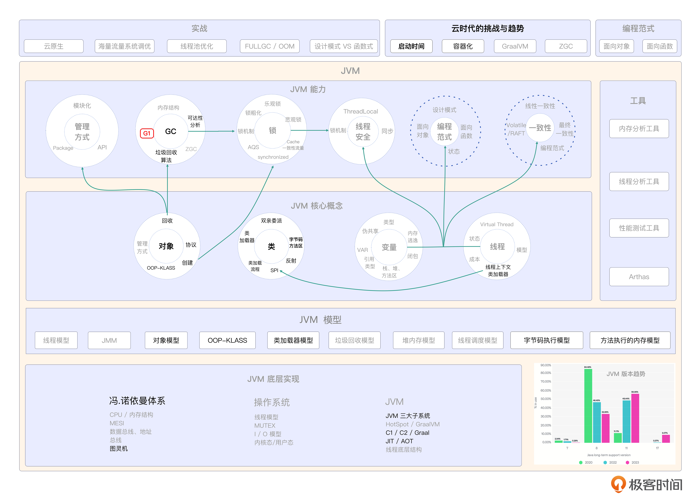

# 15｜垃圾回收器：为什么G1被叫做GC中的王者？
你好，我是康杨。

今天我们继续聊GC的话题。我们将选择一个具体的垃圾回收器进行深入的分析，这个选定的主角就是G1，也被称为Garbage First。

## 为什么选择G1？

在当前的生产环境中，JDK 8仍是被广泛采用的版本，在JDK 8时代，CMS和G1这两种垃圾回收器不分伯仲，在不同业务场景中，各有优劣。而造成这种现象的原因是我们正处在一个时代的转型期，也就是从物理机到虚拟机再到云时代的转型期，目前正是多代并存的历史节点，也就是在实际生产环境中既有使用传统的物理服务器的业务，也有使用虚拟机的业务，更有已经大规模迁移到云平台的业务。

底层基础设施变迁，对我们如何使用JVM也在产生着潜移默化的影响。而New Relic最新发布的2023年的报告给我们指明了一个方向。

报告中指出在JDK 11及以上的版本中，G1一骑绝尘，使用率占比达到65% 。所以在这个CMS垃圾收集器逐步淡出历史舞台，而ZGC还未完全成熟的阶段，G1垃圾收器注定将在未来的一段时间内扛起主流垃圾收集器的大旗，成为兼顾延迟与吞吐的最佳选择。而现实中，在JDK 11逐渐登上历史舞台的背景下，越来越多的系统，通过升级到G1以实现性能的提升。这也是我们今天选择G1作为介绍对象的原因。

## G1 是什么？

G1有很多里程碑式的创新，下图是一个缩减版的垃圾收集器全景图。

从图中可以看出，G1之前每个垃圾收集器一般只是负责新生代或老年代的垃圾回收，然后通过组合的方式来完成GC的整体职责。而G1是第一个同时支持年轻代和老年代垃圾回收的垃圾回收器。在此之后，其他的垃圾回收器也遵循了这样的发展路线。

## **G1 垃圾回收算法**

### **G1 内存划分**

区别于其他采用分代收集算法的垃圾回收器，G1中的年轻代、老年代是一种逻辑划分，而不再是物理划分，也就是说年轻代和老年代不再是连续的内存地址空间，而是一组Region的集合。这里的Region是G1中最小内存分配单元，你可以通过 `-XX:G1HeapRegionSize=n` 来设置Region的大小，可以设定为1M、2M、4M、8M、16M、32M。

需要注意的是，JVM中规定Region的大小必须是2的整数幂，并且不能超过32M。如下图所示，当你采用G1作为垃圾收集器时，JVM会将堆内存划分为一个个大小相同的Region进行管理。所以合理设置Region的大小，是用好G1的一个非常重要的因素。

### 垃圾回收算法

G1 采用的是分代收集和区域（Region）划分相结合的垃圾回收算法。在最小的物理内存单元是Region的基础上，依据分代收集算法，G1将堆内存在逻辑层面划分为4个区域，分别是Eden Space、Survivor Space、Old Generation 以及 Humongous Space。Eden Space 与 Survivor Space 的组合，就是我们通常说的年轻代，而Humongous Space是G1专门提出来的一个区域，用于专门存储程序中的大对象。

一个对象的大小如果超过了Region容量的一半，就会被直接存放至 Humongous区域。当对象的大小远超Region大小的时候，JVM会分配连续的Humongous Region用来存放这个对象。

### **GC 模式**

基于上面提到的内存划分和垃圾回收算法，在G1中存在三种GC模式，分别是 **Young GC、Mixed GC 和 Full GC**。

和所有采用分代收集算法的垃圾回收器一样，当Eden区的内存空间无法支持新对象的内存分配时，G1会触发Young GC。

当需要分配对象到Humongous区域或者堆内存的空间占比超过 `-XX:G1HeapWastePercent` 设置的 `InitiatingHeapOccupancyPercent` 值时，G1 会触发一次 concurrent marking，它的作用就是计算老年代中有多少空间需要被回收，当发现垃圾的占比达到 `-XX:G1HeapWastePercent` 中所设置的G1HeapWastePercent比例时，在下次Young GC后会触发一次Mixed GC。所谓Mixed GC是指回收年轻代的Region以及一部分老年代中的Region。

在Mixed GC过程中，如果发现老年代空间还是不足，此时如果G1HeapWastePercent设定过低，可能引发Full GC。 `-XX:G1HeapWastePercent` 默认是5，意味着只有5%的堆是“浪费”的。如果浪费的堆的百分比大于G1HeapWastePercent，则运行Full GC。Full GC是在日常生产中需要格外关注的情况，因为它不仅会影响用户体验，更有可能引发雪崩。课程最后一章我也为你详细讲解怎么避免Full GC的发生。

### **预期停顿模型**

在以Region为最小管理单元以及所采用的GC模式的基础上，G1建立了停顿预测模型，即Pause Prediction Model 。这也是G1非常被人所称道的特性。借助 `-XX:MaxGCPauseMillis` 参数，你可以设定一个G1收集过程目标停顿时间，默认值是200ms，不过它不是硬性条件，只是期望值。作为一个响应时间优化的GC算法，这也是它和CMS一个非常大的不同。

### **如何定位一个待回收对象**

在 [第 13 讲](https://time.geekbang.org/column/article/702278) 中，我们提到了GC如何借助OopMap定位待回收对象。在G1定位待回收对象的时候，还有两个重要的工具，分别是Remembered Set（记忆集）和Card Table（卡表）。

#### Remembered Set（记忆集）

每个Region都有对应的Remember Set。主要记录某个Region里的对象被别的Region的对象引用的情况。这样，当开始扫描时，只需要将某个Region的GC roots set中加上remember set，就能保证没有遗漏。

#### Card Table（卡表）

Card Table也是G1用于处理跨Region引用的一种方式，主要应用在并发标记阶段。Java堆被分为很多小块，也叫做Card（卡片），每张卡片默认大小就是512Byte，每张卡记录了从某个地址开始连续512字节内存范围的变化情况。当在写入对象引用的时候，JVM会把含有这个引用的卡标记为“dirty”，如果卡中的对象发生了改变，那么对应的卡就会被标记，这样在进行垃圾回收的时候，可以找出可能的跨区引用，避免引用丢失。

Remembered Set和卡表的主要作用就是为了处理和跟踪跨Region引用关系，避免在进行局部垃圾回收时，出现引用丢失导致应用出错。这两个概念的使用无需程序员关心，都是由JVM和G1收集器自动完成的。但是正是借助记忆集和卡表的功能，G1会在运行期间计算出每个Region回收的性价比。从而借助停顿预测模型，找出用户预期时间内最高回收收益的Region组合。

## G1的JVM参数解析

为了更好地使用G1，让我们一起来看看G1中有哪些重要的JVM参数需要配置，以及如何配置。

### -XX:+UseG1GC

这个参数告诉JVM，我们计划使用G1作为垃圾回收器，所以它是使用G1的必设参数。

### -XX:G1HeapRegionSize

G1垃圾回收器用这个参数来设置每个 Region的大小。在不设定此参数的情况下，JVM 会根据整个堆的大小自动设定 Region 大小，JVM 尝试为 G1 创建约 2048 个 Region。在选择合适的 G1HeapRegionSize 值时，下面2点需要考虑。

1. 首先是堆的大小，堆越大，每个 Region 的大小就越大。
2. 其次是暂停时间的要求，如果需要更短的 GC 暂停时间，可以考虑把 Region 设小一些。最后就是对象的大小：如果应用有很多大对象，Region就应该设置得大一些。

所以，如果你的应用分配的堆比较大，并且需要创建大量大对象的时候，可以考虑适当把这个值调大。而如果你的应用对暂停时间有很高的要求，比如金融交易系统，那么可以适当调低这个值，使我们的堆利用率和GC的暂停时间达到良好的平衡。G1HeapRegionSize值对G1非常关键，在设置之前最好结合具体的业务和负载情况，根据监控和性能测试来动态调整和优化。

### -XX:MaxGCPauseMillis

这是G1收集器的目标停顿时间，单位为毫秒，默认值为200。JVM将尽其所能不超过这个设置值。G1会尽量达成，即使达不成，也会通过逐渐调整虚拟机的状态来尽力达成。

比如，对于Young GC来说，就是通过减少Eden space的个数，来降低Eden space 的处理时间。减少Eden的总空间时，会引发更加频繁地Young GC，也会同步加快Mixed GC的执行频率，因为Mixed GC是由Young GC触发的，或者说是借机同时执行的。频繁GC会对应用的吞吐量造成影响，每次Mixed GC回收时间太短，回收的垃圾量太少，可能导致GC的垃圾清理速度赶不上应用产生的速度，从而引发Full GC，这是要极力避免的。

所以暂停时间不是设置的越小越好，也不能设置得偏大却指望G1自己会尽快处理。这样可能会导致一次全部并发标记后触发的Mixed GC次数变少，但每次的时间变长，STW（stop the word）时间变长，这样对应用的影响更加明显。

### -XX:InitiatingHeapOccupancyPercent

这个参数简称IHOP，是G1通过整个堆占用情况来决定是否需要对老年代启动并发标记的阈值。默认值是45，也就是当整个堆空间有45%的空间被占用时，JVM会启动并发标记。

使用G1时，对这个值的设置非常重要。如果我们设置得过高，将导致并发标记的启动过于迟缓，可能没有完成标记就需要进行Full GC。而设置过低的话，会导致过于频繁地并发标记，增加CPU的负载，从而影响整个系统的性能。

在实际的业务场景中，如果你的应用对象创建并存活到老年代的速度比较快，或者并发标记所需的时间比较长，我们可以通过降低IHOP的值来避免FULL GC。而如果你的业务场景中，并发标记完成得很快，或者对象生产的速度不高，我们可以通过提高IHOP的值，减少并发标记的次数，从而减少STW的次数提升整个系统的性能。

具体实践中，你可以先通过日志查看历次Young GC的信息，观察每次Young GC后，老年代的使用率，取一个业务高峰期老年代的平均使用率作为 IHOP 的初始值，然后通过业务压力测试、调优，动态调整这个值，来达到最佳的效果。从JDK 9开始，IHOP的默认值虽然也被设定为45，但是G1会根据运行情况动态调节 IHOP 的值，当然你也可以通过 `-XX:-G1UseAdaptiveIHOP参数来关闭这个功能`。

### -XX:ParallelGCThreads

这个参数设置了GC的线程数，一般情况下，可以设置为和CPU内核数相同的数字。

### -XX:ConcGCThreads

这个参数设置并行GC的线程数，默认值是ParallelGCThreads 除以 4的值，也就是在非STW期间的GC工作线程数，当然其他的线程很多工作在应用上。当并发周期时间过长时，可以尝试调大GC工作线程数，但是这也意味着这期间应用所占的线程数减少，会对吞吐量有一定影响，可以设置为$ConcGCThreads = (3 + ParallelGCThreads) \\div 4$。

## 重点回顾

作为一个承前（CMS）启后（ZGC）的垃圾收集器，在可预见的未来，G1注定会成为备受Java程序员关注的垃圾收集器。它很多里程碑式的特性，也必然会成为你日常进行系统优化的利器。通过将堆内存化整为零，G1以Region作为最小的内存分配和回收的单元，从而有效减少了GC的范围，并通过引入global concurrent marking 机制、建立预期停顿模型，实现对内存回收的精细化的管理，从而具备了“低延迟”和“可预测”的能力。

由于G1在垃圾回收过程中，采用的是标记复制的算法而不是标记清除，所以垃圾回收中的空间碎片化问题，在G1中得到了有效的解决。

当然这些优势的背后，也增加了一些潜在的成本，由于采用Region作为最小内存管理单元，而且G1为每一个Region都建立了一个独立的Remembered Set，当程序中对象创建或变动频繁的时候，G1的管理成本相比其他垃圾回收器必然会增高。

而且G1也不是银弹，使用不当，依然可能引发Full GC。尤其是在使用JDK 8的时候，到底是选择CMS还是G1，还是需要基于程序的特性，比如对象生成速度以及分配给JVM的内存，需要你结合实际的压测数据进行综合的调优和慎重的选择。

最后你在使用和配置G1的JVM参数的时候，还需要重点关注几个方面。

1. 首先是选择合适的堆大小，保证系统有足够的内存供应用程序运行，但也要避免过大导致长时间的GC。
2. 其次选择合理的目标停顿时间，通过定制GC停顿时间，实现吞吐量和停顿时间的平衡。
3. 线程数和CPU核心数一致也要重点关注，选择合适的并行线程数可以有效利用硬件资源，提高GC效率。
4. 合理设置Region的大小，避免过大或者过小，从而影响整体GC的性能。

最后我们用一张图来总结G1的特点。

## 思考题

G1的特性有哪些？G1中的内存是如何管理的？

欢迎你把思考后的结果分享到评论区，也欢迎你把这节课的内容分享给其他朋友，我们下节课再见！

## 💡点亮你的知识框架图

