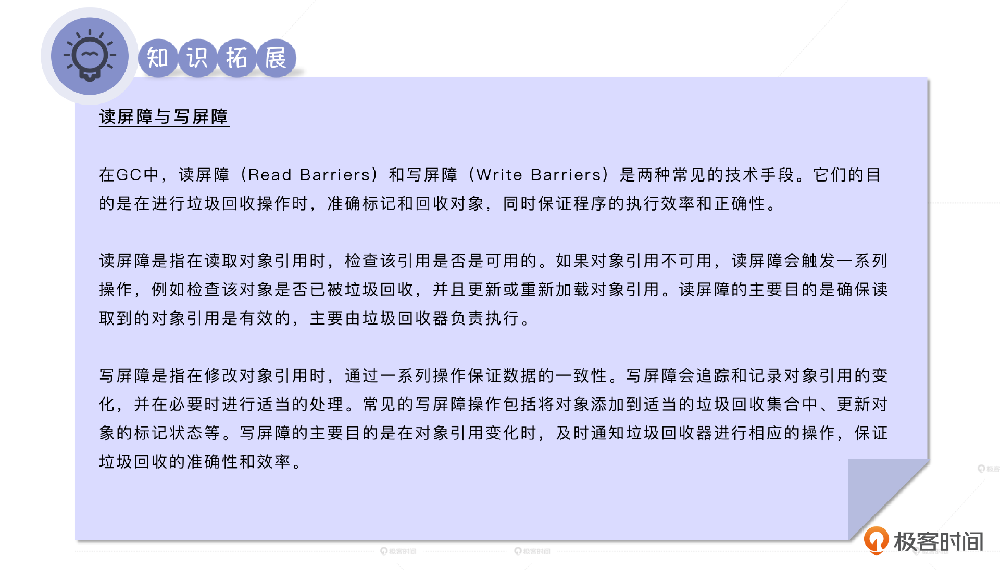
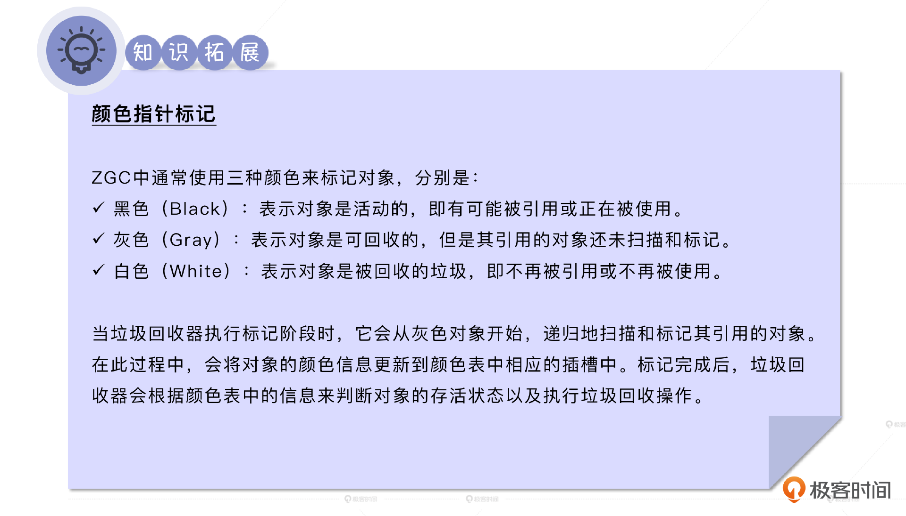
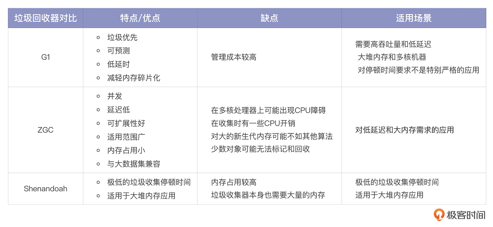
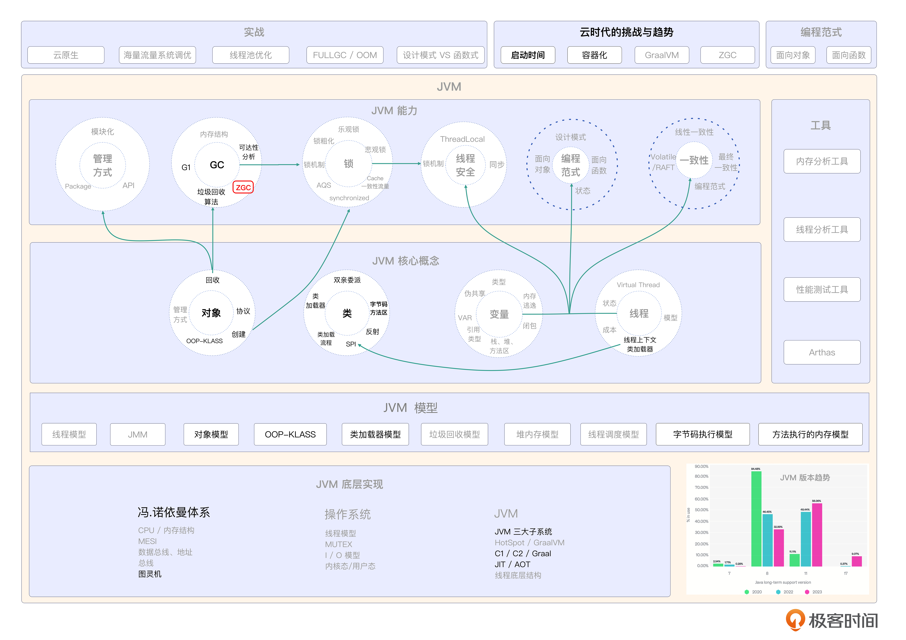

# 16｜垃圾回收器（下）：面向未来的ZGC、Shenandoah
你好，我是康杨。

今天我们继续来聊GC的话题，上一节课我们介绍了当前生产环境中GC的王者G1，还记得它的特点吗？没错，就是垃圾优先、可预见性、并行、分区分代，我们也说过G1是一个承前启后的垃圾回收器，而它启的这个后就是ZGC和Shenandoah，也就是我们今天的主角，它们代表着未来GC的主流。

## ZGC的由来

随着云计算和大数据的迅猛发展，现代应用程序对于扩展性和低延迟的需求越来越高。传统的垃圾收集器在处理大内存应用程序时经常面临长时间停顿的问题，这导致了应用程序的性能下降。

为了解决这个问题，Oracle决定开发一种全新的垃圾收集器，旨在提供低停顿时间、高可伸缩性和适用于大内存应用程序的解决方案。于是在2017年，Oracle推出了名为ZGC的垃圾收集器，首先作为Oracle JDK的一个实验性功能引入。在随后的几个版本中，Oracle对ZGC进行了改进和优化，不断增加新功能，提升性能，并解决了一些问题。最终，ZGC在JDK 11中正式成为Oracle JDK的一部分，摇身一变，成为了一种稳定的垃圾收集器，并提供商业支持。

与此同时，ZGC也在OpenJDK中不断得到改进。Oracle把ZGC的源代码提交给了OpenJDK社区，供社区成员参与测试、优化。自JDK 11起，OpenJDK把ZGC作为它垃圾收集器的一部分，并在OpenJDK的发行版本中提供了稳定版本，供开源社区使用和改进。

在ZGC的演进过程中，Oracle和OpenJDK社区不断改进ZGC的性能、可靠性和功能。为了保证获取到最新的引用信息，ZGC使用了 **读屏障技术** 来捕获引用关系的变化。除此之外，ZGC也具有 **支持大型堆内存** 的功能，最高可达16TB的堆内存容量。这对于需要处理大量数据的应用程序非常有用。

ZGC还被设计得易于使用和调试。它的配置参数相对较少，简化了使用和调优的复杂性，使开发人员能够更轻松地应用和优化。

总的来说， **ZGC是一种专为高并发和大内存应用场景设计的垃圾收集器，具备可伸缩性、低停顿时间、大堆内存支持和易用性等特点。**

它的引入给开发人员提供了一种高性能的解决方案，尤其在大数据处理和高并发应用中发挥重要作用。ZGC通过使用一些先进的技术和算法，实现了这些特点和功能。在开始介绍ZGC之前，我们先来对比一下ZGC和我们之前介绍的G1。

## ZGC VS G1

G1在回收过程中存在两个基本阶段：标记阶段和清除阶段。

在标记阶段，GC会找出所有需要被清除的对象。然后在清除阶段，GC会清除那些已经被标记的对象。这个过程所有的应用线程都需要暂停。然而在ZGC中情况有所改变。ZGC使用了一种叫做“并行”的方式来进行垃圾收集，这解决了G1必须停顿的问题。

并行处理意味着ZGC可以同时进行标记和清除这两个动作，而不是像G1和CMS那样等待标记阶段完成后再进行清除。这样，ZGC可以在可预见的暂停时间内更好地处理大型数据集。

举一个简单的例子，假设我们有一个大型数据集，里面有1000万个对象，这对于G1和CMS来说可能需要几秒钟甚至更长的时间来完成垃圾回收的过程，因为它们需要先标记所有的对象，然后再进行清除。而在ZGC中，由于标记和清除可以同时进行，即使数据集非常大，它也能在预设的暂停时间内完成垃圾回收。

当然，这个过程在实际的代码中可能需要更复杂的操作，但是这个例子能够帮助你理解ZGC如何处理大型数据集，以及它与G1之间的区别。

总的来说，ZGC解决了G1在处理大型数据集时可能产生的暂停、无法实时回收垃圾的问题。在实际应用中，ZGC的并行处理方式已经得到了证实，无论数据集有多大，都能在可预见的暂停时间内完成垃圾回收。这就是ZGC的魅力所在。

接下来，让我们看看ZGC和G1更详细的对比。

1. 首先是 **低延迟**。ZGC的设计目标是实现低延迟，不管堆内存大小如何，都能保证垃圾回收的停顿时间在10毫秒以内。相比之下，虽然G1也设计成了低延迟，但在处理大规模数据的时候，它们的停顿时间往往超过了10毫秒。
2. 其次是 **并发工作**。ZGC的另一个亮点是它可以在应用程序运行时进行垃圾回收。而G1的并发模式会在一些阶段需要Java线程停下来等待，这会影响程序性能。
3. 最后是 **内存压缩**。ZGC支持内存压缩，也就是把活跃对象压缩到内存的一部分，从而释放更多内存空间。而G1则需要额外的Full GC操作来实现相同的效果。

那ZGC是如何实现这么多功能的呢？靠的就是ZGC的黑科技——颜色指针。

## ZGC的黑科技：颜色指针

ZGC和传统的Java垃圾收集器不同的地方在于它的GC信息是存储在指针里的，而不是对象头部。为了实现这一点，ZGC利用了64位机器的一些位来存储垃圾收集信息。具体来说，在64位机器上，第42位用来描述实际的虚拟内存地址，接下来的4位（第43位～第46位）用来描述元数据，最后的17位是固定的。

此外，ZGC还引入了一种叫做颜色指针的技术，来提高垃圾回收器的效率，降低停顿时间。在并发标记阶段， **颜色指针可以帮助垃圾回收器判断对象是否已经被标记为活动或非活动状态**，从而避免在并发标记过程中使用读屏障捕获引用关系的变化，降低垃圾回收的开销和停顿时间。简单来说，在垃圾收集期间，如果一个对象被颜色指针标记为“黑色”，那就表示它是活动的，否则就是非活动的。通过这种方式，颜色指针在不侵入传统垃圾收集的基础上提高了垃圾收集的效率和降低了停顿时间。

总的来说，ZGC通过将垃圾收集信息存储在指针中并引入颜色指针技术，实现了高效的垃圾回收和内存管理。而基于这些能力，ZGC的垃圾回收过程也与众不同。

## ZGC的垃圾回收过程

ZGC就像一个超级高效的管家，它负责一个巨大的商场，那些门店就像是你的程序，而那些正在出售的商品就好比是对象。当ZGC来到工作岗位时，它马上开始检查标签。它瞥见每一个对象商品，然后贴上一个“Remapped”的标签，表示这些商品需要重新整理。

紧接着，ZGC像一个精密的机器，瞬间开始扫描每一件商品，看看哪些商品正在被顾客浏览和购买。对于这些商品，它会把它们的标签改成M0。意思就是这些商品是活跃的，正在被使用。

完成扫描后，ZGC进入并发标记阶段，开始更深层次的检查。它开始一一检查每个商品的详细信息，包括它们的价格、位置、顾客的喜爱程度等等。检查完之后，它注意到有些商品已经过时了或者没有顾客感兴趣。这些商品就像是内存里不再需要的对象。于是进入了回收阶段，它准备进行清理这些对象。它计算每个货架上的商品情况，如果某个货架上的过时商品超过了货架数的25%，这个货架就会被选中进行整理。

清理完成后，ZGC来到了初始转移阶段。它开始重新布局，让更多的热门商品占据主要位置。同样，它会移动内存中的活跃对象，这就是初始转移阶段。每一个被移动的商品，它都会把标签从M0变更成M1。

ZGC在忙于上述的工作的同时，还得监控商场的情况。这就是读屏障的作用。每当有顾客想要购买某个商品时，它都会检查那个商品的标签是不是M0，如果是，它就会帮顾客把商品挪到结账区，并把那个商品的标签改为“M1”。

与此同时，ZGC比起其他的垃圾回收器，比如G1或者CMS，它有一个巨大的优势：它可以一边让顾客继续购物（程序运行）一边做清理和整理工作。也就是说，你的顾客（程序）根本感觉不到背后正在进行的清理工作，他们可以无阻碍地继续购物（程序运行）。之所以能实现这种效果，是因为相比于G1 采用写屏障的方式，ZGC采用的是读屏障的方式。

ZGC就好像是一位无所不能的管家，它一手掌控着商场的运行，一手高效地进行商品的整理和清理，让顾客能愉快地购物，同时保证商场高效且有序地运行。这就是ZGC垃圾回收器的工作流程，也是它能提供更高性能的秘密。

## ZGC的最佳实践

作为新型的GC，如何更好地使用ZGC？我整理了ZGC使用的最佳实践，你可以参考下。

### 分配合适的内存

根据应用程序的内存需求和系统资源，使用 `-Xmx` 参数设置合适的最大堆内存大小。确保为应用程序提供足够的内存空间，避免频繁地垃圾收集导致性能下降。

### 调整并发线程

根据应用程序的性能需求和系统配置，使用 `-XX:ConcGCThreads` 和 `-XX:ParallelGCThreads` 参数调整并发GC线程和并行GC线程的数量。适当增加并行线程的数量可以加快标记和整理操作的速度，提高垃圾收集的效率。

### 注意资源限制

如果应用程序运行在有限的硬件资源上，如CPU核心数、内存容量等，确保不超过系统的限制。避免过度配置并发和并行线程的数量，以免竞争资源导致性能下降。

### 启用垃圾收集日志

在调试和优化阶段，启用垃圾收集日志，使用 `-XX:+UnlockExperimentalVMOptions -XX:+UseZGC -Xlog:gc*` 参数，以便查看GC日志，了解内存分配和回收情况，并识别潜在的性能问题。

### 监控和调优

使用合适的监控工具监视应用程序的内存使用和垃圾收集性能。根据监控数据进行调优，例如调整垃圾收集相关参数或进行代码优化，提高应用程序的性能和可伸缩性。

ZGC适用于具有大内存需求和对低停顿时间敏感的应用程序，例如大型数据库、内存缓存和大数据处理等。根据具体的应用程序和系统配置进行实验和性能测试，以找到最适合的参数和配置。在生产环境中使用ZGC的时候，你还要确保使用Java 11或更高版本的JDK。

## **Shenandoah**

和ZGC一样，Shenandoah也是一款为减少停顿时间而设计的垃圾收集器。它们的共同目标还包括减少垃圾收集对应用程序的影响，让应用程序在垃圾收集过程中继续运行。

但在关键的技术方面，它们有一些区别。Shenandoah使用 **转发指针** 来重新定向对象的引用，而ZGC则使用 **额外的重定位信息** 来跟踪对象的引用。此外，Shenandoah使用 **连接矩阵** 来记录对象之间的引用关系，在并发标记和清理时起着重要作用。相比之下，ZGC则通过 **屏障器** 来追踪对象引用的变化，而不需要连接矩阵。

总之，Shenandoah和ZGC都致力于减少停顿时间的垃圾收集，不过也有各自的特点和应用场景，你在选择适合的垃圾收集器时，需要综合考虑应用程序的需求和环境。

## 重点回顾

ZGC在战略上沿用了前几代垃圾回收器的算法策略，采用并发标记和并发清理的思路，在战术上通过颜色指针等技术达到更理想的并发清理。但ZGC同样不是银弹，它也有自身的优缺点。

它的优势在于一旦一个内存区域的活跃对象被移走，这个区域就可以立即得到清空和重复利用，不用等待所有针对这个区域的引用修正完成；颜色指针降低了内存屏障的使用频次，只使用了读取屏障；颜色指针显示出高扩展能力，可以记录与对象标记、重新定位相关的信息，以提高性能。

它的劣势在于对快速分配的对象分配速度存在一定的约束，长时间保持高分配速度会导致全并发收集周期过长，且回收的内存空间小于并发生成的浮动垃圾占据的空间，导致堆内可移动的剩余空间逐步减少；吞吐量低于G1，尤其是在堆比较小的情况下，ZGC的性能损失可能达到5%到15%。

所以说，ZGC并不是一个全新的垃圾回收器，而是在前几代垃圾回收器的基础上进行了优化。它的出色表现有可能改变未来的编程方式，垃圾回收器喜欢不可变对象，因为它们更容易处理。有了ZGC强大的回收能力，我们不用再担心内存和垃圾回收的限制，可以大胆地使用不可变对象进行代码编写。

## 思考题

你在工作中用的是哪种垃圾回收器，你觉得在你的工作环境中它的优缺点是什么？

欢迎你把你的经验分享到评论区，也欢迎你把这节课的内容分享给其他朋友，我们下节课再见！

## 💡点亮你的知识框架图

