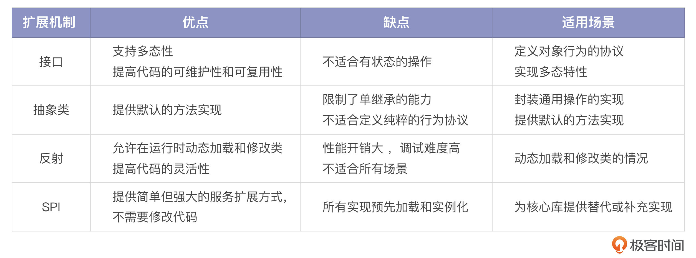

# 17｜偷龙转凤：JVM中的扩展之道
你好，我是康杨，今天我们一起来聊聊JVM为我们提供的扩展机制。

前面我们介绍了JVM的对象模型、类加载机制、SPI等，这些都是JVM为了帮助我们写出更优雅的Java程序所提供的各种功能。但是掌握这些功能，了解它们背后的原理，还远远没办法支撑我们写出满足复杂的生产环境要求的代码。在这个越来越复杂，发展越来越快的时代，业务对我们的要求已经变成了怎么在实现既定功能的基础上，让程序具备稳定性、灵活性和扩展性，所以，今天我们一起来聊聊JVM的扩展之道。

## 扩展之道

Java扩展机制是一个非常丰富而又深奥的知识领域，涉及了Java语言的核心特性，间接地决定了Java生态系统的丰富程度。

简单来说，扩展机制是一种用来增加或修改系统功能的机制，而不需要改动系统的主体结构。在Java中，常见的扩展机制有接口、抽象类、反射、SPI等。

扩展机制的作用是什么呢？其实在软件开发中，我们经常需要为程序增加新的功能或者修改已有的功能。如果没有扩展机制，我们就需要修改原有的代码，这样会增加出错的可能性，而且这样操作也“不符合对修改关闭，对扩展开放”的开闭原则。扩展机制正好可以帮助我们避免这个问题，它允许我们 **在不改变原有代码的基础上进行功能的扩展**。

扩展机制的应用是非常广泛的，比如在电商平台的购物车中，常见的功能包括选择商品、增加商品、减少商品、提交订单等，这些建立在基础功能之上的各种业务操作，就可以通过扩展机制来实现。

扩展机制的实现方式是多样的，接口、抽象类都可以用于定义公共的方法，供其他类实现或者继承；反射则可以在运行时动态地创建对象和调用方法；动态代理则可以在运行时动态地创建和控制对象的行为；SPI则是Java提供的一种服务提供发现机制，它允许第三方为一个产品或者一个服务提供插件。

下面我将通过解析这些扩展机制详细介绍它们的原理，最佳实践以及应用实例，这将是一趟精彩的旅途，希望你能享受在Java世界里的每一秒。

## 接口和抽象类

这两者在Java中有着至关重要的作用，它们创造了面向接口编程的基石，使Java具有了更强的灵活性。

接口是Java里的一种核心机制，它主要负责定义对象的行为协议。这里的协议，你可以理解成规定的一种标准，或者说是一种约束。接口就是规定了一种方法的集合，而这些方法如何实现，就由实现接口的类来决定。接口在Java里的特殊之处在于， **一个类可以实现多个接口，这就有力地支持了 Java 的动态特性。**

举个例子，假设你正在对接电商平台的购物车服务。在购物车中，会有加商品、减商品、查看商品等功能，我们就可以为这些行为创建一个“购物车服务接口”。然后我们还可以为不同种类的用户创建不同的服务类，来实现这个购物车接口，定义出不同的购物车逻辑。

再来看看抽象类，它被看作是接口的自然拓展。在一些情况下，不同的实现类里，有些方法可能会有一样的实现方式。如果每个实现类都重复这个实现，那么就有些浪费了。这个时候，抽象类就可以用来封装这些通用的操作。例如刚刚的购物车服务里，无论是哪类用户，只要他们添加商品，购物车里都会增加相应的商品，所以这样的操作就可以被提取到一个抽象类里，由具体的实现类去继承这个抽象类。

接下来，让我们看看实际的代码应该是怎样的。

首先，我们需要定义购物车服务应该具备什么样的功能，比如添加商品、删除商品和查看购物车中的商品等。我们可以把这些功能定义成一个接口。

```java
public interface CartService {
    void addProduct(Product product);
    void removeProduct(Product product);
    List<Product> getProducts();
}

```

接着，我们使用抽象类来给部分方法提供默认的实现。在这个例子里，添加商品和删除商品的行为可能会在所有购物车服务里以相同的方式实现，我们可以定义一个抽象类AbstractCartService来实现这两个方法。

```java
public abstract class AbstractCartService implements CartService {
    protected List<Product> products = new ArrayList<>();
    @Override
    public void addProduct(Product product) {
        products.add(product);
    }
    @Override
    public void removeProduct(Product product) {
        products.remove(product);
    }
    public List<Product> getProducts() {
        return products;
    }
}

```

然后，我们可以定义两个不同的购物车服务。假设我们的平台有普通用户和VIP用户两种类型的用户，VIP用户的购物车服务可能有一些特别的优惠政策。

具体的代码实现是这样的：

```java
public class RegularCartService extends AbstractCartService {
    // 普通用户的购物车服务，我们可以根据需求实现特殊的逻辑
}
public class VipCartService extends AbstractCartService {
    // 针对VIP用户，我们在添加商品时可能会有一些额外的优惠计算
    @Override
    public void addProduct(Product product) {
        super.addProduct(product);
        applyDiscount();
    }

    private void applyDiscount() {
        // 为VIP用户应用一些特别的折扣策略
    }
}

```

这就是我们结合实际场景设计出来的购物车功能服务。通过接口和抽象类，我们能灵活地为不同类别的用户实现不同的购物车。这就是在你的Java程序里使用接口和抽象类的方法。通过合理地使用这些元素，你可以减少代码的冗余，提高代码的可维护性和可复用性。但是要记住，抽象类是有状态的，可以包含成员变量，而接口是无状态的，不能包含成员变量。你需要根据不同的场景，选择最适合的设计方案。

## 反射

接下来我们来看反射机制。反射是Java的一项强大的特性，它允许我们在运行期动态加载和修改类，不像一般的方法调用需要在编译期确定下来，这给我们提供了极大的灵活性。

假设我们的购物车有不同的实现，比如VIP和普通用户的购物车，但我们并不知道用户属于哪种类型，甚至未来还有可能产生新的购物车类型。在这种情况下，反射就能派上用场了。

首先，我们需要一个工厂类，它可以根据参数来动态创建购物车服务实例。

```java
public class CartServiceFactory {
    public static CartService getService(String userType) {
        try {
            String className = "packageName." + userType + "CartService";
            Class<? extends CartService> cls = (Class<? extends CartService>) Class.forName(className);
            return cls.getConstructor().newInstance();
        } catch (Exception e) {
            throw new RuntimeException("Failed to create CartService", e);
        }
    }
}

```

然后，我们不用知道具体要实例化哪个类就可以构建购物车服务实例，只需要在运行时提供用户类型就可以了。

```java
public static void main(String[] args) {
    CartService cartService = CartServiceFactory.getService(args[0]);
    cartService.addProduct(new Product());
    // ...
}

```

然后在运行程序的时候，我们可以通过程序的参数来控制创建哪种购物车服务实例，比如传入“Vip”可以创建VipCartService实例。

这里你需要注意的是，虽然反射非常强大，但是它也有缺点，比如 **性能开销大、调试难度高、不适合运行在所有的场景下**。而在我们的例子中，反射帮助我们在运行时动态选择合适的购物车服务，提高了代码的灵活性，这是它的最佳实践之一。

## SPI

SPI 可以用于服务的发现。它允许第三方为一些核心库提供替代或补充的实现。下面我们将通过购物车服务里的优惠计算功能的应用来学习SPI。考虑到我们可能会有许多种不同的优惠策略，而且这些策略有可能在运行时动态改变。我们需要先定义一个优惠计算的接口。

```java
public interface DiscountCalculator {
    double calculateDiscount(Cart cart);
}

```

接着，我们可以提供一些默认的实现，例如节假日优惠、VIP用户优惠等。

```java
public class HolidayDiscountCalculator implements DiscountCalculator {
    // Implementation details...
}

public class VipUserDiscountCalculator implements DiscountCalculator {
    // Implementation details...
}

```

然后，我们需要在资源文件夹的 `META-INF/services` 目录下创建一个以接口全类名命名的文件，这个文件的内容就是这些实现类的全类名。

```java
// content of 'resources/META-INF/services/com.yourcompany.DiscountCalculator'
com.yourcompany.HolidayDiscountCalculator
com.yourcompany.VipUserDiscountCalculator

```

最后，我们就可以使用Java的SPI机制获取所有的优惠计算器实现了。

```java
ServiceLoader<DiscountCalculator> loader = ServiceLoader.load(DiscountCalculator.class);
for (DiscountCalculator calculator : loader) {
    // use each DiscountCalculator to calculate discounts for cart
}

```

这样一来，我们就可以动态地发现和使用所有可用的优惠策略了。如果将来需要添加新的优惠策略，唯一需要做的就是实现相应的DiscountCalculator接口，并把新的实现类的全名添加到 `resources/META-INF/services/com.yourcompany.DiscountCalculator` 中，不用做任何修改。SPI机制的优点是它提供了一种简单但强大的服务扩展方式。不过，它也有一些缺点，比如 **所有的实现都会被预先加载和实例化，可能会出现预料之外的行为。** 所以在选择使用SPI机制时，一定要谨慎。

## 重点回顾

Java的扩展机制有很多种，接口和抽象类提供了一种灵活的方式来定义和组织我们的代码，反射SPI机制则使我们的代码更具有灵活性和可扩展性，这些机制是构建大型、复杂、强大的Java应用程序的基础。

但是你需要注意，这些只是工具和途径， **真正的目的是使我们的代码更加容易阅读、修改和扩展**。我们应该合理利用这些机制，按需使用，不必强制使用其中某一种机制。特别是反射和SPI，虽然它们提供了强大的功能，但是同样会增加代码的复杂度，我们需要在灵活性和复杂性之间做出平衡。



总的来说，掌握和理解这些扩展机制，有助于我们更好地编写出满足实际需求的代码，同时也有助于我们更深入地理解Java语言的设计原理和理念，对于提升我们的编程能力有重要的意义。

推荐阅读：

[08｜反射机制：给你一把打开JVM后门的钥匙](https://time.geekbang.org/column/article/696610)

[09｜SPI机制：如何打造一个属于你的SPI程序？](https://time.geekbang.org/column/article/698494)

## 思考题

除了我们今天说到的Java的扩展机制，你还知道哪些？在实际的生产中你是如何应用这些扩展机制的？

欢迎你把你的经验分享到评论区，也欢迎你把这节课的内容分享给其他朋友，我们下节课再见！