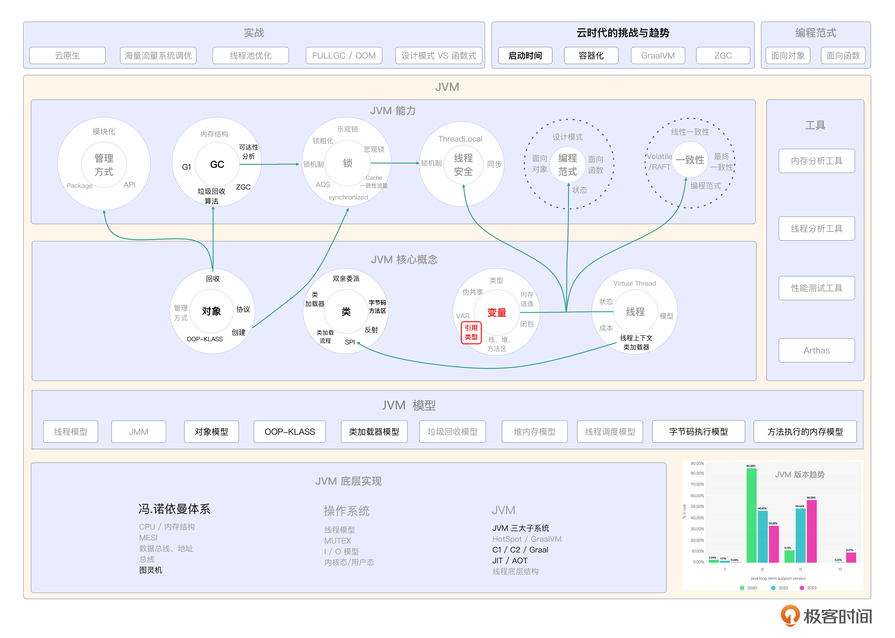

# 18｜被忽视的变量：带你全面认识JVM中的变量
你好，我是康杨。今天我们来重新审视一下JVM中的变量。

变量是我们操作JVM的最小单元，它在日常工作中很容易被忽略掉，而实际上它对内存管理和垃圾回收机制的影响很大。

深入地了解变量有助于我们理解强引用、弱引用和虚引用之间的区别以及对对象回收的影响，帮助我们更加灵活地使用Java内存模型，避免一些特殊情况下的内存泄漏和性能问题。而学会从不同的维度去认识变量，也是我们写出高性能的程序的基础。

## JVM中的变量

这节课我们将通过一个实际的例子去了解JVM中的变量以及变量中的类型。

### 静态类型和实际类型

```java
Food food = new Fruit();

```

作为一个变量food，它有一个静态类型和一个实际类型。静态类型是指变量最初被定义时的类型，而实际类型则是指变量所引用的对象的类型。当变量指向一个子类对象时，就有了多态的能力。让我们先看一下下面这段代码。

```java
class Food {
    public void eat() {
        System.out.println("Eat some food");
    }
}
class Fruit extends Food {
    @Override
    public void eat() {
        System.out.println("Eat some fruits");
    }
    public void peel() {
        System.out.println("Peel the fruit");
    }
}
class Main {
    public static void main(String[] args) {
        Food food = new Fruit();
        food.eat();  // 输出: Eat some fruits
        if (food instanceof Fruit) {
            Fruit fruit = (Fruit) food;
            fruit.peel();  // 输出: Peel the fruit
        }
    }
}

```

在这段代码中，我们有一个Food类和一个Fruit类，Fruit继承自Food。通过使用Food类型的变量来引用一个Fruit对象，我们可以实现多态。

现在，让我们来解读一下这段代码。变量food的静态类型是Food，但是它实际引用了一个Fruit对象。这意味着尽管food的外表是Food类型，但它能够调用Fruit类中的方法。

当我们调用 `food.eat()` 时，JVM根据food的实际类型决定调用的是Fruit类覆盖的eat方法，于是输出了 `Eat some fruits`。这就是多态的魔力，可以通过food的实际类型来决定执行的行为。

如果我们想调用Fruit类中特有的方法peel，我们需要进行类型转换。通过使用instanceof关键字来判断food是否实际引用了一个Fruit对象，如果是的话，就可以安全地将food转换为Fruit类型，然后调用peel方法。而JVM背后的实现原理，正是我们之前介绍的OOP-Klass模型和虚函数表。

在food背后，有一个与它对应的klass对象，它记录了food的类型信息，就像是有一个标签写着food的品类和特点。每个klass对象维护着一个虚函数表，记录了类中所有的虚函数以及对应的指针。当food调用一个方法时，JVM根据它的实际类型找到它的klass对象，然后在虚函数表中寻找正确的函数指针，使得food能够调用正确的方法。这种实现方式让我们具备了多态性，让它的行为可以根据实际情况进行适应。

多态是面向对象编程中非常重要的概念，它带来了代码的灵活性和可扩展性，让我们能够更好地应对不同的需求。

## **生存空间**

在Java中，变量的创建位置有三个：栈上、堆中和方法区中。变量的生命周期不同，所以它们会被创建在不同的位置。

首先，栈上的变量是局部变量，包括方法中定义的变量和代码块中定义的变量。它们的生命周期与方法调用或代码块的执行周期相同。变量在栈上的创建非常快速，而且在方法或代码块执行结束后会自动销毁。在使用栈上的变量之前，必须显式地为其赋值。

接下来，堆中的变量是通过new关键字创建的对象和数组。它们的生命周期与对象或数组本身相同，当没有引用指向它们时，会被垃圾收集器回收。堆中的变量创建比较耗时，需要为对象或数组分配内存空间，并进行初始化。在对象创建时，成员变量会被赋予默认值。

最后，方法区中的变量主要是静态变量。它们的生命周期与类的生命周期相同，在类被加载时创建，在类被卸载时销毁。静态变量在方法区中创建并初始化，在使用之前已经具有默认值。

现在，我们来看一个示例代码。

```java
public class Food {
    private String name;
    private int quantity;

    public Food(String name, int quantity) {
        this.name = name;
        this.quantity = quantity;
    }

    public void eat() {
        System.out.println("Eating " + name);
        quantity--;
    }

    public static void main(String[] args) {
        Food food = new Food("Apple", 5);
        food.eat();
        System.out.println("Remaining quantity: " + food.quantity);
    }
}

```

这个示例中，我们创建了一个Food类，它有一个name属性和一个quantity属性。在构造方法中，我们通过传入的参数对这两个属性进行赋值。eat()方法用于消耗食物，每次调用会令quantity减1。在main()方法中，我们创建了一个Food对象food，调用了它的eat()方法并打印剩余数量的代码。

在这个示例中，food对象是在堆中创建的，因为它是通过new关键字创建的。name和quantity属性是实例变量，会随着对象的创建而被初始化。quantity在每次调用eat()方法时会发生变化。在main()方法中，我们可以看到剩余数量被正确地打印出来。

希望通过这个示例，你能更好地理解变量的创建位置和初始化之间的关系。不同的变量在不同的位置创建，并且在相应的生命周期内进行初始化和销毁。了解这些概念对于理解JVM和Java程序的运行机制非常重要。

## 回收

```java
Food food = new Fruit();

```

在这行代码中，创建了一个强引用 food，它指向了一个Fruit对象。强引用意味着只要food存在，即使内存即将耗尽，垃圾回收器也不会回收这个对象的内存。

接下来，我们详细解读一下不同类型引用的特性和使用场景。

### 强引用（Strong Reference）

强引用是最常见的引用类型，它的作用是让对象存活期与引用的存活期保持一致。只要存在强引用指向一个对象，无论JVM内存是否充足，该对象都不会被回收。在上面的代码中，food就是一个强引用，只要food存在，所指向的Fruit对象就不会被回收。

### 软引用（Soft Reference）

软引用是一种比较灵活的引用类型，它的作用是描述非必要对象。当JVM内存即将耗尽，也就是说OOM之前，垃圾回收器会将软引用对象列为可回收的对象范围，为程序提供更多可用空间。在实际应用中，软引用常用于缓存机制中，用来缓存一些大对象或者需要频繁创建销毁的对象。如果在代码中使用软引用，可以使用SoftReference类进行封装和管理。

软引用的使用示例：

```java
SoftReference<Fruit> food = new SoftReference<>(new Fruit());
Fruit fruit = food.get();
if (fruit == null) {
    // 重新创建并赋值给fruit
}

```

### 弱引用（Weak Reference）

弱引用是相对于强引用的一种引用类型，强度较弱。如果一个对象只存在弱引用，且不存在强引用或软引用指向它，垃圾回收器在下一次进行垃圾回收时就会回收它。弱引用主要用于描述一些不是必需的对象，在强引用断开后该引用将不再持有对象。如果在代码中使用弱引用，可以使用WeakReference类进行封装和管理。

弱引用的使用示例：

```java
WeakReference<Fruit> food = new WeakReference<>(new Fruit());
Fruit fruit = food.get();
if (fruit == null) {
    // 对象已被回收，需要重新创建并赋值给fruit
}

```

### 虚引用（Phantom Reference）

虚引用是引用强度最弱的引用类型，它与其他引用类型略有不同。定义虚引用后，无法通过虚引用获取所指向的对象，并且虚引用对象无法直接使用。虚引用主要用于在对象被回收时收到通知，用于执行一些清理工作或记录相关日志。在代码中使用虚引用需要配合ReferenceQueue类进行管理。

虚引用的使用示例：

```java
ReferenceQueue<Fruit> queue = new ReferenceQueue<>();
PhantomReference<Fruit> food = new PhantomReference<>(new Fruit(), queue);
// 执行一些清理工作或记录相关日志

```

### 注意事项

1. 引用类型的选择要根据实际需求来决定，根据对象的重要性和特点来选择合适的引用类型。

2. 在使用软引用和弱引用时，需要注意空指针异常，因为调用get()方法时可能返回null值。

3. 虚引用一般用于特殊情况下的对象管理，不常用于普通业务逻辑中。


这就是关于引用类型的详细介绍和使用示例。根据不同场景需求，选择不同的引用类型可以更有效地管理内存，提高程序性能。

## 变量的本质

```java
 Fruit fruit = new Fruit();

```

我们回到这段代码，这次让我们从编程范式的视角来重新审视这段代码。

命令式编程和声明式编程一个非常大的区别，其实就是变量。命令式中的变量代表着运行时中内存的状态，而声明式的变量则是表达式的别名。我们首先了解下状态的内涵。

状态是指程序中的各种变量、对象和数据的集合，而这些变量、对象和数据的值会随着程序的执行而发生变化。在命令式编程中，我们通过改变变量的值来改变程序的状态，因此需要一步一步地指示程序应该如何执行。

而在声明式编程中，我们更关注所需达到的结果，而不是每一步应该如何执行。声明式编程更注重描述问题的“是什么”，而不是解决问题的“如何”。

现在让我们通过一个例子来说明这个区别。假设我们有一个函数food，它承载了一个特定类型的操作。我们假设food声明为 `Supplier<Food> food = () -> new Fruit();`。

在命令式编程中，我们会关注如何创建一个Fruit对象并将其赋值给food变量。我们会告诉计算机具体的步骤，就是使用 `new Fruit()` 来创建一个Fruit对象，并将其赋值给food变量。这是一种以指令为基础的编程方式，就是告诉计算机应该如何执行。

然而，在声明式编程中，我们更关注食物对象应该具备什么特性，而不是如何创建它。我们声明food是一个供应商类型的变量，并使用Lambda表达式定义这个供应商，返回一个新的Fruit对象。具体的创建过程则由编程环境和运行时系统自动完成。这种方式更注重描述问题，而不是具体的实现步骤。

接下来，让我们补充完整代码，并提供一些最佳实践和注意事项。

```java
import java.util.function.Supplier;

public class Main {
    public static void main(String[] args) {
        // 使用命令式编程创建一个Fruit对象并赋值给fruit变量
        Fruit fruit = new Fruit();

        // 使用声明式编程创建一个返回Fruit对象的供应商并赋值给food变量
        Supplier<Food> food = () -> new Fruit();

        // 进行一些操作，例如调用供应商返回的对象
        Food newFood = food.get();
        String foodName = newFood.getName();
        System.out.println("我有一个" + foodName);
    }
}

interface Food {
    String getName();
}

class Fruit implements Food {
    public String getName() {
        return "水果";
    }
}

```

在这个示例代码中，我们使用命令式编程和声明式编程的方式分别创建了一个Fruit对象并赋值给对应的变量。注意，在声明式编程中，我们不需要指定对象创建的具体步骤，只需定义一个返回Food类型的对象的供应商，并将其赋值给变量。然后我们可以通过调用供应商获取对象的方法来对变量进行操作。

## 重点回顾

变量有两个重要的属性：静态类型和实际类型。静态类型是变量最初定义时的类型，而实际类型则是所引用对象的类型。利用多态的特性，我们可以通过一个父类类型的变量来引用子类的对象。

在内存管理方面，我们可以使用不同的引用类型，比如强引用、软引用、弱引用和虚引用。强引用是最常见的，只要一个对象被强引用指向，这个对象就会一直存活。软引用和弱引用则用于描述非必要对象，可以在内存紧张时被回收。虚引用是一种引用强度最弱的引用类型，一般用于对象回收通知和执行清理工作。

另外，我们还可以区分命令式编程和声明式编程的方式。命令式编程关注如何执行任务，而声明式编程关注我们想要达到的结果。在声明式编程中，变量是表达式的别名，更注重问题的描述而不是具体的实现步骤。

通过理解这些概念，我们可以更好地理解变量的静态类型和实际类型之间的关系、多态的原理、不同引用类型的特点和用途，以及命令式编程和声明式编程的区别。这样的认知可以改善我们的编程技能和思维方式，并且更好地理解Java程序的运行机制（特性）。

## 思考题

学而不思则罔，学完这节课之后，我给你留两个问题。

1. 什么是变量的静态类型和实际类型？
2. 我们还可以从哪些视角来看待Java中的变量？

希望你认真思考，然后把思考后的结果分享到评论区，我们一起讨论，如果有收获的话，也欢迎你把这节课的内容分享给需要的朋友，我们下节课再见！

## 💡点亮你的知识框架图

