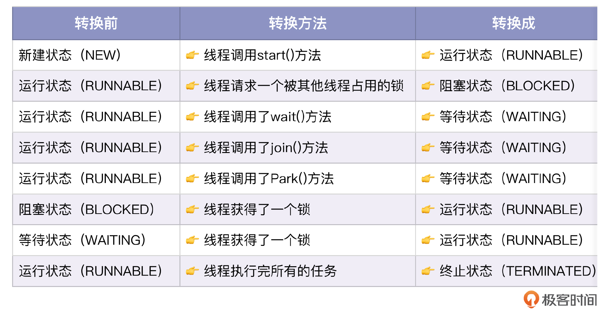
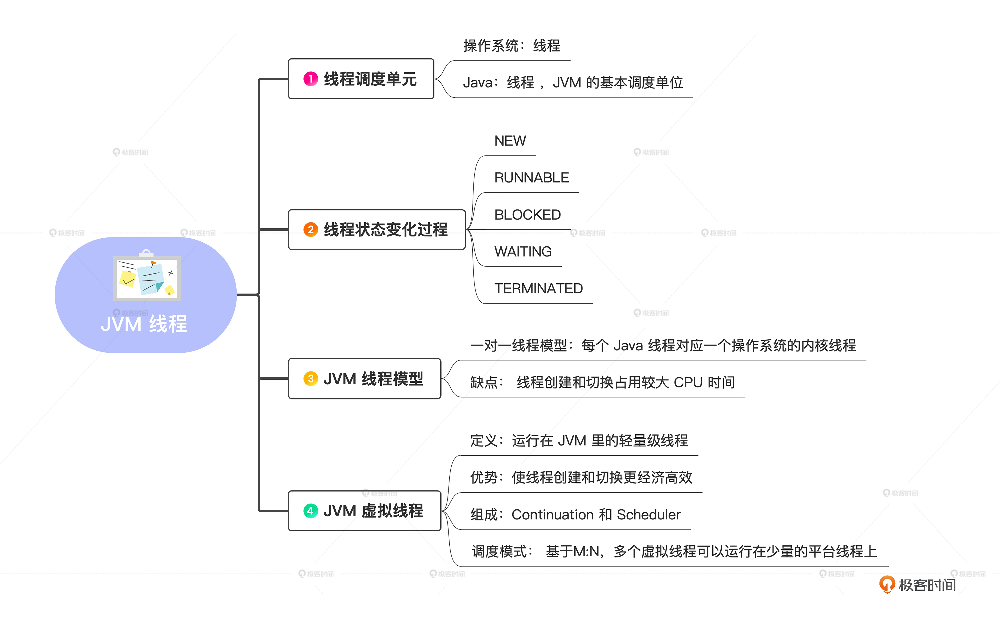
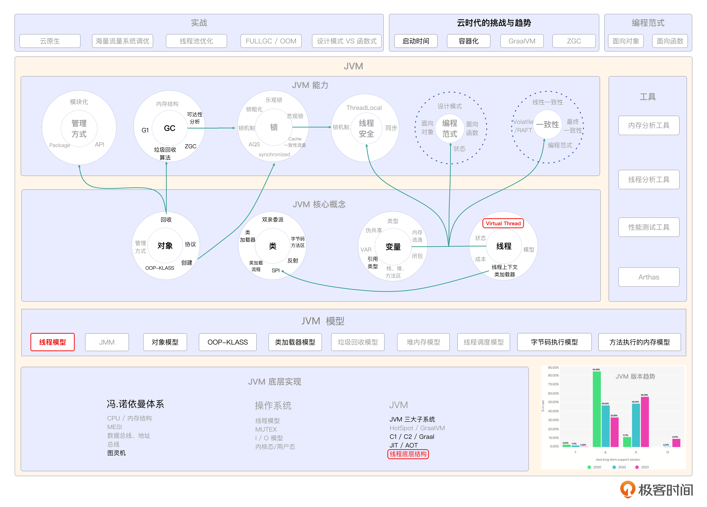

# 19｜云时代的线程模型：领略线程与虚拟线程的风采
你好，我是康杨。

今天我们一起来聊一聊JVM中的线程模型以及JDK 21的关键特性虚拟线程。

在传统的进程模型中，线程是操作系统的基本调度单位，但是会存在一些问题，比如线程的创建和销毁开销比较大，线程之间的切换也会占用大量CPU时间。因此，在Java中，JVM通过使用内核线程来代替用户线程，以减少线程的创建和切换的开销。JVM线程也是Java多线程的实现基础，能够并发执行，共享JVM内存，而且开销比较小。

## 线程的模型

JVM采用了一对一的线程模型，即每个Java线程都对应一个操作系统的内核线程。这种模型通过调用操作系统的内核线程来完成线程的切换和执行，而且每个内核线程可以看作是操作系统内核的一个分身。这也就是操作系统能够处理多任务的原因。

## 线程的状态

在Java虚拟机中，线程状态的变化是一个非常重要的概念。线程状态代表了线程在它的生命周期中所处的不同阶段。在Java中，线程状态可以描述为5种。

1. 当线程对象被创建之后，它会进入新建状态，这个时候它还没有启动运行，也就是说，start()方法还没有调用。
2. 一旦线程启用了start()方法，它就会加入到运行状态。在这个状态下，线程可以继续工作，也可能暂停。
3. 当线程处于等待状态的时候，它会进入阻塞状态。比如，当一个线程在等待synchronized锁的时候，而其他线程已经占用了锁，那么这些线程就会进入阻塞状态。
4. 当一个线程正在等待另一个线程完成特定任务的时候，它会进入等待状态。
5. 当线程执行完所有任务后，它会进入终止状态。

这些状态并不是固定的，我们可以使用Java代码实现不同状态之间的转换，我用一个例子来演示一下。

在这段代码里Runnable对象实例创建并启动5个线程，并用一个共享对象来同步这些线程。然后让这些线程不断地切换状态，展示了线程状态是如何变化的。

```java
public class ThreadStateDemo implements Runnable {

    public void run() {
        System.out.println("当前线程：" + Thread.currentThread().getName() + " 运行");
        synchronized (this) {
            try {
                wait();
            } catch (InterruptedException e) {
                e.printStackTrace();
            }
        }
        System.out.println("当前线程：" + Thread.currentThread().getName() + " 终止");
    }

    public static void main(String[] args) throws InterruptedException {
        ThreadStateDemo tsd = new ThreadStateDemo();
        Thread t1 = new Thread(tsd, "线程1");
        Thread t2 = new Thread(tsd, "线程2");
        Thread t3 = new Thread(tsd, "线程3");
        Thread t4 = new Thread(tsd, "线程4");
        Thread t5 = new Thread(tsd, "线程5");

        System.out.println("新建线程后，线程1状态：" + t1.getState());
        t1.start();
        t2.start();
        t3.start();
        System.out.println("调用start()后，线程1状态：" + t1.getState());
        Thread.sleep(2000);
        System.out.println("等待2秒后，线程1状态：" + t1.getState());

        synchronized (tsd) {
            tsd.notifyAll();
        }
        Thread.sleep(2000);
        System.out.println("等待2秒后，线程1状态：" + t1.getState());

        t4.start();
        t5.start();
        Thread.sleep(2000);
        System.out.println("等待2秒后，线程1状态：" + t1.getState());

        synchronized (tsd) {
            tsd.notifyAll();
        }
        Thread.sleep(2000);
        System.out.println("等待2秒后，线程1状态：" + t1.getState());
    }
}

```

在线程未被激活的情况下，它处于创建状态。然而，一旦启动了线程的start()方法，那么线程就进入了运行状态。请注意，在运行状态中，不同线程状态之间并不具有可比性。

- 一种让线程陷入待机状况的方式是利用wait()函数方法。当使用这个方法时，线程就会加入等待模式。
- 一种让线程陷入阻塞状态的策略是采用synchronized锁。如果线程请求了一个锁，而这个锁被占据，那么线程就会陷入阻塞状态。

当线程执行完所有任务时，它将进入终止状态。

另一个重要的概念是线程状态的变化是由线程调度器来控制的。线程调度器会在不同线程之间切换，以便在每一个时间片内都能够分配足够的时间给所有的线程。

你可以看一下线程状态的转换。



## 虚拟线程（Virtual Thread）

线程是一种昂贵的资源，每个线程的创建和使用都需要占用一定的内存和CPU时间。当需要处理很多并发任务时，创建和管理大量线程可能导致性能下降和资源浪费。为了解决这个问题，Java虚拟线程应运而生。

Java虚拟线程是一种轻量级的线程实现，它不需要像传统线程那样占用大量的内存和CPU时间。相反，它们是在JVM层面上管理的，使用更少的系统资源，并且可以在一个或多个底层操作系统线程上运行，它允许开发人员以更高效和简化的方式处理并发任务。

在已经发布JDK 21版本中，虚拟线程更是其中一项非常重要的更新特性，相信会在未来的一段时间内成为线程实现的优先选择。

### 概念

在之前的讨论中，我们已经提到Java线程和操作系统内核线程是一体化的。实际上，Java线程的调度依赖于应用内核线程。这就要求我们必须进行线程切换和运行，同时也会耗费巨量的系统资源。

尽管我们采用了各类线程池来实现最优的功能效益，但是在CPU、网络或存储器资源用尽前，线程还是会变成软件提升性能的瓶颈。这使得硬件无法充分发挥它本应具备的功能。

虚拟线程就是为了解决这种问题而产生的。原来JDK存在java.lang.Thread类，俗称线程。为了更好地区分虚拟线程和原有的线程类，引入了一个全新类java.lang.VirtualThread，也是Thread类的一个子类型，直译过来就是“虚拟线程”。

更新的JDK文档里也把原来的Thread叫做Platform Thread，可以更清晰地和Virtual Thread区分开来。实际上，Platform Thread这个词语可以被翻译成“平台线程”，它指的是在虚拟线程流行前就已经存在的线程概念。需要注意的是，虚拟线程并不能完全替代平台线程。

虚拟化进程是在网络平台进程之间运作的，单个网络平台进程可能包含数个虚拟化进程。同样，每一个平台线程也都对应着内核线程。由此，我们得到了这样一条结论：VT代表一条虚拟线程。

### 使用方法

```java
public class VirtualThreadTest {

    public static void main(String[] args) {

        Thread.ofVirtual().start(() -> System.out.println("虚拟线程执行中..."));

        Thread.startVirtualThread(() -> System.out.println("虚拟线程执行中..."));

        ExecutorService executorService = Executors.newVirtualThreadPerTaskExecutor();
        executorService.execute(() -> System.out.println("虚拟线程执行中..."));
    }
}

```

代码里提供了两种创建虚拟线程的方法，分别是Thread.ofVirtual().start()方法和Thread.startVirtualThread()方法。此外线程池也支持虚拟线程的使用，我们通过ExecutorService的实现类Executors.newVirtualThreadPerTaskExecutor()创建了线程池，然后通过execute()方法添加了一个虚拟线程。

### 实现原理

虚拟线程最早要溯源到Java的Loom项目，虚拟线程正是Loom的发展结果。Loom项目最初的目标是实现一种新的线程模型，来提供更轻量级和更高效的线程管理方式。

总体上来看，虚拟线程由两个关键组件组成：Continuation（续体）和Scheduler（调度器）。

虚拟线程会将任务（通常是java.lang.Runnable对象）封装到一个Continuation实例中。当任务需要阻塞挂起时，会调用Continuation的yield操作进行阻塞；当任务需要解除阻塞并继续执行时，Continuation会被恢复执行。

Scheduler负责将任务提交给一个线程池来执行。它是java.util.concurrent.Executor的子类。虚拟线程框架为虚拟线程任务提供了一个默认的ForkJoinPool线程池来执行任务。

Continuation是一种编程概念，用来实现轻量级线程切换和挂起的功能。它允许在一个线程中暂停执行，保存当前的执行状态，然后根据我们的需要恢复，并继续执行之前保存的状态。下面是一个使用Continuation的示例，你可以看一下。

```java
public class CoroutineExample {
    static Continuation coroutine;
    static String state = "start";

    public static void main(String[] args) {
        coroutine = new Continuation(new ContinuationScope("coroutine"), () -> {
            while (true) {
                switch (state) {
                    case "task1":
                        System.out.println("Task1 started");
                        state = "task2";
                        Continuation.yield();
                        System.out.println("Task1 completed");
                        break;

                    case "task2":
                        System.out.println("Task2 started");
                        state = "task3";
                        Continuation.yield();
                        System.out.println("Task2 completed");
                        break;

                    case "task3":
                        System.out.println("Task3 started");
                        state = "done";
                        Continuation.yield();
                        System.out.println("Task3 completed");
                        break;
                }
            }
        });

        while (!state.equals("done")) {
            coroutine.run();
        }
        System.out.println("All tasks completed.");
    }
}

```

执行结果：

```java
Task1 started
Task1 completed
Task2 started
Task2 completed
Task3 started
Task3 completed
All tasks completed.

```

在这个例子中，Continuation实例进行yield调用后，再次调用run方法可以从yield的调用位置继续执行，实现了程序中断和恢复的效果。

### 调度方式

由于线程依赖的是操作系统的线程管理机制而不是Java JDK中的任务分配和调配模块，因此这个以OS为基础构建出来的线程没办法被后者控制。相反地，它是由底层硬件提供的、具有独立管理能力的“虚”态处理单元，即所谓的“VT”，也就是我们常说的虚拟化技术下的多核或超核心计算资源共享方式中的一种特殊形式的多路复用策略。

每个物理机上都存在着多个这样的逻辑实体/节点，或者说是一个个可供用户使用的服务实例空间等概念上的抽象体，它们可以根据需要动态创建出来，并在必要时又能够随时销毁掉，而不影响其他部分的功能正常运作状态，这些特性都是非常鲜明的。

JDK中的虚拟线程调度机制是通过把虚拟线程分派到对应的平台线程上完成的。这是一种基于虚拟线程和平台线程之间的M:N调度方式，也就是说，每个虚拟线程都可以被多条平台线程所执行。一旦某个线程的等待队列没有任何待处理的工作，为避免出现线程挨饿的情况，ForkJoinPool实现了任务抢夺策略，也就是让处于挨饿状态的线程能够从其他正在运行的线程的等待队列里获取新的工作任务。

虚拟线程的挂载和卸载过程可以通过伪代码表示。

```java
mount();
try {
    Continuation.run();
} finally {
    unmount();
}

```

可以使用以下代码来验证虚拟线程的挂载和卸载。

```java
public static void main(String[] args) throws Exception {
  var threads = IntStream.range(0, 3).mapToObj(index -> Thread.ofVirtual().unstarted((self) -> {
    System.out.println(Thread.currentThread());
    try {
      Thread.sleep(10);
    } catch (InterruptedException e) {
      throw new RuntimeException(e);
    }
    System.out.println(Thread.currentThread());
  })).toList();

  threads.forEach(Thread::start);
  for (Thread thread : threads) {
    thread.join();
  }
}

```

输出结果：

```java
VirtualThread[#24]/runnable@ForkJoinPool-1-worker-3
VirtualThread[#22]/runnable@ForkJoinPool-1-worker-1
VirtualThread[#23]/runnable@ForkJoinPool-1-worker-2
VirtualThread[#26]/runnable@ForkJoinPool-1-worker-2
VirtualThread[#24]/runnable@ForkJoinPool-1-worker-1
VirtualThread[#23]/runnable@ForkJoinPool-1-worker-3
VirtualThread[#22]/runnable@ForkJoinPool-1-worker-2

```

可以观察到，虚拟线程VirtualThread\[#24\]最初在worker-3上执行，然后重新唤醒后在worker-1上执行。这是因为代码中使用了sleep方法，这个方法会导致虚拟线程切换。

不过有两种状况，虚拟线程会被固定到它运行的平台线程上，没办法进行载入和卸载。

1. 当在synchronized块或方法中执行代码的时候。
2. 当执行native方法或foreign function的时候。

固定虚拟线程不会对程序的正常运行造成负面影响，但可能会削弱系统的并发性和吞吐量。当虚拟线程被设置成阻塞模式的时候，负责执行它的平台线程也会遭遇阻塞。如果虚拟线程没有被设置成阻塞模式，那么在执行阻塞操作的时候会从平台线程里卸载。

所以说，JDK的虚拟线程调度器通过把虚拟线程分配给平台线程来进行调度，其中虚拟线程的挂载和卸载过程是关键步骤。然而，虚拟线程的挂载和卸载在某些情况下会受到限制，这可能会影响系统的并发性能，所以需要你格外注意。

## 重点回顾

进程是操作系统中的基本调度单位，而在Java中，线程是JVM的基本调度单位。线程状态的变化是从NEW到RUNNABLE，再到BLOCKED、WAITING和TERMINATED的过程。Java中采用了一对一的线程模型，也就是说每个Java线程对应一个操作系统的内核线程。这种模型的缺点在于线程的创建和切换会占用较大的CPU时间。为了解决这个问题，JVM引入了虚拟线程。虚拟线程是运行在JVM里的轻量级线程，它可以使线程的创建和切换更加经济高效。

虚拟线程由Continuation和Scheduler两个关键组件共同构成。Continuation是一种编程概念，用来实现轻量级线程切换和挂起的功能。Scheduler负责把任务提交给一个线程池来执行，它类似于ForkJoinPool的线程池，并且是基于FIFO（先进先出）模式进行调度。虚拟线程的调度和挂载/卸载过程是通过调度器实现的，这个过程类似于操作系统中的进程调度。

虚拟线程的使用可以通过Thread.ofVirtual()和Executors.newVirtualThreadPerTaskExecutor()方法进行创建。虚拟线程的调度是基于M:N的，意味着多个虚拟线程可以运行在少量的平台线程上。

## 

## 思考题

学而不思则罔，学完这节课之后，我给你留两个问题。

1. 线程有哪些状态，它们是如何转换的？
2. 虚拟线程是如何调度的？

希望你认真思考，然后把思考后的结果分享到评论区，我们一起讨论，如果有收获的话，也欢迎你把这节课的内容分享给需要的朋友，我们下节课再见！

💡 点亮你的知识框架图

