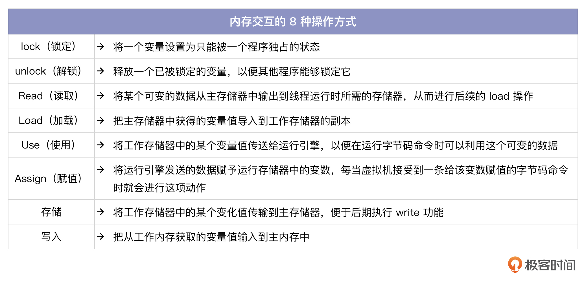
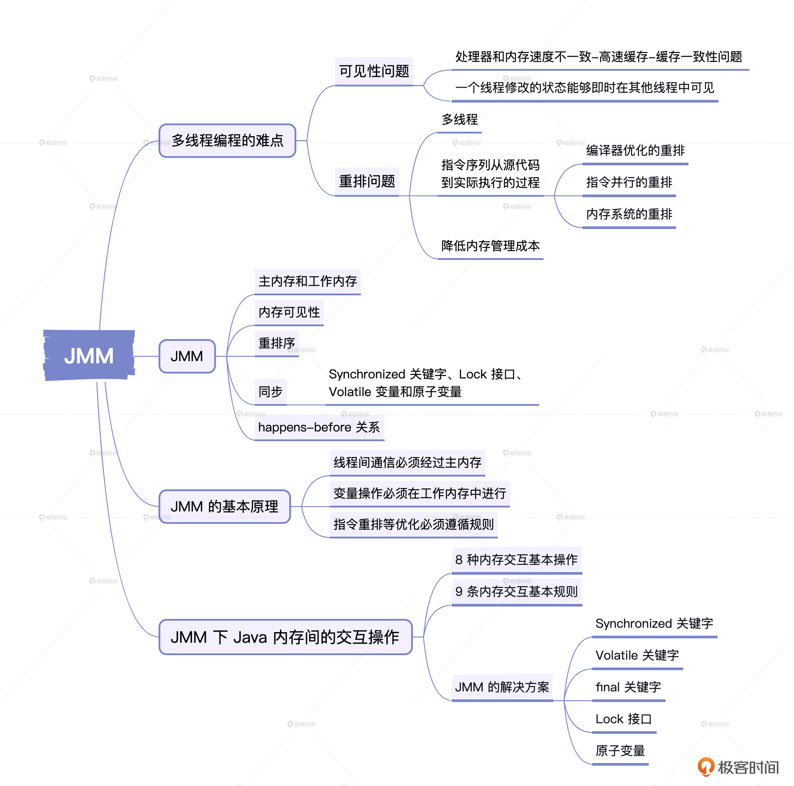
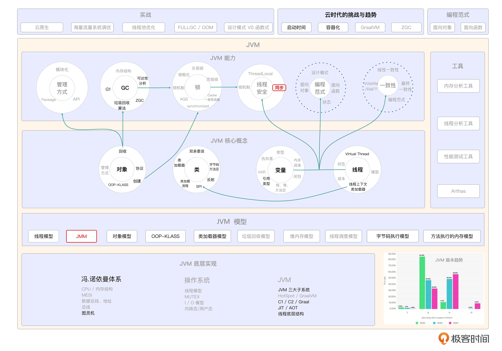

# 20｜JMM：如何打造一个线程安全的程序？
你好，我是康杨。

在编程过程中，你有没有遇到过在运行多线程程序时想用共享变量来通讯，却发现程序结果和预期不一致的情况？这个常见的问题就是多线程编程的难点，涉及 **内存可见性和重排** 等问题。今天我们就来解决这些问题，并探讨JVM如何通过它的内存模型JMM来解决它们。

## 可见性问题

第一个问题出现在处理器和内存之间。现代电脑系统中，处理器速度很快，内存的读写速度却远远不能比肩。为了解决这种矛盾，引入了高速缓存，处理器将计算所需数据复制到缓存，从而加快运算速度。然而，这也引发了缓存的一致性问题，也就是说，在多处理器系统里，如果每个处理器都同时使用相同的内存，那么它们的缓存数据可能会出现差异。

处理器必须按照一些协议进行同步操作，在读写时维持缓存一致性。这里就涉及到内存可见性问题，也就是 **一个线程修改的状态能够即时在其他线程中可见**。

## 重排问题

我们日常写的代码，在实际运行之前，都会经过JVM及底层CPU等各种优化，来达到最优的执行性能。但是这种优化都是基于单线程考虑的优化，如果你的程序是以多线程的方式运行，反而很容易引发各种问题。所以 **对于多线程的程序，知道JVM实际进行了哪些优化非常重要。**

指令序列从源代码到实际执行的过程可能会经历以下三种重新排序。

### 编译器优化的重排

JVM的编译器有可能在保持单线程原有含义的同时，对代码的运作流程进行修正，从而提升运行效率。

示例代码：

```java
public class CompilerOptimizationExample {

private static int a =0;
private static boolean flag = false;

public static void main(String[] args) throws InterruptedException {

Thread thread1= new Thread(()->{
a =1;
flag = true;
});
Thread thread2= new Thread(()->{
if (flag){
System.out.println("a ="+ a);
}
});
thread1.start();

thread2.start();

thread1.join();
thread2.join();
}
}

```

在这个例子中，编译器可能会把 `a =1` 和 `flag = true` 的执行顺序进行重排，也就是先执行 `flag = true` 再执行 `a =1`。这种重排可能导致线程2在执行 `if (flag)` 时, `flag` 已经为true，但是 `a` 还没被赋值为1，导致输出的结果不符合预期。

### 指令并行的重排

指令并行重排属于CPU优化的范畴，对于不存在数据前后依赖的情况，CPU可能会调整指令的执行，将多条指令重叠执行。你可以看一下示例代码。

```java
public class InstructionReorderingExample {

private static int a =0;
private static boolean flag = false;
public static void main(String[] args) throws InterruptedException {

Thread thread1= new Thread(()->{
a =1;
flag = true;
});
Thread thread2= new Thread(()->{
while (!flag);
System.out.println("a ="+ a);
});
thread1.start();
thread2.start();
thread1.join();
hread2.join();
}
}

```

在这个例子中，指令并行可能导致线程2在执行 `while (!flag)` 的时候，由于指令重排， `flag` 已经为true，但是 `a` 的值还没有被刷新到共享内存中，导致输出的结果不符合预期。

### 内存系统的重排

因为处理器利用了缓存以及读写缓冲区，所以负载和保存的任务有可能会混乱地进行。这种重新排序可能会使内存与缓存数据同步时间产生偏差。

```java
public class MemoryReorderingExample {

private static boolean flag = false;
private static int result =0;
public static void main(String[] args) throws InterruptedException {
Thread writerThread = new Thread(()->{
result =1;
flag = true;
});
Thread readerThread = new Thread(()->{
if (flag){
System.out.println("Result:"+ result);
}
});
writerThread.start();
readerThread.start();
writerThread.join();
readerThread.join();
}
}

```

在这个例子中，由于处理器的缓存，在线程2执行 `if (flag)` 时， `flag` 已经为true，但是由于缓存同步的时间差， `result` 的值可能还没有被刷新到缓存中，导致输出的结果不符合预期。

## JMM

Java内存模型是为了解决这些问题而设计的线程安全的解决方案。它是JVM提供的一种抽象概念，描述了多线程之间如何协同工作以及如何访问和改变共享数据。它定义了Java程序和虚拟机之间的互动规则，确保程序在多线程环境下具有一致的内存可见性和操作顺序。

我们先来了解下JMM的一些基本概念。

### 主内存和工作内存

被称为共享记忆的主内存是各个进程可以共同使用的内存空间，而每一个进程都有其独立的工作区，用来保存运行过程中的各种信息和运算成果。当某个进程对某一变量进行读取或修改操作的时候，需要先把相关数据从主存搬到工作区，完成后又需要把改动后的内容重新拷贝回主存。

### 内存可见性

内存可见性是指在不同的线程间对相同的变量值的看法。当一个线程更改了共享变量的数值，另一个线程能否立即察觉到这个新的变量值，这就是所谓的内存可见性问题。

### 重排序

重排序是指编译器和处理器在对程序进行优化时，为了提高程序的运行速度，可能会调整程序的执行顺序。但是，因为程序执行顺序的改变可能会对程序的正确性造成影响，所以编译器和处理器在进行重排序时的时候，必须遵循一定的规则。

### 同步

同步是指通过加锁等方式来保证程序在多线程环境下的正确性。常见的同步手段包括Synchronized关键字、Lock接口、Volatile变量和原子变量等。

### happens-before关系

happens-before关系是指在多线程环境下操作之间的一种关系，可以保证程序在多线程环境下的正确性。JVM中有多种语义规则，如线程锁定解锁规则、Volatile变量规则等都是happens-before关系，这些规则可以让程序员不再需要过多地考虑内存可见性问题。

## JMM的基本原理

Java内存模型针对变量提出了一些基本规则，包括3个方面。

1. 线程间通信必须经过主内存

Java内存模型规定，线程之间的通信必须经过主内存。在多线程系统中，各个线程都有自身实际的任务寄存器，所以它们对主寄存器进行的数据变量运算需要保持同步。当一个线程修改了共享变量的值时，必须确保这个变量的最新值能够立即对其他线程可见。

1. 变量操作必须在工作内存中进行

根据Java内存模式的规则，任何变量动作都应该在工作存储器中执行，不能直接对主存储器执行动作。每个线程在读写、赋值和修改数据变量的时候，都要求在自身的工作内存中完成运算，并把结果并发到主程序。

1. 指令重排等优化必须遵循规则

Java内存模型还明确指出，在执行如命令重排等优化任务的时候，编辑器和管理器需要遵循一些规范。指令执行的顺序必须符合程序在编写时的顺序，不能出现因优化而导致程序运行结果不正确的情况。

## JMM下Java内存间的交互操作

1. 内存交互基本操作

在Java的内存模型中，有8种操作方式来保障主内存和工作内存数据的一致性。



1. 内存交互基本规则

根据Java内存模型的规定，执行以下9条规则才能进行上述的8种操作。

- 读取和载入操作必须按顺序执行，存储和写入操作也必须按顺序执行。
- 读取操作和载入操作、存储操作和写入操作必须配对出现，不允许单独出现。
- 在工作程序中修改变量后，需要把它同步运行到主程序。
- 没办法把工作内存中的变量无意识地同步到主内存。
- 只有在进行载入或赋值操作后，某个数据变量才能被使用或存储。不可以直接在工作存储器中使用未经初始化的数据变量。
- 只有在同一时刻，一个线程才能对一个变量进行锁定，并且必须执行相同的解锁操作才能完成锁定。
- 在对某个变量执行锁定操作之后，工作内存里的这个变量值将被移除，这就需要我们再次进行载入或赋值。
- 一个变量没有被锁定时不允许进行解锁操作，也不允许解锁其他线程锁定的变量。
- 在执行解锁任务之前，必须把参数同步到主内存。

这些规则确保了多线程访问共享变量时的线程安全，并保证了数据的一致性。

## JMM的解决方案

除了上述这些基础的规则，JMM也提供了一些实现这个规则的解决方案。

- Synchronized关键字：Java语言中最基本的同步手段，它可以保证同一时刻只有一个线程会执行临界区内的代码，从而避免了多线程访问共享资源的情况。
- Volatile关键字：保证变量的可见性和有序性。当一个变量被Volatile修饰的时候，修改变量的值会立即被其他线程看见，同时编译器和处理器不会把其指令重排到其他语句之前或之后。
- final关键字：保证被修饰的变量的值只能被赋值一次，也就是说它是一个常量，一旦被赋值后不可修改。
- Lock接口：JDK5提供的一种高级的同步手段，它和Synchronized关键字不同，它可以重入，也就是同一个线程可以多次获取同一个锁。
- 原子变量：保证在多线程环境下，对于变量的增删改操作是原子性的。

## 重点回顾



问题可见性和重排问题是多线程并发编程中经常遇到的两个问题。

可见性就是指在一个线程中，共享变量的修改在另一个线程中不能被看到。这主要是由于处理器和内存的速度不同导致的，处理器会把计算所需的数据复制到缓存里，从而产生了缓存一致性问题。为了解决这个问题， **线程必须按照一些协议进行同步操作，保证修改的状态能够即时在其他线程中可见。**

重排问题是指在翻译器和数据处理器执行代码的时候，对命令顺序执行的再次排列。这种优化是为了提高程序的执行性能，但是在多线程环境下可能导致程序的执行结果不符合预期。 **为了解决重排问题，Java内存模型规定了一些规则，如读取和载入操作必须按顺序执行，存储和写入操作也必须按顺序执行等。**

Java提供了一些策略来应对可见性和重排的问题。其中， **Synchronized 关键字** 能确保在同一时间段内只有一个线程能够执行临界区域的代码，从而防止多线程共享资源的情况发生。 **Volatile 关键字** 可以保证变量的可见性和有序性。 **Lock 接口和原子变量** 也可以提供线程安全的解决方案。此外 **final 关键字** 可以保证被修饰的变量的值只能被赋值一，不可修改。所以说，熟练掌握JMM是写出线程安全的Java程序的基础。

## 思考题

学而不思则罔，学完这节课之后，我给你留两个问题。

1. 在JVM体系中存在几种重排？
2. JMM的解决方案包括哪些？

希望你认真思考，然后把思考后的结果分享到评论区，我们一起讨论，如果有收获的话，也欢迎你把这节课的内容分享给需要的朋友，我们下节课再见！

## 💡点亮你的知识框架图

