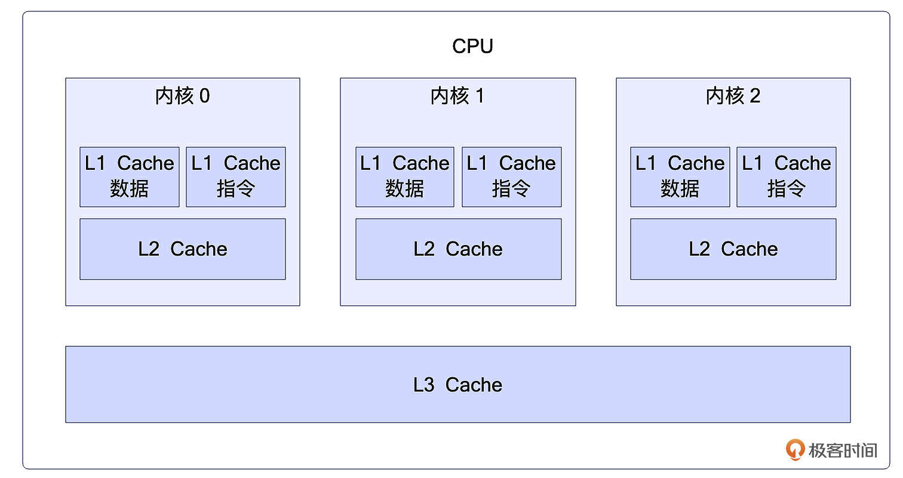
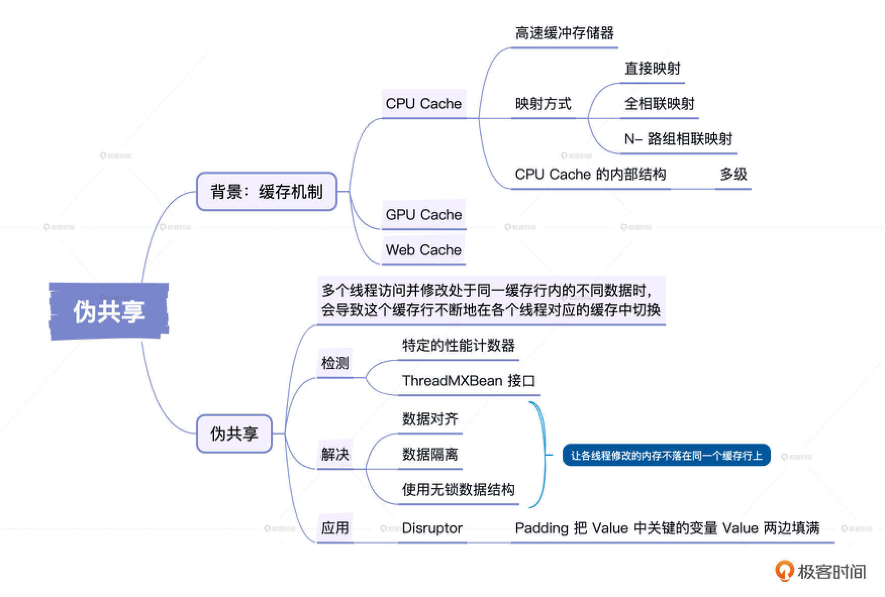
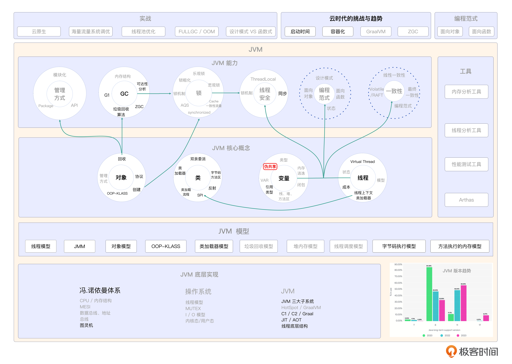

# 21｜伪共享：如何用伪共享打造高并发、高性能的系统？
你好，我是康杨，今天我们来聊伪共享的话题。

伪共享（False Sharing）是高并发系统需要重点关注和优化的点。在计算机科学中，伪共享是多线程环境里的一种性能损失现象，当多个线程访问并修改处于同一缓存行内的不同数据时，会导致这个缓存行不断地在各个线程对应的缓存中切换，从而大大降低了系统性能，这就是所谓的伪共享现象。

## **Cache Line的由来**

在详细介绍伪共享之前，我们先来了解伪共享产生的背景，也就是缓存机制。

在计算机中，缓存（Cache）用于协调速度差异较大的两种硬件之间数据传输速度的差异。例如，CPU 和主存之间就有 cache 进行协调，这种存在于硬件中的 Cache 常见的有 CPU Cache、GPU Cache 等；同时在软件中也有类似的存在，比如 Web Cache。

CPU Cache 是高速缓冲存储器，它位于计算机存储系统中，介于 CPU 和主存储器之间，用来提高 CPU 从主存储器读取或写入数据的速度。它并不使用主存那样的 DRAM 技术，而采用比较快速而且昂贵的 SRAM 技术。随着 CPU 速度的提高，主存和 CPU 之间的速度差异问题日益突出，需要通过 Cache 提高存储系统速度，来提升计算机系统性能。

那么，为什么要使用缓存技术呢？首先，高速缓存是一个小且速度快的存储设备，其命中率高且成本较低、性能优越。通过使用缓存，我们能实现更高效的数据访问和处理。

对于缓存与主存之间的查找和存储，有三种主要的映射方式，分别是 **直接映射、全相联映射和 N-路组相联映射**。直接映射会将内存的每一个块映射到一个固定的 Cache 行中，全相联映射则可以将任意的 Cache 行与任意的 Block 块进行对应关系映射，而 N-路组相联映射则是将 Cache 所有行进行分组，从而把主存块映射到 Cache 固定组的任一行中。

CPU 在读取数据时，会先在 L1 缓存中寻找，如果未命中，再从 L2 缓存寻找，然后是 L3 缓存，再其次是内存，最后是磁盘。如果在缓存中找到数据就意味着缓存命中，如果没找到就称为缓存缺失。

有些情况下，会直接设计多层级的缓存，主要是考虑到物理速度的限制，以及多核技术中，需要在多个 CPU 中进行数据同步的问题。由于 Cache 和 RAM 之间的速度差距很大，因此，设置多级、不同尺寸的缓存有助于提高整体的性能。

接下来，我们要详细研究 CPU Cache 的内部结构。在 Cache 结构图中，我们可以看到，Cache 一般分为多个级别，从 L1、L2 开始往下类推，最后一级也称为 LLC（Last Level Cache）。

L1 缓存分为两种，一种是指令缓存，另一种是数据缓存。L2 和 L3 缓存不区分指令和数据，它们所存储的数据可以被所有的 CPU 核心共享。每个 CPU 核心都有自己的 L1 和 L2 缓存，而 L3 则是所有 CPU 核心共享的缓存。



在 CPU 读取数据的过程中，它通过地址获取数据，并经历了三步：首先是通过组选择找到组索引；然后通过行匹配对比找到一条缓存行；如果找到，需要判断有效性，然后通过偏移来从数据块中获取数据。

这就是缓存机制的由来和它的内部结构，了解了伪共享产生的背景，下面我们继续看伪共享出现的原因以及如何检测及解决这一问题。

## **伪共享**

伪共享出现的主要原因在于 **硬件设计**。每次缓存操作，CPU并不是直接与主存交互，而是以缓存行为单位在主存和缓存间传递数据。如果多个线程同时修改一块内存区域的不同部分，并且这部分内存在同一缓存行内，那么即使这些修改本身无需同步，由于保存这些部分的缓存行会频繁地被标记为无效和重新读取，就会引起伪共享。

假设你的程序中有两个独立的变量A和B，被两个不同的处理器（Processor）P1和P2频繁地修改。在一个理想的世界里，P1和P2应该各自专注于修改自己的变量，而不需要去关注对方的工作结果。然后在需要共享和同步的时候，才会关注彼此的工作。

如下所示：

```plain
Processor P1 -> Variable A
Processor P2 -> Variable B

```

然而在实际的硬件系统中，P1和P2修改它们各自的变量却可能影响到对方的工作。原因就在于缓存。

每一个处理器都有自己的缓存，用来缓存经常使用的数据。然而，缓存行是缓存的一个基本单位，一次缓存操作需要将整个缓存行从内存读到缓存中，或者从缓存写回到内存中。

例如，一个简化的多处理器系统，在起始状态P1和P2各自读取A和B到它们的缓存中。

```plain
Cache P1            Memory            Cache P2
A -----------------> A,B <---------------- B

```

当P1修改了A的值，在缓存中进行更新。然后，为了保持缓存一致性，这个修改需要同步到 Memory 和 P2 的缓存中，即 Cache P2 需要将包含 A 和 B 的整个缓存行从 Memory 中再次读取到缓存中。

```plain
Cache P1 ---------> Memory <--------- Cache P2
A(new)             A(new),B ---------> A(new),B

```

这种情况下，P2 的 B 值并没有发生改变，但是 P2 确实因为 P1 修改 A 的操作，而需要进行额外的内存同步操作。这时候伪共享就产生了。

## **如何检测伪共享？**

针对伪共享，硬件提供了 **特定的性能计数器** 来记录缓存行的命中次数和缓存行失效的次数。为了准确地判断是否发生伪共享，你需要深入理解这些硬件计数器的含义和统计方法。

另外，编程语言和特定的编程库也提供了相应的工具和方法来帮助我们检测和解决伪共享问题。例如，在Java中你可以使用 **ThreadMXBean接口**，这是Java虚拟机的管理接口，可以用来 **监控虚拟机的线程和系统的状态**。

```java
import java.lang.management.ManagementFactory;
import java.lang.management.ThreadInfo;
import java.lang.management.ThreadMXBean;
public class ThreadInfoDemo {
    public static void main(String[] args) {
        // 获取Java虚拟机线程系统的管理Bean
        ThreadMXBean threadMXBean = ManagementFactory.getThreadMXBean();
        // 获取所有当前正在运行的线程的id
        long[] threadIds = threadMXBean.getAllThreadIds();
        System.out.println("线程数量: " + threadIds.length);

        for (long id : threadIds) {
            // 获取线程的信息
            ThreadInfo threadInfo = threadMXBean.getThreadInfo(id);

            // 打印线程的详细信息
            System.out.println("线程id: " + threadInfo.getThreadId() +
                        " , 线程名称: " + threadInfo.getThreadName() +
                        " , 线程状态: " + threadInfo.getThreadState());
        }
    }
}

```

运行此程序，你将看到一系列输出，显示每个线程的id、名称和状态。这是ThreadMXBean接口获取和管理Java虚拟机线程信息的一种方法。

## 如何解决伪共享问题？

解决伪共享的基本思路是 **尽量让各线程修改的内存不落在同一个缓存行上**。常用的解决办法有3种。

1. **数据对齐**：通过数据对齐，可以将多线程操作的数据对齐到缓存行的边界，这样就不会出现一个缓存行上存在两个线程操作的数据的情况。这是最直接和最有效的解决办法。
2. **数据隔离**：在多线程操作的数据之间插入若干无用数据，使这些数据占用多个缓存行，从而避免伪共享。这种办法的缺点是会 **浪费大量内存**。
3. **使用无锁数据结构**：一些设计良好的无锁数据结构，如队列、栈、大部分无锁哈希表等，从设计之初就已考虑到了避免伪共享的问题。使用这些数据结构可以在一定程度上避免伪共享。

伪共享是一个让多线程编程者头疼的问题。无论你的算法设计得有多么巧妙，有伪共享的存在，程序的总体性能都可能受到严重影响。因此理解伪共享的原理，避免伪共享问题对于高性能程序设计至关重要。

## **伪共享案例**

```java
public class FalseSharing implements Runnable {
  // 定义线程数量
  public final static int NUM_THREADS = 4;
  // 重复次数
  public final static long ITERATIONS = 500L * 1000L * 1000L;
  private final int arrayIndex;
  // 创建一个大小为线程数量的 VolatileLong 类型数组
  private static VolatileLong[] longs = new VolatileLong[NUM_THREADS];

  // 初始化数组
  static {
    for (int i = 0; i < longs.length; i++) {
      longs[i] = new VolatileLong();
    }
  }
  // 构造方法
  public FalseSharing(final int arrayIndex) {
    this.arrayIndex = arrayIndex;
  }
  // 主程序入口
  public static void main(final String[] args) throws Exception {
    final long start = System.currentTimeMillis();
    runTest();
    System.out.println("duration = " + (System.currentTimeMillis() - start));
  }
  // 管理多线程的方法
  private static void runTest() throws InterruptedException {
    Thread[] threads = new Thread[NUM_THREADS];
    for (int i = 0; i < threads.length; i++) {
      threads[i] = new Thread(new FalseSharing(i));
    }
    for (Thread t : threads) {
      t.start();
    }
    // 等待所有线程完成
    for (Thread t : threads) {
      t.join();
    }
  }
  // 实现 Runnable 接口的 run 方法
  public void run() {
    long i = ITERATIONS + 1;
    while (0 != --i) {
      longs[arrayIndex].value = i;
    }
  }
  // 优化方法，防止 JIT 编译器优化
  public static long sumPaddingToPreventOptimisation(final int index) {
    VolatileLong v = longs[index];
    return v.p1 + v.p2 + v.p3 + v.p4 + v.p5 + v.p6;
  }
  // 内部类，包含一个 volatile 的 long 类型变量以及其他几个 long 类型变量
  public static class VolatileLong {
    public volatile long value = 0L;
    public long p1, p2, p3, p4, p5, p6; // comment out
  }
}

```

在上面的代码中我创建了几个独立的线程，每个线程都对数组的某个元素进行大量的操作，由于数组中的相邻元素可能在物理内存中相邻，也就是可能在同一个Cache Line中，这样就会引发伪共享。

而 `VolatileLong` 这个类的作用就是增大每个数组元素的大小，让它们达到或超过Cache Line的大小，从而避免在同一Cache Line中，消除伪共享。

如果你试着运行这段程序，会发现注释掉VolatileLong中的填充属性部分后耗时会明显增加，这是因为在没有内存对齐时伪共享对性能的影响显著。

需要注意的是，现在Java 8已经开始用 `sun.misc.Contended` 这个注解来解决伪共享问题了。这个注解的作用就是在被注解的字段前后都进行填充，使其占满整个Cache Line，避免出现伪共享。

```java
@jdk.internal.vm.annotation.Contended
public static class PaddedLong {
        volatile long value = 0L;
}

```

## **开源项目中应用伪共享**

Disruptor是一个在高性能场景中广泛使用的开源并发框架，Disruptor的设计中专门考虑到了避免伪共享的问题。它的关键数据结构RingBuffer（环形缓冲区），通过一定长度的padding将每个数据项间隔开，确保每个数据项独立存在于不同的Cache Line中。这样做的好处在于极大地提高了数据的并行访问效率。

以下是一段典型的代码：

```java
public abstract class LhsPadding{
protected long p1, p2, p3, p4, p5, p6, p7;
}
public abstract class Value extends LhsPadding{
protected volatile long value;
}
public final class Sequence extends Value{
private long p9, p10, p11, p12, p13, p14, p15;
}

```

代码中，Sequence是实际使用的类，它继承自抽象类Value，同时Value又继承自LhsPadding。类Sequence和LhsPadding中的变量p1到p7，以及p9到p15，实际上没有什么用处，它们唯一的作用就是起到Padding的效果，把Value中关键的变量value的两边“填满”，这样就强迫CPU把“value”放入一个独立的Cache Line，进而避免了伪共享。

在Disruptor中，通过特殊的数据结构设计，使每一个真实的、需要处理的数据（如value）都被一些无用的变量（padding）所包围。这确保了每个需要处理的数据都占据了完整的一个缓存行，有效避免了多个线程操作同一缓存行从而导致的伪共享问题。当然，就像我们前面说的，这样也会浪费掉一些空间。不过这也算是一个用空间换时间思想的应用，所以并不适用于所有的场景。

## 重点回顾



缓存是计算机用来管理、协调不同速度硬件间数据传输差异的工具，这意味着它充当了CPU和主存之间的“中介”，来提高数据读取和写入的速度。缓存行则是CPU高速缓存中存储数据的单位。如果多个线程试图修改存在于同一个缓存行的不同数据，可能会导致所谓的伪共享现象，从而降低系统的整体性能。

为了避免这一问题，我们可以采用数据对齐、数据隔离或使用无锁数据结构的方法。特定的编程库和语言，如Java和Disruptor，也提供了工具和方法来解决这一问题。在Disruptor中，每个数据项被一定长度的“填充”隔离开，确保每个数据项独立存在于不同的Cache Line中，从而提高了数据的并行访问效率。

## 思考题

最后请你来思考 2 个问题。

1. 伪共享是如何产生的？
2. 如何避免伪共享来提升性能？

欢迎你把你思考后的结果分享到评论区，也欢迎你把这节课的知识分享给需要的朋友，我们下节课再见！

💡 点亮你的知识框架图

